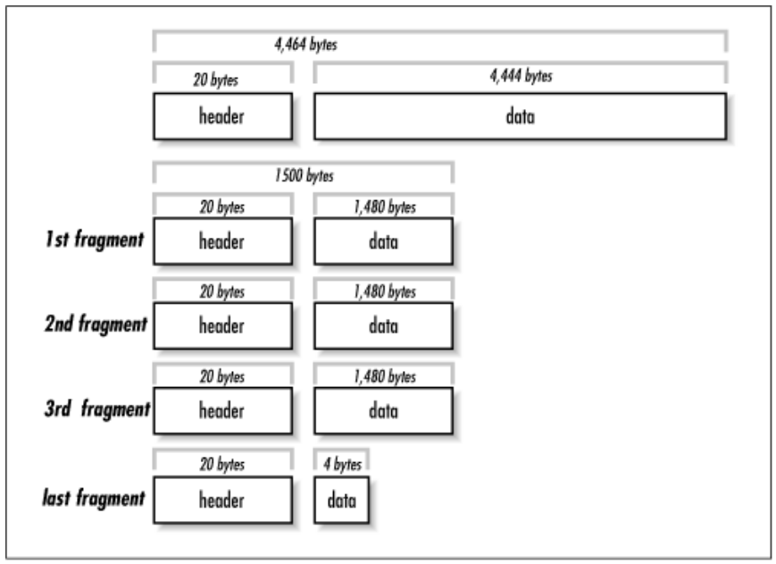

# Invocação Remota de Procedimentos - RPC

## Abaixo os Sockets!

O desenvolvimento de sistemas distribuídos usando diretamente Sockets como forma de comunicação entre componentes não é para os fracos de coração.
Sua grande vantagem está no **acesso baixo nível à rede**, e todo o ganho de desempenho que isso pode trazer.
Suas desvantagens, entretanto, são várias:
* interface de "arquivo" para se ler e escrever bytes;
* controle de fluxo de "objetos" é por conta da aplicação, isto é, a aplicação precisa sinalizar quantos bytes serão escritos de um lado, para que o outro saiba quanto ler para obter um "objeto" correto;
* logo, a serialização e desserialização de objetos é também por conta da aplicação;
* tratamento de desconexões e eventuais reconexões também é gerenciado pela aplicação, e nem a tão famosa confiabilidade do TCP ajuda.

## Representação de dados

Enquanto se poderia argumentar que algumas destas desvantagens podem ser descartadas em função da discussão de incluir ou não API na comunicação [fim-a-fim](http://web.mit.edu/Saltzer/www/publications/endtoend/endtoend.pdf), é certo que algumas funcionalidades são ubíquas em aplicações distribuídas.
Uma delas é a serialização de dados complexos.
Imagine-se usando um tipo abstrato de daados com diversos campos, incluindo valores numéricos de diversos tipos, strings, aninhamentos, tudo somando vários KB.
Você terá que se preocupar com diversos fatores na hora de colocar esta estrutura *no fio*:
* tipos com definição imprecisa
  * Inteiro: 16, 32, 64 ... bits?
* ordem dos bytes
  * little endian?
    * Intel x64, 
    * IA-32
  * big endian?
    * IP
    * SPARC (< V9), 
    * Motorola, 
    * PowerPC
  * bi-endian
    * ARM, 
    * MIPS, 
    * IA-64
* Representação de ponto flutuante
* Conjunto de caracteres
* Alinhamento de bytes
* Linguagem mais adequada ao problema e não à API socket
  * Classe x Estrutura
* Sistema operacional
  * crlf (DOS) x lf (Unix)
* fragmentação <br>
  [](http://www.acsa.net/IP/)

Uma abordagem comumente usada é a representação em formato textual "amigável a humanos".
Veja o exemplo de como o protocolo HTTP requisita e recebe uma página HTML.
```HTML
telnet www.google.com 80
Trying 187.72.192.217...
Connected to www.google.com.
Escape character is '^]'.
GET / HTTP/1.1
host: www.google.com

```
As linhas 5 e 6 são entradas pelo cliente para requisitar a página raiz do sítio [www.google.com](https://www.google.com).
A linha 7, vazia, indica ao servidor que a requisição está terminada.

Em resposta a esta requisição, o servidor envia o seguinte, em que as primeiras linhas trazem metadados da página requisitada e, após a linha em branco, vem a resposta em HTML à requisição.

```HTML
HTTP/1.1 302 Found
Location: http://www.google.com.br/?gws_rd=cr&ei=HTDqWJ3BDYe-wATs_a3ACA
Cache-Control: private
Content-Type: text/html; charset=UTF-8
P3P: CP="This is not a P3P policy! See https://www.google.com/support/accounts/answer/151657?hl=en for more info."
Date: Sun, 09 Apr 2017 12:59:09 GMT
Server: gws
Content-Length: 262
X-XSS-Protection: 1; mode=block
X-Frame-Options: SAMEORIGIN
Set-Cookie: NID=100=NB_AruuFWL0hXk2-h7VDduHO_UkjAr6RaqgG7VbccTsfLzFfhxEKx21Xpa2EH7IgshgczE9vU4W1TyKsa07wQeuZosl5DbyZluR1ViDRf0C-5lRpd9cCpCD5JXXjy-UE; expires=Mon, 09-Oct-2017 12:59:09 GMT; path=/; domain=.google.com; HttpOnly

<HTML><HEAD><meta http-equiv="content-type" content="text/html;charset=utf-8">
<TITLE>302 Moved</TITLE></HEAD><BODY>
<H1>302 Moved</H1>
The document has moved
<A HREF="http://www.google.com.br/?gws_rd=cr&amp;ei=HTDqWJ3BDYe-wATs_a3ACA">here</A>.
</BODY></HTML>
```

Representações textuais são usadas em diversos protocolos como SMTP, POP, e telnet.
Algumas destas representações seguem padrões formalizados, o que facilita a geração e interpretação dos dados. 
Dois padrões bem conhecidas são XML e JSON.

[XML](https://xml.org) é o acrônimo para *Extensible Markup Language*, ou seja, uma linguagem marcação que pode ser estendida para representar diferentes tipos de informação.
A HTML, por exemplo, é uma instância de XML destinada à representação de hipertexto (A bem da verdade, XML foi uma generalização de HTML).

Por exemplo, para representarmos os dados relativos à uma pessoa, podemos ter uma instância XML assim:

```xml
<person>
    <name>John Doe</name>
    <id>112234556</id>
    <email>jdoe@example.com</email>
    <telephones>
       <telephone type="mobile">123 321 123</telephone>
       <telephone type="home">321 123 321</telephone>
    </telephones>
</person>
```

Uma das grandes vantagens do uso de XML é a possibilidade de se formalizar o que pode ou não estar em um arquivo para um certo domínio utilizando um [XML *Domain Object Model*](https://docs.microsoft.com/pt-br/dotnet/standard/data/xml/xml-document-object-model-dom). Há, por exemplo, modelos para representação de documentos de texto, governos eletrônicos, representação de conhecimento, [etc](http://www.xml.org/).
Sua maior desvantagem é que é muito verborrágico e por vezes complicado de se usar, abrindo alas para o seu mais famoso concorrente, JSON.


[JSON](http://json.org/) é o acrônimo de *Javascript Object Notation*, isto é, o formato para representação de objetos da linguagem Javascript.
Devido à sua simplicidade e versatilidade, entretanto, foi adotado como forma de representação de dados em sistemas desenvolvidos nas mais diferentes linguagens.
O mesmo exemplo visto anteriormente, em XML, é representado em JSON assim:

```json
{
    "name": "John Doe",
    "id": 112234556,
    "email": "jdoe@example.com",
    "telephones": [
        { "type": "mobile", "number": "123 321 123"},
        { "type": "home", "number": "321 123 321"},
    ]
}
```

Em Python, por exemplo, JSON são gerados e interpretados nativamente, sem a necessidade de *frameworks* externos, facilitando seu uso.
Mas de fato, a opção final por XML ou JSON é questão de preferência, uma vez que os dois formatos são, de fato, equivalentes na questão da representação de informação.

Outros formatos, binários, oferecem vantagens no uso de espaço para armazenar e transmitir dados, e por isso são frequentemente usados como forma de *serialização* de dados em sistemas distribuídos, isto é, na transformação de TAD para sequências de bytes que seguirão "no fio".

* ASN.1 (Abstract Syntax Notation), pela ISO
* XDR (eXternal Data Representation)
* Java serialization
* Google Protocol Buffers
* Thrift

ASN.1 e XDR são de interesse histórico, mas não os discutiremos aqui.
Quanto à serialização feita nativamente pelo Java, por meio de `ObjectOutputStreams`, como neste [exemplo](https://www.tutorialspoint.com/java/java_serialization.htm), embora seja tentadora para quem usa Java, é necessário saber que ela é restrita à JVM e que usa muito espaço, embora minimize riscos de uma desserialização para uma classe diferente.

Outras alternativas, com codificações binárias são interessantes, dentre elas, ProtoBuffers e Thrift.

### ProtoBuffers

Nas palavras dos [criadores](https://developers.google.com/protocol-buffers/),
> Protocol buffers are a language-neutral, platform-neutral extensible mechanism for serializing structured data.

Por meio de protobuffers, é possível estruturar dados e gerar o código correspondente em diversas linguagens, for forma compartilhável entre as mesmas. Veja o exemplo a seguir, que especifica os dados referentes a uma pessoa. 
Observe a presença de campos de preenchimento opcional (**optional**), de enumerações (**enum**), e de coleções (**repeated**).

```protobuf
message Person {
	required string name = 1;
	required int32 id = 2;
	optional string email = 3;
	enum PhoneType {
		MOBILE = 0;
		HOME = 1;
		WORK = 2;
	}
	message PhoneNumber {
		required string number = 1;
		optional PhoneType type = 2 [default = HOME];
	}
	repeated PhoneNumber phone = 4;
}
```

Com tal definição é possível gerar código como o seguinte, em C++, que serializa os dados para escrita em um arquivo...

```c++
Person person;
person.set_name("John Doe");
person.set_id(1234);
person.set_email("jdoe@example.com");
fstream output("myfile", ios::out | ios::binary);
person.SerializeToOstream(&output);
```

e lê do arquivo e desserializa para hidratar um novo objeto.

```c++
fstream input("myfile", ios::in | ios::binary);
Person person;
person.ParseFromIstream(&input);
cout << "Name: " << person.name() << endl;
cout << "E-mail: " << person.email() << endl;
```

De acordo com *benchmarks* do próprio [projeto](https://developers.google.com/protocol-buffers/docs/overview), a operação em XML seria mais órdens de grandeza mais lenta e ocuparia mais espaço.

> When this message is encoded to the protocol buffer binary format, it would probably be 28 bytes long and take around 100-200 nanoseconds to parse. The XML version is at least 69 bytes if you remove whitespace, and would take around 5,000-10,000 nanoseconds to parse.

### Thrift

TODO

## RPC

Apesar dos mecanismos de serialização de dados disponíveis, apenas discutidos, a complexidade de se programar usando sockets por ainda se muito grande. 
Um das razões para isto, é que desenvolvedores estão acostumados a pensar em termos de funções, métodos e procedimentos, mas a comunicação por meio de sockets impõe um paradigma de **troca de mensagens**.
Isto é, em vez de pensar em termos de uma função sendo invocada, recebendo parâmetros e retornando resultados, com o uso de sockets é preciso "escrever em um arquivo" qual operação executar e quais os seus parâmetros de entrada, usando apenas o equivalente a funções de leitura e escrita.
Sem dúvidas, seria mais fácil continuar pensando em termos de funções, mas que são executadas em processos possivelmente remotos.
É exatamente aí que entra a Invocação Remota de procedimentos, ou RPC, do inglês *Remote Procedure Call*.


\subsection{RPC}
\begin{frame}{Remote Procedure Calls}
	Birrel e Nelson (1984): mecanismo para invocação de procedimentos em outros processos/máquinas.
	
	\lstinline[language=c]|x = substring(a,3,"teste"); //procura "teste" em a, a partir do indice 3.|
	
	Onde \lstinline[language=c]|substring| está em outra máquina.
\end{frame}


\begin{frame}[fragile]{Invocação Local}
	\lstinline[language=c]|x = substring(a,3,"teste"); //procura "teste" em a, a partir do indice 3.|
	
	\begin{itemize}
		\item coloque o endereço de \lstinline[language=c]|"teste"| na pilha.
		\item coloque \lstinline[language=c]|3| na pilha.
		\item coloque o valor de \lstinline[language=c]|a| na pilha.
		\item salte para substring (dados de controle também irão na pilha)
		\item ...
		\item coloque resultado no acumulador
		\item limpe a pilha
		\item salte de volta
		\item coloque resultado em \lstinline[language=c]|x|
	\end{itemize}
\end{frame}
\note{Uma invocação local envolve manipulação de memória local, que não está disponível a uma máquina remota.
	
	Como simular uma invocação local em outra máquina?
}


\begin{frame}{Invocação remota}
Não há pilha compartilhada entre chamador e chamado.
\end{frame}


\begin{frame}[allowframebreaks]{Invocação Remota}
	Simula invocação local usando invocações locais de funções que usam sockets.
	
	\begin{itemize}
		\item Stub/Skeleton 
		
		\framebreak
		
		\item Stub cliente: função substring(char*, int, char*) que
		\begin{itemize}
			\item abre socket para servidor
			\item envia parâmetros
			\item especifica função
			\item espera resposta
			\item retorna resultado
		\end{itemize}
		\item Stub servidor (skeleton)
		\begin{itemize}
			\item espera conexão
			\item recebe parâmetros
			\item recebe especificação da função
			\item invoca função localmente
			\item envia resultado para cliente
		\end{itemize}
	\end{itemize}
	
	\includegraphics[width=.8\textwidth]{images/stubskeleton}
	\vfill
	Marshalling: representar parâmetros de forma própria para transmissão "no fio".
\end{frame}

	Cliente invoca função no stub cliente, achando que é a função que quer executar.
	
	Stub cliente faz o "marshaling" dos parâmetros e usa o SO para transferir os dados via rede para o stub servidor.
	
	Stub servidor faz o "unmarshalling" dos dados.
	
	Stub servidor invoca a função localmente na aplicação servidor e pega o resultado.
	
	O caminho inverso é usado para o resultado.


\begin{frame}{Stub cliente}
	\begin{itemize}
		\item Marshalling e Unmarshalling
		\item Comunicação
	\end{itemize}
\end{frame}

O stub cliente é responsável por manipular os dados e estabelecer a comunicação. Não subestime a complexidade disso.

\begin{frame}{Stub servidor/Skeleton}
	\begin{itemize}
		\item Multiplexação de clientes
		\item Marshalling e Unmarshalling
	\end{itemize}
\end{frame}

O stub servidor tem a funcao de dispatcher e skeleton. O dispatcher é essencial quando múltiplas funções estão disponíveis. Em alguns setups eles podem estar fundidos.

\begin{frame}{Benefícios}
	\begin{itemize}
		\item Interface baseada em procedimentos
		\item Mais fácil escrever aplicações distribuídas (portas? sockets? codificação?)
		\item Camada de sessão 5:
		gerenciamento de conexões
		\item Camada de apresentação 6:
		marshalling
		\item Tudo é transparente!!!!
	\end{itemize}
\end{frame}

\begin{frame}{Transparência}
	Tudo corre como se a execução fosse local, de forma transparente ao programador. 
	
	\pause
	
	Será?
	\begin{itemize}
		\item passagem de parâmetro por referência?
		\item onde se conectar?
		\item segurança
		\item latência
		\item como lidar com erros?
	\end{itemize} 
\end{frame}


\begin{frame}{Passagem por referência}
	\begin{itemize}
		\item Passagem por referência passa o valor de um endereço.
		\item Como skeleton acessa um endereço no cliente?
		\begin{itemize}
			\item Requisita dado ao cliente
			\item Dado é enviado
			\item Dado é modificado
			\item Dado é retornado
			\item Dado é sobrescrito.
		\end{itemize}
		\item Como passar um grafo como parâmetro?
		\item Java serializa todo o grafo.
	\end{itemize}
\end{frame}


\begin{frame}{Onde se conectar?}
	\begin{itemize}
		\item Páginas amarelas (Birel e Nelson)
		\item Quem administra?
		\item Mesmo serviço em múltiplos lugares?
	\end{itemize}
\end{frame}

\begin{frame}{Onde está meu servidor?}{Banco de dados Distribuído}
	\begin{itemize}
		\item Cada servidor mantém sua própria lista
		\item Como se descobrem?
	\end{itemize}
\end{frame}

\begin{frame}{Cadê minha resposta?}
\begin{itemize}
	\item Latência
	\item Quando parar de esperar?
\end{itemize}
\end{frame}


\begin{frame}{Tratamento de erros}
	\begin{itemize}
		\item Se servidor quebra, cliente fica esperando
		\item Erro de conexão
		\item Não há transparência total em sistemas distribuídos
	\end{itemize}
\end{frame}


\begin{frame}{Tratamento de erros}
	\begin{itemize}
		\item Invocação local: exatamente 1 vez
		\item Invocação remota:
		\begin{itemize}
			\item 0: falhas
			\item 1: tudo funcionou
			\item $\geq 1$: retransmissão
		\end{itemize}
	\end{itemize}
\end{frame}


\begin{frame}{Múltiplas Invocações}
	\begin{itemize}
		\item Frameworks RPC oferecem
		\begin{itemize}
			\item at least once
			\item at most once
		\end{itemize}
		\item Entenda suas funções
		\begin{itemize}
			\item idempotente: pode ser invocada múltiplas vezes (x = 10)
			\item não idempotente: múltiplas invocações tem efeitos distintos (x += 10)
		\end{itemize}
		\item Projete para idempotência!
	\end{itemize}
\end{frame}

\begin{frame}{Concorrência}
\begin{itemize}
	\item Múltiplos clientes acessando o mesmo servidor
	\item Dados compartilhados
	\item Controle de concorrência
\end{itemize}
\end{frame}


\begin{frame}{Outros fatores}
	\begin{itemize}
		\item Latência
		\item Segurança
		\begin{itemize}
			\item Conexão precisa de sigilo?
			\item Dados precisam de sigilo?
			\item Autenticação e autorização
		\end{itemize}
	\end{itemize}
\end{frame}


\subsection{Frameworks}
\begin{frame}{Linguagens}
	\begin{itemize}
		\item Sem RPC: C, C++, Java < 5.0 (1.5), Python
		\item Com RPC: Java, Go, Erlang, Scala, Haskell
		\item Ambientes heterogêneos: Thrift, gRPC, Akka, SOAP
	\end{itemize}
\end{frame}

\begin{frame}[allowframebreaks]{IDL: Interface Definition Language}
	\begin{itemize}
		\item Linguagem de definição de
		\begin{itemize}
			\item serviços acessados remotamente
			\item estruturas de dados usadas no serviços
		\end{itemize}
		\item Pre-compilador
		\begin{itemize}
			\item Gera stubs e skeletons
		\end{itemize}
	\end{itemize}
	
	\centering
	\includegraphics[width=.6\textwidth]{images/idl}
	
\end{frame}


\begin{frame}{Cliente}
	\begin{itemize}
		\item Inicializar RPC
		\begin{itemize}
			\item Tipo de transporte
			\item SSL?
			\item Localizar servidor
		\end{itemize}
		\item Lidar com falhas
	\end{itemize}
\end{frame}

\begin{frame}{Servidor}
	Nadie, nill, zip, nulla! \pause Em geral...
\end{frame}

\begin{frame}{Como o sistema RPC é construído?}
	\begin{itemize}
		\item Naming: exportar e localizar serviços
		\item Gerenciamento de portas
		\item Conexões
	\end{itemize}
\end{frame}


\begin{frame}[fragile]{Referências}
	\begin{itemize}		
		\item \url{https://www.madboa.com/geek/openssl/#cs-smtp}
		\item \url{https://developers.google.com/protocol-buffers/docs/overview}
		\item  \url{https://www.cs.rutgers.edu/~pxk/417}		
	\end{itemize}
\end{frame}
