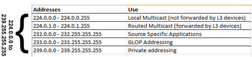

O desenvolvimento de qualquer sistema distribuído requer a capacidade de componentes deste sistema "conversar" uns com os outros.
Para que a conversa aconteça, são necessários um canal e um protocolo de comunicação.

---
* Canal de comunicação
* Protocolo de comunicação

---

O canal de comunicação é o meio pelo qual os elementos da conversa são transmitidos e o protocolo são as regras codificam tal conversa.
Por exemplo, quando você fala com uma pessoa, cara a cara, o meio de comunicação é o ar, e o protocolo utilizado é a linguagem escolhida, Português por exemplo, e os sinais usados para indicar quando um ou outro quer ou pode falar.

Quanto aos canais de comunicação, estes podem ter diversas formas:

---
* Ponto-a-ponto
  * Eficiente
  * Caro para muitos nós
  * Roteamento trivial
* Compartilhado
  * Colisões
  * Menor custo
  * Roteamento mais complicado

---

Nas redes atuais, pode se dizer que o meio mais utilizado é provido pela arquitetura Ethernet, que trata da comunicação nós usando um barramento compartilhado.
Sobre este meio, são usados protocolos para, por exemplo,

---
* Acesso ao meio 
* Transmissão de mensagens
* Se evitar e tratar colisões

---

As redes Ethernet, contudo, cobrem pequenas áreas, e para se ter conversas "mais interessantes", é necessário se conecte diversas destas redes.
A conversa então é feita por meio de intermediários, permitindo que mensagens de um interlocutor sejam **roteadas** para o outro, via tais intermediários.
Um exemplo interessante das questões ligadas à manutenção da conversa entre dois pontos é a decisão Packet Switching x Circuit Switching:

---
* Packet Switching
  * Dados divididos em pacotes
  * Cada pacote viaja independentemente
  * Pacotes são perdidos
  * Latência variável
* Circuit switching
  * Caminho dedicado
  * Recursos reservados
  * Pacotes de tamanho fixo
  * Latência constante

---

Outra questão é quanto à confiabilidade na transmissão dos elementos da conversa, isto é, se a rede deve garantir ou não que uma algo "dito" por um interlocutor deve garantidamente ser "ouvido"  pelo outro, ou se a mensagem pode ser perdida no meio.

Felizmente boa parte da complexidade da resolução destas questões é abstraída do desenvolvedor (**você**) dos sistemas distribuídos, lhe cabendo apenas a decisão de qual protocolo utilizar. 
Nas redes atuais, a conversa em componentes será feita, em algum nível, por meio dos protocolos da arquitetura **Internet**.

---
* Internetworking Protocol
* Redes subjacentes são abstraídas
* Melhor esforço
* Roteadores conectam as redes.

---

# A Internet
	


Cada camada conversa com a equivalente do outro lado. Na prática, a comunicação desce e sobe a pilha. Cada camada é responsável por:

* Bits
* Frames/quadros; controle de fluxo; acesso ao meio.
* Datagramas/pacotes; roteamento
* Controle de fluxo; fim a fim; confiabilidade; tcp e udp
* Streams/fluxos; conexões lógicas; restart; checkpoint; http, ssl
* Objetos; json, xml; criptografia
* Aplicações; http, pop, ftp
* Headers das camadas superiores são dados nas camadas inferiores


---
###### OSI x Internet
	
[](http://computing.dcu.ie/~humphrys/Notes/Networks/intro.2.html)

---


Internet Protocol
* Bibliotecas/middleware provêm o restante das funcionalidades
  * (De)Serialização
	* Nomeamento
	* Criptografia
	* Replicação
	* Invocação remota de procedimentos
	* ...

---


## Sockets

* Hosts
  * Cada interface tem um endereço MAC \pause -- Somente comunicação direta
  * Cada interface tem um endereço IPv4/IPv6 \pause -- 32 x 128 bits
  * Como falar com uma aplicação?

* Sockets
  * Pontos finais da comunicação
  * Porta: 16 bits
    * [IANA](http://www.iana.org) (Internet Assigned Numbers Authority)
      * Bem conhecidas -- 0-1023
      * Proprietárias -- 49151
	    * Dinâmicas -- 65535
  * Domínio: AF\_INET (Internet), PF\_UNIX, PF\_X25..., PF\_INET (Internet)
  * Tipo: SOCK\_STREAM x SOCK\_DGRAM (TCP x UDP)
  * Utilizado como um arquivo
  * Protocolo: por sua conta
  
---


---


---


### Exemplo - TCP

O seguinte arquivo pode ser nomeado, por exemplo, `server.py`, mas não pode, de forma alguma, ser nomeado `socket.py`.

```Python
#server.py
#!/usr/bin/python                               # This is server.py file

import socket                                   # Import socket module

s = socket.socket()                             # Create a socket object
host = socket.gethostname()	               # Get local machine name
port = 12345                                    # Reserve a port for your service.
s.bind((host, port))                            # Bind to the port

s.listen(5)                                     # Now wait for client connections.
while True:
   c, addr = s.accept()                         # Establish connection with client.
   print('Got connection from', addr)
   c.send('Thank you for connecting'.encode())
   c.close()                                    # Close the connection
```

Para executá-lo, faça

```bash
python server.py
```
em um terminal e em outro faça
```bash
telnet localhost 12345
# ou
netcat localhost 12345
```

Em Java, a criação do socket seria muito mais simples, consistindo apenas em: 
```Java
...
Socket s = new ServerSocket(port);
...
```
Do lado cliente, estabelece-se uma conexão apontando-se para onde está o servidor.
```Python
#client.py

#!/usr/bin/python                               # This is client.py file

import socket                                   # Import socket module

s = socket.socket()                             # Create a socket object
host = socket.gethostname()                # Get local machine name
port = 12345                                    # Reserve a port for your service.

s.connect((host, port))
data = s.recv(1024)
print(data.decode())
s.close()                                         # Close the socket when done
```

E para se executar o cliente, faça:
```bash
python client.py
```
O cliente em Java também é simplificado.
```Java
...
Socket s = new Socket(hostname,port);
...
```
Observe que o `socket.close()` encerra a conexão do lado de quem invoca. Na contraparte, invocações a `socket.recv()` retornam com 0 bytes lidos.

### Exercício: Ping-Pong

Modifique cliente e servidor tal que o cliente envie uma mensagem passada na linha de comando ao servidor e fique esperando uma resposta, e tal que o servidor fique esperando uma mensagem e então solicite ao operador que digite uma resposta e a envie para o cliente. O loop continua até que o usuário digite SAIR, e a conexão seja encerrada.

```bash
#Terminal 1
python server.py
Esperando conexão.
Esperando mensagem.
Mensagem recebida: lalala
Digite resposta: lelele
Resposta enviada.
Conexão encerrada.
Esperando conexão.

#Terminal 2
python client.py
Digite mensagem: lalala
Mensagem enviada.
Esperando resposta.
Resposta recebida: lelele
Digite mensagem: SAIR
Desconectando.
```

Observe que para ler do teclado em Python 2 você deve usar `x = raw_input()`, enquanto que em Python 3 seria `x = input()`. Além disso, em Python, você deve remover as invocações para `encode` e `decode`.


### UDP 

No exemplo anterior, usamos o protocolo TCP (o padrão da API). Caso quiséssemos usar UDP, precisaríamos nos atentar a alguns detalhes.

A criação do socket é feita explicitando-se o uso de **datagramas**
* `s = socket.socket(socket.AF_INET,socket.SOCK_DGRAM)`

Um servidor UDP não executa `listen` ou `accept` e, em Python, simplesmente executa `data, addr = sock.recvfrom(4096)` para receber o datagrama, onde
* `data` é o conteúdo recebido e  
* `addr` o endereço de quem enviou o datagrama.

Neste caso, um mesmo socket é usado para manter comunicação com múltiplos interlocutores. Para enviar uma resposta a um interlocutor em específico, `addr` é usado: `sent = sock.sendto(data, addr)`, onde `sent` é a quantidade de bytes enviados.

Além deste detalhe, outros são importantes:
* falta de ordem
* falta de confiabilidade
* menos dados lidos que enviados.
* mais dados lidos que enviados (pode acontecer no TCP)

Com tantas dificuldades para se usar o UDP, fica a questão: **para que serve UDP?**


### Exercício - UDP
Modifique o código do exercício anterior para usar UDP em vez de TCP na comunicação entre nós.

### Referências

* [UDP em Python](http://pymotw.com/2/socket/udp.html)
* [UDP em Python](http://www.tutorialspoint.com/python/python_networking.htm)


### IP-Multicast

Imagine enviar os mesmos dados para múltiplos destinatários.
* Como lidar com retransmissões?
* Muito estado nos servidores
* Sobre uso da rede.

---
##### IP-Multicast


* UDP
* Mensagem entregue a todos que se juntaram ao grupo.
* Grupo identificado por IP Classe D (224.0.0.0-239.255.255.255)

[](http://www.dasblinkenlichten.com/understanding-ip-multicast/)

---

---
##### Servidor Servidor

* Criar Socket UDP
* Uní-lo a um grupo
* Receber pacotes.

---

---
##### MReceiver.java
```Java
import java.io.*;
import java.net.*;

public class MReceiver {
  public static void main(String[] args) {
    byte[] inBuf = new byte[256];
    try {
      MulticastSocket socket = new MulticastSocket(8888);
      InetAddress address = InetAddress.getByName("224.2.2.3");
      socket.joinGroup(address);
      while (true) {
        DatagramPacket inPacket = new DatagramPacket(inBuf, inBuf.length);
        socket.receive(inPacket);
        String msg = new String(inBuf, 0, inPacket.getLength());
        System.out.println("From " + inPacket.getAddress() + " Msg : " + msg);
      }
    }catch (IOException ioe) {
      System.out.println(ioe);
    }
  }
}
```

---


---
##### MSender.java
```Java 
import java.io.*;
import java.net.*;
public class MSender {
 public static void main(String[] args) {
  byte[] outBuf;
  final int PORT = 8888;
  try {
   DatagramSocket socket = new DatagramSocket();
   long counter = 0;
   while (true) {
    counter++;
    outBuf = ("Multicast numero " + counter).getBytes();
    InetAddress address = InetAddress.getByName("224.2.2.3");
    DatagramPacket outPacket = 
         new DatagramPacket(outBuf, outBuf.length, address, PORT);
    socket.send(outPacket);
    System.out.println("Server sends : " + msg);
    try { Thread.sleep(500); }catch (InterruptedException ie) {}
   }
  } catch (IOException ioe) { System.out.println(ioe); }
 }
}
```

[Multicast em Java](lycog.com/programming/multicast-programming-java/)


### Multicast IPv6

---

> In IPv6, the left-most bits of an address are used to determine its type. For a multicast address, the first 8 bits are all ones, i.e. FF00::/8. Further, bit 113-116 represent the scope of the address, which can be either one of the following 4: Global, Site-local, Link-local, Node-local.

> In addition to unicast and multicast, IPv6 also supports anycast, in which a packet can be sent to any member of the group, but need not be sent to all members.''

[Fonte](http://www.baeldung.com/java-broadcast-multicast)

---


### Exercício 
Modifique o código que desenvolveu em Python para que, em vez de usar "localhost' como endereço, use o endereço multicast 224.1.1.1.


---
##### Multicast Server -- Em Python (3)

```Python
import socket
import struct

MCAST_GRP = '224.1.1.1'
MCAST_PORT = 5007

sock = socket.socket(socket.AF_INET, socket.SOCK_DGRAM, socket.IPPROTO_UDP)
sock.setsockopt(socket.SOL_SOCKET, socket.SO_REUSEADDR, 1)
sock.bind((MCAST_GRP, MCAST_PORT))
mreq = struct.pack("=4sl", socket.inet_aton(MCAST_GRP), socket.INADDR_ANY)
#4 bytes (4s) seguidos de um long (l), usando ordem nativa (=)

sock.setsockopt(socket.IPPROTO_IP, socket.IP_ADD_MEMBERSHIP, mreq)

while True:
    print(sock.recv(10240).decode())
```


[Fonte](https://stackoverflow.com/questions/603852/multicast-in-python)

---


---
##### Multicast Client - Em Python (3)

```Python
import socket

MCAST_GRP = '224.1.1.1'
MCAST_PORT = 5007

sock = socket.socket(socket.AF_INET, socket.SOCK_DGRAM, socket.IPPROTO_UDP)
sock.setsockopt(socket.IPPROTO_IP, socket.IP_MULTICAST_TTL, 2)
sock.sendto(input().encode(), (MCAST_GRP, MCAST_PORT))
```

[Fonte](https://stackoverflow.com/questions/603852/multicast-in-python)

---
