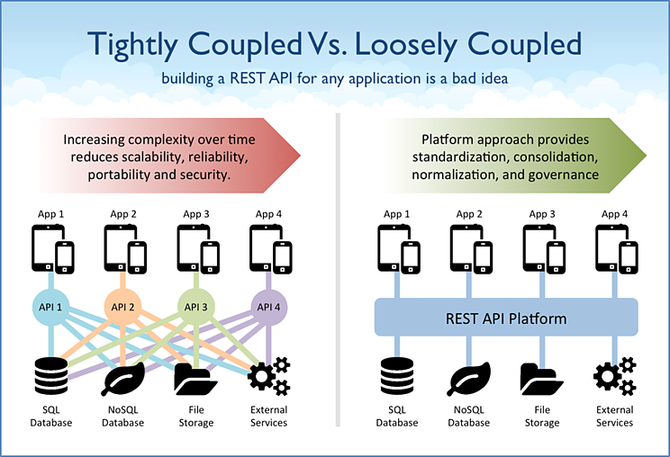
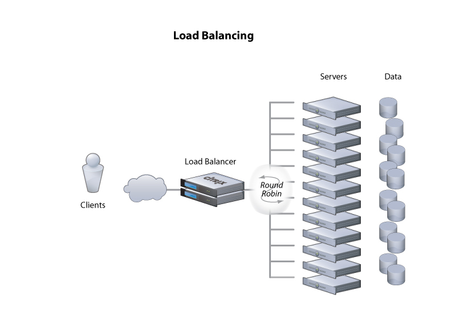
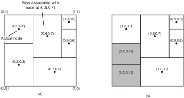
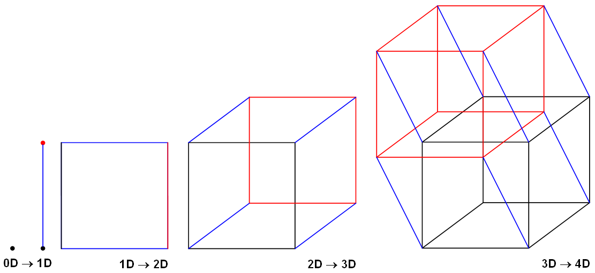
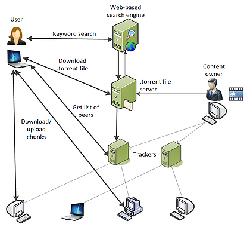
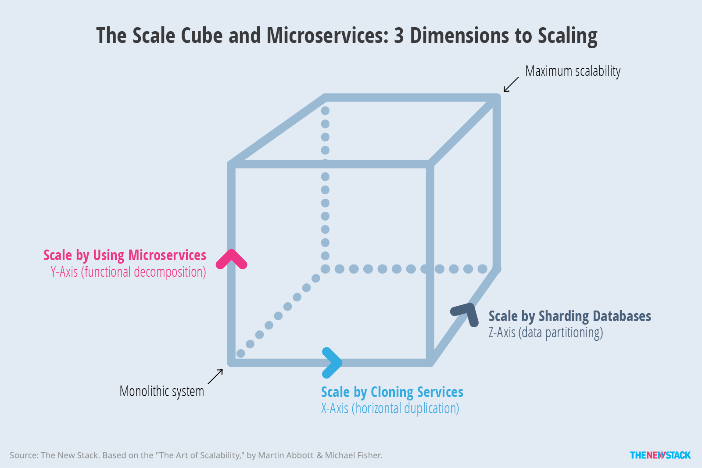

# Arquiteturas

De acordo com David Garlan and Mary Shaw, January 1994, CMU-CS-94-166, em [*An Introduction to Software Architecture*](http://www.cs.cmu.edu/afs/cs/project/able/ftp/intro_softarch/intro_softarch.pdf)
> ... an architectural style determines the vocabulary of components and connectors that can be used in instances of that style, together with a set of constraints on how they can be combined. These can include topological constraints on architectural descriptions (e.g., no cycles). Other constraints—say, having to do with execution semantics—might also be part of the style definition.

Em outras palavras, um estilo ou padrão arquitetural é o conjunto de princípios que provê uma infraestrutura abstrata para uma família de sistemas, e promove o reuso de projeto ao [prover soluções para problemas recorrentes e frequentes](https://msdn.microsoft.com/en-us/library/ee658117.aspx) ao definir quais o **componentes** presentes no sistema e como estes interagem uns com os outros, por meio de **conectores**, para implementar a solução para um problema.

## Componentes e Conectores

Para se alcançar eficiência no desenvolvimento de sistemas, é imperativo que se pare de reinventar a roda a cada iteração e, em vez disso, se reuse artefatos existentes, providos pela linguagem sendo usada, por *frameworks* de terceiros e por iterações anteriores da equipe. 
De fato, o desenvolvimento de novos sistemas deveria ser pautado pela criação de componentes simples e coesos, que possam ser operados independentemente e que por meio de interfaces bem especificadas completas, passam ser então conectados para resolver um problema maior.

Uma vez selecionados, os componentes são conectados por meio de conectores, que podem assumir múltiplas formas para esconder as complexas iterações entres os componentes, por exemplo, por meio de fluxos de mensagens ou invocações remotas de procedimentos.
Alguns conectores são complexos o suficiente para serem considerados eles próprios componentes, mas no contexto desta discussão, a bem da abstração, os consideraremos apenas como conectores. Por exemplo, um banco de dados usado para a comunicação entre dois processos é considerado um conector, e não um componente.

Componentes bem projetados, deveriam ser facilmente substituídos por outros que respeitem a conexão. Isto aumenta a manutenabilidade do sistemas e pode simplificar passos como a replicação de componentes.

???todo "TODO"
    desenhar o conector corretamente

Dependendo de como são conectados, haverá maior ou menor dependência entre os componentes.
Quando houver forte dependência, diremos que os componentes estão **fortemente acoplados** (*tightly coupled*). Caso contrário, diremos que estão **fracamente acoplados** (*loosely coupled*).
A razão óbvia para preferir sistemas fracamente conectados é sua capacidade de tolerar disrupções; se um componente depende pouco de outro, então não se incomodará com sua ausência por causa de uma falha.

Certos *middleware* permitem um acoplamento tão fraco entre componentes, que estes não precisam se conhecer ou sequer estar ativos no mesmo momento.

Também a questão da simplificação de API, uma vez que o *middleware* pode impor um padrão a ser seguido por todos os componentes e minimizar a necessidade os componentes conhecerem as interfaces uns dos outros.

## Cliente/Servidor

A forma como os componentes se comunicam, isto é, os conectores usados, é importante no estudo arquitetural. 
Mas também são importantes os papéis assumidos pelos componentes na realização de tarefas.
Neste sentido, provavelmente a arquitetura de computação distribuída mais comum é a **Cliente/Servidor**.
Na arquitetura Cliente/Servidor, como implicado pelo nome, há um processo que serve a pedidos realizados por outros processos. 
Isto é feito quando o **cliente** o contacta o servidor e requer (*request*) a realização do serviço.
O **servidor**, por sua vez, pode desempenhar tarefas como fazer cálculos, armazenar dados, ou repassar uma mensagem e, ao final da realização da tarefa, responder (*response*) ao cliente.

Esta arquitetura forma a base da computação distribuída, sobre a qual todos os outros modelos são implementados.
Uma das razões é histórica: os primeiros sistemas a permitirem a operação por múltiplos usuários, ainda na década de 60, eram compostos de um *host* robusto ao qual se conectavam diversos terminais, essencialmente com teclado e monitor, isto é, um servidor e vários clientes.
Com a redução dos computadores, surgiram as primeiras redes de computadores e a necessidade de uma abstração para o estabelecimento de comunicação entre processos em hosts distintos, e assim surgiram os **sockets**.
Com os sockets, vem uma grande flexibilidade, pois um processo não precisa saber como o outro manuseia os dados que lhe cabem, desde que siga um protocolo pré-estabelecido na comunicação. Isto é, processos podem ser implementado em diferentes linguagens, sistemas operacionais e arquiteturas, desde observadas os cuidados necessários para se obter [transparência de acesso](../intro/#transparencia).
Esta flexibilidade é a outra razão do sucesso do modelo cliente/servidor, permitindo que clientes se conectem a servidores para usar seus recursos, que podem ser acessados concorrentemente por diversos clientes.

Embora seja possível usar sockets de forma assíncrona, a API mais comum é síncrona, isto é, quando um processo espera receber uma mensagem de outro, ele fica bloqueado esperando algum dado estar disponível para leitura no referido socket.
De forma genérica, estas interações acontecem como na figura a seguir.

Observe que o cliente fica inativo enquanto espera a resposta e que o servidor fica inativo enquanto espera outras requisições.
Para minimizar os períodos de inatividade, o cliente pode usar o socket assíncronamente, o que não é exatamente simples, ou usar múltiplos threads, para que continue operando mesmo enquanto um thread estiver bloqueado esperando a resposta do servidor.

No lado do servidor, o minimização da ociosidade é feita pelo uso de múltiplos clientes, concorrentes, e também pelo uso de múltiplos threads.
Neste caso, contudo, é necessário tomar muito cuidado para garantir que a concorrência não causará efeitos indesejados nos dados e execução das tarefas.
Veja o caso de um banco de dados transacional, por exemplo, como discutido acima; ele precisa garantir ACID entre as transações propostas pelos clientes.

Exemplos desta arquitetura são abundantes, incluindo um navegador que se comunica com um servidor Apache para recuperar uma página Web ou em um aplicativo móvel que solicita ao servidor de aplicações que dispare uma transferência de fundos.

Embora tenhamos colocado aqui apenas um servidor atendendo aos clientes, em muitas aplicações modernas, múltiplos servidores atenderão ao conjunto de clientes.
Pense por exemplo no serviço de email do Google, o Gmail. Com os milhões de usuários que tem, certamente há mais de um servidor implementando o serviço.
Provavelmente estes diversos servidores ficam atrás do que chamamos de um balanceador de carga, que roteia as requisições seguindo diferentes políticas, por exemplo, *round robin*.

Exemplos cotidianos disto são servidores de bancos de dados, de páginas Web e email.
De fato, esta flexibilidade permite que diversas aplicações continuem operando de forma centralizada, com servidores rodando, por exemplo, em mainframes e clientes rodando de forma emulada por software em computadores pessoais.

Contudo, em certas situações, esta divisão entre clientes e servidores pode se tornar confusa.
Primeiro, por quê uma vez estabelecida a conexão, não há uma diferenciação entre quem iniciou e quem aceitou a mesma; são apenas duas pontas do mesmo socket.
Segundo, pode ser que o serviço relevante sendo prestado, seja prestado por quem estabelece a conexão. De fato ambos podem estar prestando serviços um para o outro, no que é conhecido como P2P.
Terceiro, um mesmo processo pode atuar tanto como cliente quanto como servidor, no que é conhecido como arquitetura multicamadas, também a ser visto adiante.
Quarto, usando-se sockets como base, podemos construir outros modelos de comunicação entre processos, efetivamente colocando camadas na nossa cebola.[^shrek]

[^shrek]: Se você não pegou a referência, volte ~~uma casa~~[^tabuleiro] um capítulo.
[^tabuleiro]: Se você não pegou esta referência, não teve infância.

A seguir, exploraremos as arquiteturas construídas sobre cliente/servidor.

### Sistemas multi-camadas

Outra forma de hibridismo que podemos citar é quando um componente haje tanto como cliente quanto como servidor. 
Veja o seguinte exemplo, conhecido no meio como arquitetura em 3-camadas (3 *tiers*).

Neste caso, é interessante notar que esta disposição dos componentes é independente da disposição física. De fato, as três camadas podem estar em um mesmo nó, ou combinadas duas a duas, neste último caso resultando em duas camadas.

Por outro lado, cada camada pode ser subdividida em mais componentes, resultando em múltiplos tiers, como neste exemplo de um sistema de busca na Web.

## Par-a-Par (Peer-to-Peer, P2P)

Diferentemente de sistemas cliente/servidor, em que um nó serve o outro, em sistemas par-a-par, os nós são parceiros e tem igual responsabilidade (e daí o nome) na execução das tarefas.

Como todo sistema distribuído, a arquitetura P2P visa **agregar poder computacional de múltiplos nós**.
Mas além disso, pelo não diferenciação dos componentes, espera-se **tolerar falhas de componentes sem paralisar o serviço**, uma vez que não há um componenente centralizador, detentor único de uma certa funcionalidade.
Os sistemas P2P tendem portanto a lever a maior disponibilidade.

Historicamente, e devido às características já mencionadas, os sistemas P2P tem outra característica muito importante, a **alta escalabilidade** a que se oferecerem, chegando a níveis globais.

Se pensarmos por exemplo nos sistemas de compartilhamento de arquivos, músicas e filmes, razão da fama e infâmia da arquitetura, teremos bons exemplos disso.
Para que isso seja possível, estes sistemas precisam se tornar **auto-gerenciáveis**, pois sistemas globais devem tolerar **entrada e saída frequente de nós** (por falhas ou ação de seus usuários), **diferentes domínios administrativos**, e heterogeneidade na comunicação.
Uma das ferramentas utilizadas para simplificar o trabalho de auto-gerenciamento é o conceito de **redes sobrepostas**.

Diversos sistemas P2P existem, sendo, provavelmente, os mais famosos, os sistemas de compartilhamento de arquivos, em que cada nó armazena e disponibiliza parte dos dados, bem como acessa os dados disponibilizados por outros nós.
Nesta linha, embora diversos tenham existido, hoje o mais famoso é o Bittorrent, mesmo que, como veremos adiante, não seja P2P puro.
Antes de nos aprofundarmos nos exemplos, precisamos entender o conceito das redes **sobrepostas**.

### Rede Sobreposta (*Overlay*)

Os componentes de um sistema P2P se organizam em uma rede lógica, sobreposta à rede física.
Nesta rede lógica, os processos estabelecem canais de comunicação tipicamente na forma de conexões TCP/IP.
Por serem ignorantes à topologia física da rede e usarem a pilha de comunicação IP, as redes sobrepostas são mais simples e ao mesmo tempo mais poderosas. 
Nestas redes são executados diversos algoritmos, como de descoberta de nós, roteamento de pacotes e de otimização de rotas pelo descarte e criação de conexões.

Uma vez que as **conexões na rede sobreposta não correspondem a conexões físicas**, como se pode ver na seguinte figura, vizinhos em um rede sobreposta não necessariamente correspondem a vizinhos na rede física e vice-versa.
Isto também implica que a **otimização da rota lógica não necessariamente leva à otimização da rota física**.

Dependendo em como esta rede é organizada (ou não), a mesma é classificada como **estruturada** ou **não-estruturada**.

#### Rede Não-Estruturada

Se a rede sobreposta é construída de forma aleatória, por exemplo deixando os nós se conectarem apenas aos vizinhos na rede no ponto em que se conectaram inicialmente, então esta é denominada uma rede **não-estruturada**. 
A figura a seguir é um exemplo que se percebe que nós tem graus diferentes de conectividade e que não estão particularmente organizados em nenhuma topologia.

Suponha que esta rede seja usada para armazenar e consultar dados.
Inserções de dados podem ser feitas muito rapidamente, armazenando-os no primeiro nó disponível encontrado.
Os objetos amarelo e vermelho foram inseridos desta forma, e copiados em nós próximos para tolerar a falha de alguns hosts sem perder os dados.
Buscas, contudo, terão que vasculhar a rede usando algoritmos como **busca em largura**, **busca em profundidade** ou **caminhada aleatória** (resposta probabilística).

#### Rede Estruturada

Se as conexões são construídas e mantidas de forma a gerar uma **topologia bem definida**, chamamos esta rede de **estruturada**.
Nesta rede, a inserção de nós requer a propagação desta informação para outros nós e a atualização das conexões para manter a estrutura.
A estrutura geralmente serve ao propósito de associar os nós aos dados de uma forma planejada. 
Por exemplo, nós próximos na rede podem ser responsáveis por dados logicamente próximos.
Claramente, a inserção e acesso a dados nesta rede é mais custosa, pois independentemente de onde a requisição é feita, isto é, a partir de qual nó, ela deverá ser atendida por um nó específico. 

Veja o exemplo do Chord, uma rede P2P em que os nós formam um anel lógico, cujos detalhes veremos adiante.
Cada nó é responsável pela faixa de valores indexados por chaves entre o identificador do nó e o do nó anterior.
Logo, qualquer inserção ou consulta de dados, deve ser feita especificamente para um determinado nó, e deve ser **roteada** para o mesmo.
A estrutura da rede permite que tal roteamento seja feito eficientemente, no nível da rede sobreposta.

Como outro exemplo considere uma rede em que os nós armazenam informações sobre os dados de uma certa área geográfica e que nós vizinhos na rede sejam aqueles responsáveis por áreas que se tocam.

Neste exemplo, para se acessar os dados de um certo ponto no mapa, basta rotear a requisição para o vizinho mais próximo do ponto; necessariamente a requisição chegará ao nó correto.

#### De não estruturada a estruturada

A seguinte tabela resume as diferenças entre os dois tipos de redes sobrepostas.

 Estruturada                      | Não-Estruturada 
----------------------------------|---------------------------
 Estrutura bem definida           | Estrutura aleatória
 Adição de dados é lenta          | Adição de dados é rápida
 Adição de nós é lenta            | Adição de nós é rápida
 Busca por dados é rápida         | Busca por dados lenta

Mas, e se pudéssemos juntar o melhor dos dois mundos em um único sistema? Isso é possível em certos cenários. 
Por exemplo, seja uma grade $N \times N$ em que nós  em uma borda da matriz conseguem se conectar aos nós da borda oposta.
Distâncias entre nós são medidas como a soma das distâncias em $x$ mais a distância em $y$.

* $a = (x,y), b = (x', y')$
* $d_x(a,b) = min(|x - x'|, N - |x - x'|)$
* $d_y(a,b) = min(|y - y'|, N - |y - y'|)$
* $d(a,b) = d_x(a,b) + d_y(a,b)$

Suponha que cada divida a organização da topologia em dois módulos, um de descoberta de novos nós e outro de seleção.

O módulo de descoberta leva inicialmente ao estabelecimento de conexões aleatórias e à formação de uma rede sobreposta não estruturada como, por exemplo, a seguinte.

Após as conexões inicias, cada um dos nós executa o seguinte protocolo iteradamente.

* O módulo de descoberta, repetidamente, pergunta aos seus vizinhos quem são os seus vizinhos e se conecta aos mesmos.
* O módulo de seleção computa a distância entre o nó e todos os seus vizinhos e descarta as conexões com maior distância.

Ao final de múltiplas interações, cada nó terá como seus vizinhos, os nós mais próximos. Se a rede for completa (um nó em cada posição da grade), como no exemplo, e o módulo de seleção sempre mantiver quatro conexões, ao final do processo os vizinhos serão os nós à direita, esquerda, acima e abaixo.
Se a rede não for completa ou se menos conexões forem mantidas, uma aproximação será obtida.

A seguinte figura apresenta uma outra rede resultada da aplicação do mesmo princípio, mas em uma "grade" com três dimensões.

Se em vez da distância cartesiana fosse usada a distância de Hamming entre os identificadores dos nós, ao final das iterações, a topologia alcançada seria um hyper-cubo, como os da seguinte figura,[^hyper] no qual diversos [esquemas de roteamento eficientes podem ser usados](https://en.wikipedia.org/wiki/Hypercube_internetwork_topology).[^icpc_hyper]

[^hyper]: No caso da grade 4x4, a o hipercubo é topologicamente igual à rede obtida pela distância cartesiana como mostrado no exemplo acima.

[^icpc_hyper]: Neste [problema](https://icpcarchive.ecs.baylor.edu/external/22/2271.pdf) do ICPC, um esquema de nomeação dos nós de um hypercube é apresentado; usando este esquema, derive um algoritmo de roteamento em que a distância percorrida por qualquer mensagem seja sempre igual ao número de dimensões do cubo.

!!! info inline end "Sistemas P2P"
    * Arquitetura decentralizada;
    * Não há distinção de papéis entre nós ou conjuntos de nós desempenham os mesmos papéis, em parceria;
    * Escalabilidade geográfica global, isto é, com nós espalhados por todo o globo;
    * Pode haver entrada e saída de nós do sistema com alta frequência; 
    * Nós se organizam em redes sobrepostas (em inglês, *overlay*), redes lógicas sobre as redes físicas;
    * Auto-administração.
    * Resiliente a falhas

### Tabelas de Espalhamento Distribuídas (DHT)

A versatilidade dos sistemas P2P os levaram a ser amplamente estudados e aplicados, sendo que entre as aplicações mais bem sucedidas estão as Tabelas de Espalhamento Distribuídas (DHT, do inglês, *Distributed Hash Tables*).

As tabelas de espalhamento (também conhecidas como mapas, dicionários, arrays associativos) tem características que a tornam adequadas ao armazenamento de dados a vários cenários.
Em essência, estas tabelas são funções que **mapeiam** uma chave para um valor, uma função $f$ tal que

* $f(K): V \cup \{null\}$
* $K$: Universo de chaves
* $V$: Universo de valores

isto é, $f(k) = v, k\in K, v \in V$ ou $v =$ null.

Na prática, são estruturas de dados adaptáveis, com um API muito simples, e com operações de tempo (mais ou menos) constante para fazer CRUD de pares chave/valor.
Tanto $K$ quanto $V$ são **blobs** de dados, isto é, sem nenhuma forma distinta, e por isso podem ser usadas para resolver uma gama de problemas.

!!! note "API"
    * sejam $k \in K$ e $v,w \in V$
    * $put(k,v)$: 
         * if $f(k) = w \neq null$ then return $w$
         * else $f(k) \rightarrow v$;  return $null$
    * $update(k,v)$: 
         * if $f(k) = w \neq null$ then return $w$; $f(k) \rightarrow v$
         * else return $null$
    * $get(k)$: 
         * if $f(k) = w \neq null$ then return $w$
         * else return $null$ 
    * $del(k)$:
         * if $f(k) = w \neq null$ then return $w$ 
         * else return $null$
    * execução $O(1)$

Se as tabelas de espalhamento são estruturas de dados úteis, uma versão distribuída seria ainda mais útil, principalmente porquê ela poderia ser **tolerante a falhas** e ter **escalabilidade linear**.
É justamente desta idea que surgem as DHT, literalmente tabelas de espalhamento distribuídas, estruturas de dados que mantém **a mesma API** e funcionalidades de tabelas de espalhamento, mas que **agrega capacidades de diversos hosts**.

Dentre os desafios na implementação de uma DHT estão

* O que usar como chave? Uma DHT deve ser versátil para ser utilizada para vários fins, então a chave precisa ser independente da aplicação.
* Como dividir a carga entre hosts? É preciso balancear a carga para que um lado da rede não se torne mais importante que o outro e para não levar a uma hierarquização entre os nós.
* Como rotear requisições para o host correto? Uma vez que os dados devem ser particionados entre hosts para garantir escalabilidade, como encontrar o nó onde determinado dado está or deveria estar?

#### Identificação

A identificação de objetos precisa ser facilmente **determinável pela aplicação** para permitir a recuperação precisa dos dados. 
Por exemplo, podemos usar o identificador único CPF como chave para dados de pessoas e dividir seus possíveis valores em faixas, atribuídas a diferentes nós do sistema.

* 000.000.000-00 - 111.111.111-00: nó 1
* 111.111.111-01 - 222.222.222-00: nó 2
* 222.222.222-01 - 333.333.333-00: nó 3
* ...

Contudo, esta chave é ruim pois não propicia uma distribuição uniforme da carga de trabalho entre os hosts; como CPF são gerados sequencialmente, os hosts iniciais seriam responsáveis por mais dados que os demais.

Mas mesmo que a geração de CPF fosse aleatória, ainda teríamos outro problema com seu uso como chave: o CPF só se aplica a pessoas e portanto não é usável em outras aplicações.
Para resolver estes três problemas, recorremos a uma abordagem usada na literatura da área, dividindo a identificação em duas camadas:

* Seja $i$ o identificador do objeto, dado pela aplicação (e.g., CPF, nome, telefone)
* Seja $h$ uma função *hash* criptográfica
* O objeto identificado por $i$ na aplicação será identificado por $k = h(i)$ dentro da DHT.

#### Divisão da carga
Se usarmos, por exemplo, MD5, é fato que $k$ tem distribuição uniforme no espaço de 0 a $2^{160}-1$ possíveis valores.
Para dividirmos os dados entre os hosts também uniformemente, distribua os valores entre os hosts em função de $k$.
Alguns exemplos de divisão são:

* defina *buckets* para cada host e atribua o dado com chave $k$ para bucket $k \% b$, onde $b$ é o número de buckets
* divida a faixa de valores em $b$ segmentos e atribua a cada host uma faixa
* dados $2^n$ hosts, atribua ao host $0 < x < 2^n-1$ os dados cujas chaves terminem com o valor $x$.

São várias as formas de se dividir os dados e estas estão intimamente ligadas à rede sobreposta que se pretende montar e a como o roteamento será feito.

#### Roteamento
Para estudar o desafio do roteamento, nas seções seguintes estudaremos o Chord, um sistema P2P que surgiu no meio acadêmico mas cujo design influenciou fortemente a indústria no desenvolvimento dos bancos dados distribuídos NOSQL, como Cassandra, Dynamo, e Redis.

#### Estudo de Caso: Chord
Chord é uma sistema P2P de múltiplas aplicações desenvolvido pelos membros do [CSAIL](https://www.csail.mit.edu/), do MIT, e publicado em 2001. 
Desde então, inspirou diversos outros sistemas, tornando-se sinônimo com P2P.
Neste sistema, nós organizam-se em um anel lógico e cada um torna-se responsável por um dos segmentos do anel adjacente a onde se encontra no mesmo.
Requisições para correspondentes a um segmento são roteados para o nó responsável usando uma tabela de rotas conhecida como *finger table*.
Se traçarmos os caminhos apontados por esta tabela sobre o anel, desenharemos **cordas** sobre o mesmo, o que explica o nome do sistema.

##### Identificação
No Chord o problema da identificação dos dados é resolvido usando-se chaves de **$m$ bits**, geradas por meio de uma função hash criptográfica a partir de chaves que faça sentido para a aplicação, por exemplo nome, telefone, ou CPF.
Como a função hash é criptográfica, uma pequena variação na entrada implica em grande variação na saída e, para quem observa apenas a saída da função, uma sequência de chaves é indistinguível de uma sequência aleatória.

##### Divisão de carga
A cada nó é atribuído um identificador único de **$m$ bits**, gerado aleatoriamente. 
Como $m$ normalmente é grande, com mais de uma centena de bits, a probabilidade de dois nós terem o mesmo identificar é desprezível.
Além disso, os nós se organizam em uma rede sobreposta estruturada na forma de um **anel lógico**, em que os nós aparecem ordenadamente de acordo com seus identificadores.
A figura a seguir mostra um anel em cujo os nós tem identificadores de 8 bits (0 a 255), com cinco nós.[^chord_dist]
Assumamos inicialmente que os nós só estão cientes dos seus vizinhos imediatos no anel.
[^chord_dist]: Observe que as distâncias entre os nós no anel foram desenhadas de forma proporcional à diferença numérica entre os identificadores.

Cada chave é associada a um nó, responsável por atender requisições de criação, consulta, modificação e remoção dos dados relacionados àquela chave.
A pseudo aleatoriedade na geração da chave e a aleatoriedade na geração dos identificadores de nós faz com que a distribuição de carga entre os nós seja uniforme.
O dado com chave $k$ é responsabilidade do nó com menor identificador $i \geq k$, aka, **sucessor de $k$** ($i = suc(k)$), no anel.
Na figura a seguir, é apresentado junto a cada nó as chaves pelas quais o nó é responsável.

##### Roteamento
Suponha que um cliente solicite ao Chord do exemplo anterior que armazene o valor $v$ associado à chave $k$.
A solicitação é feita pelo contato a um dos nós no sistema, que pode ou não ser o responsável por $k$.
Caso seja o responsável, a solicitação é executada localmente e uma resposta devolvida ao cliente.
Caso contrário, a requisição deve repassada ou **roteada** para o nó correto.

Na rede estruturada definida até agora, uma opção óbvia é repassar a requisição para um dos vizinhos e assim sucessivamente até que alcance o nó correto. 
Esta solução, correta, tem custo da ordem do número de nós no sistema, $O(n)$.
Em uma instância com milhares de nós, $O(n)$ é um custo muito alto, ainda mais se considerarmos que cada salto na rede sobreposta potencialmente cruza toda a Internet, uma vez que, reforçando, a proximidade na rede sobreposta não implica em proximidade na rede física abaixo.
Observe que o custo em termos de espaço para se implementar esta solução é $O(1)$ para cada nó do sistema.
Em outras palavras, cada nó mantem uma **tabela de rotas** com uma ou duas entradas, apontando para seus vizinhos.

Com uma rede com milhares de nós, uma solução $O(n)$ saltos, onde cada pode levar **ao outro lado do planeta**, operações teriam uma latência muito alta.
Para amenizar o custo, Chord propõe a criação de uma tabela de rotas, também conhecida como *finger-table*, que aponta para nós no anel com distâncias que se dobram a cada entrada.

A *finger-table* é construída da seguinte forma, onde $m$ é a quantidade de bits usados para identificar nós no sistema:

* seja $F_p$ a *finger-table* do processo $p$;
* seja $F_p[i]$ a $i$-ésima da tabela; e,
* $F_p[i] = suc(p+2^{i-1})$.

Observe que nesta tabela, a $i$-ésima entrada aponta para o processo que no que sucede $p$ pelo menos $2^{i-1}$, e que esta distância de sucessão aumenta exponencialmente. 
Observe também que a maior distância é proporcional a metade do tamanho do anel.
Isto quer dizer que o último *finger* da tabela proporciona um salto de $1/2$ anel, o penúltimo $1/4$ do anel, o ante-penúltimo $1/8$, e assim sucessivamente.
Outra forma de se ver esta tabela é como proporcionando um salto de pelo menos metade da distância restante para o nó responsável pela chave, resultando em um roteamento com custo $O(log n)$.

Mas como este potencial é explorado? Usando-se o seguinte algoritmo de busca pela entrada correta na tabela de roteamento, do ponto de vista do processo $p$:

* seja $k$ a chave para qual estamos procurando o sucessor;
* itere pela tabela até achar a primeira entrada cujo valor, i.e., o identificador de um nó, é maior que $k$;
* se a entrada é a primeira da tabela, então encaminhe a requisição para o nó apontado, pois ele é o sucessor de $k$, até onde $p$ consegue determinar;
* senão, encaminhe a requisição para a entrada anterior, pois o nó referenciado está mais próximo do sucessor para determiná-lo com segurança.

Considere no exemplo a seguir a busca pelo sucessor de 26, iniciada pelo nó 1.

Duas observações são importantes aqui. A primeira, é que as comparações para se encontrar a entrada correta, deve respeitar o anel, por exemplo, em um anel com 32 posições, por exemplo, $31 < 0$. No seguinte exemplo, considere por exemplo a busca que o nó 21 faz pelo sucessor de 31; qual deve ser a entrada selecionada?

A segunda observação é que não se pode encaminhar a requisição diretamente para o nó apontado na entrada encontrada, pois a visão de $p$ pode ser incompleta para partes distantes do anel.
Tente identificar exemplos no anel a seguir onde este comportamento seria errado.

A organização dos nós em um anel virtual e a distribuição da responsabilidade dos dados pelo particionamento do espaço das chaves de forma correspondente às faixas no anel lógico é a técnica conhecida como **espalhamento consistente**, do inglês, *consistent hashing*.

##### Churn
Apesar do espalhamento consistente ser uma técnica muito útil, ela não resolve todos os problemas. Aliás, vários outros problemas precisam ser resolvidos, sendo o primeiro deles lidar com a entrada e saída de nós, principalmente por falhas de nós e comunicação.

Quando um novo nó entra do sistema, ele precisa seguir os seguintes passos:

* Escolher um novo Identificador $I$
* Identificar o sucessor $S$ de $I$
* Identificar o antecessor $A$ de $I$
* Informar $A$ e $S$ de sua entrada, para que ajustem suas tabelas de rota.
* $A$ e $S$ propagam a informação da entrada de $I$ para seus vizinhos, permitindo que ajustem suas tabelas de rota.

Além disto, a reorganização dos nós exige movimentação de dados, pois parte dos dados armazenados em $S$, com chaves menores que $I$, precisam ser copiadas para $I$, o novo responsável.
As principais questões a serem respondidas durante a movimentação dos dados são

* como manter os dados disponíveis para inserção e consulta durante todo o processo, e
* como minimizar o impacto da reorganização nos nós vizinhos ao novo nó

Quanto à primeira questão, pode-se rotear as requisições para os dois nós responsáveis, o atual e o novo, e combinar as respostas, mantendo os dados mais recentes.
Quanto à segunda, uma opção é fazer com que cada novo nó assuma diversas posições no anel, com identificadores distintos, passando a "incomodar" múltiplos processos, mas de forma mais suave.

Embora se possa "facilmente" resolver os problemas da entrada de nós, os da saída são mais complexos, principalmente porquê a saída acontece geralmente bruscamente, por exemplo por falhas no sistema.
Quanto à reorganização das tabelas de rota, cada nó precisa monitorar os nós que figuram em sua tabela e, caso pareçam indisponíveis, ajustar par apontar para outro nó.
Contudo, caso a suspeita seja indevida, isto pode levar a dados serem consultados e armazenados nos nós errados.
Também com relação aos dados, há o problema de não perdê-los quando o nó responsável se torna indisponível.
O tratamento destes problemas está relacionado e é feito pelo replicação dos dados em múltiplos nós. Isto é feito no Chord, por exemplo, da seguinte forma:

* para cada dado, com chave $k$, há $r$ cópias;
* a primeira cópia é mantida no sucessor de $k$;
* a segunda cópia, no sucessor do sucessor de $k$, e assim por diante;
* cada escrita é feita na primeira cópia, respondida, e replicada para as demais cópias;
* cada leitura é feita na cópia com menor identificador.

No caso de falha de uma cópia, há $r-1$ cópias ainda disponíveis para responder à requisição, mantendo o sistema disponível a despeito de ($r-1$) falhas, no que se chama de **degradação graciosa**.
Há contudo, um problema introduzido por esta abordagem. Assuma a seguinte sequência de passos, em um sistema com $r=2$.

* escrita na cópia 1;
* resposta ao cliente;
* replicação para cópia 2;
* escrita na cópia 1;
* resposta ao cliente;
* falha da cópia 1;
* leitura na cópia 2.

O cliente, ao ler o dado, lê uma versão antiga do mesmo, inconsistente com a visão que tinha do sistema.
De fato, este tipo de sistema é chamado de eventualmente consistente pois somente na **ausência de falhas e de escritas** as diversas réplicas serão consistentes umas com as outras.
Continuemos a sequência:

* escrita na cópia 2;
* cópia 1 volta a funcionar;
* leitura na cópia 1.

Neste caso, a cópia "secundária" 2 tem um dado mais atual, que precisa ser repassado para a cópia 1; este movimento de convergência de dados é conhecido como anti-entropia.
Finalmente, continuemos a sequência:

* escrita na cópia 1, por outro cliente.

Assim, ambas as cópias, 1 e 2, tem dados derivados da primeira escrita, mas feitos "concorrentemente", um **conflito**.
Qual dos dois é o correto neste contexto? É impossível apresentar uma estratégia genérica para resolver esta situação, mas alguns sistemas usarão uma estratégia do tipo "a última escrita vence", onde a última escrita pode ser determinada em por relógios lógicos, vetoriais, tempo, e uma pitada de "arranjo técnico" para quebrar empates.
O Dynamo, que veremos a seguir, é um destes sistemas.

!!! note "Espalhamento Consistente"
    * Carga uniforme entre nós.
    * Todos os nós sabem como rotear requisições
    * Número de saltos médio é conhecido.
    * O sistema se adapta a entrada e saída de nós, por falhas ou não.

#### Estudo de Caso: DynamoDB

DynamoDB é o marco fundamental dos bancos de dados NoSQL. 
No vídeo a seguir um de seus evangelizadores, descreve rapidamente o banco, os cenários em que deveria ser usado e diversos padrões de projeto para modelagem de dados.

<iframe width="560" height="315" src="https://www.youtube.com/embed/HaEPXoXVf2k" frameborder="0" allow="accelerometer; autoplay; encrypted-media; gyroscope; picture-in-picture" allowfullscreen></iframe>

Enquanto o assiste, alguns pontos devem ser ressaltados sobre o Dynamo de forma específica e os NoSQL de forma geral:     

* surgiram da necessidade de escalabilidade dos bancos de dados, isto é, da necessidade de lidar com milhões e milhões de entradas de dados, gerados e processados com baixa latência e alta vazão, a despeito de falhas;
* maior escalabilidade implica em maior exposição a particionamentos da rede em que o sistema roda, que associado à necessidade de manutenção de alta disponibilidade, implica em perda de garantias de consistência (veremos o [Teorema CAP](https://en.wikipedia.org/wiki/CAP_theorem) adiante);
* *Partition keys* são as chaves usadas para roteamento dos dados, ou seja, as chaves discutidas anteriormente neste capítulo sobre sistema P2P;
* *Sort keys* são chaves usadas dentro de cada nó para ordenar os dados na hora de gerar as SSTables (*String Sorted Tables*), e se usadas em agregados de valores, são equivalentes ao *GROUP BY* do SQL;
* *Lambda functions*  são funções para processamento de dados executadas em entradas definidas por um pipeline de processamento sem a definição explícita de sockets e portas, em um modelo conhecido como [Serverless](https://en.wikipedia.org/wiki/Serverless_computing).

Este modelo é adequado a algumas aplicações, como o carrinho de compras da Amazon.com, aplicação para a qual o Dynamodb foi inicialmente desenvolvido.
Nesta aplicação, cada usuário tem um **identificador único**, recuperado no momento em que se loga ao sistema da Amazon.
Este identificador único é a **chave de particionamento** e os dados são o conteúdo do carrinho de compras.

Para lidar com falhas, o conteúdo do carrinho é replicado nos nós sucessivos ao responsável pela dupla chave valor.
O carrinho é **modificado atomicamente**, isto é, sobrescrito por inteiro. A replicação, associada às modificações atômicas, potencializa conflitos, que são identificados comparando-se os vetores de versão (relógios vetoriais) associados a cada valor escrito.
No caso de conflitos, as múltiplas cópias concorrentes são apresentadas ao usuário na forma de um carrinho de compras com a união dos itens nos respectivos carrinhos, de forma que o usuário possa corrigí-lo. Na pior das hipóteses, uma compra com erros será feita, e necessitará de uma atividade compensatória para o usuário, como um brinde.

Na prática, muitos sistemas mantém os papéis de clientes, que requisitam a execução de serviços, e servidores, que executam as requisições, mas distribuem as tarefas dos servidores entre pares para aquela função, sendo efetivamente sistemas híbridos. 
Este é o caso dos bancos de dados NOSQL, como o Dynamo, que acabamos de estudar, e também do Cassandra, que veremos a seguir.

#### Estudo de Caso: Cassandra
Outra alternativa é fazer com que cada nó do sistema conheça todos os outros. Assim, cada requisição pode ser diretamente encaminhada ao nó responsável por tratá-la. 
O custo do roteamento, neste caso, é $O(1)$, muito mais rápido que na abordagem anterior. O custo de armazenamento da *tabela de rotas* é, contudo, $O(n)$, o que pode ser proibitivo em uma rede com milhares de nós, apesar de ser uma solução viável em redes menores. Este é o caso do CassandraDB, uma banco de dados distribuído baseado no Chord, que estudaremos melhor mais adiante, considerado uma DHT de salto único (*single-hop* DHT).

O CassandraDB foi, sem sombra de dúvida, influenciado pelo projeto do DynamoDB, o que é facilmente explicável já que um dos criadores do Dynamo foi o arquiteto do Cassandra.
Mas em vez de uma cópia, o Cassandra largamente expande a funcionalidade do Dynamo ao se inspirar no banco de dados [BigTable](https://en.wikipedia.org/wiki/Bigtable), do Google.
Com isso, o Cassandra se aproxima do modelo relacional, facilitando o desenvolvimento de certas aplicações, sem perder as características desejáveis das DHT.  
A principal característica neste sentido é o modelo híbrido chave-valor/relacional, em que os valores associados a uma chave são divididos em colunas.
A combinação chave-colunas são denominadas **column-families** e seu conjunto **keyspace**. Estas duas estruturas são equivalente às tabelas/relações e aos bancos de dados, dos bancos de dados  relacionais. 

Uma diferença fundamental entre column-families e relações é que as últimas precisam de um esquema pré-definido, enquanto que as primeiras não tem um esquema. Isto quer dizer que novas colunas podem ser adicionadas dinamicamente e que nem todas precisam estar presentes para cada chave. De fato, múltiplos registros com a mesma chave, ou linhas, podem ter conjuntos de colunas diferentes.

Para que o correto conjunto de colunas associado a uma chave possa ser apurado, após múltiplas escritas com a mesma chave tenham ocorrido, a cada tupla (chave,coluna,valor) é associado também um *timestamp*.  
.  
Assim, dados uma mesma chave e coluna, o valor válido é o com o maior timestamp.
Devido a possibilidade de valores serem escritos para diferentes colunas independentemente, valores válidos e inválidos podem ter o mesmo *timestamp*.
Por exemplo, considere os seguintes dados escritos no banco:

| Chave| Coluna$\rightarrow$Valor | Timestamp|
|------|--------------|----------|
| 3    | Nome$\rightarrow$José, Idade$\rightarrow$30 | 02:02:2020,13:45:00 |
| 3    | Idade$\rightarrow$33 | 02:02:2020,13:50:00|
| 3    | Telefone$\rightarrow$333444554433 | 02:02:2020,13:55:00|

Uma busca pelos dados associados à chave 3 retornará o seguinte resultado:  Nome$\rightarrow$José, Idade$\rightarrow$33, Telefone$\rightarrow$333444554433.
Para facilitar mais ainda o desenvolvimento, o Cassandra conta com uma linguagem de consulta similar ao SQL (Structured Query Language), a CQL (Cassandra Query Language).
Assim, a consulta a estes dados seria mais ou menos como `#!sql SELECT * FROM dados WHERE key == 3`.[^cql_sintax]

[^cql_sintax]: Este exemplo é meramente ilustrativo e não segue estritamente a sintaxe do CQL.

Há muitos recursos *online*  para se aprender mais se aprender mais sobre como usar o Cassandra, por exemplo, [aqui](http://wiki.apache.org/cassandra/GettingStarted).
Há também diversos projetos de código livre que o usam e podem ser estudados, por exemplo, o clone de Twiter [Twissandra](https://github.com/twissandra/twissandra).
Mas embora o uso de sistemas gerenciadores de bancos de dados em sistemas distribuídos seja interessante, aqui nos focaremos em alguns dos aspectos de como estes SGBD são construídos.

!!! note "Detalhes de Implementação"
    A seção de [tecnologias](../tech/#estruturas-de-dados-para-sd) descreve várias estruturas de dados recorrentemente usadas em implementação de bancos de dados como o Cassandra.

### Híbridos

Embora cliente/servidor e P2P sejam arquiteturas clássicas, boa parte dos sistemas que distribuídos podem ser na verdade considerados híbridos.
Considere um sistema de email, por exemplo. 
Embora clientes usem as funcionalidades dos servidores de email para enviar e receber mensagens, os servidores conversam uns com os outros para implementar a tarefa de encaminhar as mensagens. 
Neste sentido, o sistema é um híbrido P2P e cliente/servidor.

Outros exemplos abundam.

* Bancos de dados, e.g., DynamoDB, [CassandraDB](https://www.atlassian.com/blog/archives/do-you-know-cassandra), Redis,...
* Jogos multiplayer (pense no [particionamento dos mapas](http://pages.cs.wisc.edu/~vshree/cs740/Voronoi.pdf))
* Compartilhamento de arquivos: Bittorrent

Foquemo-nos no exemplo do Bittorrent
O que há de mais interessante neste exemplo o fato de haverem diversas implementações dos clientes, e.g., $\mu$Torrent, Azureus, Transmission, Vuze, qTorrent, implementados em diversas linguagens e para diversas plataformas, todos interoperáveis.
Isso é um atestado do que uma [especificação](http://bittorrent.org/beps/bep_0003.html) bem feita e aberta pode alcançar.
Observe na figura adiante os diversos passos necessários à recuperação do arquivo de interesse neste sistema.
Diversos passos seguem a arquitetura cliente/servidor enquanto "somente" o passo de compartilhamento de arquivos é P2P.

Voltando ao exemplo do sistema de informação, observe que o cliente acessa um serviço, implementado por pares de nós. 
Podemos dizer que também este é híbrido.

Um último exemplo é o sistema que suporta a criptomoeda Bitcoin, em que milhares de nós armazenam coletivamente o histórico de transações de trocas de dono das moedas. Mas em vez de expandir aqui este assunto, diferiremos esta discussão para a seção [BlockChain](../tech/#blockchain).

## Arquitetura Orientada a Microsserviços
Diversas outras arquiteturas podem e foram propostas para o desenvolvimento de Sistemas Distribuídos.
A moda da vez é a chamada arquitetura de **microsserviços**, na qual a divisão de tarefas entre componentes visa levar aos componentes mais simples para tal tarefa. Assim, os mesmos podem ser replicados, escalonados, desenvolvidos e mantidos independentemente.
Cada tarefa conta então com diversos componentes, organizados em camadas resolvendo um problema em específico, mas todos contribuindo para a realização de uma tarefa maior comum.

No dia 3 de Junho de 2020, o termo **microservice** resultava em 6.6 milhões de resultados no [Google](https://www.bing.com/search?q=microservice&PC=U316&FORM=CHROMN).
Isso porquê a organização de aplicações distribuídas na forma de "pequenos" processos, especializados e independentes e que colaboram para implementar um serviço maior, se tornou um padrão importante no desenvolvimento de novas aplicações.
Exatamente por isso, precisamos começar com um aviso: diversas tecnologias surgiram com grande estrondo, sendo alguns exemplos recentes Docker, Golang, Angular, e JQuery, e embora seja certo que algumas destas encontrarão seus nichos, como fizeram antes delas Cobol, C, e SQL, outras desaparecerão da face da indústria; afinal, quem sabe o que é Delphi e quem ainda usa JQuery? [Os micro-serviços não são uma panacéia](http://www.zdnet.com/article/microservices-101-the-good-the-bad-and-the-ugly/)

Este fenômeno é capturado pelas várias fases do *hype-cycle* da Gartner.[^hype_gartner]
[^hype_gartner]: "The hype cycle is a branded graphical presentation developed and used by the American research, advisory and information technology firm Gartner, for representing the maturity, adoption and social application of specific technologies."

A Arquitetura Orientada a microsserviços, tendo atingido o pico das expectativas infladas[^gartner_inflated] em 2017, está deslizando na [Trough of Desillusionment](https://www.gartner.com/en/documents/3955980/hype-cycle-for-application-architecture-and-development-)[^gartner_inflated] em 2019.
Isto é, este modelo de desenvolvimento não é mais propagandeado como uma bala de prata para todas as aplicações distribuídas.
Ainda assim, é um importante modelo. Mas afinal, o que é a arquitetura de microsserviços?
Em vez de explicar diretamente o que são, pode ser mais fácil pensar primeiro termos do que não são, em termos de sistemas monolíticos.   
   

[^gartner_inflated]: * Peak of Inflated - Expectations	Early publicity produces a number of success stories—often accompanied by scores of failures. Some companies take action; most don't.
* Technology Trigger -- A potential technology breakthrough kicks things off. Early proof-of-concept stories and media interest trigger significant publicity. Often no usable products exist and commercial viability is unproven.
*  Slope of Enlightenment -- More instances of how the technology can benefit the enterprise start to crystallize and become more widely understood. Second- and third-generation products appear from technology providers. More enterprises fund pilots; conservative companies remain cautious.
* Plateau of Productivity -- Mainstream adoption starts to take off. Criteria for assessing provider viability are more clearly defined. The technology's broad market applicability and relevance are clearly paying off.
* Trough of Disillusionment - Interest wanes as experiments and implementations fail to deliver. Producers of the technology shake out or fail. Investment continues only if the surviving providers improve their products to the satisfaction of early adopters.

Uma extrapolação que pode ser feita aqui, reforçando a observação que problemas (e soluções) de sistemas distribuídos são refletidos em nível de processamento paralelo e concorrente, é que a uma arquitetura SEDA lembra em muito a arquitetura de [micro-serviços](http://muratbuffalo.blogspot.com.br/2011/02/seda-architecture-for-well-conditioned.html).

Observe que à direita no exemplo de microsserviços, se vê um conector (ou componente) denominado ***event bus***.
A ideia é que componentes publiquem mensagens no barramento, os ***publishers***, e que componentes interessados em mensagens de algum tópico, os ***subscribers*** se subscrevam. 
O barramento então serve de canal de comunicação, entregando as mensagens publicadas a quem tiver interesse, implementando assim uma arquitetura ***publish/subscribe***.

### Monolitos
Muitas aplicações seguem o modelo de 3 camadas em que em um dos extremos tem-se a interface com os usuários, materializada normalmente por um navegador, no outro tem-se um SGBD onde são armazenados os dados da aplicação, e, no meio, a lógica do negócio.
A camada central, implementada por um único processo, que alimenta a interface com o usuário, manipula o modelo de dados, e onde reside a lógica do negócio, é um **monolito**.

Monolitos seguem um modelo simples e largamente utilizado de desenvolvimento em que vários contribuidores implementam partes distintas da lógica, que são compiladas em conjunto e colocadas em produção de forma atômica:   

1. Desenvolva
1. Teste
1. Implante
1. volte ao passo 1

Simples não quer dizer necessariamente eficiente; no caso de atualizações de uma parte do sistema, **todo o monolito precisa ser trocado**, incorrendo em, com raras exceções, **indisponibilidade total** do sistema, incluindo as partes não modificadas.
Esta dificuldade tende a limitar as **janelas de atualização** do sistema, o que aumenta no número de mudanças que ocorrem a cada atualização, o que **aumenta o risco de regressões** e portanto requer mais testes, o que aumenta o intervalo entre janelas de atualização. 
Além disso, nos caso de bugs, é mais difícil encontrar o problema, uma vez que fica **impossível aos desenvolvedores conhecer todo o sistema**.
Isso apenas exacerba o problema, o que limita mais ainda as atualizações, gerando um **ciclo vicioso** que mantem desenvolvedores acordados nas madrugadas de sexta para sábado quando é dia de *deploy*.

Sistemas monolíticos também podem ser problemáticos quanto à escalabilidade, pois quando a capacidade do sistema é atingida, ou todo o sistema é movido para um *host* de maior capacidade ou todo o sistema deve ser  replicado.
Na primeira abordagem, o custo geralmente é um empecilho, pois preços de hardware crescem exponencialmente com *scale up*. 
Além disso, um servidor, por mais parrudo que seja, é um Ponto Único de Falha (ou SPOF, do inglês *single point of failure*).
Quanto à segunda abordagem, ela traz complexidades na coordenação das réplicas e ineficiências ao replicar inclusive as partes subutilizadas.
Ambas as abordagens também esbarram na escalabilidade do banco de dados que lhes serve de *backend*.
Para contornar ou pelo menos minimizar estes problemas, pode-se fragmentar o serviço e o banco de dados, o que facilita tanto a escalabilidade vertical quanto horizontal de cada módulo, que é menor e mais simples de coordenar, e divide a carga nos bancos de dados; mas isso é a troca do serviço monolítico por microsserviços.

### Microsserviços
De acordo com [Lewis & Fowler](https://martinfowler.com/articles/microservices.html)
> The microservice architectural style is an approach to developing a single application as a suite of small services, each running in its own process and communicating with lightweight mechanisms, often an HTTP resource API. These services are built around business capabilities and independently deployable by fully automated deployment machinery. There is a bare minimum of centralized management of these services, which may be written in different programming languages and use different data storage technologies.

Em outras palavras, com os microsserviços, quebra-se o monolito em diferentes processos, "*small autonomous services that work together, modelled around a business domain*", cada um gerenciando os dados relevantes para aquela parte do sistema e, possivelmente, sua própria interação com o usuário.
Com o uso de microsserviços, se dá mais um passo em direção à máxima escalabilidade do sistema.

Este modelo tem implicações diretas no desenvolvimento: cada processo é desenvolvido por um time diferente, que mantem controle sobre desenvolvimento, teste, e manutenção em produção, o que é factível já que cada serviço é simples e focado em um problema pequeno e ninguém tem que entender em detalhes o funcionamento de todo o sistema.

Além disso, quando um serviço precisa ser atualizado, se bem projetados, todos os demais podem continuar operantes e é possível até que múltiplas versões do mesmo serviço sejam executadas concorrentemente, possibilitando atualizações sem janelas de manutenção.  

Quanto à escalabilidade, esta é feita independentemente também; no exemplo na imagem seguinte, é provável que o serviço de acesso ao catálogo seja mais utilizado que os demais e portanto merecedor de mais recursos e mais cópias.

Como se percebe facilmente, o uso de microsserviços pode ser relacionado às técnicas de processamento paralelo: trate dados diferentes em blocos diferentes (paralelismo de dados ou replicação) e trate funções diferentes em blocos diferentes (paralelismo de tarefas ou *sharding*).
Como na computação paralela, na "componentização" é importante considerar os requisitos das diferentes tarefas em termos de CPU, E/S, e memória, para que possam escalar independentemente e não gerar gargalos desnecessários.

### Do Monolito aos Microsserviços
Com tantas vantagens, surge a dúvida se todos os sistemas deveriam ser desenvolvidos usando-se a arquitetura de microsserviços.
A resposta é **não**, pois como colocado no início desta seção, **não existem balas de prata** e se um sistema monolítico está funcionando para você e não há perspectiva de problemas acometerem (a demanda no sistema não está aumentando, a lógica do sistema é muito simples, indisponibilidade não te traz prejuízo, você não pode arcar com a refatoração), então mantenha seu sistema como está.

Caso haja a necessidade de evolução e o modelo de microsserviços pareça adequado, existem recomendações de como a migração pode ser feita.
Primeiro, é preciso aceitar que o desenvolvimento de microsserviços afeta a organização do time de desenvolvimento e que a organização provavelmente refletirá a arquitetura.
O desenvolvimento, manutenção e operação de microsserviços acontece em times pequenos, de 1 a 8 pessoas ("pizza team"), dependendo da complexidade do serviço; se houver a necessidade de mais pessoas no time, o escopo do microsserviço provavelmente está grande demais; cada componente resolve um problema, bem.

Segundo, a mudança não deverá acontecer atomicamente. 
Uma boa estratégia é identificar uma parte do sistema que funcionaria bem como microsserviço, desenvolvê-la e modificar o monolito para usar o microsserviço.
O aprendizado então é usado para encontrar novo candidato e o procedimento é iterado até que o monolito seja apenas uma casca e possa também ser removido.
Mais fácil dito que feito, há muita documentação orientando o processo.

!!! tip "Para saber mais"
    Como esta arquitetura não faz parte ainda do nosso currículo, não nos aprofundaremos nela aqui.
    Felizmente há muito material na Web sobre este modelo, sendo a lista a seguir uma ínfima fração.

    Para uma explicação geral do que são, assista a Martin Fowler no vídeo seguinte, assista  
    <iframe width="560" height="315" src="https://www.youtube.com/embed/wgdBVIX9ifA" frameborder="0" allow="accelerometer; autoplay; encrypted-media; gyroscope; picture-in-picture" allowfullscreen></iframe>   
    ou consulte os vários artigos no seu [sítio](https://martinfowler.com/articles/microservices.html).

    Para entender os princípios por trás do uso da arquitetura,  
    <iframe width="560" height="315" src="https://www.youtube.com/embed/PFQnNFe27kU" frameborder="0" allow="accelerometer; autoplay; encrypted-media; gyroscope; picture-in-picture" allowfullscreen></iframe>

    Para um exemplo importante do uso de microsserviços, considere a Netflix, que usa microsserviços em larga escala em seus serviços. Quão larga? "...over five hundred services... we don't know how many..." Apesar de tal uso, ou justamente por causa dele, seus serviços mantém uma "...availability of 9.995...", ou seja, ficam indisponíveis por **menos de 16 segundos por ano**.   
    <iframe width="560" height="315" src="https://www.youtube.com/embed/57UK46qfBLY" frameborder="0" allow="accelerometer; autoplay; encrypted-media; gyroscope; picture-in-picture" allowfullscreen></iframe>   
Com respeito a estar preparado para falhas, afinal "... it is not if failures will happen... ... it is when it happens...", a empresa usa uma abordagem de injeção de falhas em serviços em produção.
    Os diferentes tiposde falhas são injetados por um "**exército de macacos do caos**"  
    <iframe width="560" height="315" src="https://www.youtube.com/embed/CZ3wIuvmHeM" frameborder="0" allow="accelerometer; autoplay; encrypted-media; gyroscope; picture-in-picture" allowfullscreen></iframe>   
    Para uma visão prática da implementação de microsserviços usando AWS, veja
    <iframe width="560" height="315" src="https://www.youtube.com/embed/Ijs55IA8DIk" frameborder="0" allow="accelerometer; autoplay; encrypted-media; gyroscope; picture-in-picture" allowfullscreen></iframe>

## Outras arquiteturas

???bug "TODO"
    * SOA - Foco no uso de outras formas de comunicação para chegar em outras arquiteturas.
    * MOM - Foco na arquitetura pois o uso será visto no próximo capítulo.s
        * Publish/Subscribe 
        * Message Queues
    * Event Sourcing    
        * [Stream Processing/Event sourcing](https://www.confluent.io/blog/event-sourcing-cqrs-stream-processing-apache-kafka-whats-connection/)
        * [Stream Processing/Event Sourcing](https://www.confluent.io/blog/making-sense-of-stream-processing/)
        * [Kafka Overview](https://youtu.be/06iRM1Ghr1k)

*Publish/subscribe* é uma das manifestações os ***message oriented middleware***, ou MOM. 
Uma outra manifestação são as **filas de mensagens**, que permitem que componentes enviem mensagens para caixas postais uns dos outros.
Dependendo da implementação e do MOM usado, componentes não precisam sequer se identificar ou mesmo estar ativos ao mesmo tempo para que a troca de mensagens aconteça, novamente levando a sistemas mais ou menos acoplados.
No capítulo seguinte, usaremos um estudo de caso para no aprofundarmos em arquiteturas orientadas a mensagens, pois neste caso, a arquitetura se confunde com os conectores do nosso sistema distribuído.

## Referências

* [https://www.cs.cmu.edu/~dga/15-744/S07/lectures/16-dht.pdf](https://www.cs.cmu.edu/~dga/15-744/S07/lectures/16-dht.pdf)
* [Distributed System Architectures and Architectural Styles](https://keetmalin.wixsite.com/keetmalin/single-post/2017/09/27/Distributed-System-Architectures-and-Architectural-Styles).
* Para aprender um pouco sobre como funcionam as redes de um *datacenter*, definidas por software, assista ao seguinte vídeo, que fala sobre a infra-estrutura do Facebook.   
   <iframe width="560" height="315" src="https://www.youtube.com/embed/mLEawo6OzFM" frameborder="0" allow="accelerometer; autoplay; encrypted-media; gyroscope; picture-in-picture" allowfullscreen></iframe>
