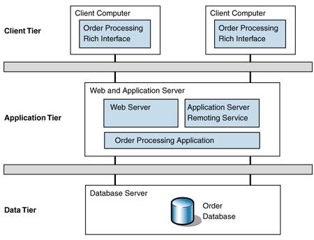

# Arquiteturas

De acordo com David Garlan and Mary Shaw, January 1994, CMU-CS-94-166, em [*An Introduction to Software Architecture*](http://www.cs.cmu.edu/afs/cs/project/able/ftp/intro_softarch/intro_softarch.pdf)
> ... an architectural style determines the vocabulary of components and connectors that can be used in instances of that style, together with a set of constraints on how they can be combined. These can include topological constraints on architectural descriptions (e.g., no cycles). Other constraints—say, having to do with execution semantics—might also be part of the style definition.

Em outras palavras, um estilo ou padrão arquitetural é o conjunto de princípios que provê uma infraestrutura abstrata para uma família de sistemas, e promove o reuso de projeto ao [prover soluções para problemas recorrentes e frequentes](https://msdn.microsoft.com/en-us/library/ee658117.aspx) ao definir quais o **componentes** presentes no sistema e como estes interagem uns com os outros, por meio de **conectores**, para implementar a solução para um problema.

## Componentes e Conectores

Para se alcançar eficiência no desenvolvimento de sistemas, é imperativo que se pare de reinventar a roda a cada iteração e, em vez disso, se reuse artefatos existentes, providos pela linguagem sendo usada, por *frameworks* de terceiros e por iterações anteriores da equipe. 
De fato, o desenvolvimento de novos sistemas deveria ser pautado pela criação de componentes simples e coesos, que possam ser operados independentemente e que por meio de interfaces bem especificadas completas, passam ser então conectados para resolver um problema maior.

Uma vez selecionados, os componentes são conectados por meio de conectores, que podem assumir múltiplas formas para esconder as complexas iterações entres os componentes, por exemplo, por meio de fluxos de mensagens ou invocações remotas de procedimentos.
Alguns conectores são complexos o suficiente para serem considerados eles próprios componentes, mas no contexto desta discussão, a bem da abstração, os consideraremos apenas como conectores. Por exemplo, um banco de dados usado para a comunicação entre dois processos é considerado um conector, e não um componente.

Componentes bem projetados, deveriam ser facilmente substituídos por outros que respeitem a conexão. Isto aumenta a manutenabilidade do sistemas e pode simplificar passos como a replicação de componentes.

???todo "TODO"
    desenhar o conector corretamente

Dependendo de como são conectados, haverá maior ou menor dependência entre os componentes.
Quando houver forte dependência, diremos que os componentes estão **fortemente acoplados** (*tightly coupled*). Caso contrário, diremos que estão **fracamente acoplados** (*loosely coupled*).
A razão óbvia para preferir sistemas fracamente conectados é sua capacidade de tolerar disrupções; se um componente depende pouco de outro, então não se incomodará com sua ausência por causa de uma falha.

Certos *middleware* permitem um acoplamento tão fraco entre componentes, que estes não precisam se conhecer ou sequer estar ativos no mesmo momento.

Também a questão da simplificação de API, uma vez que o *middleware* pode impor um padrão a ser seguido por todos os componentes e minimizar a necessidade os componentes conhecerem as interfaces uns dos outros.

## Cliente/Servidor

A forma como os componentes se comunicam, isto é, os conectores usados, é importante no estudo arquitetural. 
Mas também são importantes os papéis assumidos pelos componentes na realização de tarefas.
Neste sentido, provavelmente a arquitetura de computação distribuída mais comum é a **Cliente/Servidor**.
Na arquitetura Cliente/Servidor, como implicado pelo nome, há um processo que serve a pedidos realizados por outros processos. 
Isto é feito quando o **cliente** o contacta o servidor e requer (*request*) a realização do serviço.
O **servidor**, por sua vez, pode desempenhar tarefas como fazer cálculos, armazenar dados, ou repassar uma mensagem e, ao final da realização da tarefa, responder (*response*) ao cliente.

Esta arquitetura forma a base da computação distribuída, sobre a qual todos os outros modelos são implementados.
Uma das razões é histórica: os primeiros sistemas a permitirem a operação por múltiplos usuários, ainda na década de 60, eram compostos de um *host* robusto ao qual se conectavam diversos terminais, essencialmente com teclado e monitor, isto é, um servidor e vários clientes.
Com a redução dos computadores, surgiram as primeiras redes de computadores e a necessidade de uma abstração para o estabelecimento de comunicação entre processos em hosts distintos, e assim surgiram os **sockets**.
Com os sockets, vem uma grande flexibilidade, pois um processo não precisa saber como o outro manuseia os dados que lhe cabem, desde que siga um protocolo pré-estabelecido na comunicação. Isto é, processos podem ser implementado em diferentes linguagens, sistemas operacionais e arquiteturas, desde observadas os cuidados necessários para se obter [transparência de acesso](../intro/#transparencia).
Esta flexibilidade é a outra razão do sucesso do modelo cliente/servidor, permitindo que clientes se conectem a servidores para usar seus recursos, que podem ser acessados concorrentemente por diversos clientes.

Embora seja possível usar sockets de forma assíncrona, a API mais comum é síncrona, isto é, quando um processo espera receber uma mensagem de outro, ele fica bloqueado esperando algum dado estar disponível para leitura no referido socket.
De forma genérica, estas interações acontecem como na figura a seguir.

Observe que o cliente fica inativo enquanto espera a resposta e que o servidor fica inativo enquanto espera outras requisições.
Para minimizar os períodos de inatividade, o cliente pode usar o socket assíncronamente, o que não é exatamente simples, ou usar múltiplos threads, para que continue operando mesmo enquanto um thread estiver bloqueado esperando a resposta do servidor.

No lado do servidor, o minimização da ociosidade é feita pelo uso de múltiplos clientes, concorrentes, e também pelo uso de múltiplos threads.
Neste caso, contudo, é necessário tomar muito cuidado para garantir que a concorrência não causará efeitos indesejados nos dados e execução das tarefas.
Veja o caso de um banco de dados transacional, por exemplo, como discutido acima; ele precisa garantir ACID entre as transações propostas pelos clientes.

Exemplos desta arquitetura são abundantes, incluindo um navegador que se comunica com um servidor Apache para recuperar uma página Web ou em um aplicativo móvel que solicita ao servidor de aplicações que dispare uma transferência de fundos.

Embora tenhamos colocado aqui apenas um servidor atendendo aos clientes, em muitas aplicações modernas, múltiplos servidores atenderão ao conjunto de clientes.
Pense por exemplo no serviço de email do Google, o Gmail. Com os milhões de usuários que tem, certamente há mais de um servidor implementando o serviço.
Provavelmente estes diversos servidores ficam atrás do que chamamos de um balanceador de carga, que roteia as requisições seguindo diferentes políticas, por exemplo, *round robin*.

Exemplos cotidianos disto são servidores de bancos de dados, de páginas Web e email.
De fato, esta flexibilidade permite que diversas aplicações continuem operando de forma centralizada, com servidores rodando, por exemplo, em mainframes e clientes rodando de forma emulada por software em computadores pessoais.

Contudo, em certas situações, esta divisão entre clientes e servidores pode se tornar confusa.
Primeiro, por quê uma vez estabelecida a conexão, não há uma diferenciação entre quem iniciou e quem aceitou a mesma; são apenas duas pontas do mesmo socket.
Segundo, pode ser que o serviço relevante sendo prestado, seja prestado por quem estabelece a conexão. De fato ambos podem estar prestando serviços um para o outro, no que é conhecido como P2P.
Terceiro, um mesmo processo pode atuar tanto como cliente quanto como servidor, no que é conhecido como arquitetura multicamadas, também a ser visto adiante.
Quarto, usando-se sockets como base, podemos construir outros modelos de comunicação entre processos, efetivamente colocando camadas na nossa cebola.[^shrek]

[^shrek]: Se você não pegou a referência, volte ~~uma casa~~[^tabuleiro] um capítulo.
[^tabuleiro]: Se você não pegou esta referência, não teve infância.

A seguir, exploraremos as arquiteturas construídas sobre cliente/servidor.

### Sistemas multi-camadas

Outra forma de hibridismo que podemos citar é quando um componente haje tanto como cliente quanto como servidor. 
Veja o seguinte exemplo, conhecido no meio como arquitetura em 3-camadas (3 *tiers*).

Neste caso, é interessante notar que esta disposição dos componentes é independente da disposição física. De fato, as três camadas podem estar em um mesmo nó, ou combinadas duas a duas, neste último caso resultando em duas camadas.

Por outro lado, cada camada pode ser subdividida em mais componentes, resultando em múltiplos tiers, como neste exemplo de um sistema de busca na Web.

## Par-a-Par (Peer-to-Peer, P2P)

Diferentemente de sistemas cliente/servidor, em que um nó serve o outro, em sistemas par-a-par, os nós são parceiros e tem igual responsabilidade (e daí o nome) na execução das tarefas.

Como todo sistema distribuído, a arquitetura P2P visa **agregar poder computacional de múltiplos nós**.
Mas além disso, pelo não diferenciação dos componentes, espera-se **tolerar falhas de componentes sem paralisar o serviço**, uma vez que não há um componenente centralizador, detentor único de uma certa funcionalidade.
Os sistemas P2P tendem portanto a lever a maior disponibilidade.

Historicamente, e devido às características já mencionadas, os sistemas P2P tem outra característica muito importante, a **alta escalabilidade** a que se oferecerem, chegando a níveis globais.

Se pensarmos por exemplo nos sistemas de compartilhamento de arquivos, músicas e filmes, razão da fama e infâmia da arquitetura, teremos bons exemplos disso.
Para que isso seja possível, estes sistemas precisam se tornar **auto-gerenciáveis**, pois sistemas globais devem tolerar **entrada e saída frequente de nós** (por falhas ou ação de seus usuários), **diferentes domínios administrativos**, e heterogeneidade na comunicação.
Uma das ferramentas utilizadas para simplificar o trabalho de auto-gerenciamento é o conceito de **redes sobrepostas**.

Diversos sistemas P2P existem, sendo, provavelmente, os mais famosos, os sistemas de compartilhamento de arquivos, em que cada nó armazena e disponibiliza parte dos dados, bem como acessa os dados disponibilizados por outros nós.
Nesta linha, embora diversos tenham existido, hoje o mais famoso é o Bittorrent, mesmo que, como veremos adiante, não seja P2P puro.

## Híbridos

Embora haja uma distinção clara entre cliente/servidor e P2P, boa parte dos sistemas que distribuídos podem ser na verdade considerados híbridos destas duas arquiteturas.
Considere um sistema de email, por exemplo. 
Embora clientes usem as funcionalidades dos servidores de email para enviar e receber mensagens, os servidores conversam uns com os outros para implementar a tarefa de encaminhar as mensagens. 
Neste sentido, o sistema é um híbrido P2P e cliente/servidor.

Outros exemplos abundam.

* Bancos de dados, e.g., DynamoDB, [CassandraDB](https://www.atlassian.com/blog/archives/do-you-know-cassandra), Redis,...
* Jogos multiplayer (pense no [particionamento dos mapas](http://pages.cs.wisc.edu/~vshree/cs740/Voronoi.pdf))
* Compartilhamento de arquivos: Bittorrent

Foquemo-nos no exemplo do Bittorrent
O que há de mais interessante neste exemplo o fato de haverem diversas implementações dos clientes, e.g., $\mu$Torrent, Azureus, Transmission, Vuze, qTorrent, implementados em diversas linguagens e para diversas plataformas, todos interoperáveis.
Isso é um atestado do que uma [especificação](http://bittorrent.org/beps/bep_0003.html) bem feita e aberta pode alcançar.
Observe na figura adiante os diversos passos necessários à recuperação do arquivo de interesse neste sistema.
Diversos passos seguem a arquitetura cliente/servidor enquanto "somente" o passo de compartilhamento de arquivos é P2P.

Voltando ao exemplo do sistema de informação, observe que o cliente acessa um serviço, implementado por pares de nós. 
Podemos dizer que também este é híbrido.

Um último exemplo é o sistema que suporta a criptomoeda Bitcoin, em que milhares de nós armazenam coletivamente o histórico de transações de trocas de dono das moedas. Mas em vez de expandir aqui este assunto, diferiremos esta discussão para a seção [BlockChain](../tech/#blockchain).

## Outras arquiteturas
É possível pensar em muitas outras organizações dos componentes de sistemas distribuídos e, de fato, diversas outras arquiteturas podem e foram propostas e merecem destaque.

### SOA

???bug "TODO"
    * SOA - Foco no uso de outras formas de comunicação para chegar em outras arquiteturas.

### MOM
???bug "TODO"
    * MOM - Foco na arquitetura pois o uso será visto no próximo capítulo.s
        * Publish/Subscribe 
        * Message Queues

*Publish/subscribe* é uma das manifestações os ***message oriented middleware***, ou MOM. 
Uma outra manifestação são as **filas de mensagens**, que permitem que componentes enviem mensagens para caixas postais uns dos outros.
Dependendo da implementação e do MOM usado, componentes não precisam sequer se identificar ou mesmo estar ativos ao mesmo tempo para que a troca de mensagens aconteça, novamente levando a sistemas mais ou menos acoplados.
No capítulo seguinte, usaremos um estudo de caso para no aprofundarmos em arquiteturas orientadas a mensagens, pois neste caso, a arquitetura se confunde com os conectores do nosso sistema distribuído.

### Microsserviços
A moda da vez é a chamada arquitetura de **microsserviços**, na qual a divisão de tarefas entre componentes visa levar aos componentes mais simples para tal tarefa. Assim, os mesmos podem ser replicados, escalonados, desenvolvidos e mantidos independentemente.
Cada tarefa conta então com diversos componentes, organizados em camadas resolvendo um problema em específico, mas todos contribuindo para a realização de uma tarefa maior comum.

### 
???bug "TODO"
    * Event Sourcing    
        * [Stream Processing/Event sourcing](https://www.confluent.io/blog/event-sourcing-cqrs-stream-processing-apache-kafka-whats-connection/)
        * [Stream Processing/Event Sourcing](https://www.confluent.io/blog/making-sense-of-stream-processing/)
        * [Kafka Overview](https://youtu.be/06iRM1Ghr1k)

## Referências

* [https://www.cs.cmu.edu/~dga/15-744/S07/lectures/16-dht.pdf](https://www.cs.cmu.edu/~dga/15-744/S07/lectures/16-dht.pdf)
* [Distributed System Architectures and Architectural Styles](https://keetmalin.wixsite.com/keetmalin/single-post/2017/09/27/Distributed-System-Architectures-and-Architectural-Styles).
* Para aprender um pouco sobre como funcionam as redes de um *datacenter*, definidas por software, assista ao seguinte vídeo, que fala sobre a infra-estrutura do Facebook.   
   <iframe width="560" height="315" src="https://www.youtube.com/embed/mLEawo6OzFM" frameborder="0" allow="accelerometer; autoplay; encrypted-media; gyroscope; picture-in-picture" allowfullscreen></iframe>
