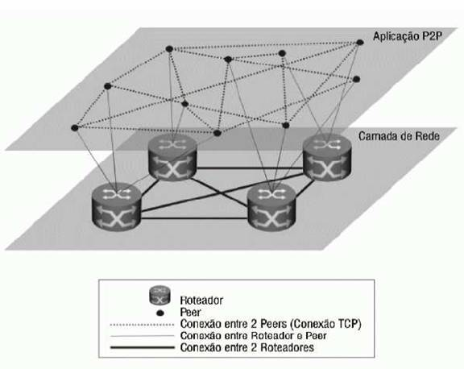
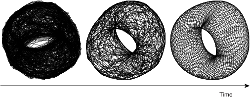

# Arquiteturas

## Cliente Servidor

Como brevemente discutido em [Fundamentos](../basics/#TCP), quando pensamos em termos de comunicação entre dois processos usando sockets, em geral pensamos em processos clientes e servidores, onde servidores esperam a conexão por parte de clientes e executam as operações requisitadas pelos mesmos.

Como exemplos desta arquitetura, podemos pensar em um navegador requisitando a um servidor Apache que lhe retorne uma página Web, ou em um aplicativo móvel solicitando ao servidor de aplicações que dispare uma transferência de fundos.
Um exemplo genérico é apresentado na figura a seguir.

O modelo cliente/servidor forma a base da computação distribuída, sobre a qual todos os outros modelos são implementados.
Uma das razões é histórica: os primeiros sistemas a permitirem a operação por múltiplos usuários, ainda na década de 60, eram compostos de uma host robusto ao qual se conectavam diversos terminais, essencialmente com teclado e monitor, isto é, um servidor e vários clientes.

Com a redução dos computadores, surgiram as primeiras redes de computadores e a necessidade de uma abstração para o estabelecimento de comunicação entre processos em hosts distintos, e assim surgiram os **sockets**.
Com os sockets, vem uma grande flexibilidade, pois um processo não precisa saber como o outro manuseia os dados que lhe cabem, desde que siga um protocolo pré-estabelecido na comunicação. Isto é, processos podem ser implementado em diferentes linguagens, sistemas operacionais e arquiteturas, desde observadas os cuidados necessários para se obter [transparência de acesso](../intro/#transparencia).
Esta flexibilidade é a outra razão do sucesso do modelo cliente/servidor, permitindo que clientes se conectem a servidores para usar seus recursos, que podem ser acessados concorrentemente por diversos clientes.
Exemplos cotidianos disto são servidores de bancos de dados, de páginas Web e email.
De fato, esta flexibilidade permite que diversas aplicações continuem operando de forma centralizada, com servidores rodando, por exemplo, em mainframes e clientes rodando de forma emulada por software em computadores pessoais.

Contudo, em certas situações, esta divisão entre clientes e servidores pode ser tornar confusa.
Primeiro, porquê uma vez estabelecida a conexão, não há uma diferenciação entre quem iniciou e quem aceitou a mesma; são apenas duas pontas do mesmo socket.
Segundo, pode ser que o serviço relevante sendo prestado, seja prestado por quem estabelece a conexão. De fato ambos podem estar prestando serviços um para o outro, no que é conhecido como P2P.
Terceiro, um mesmo processo pode atuar tanto como cliente quanto como servidor, no que é conhecido como arquitetura multicamadas, também a ser visto adiante.
Quarto, usando-se sockets como base, podemos construir outros modelos de comunicação entre processos, efetivamente colocando camadas na nossa cebola.[^shrek]

[^shrek]: Se você não pegou a referência, volte ~~uma casa~~[^tabuleiro] um capítulo.
[^tabuleiro]: Se você não pegou esta referência, não teve infância.

A seguir, exploraremos as arquiteturas construídas sobre cliente/servidor.

## Par-a-Par (Peer-to-Peer, P2P)

Nos sistemas que seguem a arquitetura Par-a-Par, ou simplesmente P2P, há uma substituição dos papéis de clientes e servidores, em que há uma "hirarquia" entre os componentes, por uma onde todos os nós são pares na execução da tarefa em questão.
Um exemplo comum destas arquitetura são os sistemas de compartilhamento de arquivos, em que cada nó armazena e disponibiliza parte dos dados, bem como acessa os dados disponibilizados por outros nós.

Como todo sistema distribuído, a arquitetura P2P visa **agregar poder computacional de múltiplos nós**.
Mas além disso, pelo não diferenciação dos componentes, espera-se **tolerar falhas de componentes sem paralizar o serviço**, uma vez que não há um componenente centralizador, detentor único de uma certa funcionalidade.
Os sistemas P2P tendem portanto a lever a maior disponibilidade.

Historicamente, e devido às características já mencionadas, os sistemas P2P tem outra característica muito importante, a **alta escalabilidade** a que se oferecerem, chegando a níveis globais.
Se pensarmos por exemplo nos sistemas de compartilhamento de arquivos, músicas e filmes, razão da fama e infâmia da arquitetura, teremos bons exemplos disso.
Para que isso seja possível, estes sistemas precisam se tornar **auto-gerenciáveis**, pois sistemas globais devem tolerar **entrada e saída frequente de nós** (por falhas ou ação de seus usuários), **diferentes domínios administrativos**, e heterogeneidade na comunicação.
Uma das ferramentas utilizadas para simplificar o trabalho de auto-gerenciamento é o conceito de **redes sobrepostas**.

### Rede Sobreposta (*Overlay*)

Os componentes de um sistema P2P se organizam em uma rede lógica, **sobreposta** à rede física.
Nesta rede lógica, os processos estabelecem canais de comunicação tipicamente na forma de conexões TCP/IP.
Por serem ignorantes à topologia física da rede e usarem a pilha de comunicação IP, as redes sobrepostas são mais simples e ao mesmo tempo mais poderosas. 
Nestas redes são executados diversos algoritmos, como de descoberta de nós, roteamento de pacotes e de otimização de rotas pelo descarte e criação de conexões.

Uma vez que as conexões na rede sobreposta não correspondem a conexões físicas, como se pode ver na seguinte figura, vizinhos em um rede sobreposta não necessariamente correspondem a vizinhos na rede física e vice-versa.
Isto também implica que a otimização da rota lógica não necessariamente leva à otimização da rota física.

??? todo
    A figura não mostra hosts, apenas roteadores. Trocar por figura em com hosts, roteadores, e processos nos hosts.

Dependendo em como esta rede é organizada (ou não), a mesma é classificada como **estruturada** ou **não-estruturada**.

#### Rede Não-Estruturada

Se a rede sobreposta é construída de forma aleatória, por exemplo deixando os nós se conectarem apenas aos vizinhos na rede no ponto em que se conectaram inicialmente, então esta é denominada uma rede **não-estruturada**. 
A figura a seguir é um exemplo que se percebe que nós tem graus diferentes de conectividade e que não estão particularmente organizados em nenhuma topologia.

Suponha que esta rede seja usada para armazenar e consultar dados.
Inserções de dados podem ser feitas muito rapidamente, armazenando-os no primeiro nó disponível encontrado.
Os objetos amarelo e vermelho foram inseridos desta forma, e copiados em nós próximos para tolerar a falha de alguns hosts sem perder os dados.
Buscas, contudo, terão que vasculhar a rede usando algoritmos como **busca em largura**, **busca em profundidade** ou **caminhada aleatória** (resposta probabilística).

#### Rede Estruturada

Se as conexões são construídas e mantidas de forma a gerar uma topologia bem definida, chamamos esta rede de **estruturada**.
Nesta rede, a inserção de nós requer a propagação desta informação para outros nós e a atualização das conexões para manter a estrutura.
A estrutura geralmente serve ao propósito de associar os nós aos dados de uma forma planejada. 
Por exemplo, nós próximos na rede podem ser responsáveis por dados logicamente próximos.
Claramente, a inserção e acesso a dados nesta rede é mais custosa, pois independentemente de onde a requisição é feita, isto é, a partir de qual nó, ela deverá ser atendida por um nó específico. 

Veja o exemplo do Chord, uma rede P2P em que os nós formam um anel lógico, cujos detalhes veremos adiante.
Cada nó é responsável pela faixa de valores indexados por chaves entre o identificador do nó e o do nó anterior.
Logo, qualquer inserção ou consulta de dados, deve ser feita especificamente para um determinado nó, e deve ser **roteada** para o mesmo.
A estrutura da rede permite que tal roteamento seja feito eficientemente, no nível da rede sobreposta.

Como outro exemplo considere uma rede em que os nós armazenam informações sobre os dados de uma certa área geográfica e que nós vizinhos na rede sejam aqueles responsáveis por áreas que se tocam.

Neste exemplo, para se acessar os dados de um certo ponto no mapa, basta rotear a requisição para o vizinho mais próximo do ponto; necessariamente a requisição chegará ao nó correto.

#### De não estruturada a estruturada

A seguinte tabela resume as diferenças entre os dois tipos de redes sobrepostas.

 Estruturada                      | Não-Estruturada 
----------------------------------|---------------------------
 Estrutura bem definida           | Estrutura aleatória
 Adição de dados é lenta          | Adição de dados é rápida
 Adição de nós é lenta            | Adição de nós é rápida
 Busca por dados é rápida         | Busca por dados lenta

Mas, e se pudéssemos juntar o melhor dos dois mundos em um único sistema? Isso é possível em certos cenários. 
Por exemplo, seja uma grade $N \times N$ em que nós se conectam aleatoriamente uns aos outros, e que nós em uma borda da matriz conseguem se conectar aos nós da borda oposta, com distância 1.
Efetivamente, temos a rede sobreposta à esquerda.

Se cada nó executar o seguinte protocolo, a rede evoluirá da topologia não estruturada para a estruturada, à direita.

* Divida a organização da topologia em dois módulos, um de descoberta de novos nós e outro de seleção.  
  
* O módulo de descoberta, repetidamente, pergunta aos seus vizinhos quem são os seus vizinhos e se conecta aos mesmos.
* O módulo de seleção computa a distância entre o nó e todos os seus vizinhos e descarta as conexões com maior distância, onde
    * a = (x,y)$, $b = (x', y')$
    * $dx_{a,b} = min(|x - x'|, N - |x - x'|)$
    * $dy_{a,b} = min(|y - y'|, N - |y - y'|)$

Ao final de múltiplas interações, cada nó terá como seus vizinhos, os nós mais próximos. Se a rede for completa (um nó em cada posição da grade), os vizinhos ser'ão os nós à direita, esquerda, acima e abaixo.
A seguinte figura apresenta uma outra rede resultada da aplicação do mesmo princípio, mas em uma "grade" 3D.

Se em vez da distância cartesiana fosse usada a distância de Hamming entre os identificadores dos nós, ao final das iterações, a topologia alcançada seria um hyper-cubo, como os da seguinte figura, no qual diversos [esquemas de roteamento eficientes podem ser usados](https://en.wikipedia.org/wiki/Hypercube_internetwork_topology).[^icpc_hyper]

[^icpc_hyper]: Neste [problema](https://icpcarchive.ecs.baylor.edu/external/22/2271.pdf) do ICPC, um esquema de nomeação dos nós de um hypercube é apresentado; usando este esquema, derive um algoritmo de roteamento em que a distância percorrida por qualquer mensagem seja sempre igual ao número de dimensões do cubo.

!!! note "Sistemas P2P"
    * Arquitetura decentralizada;
    * Não há distinção de papéis entre nós ou conjuntos de nós desempenham os mesmos papéis, em parceria;
    * Escalabilidade geográfica global, isto é, com nós espalhados por todo o globo;
    * Pode haver entrada e saída de nós do sistema com alta frequência; 
    * Nós se organizam em redes sobrepostas (em inglês, *overlay*), redes lógicas sobre as redes físicas;
    * Auto-administração.

### Tabelas de Espalhamento Distribuídas (DHT)

A versatilidade dos sistemas P2P os levaram a ser amplamente estudados e aplicados, sendo que entre as aplicações mais bem sucedidas estão as Tabelas de Espalhamento Distribuíds (DHT, do inglês, *Distributed Hash Tables*).

As tabelas de espalhamento (também conhecidas como mapas, dicionários, arrays associativos) tem características que a tornam adequadas ao armazenamento de dados a vários cenários.
Em essência, estas tabelas são funções que **mapeiam** uma chave para um valor, uma função $f$ tal que

* $f(K): V \cup$ \{null\}
* $K$: Universo de chaves
* $V$: Universo de valores

isto é, $f(k) = v, k\in K, v \in V$ ou $v =$ null.

Na prática, são estruturas de dados adaptáveis, com um API muito simples, e com operações de tempo (mais ou menos) constante para fazer CRUD de pares chave/valor.
Tanto $K$ quanto $V$ são **blobs** de dados, isto é, sem nenhuma forma distinta, e por isso podem ser usadas para resolver uma gama de problemas.

!!! note "API"
    * $put(k,v)$: if $k \rightarrow w$ then return $w$ else $k \rightarrow v$; return $\emptyset$
    * $update(k,v)$: if $k \rightarrow w$ then return $w$ else return $\emptyset$
    * $get(k)$: if $k \rightarrow w$ then return $w$ else return $\emptyset$ 
    * $del(k)$: if $k \rightarrow w$ then return $w$ else $k \rightarrow v$; return $\emptyset$
    * $k$ e $v$ são blobs
    * execução $O(1)$

Se as tabelas de espalhamento são estruturas de dados úteis, uma versão distribuída seria ainda mais útil, principalmente porquê ela poderia ser **tolerante a falhas** e ter **escalabilidade linear**.
É justamente desta idea que surgem as DHT, literalmente tabelas de espalhamento distribuídas, estruturas de dados que mantém **a mesma API** e funcionalidades de tabelas de espalhamento, mas que **agrega capacidades de diversos hosts**.

Dentre os desafios na implementação de uma DHT estão

* O que usar como chave? Uma DHT deve ser versátil para ser utilizada para vários fins, então a chave precisa ser independente da aplicação.
* Como dividir a carga entre hosts? É preciso balancear a carga para que um lado da rede não se torne mais importante que o outro e para não levar a uma hierarquização entre os nós.
* Como rotear requisições para o host correto? Uma vez que os dados devem ser particionados entre hosts para garantir escalabilidade, como encontrar o nó onde determinado dado está or deveria estar?

#### Identificação

A identificação de objetos precisa ser facilmente **determinável pela aplicação** para permitir a recuperação precisa dos dados. 
Por exemplo, pode-se dividir faixas de nomes entre os processos.

* A -- C -- Host1
* CA -- E -- Host2
* EA -- G -- Host3
* ...

Esta distribuição tem três problemas graves. O primeiro, é no fato de nomes não serem **unívocos**.
Neste caso, uma exemplo melhor seria o uso do CPF.

* 000.000.000-00 -- 111.111.111-00 -- Host1
* 111.111.111-01 -- 222.222.222-00 -- Host2
* 222.222.222-01 -- 333.333.333-00 -- Host3
* ...

O segundo problema, presente também no uso de CPF, tem a ver com a distribuição da carga de trabalho entre os hosts.
Nem nomes e nem CPF tem distribuição uniforme, então alguns nós ficariam mais carregados que outros.

O terceiro problema tem a ver com o uso de chaves não genéricas, dependentes da aplicação.
Para este problema, poderíamos usar um identificador auto-incrementável, por exemplo, mas em muitas situações esta abordagem implicaria em dificuldade para se recuperar os dados: "qual é mesmo o identificador numérico do livro [How Fascism Works](https://ler.amazon.com.br/kp/embed?asin=B0796DNSVZ&preview=newtab&linkCode=kpe&ref_=cm_sw_r_kb_dp_fAlUDbMBJM4RP)?"

Para resolver estes três problemas, recorremos a uma abordagem usada na literatura da área, dividindo a identificação em duas camadas:

* Seja $i$ o identificador do objeto, dado pela aplicação (e.g., CPF, nome, telefone)
* Seja $h$ uma função criptográfica
* Seja $k = h(i)$ o identificador do objeto $i$.

#### Divisão da carga
Se usarmos, por exemplo, MD5, é fato que $k$ tem distribuição uniforme no espaço de 0 a $2^{160}-1$ possíveis valores.
Para dividirmos os dados entre os hosts também uniformemente, distribua os valores entre os hosts em função de $k$.
Alguns exemplos de divisão são:

* definia *buckets* para cada host e atribua o dado com chave $k$ para bucket $k \% b$, onde $b$ é o número de buckets
* divida a faixa de valores em $b$ segmentos e atribua a cada host uma faixa
* dados $2^n$ hosts, atribua ao host $0 < x < 2^n-1$ os dados cujas chaves terminem com o valor $x$.

São várias as formas de se dividir os dados e estas estão intimamente ligadas à rede sobreposta que se pretende montar e a como o roteamento será feito.

#### Roteamento
Para estudar o desafio do roteamento, nas seções seguintes estudaremos o Chord, um sistema P2P que surgiu no meio acadêmico mas cujo design influenciou fortemente a indústria no desenvolvimento dos bancos dados distribuídos NOSQL, como Cassandra, Dynamo, e Redis.

#### Estudo de Caso: Chord
Chord é uma sistema P2P de múltiplas aplicações desenvolvido pelos membros do [CSAIL](https://www.csail.mit.edu/), do MIT, e publicado em 2001. 
Desde então, inspirou diversos outros sistemas, tornando-se sinônimo com P2P.

##### Identificação
No Chord o problema da indentificação dos dados é resolvido usando-se chaves de **$m$ bits**, geradas por meio de uma função hash criptográfica a partir de chaves que faça sentido para a aplicação, por exemplo nome, telefone, ou CPF.
Como a função hash é criptográfica, uma pequena variação na entrada implica em grande variação na saída e, para quem observa apenas a saída da função, uma sequência de chaves é indistinguível de uma sequência aleatória.

##### Divisão de carga
A cada nó é atribuído um identificador único de **$m$ bits**, gerado aleatoriamente. 
Como $m$ normalmente é grande, com mais de uma centena de bits, a probabilidade de dois nós terem o mesmo identificar é desprezível.

Cada chave é associada a um nó, responsável por atender requisições de criação, consulta, modificação e remoção dos dados relacionados àquela chave.
A pseudo aleatoriedade na geração da chave e a aleatoriedade na geração dos identificadores de nós faz com que a distribuição de carga entre os nós seja uniforme.

Mais especificamente, o Chord mantém uma rede estruturada na forma de um **anel lógico**, em que os nós aparecem ordenadamente de acordo com seus identificadores.
A figura a seguir mostra um anel em cujo os nós tem identificadores de 8 bits (0 a 253), com cinco nós.[^chord_dist]
[^chord_dist]: Observe que as distâncias entre os nós no anel foram desenhadas de forma proporcial à diferença numérica entre os identificadores.

O dado com chave $k$ é responsabilidade do nó com menor identificador $i \geq k$, aka, **sucessor de $k$** ($i = suc(k)$).
Na figura a seguir, é apresentado junto a cada nó as chaves pelas quais o nó é responsável.

##### Roteamento

Suponha que um cliente solicite ao Chord do exemplo anterior que armazene o valor $v$ associado à chave $k$.
A solicitação é feita pelo contato a um dos nós no sistema, que pode ou não ser o responsável por $k$.
Caso seja o responsável, a solicitação é executada localmente e uma resposta devolvida ao cliente.
Caso contrário, a requisição é repassada ou **roteada** para o nó correto.

Na rede estruturada definida até agora, uma opção óbvia é repassar a requisição para "a direita" sucessivamente até que alcance o nó correto. 
Esta solução, correta, tem custo da ordem do número de nós no sistema, $O(n)$.
Em uma instância com milhares de nós, **$O(n)$** é um custo muito alto, ainda mais se considerarmos que cada salto na rede sobreposta potencialmente cruza toda a Internet, uma vez que, reforçando, a proximidade na rede sobreposta não implica em proximidade na rede física abaixo.
Observe que o custo em termos de espaço para se implementar esta solução é **$O(1)$** para cada nó do sistema.

Outra alternativa é fazer com que cada nó do sistema conheça todos os outros. Assim, cada requisição pode ser diretamente encaminhada ao nó responsável por tratá-la. 
O custo do roteamento, neste caso, é **$O(1)$**, muito mais rápido que na abordagem anterior. O custo de armazenamento da *tabela de rotas* é, contudo, **$O(n)$**, o que pode ser proibitivo em uma rede com milhares de nós, apesar de ser uma solução viável em redes menores. Este é o caso do CassandraDB, uma banco de dados distribuído baseado no Chord, que estudaremos melhor mais adiante, considerado uma DHT de salto único (*single-hop* DHT).

Como frequentemente acontece, um solução melhor pode ser nem uma nem outra opção, mas algo intermediário.
O Chord propõe a criação de uma tabela de rotas também conhecida como *finger-table*, construída da seguinte forma, onde $m$ é a quantidade de bits usados para identificar nós no sistema:

* seja $F_p$ a *finger-table* do processo $p$;
* seja $F_p[i]$ a $i$-ésima da tabela; e,
* $F_p[i] = suc(p+2^{i-1})$.

Observe que nesta tabela, a $i$-ésima entrada aponta para o processo que no que sucede $p$ pelo menos $2^{i-1}$, e que esta distância de sucessão aumenta exponencialmente. Observe também que a maior distância é proporcional a metade do tamanho do anel.
Isto quer dizer que o último *finger* da tabela proporciona um salto de $1/2$ anel, o penúltimo $1/4$ do anel, o ante-penúltimo $1/8$, e assim sucessivamente.
Outra forma de se ver esta tabela é como proporcionando um salto de pelo menos metade da distância restante para o nó responsável pela chave, resultando em um roteamento com custo **$O(log n)$**.

Mas como este potencial é explorado? Usando-se o seguinte algoritmo de busca pela entrada correta na tabela de roteamento, do ponto de vista do processo $p$:

* seja $k$ a chave para qual estamos procurando o sucessor;
* itere pela tabela até achar a primeira entrada cujo valor, i.e., o identificador de um nó, é maior que $k$;
* se a entrada é a primeira da tabela, então encaminhe a requisição para o nó apontado, pois ele é o sucessor de $k$, até onde $p$ consegue determinar;
* senão, encaminhe a requisição para a entrada anterior, pois o nó referenciado está mais próximo do sucessor para determiná-lo com segurança.

Considere no exemplo a seguir a busca pelo sucessor de 26, iniciada pelo nó 1.

Duas observações são importantes aqui. A primeira, é que as comparações para se encontrar a entrada correta, deve respeitar o anel, por exemplo, em um anel com 32 posições, por exemplo, $31 < 0$. No seguinte exemplo, considere por exemplo a busca que o nó 21 faz pelo sucessor de 31; qual deve ser a entrada selecionada?

A segunda observação é que não se pode encaminhar a requisição diretamente para o nó apontado na entrada encontrada, pois a visão de $p$ pode ser incompleta para partes distantes do anel.
Tente identificar exemplos no anel a seguir onde este comportamento seria errado.

A organização dos nós em um anel virtual e a distribuição da responsabilidade dos dados pelo particionamento do espaço das chaves de forma correspondente às faixas no anel lógico é a técnica conhecida como **espalhamento consistente**, do inglês, *consistent hashing*.

##### Churn

Apesar do espalhamento consistente ser uma técnica muito útil, ela não resolve todos os problemas. Aliás, vários outros problemas precisam ser resolvidos, sendo o primeiro deles lidar com a entrada e saída de nós, principalmente por falhas de nós e comunicação.

Quando um novo nó entra do sistema, ele precisa seguir os seguintes passos:

* Escolher um novo Identificador $I$
* Identificar o sucessor $S$ de $I$
* Identificar o antecessor $A$ de $I$
* Informar $A$ e $S$ de sua entrada, para que ajustem suas tabelas de rota.
* $A$ e $S$ propagam a informação da entrada de $I$ para seus vizinhos, permitindo que ajustem suas tabelas de rota.

Além disto, a reorganização dos nós exige movimentação de dados, pois parte dos dados armazenados em $S$, com chaves menores que $I$, precisam ser copiadas para $I$, o novo responsável.
As principais questões a serem respondidas durante a movimentação dos dados são

* como manter os dados disponíveis para inserção e consulta durante todo o processo, e
* como minimizar o impacto da reorganização nos nós vizinhos ao novo nó

Quanto à primeira questão, pode-se rotear as requisições para os dois nós responsáveis, o atual e o novo, e combinar as respostas, mantendo os dados mais recentes.
Quanto à segunda, uma opção é fazer com que cada novo nó assuma diversas posições no anel, com identificadores distintos, passando a "incomodar" múltiplos processos, mas de forma mais suave.

Embora se possa "facilmente" resolver os problemas da entrada de nós, os da saída são mais complexos, principalmente porquê a saída acontece geralmente bruscamente, por exemplo por falhas no sistema.
Quanto à reorganização das tabelas de rota, cada nó precisa monitorar os nós que figuram em sua tabela e, caso pareçam indisponíveis, ajustar par apontar para outro nó.
Contudo, caso a suspeita seja indevida, isto pode levar a dados serem consultados e armazenados nos nós errados.
Também com relação aos dados, há o problema de não perdê-los quando o nó responsável se torna indisponível.
O tratamento destes problemas está relacionado e é feito pelo replicação dos dados em múltiplos nós. Isto é feito no Chord, por exemplo, da seguinte forma:

* para cada dado, com chave $k$, há $r$ cópias;
* a primeira cópia é mantida no sucessor de $k$;
* a segunda cópia, no sucessor do sucessor de $k$, e assim por diante;
* cada escrita é feita na primeira cópia, respondida, e replicada para as demais cópias;
* cada leitura é feita na cópia com menor identificador.

No caso de falha de uma cópia, há $r-1$ cópias ainda disponíveis para responder à requisição, mantendo o sistema disponível a despeito de ($r-1$) falhas, no que se chama de **degradação graciosa**.
Há contudo, um problema introduzido por esta abordagem. Assuma a seguinte sequência de passos, em um sistema com $r=2$.

* escrita na cópia 1;
* resposta ao cliente;
* replicação para cópia 2;
* escrita na cópia 1;
* resposta ao cliente;
* falha da cópia 1;
* leitura na cópia 2.

O cliente, ao ler o dado, lê uma versão antiga do mesmo, inconsistente com a visão que tinha do sistema.
De fato, este tipo de sistema é chamado de eventualmente consistente pois somente na **ausência de falhas e de escritas** as diversas réplicas serão consistentes umas com as outras.
Continuemos a sequência:

* escrita na cópia 2;
* cópia 1 volta a funcionar;
* leitura na cópia 1.

Neste caso, a cópia "secundária" 2 tem um dado mais atual, que precisa ser repassado para a cópia 1; este movimento de convergência de dados é conhecido como anti-entropia.
Finalmente, continuemos a sequência:

* escrita na cópia 1, por outro cliente.

Assim, ambas as cópias, 1 e 2, tem dados derivados da primeira escrita, mas feitos "concorrentemente", um **conflito**.
Qual dos dois é o correto neste contexto? É impossível apresentar uma estratégia genérica para resolver esta situação, mas alguns sistemas usarão uma estratégia do tipo "a última escrita vence", onde a última escrita pode ser determinada em por relógios lógicos, vetoriais, tempo, e uma pitada de "arranjo técnico" para quebrar empates.

O Dynamo, que veremos a seguir, é um destes sistemas.

##### Referências

[https://www.cs.cmu.edu/~dga/15-744/S07/lectures/16-dht.pdf](https://www.cs.cmu.edu/~dga/15-744/S07/lectures/16-dht.pdf)

#### Estudo de Caso: DynamoDB

DynamoDB é o marco fundamental dos bancos de dados NoSQL. 
No vídeo a seguir um de seus evangelizadores, descreve rapidamente o banco, os cenários em que deveria ser usado e diversos padrões de projeto para modelagem de dados.

<iframe width="560" height="315" src="https://www.youtube.com/embed/HaEPXoXVf2k" frameborder="0" allow="accelerometer; autoplay; encrypted-media; gyroscope; picture-in-picture" allowfullscreen></iframe>

Enquanto o assiste, alguns pontos devem ser ressaltados sobre o Dynamo de forma específica e os NoSQL de forma geral:     

* surgiram da necessidade de escalabilidade dos bancos de dados, isto é, da necessidade de lidar com milhões e milhões de entradas de dados, gerados e processados com baixa latência e alta vazão, a despeito de falhas;
* maior escalabilidade implica em maior exposição a particionamentos da rede em que o sistema roda, que associado à necessidade de manutenção de alta disponibilidade, implica em perda de garantias de consistência (veremos o [Teorema CAP](https://en.wikipedia.org/wiki/CAP_theorem) adiante);
* *Partition keys* são as chaves usadas para roteamento dos dados, ou seja, as chaves discutidas anteriormente neste capítulo sobre sistema P2P;
* *Sort keys* são chaves usadas dentro de cada nó para ordenar os dados na hora de gerar as SSTables (*String Sorted Tables*), e se usadas em agregados de valores, são equivalentes ao *GROUP BY* do SQL;
* *Lambda functions*  são funções para processamento de dados executadas em entradas definidas por um pipeline de processamento sem a definição explícita de sockets e portas, em um modelo conhecido como [Serverless](https://en.wikipedia.org/wiki/Serverless_computing).

Este modelo é adequado a algumas aplicações, como o carrinho de compras da Amazon.com, aplicação para a qual o Dynamodb foi inicialmente desenvolvido.
Nesta aplicação, cada usuário tem um **identificador único**, recuperado no momento em que se loga ao sistema da Amazon.
Este identificador único é a **chave de particionamento** e os dados são o conteúdo do carrinho de compras.

Para lidar com falhas, o conteúdo do carrinho é replicado nos nós sucessivos ao responsável pela dupla chave valor.
O carrinho é **modificado atomicamente**, isto é, sobrescrito por inteiro. A replicação, associada às modificações atômicas, potencializa conflitos, que são identificados comparando-se os vetores de versão (relógios vetoriais) associados a cada valor escrito.
No caso de conflitos, as múltiplas cópias concorrentes são apresentadas ao usuário na forma de um carrinho de compras com a união dos itens nos respectivos carrinhos, de forma que o usuário possa corrigí-lo. Na pior das hipóteses, uma compra com erros será feita, e necessitará de uma atividade compensatória para o usuário, como um brinde.

Na prática, muitos sistemas mantém os papéis de clientes, que requisitam a execução de serviços, e servidores, que executam as requisições, mas distribuem as tarefas dos servidores entre pares para aquela função, sendo efetivamente sistemas híbridos. 
Este é o caso dos bancos de dados NOSQL, como o Dynamo, que acabamos de estudar, e também do Cassandra, que veremos a seguir.

#### Estudo de Caso: Cassandra
O CassandraDB foi, sem sombra de dúvida, influenciado pelo projeto do DynamoDB, o que é facilmente explicável já que um dos criadores do Dynamo foi o arquiteto do Cassandra.
Mas em vez de uma cópia, o Cassandra largamente expande a funcionalidade do Dynamo ao se inspirar no banco de dados [BigTable](https://en.wikipedia.org/wiki/Bigtable), do Google.
Com isso, o Cassandra se aproxima do modelo relacional, facilitando o desenvolvimento de certas aplicações, sem perder as características desejáveis das DHT.  
A principal característica neste sentido é o modelo híbrido chave-valor/relacional, em que os valores associados a uma chave são divididos em colunas.
A combinação chave-colunas são denominadas **column-families** e seu conjunto **keyspace**. Estas duas estruturas são equivalente às tabelas/relações e aos bancos de dados, dos bancos de dados  relacionais. 

Uma diferença fundamental entre column-families e relações é que as últimas precisam de um esquema pré-definido, enquanto que as primeiras não tem um esquema. Isto quer dizer que novas colunas podem ser adicionadas dinamicamente e que nem todas precisam estar presentes para cada chave. De fato, múltiplos registros com a mesma chave, ou linhas, podem ter conjuntos de colunas diferentes.

Para que o correto conjunto de colunas associado a uma chave possa ser apurado, após múltiplas escritas com a mesma chave tenham ocorrido, a cada tupla (chave,coluna,valor) é associado também um *timestamp*.  
.  
Assim, dados uma mesma chave e coluna, o valor válido é o com o maior timestamp.
Devido a possibilidade de valores serem escritos para diferentes colunas independentemente, valores válidos e inválidos podem ter o mesmo *timestamp*.
Por exemplo, considere os seguintes dados escritos no banco:

| Chave| Coluna$\rightarrow$Valor | Timestamp|
|------|--------------|----------|
| 3    | Nome$\rightarrow$José, Idade$\rightarrow$30 | 02:02:2020,13:45:00 |
| 3    | Idade$\rightarrow$33 | 02:02:2020,13:50:00|
| 3    | Telefone$\rightarrow$333444554433 | 02:02:2020,13:55:00|

Uma busca pelos dados associados à chave 3 retornará o seguinte resultado:  Nome$\rightarrow$José, Idade$\rightarrow$33, Telefone$\rightarrow$333444554433.
Para facilitar mais ainda o desenvolvimento, o Cassandra conta com uma linguagem de consulta similar ao SQL (Structured Query Language), a CQL (Cassandra Query Language).
Assim, a consulta a estes dados seria mais ou menos como `#!sql SELECT * FROM dados WHERE key == 3`.[^cql_sintax]

[^cql_sintax]: Este exemplo é meramente ilustrativo e não segue estritamente a sintaxe do CQL.

Há muitos recursos *online*  para se aprender mais se aprender mais sobre como usar o Cassandra, por exemplo, [aqui](http://wiki.apache.org/cassandra/GettingStarted).
Há também diversos projetos de código livre que o usam e podem ser estudados, por exemplo, o clone de Twiter [Twissandra](https://github.com/twissandra/twissandra).
Mas embora o uso de sistemas gerenciadores de bancos de dados em sistemas distribuídos seja interessante, aqui nos focaremos em alguns dos aspectos de como estes SGBD são construídos.

!!! note "Detalhes de Implementação"
    A seção de [tecnologias](../tech/#estruturas-de-dados-para-sd) descreve várias estruturas de dados recorrentemente usadas em implementação de bancos de dados como o Cassandra.

#### CAN
!!! todo "CAN"

## Microserviços

TODO

<iframe width="560" height="315" src="https://www.youtube.com/embed/PFQnNFe27kU" frameborder="0" allow="accelerometer; autoplay; encrypted-media; gyroscope; picture-in-picture" allowfullscreen></iframe>

\subsection{Word of caution}
\begin{frame}
Não existe bala de prata!
%\includegraphics[width=\textwidth]{images/nosilver}
\end{frame}

\begin{frame}
Todas estas tecnologias...
\begin{itemize}
	\item Docker
	\item Golang
	\item nodejs
	\item Angular
	\item ...
\end{itemize}
passarão ou encontrarão um nicho, como...
\begin{itemize}
	\item Cobol
	\item Assembly
	\item C
	\item SQL
\end{itemize}
encontraram.

Certamente nenhuma delas será usada para resolver todos os problemas.
\end{frame}

\begin{frame}
\begin{quotation}
	The hype cycle is a branded graphical presentation developed and used by the American research, advisory and information technology firm Gartner, for representing the maturity, adoption and social application of specific technologies.
\end{quotation}

\includegraphics[width=.7\textwidth]{images/gartner-hype-cycle-overview}
\end{frame}

\begin{frame}
\begin{scriptsize}
\begin{enumerate}
\item Technology Trigger -- A potential technology breakthrough kicks things off. Early proof-of-concept stories and media interest trigger significant publicity. Often no usable products exist and commercial viability is unproven.
\item Peak of Inflated -- Expectations	Early publicity produces a number of success stories—often accompanied by scores of failures. Some companies take action; most don't.
\item Trough of Disillusionment	-- Interest wanes as experiments and implementations fail to deliver. Producers of the technology shake out or fail. Investment continues only if the surviving providers improve their products to the satisfaction of early adopters.
\item  Slope of Enlightenment -- More instances of how the technology can benefit the enterprise start to crystallize and become more widely understood. Second- and third-generation products appear from technology providers. More enterprises fund pilots; conservative companies remain cautious.
\item Plateau of Productivity -- Mainstream adoption starts to take off. Criteria for assessing provider viability are more clearly defined. The technology's broad market applicability and relevance are clearly paying off.
\end{enumerate}
\end{scriptsize}
Fonte: Wikipedia
\end{frame}

\begin{frame}
\begin{quotation}
	We tend to overestimate the effect of a technology in the short run and underestimate the effect in the long run.[3][4]
\end{quotation}	
\end{frame}

\begin{frame}
Microsserviços está próximo do pico da desilusão.
\includegraphics[width=1.1\textwidth]{images/gartner-hype-cycle-2017}
\end{frame}

\subsection{Visão Geral}
\begin{frame}
Monolítico x Micro-serviços
\end{frame}

\begin{frame}{Monolito}
\includegraphics[width=.6\textwidth]{images/monolith_2001}

\href{http://www.imdb.com/title/tt0062622/}{2001 Space Odyssey}
\end{frame}

\begin{frame}{Monolito}
Um bloco com lógica. Por exemplo, um MVC é um sistema monolítico.

\includegraphics[width=.4\textheight]{images/monolith_arc}

\href{http://nodexperts.com/blog/microservice-vs-monolithic/}{Fonte}
\end{frame}

\begin{frame}{Scala}
\includegraphics[width=\textheight]{images/microservices_scale}

\href{https://thenewstack.io/from-monolith-to-microservices/}{Fonte}
\end{frame}

\begin{frame}{Micro-serviços}
Blocos especializados

\includegraphics[width=.9\textheight]{images/microservices_arc}

\href{http://nodexperts.com/blog/microservice-vs-monolithic/}{Fonte}
\end{frame}

\subsection{Monolitos}
\begin{frame}{Monolítico}
Exemplos de aplicações monolíticas de sucesso são pervasivos.

\pause Ciclo bem entendido:
\begin{itemize}
	\item Desenvolva
	\item Teste
	\item Implante
	\item Escale
	\item loop
\end{itemize}
\end{frame}

%https://medium.com/@bfil/microservices-are-a-silver-bullet-f745d2b41dca

\begin{frame}{Monolítico}
Com o passar do tempo, tornam-se gigantes que não podem ser movidos ou guiados. A complexidade é grande demais para qualquer indivíduo entender todo o sistema.
\end{frame}

\begin{frame}{Monolítico}
Desenvolvimento ágil se torna impossível. 

Implantações são custosas então são evitadas. Cada nova implantação traz muitas novas mudanças. Risco de problemas é maior. Muito cuidado é necessário. Implantações se tornam mais custosas. loop

Até debugar o sistema é mais complicado. Como carregar tudo no Eclipse? \pause Como atacar o problema?
\end{frame}

\begin{frame}{Monolítico}
Se está funcionando, por quê trocar?

\pause

\begin{itemize}
	\item Mais fácil estender?
	\item Mais fácil de escalar?
	\item Mais fácil de tornar tolerante a falhas?
\end{itemize}
\end{frame}

\subsection{Micro-serviço}

\begin{frame}{Micro-serviços}
``Small autonomous services that work together, modelled around a business domain.''
\end{frame}

\begin{frame}{Micro-serviço}
Ideia semelhante à programação paralela:
\begin{itemize}
	\item Paralelismo de dados: trate dados diferentes em blocos diferentes.
	\item Paralelismo de tarefas: trate funções diferentes em blocos diferentes.
\end{itemize}

\pause\alert{Particionamento}
\end{frame}

Serviço de browsing pode ser replicado mais que de ordering, por exemplo.

\begin{frame}{Particionamento}
\begin{itemize}
	\item Cada componente executa um serviço... bem.
	\item Cada time foca-se em um problema.
\end{itemize}
\end{frame}

\begin{frame}{Escalas diferentes para blocos diferentes}
\includegraphics[width=.7\textwidth]{images/microservice_sample}

\href{https://docs.microsoft.com/en-us/dotnet/standard/microservices-architecture/multi-container-microservice-net-applications/microservice-application-design}{Fonte}
\end{frame}

\begin{frame}{Particionamento}
\begin{itemize}
	\item Mudanças são mais contidas (em um simples serviço)
	\item Serviços são desenvolvidos e implantados em paralelo e independentemente
	\item A organização do time de desenvolvimento reflete a organização do sistema
\end{itemize}
\end{frame}

\begin{frame}{Particionamento}
\begin{itemize}
	\item Separe componentes que tem requisitos conflitantes:
	\begin{itemize}
		\item CPU
		\item E/S
		\item Memória
	\end{itemize}
	\item Escale-os independentemente
\end{itemize}
\end{frame}

\begin{frame}{Exemplo: Netflix}
\begin{itemize}
	\item \url{https://youtu.be/57UK46qfBLY}
	\item \url{https://youtu.be/CZ3wIuvmHeM}
\end{itemize}
\end{frame}

\begin{frame}{Exemplos}
\begin{itemize}
	\item ``...over five hundred services... we don't know how many...''
	\item ``...availability of 9.995...'' (< 16 segundos por ano)
	\item ``... four days down... ... moved to the cloud''
	\item ``... it is not if failures will happen... ... it is when it happens...'' 
\end{itemize}

\end{frame}

\begin{frame}{Para aprender mais}
\begin{itemize}
	\item \url{https://youtu.be/wgdBVIX9ifA}
	\item \url{https://youtu.be/PFQnNFe27kU}
	\item \url{https://youtu.be/Ijs55IA8DIk}
	\item \url{https://www.slideshare.net/chris.e.richardson/microservices-pattern-language-microxchg-microxchg2016}
	\item \url{https://martinfowler.com/articles/microservices.html}
	
\end{itemize}
\end{frame}

## Outras arquiteturas

Foco no uso de outras formas de comunicação para chegar em outras arquiteturas.
### MOM
### Publish/Subscribe 
### Message Queues
### Event Sourcing
[Stream Processing/Event Sourcing](https://www.confluent.io/blog/making-sense-of-stream-processing/)
[Kafka Overview](https://youtu.be/06iRM1Ghr1k)
