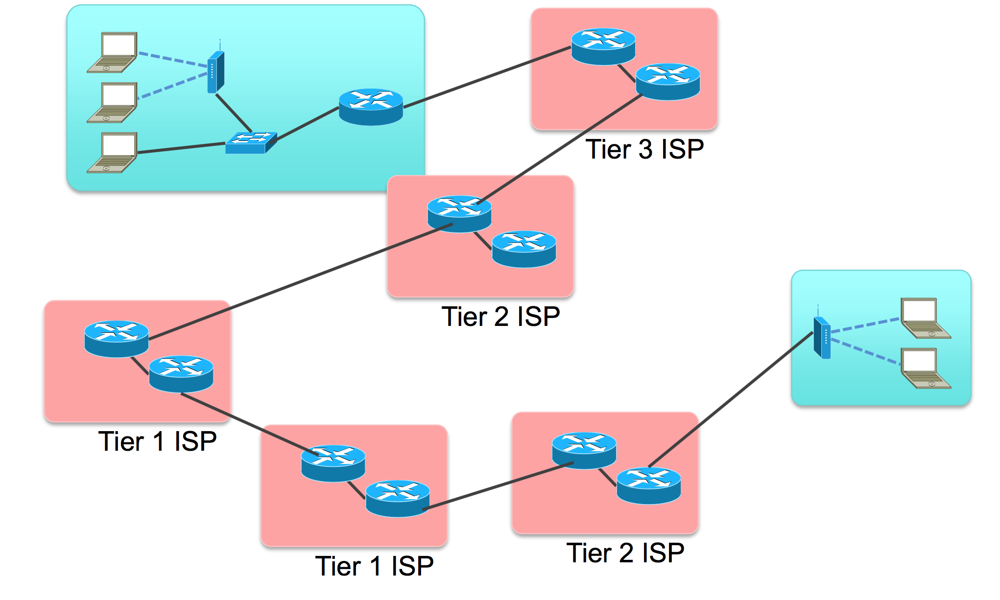
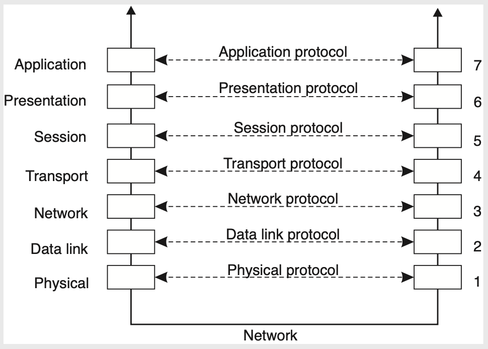
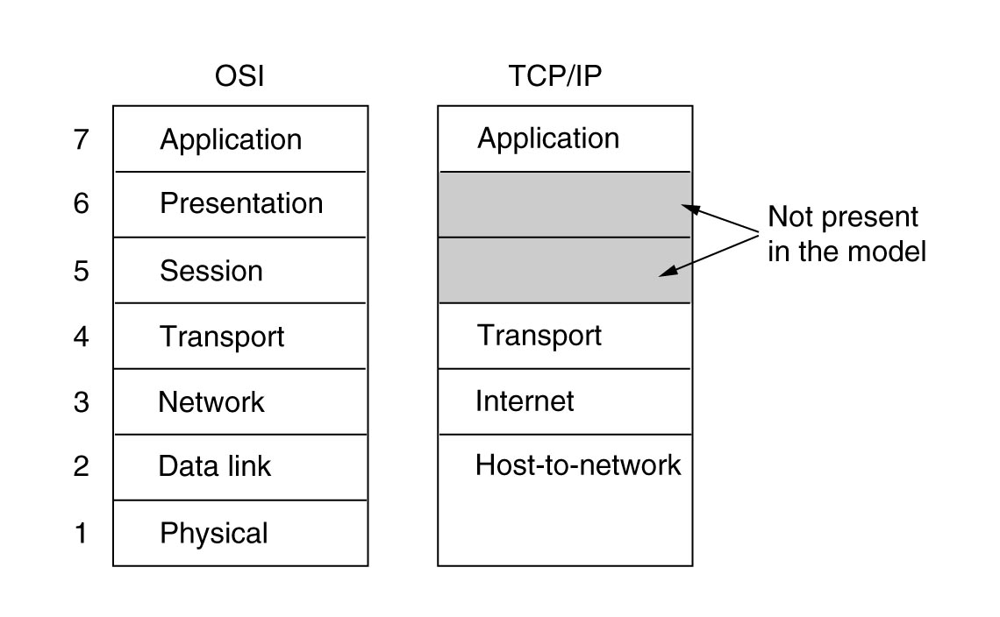
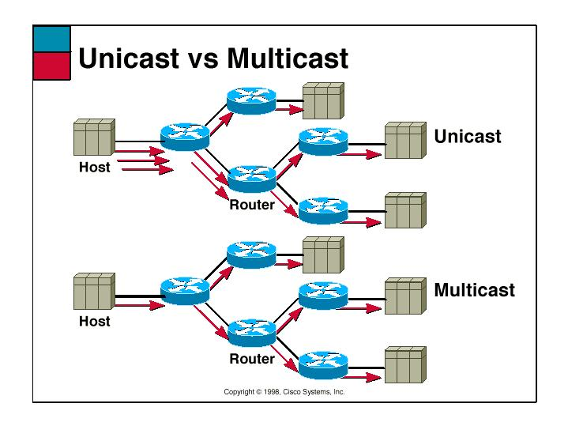
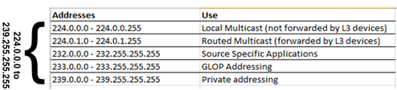
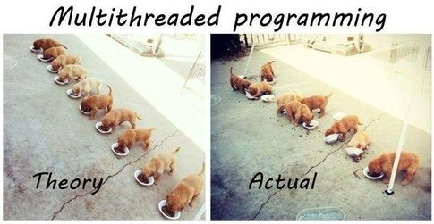
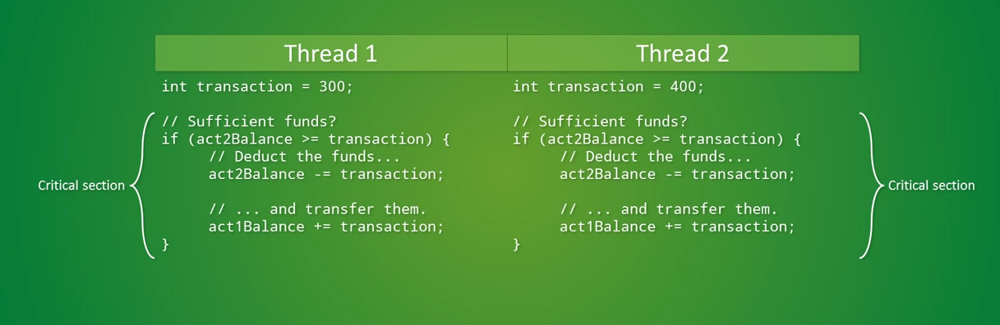

# Fundamentos

A pedra fundamental da construção de sistemas distribuídos é a capacidade de comunicação entre seus componentes.
No mundo de hoje, isto quer dizer que os *hosts* dos componentes devem possuir interfaces de rede e que estas interfaces estejam ligadas a uma rede com capacidade de roteamento de dados, estabelecendo um **canal de comunicação** entre os componentes.
Além do canal, é também necessário que se estabeleça um **protocolo de comunicação**, que define as regras para que a comunicação aconteça, por exemplo, a gramática para formação de mensagens.

Também importantes, de um ponto de vista prático do desenvolvimento, são os conceitos de concorrência e paralelismo.
Afinal, um componente pode necessitar manter várias "conversas" em paralelo com múltiplos outros componentes.

Neste capítulo, revisaremos de forma rápida tanto conceitos de redes de computadores quanto de concorrência e paralelismo.


## Canais e Protocolos de Comunicação

Um canal de comunicação é o meio pelo qual os elementos da conversa entre os componentes do sistema distribuído são transmitidos e o protocolo são as regras codificam tal conversa.
Por exemplo, quando você fala com uma pessoa, cara-a-cara, o meio de comunicação é o ar e o protocolo utilizado é a linguagem conhecida pelas duas partes, o Português por exemplo.
Na prática, canais de comunicação podem ter diversas formas e características, por exemplo:

* Ponto-a-ponto
	* Eficiente
	* Caro para muitos nós
	* Roteamento trivial
* Compartilhado
  	* Colisões
  	* Menor custo
  	* Roteamento mais complicado

Nas redes atuais, pode se dizer que o meio mais utilizado é provido pela arquitetura **Ethernet**, que trata da comunicação nós usando um **barramento compartilhado**.
Sobre este meio, são usados protocolos para, por exemplo,

* Controle de acesso ao meio 
* Transmissão de mensagens
* Evitar e tratar colisões

As redes Ethernet, contudo, cobrem pequenas áreas e para se ter conversas "mais interessantes", é necessário que se conecte diversas destas redes.
A conversa então é feita por meio de intermediários, ** *gateways* ** que conectam duas ou mais redes, permitindo que mensagens de um interlocutor sejam **roteadas** para o outro, via tais intermediários.

Um exemplo interessante das questões ligadas à manutenção da conversa entre dois pontos é a decisão sobre o uso de **comutação de pacotes** (*packet switching*) ou de **circuitos** (*circuit switching*).

* Comutaçao de pacotes 
	* Dados divididos em pacotes
	* Cada pacote viaja independentemente
	* Pacotes são perdidos
	* Latência variável
* Circuit switching
	* Caminho dedicado
	* Recursos reservados
	* Pacotes de tamanho fixo
	* Latência constante

Outro fator importante é o MTU, o tamanho máximo de um pacote em determinada rede. É necessário entender que qualquer quantidade de dados maior que o MTU precisará ser dividida em múltiplos pacotes. Também é importante perceber que redes são heterogêneas, e que o vários segmentos no caminho entre origem e destino podem ter MTU diferentes, levando à fragmentação de pacotes em trânsito e, possivelmente, entrega desordenada dos mesmos.

Finalmente, há a questão importante é relativa à confiabilidade na transmissão dos elementos da conversa, isto é, se a rede deve garantir ou não que algo "dito" por um interlocutor deve garantidamente ser "ouvido" pelo outro, ou se a mensagem pode ser perdida no meio.

Felizmente boa parte da complexidade da resolução destas questões é abstraída do desenvolvedor dos sistemas distribuídos, isto é, **você**, lhe cabendo apenas a decisão de qual protocolo utilizar.
Nas redes atuais, a conversa em componentes será feita, em algum nível, por meio dos protocolos da arquitetura **Internet**.


## A Internet

A Internet tem este nome por usar o protocolo de interconexão de redes indepententes, o *internetworking protocol*, ou IP.
Para a aplicaçãu usando o IP, todas as redes se comportam com uma única e coerente rede, exceto por alguns detalhes.
Os elementos que conectam as diversas redes são denominados **roteadores** e fazem um **melhor esforço** para encaminhar os pacotes de dados do remetente ao destinatário.



Se você se lembrar da pilha de protocolos de comunicação de referência OSI, lembrará que há sete camadas na mesma.
Cada camada é responsável pela comunicação em um nível e serve de fundação para a funcionalidade da camada de cima.
Cada camada tem um **cabeçalho** (*header*) e uma **carga** (*payload*) e o conjunto de cabeçalho + carga de uma camada é considerado carga da camada inferior.
Assim, embora tenha-se a impressão de que cada camada conversa com a equivalente do outro lado da comunicação, na prática, a comunicação desce e sobe a pilha. 




1. Bits
* Frames/quadros; controle de fluxo; acesso ao meio.
* Datagramas/pacotes; roteamento
* Controle de fluxo; fim a fim; confiabilidade; tcp e udp
* Streams/fluxos; conexões lógicas; restart; checkpoint; http, ssl
* Objetos; json, xml; criptografia
* Aplicações; http, pop, ftp

[](http://computing.dcu.ie/~humphrys/Notes/Networks/intro.2.html)

Embora o IP se refira estritamente ao protocolo da camada 3 da pilha, nos referimos à pilha que usa este protocolo como a pilha IP.
Comparada à pilha OSI, a IP é mais simples, como se vê na figura.
Como usuários da pilha IP, temos que entender como a camada 3 funciona, mas dificilmente interagiremos com algo além da camada 4, a camada de **transporte**.

Como se vê, as camadas 5 e 6 não estão presentes na pilha IP e as funcionalidades correspondentes são implementadas na camada 7, de aplicaçao.
Contudo, não tema! Estas funcionalidades podem se normalmente implementadas por meio de *frameworks* ou do *middleware* em uso.
Alguns exemplos de tais funcionalidades são

* (De)Serialização
* Nomeamento
* Criptografia
* Replicação
* Invocação remota de procedimentos

A grande vantagem desta abordagem é que se pode implementar exatamente e somente as funcionalidades desejadas.
Este característica é conhecida como o [argumento fim-a-fim no projeto de sistemas](http://web.mit.edu/Saltzer/www/publications/endtoend/endtoend.pdf); uma análise recente deste argumento foi feita [aqui](https://blog.acolyer.org/2014/11/14/end-to-end-arguments-in-system-design/).


## No princípio, era o Socket

Na prática, para implementarmos a comunicação entre processos, usamos **sockets**.
Para se definir um socket a partir de um **host** é necessário identificar o outro fim da comunicação, isto é, o outro *host*, ou melhor, uma de suas interfaces de rede.
Os sockets são então a abstração dos canais de comunicação, mas como dito antes, é necessário definir também os protocolos usados por estes sockets.
O primeiro protocolo é o de endereçamento, que define qual pilha de protocolos usar, na camada 3.
No caso da pilha IP, usa-se o protocolo AF\_INET ou PF\_INET.
Escolhido o protocolo, 

* cada interface tem um endereço MAC, na camada 2, que o identifica entre as interfaces na mesma rede local, e 
* cada interface tem um endereço IPv4/IPv6 de 32/128 bits, que o indentifica entre todos os hosts na Internet [^obs]. 

[^obs]: Endereços IP não públicos não server como identificadores únicos na Internet.

Mas dentro de um *host*, podem haver diversas aplicações sendo executadas. Como identificar exatamente com qual se quer conversar?
Isto é feito pela definição uma porta:

* Porta: 16 bits
     * [IANA](http://www.iana.org) (Internet Assigned Numbers Authority)
     * Bem conhecidas -- 0-1023
     * Proprietárias -- 49151
     * Dinâmicas -- 65535

Também é necessário definir também o protocolo de transporte dos dados, na camada 4.
Novamente, no caso da pilha IP, pode-se usar TCP (**SOCK\_STREAM**) ou UPD (**SOCK\_DGRAM**).

A API usada para estabelecer a conversa via socket tem várias chamadas, que devem ser executadas na ordem certa no processo iniciando a conversa e naquele que aceita participar da mesma. Comecemos estudando o TCP.

### TCP

O fluxograma da criação de um socket TCP é apresentado na seguinte figura:


* criar socket
* bind
* listen
* accept
* connect

Estabelecido o socket, o mesmo pode ser usado como **arquivo**, isto é, lendo-se e escrevendo-se bytes.
O que exatamente deve ser escrito e como o que é lido deve ser interpretado é o protocolo da camada 7, **sua responsabilidade**.

Vejamos um exemplo do uso de sockets, em Python.
O seguinte arquivo pode ser nomeado, por exemplo, `server.py`, mas não pode, de forma alguma, ser nomeado `socket.py`.

```Python
#server.py
#!/usr/bin/python                               # This is server.py file

import socket                                   # Import socket module

s = socket.socket()                             # Create a socket object
host = socket.gethostname()	               # Get local machine name
port = 12345                                    # Reserve a port for your service.
s.bind((host, port))                            # Bind to the port

s.listen(5)                                     # Now wait for client connections.
while True:
   c, addr = s.accept()                         # Establish connection with client.
   print('Got connection from', addr)
   c.send('Thank you for connecting'.encode())
   c.close()                                    # Close the connection
```

Para executá-lo, execute o seguinte comando em um terminal. 

```bash
python server.py
```

Em outro terminal, execute **um dos** dois comandos a seguir[^nc]: 
[^nc]: Se o segundo comando não funcionar, tente `nc` em vez de `netcat`.

```bash
telnet localhost 12345
```

```bash
netcat localhost 12345
```

O que está acontecendo aqui é um processo criou um socket e ficou aguardando uma conexão, usando o código em Python.
Tanto o telnet quando o netcat são programas genéricos para se conversar com outro processo usando TCP/IP.
Aqui, estes programas simplesmente se conectaram e imprimiram o que quer que o primeiro processo lhes tenha enviado, assumindo que correspondia a uma string, o que neste caso é correto.
Simples, não é mesmo?

Em geral, denominamos o processo que fica aguardando a conexão de **servidor** e o processo que se conecta de **cliente**. Isto por quê, em geral, o servidor executa alguma tarefa, serve, o cliente, embora isto não seja necessariamente verdade.


Por completude, vamos também escrever o código do cliente, agora que você já sabe que o servidor funciona.
Do lado cliente, estabelece-se uma conexão apontando-se para onde está o servidor.
```Python
#client.py

#!/usr/bin/python                               # This is client.py file

import socket                                   # Import socket module

s = socket.socket()                             # Create a socket object
host = socket.gethostname()                # Get local machine name
port = 12345                                    # Reserve a port for your service.

s.connect((host, port))
data = s.recv(1024)
print(data.decode())
s.close()                                         # Close the socket when done
```

E para se executar o cliente, faça:
```bash
python client.py
```

Observe que o `socket.close()` encerra a conexão do lado de quem invoca. Na contraparte, invocações a `socket.recv()` retornam com 0 bytes lidos.

A título de comparação, em Java, a criação do socket do lado do servidor seria muito mais simples, consistindo apenas em: 
```Java
Socket s = new ServerSocket(port);
```

O cliente em Java também é simplificado.
```Java
Socket s = new Socket(hostname,port);
```

#### Exercício: Múltiplos Pacotes

Façamos agora uma modificação no código do servidor para que envie não uma, mas duas mensagens para o cliente. Isto é, modifique seu servidor assim

```Python
...
   c.send('Thank you for connecting'.encode())
   c.send('Come back often'.encode())
...
```

Agora execute novamente o cliente e veja o que acontece.  Consegue explicar o fenômeno?

Modifiquemos o cliente agora, para que tenha dois `recv`, assim.
```Python
...
print("1")
data = s.recv(1024)
print(data.decode())
print("2")
data = s.recv(1024)
print(data.decode())
...
```

E agora, o que acontece? A saída é como esperava? Como explica este fenômeno e como poderia corrigí-lo?

####  Exercício: Ping-Pong

Modifique cliente e servidor tal que o cliente envie uma mensagem passada na linha de comando ao servidor e fique esperando uma resposta, e tal que o servidor fique esperando uma mensagem e então solicite ao operador que digite uma resposta e a envie para o cliente. O loop continua até que o usuário digite SAIR, e a conexão seja encerrada.

<table>
<tr>
<td> Terminal 1</td> <td> Terminal 2</td>
</tr>
<tr>
<td> 
```bash
python server.py
Esperando conexão.
Esperando mensagem.
Mensagem recebida: lalala
Digite resposta: lelele
Resposta enviada.
Conexão encerrada.
Esperando conexão.
```
</td>
<td>
```bash
python client.py
Digite mensagem: lalala
Mensagem enviada.
Esperando resposta.
Resposta recebida: lelele
Digite mensagem: SAIR
Desconectando.
```
</td>
</tr>
</table>

Observe que para ler do teclado em Python 2 você deve usar `x = raw_input()`, enquanto que em Python 3 seria `x = input()`. Além disso, em Python 2, você deve remover as invocações para `encode` e `decode`.


### UDP 

No exemplo anterior, usamos o protocolo TCP (o padrão da API). Caso quiséssemos usar UDP, precisaríamos nos atentar a alguns detalhes.

A criação do socket é feita explicitando-se o uso de **datagramas**: `s = socket.socket(socket.AF_INET,socket.SOCK_DGRAM)`

Um servidor UDP não executa `listen` ou `accept` e, em Python, simplesmente executa `data, addr = sock.recvfrom(4096)` para receber o datagrama, onde `data` é o conteúdo recebido e  `addr` o endereço de quem enviou o datagrama.

Neste caso, um mesmo socket é usado para manter comunicação com múltiplos interlocutores. Para enviar uma resposta a um interlocutor em específico, `addr` é usado: `sent = sock.sendto(data, addr)`, onde `sent` é a quantidade de bytes enviados.

Além deste detalhe, é importante manter em mente outras características do UDP:

* falta de ordem
* falta de confiabilidade
* menos dados lidos que enviados.
* mais dados lidos que enviados (pode acontecer também no TCP)

Com tantas dificuldades para se usar o UDP, fica a questão: **para que serve UDP?**


#### Exercício: Ping-Pong UDP
Modifique o código do exercício Ping-Pong para usar UDP em vez de TCP na comunicação entre nós.
Execute múltiplos clientes ao mesmo tempo. Como o seu servidor lida com isso? Modifique-o para mandar um "eco" da mensagem recebida de volta ao remetente. 


### IP-Multicast

Imagine que você tenha que enviar um *stream* de vídeo para um destinatário, mostrando como você está jogando o mais novo jogo da velha no mercado.
Qual protocolo de transporte você usaria? TCP, provavelmente, já que garante a entrega ordenada dos pacotes do vídeo.
Como você já sabe, o TCP envia confirmações de pacotes recebidos e usa uma janela deslizante para determinar quais pacotes reenviar, o que pode causar interrupções na execução do vídeo.
Além do mais, as pessoas provavelmente preferirão perder alguns quadros que perder a sincronia com sua excitante partida.
Parece que uma opção melhor seria então usar UDP, correto?

Imagine agora que os mesmos dados devam ser enviados para múltiplos destinatários (você está ficando famoso!)
Com múltiplos destinatários, múltiplos controles precisariam ser mantidos no TCP, o que pode se tornar custoso; mais uma razão para usar UDP!

Para terminar, lhe darei uma razão final: IP-Multicast!
Multicast, em oposição ao Unicast, é a capacidade de enviar mensagens para um grupo de destinatários, em vez de apenas um. 



IP-Multicast é uma implementação desta ideia, usando umaa configuração específica do UDP, associada a recursos dos comutadores de rede, para otimizar o envio dos mesmos dados a múltiplos destinatários.
Grupos são identificados por endereços IP especiais, conhecidos como Classe D (224.0.0.0-239.255.255.255), e propagados pela rede.

[](http://www.dasblinkenlichten.com/understanding-ip-multicast/)

Quando um pacote é enviado para o endereço do grupo, **todos** os membros do grupo recebem tal mensagem.
Melhor dizendo, todos os membros podem receber a mensagem, mas como estamos falando de UDP, **é possível que alguns não recebam**.
Além disso, **não há garantia qualquer sobre a ordem de recepção das mensagens**.

Apenas reforçando, IP-Multicast só funciona com UDP, pois lidar com retransmissões em um grupo grande levaria a um estado imenso sendo mantido na origem dos dados.
Outro ponto importante é que pelo podencial desestabilizador do IP-Multicast, ele é normalemente limitado à pequenas seções das redes.

Mas experimentemos com esta tecnologia na prática.
Criemos um programa que **criar Socket UDP**, **associa-o a um grupo**, e **recebe pacotes** destinados ao grupo.

```Java
// MReceiver.java
import java.io.*;
import java.net.*;

public class MReceiver {
  public static void main(String[] args) {
    byte[] inBuf = new byte[256];
    try {
      MulticastSocket socket = new MulticastSocket(8888);
      InetAddress address = InetAddress.getByName("224.2.2.3");
      socket.joinGroup(address);
      while (true) {
        DatagramPacket inPacket = new DatagramPacket(inBuf, inBuf.length);
        socket.receive(inPacket);
        String msg = new String(inBuf, 0, inPacket.getLength());
        System.out.println("From " + inPacket.getAddress() + " Msg : " + msg);
      }
    }catch (IOException ioe) {
      System.out.println(ioe);
    }
  }
}
```

Instancie múltiplos processos deste, na mesma máquina e em máquinas distintas.
Agora criemos um programa que envia pacotes para o dito grupo.

```Java 
// MSender.java
import java.io.*;
import java.net.*;
public class MSender {
 public static void main(String[] args) {
  byte[] outBuf;
  final int PORT = 8888;
  try {
   DatagramSocket socket = new DatagramSocket();
   long counter = 0;
   InetAddress address = InetAddress.getByName("224.2.2.3");
   while (true) {
    counter++;
    outBuf = ("Multicast numero " + counter + " " + address).getBytes();
    DatagramPacket outPacket = new DatagramPacket(outBuf, outBuf.length, address, PORT);
    socket.send(outPacket);
    try { Thread.sleep(500); }catch (InterruptedException ie) {}
   }
  } catch (IOException ioe) { System.out.println(ioe); }
 }
}
```

Observe como a mesma mensagem é recebida pelos vários membros e que como diferentes fontes tem seus pacotes recebidos.

A título de curiosidade, IP-Multicast também está presente em IPv6, mas com algumas pequenas diferenças 

!!! note "IP-Multicast em IPv6[^ipv6multi]"
    In IPv6, the left-most bits of an address are used to determine its type. For a multicast address, the first 8 bits are all ones, i.e. FF00::/8. Further, bit 113-116 represent the scope of the address, which can be either one of the following 4: Global, Site-local, Link-local, Node-local.

    In addition to unicast and multicast, IPv6 also supports anycast, in which a packet can be sent to any member of the group, but need not be sent to all members.''

[^ipv6multi]: [IP-Multicast em IPv6](http://www.baeldung.com/java-broadcast-multicast)


#### Exercício: IP-Multicast

Implemente e teste o seguinte sevidor.

```Python
import socket
import struct

MCAST_GRP = '224.1.1.1'
MCAST_PORT = 5007

sock = socket.socket(socket.AF_INET, socket.SOCK_DGRAM, socket.IPPROTO_UDP)
sock.setsockopt(socket.SOL_SOCKET, socket.SO_REUSEADDR, 1)
sock.bind((MCAST_GRP, MCAST_PORT))
mreq = struct.pack("=4sl", socket.inet_aton(MCAST_GRP), socket.INADDR_ANY)
#4 bytes (4s) seguidos de um long (l), usando ordem nativa (=)

sock.setsockopt(socket.IPPROTO_IP, socket.IP_ADD_MEMBERSHIP, mreq)

while True:
    print(sock.recv(10240).decode())
```


Implemente e teste o seguinte cliente.

```Python
import socket

MCAST_GRP = '224.1.1.1'
MCAST_PORT = 5007

sock = socket.socket(socket.AF_INET, socket.SOCK_DGRAM, socket.IPPROTO_UDP)
sock.setsockopt(socket.IPPROTO_IP, socket.IP_MULTICAST_TTL, 2)
sock.sendto(input().encode(), (MCAST_GRP, MCAST_PORT))
```

---

### Referências

* [UDP em Python](http://pymotw.com/2/socket/udp.html)
* [UDP em Python](http://www.tutorialspoint.com/python/python_networking.htm)
* [Multicast em Java](lycog.com/programming/multicast-programming-java/)
* [Multicast em Python](https://stackoverflow.com/questions/603852/multicast-in-python)


## Multiprogramação e *Multithreading* em Sistemas Distribuídos

É impossível pensar em sistemas distribuídos sem pensar em concorrência na forma de múltiplos processos executando, normalmente, em hosts distintos.
De fato, os exemplos que apresentamos até agora consistem todos em um processo cliente requisitando ações de algum processo servidor.
Apesar disso, a interação entre tais processos aconteceu sempre de forma sincronizada, *lock-step*, em que o cliente requisitava o serviço e ficava bloqueado esperando a resposta do servidor, para então prosseguir em seu processamento. 
O servidor, de sua parte, fica bloqueado esperando requisições, que atende e então volta a dormir.
Assim, apesar do uso de processadores distintos e da concorrência na execução dos processos, temos um baixo grau de efetivo paralelismo.


Para usarmos melhor os recursos disponíveis, tanto do lado dos clientes quanto servidores, uma das razões de ser da computação distribuída, temos então que pensar em termos eventos sendo disparados entre os componentes, que devem ser tratados assim que recebidos ou tão logo haja recursos para fazê-lo. 
Estes eventos correspondem tanto a requisições quanto a respostas (efetivamente tornando difícil a distinção).
Além disso, sempre que possível, um componente não deve ficar exclusivamente esperando por eventos, aproveitando a chance executar outras tarefas até que eventos sejam recebidos.
Dada que processos interagem com a rede usando sockets, cuja operação de leitura é bloqueante, para aumentar a concorrência em um processo, precisamos falar de multi-threading.

Há duas razões claras para estudarmos multi-threading. A primeira, de ordem prática, é a discutida acima: permitir o desenvolvimento de componentes que utilizem "melhormente" os recursos em um host.
A segunda, didática, é o fato que muitos dos problemas que aparecem em programação multi-thread, aparecem em programação multi-processo (como nos sistemas distribuídos), apenas em um grau de complexidade maior.
Para relembrar, há várias diferenças entre *threads* e processos, mas a abstração é essencialmente a mesma:

| Processo | Thread |
|----------|--------|
| Instância de um programa | "Processo leve"|
| Estado do processo | Estado do thread | 
| Função main | "qualquer" função|
| Memória privada ao processo| Compartilha estado do processo que os contém|
| Código, Stack, Heap, descritores (e.g, file descriptors), controle de acesso | Stack, variáveis locais |
| IPC - Inter process communication  | IPC -- Inter process communication|
| Sistema operacional | Diferentes implementações |
| | Posix, C++, Java, ...|

Vejamos como o uso de múltiplos threads podem melhorar o desenvolvimento de sistemas distribuídos na prática.
Considere os exemplos de clientes e servidores vistos [anteriormente](#tcp).
Imagine que em vez do serviço simples feito no exemplo, o servidor retorne uma página Web.
Detalhes do protocolo seguido por navegadores e servidores serão vistos mais tarde. Por agora, considere apenas que uma requição `GET arquivo.html` será enviada para o servidor que lerá o arquivo especificado do sistema de arquivos; como você sabe, ler um arquivo é uma operação lenta e que não requer CPU.


### Cliente multithreaded

Do ponto de vista do cliente, a vantagem do uso de múltiplos threads são claras: permite lidar com **várias tarefas concorrentemente**, por exemplo solicitar CSS, HTML e imagens concorrentemente, **escondendo latência** das várias operações, e permite **organizar código** em blocos/módulos.
Se você usar o console de desenvolvimento do navegador, verá que trinta e seis requisições são feitas para carregar a página [www.google.com](https://www.google.com); um número muito maior é feito na carga de [www.bing.com](https://www.bing.com).

<h1> TODO </h1>
---

### Servidor multithreaded

#### Single-threaded
Há diversas possibilidades de uso de threads em servidores. A mais simples é usar apenas um, com temos feito até agora:

1. o cliente envia a requisição para o servidor
2. o servidor aceita a conexão em seu único thread
3. uma tarefa é gerada para ler o arquivo
4. o arquivo é lido, de forma bloqueante, e uma resposta para o cliente é preparada
5. a resposta é enviada para o cliente, de forma bloqueante
6. a requisição é descartada
7. o thread do servidor volta a esperar uma nova requisição


#### Thread per request

Outra opção é criar um novo thread para cada nova requisição, levando a múltiplos threads atendendo a múltiplas requisições concorrentemente.
Desta forma, quando um thread é bloqueado para leitura de arquivos do disco, outros clientes podem continuar sendo atendidos.


Contudo, o número de threads que se pode criar em um SO é limitado. 
Além disso, a criação e destruição de threads é cara e por isso devemos evitar este processo.

#### Thread pool

Assim, temos uma outra opção que também usa múltiplos threads, que usa *pools*  de threads para lidar com as requições.
No cerne desta abordagem, junto com um pool de threads, fica uma fila bloquenante **thread-safe**, isto é, que se mantem correta mesmo quando múltiplos threads operam nela tanto para inserir quanto remover tarefas, e que bloqueia os threads que tentam inserir quando a fila está cheia ou remover quando ela está vazia.

[](https://www3.nd.edu/~dthain/courses/cse30341/spring2009/project4/project4.html)

Um thread principal é encarregado de receber as requisições e colocar na fila bloqueante; se a fila fica cheia, o thread principal fica bloqueado esperando por espaço, fazendo com que novas conexões tenham que esperar.
Os threads do pool removem uma tarefa da fila, a tratam e, ao final do atendimento,  pegam nova requisição na fila, em um loop infinito; se a fila se esvazia, os threads ficam bloqueados esperando novas requisições.

É possível refinar mais este modelo, quebrando o processamento em vários pools, no que é conhecido como **Staged Event-Driven Architecture**, SEDA.

[](http://images.cnitblog.com/blog/13665/201306/15180500-a54c8eb3d73246469f1b74ee74f2119b.png)

Nesta abordagem, cada **estágio**,  por ter seu próprio *pool*, pode ser escalado individualmente de acordo com a demanda do estágio.
Esta abordagem também é útil quando múltiplas partes da tarefa consistem em E/S.

[](http://images.cnitblog.com/blog/13665/201306/15180500-a54c8eb3d73246469f1b74ee74f2119b.png)

Uma extrapolação que pode ser feita aqui, reforçando a observação que problemas (e soluções) de sistemas distribuídos são refletidos em nível de processamento paralelo e concorrente, é que a uma arquitetura SEDA lembra em muito a arquitetura de [micro-serviços](http://muratbuffalo.blogspot.com.br/2011/02/seda-architecture-for-well-conditioned.html).

Para aprender mais sobre SEDA, vá [aqui](http://courses.cs.vt.edu/cs5204/fall05-gback/presentations/SEDA_Presentation_Final.pdf).  


<h1> TODO </h1>


#### Problemas com multithreading

Idealmente, os threads que compartilham variáveis seriam colocados nos mesmos processadores.
E se não houvesse compartilhamento e dado um número adequado de processadores, teríamos paralelismo perfeito.


A realidade, contudo, é outra e simplesmente criar múltiplos threads não garante paralelismo perfeito, pois o SO é quem é responsável por escalonar os mesmos.



Memes bonitinhos à parte, precisamos enfrentar condições de corrida de forma a não levar **inconsistências**.



Para isso, usamos as primitivas de controle de concorrência que estudaram em SO, que também tem seus problemas em potencial, como **deadlocks** e **inanição**.
Veja o seguinte vídeo para uma análise detalhada do cenário anterior e outros pontos importantes.

<iframe width="560" height="315" src="https://www.youtube.com/embed/JRaDkV0itbM" frameborder="0" allow="accelerometer; autoplay; encrypted-media; gyroscope; picture-in-picture" allowfullscreen></iframe>


#### Estado em Servidores


##### Stateless Servers

Não mantém informação após terminar de tratar requisições.

* Fecha todos os arquivos abertos
* Não faz promessas de atualização ao cliente
* Clientes e servidores são independentes
	
* Pouca ou nenhuma inconsistência causada por falhas
* Perda de desempenho (e.g., abertura do mesmo arquivo a cada requisição.)


##### Stateful Servers

Mantém informação dos clientes entre requisições.

* Mantem arquivos abertos
* Sabe quais dados o cliente tem em cache
	
* Possíveis inconsistência causada por falhas (cliente se conecta a servidor diferente)
* Melhor desempenho
	
* Maior consumo de recursos


##### Impacto na Concorrência

| Stateless | Stateful |
|-----------|----------|
| Resultado depende da entrada| Depende do histórico de entradas |
| Qualquer servidor pode atender | Mesmo servidor deve atender |


### Multithread na prática

#### PThreads

##### Função de entrada

```c
#include <stdio.h>
#include <stdlib.h>
#include <pthread.h>
	
int thread_count;

void* hello(void* rank) {
	long my_rank = (long) rank;
	printf("Hello from thread %ld of %d\n", my_rank, thread_count);
	return NULL;
}
```

##### Criação

```c
int main(int argc, char* argv[]) {
	long thread;
	pthread_t* thread_handles;
	
	if(argc < 2) {
		printf("usage: %s <number of threads>", argv[0]); 
		return 1;
	}
	
	thread_count = strtol(argv[1], NULL, 10);
	thread_handles = malloc(thread_count*sizeof(pthread_t));
	
	for (thread = 0; thread < thread_count; thread++)
		pthread_create(&thread_handles[thread], NULL, hello, (void*) thread);
	
	printf("Hello from the main thread\n");
```	

##### Destruição

```c
	for (thread = 0; thread < thread_count; thread++)
		pthread_join(thread_handles[thread], NULL);
	
	free(thread_handles);
```

##### Execução

Compile com
```bash
gcc -pthread teste.c -o teste
````

e execute com 
```bash
./teste 5
```

Observe que a saída das threads é *ordenada*. Agora experimente
```bash
./teste 200
```

Isto acontece porquê a execução das threads independe da ordem de criação. De fato, usando PThreads, temos pouco controle sobre os threads que criamos. Mas isto não quer dizer que estamos "órfãos" de API.

* `pthread_create` - cria novo thread
   * passagem de parâmetros
   * opções
* `pthread_join` - espera thread terminar
   * recebe resultado da thread
* `pthread_tryjoin` - espera thread terminar
* `pthread_exit` - termina a thread e retorna resultado 
   > An implicit call to \lstinline|pthread_exit()| is made when a thread other than the thread in which \lstinline|main()| was first invoked returns from the start routine that was used to create it. The function's return value serves as the thread's exit status. (manual do \lstinline|pthread_exit|)}
	
* pthread_attr_setaffinity_np\* - ajusta afinidade dos threads.

##### Threads Java

Neste tutorial, baseado neste [outro](https://docs.oracle.com/javase/tutorial/essential/concurrency/), exploraremos formas de se obter concorrência em Java. Isto é, exploraremos como iniciar múltiplas linhas de execução de instruções, que podem ou não, ser executadas em paralelo.

Em Java, há essencialmente duas formas de se conseguir concorrência. A primeira é via instâncias explícitas da classe `Thread`, e a segunda é via abstrações de mais alto nível, os `Executors`.

---
* Thread
* Executor
---

Além de formas de definir as linhas de execução, Java provê diversas estruturas para comunicação e coordenação destas linhas, desde de a versão 5 da linguagem, no pacote `java.util.concurrent`.


#### *Threads*
Há duas formas básicas de se usar a classe `Thread`: extensão ou delegação de um objeto implementando `Runnable`.


---
###### Estender Thread
```Java
public class HelloThread extends Thread {
    public void run() {
        System.out.println("Hello from a thread!");
    }

    public static void main(String args[]) {
        Thread t = new HelloThread();
        t.start();
    }
}
```
---


---
###### Implementar Runnable
```Java
public class HelloRunnable implements Runnable {
    public void run() {
        System.out.println("Hello from a thread!");
    }

    public static void main(String args[]) {
        Thread t = new Thread(new HelloRunnable());
        t.start();
    }
}
```
---

Observe que nos dois exemplos, um método `run()` é implementado com o código a ser executado pelo *thread*. Em nenhum dos exemplos, contudo, o método é invocado diretamente. 
Em vez disto, o método `start()`, sim, é invocado. Isto ocorre pq antes de executar as instruções definidas pelo pelo programador no método `run()`,
a máquina virtual precisa executar alguma "mágica" por baixo dos panos como, por exemplo, solicitar ao sistema operacional a criação de um *thread* do SO, que servirá de hospedeiro para o *thread* Java. 
Isto acontece dentro do `start()`, que em algum ponto de sua execução levará a invocação do método `run()`.

A classe `Thread` também provê uma série de métodos que permitem gerenciar a vida do *thread* criado. 
Por exemplo, o método de classe (`static`) `Thread.sleep()` permite bloquear um *thread*  por um determinado período.


---
###### Thread.sleep()
```Java
public class HelloRunnable implements Runnable {
    public void run() {
        for (int i = 0; i < 10; i ++)
        {
            System.out.println("Hello at instant " + i);
            try {
                Thread.sleep(1000);
            } catch (InterruptedException ie) {
                System.out.println("awoken");
            }
        }
    }

    public static void main(String args[]) {
        Thread t = new Thread(new HelloRunnable());
        t.start();
    }
}
```
---

Observe que a chamada a `sleep()` está dentro de um bloco `try/catch`. Isto é necessário pois é permitido à JVM acordar o *thread* em qualquer instante, antes ou após o tempo especificado. Assim, embora normalmente o tempo "dormido" seja próximo ao especificado, se há requisitos de precisão, é necessário que o *thread*, ao acordar, verifique se já dormiu o suficiente.

---
###### InterruptedException
```Java
public class HelloRunnable implements Runnable {
    public void run() {
        for (int i = 0; i < 10; i ++)
        {
            System.out.println("Hello at instant " + i);
            long before = System.currentTimeMillis();
            long timeout = 1000;
            while(before + timeout > System.currentTimeMillis())
            {
                try {
                    Thread.sleep(Math.max(0,System.currentTimeMillis() - (before + timeout)));
                } catch (InterruptedException ie) {
                    System.out.println("awoken");
                }
            }
        }
    }

    public static void main(String args[]) {
        Thread t = new Thread(new HelloRunnable());
        t.start();
    }
}
```
---

Quando um *thread* está sendo executado, outros podem ter que esperar até que complete. Por exemplo, no caso de um navegador
Web, o *thread* que faz a renderização da página não pode começar a trabalhar enquanto o *thread*  que solicitou o HTML
do servidor não receber sua resposta. Um *thread* indica a intenção de esperar por outro usando o método `join()`.


---
###### Thread.join()
```Java
public class HelloRunnable implements Runnable {
    public void run() {
        Random rand = new Random();
        for (int i = 0; i < 10; i ++)
        {
            System.out.println("Hello at instant " + i);
            long before = System.currentTimeMillis();
            long timeout = 901 + rand.nextInt(200);
            while(before + timeout > System.currentTimeMillis())
            {
                try {
                    Thread.sleep(Math.max(0,System.currentTimeMillis() - (before + timeout)));
                } catch (InterruptedException ie) {
                    System.out.println("awoken");
                }
            }
        }
    }

    public static void main(String args[]) {
        Thread t = new Thread(new HelloRunnable());
        //t.setDaemon(true);
        t.start();
        try {
            t.join();
            //t.join(10000);
        } catch (InterruptedException ie) {
            System.out.println("Waiting was interrupted");
        }
        if (t.isAlive())
            System.out.println("Got tired of waiting");
        else
            System.out.println("Wait is over");
    }
}
```
---

Invocar `t.join()` fará com que o *thread* principal espere indefinidamente até que `t` termine de executar.
Caso seja necessário limitar o tempo de espera, o tempo pode ser especificado como na linha comentada. 
Caso a espera termine por causa de um *timeout*, é possível testar o estado atual do thread com `Thread.isAlive()`.

Outro método interessante, `Thread.setDaemon()`, especifica que o *thread* pode ser terminado quando a *thread* principal terminar. Descomente a invocação e teste o efeito.

##### Exercício

Vejamos um exemplo simples do uso de *threads*.

* Instancie um programa que gere 10 *threads*. 
* Todos os *threads* devem compartilhar **uma mesma instância** de `Counter`
* Cada *thread* deve executar um *loop* em que incrementa o valor do contador 20 vezes 
  * a cada vez, imprime o resultado precedido do identificador do *thread* (use `Thread.getName()` ou `Thread.currentThread().getName()`)
* A *thread*  principal deve esperar todas as outras terminarem antes de terminar (use `Thread.join()`).
* Analise a saída do programa observando a ordem de execução dos *threads*.

---
##### Counter.java
```Java
class Counter {
    private int c = 0;

    public int increment() {
        return ++c;
    }

    public int decrement() {
        return --c;
    }

    public int value() {
        return c;
    }
}
```


É fácil observar que a saída do programa é aleatória nos identificadores e tende a ser incremental nos contadores, mas nem sempre isso é verdade. 
Como discutido anteriormente, frequentemente *threads* tem que coordenar suas ações para que não pisem uns nos outros, por exemplo decidindo quem deve ser o próximo a entrar em uma região crítica ou será o responsável por uma tarefa. 
Em Java, esta coordenação pode ser feita por diversas abstrações: `synchronized`, `Lock`, variáveis atômicas, ...


#### `synchronized`
Ao definir métodos como `synchronized`, garante-se que os mesmos nunca serão executados concorrentemente. 
Observe a classe a seguir, que modifica o contador do exercício anterior.

---
##### synchronized
```Java
public class SynchronizedCounter {
    private int c = 0;

    public synchronized int increment() {
        return ++c;
    }

    public synchronized int decrement() {
        return --c;
    }

    public synchronized int value() {
        return c;
    }
}
```
---

Caso dois *threads* invoquem os métodos `increment` e `decrement` ao mesmo tempo, por exemplo, a JVM fará com que um dos *threads* pare sua execução até que o outro tenha completado a invocação.
Isto não quer dizer que executar o exercício anterior com esta versão do contador não levará a saídas com incrementos completamente sequenciais, pois um *thread*  poderia parar de ser executado logo após incrementar o contador, depois de terminado o método `increment`, e só voltar a executar depois que outro tenha incrementado e impresso na tela o valor obtido. 
O que quer dizer é que, mesmo que saídas estranhas existam, cada operação foi executada integralmente antes da operação seguinte.

##### Exercício
Modifique o código do exercício anterior para usar a versão `synchronized` do contador. Depois de executá-lo, adicione um `println("Dentro: " + c)` **dentro** do método de incremento para verificar que estas saídas acontecem ordenadamente.

#### Blocos `synchronized`
`synchronized` funciona porquê limita a concorrência, e é problemático exatamente pela mesma razão. 
Por isso, é essencial que o `synchronized` seja o mais limitado possível em termos de escopo, o que nos leva ao uso de `synchronized` em blocos de código menores que métodos. Por exemplo:

---
##### blocos `synchronized`
```Java
public class Namer {
    String lastName = null;
    int nameCount = 0;

    public void addName(String name) {
       lastName = name;
        synchronized(this) {
           nameCount++;
        }
        nameList.add(name);
    }
}
```

Neste caso, blocos sincronizados **no mesmo objeto**, não são executados concorrentemente, mas outros blocos sim.

##### Exercício
Neste exercício, use dois objetos para travar o acesso a dois contadores. Instancie um programa com dois *threads*  tal que:
* executem um loop 1000 vezes em que
* o primeiro *thread* primeiro invoca `inc1` e depois `inc2`
* o segundo *thread* primeiro invoca `inc2` e depois `inc1`
* ambos os threads imprimem o valor de `c1` e `c2`

---
##### synchronized
```Java
public class MsLunch {
    private long c1 = 0;
    private long c2 = 0;
    private Object lock1 = new Object();
    private Object lock2 = new Object();

    public void inc1() {
        synchronized(lock1) {
            c1++;
        }
    }

    public void inc2() {
        synchronized(lock2) {
            c2++;
        }
    }
}
```

#### *Deadlock*
O uso dos "locks" em ordens diferentes pode levar a um deadlock, pois o seguinte grafo de dependência poderá ser gerado:

---
##### Deadlock
```plantuml
digraph Test {
T1 -> lock1
lock1 -> T2
T2 -> lock2
lock2 -> T1
}
```
---

#### Sinalização
Usados corretamente, o bloco `synchronized` é executado de forma atômica, isto é, indivisível.
Algumas operações muito simples são naturalmente atômicas, e não precisam ser "protegidas" pelo `synchronized`.
Por exemplo, leituras e escritas de tipos básicos como (`int`, `char`, `byte`, mas não `long` ou `double`), ou variáveis declaradas `volatile`.

Usando estas variáveis, é possível coordenar *threads*, por exemplo, assim:

---
##### Espera ocupada
```Java
boolean condicao = false;

...

public void espereCondicao() {
    while(!condicao) {}
    System.out.println("condicao alcancada.");
}

...

public void satisfacaCondicao() {
    condicao = true;
}
```
---


Embora correto, esta abordagem não é eficiente, pois o primeiro método desperdiça computação. 
Felizmente, em Java, todos os objetos implementam os métodos `wait` e `notify/notifyAll`, que podem ser usados para sincronizar eficientemente *threds*.


---
##### Wait/Notify
```Java
public class Sync{
   Object synch = new Object();
   boolean condicao = false;
   public void espereCondicao() {
      while(!condicao) {
         try {
            synch.wait();
         } catch (InterruptedException e) {}
      }
      System.out.println("Condicao alcancada");
   }
...
   public void satisfacaCondicao() {
      condicao = true;
      synch.notifyAll();
   }
}
```
---


#### *Locks*
Outras abstrações para coordenação de *threads* estão disponíveis no pacote `java.util.concurrent`. 
As mais simples delas são `java.util.concurrent.locks.Lock` e `java.util.concurrent.locks.ReentrantLock`. 
Veja um exemplo de uso, notando o idioma de uso dentro de block `try/catch`.

---
##### Lock
```Java
Lock l = new ReentrantLock();
  l.lock();
  try {
     // access the resource protected by this lock
  } finally {
     l.unlock();
  }
```
---


### Executor
Além de *threads*, Java disponibiliza `Executor` como abstração de mais alto nível para execução de tarefas concorrentes.

---
##### Executor
* `Executor`
* `ExecutorService`
* `ScheduledExecutorService`

```
Executor e = ...;
Runnable r = ...;
e.execute(r);
```
---

Executors normalmente implementam *thread pools*, que podem ser de diferentes tipos. 
O mais simples é o de tamanho fixo em que há um número inicial de *threads* criados e que, no caso de algum ser terminado, por exemplo por causa de uma exceção não tratada, cria substitutos para manter o número constante.

---
##### ThreadPool
`Executor e = java.util.concurrent.Executors.newFixedThreadPool();`

* `newCachedThreadPool()` - *expandable thread pool*
* `newSingleThreadExecutor()` - *single task at a time*
* e outras versões
* `ForkJoinPool`
---

---
##### Fork/Join
```
if (my portion of the work is small enough)
  do the work directly
else
  split my work into two pieces
  invoke the two pieces and wait for the results
```
---

### Estrutura para Coordenação de *Threads*
Finalmente, Java também disponibiliza estruturas de dados que podem ser acessadas concorrentemente por múltiplos *threads* 
sem risco de corrupção. 

---
##### Alguns tipos interessantes

* `BlockingQueue` - bloquei *threads*  se não houver elementos na filq.
* `ConcurrentMap/ConcurrentHashMap` - operações atômicas;
   * `if (!m.containsKey(k)) m.put(k,v);`
   * `vOld = m.putIfAbsent(k,v);`
---

---
##### Tipos Atômicos

```java
import java.util.concurrent.atomic.AtomicInteger;

class AtomicCounter {
    private AtomicInteger c = new AtomicInteger(0);

    public void increment() {
        c.incrementAndGet();
    }

    public void decrement() {
        c.decrementAndGet();
    }

    public int value() {
        return c.get();
    }
}
```
---


---
##### ThreadLocal
```java
private static ThreadLocal<Integer> myId = new ThreadLocal<Integer>() {
   public Integer initialValue() {
      return new Random().nexInt();
   } 
};

public static Integer getMyId() { 
    return myId.get();
}
```
---

Para aprender mais, muito mais sobre concorrência em Java, ótimas referências são:

* [Java Concurrency in Practice](http://jcip.net/)
* [The Well-Grounded Java Developer](https://www.manning.com/books/the-well-grounded-java-developer)
* [Concorrência em Java](http://docs.oracle.com/javase/tutorial/essential/concurrency/simple.html)
* [Futures e Promises](http://winterbe.com/posts/2015/04/07/java8-concurrency-tutorial-thread-executor-examples/)
* [Locks](http://winterbe.com/posts/2015/04/30/java8-concurrency-tutorial-synchronized-locks-examples/)
* [Tipos Atômicos](http://winterbe.com/posts/2015/05/22/java8-concurrency-tutorial-atomic-concurrent-map-examples/)

---

#### Threads em Python

```python
#!/usr/bin/python
import thread
import time

# Define a function for the thread
def print_time( threadName, delay):
   count = 0
   while count < 5:
      time.sleep(delay)
      count += 1
      print "%s: %s" % ( threadName, time.ctime(time.time()) )

# Create two threads as follows
try:
   thread.start_new_thread( print_time, ("Thread-1", 2, ) )
   thread.start_new_thread( print_time, ("Thread-2", 4, ) )
except:
   print "Error: unable to start thread"

while True:
   pass
```

Ou

```python
#!/usr/bin/python

import threading
import time

exitFlag = 0

class myThread (threading.Thread):
   def __init__(self, threadID, name, counter):
      threading.Thread.__init__(self)
      self.threadID = threadID
      self.name = name
      self.counter = counter
   def run(self):
      print "Starting " + self.name
      print_time(self.name, self.counter, 5)
      print "Exiting " + self.name

   def print_time(threadName, counter, delay):
      while counter:
         if exitFlag:
            threadName.exit()
         time.sleep(delay)
         print "%s: %s" % (threadName, time.ctime(time.time()))
         counter -= 1

# Create new threads
thread1 = myThread(1, "Thread-1", 1)
thread2 = myThread(2, "Thread-2", 2)

# Start new Threads
thread1.start()
thread2.start()

print "Exiting Main Thread"
```


[Threads em Python](https://www.tutorialspoint.com/python/python_multithreading.htm)


### Exercício - Anel Multithread

* Usando uma linguagem de alto-nível como C/C++/Java, escrever um programa que crie 30 threads e faça com que uma mensagem circule entre os mesmos. 
* A mensagem é uma string aleatória de pelo menos 80 caracteres. 
* A cada vez que um thread recebe a mensagem ele a imprime, modifica o primeiro caractere minúsculo para maiúsculo, caso exista, dorme por 1 segundo, e repassa a mensagem. 
* Quando todos os caracteres forem maiúsculos, o processo repassa a mensagem e então termina. 
* Antes de terminar, o processo deve imprimir a mensagem resultante.

---
layout: default
title: RPC
parent: Comunicação
has_children: true
nav_order: 3
---

# Invocação Remota de Procedimentos - RPC

## Abaixo os Sockets!

O desenvolvimento de sistemas distribuídos usando diretamente Sockets como forma de comunicação entre componentes não é para os fracos de coração.
Sua grande vantagem está no **acesso baixo nível à rede**, e todo o ganho de desempenho que isso pode trazer.
Suas desvantagens, entretanto, são várias:
* interface de "arquivo" para se ler e escrever bytes;
* controle de fluxo de "objetos" é por conta da aplicação, isto é, a aplicação precisa sinalizar quantos bytes serão escritos de um lado, para que o outro saiba quanto ler para obter um "objeto" correto;
* logo, a serialização e desserialização de objetos é também por conta da aplicação;
* tratamento de desconexões e eventuais reconexões também é gerenciado pela aplicação, e nem a tão famosa confiabilidade do TCP ajuda.

## Representação de dados

Enquanto se poderia argumentar que algumas destas desvantagens podem ser descartadas em função da discussão de incluir ou não API na comunicação [fim-a-fim](http://web.mit.edu/Saltzer/www/publications/endtoend/endtoend.pdf), é certo que algumas funcionalidades são ubíquas em aplicações distribuídas.
Uma delas é a serialização de dados complexos.
Imagine-se usando um tipo abstrato de daados com diversos campos, incluindo valores numéricos de diversos tipos, strings, aninhamentos, tudo somando vários KB.
Você terá que se preocupar com diversos fatores na hora de colocar esta estrutura *no fio*:
* tipos com definição imprecisa
  * Inteiro: 16, 32, 64 ... bits?
* ordem dos bytes
  * little endian?
    * Intel x64, 
    * IA-32
  * big endian?
    * IP
    * SPARC (< V9), 
    * Motorola, 
    * PowerPC
  * bi-endian
    * ARM, 
    * MIPS, 
    * IA-64
* Representação de ponto flutuante
* Conjunto de caracteres
* Alinhamento de bytes
* Linguagem mais adequada ao problema e não à API socket
  * Classe x Estrutura
* Sistema operacional
  * crlf (DOS) x lf (Unix)
* fragmentação <br>
  [](http://www.acsa.net/IP/)

Uma abordagem comumente usada é a representação em formato textual "amigável a humanos".
Veja o exemplo de como o protocolo HTTP requisita e recebe uma página HTML.
```HTML
telnet www.google.com 80
Trying 187.72.192.217...
Connected to www.google.com.
Escape character is '^]'.
GET / HTTP/1.1
host: www.google.com

```
As linhas 5 e 6 são entradas pelo cliente para requisitar a página raiz do sítio [www.google.com](https://www.google.com).
A linha 7, vazia, indica ao servidor que a requisição está terminada.

Em resposta a esta requisição, o servidor envia o seguinte, em que as primeiras linhas trazem metadados da página requisitada e, após a linha em branco, vem a resposta em HTML à requisição.

```HTML
HTTP/1.1 302 Found
Location: http://www.google.com.br/?gws_rd=cr&ei=HTDqWJ3BDYe-wATs_a3ACA
Cache-Control: private
Content-Type: text/html; charset=UTF-8
P3P: CP="This is not a P3P policy! See https://www.google.com/support/accounts/answer/151657?hl=en for more info."
Date: Sun, 09 Apr 2017 12:59:09 GMT
Server: gws
Content-Length: 262
X-XSS-Protection: 1; mode=block
X-Frame-Options: SAMEORIGIN
Set-Cookie: NID=100=NB_AruuFWL0hXk2-h7VDduHO_UkjAr6RaqgG7VbccTsfLzFfhxEKx21Xpa2EH7IgshgczE9vU4W1TyKsa07wQeuZosl5DbyZluR1ViDRf0C-5lRpd9cCpCD5JXXjy-UE; expires=Mon, 09-Oct-2017 12:59:09 GMT; path=/; domain=.google.com; HttpOnly

<HTML><HEAD><meta http-equiv="content-type" content="text/html;charset=utf-8">
<TITLE>302 Moved</TITLE></HEAD><BODY>
<H1>302 Moved</H1>
The document has moved
<A HREF="http://www.google.com.br/?gws_rd=cr&amp;ei=HTDqWJ3BDYe-wATs_a3ACA">here</A>.
</BODY></HTML>
```

Representações textuais são usadas em diversos protocolos como SMTP, POP, e telnet.
Algumas destas representações seguem padrões formalizados, o que facilita a geração e interpretação dos dados. 
Dois padrões bem conhecidas são XML e JSON.

[XML](https://xml.org) é o acrônimo para *Extensible Markup Language*, ou seja, uma linguagem marcação que pode ser estendida para representar diferentes tipos de informação.
A HTML, por exemplo, é uma instância de XML destinada à representação de hipertexto (A bem da verdade, XML foi uma generalização de HTML).

Por exemplo, para representarmos os dados relativos à uma pessoa, podemos ter uma instância XML assim:

```xml
<person>
    <name>John Doe</name>
    <id>112234556</id>
    <email>jdoe@example.com</email>
    <telephones>
       <telephone type="mobile">123 321 123</telephone>
       <telephone type="home">321 123 321</telephone>
    </telephones>
</person>
```

Uma das grandes vantagens do uso de XML é a possibilidade de se formalizar o que pode ou não estar em um arquivo para um certo domínio utilizando um [XML *Domain Object Model*](https://docs.microsoft.com/pt-br/dotnet/standard/data/xml/xml-document-object-model-dom). Há, por exemplo, modelos para representação de documentos de texto, governos eletrônicos, representação de conhecimento, [etc](http://www.xml.org/).
Sua maior desvantagem é que é muito verborrágico e por vezes complicado de se usar, abrindo alas para o seu mais famoso concorrente, JSON.


[JSON](http://json.org/) é o acrônimo de *Javascript Object Notation*, isto é, o formato para representação de objetos da linguagem Javascript.
Devido à sua simplicidade e versatilidade, entretanto, foi adotado como forma de representação de dados em sistemas desenvolvidos nas mais diferentes linguagens.
O mesmo exemplo visto anteriormente, em XML, é representado em JSON assim:

```json
{
    "name": "John Doe",
    "id": 112234556,
    "email": "jdoe@example.com",
    "telephones": [
        { "type": "mobile", "number": "123 321 123"},
        { "type": "home", "number": "321 123 321"},
    ]
}
```

Em Python, por exemplo, JSON são gerados e interpretados nativamente, sem a necessidade de *frameworks* externos, facilitando seu uso.
Mas de fato, a opção final por XML ou JSON é questão de preferência, uma vez que os dois formatos são, de fato, equivalentes na questão da representação de informação.

Outros formatos, binários, oferecem vantagens no uso de espaço para armazenar e transmitir dados, e por isso são frequentemente usados como forma de *serialização* de dados em sistemas distribuídos, isto é, na transformação de TAD para sequências de bytes que seguirão "no fio".

* ASN.1 (Abstract Syntax Notation), pela ISO
* XDR (eXternal Data Representation)
* Java serialization
* Google Protocol Buffers
* Thrift

ASN.1 e XDR são de interesse histórico, mas não os discutiremos aqui.
Quanto à serialização feita nativamente pelo Java, por meio de `ObjectOutputStreams`, como neste [exemplo](https://www.tutorialspoint.com/java/java_serialization.htm), embora seja tentadora para quem usa Java, é necessário saber que ela é restrita à JVM e que usa muito espaço, embora minimize riscos de uma desserialização para uma classe diferente.

Outras alternativas, com codificações binárias são interessantes, dentre elas, ProtoBuffers e Thrift.

### ProtoBuffers

Nas palavras dos [criadores](https://developers.google.com/protocol-buffers/),
> Protocol buffers are a language-neutral, platform-neutral extensible mechanism for serializing structured data.

Por meio de protobuffers, é possível estruturar dados e gerar o código correspondente em diversas linguagens, for forma compartilhável entre as mesmas. Veja o exemplo a seguir, que especifica os dados referentes a uma pessoa. 
Observe a presença de campos de preenchimento opcional (**optional**), de enumerações (**enum**), e de coleções (**repeated**).

```protobuf
message Person {
	required string name = 1;
	required int32 id = 2;
	optional string email = 3;
	enum PhoneType {
		MOBILE = 0;
		HOME = 1;
		WORK = 2;
	}
	message PhoneNumber {
		required string number = 1;
		optional PhoneType type = 2 [default = HOME];
	}
	repeated PhoneNumber phone = 4;
}
```

Com tal definição é possível gerar código como o seguinte, em C++, que serializa os dados para escrita em um arquivo...

```c++
Person person;
person.set_name("John Doe");
person.set_id(1234);
person.set_email("jdoe@example.com");
fstream output("myfile", ios::out | ios::binary);
person.SerializeToOstream(&output);
```

e lê do arquivo e desserializa para hidratar um novo objeto.

```c++
fstream input("myfile", ios::in | ios::binary);
Person person;
person.ParseFromIstream(&input);
cout << "Name: " << person.name() << endl;
cout << "E-mail: " << person.email() << endl;
```

De acordo com *benchmarks* do próprio [projeto](https://developers.google.com/protocol-buffers/docs/overview), a operação em XML seria mais órdens de grandeza mais lenta e ocuparia mais espaço.

> When this message is encoded to the protocol buffer binary format, it would probably be 28 bytes long and take around 100-200 nanoseconds to parse. The XML version is at least 69 bytes if you remove whitespace, and would take around 5,000-10,000 nanoseconds to parse.

---
layout: default
title: Estudo de Caso - gRPC
parent: RPC
grand_parent: Comunicação
nav_order: 1
---

# Estudo de Caso RPC: gRPC

gRPC é um framework para invocação remota de procedimentos multi-linguagem e sistema operacional, usando internamente pelo Google há vários anos para implementar sua arquitetura de micro-serviços.
Inicialmente desenvolvido pelo Google, o gRPC é hoje de código livre encubado pela Cloud Native Computing Foundation.

O sítio [https://grpc.io](https://grpc.io) documenta muito bem o gRPC, inclusive os [princípios](https://grpc.io/blog/principles/) que nortearam seu projeto.

O seu uso segue, em linhas gerais, o modelo discutido nas seções anteriores, isto é, inicia-se pela definição de estruturas de dados e serviços, "compila-se" a definição para gerar stubs na linguagem desejada, e compila-se os stubs juntamente com os códigos cliente e servidor para gerar os binários correspondentes.
Vejamos a seguir um tutorial passo a passo, em Java, baseado no [quickstart guide](https://grpc.io/docs/quickstart/java.html).

## Instalação

Os procedimentos de instalação dependem da linguagem em que pretende usar o gRPC, tanto para cliente quanto para servidor.
No caso do **Java**, **não há instalação propriamente dita**.

## Exemplo Java

Observe que o repositório base apontado no tutorial serve de exemplo para diversas linguagens e diversos serviços, então sua estrutura é meio complicada. Nós nos focaremos aqui no exemplo mais simples, uma espécie de "hello word" do RPC.

### Pegando o código
Para usar os exemplos, você precisa clonar o repositório com o tutorial, usando o comando a seguir.


```bash
git clone -b v1.19.0 https://github.com/grpc/grpc-java
```

Uma vez clonado, entre na pasta de exemplo do Java e certifique-se que está na versão 1.19, usada neste tutorial.

```bash
cd grpc-java\examples
git checkout v1.19.0
```

### Compilando e executando
O projeto usa [gradle](https://gradle.org/) para gerenciar as dependências. Para, use o *wrapper* do gradle como se segue.

```bash
./gradlew installDist
```

Caso esteja na UFU, coloque também informação sobre o proxy no comando.

```bash
./gradlew -Dhttp.proxyHost=proxy.ufu.br -Dhttp.proxyPort=3128 -Dhttps.proxyHost=proxy.ufu.br -Dhttps.proxyPort=3128 installDist
```

Como quando usamos sockets diretamente, para usar o serviço definido neste exemplo, primeiros temos que executar o servidor.

```bash
./build/install/examples/bin/hello-world-server
```

Agora, em **um terminal distinto** e a partir da mesma localização, execute o cliente, quantas vezes quiser.

```bash
./build/install/examples/bin/hello-world-client
```

### O serviço

O exemplo não é muito excitante, pois tudo o que o serviço faz é enviar uma saudação aos clientes.
O serviço é definido no seguinte arquivo `.proto`, localizado em `./src/main/proto/helloworld.proto`.

```protobuf
message HelloRequest {
  string name = 1;
}

message HelloReply {
  string message = 1;
}


// The greeting service definition.
service Greeter {
  rpc SayHello (HelloRequest) returns (HelloReply) {}
}
```

No arquivo, inicialmente são definidas duas mensagens, usadas como requisição (cliente para servidor) e outra como resposta (servidor para cliente) do serviço definido em seguida.

A mensagem `HelloRequest` tem apenas um campo denominado `name`, do tipo `string`. Esta mensagem conterá o nome do cliente, usado na resposta gerada pelo servidor.

A mensagem `HelloReply` também tem um campo do tipo `string`, denominado `message`, que conterá a resposta do servidor.

O serviço disponível é definido pela palavra chave `service`e de nome `Greeter`; é importante entender que este nome será usado em todo o código gerado pelo compilador gRPC e que se for mudado, todas as referências ao código gerado devem ser atualizadas.

O serviço possui apenas uma operação, `SayHello`, que recebe como entrada uma mensagem `HelloRequest` e gera como resposta uma mensagem `HelloReply`.
Caso a operação precisasse de mais do que o conteúdo de `name` para executar, a mensagem `HelloRequest` deveria ser estendida, pois não há passar mais de uma mensagem para a operação.
Por outro lado, embora seja possível passar zero mensagens, esta não é uma prática recomendada.
Isto porquê caso o serviço precisasse ser modificado no futuro, embora seja possível estender uma mensagem, não é possível modificar a assinatura do serviço. 
Assim, caso não haja a necessidade de se passar qualquer informação para a operação, recomenda-se que seja usada uma mensagem de entrada vazia, que poderia ser estendida no futuro.
O mesmo se aplica ao resultado da operação.

Observe também que embora o serviço de exemplo tenha apenas uma operação, poderia ter múltiplas.
Por exemplo, para definir uma versão em português da operação `SayHello`, podemos fazer da seguinte forma.

```protobuf
message HelloRequest {
  string name = 1;
}

message HelloReply {
  string message = 1;
}

message OlaRequest {     // <<<<<====
  string name = 1;
}

message OlaReply {       // <<<<<====
  string message = 1;
}

service Greeter {
  rpc SayHello (HelloRequest) returns (HelloReply) {}
  rpc DigaOla (OlaRequest) returns (OlaReply) {}// <<<<<====
}
...
```

Observe que a nova operação recebe como entrada  mensagens `OlaRequest` e `OlaReply`, que tem definições exatamente iguais a `HellorRequest` e `HelloReply`.
Logo, em vez de definir novas mensagens, poderíamos ter usado as já definidas. Novamente, esta não é uma boa prática, pois caso fosse necessário evoluir uma das operações para atender a novos requisitos e estender suas mensagens, não será necessário tocar o restante do serviço.
Apenas reforçando, é boa prática definir *requests* e *responses* para cada método, a não ser que não haja dúvida de que serão para sempre iguais.


### Implementando um serviço

Agora modifique o arquivo `.proto` como acima, para incluir a operação `DigaOla`, recompile e reexecute o serviço.
Não dá certo, não é mesmo? Isto porquê você adicionou a definição de uma nova operação, mas não incluiu o código para implementá-la.
Façamos então a modificação do código, começando por `./src/main/java/io/grpc/examples/helloworld/HelloWorldServer.java`.
Este arquivo define a classe que **implementa** o serviço `Greeter`, `GreeterImpl`, com um método para cada uma das operações definidas. 
Para confirmar, procure por `sayHello`para encontrar a implementação de `SayHello`; observe que a diferença do `casing` vem das boas práticas de Java, de definir métodos e variáveis em *Camel casing*.

Para que sua versão estendida do serviço `Greeter` funcione, defina um método correspondendo à `DigaOla`, sem consultar o código exemplo abaixo, mas usando o código de `sayHello` como base; não se importe por enquanto com os métodos sendo invocados.
Note que os `...` indicam que parte do código, que não sofreu modificações, foi omitido.

```java
...
private class GreeterImpl extends GreeterGrpc.GreeterImplBase {
...

  @Override
  public void sayHello(HelloRequest req, StreamObserver<HelloReply> responseObserver) {
      ...
  }

  @Override
  public void digaOla(OlaRequest req, StreamObserver<OlaReply> responseObserver) {
    OlaReply reply = 
      OlaReply.newBuilder().setMessage("Ola " + req.getName()).build();
    responseObserver.onNext(reply);
    responseObserver.onCompleted();
  }
}
```

Se você recompilar e reexecutar o código, não perceberá qualquer mudança na saída do programa. Isto porquê embora tenha definido um novo serviço, você não o utilizou. Para tanto, agora modifique o cliente, em `src/main/java/io/grpc/examples/helloworld/HelloWorldClient.java`, novamente se baseando no código existente e não se preocupando com "detalhes".

```java
public void greet(String name) {
  logger.info("Will try to greet " + name + " ...");
...
  OlaRequest request2 = OlaRequest.newBuilder().setName(name).build();
  OlaReply response2;
  try {
    response2 = blockingStub.digaOla(request2);
  } catch (StatusRuntimeException e) {
    logger.log(Level.WARNING, "RPC failed: {0}", e.getStatus());
   return;
  }
  logger.info("Greeting: " + response2.getMessage());
}
```

Agora sim, você pode reexecutar cliente e servidor.

```bash
./gradlew installDist
./build/install/examples/bin/hello-world-server &
./build/install/examples/bin/hello-world-client
```

Percebeu como foi fácil adicionar uma operação ao serviço? Agora nos foquemos nos detalhes.

#### Stub do servidor

* Como criar o servidor
* Como definir o serviço
* Como "startar" o servidor.

#### Stub do cliente

* Stub bloqueante
* Stub não bloqueante

#### IDL gRPC

Outras características da IDL do gRPC

* Tipos básicos
  * bool: boolean (true/false)
  * double: 64-bit; ponto-flutuante 
  * float: 32-bit; ponto-flutuante 
  * i32: 32-bit; inteiro sinalizado 
  * i64: 64-bit; inteiro sinalizado
  * siXX: signed
  * uiXX: unsigned
  * sfixedXX: codificação de tamanho fixo
  * bytes: 8-bit; inteiro sinalizado
  * string: string UTF-8 ou ASCII 7-bit
  * Any: tipo indefinido

* [Diferentes traduções](https://developers.google.com/protocol-buffers/docs/proto3)

* Coleções
Defina e implemente uma operação `DigaOlas` em que uma lista de nomes é enviada ao servidor e tal que o servidor responda com uma longa string cumprimentando todos os nomes, um ap;os o outro.

* *Streams*
  - Do lado do servidor

  ```java
   List<String> listOfHi = Arrays.asList("e aih", "ola", "ciao", "bao", "howdy", "s'up");

   @Override
   public void digaOlas(OlaRequest req, StreamObserver<OlaReply> responseObserver) {
   for (String hi: listOfHi)
   {
     OlaReply reply = OlaReply.newBuilder().setMessage(hi + ", " req.getName()).build();
     responseObserver.onNext(reply);
   }
   responseObserver.onCompleted();
   }
  ```
  - Do lado do cliente
  
  ```java
   OlaRequest request = OlaRequest.newBuilder().setName(name).build();
   try {
       Iterator<OlaReply> it = blockingStub.digaOlas(request);
       while (it.hasNext()){
         OlaReply response = it.next();
         logger.info("Greeting: " + response.getMessage());
       }
    } catch (StatusRuntimeException e) {
       logger.log(Level.WARNING, "RPC failed: {0}", e.getStatus());
       return;
    }
  ```


## Exemplo Python

```bash
apt-get install python3
apt-get install python3-pip
python3 -m pip install --upgrade pip
python3 -m pip install grpcio
python3 -m pip install grpcio-tools

git clone -b v1.10.x https://github.com/grpc/grpc
cd grpc/examples/python/helloworld
python3 greeter\_server.py
python3 greeter\_client.py
```

Para recompilar os stubs, faça

```bash
python3 -m grpc_tools.protoc -I../../protos --python_out=. --grpc_python_out=. ../../protos/helloworld.proto
```

Modifique o servidor

```Python
def DigaOla(self, request, context):
	return helloworld_pb2.OlaReply(message='Ola, %s!' + request.name)
```

Modifique o cliente

```Python
response = stub.DigaOla(helloworld_pb2.OlaRequest(name='zelelele'))
print("Greeter client received: " + response.message)
```
---
layout: default
title: Estudo de Caso - Thrift
parent: RPC
grand_parent: Comunicação
nav_order: 2
---

# Estudo de Caso RPC: Thrift

[Thrift](https://thrift.apache.org/)

## Instalação

* [Baixe](http://www.apache.org/dyn/closer.cgi?path=/thrift/0.10.0/thrift-0.10.0.tar.gz) e compile o thrift
* ou instale-o usando apt-get, por exemplo. `apt-get install thrift-compiler`
* execute "thrift" na linha de comando.
* Para thrift com Java, também precisarão dos seguintes arquivos
  * [slf4j](http://mvnrepository.com/artifact/org.slf4j/slf4j-api/1.7.21)
  * [libthrift0.9.3.jar](https://sites.google.com/site/lasaro/sistemasdistribuidos)
  * coloque-os na pasta `jars`


## IDL Thrift
*  Tipos básicos
    * bool: boolean (true/false)
    * byte: 8-bit; inteiro sinalizado
	* i16: 16-bit; inteiro sinalizado
	* i32: 32-bit; inteiro sinalizado
	* i64: 64-bit; inteiro sinalizado
	* double: 64-bit; ponto-flutuante 
	* string: string UTF-8
	* binary: sequência de bytes

* Estruturas
 ```
struct Example {
    1:i32 number,
    2:i64 bigNumber,
    3:double decimals,
    4:string name="thrifty"
}
```	

* Serviços
```
service ChaveValor {
    void set(1:i32 key, 2:string value),
    string get(1:i32 key) throws (1:KeyNotFound knf),
    void delete(1:i32 key)
}
```
* **Não se pode retornar NULL!!!**
* Exceções
```
exception KeyNotFound {
   1:i64 hora r,
   2:string chaveProcurada="thrifty"
}
```
*  Containers
    * List
	* Map
	* Set


Exemplo: chavevalor.thrift

```Thrift
namespace java chavevalor
namespace py chavevalor


exception KeyNotFound
{
}


service ChaveValor
{
    string getKV(1:i32 key) throws (1:KeyNotFound knf),
    bool setKV(1:i32 key, 2:string value),
    void delKV(1:i32 key)
}  
``` 	

Compilação

`thrift --gen java chavevalor.thrift`

`thrift --gen py chavevalor.thrift`

ChaveValorHandler.java
```Java
namespace java chavevalor
namespace py chavevalor


exception KeyNotFound
{
}


service ChaveValor
{
    string getKV(1:i32 key) throws (1:KeyNotFound knf),
    bool setKV(1:i32 key, 2:string value),
    void delKV(1:i32 key)
}  
 	
package chavevalor;

import org.apache.thrift.TException;
import java.util.HashMap;
import chavevalor.*;

public class ChaveValorHandler implements ChaveValor.Iface {
   private HashMap<Integer,String> kv = new HashMap<>();
   @Override
   public String getKV(int key) throws TException {
       if(kv.containsKey(key))
          return kv.get(key);
       else
          throw new KeyNotFound();
   }
   @Override
   public boolean setKV(int key, String valor) throws TException {
       kv.put(key,valor);
       return true;
   }
   @Override
   public void delKV(int key) throws TException {
       kv.remove(key);
   }    
}
```

## Arquitetura 

* Runtime library -- componentes podem ser selecionados em tempo de execução e implementações podem ser trocadas
* Protocol -- responsável pela serializaçãoo dos dados
    * TBinaryProtocol
	* TJSONProtocol
	* TDebugProtocol
	* ...
* Transport -- I/O no ``fio''
    * TSocket
	* TFramedTransport (non-blocking server)
	* TFileTransport
	* TMemoryTransport
* Processor -- Conecta protocolos de entrada e saída com o \emph{handler}
		
* Handler -- Implementação das operações oferecidas
* Server -- Escuta portas e repassa dados (protocolo) para o processors
    * TSimpleServer
	* TThreadPool
	* TNonBlockingChannel


\subsubsection{Exemplo}
\begin{frame}[fragile,allowframebreaks]{ChaveValorServer.java}
	\lstinputlisting[language=Java]{../lab/thrift/ChaveValorServer.java}
\end{frame}


\begin{frame}[fragile,allowframebreaks]{ChaveValorClient.java}
	\lstinputlisting[language=Java]{../lab/thrift/ChaveValorClient.java}
\end{frame}


## Classpath

```bash
javac  -cp jars/libthrift0.9.3.jar:jars/slf4japi1.7.21.jar:gen-java  -d . *.java 
	
java -cp jars/libthrift0.9.3.jar:jars/slf4japi1.7.21.jar:gen-java:. chavevalor.ChaveValorServer
	
java -cp jars/libthrift0.9.3.jar:jars/slf4japi1.7.21.jar:gen-java:. chavevalor.ChaveValorClient	
```

## Referências

[Tutorial](http://thrift-tutorial.readthedocs.org/en/latest/index.html)
---
layout: default
title: Estudo de Caso - RMI
parent: RPC
grand_parent: Comunicação
nav_order: 2
---

# Estudo de Caso RPC: RMI

