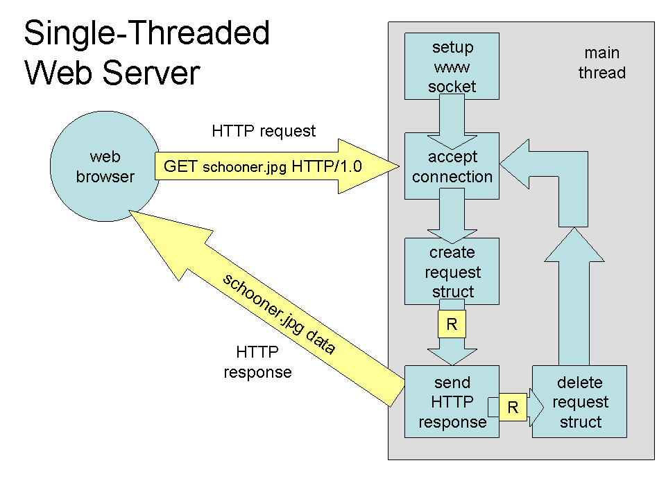
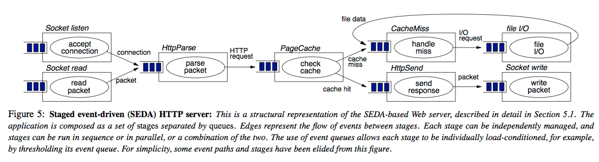

# Fundamentos

Uma vez que estejam convencidos de que não temos alternativas à distribuição se queremos sistemas escaláveis e tolerantes a falhas, o próximo passo é entender como podemos implementá-los e quais desafios encontraremos. 
O primeiro desafio é entender o ambiente no qual estão inseridos, suas limitações e fragilidades. Isto é, precisamos definir um **modelo computacional**, sabendo que alguns problemas tem soluções triviais ou inexistentes, dependendo do modelo.


## Modelos computacionais

Antes de distribuir nosso sistema, isto é, dividir a computação/armazenamento em diversas máquinas, e coordenar suas ações para que sejam consistentes com a especificação, de forma a minimizar o tempo que o serviço fica fora do ar, entregando o serviço de acordo com expectativas especificadas, precisamos responder a algumas perguntas:

* Qual a probabilidade de um nó parar de funcionar?
* Como os nós se comunicam? Eles compartilham um espaço de endereçamento ou enviam mensagens uns para os outros?
* A quais atrasos a comunicação está sujeita? Pode haver atrasos infinitos?
* A comunicação pode ser corrompida?
* Os relógios dos hospedeiros marcam o mesmo valor no mesmo instante, ou melhor, são sincronizados?
* Há agentes que possam querer perturbar o sistema, por exemplo para ganhar acesso a mais recursos do que seria justo?

??? sideslide "Modelos"
    * Comunicação
    * Sincronismo
    * Falhas

Estas perguntas são normalmente divididas em três eixos, **Comunicação**, **Sincronismo** e **Falhas**, e a combinação das respostas define o modelo computacional adotado.

### Comunicação
De uma forma ou de outra, sistemas distribuídos tem à sua disposição múltiplos processadores e permitem o desenvolvimento de aplicações paralelas, isto é, onde múltiplas tarefas são executadas ao mesmo tempo ou **paralelamente**.
Contudo, por um lado, quando falamos em sistemas multiprocessados, normalmente estamos falando de sistemas em que os processadores estão **próximos** e compartilham um mesmo espaço de endereçamento, sejam computadores com múltiplos processadores ou sejam clusters de computadores conectados por um barramento de comunicação de altíssima largura de banda, como [Infiniband](https://en.wikipedia.org/wiki/InfiniBand) que abstraiam múltiplos segmentos de memória como um único espaço de endereçamento.
Seja como for, estes sistemas com **memória compartilhada** são normalmente usados para aplicações de computação intensiva e em cujo os componentes são mais **fortemente acoplados** e melhor estudados em um curso de computação paralela.


??? sideslide "Comunicação"
    * memória compartilhada
    * troca de mensagens

Por outro lado, estamos mais interessados aqui em sistemas de maior escala geográfica, o que se adequa melhor ao modelo de troca de mensagens, isto é, onde cada nó mantem controle total do seu espaço de endereçamento e só expõe seu estado via mensagens enviadas para os outros nós.
Este modelo é mais adequado ao desenvolvimento de aplicações com componentes **fracamente acoplados**, em que atrasos de comunicação e ocorrência de falhas independentes são intrínsecas.


Memória Compartilhada Distribuída (DSM, do inglês, *Distributed Shared Memory*) é uma abordagem híbrida que tenta integrar a facilidade de se programar usando um único espaço de endereçamento mas com o nível de distribuição necessária a aplicações de larga escala, inclusive geográfica.


Considere uma possível implementação em software da DSM, apresentada na próxima figura. 
Nesta abordagem, cada *host* contribui uma porção de sua memória para um *pool* global. Processos acessam o *pool* via **gerentes de memória**, que traduzem os endereços de um espaço de endereçamento virtual para um host e um endereço local a tal host, e usam *message passing*  para implementar o acesso. 
Esta abordagem resulta em uma arquitetura NUMA, isto é, *Non-Uniform Memory Access*, já que os acessos a endereços locais são mais rápidos que aos remotos.


### Sincronismo

??? sideslide "Sincronismo"
    * operações
    * comunicação
    * relógio
    * sincronização

Quanto ao sincronismo, considera-se os processos tem a capacidade de medir a passagem de tempo, isto é, tem a acesso a relógios, o quão acurazes este são e o quão sincronizados são estes relógios uns com os outros.
Além disso, considera-se a existência de limites de tempo para execução de operações, por exemplo, o tempo um processador leva para executar uma operação de soma de dois inteiros, ou o tempo necessário para a entrega de uma mensagem ou acesso a uma região de memória.


### Falhas

Quanto às falhas, primeiro é preciso aceitar o fato de que componentes independentes podem falhar independentemente e que quanto mais *hosts*, maior é a probabilidade de que pelo menos um deles tenha uma CPU, disco, fonte, ou que quer que seja, falhando; e estejam certos, estas falhas acontecem o tempo todo.[^falham] 
Isto é importante pois se em sistemas monolíticos uma falha pode facilmente fazer com que o sistema todo pare e, portanto, não tente progredir na ausência de um componente, em um sistema distribuído queremos exatamente o contrário, isto é, que apesar da falha de um componente, os outros continuem prestando o serviço, mesmo de forma deteriorada e sem comprometer a corretude do sistema.

[^falham]: [Annual failure rates - servers](https://www.statista.com/statistics/430769/annual-failure-rates-of-servers/)

??? sideslide "Falhas"
    * detectável
    * temporização
    * quebras
    * maliciosas
    * perda e corrupção de mensagens

Para lidar com falhas, precisamos entender quais são suas possíveis formas, isto é, se o levam componentes falhos a parar de funcionar totalmente e de forma identificável por outros ou não, se há falhas "maliciosas", se os limites de tempo estabelecidos acima podem ser violados, se mensagens podem ser perdidas ou corrompidas.

### Modelo Assumido

??? sideslide "Outros"
    * carga de trabalho

Embora modelos clássicos sejam normalmente definidos em termos dos fatores acima, outras questões são também importantes, como o padrão da carga de trabalho do sistema (maior carga à noite? Na hora do almoço? *Black friday*?). Além de ignorarmos estes outros fatores, por enquanto assumiremos um modelo computacional não amigável, com comunicação por troca de mensagens, relógios e limites de tempo para operações, mesmo que desconhecidos. Também assumiremos ausência de falhas, a não ser quando quisermos provocar a análise de situações mais interessantes. Este modelo será ajustado na medida em que avançarmos, para tornar nossas análises mais realistas.


### SD são como cebolas!

Uma vez definido o **modelo computacional** e identificado os **algoritmos adequados** aos problemas que queremos resolver, passamos à implementação.
Distribuir é **dividir** a computação/armazenamento em diversos componentes, **possivelmente geograficamente distantes**, e **coordenar** suas ações para que resolvam a tarefa em questão de forma correta.
Com a distribuição objetiva-se **usar recursos** disponíveis nos hosts onde os componentes são executados[^recursos] e usar de **redundância** para garantir que o serviço sofra **degradação graciosa** em caso de falhas, ou seja, fazer com que o serviço continue funcionando, mesmo que com **vazão reduzida**, **latência aumentada**, menor capacidade de tratamento de requisições concorrentes, ou com **funcionalidades desabilitadas**.

[^recursos]: Os recursos compartilhados vão desde alguns óbvios, como **capacidade de armazenamento** e de **processamento**, a própria **localização** de um nó, que pode ser geograficamente mais próxima e de menor latência até  um ponto de interesse, ou até mesmo a disponibilidade de uma conexão física com um recurso especial, como uma impressora.

??? sideslide "Abstrações"
    * Comunicação
        * Ordenação
        * Confiabilidade
        * Invocação de procedimentos remotos
    * Heterogeneidade
        * Linguagens
        * Arquiteturas
        * Sistemas Operacionais
        * Times

Para colaborar, as diversas partes do sistema distribuído devem se comunicar, o que pode pode ser feito de diversas formas e em diversos níveis de abstração. Por exemplo, no caso troca de mensagens, estas podem ser desde pacotes de bytes entregues pelo IP/UDP como por **troca de mensagens** ordenadas, **fluxos de dados**, ou **invocação remota de procedimentos**.
Implementar estas abstrações em si já é uma tarefa complicada, pois é preciso levar em consideração que os componentes de um sistema distribuído **falham independentemente**, executam em *hosts*  com **relógios dessincronizados**, são desenvolvidos usando-se **linguagens diversas**, **sistemas operacionais distintos**, com **arquiteturas diferentes** e por **times independentes**.

Apesar de tantas variáveis, as abstrações precisam permitir que as aplicações que as usem possam se coordenar nos mínimos detalhes. 
Dado que a complexidade de se implementar estas abstrações já é grande por si só, se formos reinventar a roda a cada novo sistema, não faremos muitos avanços.
Mas, como vocês bem sabem, camadas de abstração são a chave para se lidar com complexidade.
Assim, sistemas distribuídos são como cebolas, cheias de camadas e que nos fazem chorar quando precisamos descascá-las.[^ogros]
Felizmente, para cada problema que tenha que resolver, há uma boa probabilidade de que alguém já o tenha atacado e disponibilizado uma solução, de forma comercial ou não.

[^ogros]: Lembrem-se que também  e você não quer que seu sistema seja como ogros, temperamentais e mal-cheirosos. Logo, planeje bem suas camadas de abstração.


## Comunicação

As camadas de abstração mais básicas estão **na rede de computadores** que serve de substrato a todo e qualquer sistema distribuído, afinal, a pedra fundamental da construção de sistemas distribuídos é a capacidade de comunicação entre seus componentes.
Também importantes, de um ponto de vista prático do desenvolvimento, são os conceitos de concorrência e paralelismo, pois componentes pode necessitar manter várias "conversas" em paralelo com múltiplos outros componentes.

### Canais e Protocolos

Para que os componentes de um sistema distribuído se comuniquem, é necessário que seus *hosts* possuam **interfaces de rede** e que estas interfaces estejam ligadas a uma rede com capacidade de roteamento de dados, estabelecendo um **canal de comunicação** entre os componentes.
Além do canal, é também necessário que se estabeleça um **protocolo de comunicação**, que define as regras para que a comunicação aconteça, por exemplo, a gramática para formação de mensagens.
Por exemplo, quando você fala com uma pessoa, cara-a-cara, o meio de comunicação é o ar e o protocolo utilizado é a linguagem conhecida pelas duas partes, o Português por exemplo.
Na prática, canais de comunicação podem ter diversas topologias e características, por exemplo:

| Ponto-a-ponto  | Barramento Compartilhado | Token Ring |
|----------------|--------------------------|------------|
| Sem colisões   | Com colisões             | Sem colisões|
| Roteamento trivial | Roteamento complexo | Roteamento simples|
| Caro (exponencial) | Barato (linear) | Barato (linear)|

Nas redes atuais, pode se dizer que o meio mais utilizado é provido pela arquitetura **Ethernet**, que trata da comunicação entre nós usando um **barramento compartilhado**, mesmo que este esteja por vezes escondido.
Sobre este meio, são usados protocolos para, por exemplo,

* Controle de acesso ao meio 
* Transmissão de mensagens
* Evitar e tratar colisões

As redes Ethernet, contudo, cobrem pequenas áreas e para se ter conversas mais "abrangentes", é necessário que se conecte diversas destas redes.
A conversa então é feita por meio de intermediários, ***gateways*** que conectam duas ou mais redes, permitindo que mensagens de um interlocutor sejam **roteadas** para o outro, via tais intermediários.

Um exemplo interessante das questões ligadas à manutenção da conversa entre dois pontos é a decisão sobre o uso de **comutação de pacotes** (*packet switching*) ou de **circuitos** (*circuit switching*).

| Comutação de pacotes | Comutação de circuito |
|-|-|
| Cada pacote viaja independentemente | Todo pacote viaja por caminho predefinido|
| Latência variável | Latência mais constante|
| Banda não reservada | Banda reservada |
| Banda não desperdiçada | Banda desperdiçada |


Outro fator importante é a **unidade máxima de transmissão** (*maximum transmission unit*, MTU), o tamanho máximo de um pacote em determinada rede. É necessário entender que qualquer quantidade de dados maior que o MTU precisará ser dividida em múltiplos pacotes. Também é importante perceber que redes são heterogêneas, e que o vários segmentos no caminho entre origem e destino podem ter MTU diferentes, levando à fragmentação de pacotes em trânsito e, possivelmente, entrega desordenada dos mesmos.

Finalmente, há uma questão importante relativa à confiabilidade na transmissão dos elementos da conversa, isto é, se a rede deve garantir ou não que algo "dito" por um interlocutor deve garantidamente ser "ouvido" pelo outro, ou se a **mensagem pode ser perdida** no meio.

Felizmente boa parte da **complexidade da resolução destas questões é abstraída do desenvolvedor dos sistemas distribuídos**, isto é, você, lhe cabendo apenas a decisão de qual protocolo utilizar.
Nas redes atuais, a conversa em componentes será feita, em algum nível, por meio dos protocolos da arquitetura **Internet**.


### A Internet

A Internet tem este nome por usar o protocolo de interconexão de redes independentes, o *internetworking protocol*, ou IP.
Para a aplicação usando o IP, todas as redes se comportam como uma única e coerente rede, exceto por alguns detalhes.
Os elementos que conectam as diversas redes são denominados **roteadores** e fazem um **melhor esforço** para encaminhar os pacotes de dados do remetente ao destinatário.

[^internet]

[^internet]: By User:Ludovic.ferre - Internet Connectivity Distribution&Core.svg, CC BY-SA 3.0, (https://commons.wikimedia.org/w/index.php?curid=10030716)

Se você se lembrar da pilha de protocolos de comunicação de referência OSI, lembrará que há uma organização em camadas em que cada camada é responsável pela comunicação em um nível e serve de fundação para a funcionalidade da camada de cima, isto é, cada camada é responsável pela comunicação em um nível de abstração que serve de base para o nível imediatamente superior:
O protocolo de cada camada inclui **cabeçalhos** (*header*) e **carga** (*payload*) e o conjunto de cabeçalho + carga de uma camada é considerado carga da camada inferior.
Assim, embora tenha-se a impressão de que cada camada conversa com a equivalente do outro lado da comunicação, na prática, a comunicação desce e sobe a pilha. 


São sete as camadas:

1. Física: Bits
2. Enlace: Frames/quadros; controle de fluxo; acesso ao meio.
3. Rede: Datagramas/pacotes; roteamento
4. Transporte: Controle de fluxo; fim a fim; confiabilidade; tcp e udp
5. Sessão: Streams/fluxos; conexões lógicas; restart; checkpoint; http, ssl
6. Apresentação: Objetos; json, xml; criptografia
7. Aplicação: Aplicações; http, pop, ftp


Embora o IP se refira estritamente ao protocolo da camada 3 da pilha, nos referimos à pilha que usa este protocolo como a pilha IP.
Comparada à pilha OSI, a IP é mais simples, como se vê na figura, 
pois as camadas 5 e 6 não estão presentes na pilha IP e as funcionalidades correspondentes são implementadas na camada 7, de aplicaçao.

[](http://computing.dcu.ie/~humphrys/Notes/Networks/intro.2.html)

Contudo, não tema! Estas funcionalidades podem se normalmente implementadas por meio de *frameworks* ou do *middleware* em uso.
Alguns exemplos de tais funcionalidades são

* (De)Serialização - conversão de estruturas complexas, e.g., objetos e estruturas, em sequência de bytes.
* Nomeamento - identificação de *hosts*
* Criptografia - ocultação dos dados trafegados
* Replicação - comunicação com múltiplos interlocutores
* Invocação remota de procedimentos - abstração de protocolos de comunicação

A grande vantagem desta abordagem é que se pode implementar exatamente e somente as funcionalidades desejadas.
Este característica é conhecida como o [argumento fim-a-fim no projeto de sistemas](http://web.mit.edu/Saltzer/www/publications/endtoend/endtoend.pdf); uma análise recente deste argumento foi feita [aqui](https://blog.acolyer.org/2014/11/14/end-to-end-arguments-in-system-design/).


Como usuários da pilha IP, temos que entender como a camada 3 funciona, mas dificilmente interagiremos com algo além da camada 4, a camada de **transporte**.

#### Sockets

Na prática, para implementarmos a comunicação entre processos, usamos **sockets**.
Para se definir um socket a partir de um ***host*** é necessário identificar o outro fim da comunicação, isto é, o outro *host*, ou melhor, uma de suas interfaces de rede.
Os sockets são então a abstração dos canais de comunicação, mas como dito antes, é necessário definir também os protocolos usados por estes sockets.
O primeiro protocolo é o de endereçamento, que define qual pilha de protocolos usar, na camada 3.
No caso da pilha IP, usa-se o protocolo AF\_INET ou PF\_INET.
Escolhido o protocolo, 

* cada interface tem um endereço MAC, na camada 2, que a identifica entre as interfaces na mesma rede local, e 
* cada interface tem um endereço IPv4/IPv6 de 32/128 bits, que o indentifica entre todos os hosts na Internet.[^ippub]

[^ippub]:Endereços IP não públicos não servem como identificadores únicos na Internet.

Mas dentro de um *host*, podem haver diversas aplicações sendo executadas. Como identificar exatamente com qual se quer conversar?
Isto é feito pela definição uma porta:

* Porta: inteiro de 16 bits
* Associadas a serviços pela [Internet Assigned Numbers Authority](http://www.iana.org), IANA.
     * Portas "Bem conhecidas": 0-1023
     * Portas Proprietárias: 49151
     * Portas Dinâmicas: 65535

Também é necessário definir o protocolo de transporte dos dados, na camada 4.
Novamente, no caso da pilha IP, pode-se usar TCP (**SOCK\_STREAM**) ou UDP (**SOCK\_DGRAM**).

A API usada para estabelecer a conversa via socket tem várias chamadas, que devem ser executadas na ordem certa no processo iniciando a conversa e naquele que aceita participar da mesma. Comecemos estudando o TCP.

#### TCP

O fluxograma da criação de um socket TCP é apresentado na seguinte figura:


<!---->

Estabelecido o socket, o mesmo pode ser usado como um **arquivo**, isto é, lendo-se e escrevendo-se bytes.
O que exatamente deve ser escrito e como o que é lido deve ser interpretado é o protocolo da camada 7, **sua responsabilidade**.

Vejamos um exemplo do uso de sockets, em Python, descrito no arquivo `server.py`.[^pyname]

[^pyname]:Você pode usar outro nome, desde que não seja `socket.py`, e que adapte o comando para sua execução.

```python
#server.py
#!/usr/bin/python                           # This is server.py file

import socket                               # Import socket module

s = socket.socket()                         # Create a socket object
host = socket.gethostname()	                # Get local machine name
port = 12345                                # Reserve a port for your service.
s.bind((host, port))                        # Bind to the port

s.listen(5)                                 # Now wait for client connections.
while True:
   c, addr = s.accept()                     # Establish connection with client.
   print('Got connection from', addr)
   c.send('Thank you for connecting'.encode())
   c.close()                                # Close the connection
```

Para executá-lo, execute o seguinte comando em um terminal. 

```bash
python server.py
```

Em outro terminal, execute **um dos** dois comandos a seguir. [^telnet]

[^telnet]:O programa `telnet` é normalmente instalado por padrão tanto no Windows, OSX quanto no Linux. Já o `netcat` normalmente precisa ser instalado por você. Em alguns sistemas, em vez de `netcat` o comando é o `nc`.

```bash
telnet localhost 12345
```

```bash
netcat localhost 12345
```

No segundo terminal a mensagem 
`Thank you for connecting`
será impressa, enquanto no primeiro veremos algo como 
 `('Got connection from', ('127.0.0.1', 57801))` 
 
O que está acontecendo aqui é um processo criou um socket e ficou aguardando uma conexão, usando o código em Python.
Tanto o telnet quando o netcat são programas genéricos para se conversar com outro processo usando TCP/IP.
Aqui, estes programas simplesmente se conectaram e imprimiram o que quer que o primeiro processo lhes tenha enviado, assumindo que correspondia a uma string, o que neste caso é correto.
Simples, não é mesmo?

Duas observações importantes a serem feitas aqui. 
A primeira é que, em geral, denominamos o processo que fica aguardando a conexão de **servidor** e o processo que se conecta de **cliente**. Isto por quê, em geral, o servidor executa alguma tarefa, serve, o cliente, embora isto não seja necessariamente verdade.


Por completude, vamos também escrever o código do cliente, agora que você já sabe que o servidor funciona.
Do lado cliente, estabelece-se uma conexão apontando-se para onde está o servidor.
```Python
#client.py

#!/usr/bin/python                      # This is client.py file

import socket                          # Import socket module

s = socket.socket()                    # Create a socket object
host = socket.gethostname()            # Get local machine name
port = 12345                           # Reserve a port for your service.

s.connect((host, port))
data = s.recv(1024)
print(data.decode())
s.close()                              # Close the socket when done
```

E para se executar o cliente, faça:
```bash
python client.py
```

Observe que o `socket.close()` encerra a conexão do lado de quem invoca. Na contraparte, invocações a `socket.recv()` retornam com 0 bytes lidos.

A título de comparação, em Java, a criação do socket do lado do servidor seria muito mais simples, consistindo apenas em: 
```Java
Socket s = new ServerSocket(port);
```

O cliente em Java também é simplificado.
```Java
Socket s = new Socket(hostname,port);
```

!!! question "Exercício: Múltiplos Pacotes"
    Façamos agora uma modificação no código do servidor para que envie não uma, mas duas mensagens para o cliente. Isto é, modifique seu servidor assim

    ```Python
    ...
    c.send('Thank you for connecting'.encode())
    c.send('Come back often'.encode())
    ...
    ```

    Agora execute novamente o cliente e veja o que acontece.  Consegue explicar o fenômeno?

    Modifiquemos o cliente agora, para que tenha dois `recv`, assim.
    ```Python
    ...
    print("1")
    data = s.recv(1024)
    print(data.decode())
    print("2")
    data = s.recv(1024)
    print(data.decode())
    ...
    ```

    E agora, o que acontece? A saída é como esperava? Como explica este fenômeno e como poderia corrigí-lo?

!!! question "Exercício: Ping-Pong"

    Modifique cliente e servidor tal que o cliente envie uma mensagem passada na linha de comando ao servidor e fique esperando uma resposta, e tal que o servidor fique esperando uma mensagem e então solicite ao operador que digite uma resposta e a envie para o cliente. O loop continua até que o usuário digite SAIR, e a conexão seja encerrada.


    | Terminal 1                 |  Terminal 2 |
    |----------------------------|-------------|
    | python server.py           | python client.py| 
    | Esperando conexão.         | conectando-se ao servidor |
    | Conectado                  | Conectado                 |
    | Esperando mensagem         | Digite mensagem: lalala   |
    |                            | Mensagem enviada          |
    | Mensagem recebida: lalala  | Esperando resposta        |
    | Digite resposta: lelele    |                           |
    | Resposta enviada.          |  Resposta recebida: lelele|
    |                            |  Digite mensagem: SAIR    |
    |                            |  Desconectando.           |
    | Conexão encerrada.         |                           |
    | Esperando conexão.         |                           |
  
    Observe que para ler do teclado em Python 2 você deve usar `#!py3 x = raw_input()`, enquanto que em Python 3 seria `#!py3 x = input()`. Além disso, em Python 2, você deve remover as invocações para `encode` e `decode`.


#### UDP 

No exemplo anterior, usamos o protocolo TCP (o padrão da API). Caso quiséssemos usar UDP, precisaríamos nos atentar a alguns detalhes.

A criação do socket é feita explicitando-se o uso de **datagramas**: `#!py3 s = socket.socket(socket.AF_INET,socket.SOCK_DGRAM)`

Um servidor UDP não executa `listen` ou `accept` e, em Python, simplesmente executa `#!py3 data, addr = sock.recvfrom(4096)` para receber o datagrama, onde `data` é o conteúdo recebido e  `addr` o endereço de quem enviou o datagrama.

Neste caso, um mesmo socket é usado para manter comunicação com múltiplos interlocutores. Para enviar uma resposta a um interlocutor em específico, `addr` é usado: `#!py3 sent = sock.sendto(data, addr)`, onde `sent` é a quantidade de bytes enviados.

Além deste detalhe, é importante manter em mente outras características do UDP:

* falta de ordem
* falta de confiabilidade
* menos dados lidos que enviados.
* mais dados lidos que enviados (pode acontecer também no TCP)

Com tantas dificuldades para se usar o UDP, fica a questão: **para que serve UDP?**

!!! question "Exercício: Ping-Pong UDP"
    Modifique o código do exercício Ping-Pong para usar UDP em vez de TCP na comunicação entre nós.
    Execute múltiplos clientes ao mesmo tempo. Como o seu servidor lida com isso? Modifique-o para mandar um "eco" da mensagem recebida de volta ao remetente. 


#### IP-Multicast

Imagine que você tenha que enviar um *stream* de vídeo para um amigo mostrando como você está jogando o mais novo jogo da velha no mercado.
Qual protocolo de transporte você usaria? TCP, provavelmente, já que garante a entrega ordenada dos pacotes do vídeo.
Como você já sabe, o TCP envia confirmações de pacotes recebidos e usa uma janela deslizante para determinar quais pacotes reenviar, o que pode causar interrupções na execução do vídeo.
Além do mais, as pessoas provavelmente preferirão perder alguns quadros que perder a sincronia com sua excitante partida.
Parece que uma opção melhor seria então usar UDP, correto?

Imagine agora que os mesmos dados devam ser enviados para múltiplos destinatários (você está ficando famoso!)
Com múltiplos destinatários, múltiplos controles precisariam ser mantidos no TCP, o que pode se tornar custoso; mais uma razão para usar UDP!


Para terminar, lhe darei uma razão final: IP-Multicast!
Multicast, em oposição ao Unicast, é a capacidade de enviar mensagens para um grupo de destinatários, em vez de apenas um. 


IP-Multicast é uma implementação desta ideia, usando umaa configuração específica do UDP, associada a recursos dos comutadores de rede, para otimizar o envio dos mesmos dados a múltiplos destinatários.
Grupos são identificados por endereços IP especiais, conhecidos como Classe D (224.0.0.0-239.255.255.255), e propagados pela rede.
A seguinte tabela descreve os usos das sub-faixas de endereços.[^multicast_use]
[^multicast_use]:  [Understanding IP Multicast](http://www.dasblinkenlichten.com/understanding-ip-multicast/)

| Endereço | Uso |
|----------|-----|
|224.0.0.0-224.0.0.255| Multicast local - Usado por protocolos L2, como EIGRP e OSPF|
|224.0.1.0-224.0.1.255| Multicast roteaddo - Usado por protocolos L3| 
|232.0.0.0-232.255.255.255| *Source Specific Multicast* - Receptores definem fontes confiáveis|
|233.0.0.0-233.255.255.255| Reservado para detentores *Autonomous Systems* |
|239.0.0.0-239.255.255.255| Reservado para IANA |
|Resto | Uso geral|


Quando um pacote é enviado para o endereço do grupo, **todos** os membros do grupo recebem tal mensagem.
Melhor dizendo, todos os membros podem receber a mensagem, mas como estamos falando de UDP, **é possível que alguns não recebam**.
Além disso, **não há garantia qualquer sobre a ordem de recepção das mensagens**.

Apenas reforçando, IP-Multicast só funciona com UDP, pois lidar com retransmissões em um grupo grande levaria a um estado imenso sendo mantido na origem dos dados.
Outro ponto importante é que pelo podencial desestabilizador do IP-Multicast, ele é normalemente limitado à pequenas seções das redes.

Mas experimentemos com esta tecnologia na prática.
Criemos um programa que **criar Socket UDP**, **associa-o a um grupo**, e **recebe pacotes** destinados ao grupo.

```Java
// MReceiver.java
import java.io.*;
import java.net.*;

public class MReceiver {
  public static void main(String[] args) {
    byte[] inBuf = new byte[256];
    try {
      MulticastSocket socket = new MulticastSocket(8888);
      InetAddress address = InetAddress.getByName("224.2.2.3");
      socket.joinGroup(address);
      while (true) {
        DatagramPacket inPacket = new DatagramPacket(inBuf, inBuf.length);
        socket.receive(inPacket);
        String msg = new String(inBuf, 0, inPacket.getLength());
        System.out.println("From " + inPacket.getAddress() + " Msg : " + msg);
      }
    }catch (IOException ioe) {
      System.out.println(ioe);
    }
  }
}
```

Instancie múltiplos processos deste, na mesma máquina e em máquinas distintas.
Agora criemos um programa que envia pacotes para o dito grupo.

```Java 
// MSender.java
import java.io.*;
import java.net.*;
public class MSender {
 public static void main(String[] args) {
  byte[] outBuf;
  final int PORT = 8888;
  try {
   DatagramSocket socket = new DatagramSocket();
   long counter = 0;
   InetAddress address = InetAddress.getByName("224.2.2.3");
   while (true) {
    counter++;
    outBuf = ("Multicast numero " + counter + " " + address).getBytes();
    DatagramPacket outPacket = new DatagramPacket(outBuf, outBuf.length, address, PORT);
    socket.send(outPacket);
    try { Thread.sleep(500); }catch (InterruptedException ie) {}
   }
  } catch (IOException ioe) { System.out.println(ioe); }
 }
}
```

Observe como a mesma mensagem é recebida pelos vários membros e que como diferentes fontes tem seus pacotes recebidos.

A título de curiosidade, IP-Multicast também está presente em IPv6, mas com algumas pequenas diferenças 

!!! tip "IP-Multicast em IPv6[^ipv6multi]"
    In IPv6, the left-most bits of an address are used to determine its type. For a multicast address, the first 8 bits are all ones, i.e. FF00::/8. Further, bit 113-116 represent the scope of the address, which can be either one of the following 4: Global, Site-local, Link-local, Node-local.

    In addition to unicast and multicast, IPv6 also supports anycast, in which a packet can be sent to any member of the group, but need not be sent to all members.''

[^ipv6multi]: [IP-Multicast em IPv6](http://www.baeldung.com/java-broadcast-multicast)


!!! question "Exercício: IP-Multicast"
    Implemente e teste o seguinte **receiver**, colocando várias instâncias para executar em múltiplos terminais, ao mesmo tempo.

    ```Python
    import socket
    import struct

    MCAST_GRP = '224.1.1.1'
    MCAST_PORT = 5007

    sock = socket.socket(socket.AF_INET, socket.SOCK_DGRAM, socket.IPPROTO_UDP)
    sock.setsockopt(socket.SOL_SOCKET, socket.SO_REUSEADDR, 1)
    sock.bind(('', MCAST_PORT))
    mreq = struct.pack("=4sl", socket.inet_aton(MCAST_GRP), socket.INADDR_ANY)
    #4 bytes (4s) seguidos de um long (l), usando ordem nativa (=)

    sock.setsockopt(socket.IPPROTO_IP, socket.IP_ADD_MEMBERSHIP, mreq)

    while True:
        print(sock.recv(10240).decode())
    ```

    Implemente e teste o seguinte **sender**.

    ```Python
    import socket

    MCAST_GRP = '224.1.1.1'
    MCAST_PORT = 5007

    sock = socket.socket(socket.AF_INET, socket.SOCK_DGRAM, socket.IPPROTO_UDP)
    sock.setsockopt(socket.IPPROTO_IP, socket.IP_MULTICAST_TTL, 2)
    sock.sendto(input().encode(), (MCAST_GRP, MCAST_PORT))
    ```


## Concorrência

É impossível pensar em sistemas distribuídos sem pensar em concorrência na forma de múltiplos processos executando (normalmente) em hosts distintos e em termos de múltiplos *threads* nos processos.
Os exemplos apresentados até agora, consistem todos em um processo cliente requisitando ações de algum processo servidor.
Apesar disso, a interação entre tais processos aconteceu sempre de forma sincronizada, *lock-step*, em que o cliente requisitava o serviço e ficava bloqueado esperando a resposta do servidor para então prosseguir em seu processamento, e o servidor fica bloqueado esperando requisições que atende e então volta a dormir.
Este cenário, apresentado na figura a seguir, mostra que apesar do uso de processadores distintos e da concorrência na execução dos processos, temos um baixo grau de efetivo paralelismo; a requisição (2) só é processada depois que a resposta (1) é enviada.


Este modelo de sincronização entre as partes comunicantes é um exemplo de **E/S bloqueante**. 
O principal ponto positivo desta estratégia é a **simplicidade do código** e o principal ponto negativo é a **limitação do paralelismo** no uso de recursos, uma das razões de ser da computação distribuída.

Para usarmos melhor os recursos disponíveis, tanto do lado dos clientes quanto servidores, temos então que pensar em termos de eventos sendo disparados entre os componentes, que devem ser tratados assim que recebidos ou tão logo haja recursos para fazê-lo. 
Estes eventos correspondem tanto a requisições quanto a respostas (efetivamente tornando difícil a distinção).

No modelo bloqueante, quando um evento é disparado (no exemplo, a requisição), o sistema fica bloqueado até que um evento específico seja observado (no exemplo, a chegada da resposta).
Sempre que possível, um componente não deve ficar esperando por eventos em específico, aproveitando a chance executar outras tarefas; quando eventos são recebidos, são então atendidos. Esta é a forma de fazer **E/S assíncrona**.

Dada que processos interagem com a rede usando sockets, cuja interface mais simples para operações de leitura é bloqueante, neste curso não falaremos especificamene sobre E/S assíncrono[^asyncio] e por isso, para vermos como aumentar a concorrência no sistema, é necessário falar de *multithreading* e as várias formas em que aparecem nos sistemas.

[^asyncio]: Um bom ponto de partida para o tópico é a sua entrada na [wikipedia](https://en.wikipedia.org/wiki/Asynchronous_I/O).

Há duas razões claras para estudarmos *multithreading*. 
A primeira, de ordem prática, é a discutida acima: permitir o desenvolvimento de componentes que utilizem "melhormente" os recursos em um host.
A segunda, didática, é o fato que muitos dos problemas que aparecem em programação *multithread*, aparecem em programação multi-processo (como nos sistemas distribuídos), apenas em um grau de complexidade maior.
Para relembrar, há várias diferenças entre *threads* e processos, mas a abstração é essencialmente a mesma:

|| Processo | Thread |
-|----------|--------
Definição | Instância de um programa | "Processo leve"
Função de entrada | `main` | função "qualquer"
Compartilhamento de código e dados | Privado ao processo | Compartilhado pelos threads
Estado | Código, Stack, Heap, descritores (e.g, file descriptors), controle de acesso | Stack, variáveis locais 
Comunicação| IPC (*Inter Process Communication*): sockets, FIFO, memória compartilhada, etc  | IPC, mutex, variáveis de condição, semáforos, etc
Nível da implementação | Sistema operacional | Diferentes implementações 
API || Posix, C++, Java, ...
Bloqueio | Mudança de contexto para outro thread mesmo sem terminar quantum | Mudança de contexto para outro thread do mesmo processo
Tempo de criação, terminação e mudança de contexto| Demora mais | Demora menos


Vejamos como o uso de múltiplos threads podem melhorar o desenvolvimento de sistemas distribuídos na prática.
Considere os exemplos de clientes e servidores vistos [anteriormente](#tcp).
Imagine que em vez do serviço simples feito no exemplo, o servidor retorne uma página Web.
Detalhes do protocolo seguido por navegadores e servidores serão vistos mais tarde. Por agora, considere apenas que uma requisição `GET arquivo.html` será enviada para o servidor que lerá o arquivo especificado do sistema de arquivos; como você sabe, ler um arquivo é uma operação lenta e que não requer CPU.

### Cliente

Do ponto de vista do cliente, a vantagem do uso de múltiplos threads são claras: permite lidar com **várias tarefas concorrentemente**, por exemplo solicitar CSS, HTML e imagens concorrentemente, **escondendo latência** das várias operações, e permite **organizar código** em blocos/módulos.
Se você usar o console de desenvolvimento do navegador, verá como múltiplos arquivos são baixados em paralelo quando acessa um sítio. 
A figura a seguir mostra a carga do sítio da [Facom](https://www.facom.ufu.br).
O primeiro arquivo, `index.html` é baixado individualmente, mas uma vez que isso acontece e são determinados quais os demais arquivos necessários, requisições concorrentes são disparadas, minimizando o tempo total da operação.


Como outros exemplos, considere um formulário *online* em que a validação de um campo é executada enquanto o campo seguinte está sendo preenchido, ou um serviço de email em que arquivos são carregados enquanto a mensagem é confeccionada.


### Servidor

Do lado dos servidores há diversas possibilidades de uso de threads para aumentar o paralelismo no processamento de requisições, melhor utilizando recursos disponíveis e melhorando a experiência do usuário.


#### Single-threaded
A estratégia mais simples de se implementar é a de usar apenas um thread, como temos feito até agora.
Considere um servidor Web com esta esta característica; o fluxo no tratamento de uma requisição é exemplificado na pela figura a seguir:



0. O servidor é iniciado, criando o socket e invocando accept
1. o cliente envia a requisição para o servidor
2. o servidor aceita a conexão em seu único thread
3. uma tarefa é gerada para ler o arquivo
4. o arquivo é lido, de forma bloqueante, e uma resposta para o cliente é preparada
5. a resposta é enviada para o cliente, de forma bloqueante
6. a requisição é descartada
7. o thread do servidor volta a esperar uma nova requisição

Se novas requisições forem recebidas enquanto o servidor está executando os passos de 2 a 6, sejam requisições paralelas do mesmo cliente ou de um outro cliente, estas ficarão bloqueadas. 
A espera será maior quanto mais o servidor demorar para atender à primeira requisição, por exemplo, se precisar consultar um banco de dados ou carregar o arquivo requisitado do disco.
Para evitar que isto ocorra, o servidor pode usar mais threads.

#### Thread per request
O servidor pode criar um novo thread para cada nova requisição, permitindo que múltiplas requisições sejam tratadas concorrentemente.
Isto é, mesmo que um thread do servidor seja bloqueado por muito tempo, somente um cliente terá sua resposta atrasada (excluindo-se necessidades de coordenação entre múltiplos threads) e outros clientes podem continuar sendo atendidos normalmente, como mostrado na figura a seguir.


Lembre-se, entretanto, que o número de threads que se pode criar em um SO é limitado, pois cada thread usa recursos do SO. 
Além disso, a criação e destruição de threads é cara pois é feita por meio de uma chamada de sistema, pelo kernel, e portanto implica em alternar entre modo usuário e modo protegido.
Se possível, devemos evitar a criação de novos threads em aplicações com requisitos de desempenho, e recliclá-los pode ser uma boa estratégia.

#### Thread pool
Para reciclarmos threads, podemos criar *pools*, um balde de threads que são usados quando necessário e devolvidos para o balde quando não mais.
No cerne desta abordagem, junto com o *pool* de threads, fica uma fila bloquenante na qual tarefas são inseridas e de onde os threads tentam retirá-las.

Como a fila é bloqueante, se estiver vazia, o thread é bloqueado e para de consumir recursos. Tão logo nova tarefa seja inserida, a fila acorda os threads para que a processem. Para garantir a corretude no processamento, a fila deve ser **thread-safe**, isto é, que se mantem correta mesmo quando múltiplos threads operam nela tanto para inserir quanto remover tarefas.

Na figura, um thread principal é encarregado de receber as requisições e colocar na fila bloqueante; se a fila fica cheia, o thread principal fica bloqueado esperando por espaço, fazendo com que novas conexões tenham que esperar.

[](https://www3.nd.edu/~dthain/courses/cse30341/spring2009/project4/project4.html)

Os threads do pool removem uma tarefa da fila, a tratam e, ao final do atendimento,  pegam nova requisição na fila, em um loop infinito; requisições que demandam menor processamento liberam o thread mais rapidamente para que pegue nova tarefa.
Se todas as tarefas são pequenas, os threds ficarão bloqueados por muito tempo. Se todas são grandes, as tarefas se acumularão na fila.
Por isso é importante dimensionar bem o tamanho to *pool*, ou mesmo torná-lo dinâmico para que use menos recursos (threads) quando não necessário e não deixe tarefas pendentes por muito tempo. 

Se considerarmos que cada tarefa na verdade tem várias partes, 
é possível refinar mais este modelo, quebrando o processamento em vários pools.

#### Estágios
Na arquitetura baseada em estágios, e.g.,  **Staged Event-Driven Architecture**, SEDA, cada **estágio**, cada estágio é responsável por processar uma parte da tarefa, passada adiante até que seja completada.[^seda]

[^seda]: O artigo [SEDA: An Architecture for Well-Conditioned, Scalable Internet Services](http://www.sosp.org/2001/papers/welsh.pdf) descreve em detalhes a arquitetura SEDA.


[](http://images.cnitblog.com/blog/13665/201306/15180500-a54c8eb3d73246469f1b74ee74f2119b.png)

Uma característica importante deste modelo é que cada estágio pode ser escalado individualmente de acordo com a demanda uma vez que cada estágio tem seu próprio *pool*. Por exemplo, se um estágio faz algum cálculo leve, então poucos *threads* são necessários ao mesmo. Já um estágio que precise efetuar E/S talvez precise mais *threads*, uma vez que estes ficam bloqueandos enquanto a operação é executada. [^ioasync]

[^ioasync]: Pode-se argumentar que E/S assíncrona resolveria o problema aqui, mas isso não vem ao caso.

[](http://images.cnitblog.com/blog/13665/201306/15180500-a54c8eb3d73246469f1b74ee74f2119b.png)


### Desafios

Embora a ideia de usar múltiplos threads seja melhorar desempenho e experiência do usuário, fazê-lo efetivamente é não trivial.
Vejamos por exemplo o problema do falso compartilhamento; considere o seguinte pseudo-código:

```c
...
int32 X;
int32 Y;

thread1 = tread_new(threadfunction, &X);
thread2 = tread_new(threadfunction, &Y);

void threadfunction(int32 * exclusivo) {
    int32 local = *exclusivo;
    while (true) {
        local = processa(local);
        *exclusivo = local;
    }
}
...
```

Cada um dos threads criados acessa exclusivamente uma das variáveis. Logo, não há interferência entre as threads e se cada uma for colocada em um processador diferente, executarão no máximo de seu potencial, correto?
Não exatamente, pois mesmo este código simplíssimo podemos sofrer de [falso compartilhamento](https://dzone.com/articles/false-sharing).
Isto acontece, por exemplo, se cada linha da cache do sistema onde este programa executa tiver 8 ou mais bytes de comprimento. Como tanto `X` quanto `Y` no programa tem 4 bytes, as duas variáveis poderão ficar na mesma linha da cache e toda vez que uma thread modificar uma variável a cache da outra será invalidada para leitura.


Para que isto não ocorra, é preciso se certificar que as variáveis fiquem em linhas diferentes da cache; no exemplo, poderia-se definir X e Y como vetores do tamanho da linha da cache e usar efetivamente apenas a primeira posição de cada vetor.

Se o compartilhamento for real, por exemplo se ambos os threads usarem a variável X, então o problema não será tão facilmente resolvível.
Neste caso, poder-se-ia definir afinidade entre threads, isto é, notar quais threads compartilham estado de forma que threads afins sejam colocados nos mesmos processadores e compartilhem as mesmas memórias. 
Isto torna muito mais fácil e eficiente o controle de concorrência, do ponto de vista do SO e hardware.


???- sideslide "Multiprogramação"
     

Fazer esta divisão pode ser complicado pois a relação de compartilhamento entre threads pode ser complexa em função da tarefa sendo resolvida, por exemplo, se diferentes threads compartilharem diferentes variáveis uns com os. Ainda que que uma configuração ótima em termos de afinidade exista, encontrá-la pode ser custo.
Ainda assim, precisamos lidar com estado compartilhado e enfrentar condições de corrida de forma a não levar a **inconsistências** na executação de tarefas, nos referindo a inconsistência aqui como qualquer desvio no comportamento do programa daquilo que foi especificado pelo desenvolvedor.
Para isso, usamos as primitivas de controle de concorrência que estudaram em SO, que também tem seus problemas em potencial, como **deadlocks** e **inanição**.
Veja o seguinte vídeo para uma análise de diversos pontos importantes no uso de multithreads.

<iframe width="560" height="315" src="https://www.youtube.com/embed/JRaDkV0itbM" frameborder="0" allow="accelerometer; autoplay; encrypted-media; gyroscope; picture-in-picture" allowfullscreen></iframe>


### Estado
A questão das regiões críticas está intimamente relacionada à questão da manutenção de estado nos servidores.
Quanto a este respeito, podemos classificar servidores como **stateful** e **stateless**, dois termos que ouvirão frequentemente enquanto trabalhando com SD.

???- sideslide "To state or not to state?"
      * Complexidade e desempenho
      * Falhas
      * Balanceamento

O "state" nos dois nomes se refere ao estado mantido por um serviço para atender a requisições.
Caso mantenha estado, por exemplo informando em quais arquivos o cliente está interessado, fica mais fácil para o servidor continuar o trabalho feito em requisições anteriores.
Imagine por exemplo que um cliente esteja acessando linhas em um banco de dados, de forma paginada: a cada requisição, o cliente recebe $n$ novas linhas para processar e, quando estiver pronto, requisite $n$ novas linhas.
Imagine quão infeficiente seria se o servidor seguisse o seguinte fluxo:

1. receba requisição informando a última linha lida
2. recalcule todas as respostas para consulta
3. salte até a linha informada pelo cliente
4. retorne as próximas $n$ linhas para o cliente
5. feche o resultado da consulta.

Se em vez disso o servidor mantiver um mapa com consultas recentes, em que a chave seja algum identificador do cliente e o valor uma *visão*  dos resultados; a cada nova requisição, basta o servidor resgatar a visão usando o identificador do cliente e selecionar as seguintes $n$ entradas da visão. Manter o mapa como estado acelera o processamento e melhora a experiência do usuário, neste caso.
Por outro lado, considere que múltiplos clientes fazem consultas concorrentemente: quanto recurso seria necessário para que o servidor mantenha a visão de todos os clientes?

Também a complexidade do servidor aumenta. Considere as algumas de muitas perguntas possíveis neste cenário:

* Como o servidor mantém as respostas a novas requisições consistentes com as respostas anteriores? E se linhas são removidas ou inseridas no banco de dados?
* Se múltiplos servidores existem, como compartilhar os estado entre os mesmos?
* Se o cliente resolva não fazer mais requisições, por exemplo por ter encontrado o que procurava, por quanto tempo o servidor deve manter a visão aberta?

Você já deve ter adivinhado que no primeiro exemplo temos um servidor *stateless* e no segundo um *stateful*, e percebido que cada um tem suas vantagens e desvantagens.
Vejamos mais algumas.

#### Sessão

Essencialmente, o servidor *stateless* não mantem informação sobre a sessão do cliente e requer que a cada nova requisição, quaisquer informações necessárias para realizar a tarefa requisitada sejam novamente fornecidas ao servidor.
No caso *stateful*, o servidor pode se lembrar, como no exemplo anterior, até onde o trabalho já foi executado, quais arquivos o cliente manipulou (e mantê-los abertos), qual o endereço o cliente e enviar-lhe notificações importantes (e.g., "Novo dado inserido!").

#### Falhas

Enquanto servidores *stateful* obviamente levam a melhor desempenho no *happy path* (contanto que recursos suficientes sejam providos), no caso de falhas, serviços *stateless* tendem a voltar ao ar mais rapidamente, uma vez que não há estado que precise ser recuperado.
Pela mesma razão, clientes que percebem que um servidor falhou podem rapidamente se dirigir a outros servidores e continuar suas requisições de onde estavam, uma vez que são detentores de toda a informação necessária para o próximo passo do processamento.

Lidar com falhas também introduz outro requisito aos servidores: memória estável.
Para que possa o recuperar o estado anterior à falha, o servidor precisa colocar o estado em algum lugar que independa do processo para se manter, por exemplo,
[nvRAM](https://en.wikipedia.org/wiki/Non-volatile_random-access_memory), [SSD](https://en.wikipedia.org/wiki/Solid-state_drive) ou [spindles](https://en.wikipedia.org/wiki/Hard_disk_drive#Spindle).
A perda deste estado implicaria na incapacidade de prover o serviço corretamente.
Um projeto *stateless* não depende deste estado e por isso pode ser mais rapidamente recuperado, replicado ou substituído.

#### Stateless x Stateful

Não surpreendentemente, a resposta para "qual abordagem é melhor, *stateful* ou *stateless*?" é **depende**.
Ambos as opções tem suas vantagens e desvantagens e para algums serviços apenas uma opção será viável.
Se seu serviço precisa manter estado (um SGBD, por exemplo), ele terá que manter estado, mesmo que não sobre clientes.
Veja um pequeno comparativo das características das duas abordagens.


| Stateless | Stateful |
|-----------|----------|
| Resultado depende da entrada| Depende do histórico de entradas |
| Qualquer servidor pode atender | Mesmo servidor deve atender |
| Não promete notificar o cliente | Assina contrato com o cliente |
| Repete operações | Aproveita resultados anteriores |
| Não fica inconsistente com relação ao cliente | Pode ficar inconsistente se perder estado ou conexão feita com outro servidor |
| re-autenticação (mesmo que simplficada) a cada requisição | Autentica no começo da sessão |


### Multithread na prática

#### POSIX

[POSIX Threads](https://en.wikipedia.org/wiki/POSIX_Threads) ou PThreads, são uma definição **aberta** de como *threads* devem funcionar em sistemas operacionais.
Várias implementações desta especificação estão disponíveis tanto para sistemas Unix, que se esforçam para ser compatíveis com especifições POSIX, mas também para Windows, via subsistemas que compatibilizam diferentes API.
Além disso, mesmo implementações não POSIX tem funcionalidade equivalentes e, por este motivo, entender POSIX servirá de base para entender quaisquer API para programação *multi-threaded*.

Para se definir um *thread*, é necessário definir uma função de entrada, que será para o *thread* como a função `main` é para o processo em si.
No exemplo a seguir a função foi definida com retorno `void *` e com único parâmetro, também `void *`; esta é uma obrigatoriedade para funções de entrata PThread.
Observe contudo que `void *` pode ser tratado como um blob para mascarar outros tipos de dados, por exemplo um vetor, um ponteiro para uma enumeração ou uma `struct`.
Também observe que a função tem uma variável local `my_id` que só está definida no contexto da thread (linha 8); se múltiplas *threads* forem instanciadas, cada uma terá a sua versão da variável. 
Há também uma variável global `thread_count`, compartilhada por todas as instâncias (linha 5).

```c
#include <stdio.h>
#include <stdlib.h>
#include <pthread.h>
	
int thread_count;

void* hello(void* id) {
	long my_id = (long) id;
	printf("Hello from thread %ld of %d\n", my_id, thread_count);
	return NULL;
}
```

Um *thread*  é criado pela função `pthread_create` (linha 14), que coloca em um `pthread_t` um *handle* para o *thread*.
O *handle* do *thread* deve ser alocado previamente à função de criação do *thread* (linha 11).
A função recebe como parâmetros opções para configuração, a função de entrada, e o parâmetro do tipo `void *`.

```c
int main(int argc, char* argv[]) {
	long thread;
	pthread_t* thread_handles;
	
	if(argc < 2) {
		printf("usage: %s <number of threads>", argv[0]); 
		return 1;
	}
	
	thread_count = strtol(argv[1], NULL, 10);
	thread_handles = malloc(thread_count*sizeof(pthread_t));
	
	for (thread = 0; thread < thread_count; thread++)
		pthread_create(&thread_handles[thread], NULL, hello, (void*) thread);
	
	printf("Hello from the main thread\n");
```

É possível esperar pelo fim da execução do *thread* usando o `pthread_join`, que recebe como parâmetro o *handle* do *thread* e um ponteiro para onde o resultado da função de entrada deve ser colocado, do tipo `void **` (linha 2). No exemplo, nenhum retorno é esperado, então um endereço nulo é passado como parâmetro.
Ao final da execução, o *handle* deve ser liberado (linha 4).

```c
	for (thread = 0; thread < thread_count; thread++)
		pthread_join(thread_handles[thread], NULL);
	
	free(thread_handles);
```


Para executar um programa PThread, compile com
```bash
gcc -pthread teste.c -o teste
```
e execute com
```bash
./teste 5
```
e observe que a saída das threads é *ordenada*. 

Agora experimente
```bash
./teste 200
```
Observe que a saída é desordenada (pode ser necessário executar múltiplas vezes ou aumentar de 200 para, digamos, 1000 para observar a desordem.
Isto acontece porquê a execução das threads independe da ordem de criação.
De fato, usando PThreads, temos pouco controle sobre os threads que criamos. 
Mas isto não quer dizer que estamos "órfãos" de API; várias outras operações podem ser executadas, e podem ser encontradas a partir do [manual de `pthread_create`](http://man7.org/linux/man-pages/man3/pthread_create.3.html). Alguns exemplos interessantes:

* `pthread_tryjoin` - espera thread terminar
* `pthread_exit` - termina a thread e retorna resultado 
   > An implicit call to `pthread_exit()` is made when a thread other than the thread in which `main()` was first invoked returns from the start routine that was used to create it. The function's return value serves as the thread's exit status. [Manual de `pthread_exit`](http://man7.org/linux/man-pages/man3/pthread_exit.3.html).
	
* `pthread_attr_setaffinity_np` - ajusta afinidade dos threads.

#### Python

Em Python, como seria de se esperar, há várias formas de se trabalhar com *threads*. 
O exemplo a seguir usa o pacote `thread` e é essencialmente um envólucro POSIX.

```python
#!/usr/bin/python
import thread
import time

# Define a function for the thread
def print_time( threadName, delay):
   count = 0
   while count < 5:
      time.sleep(delay)
      count += 1
      print "%s: %s" % ( threadName, time.ctime(time.time()) )

# Create two threads as follows
try:
   thread.start_new_thread( print_time, ("Thread-1", 2, ) )
   thread.start_new_thread( print_time, ("Thread-2", 4, ) )
except:
   print "Error: unable to start thread"

while True:
   pass
```

Já o próximo exemplo usa o pacote `threading` e uma abordagem orientada a objetos. Observe que há momentos distintos no ciclo de vida do thread em que acontece a criação e o início da execução.

```python
#!/usr/bin/python

import threading
import time

exitFlag = 0

class myThread (threading.Thread):
   def __init__(self, threadID, name, counter):
      threading.Thread.__init__(self)
      self.threadID = threadID
      self.name = name
      self.counter = counter
   def run(self):
      print "Starting " + self.name
      print_time(self.name, self.counter, 5)
      print "Exiting " + self.name

   def print_time(threadName, counter, delay):
      while counter:
         if exitFlag:
            threadName.exit()
         time.sleep(delay)
         print "%s: %s" % (threadName, time.ctime(time.time()))
         counter -= 1

# Create new threads
thread1 = myThread(1, "Thread-1", 1)
thread2 = myThread(2, "Thread-2", 2)

# Start new Threads
thread1.start()
thread2.start()

print "Exiting Main Thread"
```

Uma consequência desta divisão é que um mesmo objeto do tipo `Thread` pode ser reciclado e executado várias vezes.

#### Java

Outro exemplo importante de API para multithreading é a do Java, pois nesta linguagem há, essencialmente, duas formas de se conseguir concorrência. 
A primeira é via instâncias explícitas da classe `Thread` e, a segunda, via abstrações de mais alto nível, os `Executors`.
Aqui nos focaremos em aspectos básicos de concorrência na linguagem, mas esteja ciente de que a mesma é muito rica neste tópico, por exemplo provendo diversas estruturas para comunicação e coordenação de *threads* no pacote `java.util.concurrent`.
Uma ótima documentação sobre o uso de *threads* e estruturas é dispobinilizada pela [Oracle](https://docs.oracle.com/javase/tutorial/essential/concurrency/).

Há duas formas básicas de definir um novo *thread* em Java, ou via extensão da classe `Thread` ou via implementação da interface `Runnable`; observe o quão pouco muda no código dos exemplos a seguir.
Note também que, nos dois exemplos, um método `run()` é implementado com o código a ser executado pelo *thread* mas que em nenhum momento tal método é invocado diretamente.
Em vez disto, o método `start()` é que é invocado, porquê antes de executar as instruções definidas pelo pelo programador no método `run()`,
a máquina virtual precisa executar alguma "mágica" por baixo dos panos como, por exemplo, solicitar ao sistema operacional a criação de um *thread* do SO, que servirá de hospedeiro para o *thread* Java. 
Isto acontece dentro do `start()`, que em algum ponto de sua execução levará à invocação do método `run()`.

=== "Thread"
    ```Java
    public class Hello extends Thread {
        public void run() {
            System.out.println("Hello from a thread!");
        }

        public static void main(String args[]) {
            Thread t = new Hello();
            t.start();
        }
    }
    ```

=== "Runnable"
    ```Java
    public class Hello implements Runnable {
        public void run() {
            System.out.println("Hello from a thread!");
        }

        public static void main(String args[]) {
            Thread t = new Thread(new Hello());
            t.start();
        }
    }
    ```
Além de servider base para outras classes, a classe `Thread` também provê uma série de métodos que permitem gerenciar a vida dos *threads* criados.
Por exemplo, o método de classe `Thread.sleep()` permite bloquear o thread no qual a invocação aconteceu por um determinado período.

```Java
public class Hello implements Runnable {
    public void run() {
        for (int i = 0; i < 10; i ++){
            System.out.println("Hello at instant " + i);
            try {
                Thread.sleep(1000);
            } catch (InterruptedException ie) {
                System.out.println("awoken");
            }
        }
    }

    public static void main(String args[]) {
        Thread t = new Thread(new Hello());
        t.start();
    }
}
```

Observe que a chamada a `sleep()` deve estar dentro de um bloco `try/catch`, pois é permitido à JVM acordar o *thread* em qualquer instante, antes ou após o tempo especificado. 
Assim, embora normalmente o tempo "dormido" seja próximo ao especificado, se há requisitos de precisão, é sugerido que a *thread* durma em pequenas frações até chegar ao valor total e que, ao acordar, verifique se já não dormiu o suficiente.
No exemplo seguinte, o *thread* dorme por pelo menos 1000 milissegundos a cada iteração.

```Java
public class Hello implements Runnable {
    public void run() {
        for (int i = 0; i < 10; i ++){
            System.out.println("Hello at instant " + i);
            long before = System.currentTimeMillis();
            long timeout = 1000;
            while(before + timeout > System.currentTimeMillis()){
                try {
                    Thread.sleep(Math.max(0,System.currentTimeMillis() - (before + timeout)));
                } catch (InterruptedException ie) {
                    System.out.println("awoken");
                }
            }
        }
    }

    public static void main(String args[]) {
        Thread t = new Thread(new Hello());
        t.start();
    }
}
```

Quando um *thread* está sendo executado, outros podem ter que esperar até que complete. Por exemplo, no caso de um navegador
Web, o *thread* que faz a renderização da página não pode começar a trabalhar enquanto o *thread*  que solicitou o HTML
do servidor não receber sua resposta. Um *thread* indica a intenção de esperar por outro usando o método `join()`.


```Java
public class Hello implements Runnable {
    public void run() {
        Random rand = new Random();
        for (int i = 0; i < 10; i ++){
            System.out.println("Hello at instant " + i);
            long before = System.currentTimeMillis();
            long timeout = 901 + rand.nextInt(200);
            while(before + timeout > System.currentTimeMillis()){
                try {
                    Thread.sleep(Math.max(0,System.currentTimeMillis() - (before + timeout)));
                } catch (InterruptedException ie) {
                    System.out.println("awoken");
                }
            }
        }
    }

    public static void main(String args[]) {
        Thread t = new Thread(new Hello());
        //t.setDaemon(true);
        t.start();
        try {
            t.join();
            //t.join(10000);
        } catch (InterruptedException ie) {
            System.out.println("Waiting was interrupted");
        }
        if (t.isAlive())
            System.out.println("Got tired of waiting");
        else
            System.out.println("Wait is over");
    }
}
```

Invocar `t.join()` fará com que o *thread* corrente, neste caso o principal, espere indefinidamente até que `t` termine de executar.
Caso seja necessário limitar o tempo de espera, um limite pode ser especificado como na linha comentada.
Caso a espera termine por causa de um *timeout*, é possível testar o estado atual do thread com `Thread.isAlive()`.

Outro método interessante, `Thread.setDaemon()`, especifica que o *thread* pode ser terminado quando a *thread* principal terminar. Descomente a invocação e teste o efeito.

!!! question "Exercício: contador"
    Façamos um exercício simples do uso de *threads*. Considere a classe e siga as instruções abaixo.

    ```Java
    class Counter {
        private int c = 0;

        public int increment() {
            return ++c;
        }

        public int decrement() {
            return --c;
        }

        public int value() {
            return c;
        }
    }
    ```

    * Instancie um programa que gere 10 *threads*. 
    * Todos os *threads* devem compartilhar **uma mesma instância** de `Counter`
    * Cada *thread* deve executar um *loop* em que incrementa o valor do contador 20 vezes 
      * a cada vez, imprime o resultado precedido do identificador do *thread* (use `Thread.getName()` ou `Thread.currentThread().getName()`)
    * A *thread*  principal deve esperar todas as outras terminarem antes de terminar (use `Thread.join()`).
    * Analise a saída do programa observando a ordem de execução dos *threads*.


    ???note "Análise"
        É fácil observar que a saída do programa é aleatória nos identificadores e tende a ser incremental nos contadores, mas nem sempre isso é verdade. Isso acontece porquê a execução dos *threads* é não determinística; uma vez que estejam prontos para executar, cabe ao escalonador do sistema operacional a decisão sobre qual processo e em qual processador deverá executar.
    
Além de extensão de `Thread` e implementação de `Runnable`, Java disponibiliza também `ExecutorService` como abstração de mais alto nível para execução de tarefas concorrentes.
Os `ExecutorService`, de forma genérica, provê o acesso a *pools* de *thread* e a API para submeter tarefas para este pool.
Para iniciar tal processo, você pode criar um executor service usando uma das muitas fábricas providas pela classe [`Executors`](https://docs.oracle.com/javase/7/docs/api/java/util/concurrent/Executors.html) ou pela instanciação de *thread* *pools*  diretamente.
O mais simples é o de tamanho fixo em que há um número inicial de *threads* criados e que, no caso de algum ser terminado, por exemplo por causa de uma exceção não tratada, cria substitutos para manter o número constante.


```java
ExecutorService es1 = Executors.newFixedThreadPool(10);
ExecutorService es2 = new ThreadPoolExecutor(1, 1, 0L, TimeUnit.MILLISECONDS, new LinkedBlockingQueue<>());
```

Uma vez criado o executor, você atribui tarefas para serem executadas, que devem implementar `Runnable` ou `Callable`.
No caso de `Runnable`, você pode usar o método `execute` para executá-las em algum momento, sem a possibilidade de retorno de resultados.


=== "Implements"
    ```java
    class MyRunnable implements Runnable {
        public void run(){
            System.out.println("R0");
        }
    }

    Runnable r = new MyRunnable();

    es1.execute(r);
    es1.execute(r);
    es2.execute(r);
    ```

=== "Anônimo"
    ```java
    Runnable r = new Runnable() {
        public void run(){
            System.out.println("R1");
        }
    }

    es1.execute(r);
    es1.execute(r);
    es2.execute(r);
    ```

=== "Lambda"
    ```java
    Runnable r = () -> {
        System.out.println("R2");
    }

    es1.execute(r);
    es1.execute(r);
    es2.execute(r);
    ```


Já usando `Callable`, é possível retornar resultados na forma de `Future<T>`. No exemplo a seguir, a `c` retorna um `Integer`, e portanto `submit` retorna `Future<Integer>`; para acessar o resultado, use `Future<>.get()`:

```java
Callable<Integer> c = () -> {
    System.out.println("C1");
    return 3;
}

Future<Integer> f = es1.submit(c);

/* Outras tarefas... */

int resultado = f.get();
```

Outros métodos interessantes dos `ExecutorService` são `invokeAny()` e `invokeAll()`, que permitem passar uma lista de tarefas e retornam o resultado de qualquer tarefa ou implica na execução de todas, respectivamente.

Alguns executores são interessantes por razões diferentes. Primeiro, o `ForkJoinPool` é um executor interessante por funcionar da seguinte forma: 

```
if (my portion of the work is small enough)
  do the work directly
else
  split my work into two pieces
  invoke the two pieces and wait for the results
```

Segundo, os `ScheduledExecutorService` permitem a execução agendada ou periódica de tarefas, por exemplo:

```java
ScheduledExecutorService es3 = Executors.newSingleThreadScheduledExecutor();
Future<Integer> f = executorService.schedule(c, 1, TimeUnit.SECONDS);
//Executa a cada 5 segundos, depois de esperar por 1 segundo para começar. 
executorService.scheduleAtFixedDelay(r1, 1000, 5000, TimeUnit.MILLISECONDS);
//Como a anterior, mas pode atrasar a próxima invocação para permiter à anterior que termine.
executorService.scheduleAtFixedRate(r1, 1000, 5000, TimeUnit.MILLISECONDS);
```


#### Coordenação
Como visto no exercício anterior, a execução de *threads* é não determinística. Contudo, estas execuções frequentemente precisam ser coordenadas para que não pisem uns nos calcanhares dos outros, por exemplo, decidindo quem deve ser o próximo a entrar em uma região crítica ou será o responsável por uma determinada tarefa. 

Há várias astrações que podem ser usadas para coordenar as operações de *threads*, como deve se lembrar no estudo de Sistemas Operacionais. Alguns exemplos são *locks*, variáveis de condição e semáforos.

Especificamente em Java, provavelmente a abstração mais simples são os blocos `synchronized`.

###### `synchronized`
Ao definir métodos como `synchronized`, garante-se que os mesmos nunca serão executados concorrentemente. 
Observe a classe a seguir, que modifica o contador do exercício anterior.

```Java
public class SynchronizedCounter {
    private int c = 0;

    public synchronized int increment() {
        return ++c;
    }

    public synchronized int decrement() {
        return --c;
    }

    public synchronized int value() {
        return c;
    }
}
```

Caso dois *threads* invoquem os métodos `increment` e `decrement` ao mesmo tempo, por exemplo, a JVM fará com que um dos *threads* pare sua execução até que o outro tenha completado a invocação.
Isto não quer dizer que executar o exercício anterior com esta versão do contador levará a saídas com incrementos completamente sequenciais, pois um *thread*  poderia parar de ser executado logo após incrementar o contador, depois de terminado o método `increment`, e só voltar a executar depois que outro tenha incrementado e impresso na tela o valor obtido. 
O que quer dizer é que, mesmo que saídas estranhas existam, cada método foi executada integralmente antes da operação seguinte.

!!!question "Exercício: synchronized"
    Modifique o código do exercício anterior para usar a versão `synchronized` do contador. Depois de executá-lo, adicione um `println("Dentro: " + c)` **dentro** do método de incremento para verificar que estas saídas acontecem ordenadamente.


`synchronized` funciona porquê limita a concorrência, mas é problemático exatamente pela mesma razão. 
Por isso, é essencial que o `synchronized` seja o mais limitado possível em termos de escopo, o que nos leva ao uso de `synchronized` em blocos de código menores que métodos. Por exemplo:

```Java
public class Namer {
    String lastName = null;
    int nameCount = 0;

    public void addName(String name) {
       lastName = name;
        synchronized(this) {
           nameCount++;
        }
        nameList.add(name);
    }
}
```

Neste caso, blocos sincronizados **no mesmo objeto**, não são executados concorrentemente, mas outros blocos sim.

!!!question "Exercício: bloco synchronized"
    Neste exercício, use dois objetos para travar o acesso a dois contadores. Instancie um programa com dois *threads*  tal que:

    * executem um loop 1000 vezes em que
    * o primeiro *thread* primeiro invoca `inc1` e depois `inc2`
    * o segundo *thread* primeiro invoca `inc2` e depois `inc1`
    * ambos os threads imprimem o valor de `c1` e `c2`

    ??? tip "Análise"
        ```Java
        public class MsLunch {
            private long c1 = 0;
            private long c2 = 0;
            private Object lock1 = new Object();
            private Object lock2 = new Object();

            public void inc1() {
                synchronized(lock1) {
                    c1++;
                }
            }

            public void inc2() {
                synchronized(lock2) {
                    c2++;
                }
            }
        }
        ```


###### Sinalização
Usados corretamente, o bloco `synchronized` é executado de forma atômica, isto é, indivisível.
Algumas operações muito simples são naturalmente atômicas, e não precisam ser "protegidas" pelo `synchronized`.
Por exemplo, leituras e escritas de tipos básicos como `int`, `char` e `byte`, mas não `long` ou `double`, pois usam mais de uma palavra em algumas arquiteturas, ou variáveis declaradas `volatile`.
Usando estas variáveis, é possível coordenar *threads*, como no exemplo a seguir.

```Java
boolean condicao = false;

...

public void espereCondicao() {
    while(!condicao) {}
    System.out.println("condicao alcancada.");
}

...

public void satisfacaCondicao() {
    condicao = true;
}
```


Embora correta, esta abordagem, conhecida como **espera ocupada**, não é eficiente pois desperdiça computação.
Felizmente, em Java, todos os objetos implementam os métodos `wait` e `notify/notifyAll`, que podem ser usados para sincronizar eficientemente *threads*.

```Java
public class Sync{
   Object synch = new Object();
   boolean condicao = false;
   public void espereCondicao() {
      while(!condicao) {
         try {
             synchronized(synch){
                 synch.wait();
             }
         } catch (InterruptedException e) {}
      }
      System.out.println("Condicao alcancada");
   }
...
   public void satisfacaCondicao() {
      condicao = true;
      synchronized(synch){
          synch.notifyAll();
      }
   }
}
```

Neste exemplo a execução da função `espereCondicao` é "pausada" por `#!java synch.wait()` até que uma notificação seja enviada via `#!java sync.notifiyAll()`, na função `#!java satisfacaCondicao()`.
Observe que estas operações só podem ocorrer dentro de blocos sincronizados na variável usada na sinalização.

###### *Locks*
Outras abstrações para coordenação de *threads* estão disponíveis no pacote `java.util.concurrent`. 
As mais simples delas são `java.util.concurrent.locks.Lock` e `java.util.concurrent.locks.ReentrantLock`. 
Veja um exemplo de uso, notando o idioma de uso dentro de block `try/catch/finally`, que garante que o *lock* será liberado a despeito de exceções no bloco.

```Java
Lock l = new ReentrantLock();
  l.lock();
  try {
     // access the resource protected by this lock
  } finally {
     l.unlock();
  }
```

Como bem sabido, o uso dos "locks" em ordens diferentes pode levar a um *deadlock* pois um ciclo de dependências pode ser formado entre locks, detentores de locks e interessados em locks. O grafo de dependência seguinte exemplifica o cenário, em que o *thread* T1 obteve o lock2 e tenta obter o lock1, e o *thread* T2 obteve o lock1 e tenta obter o lock2.


###### Estruturas *thread-safe*

Finalmente, Java também disponibiliza estruturas de dados que podem ser acessadas concorrentemente por múltiplos *threads* sem risco de corrupção, denominadas *thread-safe*.

* `BlockingQueue` - bloqueia *threads*  se não houver elementos na fila.
* `ConcurrentMap/ConcurrentHashMap` - operações atômicas;
   * `if (!m.containsKey(k)) m.put(k,v);`
   * `vOld = m.putIfAbsent(k,v);`

###### Tipos Atômicos

```java
import java.util.concurrent.atomic.AtomicInteger;

class AtomicCounter {
    private AtomicInteger c = new AtomicInteger(0);

    public void increment() {
        c.incrementAndGet();
    }

    public void decrement() {
        c.decrementAndGet();
    }

    public int value() {
        return c.get();
    }
}
```


###### ThreadLocal
```java
private static ThreadLocal<Integer> myId = new ThreadLocal<Integer>() {
   public Integer initialValue() {
      return new Random().nexInt();
   } 
};

public static Integer getMyId() { 
    return myId.get();
}
```


!!! question "Exercício - Anel Multithread"
    * Usando uma linguagem de alto-nível como C/C++/Java, escrever um programa que crie 30 threads e faça com que uma mensagem circule entre os mesmos. 
    * A mensagem é uma string aleatória de pelo menos 80 caracteres. 
    * A cada vez que um thread recebe a mensagem ele a imprime, modifica o primeiro caractere minúsculo para maiúsculo, caso exista, dorme por 1 segundo, e repassa a mensagem. 
    * Quando todos os caracteres forem maiúsculos, o processo repassa a mensagem e então termina. 
    * Antes de terminar, o processo deve imprimir a mensagem resultante.


## Referências

* Sockets
    * [UDP em Python](http://pymotw.com/2/socket/udp.html)
    * [UDP em Python](http://www.tutorialspoint.com/python/python_networking.htm)
    * [Multicast em Java](lycog.com/programming/multicast-programming-java/)
    * [Multicast em Python](https://pymotw.com/2/socket/multicast.html)
    * [Beej's Guide to Network Programming - Using Internet Sockets](https://beej.us/guide/bgnet/)

* Concorrência em Java
    * [Java Concurrency in Practice](http://jcip.net/)
    * [The Well-Grounded Java Developer](https://www.manning.com/books/the-well-grounded-java-developer)
    * [Concorrência em Java](http://docs.oracle.com/javase/tutorial/essential/concurrency/simple.html)
    * [Futures e Promises](http://winterbe.com/posts/2015/04/07/java8-concurrency-tutorial-thread-executor-examples/)
    * [Locks](http://winterbe.com/posts/2015/04/30/java8-concurrency-tutorial-synchronized-locks-examples/)
    * [Tipos Atômicos](http://winterbe.com/posts/2015/05/22/java8-concurrency-tutorial-atomic-concurrent-map-examples/)

* Concorrência em Python
    * [Threads em Python](https://www.tutorialspoint.com/python/python_multithreading.htm)

* Estado
    * Uma visão interessante sobre estado é apresentada em [On stateless software design](https://leonmergen.com/on-stateless-software-design-what-is-state-72b45b023ba2). Observe que não necessariamente eu concordo com tudo o que está escrito aqui, principalmente a questão sobre *stateful* ser sempre mais complexo. A discrepância de visão está no fato de parte da complexidade ser levada para o cliente, no caso dos servidores *stateless*, mas não necessariamente ser eliminada.
    * [Sobre IO não bloqueante em Java.](https://www.developer.com/java/data/understanding-asynchronous-socket-channels-in-java.html)
