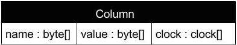

## Sistema P2P: Cassandra
Outra alternativa é fazer com que cada nó do sistema conheça todos os outros. Assim, cada requisição pode ser diretamente encaminhada ao nó responsável por tratá-la. 
O custo do roteamento, neste caso, é $O(1)$, muito mais rápido que na abordagem anterior. O custo de armazenamento da *tabela de rotas* é, contudo, $O(n)$, o que pode ser proibitivo em uma rede com milhares de nós, apesar de ser uma solução viável em redes menores. Este é o caso do CassandraDB, uma banco de dados distribuído baseado no Chord, que estudaremos melhor mais adiante, considerado uma DHT de salto único (*single-hop* DHT).

O CassandraDB foi, sem sombra de dúvida, influenciado pelo projeto do DynamoDB, o que é facilmente explicável já que um dos criadores do Dynamo foi o arquiteto do Cassandra.
Mas em vez de uma cópia, o Cassandra largamente expande a funcionalidade do Dynamo ao se inspirar no banco de dados [BigTable](https://en.wikipedia.org/wiki/Bigtable), do Google.
Com isso, o Cassandra se aproxima do modelo relacional, facilitando o desenvolvimento de certas aplicações, sem perder as características desejáveis das DHT.  
A principal característica neste sentido é o modelo híbrido chave-valor/relacional, em que os valores associados a uma chave são divididos em colunas.
A combinação chave-colunas são denominadas **column-families** e seu conjunto **keyspace**. Estas duas estruturas são equivalente às tabelas/relações e aos bancos de dados, dos bancos de dados  relacionais. 

Uma diferença fundamental entre column-families e relações é que as últimas precisam de um esquema pré-definido, enquanto que as primeiras não tem um esquema. Isto quer dizer que novas colunas podem ser adicionadas dinamicamente e que nem todas precisam estar presentes para cada chave. De fato, múltiplos registros com a mesma chave, ou linhas, podem ter conjuntos de colunas diferentes.

Para que o correto conjunto de colunas associado a uma chave possa ser apurado, após múltiplas escritas com a mesma chave tenham ocorrido, a cada tupla (chave,coluna,valor) é associado também um *timestamp*.  
.  
Assim, dados uma mesma chave e coluna, o valor válido é o com o maior timestamp.
Devido a possibilidade de valores serem escritos para diferentes colunas independentemente, valores válidos e inválidos podem ter o mesmo *timestamp*.
Por exemplo, considere os seguintes dados escritos no banco:

| Chave| Coluna$\rightarrow$Valor | Timestamp|
|------|--------------|----------|
| 3    | Nome$\rightarrow$José, Idade$\rightarrow$30 | 02:02:2020,13:45:00 |
| 3    | Idade$\rightarrow$33 | 02:02:2020,13:50:00|
| 3    | Telefone$\rightarrow$333444554433 | 02:02:2020,13:55:00|

Uma busca pelos dados associados à chave 3 retornará o seguinte resultado:  Nome$\rightarrow$José, Idade$\rightarrow$33, Telefone$\rightarrow$333444554433.
Para facilitar mais ainda o desenvolvimento, o Cassandra conta com uma linguagem de consulta similar ao SQL (Structured Query Language), a CQL (Cassandra Query Language).
Assim, a consulta a estes dados seria mais ou menos como `#!sql SELECT * FROM dados WHERE key == 3`.[^cql_sintax]

[^cql_sintax]: Este exemplo é meramente ilustrativo e não segue estritamente a sintaxe do CQL.

Há muitos recursos *online*  para se aprender mais se aprender mais sobre como usar o Cassandra, por exemplo, [aqui](http://wiki.apache.org/cassandra/GettingStarted).
Há também diversos projetos de código livre que o usam e podem ser estudados, por exemplo, o clone de Twiter [Twissandra](https://github.com/twissandra/twissandra).
Mas embora o uso de sistemas gerenciadores de bancos de dados em sistemas distribuídos seja interessante, aqui nos focaremos em alguns dos aspectos de como estes SGBD são construídos.

!!! note "Detalhes de Implementação"
    A seção de [tecnologias](../tech/#estruturas-de-dados-para-sd) descreve várias estruturas de dados recorrentemente usadas em implementação de bancos de dados como o Cassandra.