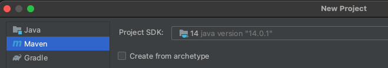

# Coordenação: Copycat 

[Copycat](http://atomix.io/copycat/) é um arcabouço de replicação de máquinas de estados implementada pela [Atomix](http://atomix.io/).
Na base do Copycat está uma implementação do Raft.
Sobre o Raft, uma API simples mas moderna permite a criação de máquinas de estados usando **lambdas**, **futures**, e o estilo **fluent** de encadeamento de invocações.

!!!note ""
    === "Lambda"
        * Classe com um único método.

        ```java
        class Tarefa implements Runnable {
          public void run(){
            while (true)
              System.out.println("Bem vindo a um loop infinito");
            }   
        }

        new Thread(new Tarefa()).start();
        ```

        * Classe anônima - uso único

        ```java
        new Thread( new Runnable() {
          public void run(){
            while (true)
              System.out.println("Bem vindo a um loop infinito");
          }   
        }).start();
        ```

        * Lambda

        ```java
        new Thread(() -> {
                        while (true)
                          System.out.println("Bem vindo a um loop infinito");
                      }).start();
        ```

    === "Fluent"
        * Encadeamento

        ```java
            Collection<Pessoa> c = ...;
            c.stream()
              .filter(p -> p.idade > 33)
              .map(Pessoa::sobrenomeNome)//.map(p -> p.sobrenomeNome())
              .forEach(s -> System.out.println(s));
        ```

    === "Future"
        * Promessa de computação e resultado.
      
        ```java
        ExecutorService executor = Executors.newSingleThreadExecutor();
        Future<Integer> futFib = executor.submit(() -> { return Fibonacci(217)};
        ```

        * Quando será executado?  Em algum momento.    
        * Como pegar o resultado? 

        ```java
        while (!futFib.isDone())
          System.out.println("tah calculando...");

        int fib217 = futFib.get();
        ```

        * Em qual thread?  Em algum thread. Depende do Executor Service usado.	

Há várias versões do Copycat disponíveis, com vantagens e desvantagens.

!!!note "Versões"
    === "Versão 1.1.4"
        * Baseado em http://atomix.io/copycat/docs/getting-started/ e https://www.baeldung.com/atomix
        * Código funcional em https://github.com/pluxos/atomix_labs
        * Documentação oficial removida

    === "Versão >= 2"
        * Melhor desempenho
        * Documentação ruim ou inexistente
        * https://github.com/atomix/atomix

    === "Versão 3"
        * em Go
        * evolução rápida
        * o código é a documentação


Aqui usaremos a versão 1.1.4, que apesar de antiga, é a melhor documentada atualmente, pelo tutorial referenciado acima.

* Clone e compile o projeto
	* Instale dependências:
      * git
      * maven 
      * JDK >= 1.8
	* `git clone https://github.com/pluxos/atomix_labs`
	* `cd atomix_labs`
	* `cd replication`
	* `mvn compile`
	* `mvn test`


Você deve ver uma saída semelhante à seguinte, o que quer dizer que seu código está compilando perfeitamente.

```bash
Tests run: 1, Failures: 0, Errors: 0, Skipped: 0

[INFO] ---------------------------------------
[INFO] BUILD SUCCESS
[INFO] ---------------------------------------
[INFO] Total time: 6.898 s
[INFO] Finished at: 2017-10-25T08:38:08-02:00
[INFO] Final Memory: 15M/159M
[INFO] ---------------------------------------
```

Antes de começar a escrever suas prórpia máquinas de estado, familiarize-se com a estrutura do projeto em https://github.com/pluxos/atomix_labs/tree/master/replication/src/main/java/atomix_lab/state_machine

Observe que há três pastas: 

* `type` - tipos dos dados mantidos pela replica (Edge e Vertex)  
   Os tipos são serializable para que o Java saiba como transformá-los em bytes.
* `command` - estruturas que contêm informações para modificar os tipos  
	Os comandos serão enviadas do cliente para o cluster e são naturalmente serializable.
* `client` - cria comandos e os envia para serem executados no cluster  
	Respostas podem ser esperadas síncrona ou assincronamente.
* `server` - recebe os comandos na ordem definida pelo Raft e os executa

O projeto foi construído seguindo as instruções no tutorial mencionado antes, saltando-se a parte dos snapshots, isto é:

* crie um projeto maven  
	eclipse tem template para isso
* adicione dependências no `pom.xml`  
	como so criei um projeto, coloquei as dependências tanto do cliente quando do servidor
* defina `Command` que modifiquem o estado das réplicas
* defina `Queries` que consultem o estado das réplicas
* implemente a réplica para lidar com os comandos
* implemente o cliente para emitir comandos


Para executar um servidor, você precisa passar diversos parâmetros

* identificador do processo (inteiro)
* IP do processo com identificador 0
* porta do processo com identificar 0
* IP do processo com identificador 1
* porta do processo com identificar 1
* ...

Sabendo seu identificador, o servidor sabe em qual porta escutar e em quais IP/porta se conectar para se comunicar com os outros servidores.

Para testar o projeto, execute três servidores, em três terminais distintos. 
Usando o maven, da linha de comando, basta executar os seguintes comandos[^\\]:

[^\\]: O `\\` no final da linha é só para mostrar que o comando continua na próxima e facilitar a visualização. 
Na hora de executar, use apenas uma linha, sem o `\\`.

```bash
mvn exec:java \\
  -Dexec.mainClass="atomix_lab.state_machine.server.GraphStateMachine" \\
  -Dexec.args="0 127.0.0.1 5000 127.0.0.1 5001 127.0.0.1 5002"
	
mvn exec:java \\
  -Dexec.mainClass="atomix_lab.state_machine.server.GraphStateMachine" \\
  -Dexec.args="1 127.0.0.1 5000 127.0.0.1 5001 127.0.0.1 5002"
	
mvn exec:java \\
  -Dexec.mainClass="atomix_lab.state_machine.server.GraphStateMachine" \\
  -Dexec.args="2 127.0.0.1 5000 127.0.0.1 5001 127.0.0.1 5002"
```


O cliente não precisa de um identificador, apenas dos pares IP/porta dos servidores.
Por exemplo, use o comando:

```bash
mvn exec:java \\
  -Dexec.mainClass="atomix_lab.state_machine.client.GraphClient" \\
  -Dexec.args="127.0.0.1 5000 127.0.0.1 5001 127.0.0.1 5002"
```


!!!exercise "Exercício"
    Uma vez executado o projeto, modifique-o para incluir uma nova operação (`Command`) e nova consulta (`Query`), de sua escolha.


#### Estudo de caso: Ratis

[Ratis](http://ratis.apache.org/) é um arcabouço de coordenação recentemente emancipado como um projeto no [Apache](https://apache.org).
Embora mal documentado, o projeto tem alguns exemplos que demonstram como usar abstrações já implementadas. 
A seguir veremos um passo-a-passo, baseado nestes exemplos, de como usar o Ratis para implementar uma máquina de estados replicada.

Crie um novo projeto Maven com o nome `ChaveValor` (eu estou usando IntelliJ, mas as instruções devem ser semelhantes para Eclipse).



Abra o arquivo `pom.xml` do seu projeto e adicione o seguinte trecho, com as dependências do projeto, incluindo o próprio Ratis.

```xml
<dependencies>
    <!-- https://mvnrepository.com/artifact/org.apache.ratis/ratis-server -->
    <dependency>
        <groupId>org.apache.ratis</groupId>
        <artifactId>ratis-server</artifactId>
        <version>2.0.0</version>
    </dependency>

    <!-- https://mvnrepository.com/artifact/org.apache.ratis/ratis-netty -->
    <dependency>
        <groupId>org.apache.ratis</groupId>
        <artifactId>ratis-netty</artifactId>
        <version>2.0.0</version>
    </dependency>
    <dependency>
        <groupId>org.apache.ratis</groupId>
        <artifactId>ratis-grpc</artifactId>
        <version>2.0.0</version>
    </dependency>
    <dependency>
        <groupId>com.beust</groupId>
        <artifactId>jcommander</artifactId>
        <version>1.78</version>
    </dependency>
    <dependency>
        <groupId>org.slf4j</groupId>
        <artifactId>slf4j-api</artifactId>
        <version>1.7.25</version>
    </dependency>
    <!-- https://mvnrepository.com/artifact/org.apache.logging.log4j/log4j-slf4j-impl -->
    <dependency>
        <groupId>org.apache.logging.log4j</groupId>
        <artifactId>log4j-slf4j-impl</artifactId>
        <version>2.14.1</version>
        <scope>compile</scope>
    </dependency>
    <dependency>
        <groupId>org.apache.logging.log4j</groupId>
        <artifactId>log4j-api</artifactId>
        <version>2.14.1</version>
    </dependency>
    <dependency>
        <groupId>org.apache.logging.log4j</groupId>
        <artifactId>log4j-core</artifactId>
        <version>2.14.1</version>
        <scope>provided</scope>
    </dependency>
</dependencies>
```

Adicione também o plugin Maven e o plugin para gerar um `.jar` com todas as dependências. Observe que estou usando Java 14, mas você pode mudar para a sua versão.

```xml
<build>
    <plugins>
        <plugin>
            <groupId>org.apache.maven.plugins</groupId>
            <artifactId>maven-compiler-plugin</artifactId>
            <version>${maven.compiler.version}</version>
            <configuration>
                <source>14</source>
                <target>14</target>
            </configuration>
        </plugin>
        <plugin>
            <artifactId>maven-assembly-plugin</artifactId>
            <executions>
                <execution>
                    <phase>package</phase>
                    <goals>
                        <goal>single</goal>
                    </goals>
                </execution>
            </executions>
            <configuration>
                <descriptorRefs>
                    <descriptorRef>jar-with-dependencies</descriptorRef>
                </descriptorRefs>
            </configuration>
        </plugin>
    </plugins>
</build>
```

Crie uma nova classe denominada `Cliente` no arquivo `Cliente.java`.
Nesta classe, iremos criar um objeto `RaftClient` que será usado para enviar operações para os servidores. 
Esta classe é importada juntamente com outras várias dependências, adicionadas no `pom.xml`, que devemos instanciar antes do `RaftClient`.

Neste exemplo eu coloco praticamente todos os parâmetros de configuração do Ratis *hardcoded* para simplificar o código.
Obviamente que voce deveria ser estes parâmetros como argumentos para o programa ou de um arquivo de configuração.

```java
import org.apache.ratis.client.RaftClient;
import org.apache.ratis.conf.Parameters;
import org.apache.ratis.conf.RaftProperties;
import org.apache.ratis.grpc.GrpcFactory;
import org.apache.ratis.protocol.*;
import org.apache.ratis.thirdparty.com.google.protobuf.ByteString;

import java.io.IOException;
import java.net.InetSocketAddress;
import java.nio.charset.Charset;
import java.util.HashMap;
import java.util.Map;

public class Cliente
{
```

O campo `raftGroupId` identifica um cluster Ratis; isso quer dizer que um mesmo processo pode participar de vários *clusters*, mas aqui nos focaremos em apenas um. O valor do campo deve ter exatamente caracteres, o que soma 32 bytes em java, e será interpretado como um [UUID](https://pt.wikipedia.org/wiki/Identificador_%C3%BAnico_universal).

`id2addr` é um mapa do identificador de cada processo no cluster para seu endereço IP + Porta.
Aqui usei várias portas distintas porquê todos os processos estão rodando na mesma máquina, mas se estivesse executando em máquinas distintas, com IP distintos, poderia usar a mesma porta em todos.

`addresses` é uma lista de `RaftPeer` construída a parti de `id2addr`.

O campo `raftGroup` é uma referência a todos os servidores, associados ao identificador do grupo, `raftGroupId`.


```java
    public static void main(String args[]) throws IOException
    {
        String raftGroupId = "raft_group____um"; // 16 caracteres.
        
        Map<String,InetSocketAddress> id2addr = new HashMap<>();
        id2addr.put("p1", new InetSocketAddress("127.0.0.1", 3000));
        id2addr.put("p2", new InetSocketAddress("127.0.0.1", 3500));
        id2addr.put("p3", new InetSocketAddress("127.0.0.1", 4000));

        List<RaftPeer> addresses = id2addr.entrySet()
                .stream()
                .map(e -> RaftPeer.newBuilder().setId(e.getKey()).setAddress(e.getValue()).build())
                .collect(Collectors.toList());

        final RaftGroup raftGroup = RaftGroup.valueOf(RaftGroupId.valueOf(ByteString.copyFromUtf8(raftGroupId)), addresses);
```

Uma vez criado o grupo, criamos o cliente usando a fábrica retornada por `RaftClient.newBuilder()`.
A fábrica deve ser configurada com os dados do grupo e o tipo de transporte, neste caso gRPC.
Também é necessário o identificador do processo que está se conectando ao grupo; neste caso, usamos um identificador aleatório qualquer, diferente do que faremos com os servidores.

```java
        RaftProperties raftProperties = new RaftProperties();

        RaftClient client = RaftClient.newBuilder()
                                      .setProperties(raftProperties)
                                      .setRaftGroup(raftGroup)
                                      .setClientRpc(new GrpcFactory(new Parameters())
                                      .newRaftClientRpc(ClientId.randomId(), raftProperties))
                                      .build();
```

Uma vez criado o cliente, podemos fazer invocações de operações nos servidores. Cada operação será invocada em todos os servidores, na mesma ordem.
Este protótipo suporta duas operações, `add` e `get`, incluindo algumas variações, que ignoraremos por enquanto.
A operação `add` é codificada como uma `String`, `add:k:v`, onde `k` e `v` são do tipo `String`. `add:k:v` adiciona uma entrada em um mapa implementado pelo nosso servidor com chave `k` e valor `v`.
Já a operação `get:k` recupera o valor `v` associado à chave `k`, se presente no mapa.

O método `RaftClient.io().send` é usado para enviar modificações para as réplicas e deve, necessariamente, passar pelo protocolo Raft.
Já o método `RaftClient.io().sendReadOnly` é usado para enviar consultas a qualquer das réplicas.
Ambos os métodos codificam o comando sendo enviado (`add:k:v` ou `get:k`) no formato interno do Ratis para as réplicas e retorna um objeto `RaftClientReply`, que pode ser usado para pegar a resposta da operação. 
O código é auto explicativo.

```java
        RaftClientReply getValue;
        CompletableFuture<RaftClientReply> compGetValue;
        String response;
        switch (args[0]){
            case "add":
                getValue = client.io().send(Message.valueOf("add:" + args[1] + ":" + args[2]));
                response = getValue.getMessage().getContent().toString(Charset.defaultCharset());
                System.out.println("Resposta:" + response);
                break;
            case "get":
                getValue = client.io().sendReadOnly(Message.valueOf("get:" + args[1]));
                response = getValue.getMessage().getContent().toString(Charset.defaultCharset());
                System.out.println("Resposta:" + response);
                break;
            case "add_async":
                compGetValue = client.async().send(Message.valueOf("add:" + args[1] + ":" + args[2]));
                getValue = compGetValue.get();
                response = getValue.getMessage().getContent().toString(Charset.defaultCharset());
                System.out.println("Resposta: " + response);
                break;
            case "get_stale":
                getValue = client.io().sendStaleRead(Message.valueOf("get:" + args[1]), 0, RaftPeerId.valueOf(args[2]));
                response = getValue.getMessage().getContent().toString(Charset.defaultCharset());
                System.out.println("Resposta: " + response);
                break;
            default:
                System.out.println("comando inválido");
        }

        client.close();
    }
}
```

Um vez criado o cliente, crie a classe `Servidor`, no arquivo `Servidor.java`; a parte inicial do código é semelhante à do cliente.

```java
import org.apache.ratis.conf.RaftProperties;
import org.apache.ratis.grpc.GrpcConfigKeys;
import org.apache.ratis.protocol.RaftGroup;
import org.apache.ratis.protocol.RaftGroupId;
import org.apache.ratis.protocol.RaftPeer;
import org.apache.ratis.protocol.RaftPeerId;
import org.apache.ratis.server.RaftServer;
import org.apache.ratis.server.RaftServerConfigKeys;
import org.apache.ratis.thirdparty.com.google.protobuf.ByteString;
import org.apache.ratis.util.LifeCycle;

import java.io.File;
import java.io.IOException;
import java.net.InetSocketAddress;
import java.util.Collections;
import java.util.HashMap;
import java.util.Map;
import java.util.concurrent.TimeUnit;

public class Servidor
{

    //Parametros: myId
    public static void main(String args[]) throws IOException, InterruptedException
    {
        String raftGroupId = "raft_group____um"; // 16 caracteres.

        //Setup for node all nodes.
        Map<String,InetSocketAddress> id2addr = new HashMap<>();
        id2addr.put("p1", new InetSocketAddress("127.0.0.1", 3000));
        id2addr.put("p2", new InetSocketAddress("127.0.0.1", 3500));
        id2addr.put("p3", new InetSocketAddress("127.0.0.1", 4000));

        List<RaftPeer> addresses = id2addr.entrySet()
                                          .stream()
                                          .map(e -> RaftPeer.newBuilder().setId(e.getKey()).setAddress(e.getValue()).build())
                                          .collect(Collectors.toList());
```

A primeira diferença vem na necessidade de identificar o servidor dentro do conjunto de servidores, o que é feito com um `RaftPeerId`.
Como cada servidor deve usar um identificador único, do conjunto pré-determinado em `id2addr`, o identificador é passado como argumento para o programa, obrigatoriamente.

```java
        //Setup for this node.
        RaftPeerId myId = RaftPeerId.valueOf(args[0]);

        if (addresses.stream().noneMatch(p -> p.getId().equals(myId)))
        {
            System.out.println("Identificador " + args[0] + " é inválido.");
            System.exit(1);
        }
```

Encare a seção seguinte como uma receita, mas observe que o método `RaftServerConfigKeys.setStorageDir` recebe o nome de uma pasta como argumento, que será usada para armazenar o estado da máquina de estados.
Se você executar o servidor múltiplas vezes, a cada nova execução o estado anterior do sistema será recuperado desta pasta.
Para **limpar** o estado, apague as pastas de cada servidor.

```java
        RaftProperties properties = new RaftProperties();
        properties.setInt(GrpcConfigKeys.OutputStream.RETRY_TIMES_KEY, Integer.MAX_VALUE);
        GrpcConfigKeys.Server.setPort(properties, 1000);
        RaftServerConfigKeys.setStorageDir(properties, Collections.singletonList(new File("/tmp/" + myId)));
```

A máquina de estados em si é especificada no próximo excerto, em `setStateMachine`, que veremos a seguir.

```java
        //Join the group of processes.
        final RaftGroup raftGroup = RaftGroup.valueOf(RaftGroupId.valueOf(ByteString.copyFromUtf8(raftGroupId)), id2addr);
        RaftServer raftServer = RaftServer.newBuilder()
                .setServerId(myId)
                .setStateMachine(new MaquinaDeEstados())
                .setProperties(properties)
                .setGroup(raftGroup)
                .build();
        raftServer.start();
```

Uma vez iniciado o servidor, basta esperar que ele termine antes de sair do programa.

```java
        while(raftServer.getLifeCycleState() != LifeCycle.State.CLOSED) {
            TimeUnit.SECONDS.sleep(1);
        }
    }
}
```

Vamos agora para a definição da classe `MaquinaDeEstados`, no arquivo `MaquinaDeEstados.java`.
Esta classe deve implementar a interface `org.apache.ratis.statemachine.StateMachine` e seus vários métodos ou, mais simples, estende `org.apache.ratis.statemachine.impl.BaseStateMachine`, a abordagem que usaremos aqui.

```java
public class MaquinaDeEstados extends BaseStateMachine
{
```

Por enquanto, ignoraremos o armazenamento do estado em disco, mantendo-o simplesmente em memória no campo `key2values`, e simplesmente implementaremos o processamento de comandos, começando pela implementação do método `query`.

Este método é reponsável por implementar operações que não alteram o estado da máquina de estados, enviadas com o método `RaftClient::sendReadOnly`. A única `query` no nosso sistema é o `get`.
No código, o conteúdo da requisição enviada pelo cliente deve ser recuperado em quebrado em operação (`get`) e chave , usando `:` como delimitador.
Recuperado o valor associado à chave, o mesmo é colocado em um `CompletableFuture` e retornado.

```java
    private final Map<String, String> key2values = new ConcurrentHashMap<>();

    @Override
    public CompletableFuture<Message> query(Message request) {
        final String[] opKey = request.getContent().toString(Charset.defaultCharset()).split(":");
        final String result = opKey[0]+ ":"+ key2values.get(opKey[1]);

        LOG.debug("{}: {} = {}", opKey[0], opKey[1], result);
        return CompletableFuture.completedFuture(Message.valueOf(result));
    }
```

O método `applyTransaction` implementa operações que alteram o estado, como `add`, enviadas com o método `RaftClient::send`. 
Da mesma forma que em `get`, a operação deve ser recuperada em quebrada em operação (`add`), chave e valor, usando `:` como delimitador.

```java

    @Override
    public CompletableFuture<Message> applyTransaction(TransactionContext trx) {
        final RaftProtos.LogEntryProto entry = trx.getLogEntry();
        final String[] opKeyValue = entry.getStateMachineLogEntry().getLogData().toString(Charset.defaultCharset()).split(":");

        final String result = opKeyValue[0]+ ":"+ key2values.put(opKeyValue[1], opKeyValue[2]);

        final CompletableFuture<Message> f = CompletableFuture.completedFuture(Message.valueOf(result));

        final RaftProtos.RaftPeerRole role = trx.getServerRole();
        LOG.info("{}:{} {} {}={}", role, getId(), opKeyValue[0], opKeyValue[1], opKeyValue[2]);

        return f;
    }
```

Pronto, você já tem uma máquina de estados replicada, bastando agora apenas compilá-la e executá-la.
Para compilar, de raiz do projeto execute o comando `mvn package`. 
A primeira vez que faz isso pode demorar um pouco pois várias dependências são baixadas da Internet.
Ao final da execução do comando você deveria ver algo semelhante ao seguinte

```bash
...
INFO] ------------------------------------------------------------------------
[INFO] BUILD SUCCESS
[INFO] ------------------------------------------------------------------------
[INFO] Total time:  4.793 s
[INFO] Finished at: 2020-12-06T23:06:32-03:00
[INFO] ------------------------------------------------------------------------
```

Então, em três terminais diferentes, execute os seguintes comandos:

```bash
java -cp target/ChaveValor-1.0-SNAPSHOT-jar-with-dependencies.jar Servidor p1
java -cp target/ChaveValor-1.0-SNAPSHOT-jar-with-dependencies.jar Servidor p2
java -cp target/ChaveValor-1.0-SNAPSHOT-jar-with-dependencies.jar Servidor p3
```

Para executar o cliente, em um outro terminal, faça, por exemplo,

```bash
java -cp target/ChaveValor-1.0-SNAPSHOT-jar-with-dependencies.jar Cliente add k1 testek1
java -cp target/ChaveValor-1.0-SNAPSHOT-jar-with-dependencies.jar Cliente get k1

java -cp target/ChaveValor-1.0-SNAPSHOT-jar-with-dependencies.jar Cliente add k2 testek2
```

Todo o código está disponível no [Github](https://github.com/lasarojc/ds_notes/tree/master/docs/fault/code/ChaveValor)

???todo "Exercício"
    * Adicionar operações 
        * `del`
        * `clear`

###### Operações assíncronas
???todo "TODO"
    * Operações assíncronas usando `async()` em vez de `io()`.
    * `CompletableFuture`


###### Leituras "velhas"
???todo "TODO"
    * *stale reads* usando `sendStaleRead` em vez de `sendRead`.
    * índice inicial
    * nó
    * `java -cp target/ChaveValor-1.0-SNAPSHOT-jar-with-dependencies.jar Cliente get_stale  k1 p1`


#### Estudo de caso: Zookeeper
O [Zookeeper](http://zookeeper.apache.org/) foi criado para coordenar as ações dos componentes de sistemas distribuídos, porquê sistemas distribuídos são como zoológicos, com animais de diversas espécies, sendo obrigados a conviver de forma anti-natural.


###### Visão Geral

De acordo com os criadores
!!!quote "O quê?"
     ZooKeeper is a **centralized** service for maintaining **configuration** information, **naming**, providing distributed **synchronization**, and providing **group services**. All of these kinds of services are used in some form or another by **distributed applications**. Each time they are implemented there is a lot of work that goes into fixing the bugs and race conditions that are inevitable. Because of the difficulty of implementing these kinds of services, applications initially usually skimp on them, which make them brittle in the presence of change and difficult to manage. Even when done correctly, different implementations of these services lead to management **complexity** when the applications are deployed.

O arcabouço foi criado pelo [Yahoo!](http://www.yahoo.com) para servir como peça na construção de sistemas distribuídos dentro da empresa.

!!!quote "Por quê?"
	  Coordination services are notoriously hard to get right. They are especially prone to errors such as race conditions and deadlock. The motivation behind ZooKeeper is to relieve distributed applications the responsibility of implementing coordination services from scratch.

Mais tarde o sistema tornou-se *Open Source* e parte de diversos projetos, tanto abertos quanto proprietários.
A razão de seu sucesso, arrisco dizer, é a simplicidade de sua API, semelhante a um sistema de arquivos.

!!!quote "Como?"
    [ZooKeeper] exposes a **simple set of primitives** that distributed applications can build upon to implement higher level services for synchronization, configuration maintenance, and groups and naming. It is designed to be easy to program to, and uses a data model styled after the familiar **directory tree structure of file systems**. It runs in Java and has bindings for both **Java** and **C**.

     ZooKeeper allows distributed processes to coordinate with each other through a **shared hierarchal namespace which is organized similarly to a standard file system**. ... Unlike a typical file system, which is designed for storage, ZooKeeper data is kept **in-memory**, which means ZooKeeper can achieve **high throughput and low latency** numbers.

O sistema de arquivos do Zookeeper tem nós denominados **znodes**, em referência aos i-nodes do mundo Unix.
O znode raiz é denominado `/` e um filho da raiz nomeado `teste` é referido como `/teste`.
Cada znode pode ser visto como **arquivo** e **diretório** ao mesmo tempo.


Znodes são manipulados, essencialmente, por 4 operações, implementando CRUD, e uma quinta operação que lista os znodes filhos de um dado znode.

* C: create
* R: get
* U: set
* D: delete
* ls *: get children

Znodes são lidos e escritos sempre integralmente. Isto é, não se pode escrever apenas parte do conteúdo do "arquivo". Por isso, recomenda-se que os arquivos sejam sempre pequenos, onde pequeno é relativo.

O sistema de arquivos do Zookeeper é replicado em vários nós, usando a técnica de replicação de máquinas de estados estudada. 
A difusão ordenada de comandos é implementadas O protocolo utilizado é pelo protocolo de difusão atômica próprio do Zookeeper, ZAB ([*Zookeeper Atomic Broadcast*](https://zookeeper.apache.org/doc/r3.7.0/zookeeperInternals.html#sc_atomicBroadcast)).

Comandos de modificação do sistema de arquivos, como **create** e **delete**, podem ser enviados para qualquer das réplicas, mas serão internamente encaminhados para um processos líder e de lá replicados.


Já comandos de leitura são executados direto na réplica que os recebe, sendo respondidos mais rapidamente mas que, devido à assincronia do sistema, podem ser respondidos com dados antigos. Por este motivo, clientes sempre conversam com o mesmo servidor, a não ser que sejam forçados a estabelecer nova conexão, e só emitem novos comandos depois que o anterior tiver sido respondido. Este comportamento resulta em garantias de consistência específicas, denominadas [consistência sequencial ordenada](https://zookeeper.apache.org/doc/r3.7.0/zookeeperInternals.html#sc_consistency).


Por causa do custo em termos de mensagens trocadas entre os processos para mensagens de atualização e pelo baixo custo das mensagens de leitura, o zookeeper é recomendado para cargas de trabalho com poucas escritas.

!!!quote "Desempenho"
    ZooKeeper is fast [...] and it performs best where reads are more common than writes, at ratios of around 10:1.
	  
O gráfico seguinte mostra como o desempenho do sistema varia com o número de processos.
No eixo Y, a quantidade de requisições processadas por segundo, ou seja, a vazão.
No eixo X, a percentagem das requisições do teste que são leituras e, portanto, repondidas na réplica em que são recebidas.
As diferentes curvas mostram diferentes configurações do sistema, indo de 3 a 12 réplicas.


Em geral, todas as configurações apresentam melhor desempenho quando há uma percentagem maior de leituras.
Mas observe como as curvas se invertem, se focando primeiro na curva para 3 servidores: quando todas as operações são de escrita, e portanto precisam passar pelo protocolo de difusão atômica, esta curva apresenta os melhores resultados. Isto ocorre porquê o *overhead* de executar o protocolo é mais baixo entre 3 servidores que entre 13. Em compensação, quando temos mais leituras, que não precisam de sincronização, então ter mais servidores é mais vantajoso pois sobre menos carga de trabalho para cada servidor.


###### Laboratório

Instale o Zookeeper em sua máquina seguindo estas instruções.

* Baixe: `wget www-eu.apache.org/dist/zookeeper/zookeeper-3.6.2`
* Descomprima: `tar xvzf zookeeper*.tgz`
* Entre na pasta criada.
* Configure: copie o arquivo `conf/zoo_sample.cfg` para `conf/zoo.cfg`
* Execute
    * `./bin/zkServer.sh start-foreground` em um terminal
    * `./bin/zkCli.sh -server 127.0.0.1:2181` em outro terminal

Do shell do programa cliente (executado por último), digite `help` e enter para ver uma lista de todos os comandos disponíveis.
Vejamos alguns exemplos básicos.

* `ls /` - lista os nós filhos da raiz.
* `create /teste lala` - cria o nó `/teste` com conteúdo `lala`
* `get /teste` - pega o conteúdo do arquivo
* `set /teste lele` - atualiza o conteúdo do arquivo
* `delete /teste` - apaga o arquivo

Outros comandos interessantes são:

* `stat /teste` - mostra medatados do arquivo, por exemplo versão, e *timestamps*
* `set -v V /teste lili` - faz um update condiciona, isto é, atualiza o conteúdo do arquivo se a versão do mesmo, como mostrada pelo comando `stat`, for igual a `V`

###### Nós Efêmeros e Watches
O Zookeeper tem muitas funcionalidades interessantes, mas chamarei a atenção a duas que são particularmente úteis:

Nós **efêmeros**, criados com a flag `-e`, p.e., `create -ef /teste/noefemero efemero`, são automaticamente destruídos quando o cliente que os criou se desconecta do servidor. E **watches** avisam ao cliente quando uma operação em um certo znode ou em seus filhos acontece. Para ser avisado quando os dados de um nó forem alterados, use a opção `-w` do get, por exemplo, `get -w /teste`. Para monitorar alterações no conjunto de filhos de um nó, use `-w` no `ls`, por exemplo, `ls -w /teste`.

!!!exercise "Nós Efêmeros e Watches"
    * Crie um zNode /teste
    * Debaixo de /teste, crie três outros, sequenciais
	
    * Crie um zNode /teste2
    * Crie um zNode efêmero
    * Conecte-se com outro cliente
    * Coloque um watch em /teste2
    * Desconecte o primeiro cliente
    * Observe o evento gerado no segundo cliente
    * Reconecte o primeiro cliente


###### Cluster tolerante a falhas

Observe que você está executando o Zookeeper em apenas um nó, ou seja, não há tolerância a falhas alguma aqui.
Para tolerar falhas, você precisa de um cluster multi-nós, mesmo que seja em uma única máquina. 
Neste caso, crie três arquivos de configuração, `zoo1.cfg`, `zoo2.cfg` e `zoo3.cfg`. O arquivo `zooX.cfg`, onde `1 <= X <= 3`, fica assim:

* `dataDir=/tmp/lasaro/zooX #Substitua o X pelo valor correto`
* `server.1=zoo1:2888:3888`
* `server.2=zoo2:2889:3889`
* `server.3=zoo3:2890:3890`
* `clientPort=218X #Substitua o X pelo valor correto`
	
Crie diretórios e arquivos de identificação.

* `mkdir /tmp/lasaro/zooX`
* `echo X > /tmp/lasaro/zooX/myid`

Execute servidores.

* `./bin/zkServer.sh start conf/zooX.cfg`

Ainda que tenha três servidores executando em uma mesma máquina, seu cluster parará de funcionar se a máquina parar de funcionar. O ideal é que cada servidor execute em uma máquina distinta.


###### Receitas

É possível resolver diversos problemas encontrados em sistemas distribuídos usando-se o ZooKeeper, por exemplo, o problema de descoberta de processos.

!!!example "Rendezvous"
    Ponto de encontro de processos. 
    
    * Defina um zNode raiz a ser usado: /rendezvous/app1/ 
	  * Cada filho de /rendezvous/app1 corresponde a um processo:
  	    * IP
        * Porta
        * Número de processadores
        * ...
    * Processo p ao ser iniciado:
        * procura /rendezvous/app1/p
        * se achar, continua
        * se não achar, cria /rendezvous/app1/p
    * lista os filhos de /rendezvous/app1
		

Como lidar com saída de processos?
Faça todos os zNodes são efêmeros.
Quando um nó é desconectado, o zNode correspondente será destruído.


Como detectar mudanças no grupo de processos?

Monitore os filhos de /rendezvous/app1  
Sempre que receber notificações, refaça o cálculo do ***membership***.


Eleição de Líderes
Rendezvous.
Faça os zNodes sequenciais.
Ordene os zNodes e escolha o primeiro.
Monitore o zNode. Se ele sumir, eleja outro líder.


!!!exaple "Exclusão Mútua"
     Construa uma fila usando nós efêmeros e sequenciais. O processo na cabeça da fila tem direito de acesso. Em caso de falhas, o processo é removido da cabeça da fila.

Várias outras receitas podem ser facilmente encontradas no [sítio do projeto](http://zookeeper.apache.org/doc/trunk/recipes.html):

* Lock distribuído
* Filas, e.g. de prioridades
* Barreira
* Serviço de nomes
* Terminação em duas fases
* Contador atômico

Além destas, outro projeto, o [Curator](http://curator.apache.org) se dedica apenas a colecionar implementações corretas de receitas para o Zookeeper.


#### Estudo de caso: Etcd

???todo
    [etcd](https://etcd.io/)


#### Estudo de caso: Kafka

???todo
    [Kafka](https://kafka.apache.org/)

#### Estudo de caso BFT-Smart

???todo
    [BFT-Smart](https://github.com/bft-smart/library)

<!--
O quê?
* Manter dados/serviços disponíveis a despeito de falhas.

Replicação
* No Kafka, o \alert{Replication Factor} determina quantas cópias de cada tópico (todas as partições no tópico).

Líder e Seguidor
*  Produtor conversa com líder. Líder grava localmente e envia ack ao produtor.
*  Consumidor conversa com líder. Líder envia dados ao consumidor.
*  Líder replica dados para seguidores.

Replicar
* Passo 6  ensina a criar um sistema com múltiplos brokers.

*  Identificador
*  Porta (mesmo servidor)
*  \alert{Log directory}

Replicar
*  Crie um novo tópico, com RF = 3 e duas partições
*  \lstinline|bin/kafka-topics.sh --list --zookeeper localhost:2181 --describe --topic <topico>|
*  Lista de réplicas
*  Lista de réplicas sincronizadas: \emph{list of \alert{i}n \alert{s}ync \alert{r}eplicas}


Zookeeper
*  Permite que nós do cluster se descubram
*  Elege líder

Armazenamento
*  Dado deve ser removido depois de um tempo de ``retenção''
*  Pode definir retenção por tamanho (por partição, não tópico)


Produtor

*  Produtor envia mensagens para os brokers
*  Producer API
*  [Learning Journal](https://github.com/LearningJournal/ApacheKafkaTutorials)

SimpleProducer.java

```java
import org.apache.kafka.clients.producer.KafkaProducer;
import org.apache.kafka.clients.producer.Producer;
import org.apache.kafka.clients.producer.ProducerRecord;
import java.util.Properties;

public class SimpleProducer {
 public static void main(String[] args) {
  String topicName = "SimpleProducerTopic";
  String key = "Chave";
  String value = "Valor";
  Properties props = new Properties();
  props.put("bootstrap.servers", "localhost:9092, localhost:9093");
  props.put("key.serializer", "org.apache.kafka.common.serialization.StringSerializer");
  props.put("value.serializer", "org.apache.kafka.common.serialization.StringSerializer");

  Producer<String, String> producer = new KafkaProducer<String, String>(props);

  ProducerRecord<String, String> record = new ProducerRecord<String, String>(topicName, key, value);

  producer.send(record);
  producer.close();

  System.out.println("SimpleProducer Completed.");
 }
}
```

Workflow
images/kafka6.png)

*  Particionador default
	*  Partition
	*  Hash da ``chave''
	*  Round robin
*  Retry automático


Fire and Forget
* Envia a mensagem e não se importa com o resultado.

Synchronous Call
* Envia a mensagem e espera para saber se foi entregue ou não.

```java
try{
 RecordMetadata metadata = producer.send(record).get();
 System.out.println("Message is sent to Partition no " + metadata.partition() + " and offset " + metadata.offset());
 System.out.println("SynchronousProducer Completed with success.");
}catch (Exception e) {
 e.printStackTrace();
 System.out.println("SynchronousProducer failed with an exception");
}finally{
 producer.close();
}
```

*  Future

Callback
Envia a mensagem e é invocado depois de receber um ACK

```
producer.send(record, new MyProducerCallback());

...

class MyProducerCallback implements Callback{
 @Override
 public  void onCompletion(RecordMetadata recordMetadata, Exception e) {
  if (e != null)
   System.out.println("AsynchronousProducer failed with an exception");
  else
   System.out.println("AsynchronousProducer call Success:");
 }
}
```

*  max.in.flight.requests.per.connection


Default Partitioner


*  Partition
*  Hash da ``chave'' \% \#partition
*  Round robin

\href{https://github.com/LearningJournal/ApacheKafkaTutorials/blob/master/ProducerExamples/SensorPartitioner.java}{Exemplo de Custom Partitioner}
\end{frame}

\subsection{Consumidor}

\begin{frame}{Consumer Groups}
\begin{itemize}
*  Múltiplos consumidores processam dados em paralelo
*  Grupo de consumidores de tópicos
*  Grupo pertence à mesma aplicação
	\includegraphics[width=.6\textwidth]{images/kafka7}
*  Duplicate reads? Consumidores não compartilham partições
*  Group coordinator (broker eleito): lista de consumidores
*  Group líder: rebalanceamento
\end{itemize}
\end{frame}

\begin{frame}[fragile, allowframebreaks]{Consumer}
\begin{lstlisting}[language=Java]
import org.apache.kafka.clients.consumer.ConsumerRecord;
import org.apache.kafka.clients.consumer.ConsumerRecords;
import org.apache.kafka.clients.consumer.KafkaConsumer;

import java.io.IOException;
import java.util.Arrays;
import java.util.Properties;

public class SimpleConsumer {
 public static void main(String[] args) throws IOException {
  String topicName = "SimpleProducerTopic";
  String groupName = "SupplierTopicGroup";

  Properties props = new Properties();
  props.put("bootstrap.servers", "localhost:9092,localhost:9093");
  props.put("group.id", groupName);
  props.put("key.deserializer", "org.apache.kafka.common.serialization.StringDeserializer");
  props.put("value.deserializer", "org.apache.kafka.common.serialization.StringDeserializer");

  KafkaConsumer<String, String> consumer = null;

  try {
   consumer = new KafkaConsumer<String, String>(props);
   consumer.subscribe(Arrays.asList(topicName));

   while (true) {
    ConsumerRecords<String,String> records = consumer.poll(100);

    for (ConsumerRecord<String, String> record: records)
     System.out.println("Key = " + record.key() + " Value = " + record.value());
   }
  } catch (Exception ex) {
   ex.printStackTrace();
  } finally {
   consumer.close();
  }
 }
}
\end{lstlisting}

\begin{itemize}
*  Se não definir grupo, será novo grupo, e lerá todas as mensagens disponíveis
\end{itemize}
\end{frame}


\begin{frame}{Poll}
\begin{itemize}
*  poll também envia hearbeat
*  executar a cada 3s, no mínimo	
*  Current offset: a cada poll, broker incrementa current offset
*  Commited offset: o consumidor informa quais índices foram processados
	\begin{itemize}
	*  Auto Commit
		\begin{itemize}
		*  enable.auto.commit
		*  auto.commit.interval.ms
		*  Pode causar reprocessamento de mensagens
		\end{itemize}
	*  Manual Commit
		\begin{itemize}
		*  CommitSync
		*  CommitAsync
		\end{itemize}
	\end{itemize}
\end{itemize}
\end{frame}


\subsection{Arquitetura}
%\begin{frame}{Líder}

%\end{frame}

%mensagens são ack depois de copiadas para todas as réplicas
%replicas lentas são removidas se lentas ou falhas
%at least once, at most once, exactly one (nao suportado)
%rolling upgrade
%tls security
%rest
%CRUD


### Falhas Bizantinas 

Uma história de três exércitos -- Versão 2}
Exércitos estão às portas de Bizâncio, aka Constantinopla, aka Istambul.

Todos os exércitos tem que atacar em conjunto ou se retirar em conjunto.

Cada exército é comandado por um General. Alguns destes preferem atacar, enquanto outros preferem se retirar.

Alguns generais podem ter sido comprados, e mandar mensagens discrepantes para os outros, ou simplesmente não mandar mensagens.

Fonte: \href{http://research.microsoft.com/en-us/um/people/lamport/pubs/byz.pdf}{Lamport, L.; Shostak, R.; Pease, M. (1982). "The Byzantine Generals Problem" (PDF). ACM Transactions on Programming Languages and Systems. 4 (3): 382–401. doi:10.1145/357172.357176.}


Generais e Tenentes
Problema pode ser mudado para:

	* Comandante envia ordem.
	* Todos os tenentes leais executam ordem recebida.
	* Comandante pode ser traidor.


Generais e Tenentes
Suponha 3 exércitos. \\
Comandante (traidor) diz "Ataque!" Tenente A e "Retirada!" tenente B.\\
Ou \\
Comandante diz "Ataque!" a ambos. Tenente A segue a ordem mas B se retira.

 E se os tenentes trocarem informações?

 Como diferenciar casos em que Comandante ou Tenente é traidor?


Generais e Tenentes
Só há solução se mais de $\frac{2}{3}$ dos Generais/Tenentes são leais.


%http://www.drdobbs.com/cpp/the-byzantine-generals-problem/206904396?pgno=5

Comunicação}

	* Toda mensagem enviada é entregue corretamente.
	* A ausência de mensagem pode ser detectada (mensagem Null é entregue no lugar) (Sistema síncrono)


4/0}
General manda ordens.

Ausência de ordem = Retirada

Tenente repassa ordens

Maioria de comandos é comando a ser seguido


4/0}
General manda ordens.

Ausência de ordem = Retirada

Tenente repassa ordens

Maioria de comandos é comando a ser seguido


Comunicação}

	* Toda mensagem enviada é entregue corretamente.
	* Toda mensagem é assinada.
	* A ausência de mensagem pode ser detectada (mensagem Null é entregue no lugar) (Sistema síncrono)


 É possível detectar inconsistências e processos bizantinos.


%http://cs.brown.edu/courses/cs138/s16/lectures/19consen-notes.pdf
\section{Outros tópicos}

%TODO \subsection{Detectores de Falhas}


\subsection{Reconfiguração}

Reconfiguração da Aplicação}
Na segunda entrega do projeto, você distribuiu a carga do seu banco de dados entre vários nós. Caso um nó falhe, parte dos seus dados será perdida.

Para corrigir esta deficiência, na terceira entrega, cada nó será replicado em três vias e, assim, caso um nó falhe, outros dois continuarão a manter o dado.


Reconfiguração da Aplicação}
Ainda assim, há problemas. E se mais de um, de um mesmo conjunto de réplicas, falhar? 

 Embora seja pequena a probabilidade de dois nós de um mesmo grupo falharem em instantes próximos, dado tempo suficiente, qualquer evento com probabilidade diferente de 0 acontecerá.

 Precisamos de uma forma de trocar nós da aplicação que falharam por novos nós. 

Este é problema denominado Pertinência de Grupo ou \emph{Group Membership}


Group Membership}
Para não correr o risco, retire o processo falhos do grupo e coloque outro no lugar!

I.e., mude a visão que o sistema de quem é o grupo.


Visões}
\includegraphics[width=.7\textwidth]{images/vc}

Fonte: \href{https://www.cs.rutgers.edu/~pxk/417/notes/virtual_synchrony.html}{Paul Krzyzanowski}

$G$ é o grupo de processos participando do sistema, é a Visão do Sistema.


Inicialmente, $G$ consiste de apenas o processo $p$, como o processo que cria o cluster no Atomix. Na sequência, outros processo vão se unindo ao grupo através de View Changes. Uma vez que $p$ e $q$ estão no grupo, inicia-se a comunicação entre eles. Quando $r, s$ e $t$ aparecem, também entram no grupo por meio de uma nova visão.

Finalmente, quando ambos $p$ e $q$ falham, os outros processo os excluem da visão, e continuam funcionando normalmente.


Impossibilidade de Detecção de Falhas}
Em um sistema distribuído assíncrono, é impossível distinguir com toda certeza um processo falho (parou de funcionar) de um que está lento.

 Como decidir se mudar ou não de visão?


Ou aceita a imprecisão e muda quando suspeitar de uma falha, ou corre o risco de ficar esperando \emph{ad eternum} e não mudar, mesmo quando uma falha aconteceu.

Uma ``solução''!}
Quando suspeitar de falha, reporte suspeita a outros processos, que também passarão a suspeitar.

Tome decisão baseado na suspeita, isto é, troque de visão quando houver suspeita.

Pague o preço de uma suspeita errada, isto é, quando um processo for removido da visão indevidamente, adicione-o novamente.


Sincronismos Virtual}
Gerenciamento de Grupo/Group Membership e Comunicação em Grupo

	* Processos se unem ao grupo
	* Processos saem do grupo
	* Processos enviam mensagens para o grupo
	* Diferentes ordenações
		
			* Atomic Multicast
		


Visão de Grupo}

	* Visão: conjunto de processos no sistema.
	* Multicast feito para processos na visão.
	* Visão é consistente entre os processos.
	* Entrada e saída de processos muda a visão.


Eventos}

	* Mensagem
	* Mudança de Visão
	* Checkpoint


Visões}
\includegraphics[width=.7\textwidth]{images/vc}

Fonte: \href{https://www.cs.rutgers.edu/~pxk/417/notes/virtual_synchrony.html}{Paul Krzyzanowski}


Sincronismo Virtual}
Deve satisfazer

	* Se uma mensagem é enviada em uma visão, ela só pode ser entregue naquela visão.
	* Se uma mensagem é entregue a um processo correto em uma visão, então é entregue a todos os processos corretos naquela visão.
	* Se um processo não recebe a mensagem, ele não estará na próxima visão.
	* Ao entrar em uma visão, o processo recebe o estado dos outros processos e seu estado se torna equivalente ao de um processo que recebeu todas as mensagens já entregues.


A troca de Visão é uma barreira.


ISIS Toolkit}
	Sistema de Sincronismo Virtual tolerante a falhas desenvolvido por Ken Birman, Cornell University (\url{http://www.cs.cornell.edu/Info/Projects/Isis/})\\
	ISIS: An Environment for Constructing Fault-Tolerant Distributed Systems. Kenneth Birman, D. Skeen, A. El Abbadi, W. C. Dietrich and T. Raeuchle. May 1983.
	

	* 100.000's/s
	* Em uso até 2009
	* NY Stock Exchange
	* Swiss Exchange
	* US Navy
	* Precursos de sistemas como Zookeeker
	* Totem, ISIS, Horus, Transis (Partições), \alert{Spread}, \alert{Ensamble}, \alert{JGroups}, Appia, QuickSilver, vSynch (née ISIS 2)


Difusão Totalmente Ordenada}

	* Corretude: Se um processo $p$ envia uma mensagem $m$ para processos no grupo $G$, então se $p$ não falha, todos os processos corretos em $G$ recebem a mensagem.
	
	* Acordo: Se um processo correto em $G$ recebe uma mensagem $m$, então todo processo correto em $G$ recebe $m$
	
	* Ordenação: Se um processo recebe mensagem $m$ e depois $n$, então qualquer processo que receba a mensagem $n$ deve primeiro receber $m$
	
	* Validade: Somente mensagens difundidas são entregues.


E se mandarmos mensagens do tipo ``A partir da entrega desta mensagem, o grupo de processos é $G$.''


Sincronismo Virtual}
Deve satisfazer

	* Se uma mensagem é enviada em uma visão, ela só pode ser entregue naquela visão.\\
	Mensagens de troca de visão podem incrementar um contador\\
	Mensagens normais carregam o valor atual do contador\\
	Mensagem descartada se valor na mensagem é maior contador no destinatário
	
	* Se uma mensagem é entregue a um processo correto em uma visão, então é entregue a todos os processos corretos naquela visão.\\
	Pela difusão, se a mensagem de troca for entregue para um processo, será entregue para todos os corretos, na mesma ordem
	Se mensagem comum for entregue antes para algum, será entregue ante para todos.
	
	* Se um processo não recebe a mensagem, ele não estará na próxima visão.\\
	Se um processo não recebe uma mensagem comum que foi entregue pelos outros, então ele não troca de visão.

	* Ao entrar em uma visão, o processo recebe o estado dos outros processos e seu estado se torna equivalente ao de um processo que recebeu todas as mensagens já entregues.\\
	Caso contrário, não haveria porquê trocar os processos


State Transfer}
\includegraphics[width=.7\textwidth]{images/state_transfer}


\href{http://www.gsd.inesc-id.pt/~ler/docencia/tfd0405/bib/BSRNA.pdf}{Building Secure and Reliable Network Applications}


Difusão Atômica $\equiv$ Sincronismo Virtual?}
Seria uma boa aproximação, mas que poderia ser relaxada. 

Em certas aplicações, FIFO ou Causal seriam suficientes dentro da visão, desde que a mensagem de mudança da visão seja totalmente ordenada com as comuns.


Particionamento}
E se dois subconjuntos mutuamente exclusivos se formarem e criarem visões independentes?

 \emph{Primary Partition Model} -- Somente a partição primária pode mudar de visão.

 Lembram-se que no Raft somente uma partição com uma maioria de processo pode decidir? É exatamente a mesma situação, pois os processos estão chegando a um Consenso sobre quem é a nova visão.


Extended Virtual Synchrony}
\emph{Primary Partition Model} -- Não é adequado a uma rede geograficamente distribuída (Internet scale).

 Lembram-se que no Raft somente uma partição com uma maioria de processo pode decidir? É exatamente a mesma situação, pois os processos estão chegando a um Consenso sobre quem é a nova visão.


É possível que no trabalho dois, alguns de vocês tenham tentado gerar locks do sistema para manipular objetos distribuídos no sistema. Esse locks são perigosos por quê processos pode travar/quebrar/falhar e nunca liberarem os locks. O uso de um algoritmo VS poderia ser usado para resolver o problema.\right 


[Swim](https://asafdav2.github.io/2017/swim-protocol/)


http://courses.cs.vt.edu/cs5204/fall05-gback/lectures/Lecture8.pdf


-->