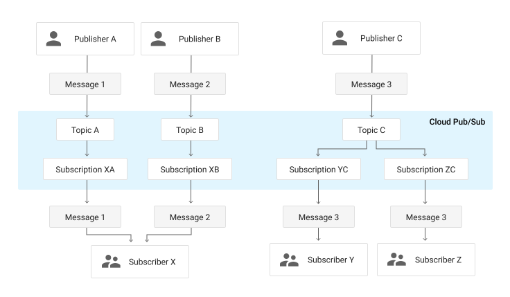

As camadas de abstração mais básicas do desenvolvimento de SD estão **na rede de computadores**, que servem de substrato a todo e qualquer sistema distribuído, afinal, a pedra fundamental da construção de sistemas distribuídos é a capacidade de comunicação entre seus componentes.

## Canais e Protocolos

Para que os componentes de um sistema distribuído se comuniquem, é necessário que seus *hosts* possuam **interfaces de rede** e que estas interfaces estejam ligadas a uma rede com capacidade de roteamento de dados, estabelecendo um **canal de comunicação** entre os componentes.
Além do canal, é também necessário que se estabeleça um **protocolo de comunicação**, que define as regras para que a comunicação aconteça, por exemplo, a gramática para formação de mensagens.
Por exemplo, quando você fala com uma pessoa, cara-a-cara, o meio de comunicação é o ar e o protocolo utilizado é a linguagem conhecida pelas duas partes, o Português por exemplo.
Na prática, canais de comunicação podem ter diversas topologias e características, por exemplo:

| Ponto-a-ponto  | Barramento Compartilhado | Token Ring |
|----------------|--------------------------|------------|
| Sem colisões   | Com colisões             | Sem colisões|
| Roteamento trivial | Roteamento complexo | Roteamento simples|
| Caro (exponencial) | Barato (linear) | Barato (linear)|

Nas redes atuais, pode se dizer que o meio mais utilizado é provido pela arquitetura **Ethernet**, que trata da comunicação entre nós usando um **barramento compartilhado**, mesmo que este esteja por vezes escondido.
Sobre este meio, são usados protocolos para, por exemplo,

* Controle de acesso ao meio 
* Transmissão de mensagens
* Evitar e tratar colisões

As redes Ethernet, contudo, cobrem pequenas áreas e para se ter conversas mais "abrangentes", é necessário que se conecte diversas destas redes.
A conversa então é feita por meio de intermediários, ***gateways*** que conectam duas ou mais redes, permitindo que mensagens de um interlocutor sejam **roteadas** para o outro, via tais intermediários.

Um exemplo interessante das questões ligadas à manutenção da conversa entre dois pontos é a decisão sobre o uso de **comutação de pacotes** (*packet switching*) ou de **circuitos** (*circuit switching*).

| Comutação de pacotes | Comutação de circuito |
|-|-|
| Cada pacote viaja independentemente | Todo pacote viaja por caminho predefinido|
| Latência variável | Latência mais constante|
| Banda não reservada | Banda reservada |
| Banda não desperdiçada | Banda desperdiçada |


Outro fator importante é a **unidade máxima de transmissão** (*maximum transmission unit*, MTU), o tamanho máximo de um pacote em determinada rede. É necessário entender que qualquer quantidade de dados maior que o MTU precisará ser dividida em múltiplos pacotes. Também é importante perceber que redes são heterogêneas, e que o vários segmentos no caminho entre origem e destino podem ter MTU diferentes, levando à fragmentação de pacotes em trânsito e, possivelmente, entrega desordenada dos mesmos.

Finalmente, há uma questão importante relativa à confiabilidade na transmissão dos elementos da conversa, isto é, se a rede deve garantir ou não que algo "dito" por um interlocutor deve garantidamente ser "ouvido" pelo outro, ou se a **mensagem pode ser perdida** no meio.

Felizmente boa parte da **complexidade da resolução destas questões é abstraída do desenvolvedor dos sistemas distribuídos**, isto é, você, lhe cabendo apenas a decisão de qual protocolo utilizar.
Nas redes atuais, a conversa em componentes será feita, em algum nível, por meio dos protocolos da arquitetura **Internet**.


## A Internet

A Internet tem este nome por usar o protocolo de interconexão de redes independentes, o *internetworking protocol*, ou IP.
Para a aplicação usando o IP, todas as redes se comportam como uma única e coerente rede, exceto por alguns detalhes.
Os elementos que conectam as diversas redes são denominados **roteadores** e fazem um **melhor esforço** para encaminhar os pacotes de dados do remetente ao destinatário.

[^internet]

[^internet]: By User:Ludovic.ferre - Internet Connectivity Distribution&Core.svg, CC BY-SA 3.0, (https://commons.wikimedia.org/w/index.php?curid=10030716)

Se você se lembrar da pilha de protocolos de comunicação de referência OSI, lembrará que há uma organização em camadas em que cada camada é responsável pela comunicação em um nível e serve de fundação para a funcionalidade da camada de cima, isto é, cada camada é responsável pela comunicação em um nível de abstração que serve de base para o nível imediatamente superior:
O protocolo de cada camada inclui **cabeçalhos** (*header*) e **carga** (*payload*) e o conjunto de cabeçalho + carga de uma camada é considerado carga da camada inferior.
Assim, embora tenha-se a impressão de que cada camada conversa com a equivalente do outro lado da comunicação, na prática, a comunicação desce e sobe a pilha. 


São sete as camadas:

1. Física: Bits
2. Enlace: Frames/quadros; controle de fluxo; acesso ao meio.
3. Rede: Datagramas/pacotes; roteamento
4. Transporte: Controle de fluxo; fim a fim; confiabilidade; tcp e udp
5. Sessão: Streams/fluxos; conexões lógicas; restart; checkpoint; http, ssl
6. Apresentação: Objetos; json, xml; criptografia
7. Aplicação: Aplicações; http, pop, ftp


Embora o IP se refira estritamente ao protocolo da camada 3 da pilha, nos referimos à pilha que usa este protocolo como a pilha IP.
Comparada à pilha OSI, a IP é mais simples, como se vê na figura, 
pois as camadas 5 e 6 não estão presentes na pilha IP e as funcionalidades correspondentes são implementadas na camada 7, de aplicaçao.

[](http://computing.dcu.ie/~humphrys/Notes/Networks/intro.2.html)

Contudo, não tema! Estas funcionalidades podem se normalmente implementadas por meio de *frameworks* ou do *middleware* em uso.
Alguns exemplos de tais funcionalidades são

* (De)Serialização - conversão de estruturas complexas, e.g., objetos e estruturas, em sequência de bytes.
* Nomeamento - identificação de *hosts*
* Criptografia - ocultação dos dados trafegados
* Replicação - comunicação com múltiplos interlocutores
* Invocação remota de procedimentos - abstração de protocolos de comunicação

A grande vantagem desta abordagem é que se pode implementar exatamente e somente as funcionalidades desejadas.
Este característica é conhecida como o [argumento fim-a-fim no projeto de sistemas](http://web.mit.edu/Saltzer/www/publications/endtoend/endtoend.pdf); uma análise recente deste argumento foi feita [aqui](https://blog.acolyer.org/2014/11/14/end-to-end-arguments-in-system-design/).


Como usuários da pilha IP, temos que entender como a camada 3 funciona, mas dificilmente interagiremos com algo além da camada 4, a camada de **transporte**.

### Sockets

Na prática, para implementarmos a comunicação entre processos, usamos **sockets**.
Para se definir um socket a partir de um ***host*** é necessário identificar o outro fim da comunicação, isto é, o outro *host*, ou melhor, uma de suas interfaces de rede.
Os sockets são então a abstração dos canais de comunicação, mas como dito antes, é necessário definir também os protocolos usados por estes sockets.
O primeiro protocolo é o de endereçamento, que define qual pilha de protocolos usar, na camada 3.
No caso da pilha IP, usa-se o protocolo AF\_INET ou PF\_INET.
Escolhido o protocolo, 

* cada interface tem um endereço MAC, na camada 2, que a identifica entre as interfaces na mesma rede local, e 
* cada interface tem um endereço IPv4/IPv6 de 32/128 bits, que o indentifica entre todos os hosts na Internet.[^ippub]

[^ippub]:Endereços IP não públicos não servem como identificadores únicos na Internet.

Mas dentro de um *host*, podem haver diversas aplicações sendo executadas. Como identificar exatamente com qual se quer conversar?
Isto é feito pela definição uma porta:

* Porta: inteiro de 16 bits
* Associadas a serviços pela [Internet Assigned Numbers Authority](http://www.iana.org), IANA.
     * Portas "Bem conhecidas": 0-1023
     * Portas Proprietárias: 49151
     * Portas Dinâmicas: 65535

Também é necessário definir o protocolo de transporte dos dados, na camada 4.
Novamente, no caso da pilha IP, pode-se usar TCP (**SOCK\_STREAM**) ou UDP (**SOCK\_DGRAM**).

A API usada para estabelecer a conversa via socket tem várias chamadas, que devem ser executadas na ordem certa no processo iniciando a conversa e naquele que aceita participar da mesma. Comecemos estudando o TCP.

### TCP

O fluxograma da criação de um socket TCP é apresentado na seguinte figura:


<!---->

Estabelecido o socket, o mesmo pode ser usado como um **arquivo**, isto é, lendo-se e escrevendo-se bytes.
O que exatamente deve ser escrito e como o que é lido deve ser interpretado é o protocolo da camada 7, **sua responsabilidade**.

Vejamos um exemplo do uso de sockets, em Python, descrito no arquivo `server.py`.[^pyname]

[^pyname]:Você pode usar outro nome, desde que não seja `socket.py`, e que adapte o comando para sua execução.

```python
#server.py
#!/usr/bin/python                           # This is server.py file

import socket                               # Import socket module

s = socket.socket()                         # Create a socket object
host = socket.gethostname()	                # Get local machine name
port = 12345                                # Reserve a port for your service.
s.bind((host, port))                        # Bind to the port

s.listen(5)                                 # Now wait for client connections.
while True:
   c, addr = s.accept()                     # Establish connection with client.
   print('Got connection from', addr)
   c.send('Thank you for connecting'.encode())
   c.close()                                # Close the connection
```

Para executá-lo, execute o seguinte comando em um terminal. 

```bash
python server.py
```

Em outro terminal, execute **um dos** dois comandos a seguir. [^telnet]

[^telnet]:O programa `telnet` é normalmente instalado por padrão tanto no Windows, OSX quanto no Linux. Já o `netcat` normalmente precisa ser instalado por você. Em alguns sistemas, em vez de `netcat` o comando é o `nc`.

```bash
telnet localhost 12345
```

```bash
netcat localhost 12345
```

No segundo terminal a mensagem 
`Thank you for connecting`
será impressa, enquanto no primeiro veremos algo como 
 `('Got connection from', ('127.0.0.1', 57801))` 
 
O que está acontecendo aqui é um processo criou um socket e ficou aguardando uma conexão, usando o código em Python.
Tanto o telnet quando o netcat são programas genéricos para se conversar com outro processo usando TCP/IP.
Aqui, estes programas simplesmente se conectaram e imprimiram o que quer que o primeiro processo lhes tenha enviado, assumindo que correspondia a uma string, o que neste caso é correto.
Simples, não é mesmo?

Duas observações importantes a serem feitas aqui. 
A primeira é que, em geral, denominamos o processo que fica aguardando a conexão de **servidor** e o processo que se conecta de **cliente**. Isto por quê, em geral, o servidor executa alguma tarefa, serve, o cliente, embora isto não seja necessariamente verdade.


Por completude, vamos também escrever o código do cliente, agora que você já sabe que o servidor funciona.
Do lado cliente, estabelece-se uma conexão apontando-se para onde está o servidor.
```Python
#client.py

#!/usr/bin/python                      # This is client.py file

import socket                          # Import socket module

s = socket.socket()                    # Create a socket object
host = socket.gethostname()            # Get local machine name
port = 12345                           # Reserve a port for your service.

s.connect((host, port))
data = s.recv(1024)
print(data.decode())
s.close()                              # Close the socket when done
```

E para se executar o cliente, faça:
```bash
python client.py
```

Observe que o `socket.close()` encerra a conexão do lado de quem invoca. Na contraparte, invocações a `socket.recv()` retornam com 0 bytes lidos.

A título de comparação, em Java, a criação do socket do lado do servidor seria muito mais simples, consistindo apenas em: 
```Java
Socket s = new ServerSocket(port);
```

O cliente em Java também é simplificado.
```Java
Socket s = new Socket(hostname,port);
```

!!! question "Exercício: Múltiplos Pacotes"
    Façamos agora uma modificação no código do servidor para que envie não uma, mas duas mensagens para o cliente. Isto é, modifique seu servidor assim

    ```Python
    ...
    c.send('Thank you for connecting'.encode())
    c.send('Come back often'.encode())
    ...
    ```

    Agora execute novamente o cliente e veja o que acontece.  Consegue explicar o fenômeno?

    Modifiquemos o cliente agora, para que tenha dois `recv`, assim.
    ```Python
    ...
    print("1")
    data = s.recv(1024)
    print(data.decode())
    print("2")
    data = s.recv(1024)
    print(data.decode())
    ...
    ```

    E agora, o que acontece? A saída é como esperava? Como explica este fenômeno e como poderia corrigí-lo?

!!! question "Exercício: Ping-Pong"

    Modifique cliente e servidor tal que o cliente envie uma mensagem passada na linha de comando ao servidor e fique esperando uma resposta, e tal que o servidor fique esperando uma mensagem e então solicite ao operador que digite uma resposta e a envie para o cliente. O loop continua até que o usuário digite SAIR, e a conexão seja encerrada.


    | Terminal 1                 |  Terminal 2 |
    |----------------------------|-------------|
    | python server.py           | python client.py| 
    | Esperando conexão.         | conectando-se ao servidor |
    | Conectado                  | Conectado                 |
    | Esperando mensagem         | Digite mensagem: lalala   |
    |                            | Mensagem enviada          |
    | Mensagem recebida: lalala  | Esperando resposta        |
    | Digite resposta: lelele    |                           |
    | Resposta enviada.          |  Resposta recebida: lelele|
    |                            |  Digite mensagem: SAIR    |
    |                            |  Desconectando.           |
    | Conexão encerrada.         |                           |
    | Esperando conexão.         |                           |
  
    Observe que para ler do teclado em Python 2 você deve usar `#!py3 x = raw_input()`, enquanto que em Python 3 seria `#!py3 x = input()`. Além disso, em Python 2, você deve remover as invocações para `encode` e `decode`.


### UDP 

No exemplo anterior, usamos o protocolo TCP (o padrão da API). Caso quiséssemos usar UDP, precisaríamos nos atentar a alguns detalhes.

A criação do socket é feita explicitando-se o uso de **datagramas**: `#!py3 s = socket.socket(socket.AF_INET,socket.SOCK_DGRAM)`

Um servidor UDP não executa `listen` ou `accept` e, em Python, simplesmente executa `#!py3 data, addr = sock.recvfrom(4096)` para receber o datagrama, onde `data` é o conteúdo recebido e  `addr` o endereço de quem enviou o datagrama.

Neste caso, um mesmo socket é usado para manter comunicação com múltiplos interlocutores. Para enviar uma resposta a um interlocutor em específico, `addr` é usado: `#!py3 sent = sock.sendto(data, addr)`, onde `sent` é a quantidade de bytes enviados.

Além deste detalhe, é importante manter em mente outras características do UDP:

* falta de ordem
* falta de confiabilidade
* menos dados lidos que enviados.
* mais dados lidos que enviados (pode acontecer também no TCP)

Com tantas dificuldades para se usar o UDP, fica a questão: **para que serve UDP?**

!!! question "Exercício: Ping-Pong UDP"
    Modifique o código do exercício Ping-Pong para usar UDP em vez de TCP na comunicação entre nós.
    Execute múltiplos clientes ao mesmo tempo. Como o seu servidor lida com isso? Modifique-o para mandar um "eco" da mensagem recebida de volta ao remetente. 


### IP-Multicast

Imagine que você tenha que enviar um *stream* de vídeo para um amigo mostrando como você está jogando o mais novo jogo da velha no mercado.
Qual protocolo de transporte você usaria? TCP, provavelmente, já que garante a entrega ordenada dos pacotes do vídeo.
Como você já sabe, o TCP envia confirmações de pacotes recebidos e usa uma janela deslizante para determinar quais pacotes reenviar, o que pode causar interrupções na execução do vídeo.
Além do mais, as pessoas provavelmente preferirão perder alguns quadros que perder a sincronia com sua excitante partida.
Parece que uma opção melhor seria então usar UDP, correto?

Imagine agora que os mesmos dados devam ser enviados para múltiplos destinatários (você está ficando famoso!)
Com múltiplos destinatários, múltiplos controles precisariam ser mantidos no TCP, o que pode se tornar custoso; mais uma razão para usar UDP!


Para terminar, lhe darei uma razão final: IP-Multicast!
Multicast, em oposição ao Unicast, é a capacidade de enviar mensagens para um grupo de destinatários, em vez de apenas um. 


IP-Multicast é uma implementação desta ideia, usando umaa configuração específica do UDP, associada a recursos dos comutadores de rede, para otimizar o envio dos mesmos dados a múltiplos destinatários.
Grupos são identificados por endereços IP especiais, conhecidos como Classe D (224.0.0.0-239.255.255.255), e propagados pela rede.
A seguinte tabela descreve os usos das sub-faixas de endereços.[^multicast_use]
[^multicast_use]:  [Understanding IP Multicast](http://www.dasblinkenlichten.com/understanding-ip-multicast/)

| Endereço | Uso |
|----------|-----|
|224.0.0.0-224.0.0.255| Multicast local - Usado por protocolos L2, como EIGRP e OSPF|
|224.0.1.0-224.0.1.255| Multicast roteaddo - Usado por protocolos L3| 
|232.0.0.0-232.255.255.255| *Source Specific Multicast* - Receptores definem fontes confiáveis|
|233.0.0.0-233.255.255.255| Reservado para detentores *Autonomous Systems* |
|239.0.0.0-239.255.255.255| Reservado para IANA |
|Resto | Uso geral|


Quando um pacote é enviado para o endereço do grupo, **todos** os membros do grupo recebem tal mensagem.
Melhor dizendo, todos os membros podem receber a mensagem, mas como estamos falando de UDP, **é possível que alguns não recebam**.
Além disso, **não há garantia qualquer sobre a ordem de recepção das mensagens**.

Apenas reforçando, IP-Multicast só funciona com UDP, pois lidar com retransmissões em um grupo grande levaria a um estado imenso sendo mantido na origem dos dados.
Outro ponto importante é que pelo podencial desestabilizador do IP-Multicast, ele é normalemente limitado à pequenas seções das redes.

Mas experimentemos com esta tecnologia na prática.
Criemos um programa que **criar Socket UDP**, **associa-o a um grupo**, e **recebe pacotes** destinados ao grupo.

```Java
// MReceiver.java
import java.io.*;
import java.net.*;

public class MReceiver {
  public static void main(String[] args) {
    byte[] inBuf = new byte[256];
    try {
      MulticastSocket socket = new MulticastSocket(8888);
      InetAddress address = InetAddress.getByName("224.2.2.3");
      socket.joinGroup(address);
      while (true) {
        DatagramPacket inPacket = new DatagramPacket(inBuf, inBuf.length);
        socket.receive(inPacket);
        String msg = new String(inBuf, 0, inPacket.getLength());
        System.out.println("From " + inPacket.getAddress() + " Msg : " + msg);
      }
    }catch (IOException ioe) {
      System.out.println(ioe);
    }
  }
}
```

Instancie múltiplos processos deste, na mesma máquina e em máquinas distintas.
Agora criemos um programa que envia pacotes para o dito grupo.

```Java 
// MSender.java
import java.io.*;
import java.net.*;
public class MSender {
 public static void main(String[] args) {
  byte[] outBuf;
  final int PORT = 8888;
  try {
   DatagramSocket socket = new DatagramSocket();
   long counter = 0;
   InetAddress address = InetAddress.getByName("224.2.2.3");
   while (true) {
    counter++;
    outBuf = ("Multicast numero " + counter + " " + address).getBytes();
    DatagramPacket outPacket = new DatagramPacket(outBuf, outBuf.length, address, PORT);
    socket.send(outPacket);
    try { Thread.sleep(500); }catch (InterruptedException ie) {}
   }
  } catch (IOException ioe) { System.out.println(ioe); }
 }
}
```

Observe como a mesma mensagem é recebida pelos vários membros e que como diferentes fontes tem seus pacotes recebidos.

A título de curiosidade, IP-Multicast também está presente em IPv6, mas com algumas pequenas diferenças 

!!! tip "IP-Multicast em IPv6[^ipv6multi]"
    In IPv6, the left-most bits of an address are used to determine its type. For a multicast address, the first 8 bits are all ones, i.e. FF00::/8. Further, bit 113-116 represent the scope of the address, which can be either one of the following 4: Global, Site-local, Link-local, Node-local.

    In addition to unicast and multicast, IPv6 also supports anycast, in which a packet can be sent to any member of the group, but need not be sent to all members.''

[^ipv6multi]: [IP-Multicast em IPv6](http://www.baeldung.com/java-broadcast-multicast)


!!! question "Exercício: IP-Multicast"
    Implemente e teste o seguinte **receiver**, colocando várias instâncias para executar em múltiplos terminais, ao mesmo tempo.

    ```Python
    import socket
    import struct

    MCAST_GRP = '224.1.1.1'
    MCAST_PORT = 5007

    sock = socket.socket(socket.AF_INET, socket.SOCK_DGRAM, socket.IPPROTO_UDP)
    sock.setsockopt(socket.SOL_SOCKET, socket.SO_REUSEADDR, 1)
    sock.bind(('', MCAST_PORT))
    mreq = struct.pack("=4sl", socket.inet_aton(MCAST_GRP), socket.INADDR_ANY)
    #4 bytes (4s) seguidos de um long (l), usando ordem nativa (=)

    sock.setsockopt(socket.IPPROTO_IP, socket.IP_ADD_MEMBERSHIP, mreq)

    while True:
        print(sock.recv(10240).decode())
    ```

    Implemente e teste o seguinte **sender**.

    ```Python
    import socket

    MCAST_GRP = '224.1.1.1'
    MCAST_PORT = 5007

    sock = socket.socket(socket.AF_INET, socket.SOCK_DGRAM, socket.IPPROTO_UDP)
    sock.setsockopt(socket.IPPROTO_IP, socket.IP_MULTICAST_TTL, 2)
    sock.sendto(input().encode(), (MCAST_GRP, MCAST_PORT))
    ```


## Além dos Sockets


O desenvolvimento de sistemas distribuídos usando diretamente Sockets como forma de comunicação entre componentes não é para os fracos de coração.
Sua grande vantagem está no **acesso baixo nível à rede**, e todo o ganho de desempenho que isso pode trazer.
Suas desvantagens, entretanto, são várias:

* interface de "arquivo" para se ler e escrever bytes;
* controle de fluxo de "objetos" é por conta da aplicação, isto é, a aplicação precisa sinalizar quantos bytes serão escritos de um lado, para que o outro saiba quanto ler para obter um "objeto" correto;
* logo, a serialização e desserialização de objetos é também por conta da aplicação;
* tratamento de desconexões e eventuais reconexões também é gerenciado pela aplicação e nem a tão famosa confiabilidade do TCP ajuda.

Enquanto se poderia argumentar que algumas destas desvantagens podem ser descartadas em função da discussão de incluir ou não API na comunicação [fim-a-fim](http://web.mit.edu/Saltzer/www/publications/endtoend/endtoend.pdf), é certo que algumas funcionalidades são ubíquas em aplicações distribuídas.
Foquemo-nos agora na necessidade de representar dados complexos em formato inteligível pelos vários componentes da aplicação distribuída.

### Representação de dados

Exceto por aplicações muito simples, processos em um sistema distribuído trocam dados complexos, por exemplo estruturas ou classes com diversos campos, incluindo valores numéricos de diversos tipos, strings e vetores de bytes, com diversos níveis de aninhamento e somando vários KB.
Neste cenário, vários fatores precisam ser levados em consideração na hora de colocar esta estrutura *no fio*, como:

* variações de definições de tipos, por exemplo, `inteiro`: 8: 16, 32, ou 64 bits?
* variações na representação de dados complexos: classe x estrutura   
* conjunto de caracteres diferentes: ASCII x UTF
* little endian, como x64 e IA-32, ou  big endian como SPARC (< V9), Motorola e PowerPC? ou ainda, flexível como  ARM,  MIPS ou  IA-64?
* fim de linha com crlf (DOS) x lf (Unix)?
* fragmentação de dados na rede   
  [](http://www.acsa.net/IP/)

###### Representação Textual

Uma abordagem comumente usada é a representação em formato textual "amigável a humanos".
Veja o exemplo de como o protocolo HTTP requisita e recebe uma página HTML.
```HTML
telnet www.google.com 80
Trying 187.72.192.217...
Connected to www.google.com.
Escape character is '^]'.
GET / HTTP/1.1
host: www.google.com
                        <=== Linha vazia!
```
As linhas 5 e 6 são entradas pelo cliente para requisitar a página raiz do sítio [www.google.com](https://www.google.com).
A linha 7, vazia, indica ao servidor que a requisição está terminada.

Em resposta a esta requisição, o servidor envia o seguinte, em que as primeiras linhas trazem metadados da página requisitada e, após a linha em branco, vem a resposta em HTML à requisição.

```HTML
HTTP/1.1 302 Found
Location: http://www.google.com.br/?gws_rd=cr&ei=HTDqWJ3BDYe-wATs_a3ACA
Cache-Control: private
Content-Type: text/html; charset=UTF-8
P3P: CP="This is not a P3P policy! See https://www.google.com/support/accounts/answer/151657?hl=en for more info."
Date: Sun, 09 Apr 2017 12:59:09 GMT
Server: gws
Content-Length: 262
X-XSS-Protection: 1; mode=block
X-Frame-Options: SAMEORIGIN
Set-Cookie: NID=100=NB_AruuFWL0hXk2-h7VDduHO_UkjAr6RaqgG7VbccTsfLzFfhxEKx21Xpa2EH7IgshgczE9vU4W1TyKsa07wQeuZosl5DbyZluR1ViDRf0C-5lRpd9cCpCD5JXXjy-UE; expires=Mon, 09-Oct-2017 12:59:09 GMT; path=/; domain=.google.com; HttpOnly

<HTML><HEAD><meta http-equiv="content-type" content="text/html;charset=utf-8">
<TITLE>302 Moved</TITLE></HEAD><BODY>
<H1>302 Moved</H1>
The document has moved
<A HREF="http://www.google.com.br/?gws_rd=cr&amp;ei=HTDqWJ3BDYe-wATs_a3ACA">here</A>.
</BODY></HTML>
```

Representações textuais são usadas em diversos protocolos como SMTP, POP, e telnet.
Algumas destas representações seguem padrões formalizados, o que facilita a geração e interpretação dos dados. 
Dois padrões bem conhecidas são XML e JSON.

[XML](https://xml.org) é o acrônimo para *Extensible Markup Language*, ou seja, uma linguagem marcação que pode ser estendida para representar diferentes tipos de informação.
A HTML, por exemplo, é uma instância de XML destinada à representação de hipertexto (A bem da verdade, XML foi uma generalização de HTML).

Por exemplo, para representarmos os dados relativos à uma pessoa, podemos ter uma instância XML assim:

```xml
<person>
    <name>John Doe</name>
    <id>112234556</id>
    <email>jdoe@example.com</email>
    <telephones>
       <telephone type="mobile">123 321 123</telephone>
       <telephone type="home">321 123 321</telephone>
    </telephones>
</person>
```

Uma das grandes vantagens do uso de XML é a possibilidade de se formalizar o que pode ou não estar em um arquivo para um certo domínio utilizando um [XML *Domain Object Model*](https://docs.microsoft.com/pt-br/dotnet/standard/data/xml/xml-document-object-model-dom). Há, por exemplo, modelos para representação de documentos de texto, governos eletrônicos, representação de conhecimento, [etc](http://www.xml.org/).
Sua maior desvantagem é que é muito verborrágico e por vezes complicado de se usar, abrindo alas para o seu mais famoso concorrente, JSON.


[JSON](http://json.org/) é o acrônimo de *Javascript Object Notation*, isto é, o formato para representação de objetos da linguagem Javascript.
Devido à sua simplicidade e versatilidade, entretanto, foi adotado como forma de representação de dados em sistemas desenvolvidos nas mais diferentes linguagens.
O mesmo exemplo visto anteriormente, em XML, é representado em JSON assim:

```json
{
    "name": "John Doe",
    "id": 112234556,
    "email": "jdoe@example.com",
    "telephones": [
        { "type": "mobile", "number": "123 321 123"},
        { "type": "home", "number": "321 123 321"},
    ]
}
```

Em Python, por exemplo, JSON são gerados e interpretados nativamente, sem a necessidade de *frameworks* externos, facilitando seu uso.
Mas de fato, a opção final por XML ou JSON é questão de preferência, uma vez que os dois formatos são, de fato, equivalentes na questão da representação de informação.

Outros formatos, binários, oferecem vantagens no uso de espaço para armazenar e transmitir dados, e por isso são frequentemente usados como forma de *serialização* de dados em sistemas distribuídos, isto é, na transformação de TAD para sequências de bytes que seguirão "no fio".

* ASN.1 (Abstract Syntax Notation), pela ISO
* XDR (eXternal Data Representation)
* Java serialization
* Google Protocol Buffers
* Thrift

ASN.1 e XDR são de interesse histórico, mas não os discutiremos aqui.
Quanto à serialização feita nativamente pelo Java, por meio de `ObjectOutputStreams`, como neste [exemplo](https://www.tutorialspoint.com/java/java_serialization.htm), embora seja tentadora para quem usa Java, é necessário saber que ela é restrita à JVM e que usa muito espaço, embora minimize riscos de uma desserialização para uma classe diferente.

Nos foquemos nas outras alternativas listadas, protobuf e Thrift, que podem levar a representações binárias e textuais.

###### Protocol Buffers

Nas palavras dos [criadores](https://developers.google.com/protocol-buffers/),
> Protocol buffers are a language-neutral, platform-neutral extensible mechanism for serializing structured data.

Por meio de protobuf, é possível estruturar dados e gerar o código correspondente em diversas linguagens, for forma compartilhável entre as mesmas. Veja o exemplo a seguir, que especifica os dados referentes a uma pessoa. 
Observe a presença de campos de preenchimento opcional (**optional**), de enumerações (**enum**), e de coleções (**repeated**).

```protobuf
message Person {
	required string name = 1;
	required int32 id = 2;
	optional string email = 3;
	enum PhoneType {
		MOBILE = 0;
		HOME = 1;
		WORK = 2;
	}
	message PhoneNumber {
		required string number = 1;
		optional PhoneType type = 2 [default = HOME];
	}
	repeated PhoneNumber phone = 4;
}
```

Além dos tipos usados no exemplo, diversos outros tipos primitivos estão disponíveis:

* `bool`: boolean (true/false)
* `double`: 64-bit; ponto-flutuante 
* `float`: 32-bit; ponto-flutuante 
* `i32`: 32-bit; inteiro sinalizado 
* `i64`: 64-bit; inteiro sinalizado
* `siXX`: signed
* `uiXX`: unsigned
* `sfixedXX`: codificação de tamanho fixo
* `bytes`: 8-bit; inteiro sinalizado
* `string`: string UTF-8 ou ASCII 7-bit

Além destes, também pode ser usado um tipo indefinido e adaptável, [`Any`](https://developers.google.com/protocol-buffers/docs/proto3#any), bem como coleções.

A especificação protobuf pode ser traduzida para [múltiplas linguagens](https://developers.google.com/protocol-buffers/docs/proto3)
Por exemplo, se a tradução for feita para C++, o tipo `message` resulta em uma classe de mesmo nome, com funcionalidades para serialização e desserialização do objeto, como no exemplo a seguir.

```c++
//Instancia person e salva conteúdo em arquivo
Person person;
person.set_name("John Doe");
person.set_id(1234);
person.set_email("jdoe@example.com");
fstream output("myfile", ios::out | ios::binary);
person.SerializeToOstream(&output);

//Instancia Person e o inicializa com dados do arquivo
fstream input("myfile", ios::in | ios::binary);
Person person;
person.ParseFromIstream(&input);
cout << "Name: " << person.name() << endl;
cout << "E-mail: " << person.email() << endl;
```

De acordo com *benchmarks* do próprio [projeto](https://developers.google.com/protocol-buffers/docs/overview), a operação em XML seria mais ordens de grandeza mais lenta e ocuparia mais espaço.

> When this message is encoded to the protocol buffer binary format, it would probably be 28 bytes long and take around 100-200 nanoseconds to parse. The XML version is at least 69 bytes if you remove whitespace, and would take around 5,000-10,000 nanoseconds to parse.

###### Thrift

Originalmente desenvolvido pela Facebook, [Apache Thrift](https://thrift.apache.org/) é um arcabouço desenvolvimento de serviços multi-linguagens. Isto, mesmo que por enquanto nos foquemos no aspecto da representação de dados desta tecnologia, veremos depois que pode ser usado para executar a troca de dados entre processos.[^fbthrift]
Comparado ao protobuf, ele possui praticamente as mesmas funcionalidades, i.e., a definição de estruturas de dados complexos e geração de código para serialização e desserialização de instâncias destas estruturas.
O mesmo exemplo acima, que define uma estrutura para representar pessoas e seus contatos, ficaria assim em thrift.

[^fbthrift]: O Facebook, insatisfeito com os progressos da versão Apache, acabou fazendo um novo *fork*  do projeto, [fbthrift](https://github.com/facebook/fbthrift), também de código livre, mas que tem evoluído de forma desconexa do projeto Apache. Contudo, no escopo do nosso estudo, as duas versões são essencialmente iguais.

```thrift
enum PhoneType {
    MOBILE = 0;
    HOME = 1;
    WORK = 2;
}

struct PhoneNumber {
    1: required string number;
    2: optional PhoneType type = 2 PhoneType.HOME;
}

struct Person {
	1: required string name;
	2: required i32 id;
	3: optional string email;
    4: list<PhoneNumber> phone;
} 

exception PessoaNaoEncontrada {
   1:i64 hora;
   2:string chaveProcurada;
}
```

Usar a classe correspondente em Java, depois da geração de código pelo compilador `thriftc`, é bem simples.

```Java
Person p = new Person("John Doe",112234556,"jdoe@example.com", Collections.emptyList())
```

Observe que além do uso de coleções e enumerações, demonstradas no exemplo, os mesmos tipos básicos também estão disponíveis.

* bool: boolean (true/false)
* byte: 8-bit; inteiro sinalizado
* i16: 16-bit; inteiro sinalizado
* i32: 32-bit; inteiro sinalizado
* i64: 64-bit; inteiro sinalizado
* double: 64-bit; ponto-flutuante 
* string: string UTF-8
* binary: sequência de bytes
* coleções: List, Map, Set


Uma vez que tenhamos facilidades para representar dados complexos e transformá-los em sequências de bytes, e de volta, pensemos em como podemos definir, de forma simplificada, serviços que manipulam estes dados.
Estas funcionalidades são normalmente implementadas por *frameworks* de comunicação de mais alto nível que, jargão da área de sistemas distribuídos, são denominados ***middleware***.


## Middleware e Transparência

??? info inline end "Middleware"
    * software
    * hardware/OS
    * aplicação
    * diversas funcionalidades

De acordo com [Tanenbaum & Van Steen](https://www.amazon.com/Distributed-Systems-Principles-Paradigms-Tanenbaum-dp-B00DEKA7T2/dp/B00DEKA7T2/ref=mt_hardcover?_encoding=UTF8&me=&qid=), *middleware* é 
> ... the software layer that lies between the operating system and applications on each side of a distributed computing system in a network.

Isto é, o *middleware* é a camada *ware* que fica no *middle*, entre, o *software* e o *hardware*. 
Software, no caso, é a aplicação distribuída sendo desenvolvida e hardware é a **abstração** do *host* em que se executam os componentes, provida pelo sistema operacional.
Uso aqui o termo **abstração** porquê o sistema operacional pode encapsular *hardware* real, mas também pode encapsular outra abstração de *hardware*, por exemplo, uma máquina virtual ou contêiner.

A figura seguinte   mostra um exemplo com três aplicações executando sobre um *middleware*, que por sua vez é executado sobre diferentes sistemas operacionais, em *hosts*  conectados por uma rede de comunicação. 


{: style="width:500px"}[^0101]

[^0101]: Distributed Systems: Principles and Paradigms. Capítulo 1, Figura 1.

Com este cenário em mente, é importante entender o que diz [Sacha Krakowiak](https://web.archive.org/web/20050507151935/http://middleware.objectweb.org/) quando afirma que as principais funções do *middleware* são:

* esconder a distribuição e o fato de que um aplicação é geralmente composta por múltiplas partes, executando em localizações geograficamente distintas,
* esconder a heterogeneidade dos vários componentes de hardware, sistemas operacionais e protocolos de comunicação
* prover interfaces uniformes, de alto nível e padronizadas para os desenvolvedores de aplicação e integradores, de forma que aplicações possam ser facilmente compostas, reusadas, portadas e feitas interoperáveis.


Assim, os *middleware* facilitam a conexão entre componentes e permitem o uso de protocolos mais abstratos que as operações de  `write(byte[])` e `read(): byte[]` dos protocolos de baixo nível, escondendo a complexidade da coordenação de sistemas independentes.
Desenvolver sistemas distribuídos sem usar um *middleware* é como desenvolver um aplicativo sem usar quaisquer bibliotecas: possível, mas complicado, e estará certamente reinventando a roda. Isto é, você praticamente tem que refazer o *middleware* antes de desenvolver o sistema em si.

Idealmente, com o *middleware*, o desenvolvedor conseguiria facilmente implementar uma aplicação em que a distribuição fosse totalmente transparente, levando o sistema, uma coleção de sistemas computacionais (software ou hardware) independentes, a se apresentar para o usuário como **um sistema único**, monolítico.
Pense no browser e na WWW, por exemplo: o quanto você sabe sobre as páginas estarem particionadas em milhões de servidores? Isso é o que chamamos de **transparência**.

??? info inline end "Transparência Total"
    Acesso + Localização + Relocação + Migração + Replicação + Falha

Se não há qualquer indício de que a aplicação é distribuída, então temos **transparência total**.  
Podemos quebrar esta transparência total em várias transparências mais simples: **Acesso**, **Localização**, **Relocação**,
**Migração**, **Replicação**, e **Falha**.
Vejamos cada uma destas separadamente.

###### Transparência de Acesso

??? info inline end "Transparência de Acesso"
    * como se apresenta
    * representação de dados
        * arquitetura
        * OS
        * linguagem
    * padrões abertos e bem conhecidos.

A transparência de acesso diz respeito à representação de dados e mecanismos de invocação (arquitetura, formatos, linguagens...).
Cada computador tem uma arquitetura e uma forma de representar seus dados. Por exemplo, considere os padrões para representação de números em ponto flutuante IEEE e IBM. Ambos dividem os bits em sinal, expoente e mantissa, mas com tamanhos diferentes.

!!!note "IEEE[^IEEEFP]"

     Precisão | Tamanho total (bits) | Sinal (bits) | Expoente (bits) | Mantissa (bits)
    :--------:|:--------------------:|:------------:|:---------------:|:--------------:
     Half | 16 | 1 | 5 | 10 
     Single | 32 | 1 | 8 | 23
     Double | 64 | 1 | 11 | 52
     Quadruple | 128 | 1 | 15 | 112

!!! note "IBM[^IBMFP]"

     Precisão | Tamanho total (bits) | Sinal (bits) | Expoente (bits) | Mantissa (bits)
    :--------:|:--------------------:|:------------:|:---------------:|:--------------:
     Single | 32 | 1 | 7 | 24
     Double | 64 | 1 | 7 | 56
     Quadruple | 128 | 1 | 7 | 112 (8b ignorados)

[^IEEEFP]: [IEEE Floating Point](https://www.tutorialspoint.com/fixed-point-and-floating-point-number-representations)
[^IBMFP]: [IBM Floating Point](https://en.wikipedia.org/wiki/IBM_hexadecimal_floating_point#Single-precision_32-bit)

E se dois componentes de um SD executam em máquinas com arquiteturas diferentes, como trocam números em ponto flutuante?
É preciso que usem um padrão conhecido por ambos os *hosts*, seja o padrão a arquitetura "nativa" do host ou um padrão intermediário, definido pelo *middleware*.

A mesma questão é válida para representações de strings e classes, e diferenças de sistemas operacionais e linguagens.
No caso específico das strings, pense em um programa escrito em linguagem C e que este programa deva comunicar-se com um outro, escrito em Java, e trocar strings com o mesmo.
Enquanto em C uma string é uma sequência de bytes imprimíveis terminadas por um `\0`, em Java uma string é uma classe que encapsula uma sequência de chars, sendo que cada [char é um código 16 bits](https://docs.oracle.com/javase/8/docs/technotes/guides/intl/overview.html) representativo de um código Unicode[^stringjava].
Como transferir strings entre duas plataformas?  Não fazê-lo? Simplificar a string Java?  Estender a string C?  
Para se tentar obter transparência de acesso, é importante que se use **padrões** implementados em múltiplas arquiteturas, **abertos**  e bem conhecidos, com **interfaces bem definidas**.

[^stringjava]: Simplificações são possíveis, mas introduzem outras complexidades.


###### Transparência de Localização

??? info inline end "Transparência de localização"
    * onde está o objeto
    * latência
        * cache
        * paralelismo
        * programação assíncrona
        * arquiteturas reativas

A transparência de localização diz respeito a onde está o objeto acessado pela aplicação, seja um BD, página Web ou serviço de echo: pouco importa ao usuário, se está dentro da mesma máquina de onde executa o acesso, se na sala ao lado ou em um servidor do outro lado do globo, desde que o serviço seja provido de forma rápida e confiável.
A esta transparência é essencial uma boa distribuição do serviço, sobre uma rede com baixa latência, ou o uso de técnicas que permitam esconder a latência.

####### Escondendo a Latência

Para se esconder a latência, várias táticas são utilizáveis:

* *Caching* de dados
    * Em vez de sempre buscar os dados no servidor, mantenha cópias locais dos dados que mudam menos (e.g., o CSS do *stack overflow*).
* Use paralelismo
    * Em vez de validar formulário após preenchimento de cada campo, valide em paralelo enquanto usuário preenche o campo seguinte.
    * Use *callbacks* para indicar campos com problemas a serem corrigidos.
    * Saiba que nem todo problema é paralelizável, por exemplo, autenticação
* Use programação assíncrona
    * AsyncIO
    * C# [await/async](https://docs.microsoft.com/en-us/dotnet/csharp/async)
    * [Futures e Promises](https://en.wikipedia.org/wiki/Futures_and_promises)

Outra forma de diminuir latência é trazer para próximo do usuário parte da computação.
Isto é comumente feito com a interface com usuário,  mas pode ser usado também para outras partes do sistema. 
Como exemplo do primeiro, pense em consoles de video-game que fazem o processamento gráfico pesado de jogos online na casa do usuário[^stadia].
Como exemplo do segundo, pense em aplicativos que mantém os dados em celulares até que uma boa conexão, por exemplo WiFi, esteja disponível para sincronizar com o servidor.

[^stadia]: O [Google stadia](https://stadia.google.com/) é uma plataforma de jogos que vai na contramão desta ideia, levando todo o processamento pesado para a nuvem.

De forma geral, pense em esconder latência pelos seguintes passos:

* Distribua tarefas
  * Delegue computação aos clientes (e.g., JavaScript e Applets Java)
  * Particione dados entre servidores (e.g., Domain Name Service e World Wide Web) para dividir a carga e aumentar a vazão
* Aproxime dados dos clientes
  * Mantenha cópias de dados em múltiplos lugares.
  * Atualize dados de acordo com necessidade (e.g., cache do navegador, com código do google.com sendo atualizado a cada 4 dias)


###### Transparência de Relocação

??? info inline end "Transparência de relocação"
    * como se movimenta
    * visto por clientes

As vezes componentes do sistema distribuído precisam ser movimentados de uma localização à outra, por exemplo porquê um novo *host* foi contratado.
Se implementadas corretamente, as técnicas que entregam transparência de localização não deixam que o cliente perceba a movimentação, no que chamamos transparência de Relocação.

* Rede de baixa latência
* Distribuição inteligente
    * E.g: Serviços de nome
* Múltiplas cópias
    * Cópias temporárias


###### Transparência de Migração

??? info inline end "Transparência de migração"
    * como se movimenta
    * visto por si mesmo

Do ponto de vista do próprio serviço, não perceber que se está sendo movimentado é chamado transparência de Migração.
Um serviço com esta propriedade, não precisa ser parado e reconfigurado quando a mudança acontece.
Uma das formas de se implementar esta propriedade é através da migração provida por máquinas virtuais, usado, por exemplo, para consolidar o uso de servidores em nuvens computacionais.
Veja o exemplo do VMotion da VMware.


Na verdade, a movimentação neste cenário, é uma cópia da máquina virtual. Uma vez que a cópia esteja próxima do fim, a imagem original é congelada, a cópia concluída, e há um chaveamento na rede para se direcionar toda comunicação para nova cópia. O máquina original é então descartada.

###### Transparência de Replicação

??? info inline end "Transparência de replicação"
    * redundância
    * visto por clientes

A capacidade de ter cópias de um serviço e de direcionar trabalho de uma para outra é também útil para se obter transparência no caso de falhas.
Isto porquê para se manter um serviço funcional a despeito de falhas, é preciso ter múltiplas cópias, prontas para funcionar a qualquer momento.

Dependendo das garantias desejadas na manutenção da **consistência** entre as cópias, o custo pode variar muito, de forma que para se ter um custo menor, tem-se garantias mais fracas, por exemplo, que as réplicas tem um **atraso** entre elas de no máximo $X$ minutos. Este é um dilema parecido com o TCP x UDP, em que mais garantias implicam em maior custo de comunicação.

Algumas aplicações toleram inconsistências e podem viver com menores custos. Um exemplo famoso é o dos "carrinhos de compra" da [Amazon.com](https://www.allthingsdistributed.com/2008/12/eventually_consistent.html), que podem fechar pedidos com conteúdo diferente do desejado pelo cliente.

Outras aplicações são normalmente construídas com requisitos de consistência forte entre as réplicas, como sistemas financeiros.
Para estas aplicações, uma técnica importante para se conseguir replicação é o uso de *frameworks* de **comunicação em grupo**, que entregam para múltiplas instâncias de um mesmo serviço, as mesmas mensagens, permitindo que elas se mantenham como cópias.
Esta técnica funciona se os serviços forem máquinas de estado determinísticas, que consideram como eventos as mensagens entregues pelo protocolo de comunicação em grupo e é denominada [**replicação de máquinas de estado**](https://en.wikipedia.org/wiki/State_machine_replication).

??? info inline end "Replicação de Máquina de Estados"
    * determinística
    * mesmo estado inicial
    * mesmos eventos
    * mesmo estado final
    * atraso entre réplicas


??? todo
    Figura com state machine replication

Novamente é preciso chamar à atenção a questão dos custos desta técnica.
Replicação de Máquinas de Estados é muito custosa e por isso faz-se um esforço para não utilizá-la ou para utilizá-la em "cantinhos" do sistema onde inconsistências são absolutamente caras demais para sere permitidas.
Isto porquê manter múltiplas cópias $\Rightarrow$ sincronização $\Rightarrow$ custos. 
Se houver mudanças frequentes nos dados, tal custo precisa ser pago também frequentemente.
Mitigações incluem uso de réplicas temporárias, protocolos de invalidação de cache, contratação de redes com mais largura de banda  e menor latência, sendo que estes últimos esbarram em limitações financeiras e físicas.


###### Transparência de Concorrência

??? info inline end "Transparência de concorrência"
    * obliviedade a outros serviços
    * visto por clientes

Outra transparência almejável é de concorrência, isto é, imperceptibilidade quanto ao fato de que o serviço está executando concorrentemente a outros serviços e sendo acessado por outros clientes.
Isto é importante tanto em termos de segurança, no sentido de que um cliente não deveria acessar os dados do outro, caso isso seja um requisito do sistema, quanto tem termos de desempenho.
Nuvens computacionais são um exemplo de onde este tipo de transparência é essencial.

Considere um serviço de banco de dados em uma nuvem qualquer. Para prover a mesma interface com a qual usuários estão acostumados a anos, é possível que este serviço seja simplesmente um *wrapper* ao redor do SGBD que se comprava e instalava *in-house* anteriormente.
Para se tornar viável, contudo, uma mesma instância deve servir múltiplos clientes, os *tenants*, sem que a carga de trabalho introduzida por um, interfira no desempenho do outro. No meio, chamamos esta propriedade de *multi-tenancy*, mas é apenas um exemplo de transparência de concorrência.

* 


Esta transparência está fundamentalmente ligada à escalabilidade, isto é, à adequação dos *pool* de recursos às demandas dos clientes: se mais clientes estão presentes, então aumente a quantidade de servidores (*scale up*) e separe as cargas (*sharding*); se menos clientes estão presentes, então desligue algumas máquinas (*scale down*) e consolide recursos.

###### Desafios para se obter transparência

Apesar de desejáveis, as transparência discutidas são difíceis de se conseguir, principalmente se em conjunto.
Isto porquê, do **ponto de vista de usuários** espalhados pelo globo, atrás de redes heterogêneas e com possibilidade de erros, acontecerão atrasos e perdas na comunicação, denunciando a distribuição.

Do **ponto de vista do desenvolvedor**, é preciso tomar decisões baseado em premissas ligadas à realidade da rede. Por exemplo, se uma requisição não foi respondida, quanto tempo um cliente deve esperar antes de reenviá-la, possivelmente para outro servidor, sem incorrer em risco significativo da requisição ser processada duas vezes? A resposta para esta pergunta é muito mais complicada do que pode parecer.

**De forma geral**, qualquer aumento de transparência tem um custo, seja em termos monetários (e.g., contratação de enlace dedicado ou de *host* em outra posição geográfica), ou em termos de desempenho (e.g., coordenar a entrega de mensagens em sistemas de comunicação em grupo).

Provavelmente os maiores obstáculos para se alcançar os diversos tipos de  transparência são impostos pela parte da infraestrutura que torna o sistema distribuído possível, a rede.
Para entender o porquê, vejamos algumas premissas normalmente assumidas sobre a rede que não são, definitivamente, verdade:

* A latência é zero.
* A largura de banda é infinita.
* A rede é confiável.
* A rede é segura.
* A rede é homogênea.
* A rede é estática.
* A rede tem acesso grátis.
* A rede é administrada por você ou alguém acessível.


## Comunicação orientada a Mensagens

Nesta seção, discutiremos *middleware* focados nas mensagens trocadas entre processos e não em como estas mensagens são tratadas, assim como fizemos no segundo capítulo destas notas, em que revisamos o uso de *sockets* na comunicação entre processos, afinal, *sockets* são uma tecnologia para a troca de mensagens entre processos. 
Contudo, *sockets* são uma abstração de baixo nível, difíceis de se usar corretamente, então aqui nós nos focaremos em abstrações de mais alto nível.

### Message Passing Interface
Subindo as camadas de abstração uma tecnologia interessante é a ***Message Passing Interface***, muito usada para coordenar a distribuição e agregação de dados em aplicações em HPC (*high performance computing*). 
Quatro das operações providas pelas implementações de MPI são mostradas na figura a seguir, responsáveis por espalhar dados (***broadcast***), fragmentos dos dados (***scatter***), coletar e compor fragmentos (***gather***), ou reduzir resultados parciais (***reduce***).


Por exemplo, suponha que você esteja desenvolvendo uma aplicação que fará buscas de caminhos em grafos, com várias propriedades distintas.
Digamos que precise calcular uma rota entre vários vértices do grafo usando caminhadas aleatórias. Usando a função *broadcast*, você pode enviar uma cópia do grafo para cada processo disponível para que independentemente calcule alguma rota. 


Ao final do cálculo, um processo pode coletar os resultados de cada processo e escolher a melhor entre as rotas encontradas usando a função *reduction*.


Se preferir que cada busca se restrinja a um subgrafo, onde os vários subgrafos são complementares, então a função *scatter* seria usada.[^scatter]


Finalmente, a função *gather* poderia ser usada para coletar subgrafos com rotas encontradas e montar um grafo com todas as alternativas.


[^scatter]: O particionamento básico provido pela MPI é simplesmente uma divisão do buffer com os dados entre os vários processos, então para fragmentar um grafo, você teria um pouco de trabalho.


### Filas de mensagem
???todo "TODO"
     * Conteúdo. 
     * Gancho para pub/sub.
    
### Publish/Subscribe

Em capítulos anteriores, estudamos a arquitetura cliente/servidor, em que o cliente envia mensagens diretamente ao um servidor para que este, em reação à mensagem, realize alguma operação.
Na arquitetura *publish/subscribe* (ou *pub/sub*), há também a figura de um processo envia mensagens, o ***publisher***, e a figura do que recebe mensagens, o ***subscriber***, mas com pelo menos duas diferenças fundamentais que fazem com pub/sub se apresente como uma alternativa à cliente/servidor.
Em primeiro lugar, os dois processos nunca comunicam diretamente e não precisam nem saber da existência do outro ou sequer executarem ao mesmo tempo, estando **desacoplados**.
Em segundo lugar, mensagens são associadas a **tópicos**, aos quais os ***subscribers*** se subscrevem; somente tópicos de interesse são entregues aos *subscribers*, em um tipo de **filtragem**.


###### Desacoplamento
Um dos aspectos mais importantes proporcionados pelo padrão *pub/sub* é o desacoplamento entre as partes envolvidas, o qual ocorre em várias dimensões:

* Espaço: *publishers* e *subscribers* não precisam se conhecer (por exemplo, não há necessidade de informar endereço IP e porta de cada um).
* Tempo: *publishers* e *subscribers* não precisam nem estar em execução ao mesmo tempo.
* Sincronização: operações em cada componente não precisa ser interrompida durante a publicação ou recebimento.

Este desacoplamento é implementado por meio de ***brokers***, processos especiais que servem de ponto de conexão entre *publishers*  e *subscribers*, que dão persistência às mensagens (caso necessário), e distribuem as mensagens a quem devido.

###### Filtragem

O *broker* tem um papel fundamental pois permite a especificação de diversos níveis de filtragem:

* Baseada em assunto: *subscribers* se registram para receber mensagens de um ou mais tópicos de interesse. Em geral esses tópicos são strings com um formato hierárquico, por exemplo `/devices/sensor/+/temperature`.
* Baseada em conteúdo: baseada em linguagem de filtragem de conteúdo específica. *Downside:* mensagem não pode ser criptografada.
* Baseada em tipo: leva em consideração o tipo ou classe de uma mensagem ou evento, como o tipo *Exception* e subtipos, por exemplo.

Observe que uma mesma mensagem pode ser entregue a múltiplos *subscribers* se pertencer a um tópico de interesse em comum e que um mesmo *subscriber* pode se interessar por diversos tópicos.




#### Arquiteturas baseadas em Pub/Sub

Embora simples, frameworks pub/sub permitem a implementação de arquiteturas complexas, como o exemplo da figura a seguir.


### Protocolos Epidêmicos


???todo "TODO"
    http://citeseerx.ist.psu.edu/viewdoc/summary?doi=10.1.1.148.101


## Comunicação Orientada a Fluxos

???todo "TODO"
    Material


## Invocação Remota de Procedimentos - RPC

<!-- Nas seções anteriores nós estudamos arcabouços de RPC que, em geral, provêem funcionalidade para a invocação síncrona de procedimentos e métodos, espelhando a semântica da invocação sequencial em monolitos. [^asynch]
Apesar destas melhorias, **sistemas de RPC assumem que as duas partes da comunicação estão online ao mesmo tempo**. 
Arcabouços de **comunicação orientada a mensagens** implementada pelos ***middleware*** **orientados a mensagem**, oferecem um alternativa.

[^asynch]: Embora com o uso cada vez mais frequente de métodos de programação assíncrona nos monolitos, por exemplo usando-se e *Futures/Promisses*, e a introdução de outras abstrações, como funções geradoras, é natural que alguns arcabouços de RPC mais modernos reflitam estas evoluções. gRPC, por exemplo, permite a implementação de um modelo de comunicação em que procedimentos remotos são invocados de forma assíncrona ou até mesmo que um fluxo de dados entre chamador e chamado seja estabelecido. -->


Em 1984, Birrel e Nelson[^birrel] introduziram o mecanismo de Invocação Remota de Procedimentos (*Remote Procedure Calls*), que permite que processos façam, pasmem, invocações de procedimentos remotos!
Óbvio, a inovação não está na capacidade de uma máquina conversar com outra, mas em como esta conversa acontece, do ponto de vista do programador.
Por exemplo, RPC permite que se procure a *substring* apontada por `c` dentro da string apontada por `a`, a partir da posição 3, usando `x = substring(a,3,c);` mas com o invocador da função em um processo e a implementação da função propriamente dita, em outro, possivelmente em outra máquina.

[^birrel]:[Implementing RPC](http://www.birrell.org/andrew/papers/ImplementingRPC.pdf)

### Stubs
Se o que queremos é colocar o código da função `substring` em um outro processo e executá-lo como se estivéssemos no mesmo processo que faz a invocação, precisamos pensar em várias questões, sendo a principal o fato de que, embora seja simulada a invocação local, "por debaixo do capô" há o uso sockets para a comunicação com o processo remoto.
Esta simulação usará código extra, que finge implementar `substring` para o invocador mas delega ao código remoto o trabalho real da busca.
Este código extra é conhecido como **stub**, ou para ser mais preciso, ***stub*** **cliente**, que faz parte do processo invocando a operação, e ***stub*** **servidor**, que faz parte do processo executando a operação invocada[^skeleton].

[^skeleton]: O *stub* do servidor também é conhecido como *skeleton*.
		
Assim, o cliente invoca a função no *stub* cliente, achando que é a função que quer executar.
O *stub* cliente faz o ***marshaling*** [^marshal]  dos parâmetros e usa o SO para transferir os dados via rede para o stub servidor.
Quando recebe a resposta do servidor, o *stub* cliente retorna a mesma resposta, como se tivesse sido calculada localmente.
Já o stub servidor fica esperando o contato do cliente.
Quando acontece, faz o ***unmarshalling*** dos dados, invoca a função localmente na aplicação servidor e pega o resultado, que retorna ao cliente.

[^marshal]: Marshalling: representar parâmetros de forma própria para transmissão "no fio".


|Stub cliente    | Stub servidor  |
|----------------|----------------|
1. invoca `substring` no *stub* | 1. retorna o resultado para o *stub*
2. conecta-se ao servidor, envia parâmetros e especifica a função | 2. envia resulta serializado para cliente
3. transmite os dados serializados | transmite resposta serializada
4. desserializa parâmetros | 4. desserializa os parâmetro
5. invoca a função `substring` localmente | 5. retorna o resultado para o invocador


### Transparência

É para o programador a grande vantagem do uso de RPC, pois se pode escrever código distribuído "igual" ao não-distribuído, certo? 
Isto é, **interface baseada em procedimentos** e sem a necessidade de detalhar **portas, sockets, e representação de dados**.  Ou seja, tudo é transparente!
Como já discutimos, vários fatores trabalham contra a [transparência em sistemas distribuídos](../intro/#transparencia).
Em específico quanto à transparência dada pelo RPC, também temos limitações.
Antes de nos aprofundarmos, lembremos como uma invocação de funções acontece normalmente dentro de um único processo.[^omissao]
O código `x = substring(a,3,c);`, que procura `*c` em `*a`, é traduzido nos seguintes passos em linguagem de máquina:
		
[^omissao]: Omitirei alguns detalhes aqui, em nome da generalidade, mas vocês podem recuperá-los em seus livros de Arquitetura de Computadores.

* coloque o valor de `c` na pilha
* coloque `3` na pilha
* coloque o valor de `a` na pilha
* coloque o endereço de retorno na pilha (junto com outros dados de controle)
* salte para `substring` ajustando o *instruction pointer*
* ... procure substring ...
* coloque o resultado no acumulador
* limpe a pilha
* salte de volta recuperando o endereço de retorno da pilha e ajustando o IP
* coloque resultado em `x`


O problema é que há uma distinção clara em pelo menos dois processos e se pensarmos no código descrito acima, temos que entender que 

* processos independentes não compartilham um espaço de endereçamento, e
* processos independentes não compartilham uma pilha.


Assim, como fica a **passagem de parâmetro por referência**, uma vez que o stub servidor não pode usar endereços do espaço de endereçamento do cliente?
Algumas abordagens para simular a passagem por referência são possíveis. Por exemplo, **o valor apontado pelo ponteiro é passado para o servidor**, que armazena o valor e alguma posição de memória e passa o endereço de tal posição para a função invocada.


Contudo, a modificação do valor pela função não reflete imediatamente no invocador; tais valores tem que ser copiados novamente e usados para sobrescrever o valor original no cliente.
Além disso, esta abordagem só é possível se o valor apontado for delimitado, o que nem sempre é fácil de determinar. 
Por exemplo, se o ponteiro for para o primeiro elemento de uma lista, o que deve ser copiado para o servidor? Só o primeiro elemento? Toda a lista? Como ensinar para o *framework* RPC o que é "toda" a lista?

Java "resolve" o problema da passagem de parâmetro por referência passando todo o grafo do objeto passado como parâmetro para o servidor. Isto é, além de serializar o objeto apontado no parâmetro, se o mesmo aponta para outros objetos, estes também serão serializados e transferidos; o servidor irá então reconstruir todo o grafo e passar para o método sendo invocado.
É muito fácil ver que esta abordagem pode se tornar inviável rapidamente. Quando for o caso, Java permite marcar objetos como **remotos** e, em vez de serializar este objeto e enviar para o servidor, envia informação suficiente para que o servidor possa invocar métodos em tal objeto no cliente, tornando nebulosa a definição de quem é quem.

Outros fatores também trabalham contra a transparência para o desenvolvedor.

###### Descoberta de Serviços
Por exemplo, mesmo que o socket seja ocultado, ele ainda existe e precisa de informações sobre **onde se conectar** (endereço e porta), que de alguma forma deve ser passada para o framework de RPC.
Esta informação pode ser configurada *a priori* por um administrador de sistemas, mas requer atualizações sempre que a localização do serviço for alterada ou novos servidores adicionados.
Mais interessante seria um mecanismo que permitisse uma indireção para o serviço; o próprio DNS pode ser uma opção inicial, mas um serviço dedicado pode ser mais apropriado, pois permite descobrir serviços e não apenas servidores.

Birrel e Nelson propuseram um serviço de **Páginas Amarelas**, no qual clientes podem questionar quem oferece um certo serviço e serem redirecionados automaticamente.
Esta abordagem tem seus próprios problemas, como por exemplo determinar **quem administra** o serviço para incluir novos servidores.
E como determinar qual serviço acessar, caso hajam **múltiplas opções de servidores**.


Apesar dos problemas, **páginas amarelas** foram usadas em abordagens muito mais recentes para descobertas de serviços, por exemplo [Web Services Discovery](https://en.wikipedia.org/wiki/Web_Services_Discovery), que permite a descoberta de Web Services em escala global, e [Java Remote Object Registry](https://docs.oracle.com/javase/7/docs/technotes/tools/solaris/rmiregistry.html) que permite a descoberta de objetos remotos Java.

###### Tratamento de Exceções

Uma vez que a invocação é remota, há sempre o risco de problemas de comunicação entre cliente e servidor.
Logo, é necessária a introdução de código para tratamento de erros deste tipo, o que absolutamente não era necessário no caso do código centralizado.
Assim, o que era um simples `x = substring(a,3,c);` passa para algo assim (em uma linguagem fictícia):

```c
int x = -2;
try {
    x = substring(a,3,c);`
} catch(CommunicationFailureException cfe) {
    log_error("Como pode substring falhar? Desespero!!!");
}

if (x == -2)
    system_exit(-2)
else if (x == -1)
    //não achou
else
    //achou na posição x
```

O que nos leva novamente ao ponto sobre não haver transparência total em sistemas distribuídos... e esta falta de transparência pode ser muito mais complicada do que simplesmente adicionar try e catch ao seu código.

Mais que isso, imagine que a operação sendo executada altere algum estado no servidor.
Se esta fosse uma operacão local, cada invocação da operação corresponderia a exatamente uma execução da operação, na ausência de falhas.
No caso de falhas, se o processo quebra como um todo, no seu reinício, pode-se identificar se a operação foi ou não executada e aplicar ações corretivas.
Mas e no caso remoto?

###### Reexecuções

No caso da operação distribuída, se o servidor quebra, isso levará a um erro ser percebido do lado do cliente como uma **falha na conexão**.
Se o cliente havia invocado uma operação mas percebeu o erro antes de receber uma confirmação de sua execução, isto pode indicar que:

* (i) ou a requisição nunca foi recebida pelo servidor e, portanto, não foi executada,
* (ii) ou a execução foi recebida e executada, mas a resposta não foi enviada.


O cliente tem que tratar o erro, mas como?
Se a operação **precisa** ser executada **a qualquer custo**, o cliente pode retentá-la quando conseguir novo contato com o servidor (ou mesmo com outro).
Neste caso, se o que de fato aconteceu foi a situação (i), então retentar garantirá que a operação seja executada pelo servidor, mesmo que várias tentativas sejam necessárias.
Contudo, se o que o ocorreu foi a situação (ii), então reenviar a operação levará a mesma a ser executada múltiplas vezes, o que pode ou não ser ok.
Esta abordagem é o que garantirá que a execução acontece **pelo menos 1 vez**.


Imagine que a operação se tratasse de uma transferência de saldo, ou a encomenda de de um caminhão carregado de algum produto caro. Neste caso, reexecutar não parece ser uma opção.
Neste caso, talvez a melhor opção seja não retentar a operação, o que levará a zero execuções na situação (ii) e uma execução na situação, ou seja, a **no máximo uma** execução.
Uma situação em que esta abordagem é claramente preferível é a entrega de quadros em um *stream* de vídeo ou áudio, devido à importância da operação ser atrelada ao momento de sua execução.


!!!info inline end "Quantidade de execuções"
    * No máximo uma - não retentar
    * Exatamente uma - impedir que falhas aconteçam :white_frowning_face:
    * Pelo menos uma - retentar até ter confirmação

Nenhuma destas abordagens é igual ao que é garantido na versão centralizada e que é provavelmente o que todo desenvolvedor desejaria para suas invocações de métodos, que fossem executados **exatamente uma** vez.
Garantir esta semântica na comunicação é muito difícil, pois é impossível ter certeza de que uma mensagem não foi processada pelo servidor ainda.
De fato, é impossível ter certeza se o servidor falhou; pode ter sido apenas uma falha na comunicação.

Como é impossível evitar falhas, se uma operação deve executada, ela deve ser retentada. 
Mas ela não pode ser repetida, então a alternativa é tornar as operações [**idempotentes**](https://en.wikipedia.org/wiki/Idempotence), o que quer dizer que o efeito desejado é alcançado pela primeira execução e que execuções seguintes não alteram o estado.

!!! note "Operações idempotentes"
    Múltiplas execuções tem o mesmo efeito uma execução.

    * Exemplo: `x = 10`
    * Anti-exemplo:  `x = x+1`.

Infelizmente não é trivial programar para idempotência, principalmente se o servidor for acessado concorrentemente por múltiplos clientes, tornando seu estado uam região crítica.

###### Concorrência no servidor

É importante notar que um servidor não está obrigado a atender requisições de somente um cliente.
Logo, se múltiplos clientes acessam o mesmo servidor, o estado do servidor será "compartilhado" pelos vários clientes e passos são necessários para que o comportamento no acesso deste estado seja coerente com a especificação.

Pense por exemplo em um servidor que conta o número de acessos feitos por clientes.
O incremento do contador deve ser considerado uma região crítica, caso múltiplos threads tratem as requisições dos clientes, o que já vimos ser uma boa idia.
Claro que dificilmente seu servidor seria algo tão simples assim.
Em vez disso, ele provavelmente executará lógicas complicadas, como por exemplo, armazenar o estado de contas bancárias e, neste caso, as funções expostas por RPC incluiríam a operação **transferir saldo de A para B**, o que nos leva a mais um problema interessante, o do risco de reexecuções.

Além disso, o servidor provavelmente suportará diversas operações e por isso deverá identificar qual a operação sendo requisitada.
Isto é feito por um *dispatcher*, que demultiplexa as operações requisitadas; o dispatcher pode, em algumas arquiteturas, ser independente do skeleton em si.

### Interface Definition Language

Há diversas opções de *frameworks* para RPC, com diferentes características, focos, e garantias.
Alguns são parte da linguagem e outros são implementados como bibliotecas.
Alguns suportam múltiplas linguagens e alguns apenas uma.

!!! note "Suporte a RPC na linguagem"
    * Sem RPC: C, C++, Java < 5.0 (1.5), Python
    * Com RPC: Java, Go, Erlang, Scala, Haskell
    * Ambientes heterogêneos: Thrift, gRPC, Akka, SOAP

Frameworks mais modernos permitem escolher a forma de serialização dos dados, se legível para humanos ou binário, se o transporte é via HTTP ou protocolo mais baixo nível, se os dados trafegam abertamente ou se faz uso de comunicação criptografada (SSL).
Outros permitem escolher semântica de execução entre **no máximo uma** e **pelo menos uma**, e há até quem prometa **exatamente uma**.
Mas todos os **frameworks** tem algumas características em comum e uma delas é o uso de uma **Linguagem de Definição de Interface** (IDL).

Uma [IDL](https://en.wikipedia.org/wiki/Interface_description_language) é a linguagem pela qual desenvolvedor define quais as operações (funções, procedimentos, métodos) serão acessíveis via RPC e quais os seus operandos.
Há várias IDL definidas, para os diversos *frameworks* disponíveis.

A imagem a seguir mostra um exemplo genérico da criação cliente e servidor usando um framework RPC genérico, inclusive o processamento da definição feita em IDL do serviço e a junção deste código gerado ao código escrito pelo desenvolvedor.


O fluxo de processamento é o seguinte:

* Arquivo em IDL é compilado por um compilador IDL e gera diversos arquivos:
    * *stub* cliente - código que implementa a interface, com código para repassar invocações para o servidor.
    * *stub* servidor (*skeleton*) - código que atende a conexões do *stub* cliente e repassa para a implementação própria da função.
    * conversão de dados - código que serializa e deserializa dados para serem trafegados de e para o servidor
    * cabeçalhos - definições da interface na linguagem de desenvolvimento da aplicação; se linguagem C, por exemplo, estes serão arquivos `.h`, se em Java, então estes serão arquivos`.java`, com definição de `interface`.
* O código cliente é compilado e gera o cliente, que deve 
    * inicializar a infraestrutura RPC
        * Tipo de transporte
        * SSL?
        * Localizar servidor
    * Lidar com falhas
* O código servidor é compilado e gera o servidor, que deve
    * exportar e localizar serviços (serviço de nomeação)
    * Gerenciamento de portas
    * Conexões


## Referências
* [The call Stack](https://www.youtube.com/watch?v=Q2sFmqvpBe0)
* [Message Oriented Middleware](https://en.wikipedia.org/wiki/Message-oriented_middleware)
* [Enterprise Message Bus](https://en.wikipedia.org/wiki/Enterprise_service_bus)
* [To Message Bus or Not: distributed system design](https://www.netlify.com/blog/2017/03/02/to-message-bus-or-not-distributed-systems-design/)


<!--Além das funcionalidades equivalentes a protobuf, thrift também provê funcionalidades similares a gRPC, para definir serviços que manipulam estes dados, mas voltaremos a este ponto mais adiante. 

Como discutiremos mais adiante, Protobuf é normalmente utilizado como uma peça na construção de serviços utilizando [gRPC](https://grpc.io/). -->

