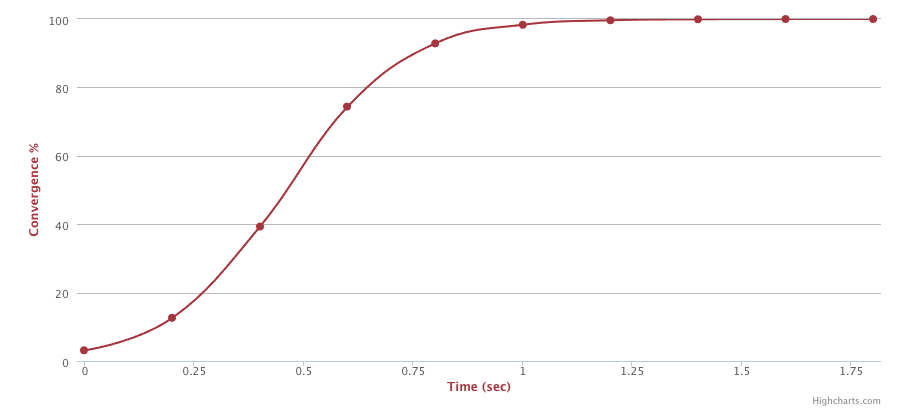

# Protocolos Epidêmicos
Há várias formas de se propagar informação entre nó de um sistema distribuído.
Uma forma particularmente interessante é espelhada no modo como boatos ou doenças se propagam entre um conjunto de indivíduos; este tipo de protocolo é conhecido como ***gossiping*** (fofoca) ou **epidêmico**.

!!!note inline end "Gossiping"
    * Epidemia ou fofoca
    * Multicast
    * Tolerante a falhas
    * Sem entidade central

Algumas características fundamentais dos protocolos epidêmicos os distinguem de outros protocolos e frameworks de comunicação.
Primeiro, estes protocolos resolvem um problema de ***multicast*** de mensagens, isto é, de comunicação um para muitos, em oposição ao ***unicast*** das conexões TCP ou às invocações remotas do RPC.

Segundo, não há a figura de uma entidade coordenadora, como os *brokers* nas filas de mensagens e sistemas pubsub.

Finalmente, a entrega de mensagens é garantida probabilísticamente, o que quer dizer que quando uma mensagem é enviada, há uma probabilidade dela ser entregue pelos demais processos, mas não há garantias de que o mesmo acontecerá.
A despeito do que isso possa dar entender, estes protocolos podem ser configurados para uma taxa de entrega tão alta quanto se queira e funcionam muito bem em redes não confiáveis, isto é, onde há perda de mensagens individuais.

Na prática, estes protocolos são usados na descoberta de nó em um sistema distribuído, para propagar informações sobre seus estados individuais e para computar informações globais.

## Algoritmo
Imagine uma pessoa contaminada por um vírus; a medida que o tempo passa, esta pessoa tem contato com outras pessoas que, com certa probabilidade, se tornam também infectadas.
Cada novo infectado passa a propagar o vírus nos seus contatos e, assim, depois de alguns ciclos, toda a população é infectada.
Nós podemos então modelar estes protocolos com o seguinte algoritmo básico, que executa em rodadas.

!!!example "Algoritmo básico"
    * A cada rodada
        * para cada nó $p$ infectado com o vírus $v$
            * escolha $F$ outros processos, $\{p_1,p_2,p_3,...,p_f\}, p_i \neq p$, aleatoriamente
                * para cada $p_i$, contamine $p_i$ com $v$

Agora vamos dissecar este algoritmo.

###### Rodadas
Em primeiro lugar, por quê a execução em rodadas em vez de propagar imediatamente qualquer nova informação que receber?
Há muitos vírus por aí, ou melhor dizendo, muitas informações a serem propagadas, e portanto faz sentido ter intervalos entre as propagações para permitir que um conjunto de novos dados seja consolidado para aproveitar cada interação para passar um pacote já consolidado de dados adiante. 
Dito isso, cada ciclo pode ser feito arbitrariamente curto, acelerando a dispersão das informações.
Além disso, na prática cada nó executa as suas rodadas independentemente dos outros, mas sincronizar os ciclos facilita a análise dos algoritmos.

###### Fanout
Em segundo lugar, por quê limitar as interações em cada ciclo a $F$?
O objetivo deste tipo de algoritmo é escalar para centenas, milhares ou até milhões de processos. 
Logo, é preciso limitar a quantidade de interações a cada ciclo por razões práticas.

Dito isso, podemos ajustar o $F$, conhecido como o ***fanout*** do algoritmo, para cima para acelerar a difusão tanto quanto quisermos.
Considere o caso em que $F=2$; no início do algoritmo, temos 1 processo infectado.
Durante o primeiro ciclo, o processo infectado propaga a informação para outros dois, elevando o número de infectados a 3.
No próximo ciclo, cada um destes infectados infecta outros dois, módulo interações entre nós já infectados e que desperdiçam oportunidades de propagação.
Se imaginarmos estes ciclos como uma árvore em que cada ciclo corresponde a um ciclo, em que os nós contaminados no final do ciclo são os nós da árvore, e que as interações são arestas, temos o seguinte.

!!!note inline end "Ciclos"
    * $n$ nós
    * $F$ fanout
    * $log_F(n)$ ciclos

Depois de $c$ ciclos, teremos $c^F$  nós contaminados ou, de forma inversa, se para contaminar $n$ nós, são necessários $log_F(n)$ ciclos.

!!!note "Gossip Simulator: https://flopezluis.github.io/gossip-simulator/"
    * Escolha a quantidade de ***nodes*** e um ***fanout***. Clique em um dos nós para infectá-lo e clique ***play*** para animar.

    <iframe src="https://flopezluis.github.io/gossip-simulator/" frameborder="0" width="960" height="569" allowfullscreen="true" mozallowfullscreen="true" webkitallowfullscreen="true"></iframe>

###### Push x Pull

!!!note inline end "Push x Pull"
    * Push $\rightarrow$
    * Pull $\leftarrow$
    * Push/Pull $\leftrightarrow$

Alguns aspectos do algoritmo básico podem ser alterados, como a decisão sobre quais nós contatam quais nós e como a informação flui na comunicação.
No algoritmo básico, somente nós infectados contatam outros nós para então fazer um ***push*** do vírus.
Para acelerar a propagação, processos saudáveis podem tentar se infectar contactando outros nós e fazendo um ***pull*** dos vírus presentes no outro.
Ou, como é frequentemente verdade, a melhor abordagem pode ser um misto das duas anteriores, isto é, uma em que todos os nós são ativos em causar contatos e a propagação da informação acontece nos dois sentidos, isto é, ***push/pull***, o que faz mais sentido em um ambiente com múltiplos vírus circulando.

###### Múltiplos vírus
Em um sistema real, a cada momento diversas informações distintas devem estar sendo propagadas, o que é equivalente a ter múltiplos vírus circulando na mesma população.
Por exemplo, cada processo pode gerar periodicamente um resumo da carga de trabalho com a qual está lidando (taxa de escrita em disco, taxa de utilização de CPU, etc) e propagar este resumo para todo o sistema, para ser usado como entrada em uma política de balanceamento de carga.

Assim, um modelo comum de representação dos dados em cada nó é um mapa, um banco de dados **chave/valor**, onde a chave é um identificador único da informação e o valor é dado em si, por exemplo ("ABCD1234_CPU%","90%").
A cada contato, um nó faz um *pull* das entradas cujas chaves desconhece e um *push* das que a contraparte não conhece.

###### Fofoca antiga
Uma razão para protocolos epidêmicos serem também chamados de ***gossiping*** é o fato de que informações envelhecem e devem parar de ser propagadas quando deixam de ser relevantes.
Algumas estratégias se complementam para implementar este comportamento.

* **Frescor da informação**: se cada nó registra o instante em que primeiro recebeu uma informação, pode então determinar um limiar de tempo dentro do qual repassará a informação em seus contatos. Depois deste tempo a informação não mais se propaga pois não é mais uma "fofoca quente" ou porquê o nó deixou de ser "contagioso" para aquele vírus.
* **Coleta de lixo**: para restringir a quantidade de espaço usado pelo nó, informações muito antigas devem ser esquecidas em algum momento. Este processo pode ser gradual, por exemplo excluindo os dados após algum tempo, mas mantendo as chaves, efetivamente tornando o nó não infectado mas **imune** ao vírus. Mesmo que as chaves sejam armazenadas de forma eficiente, por exemplo via uso de [**filtros de bloom**](), elas devem ser completamente esquecidas em algum momento, a partir do qual uma reinfecção é possível já que uma nova exposição seria indistinguível da exposição inicial.

###### Versões
Em certas aplicações, como a propagação da carga de trabalho de um processo, faz sentido que as informações sejam atualizadas. Por exemplo, mesmo que a informação sobre a carga de trabalho do processo às 10:00hs ainda esteja sendo propagada, se a carga às 10:01hs se torna conhecida, pode não ser mais necessário propagar a anterior.
Este mecanismo pode se implementado facilmente estendendo-se o par (identificador,valor) para uma tripla (identificador,*timestamp*/versão,valor), onde *timestamp*/versão pode ser o valor do relógio quando a informação foi gerada ou simplesmente um contador incrementado a cada geração.

###### Pontos negativos
Obviamente nem tudo são flores no uso destes protocolos e algumas desvantagens devem ser destacadas.

* Velocidade: dado a escolha aleatória das infecções, à medida que o número de infectados aumenta, mais e mais contatos não levam a mais infecções, desacelerando a propagação para outros nós. Por outro lado, com tantos infectados, em algum momento os não infectados acabaram tendo "azar".

    !!!note "Convergence Simulator: https://www.serf.io/docs/internals/simulator.html"
        Este simulador do Serf permite ver o quão rápido a informação atinge qual percentagem dos nós do sistema; no exemplo, após 0,5s, 50% dos 30 nós estavam infectados.

        

        No sítio é possível ajustar o número de nós, duração da rodada, perda de pacotes e nós defeituosos.

* Depuração: devido à imprevisibilidade da comunicação, é difícil reproduzir execuções do protocolo e depurar no caso de comportamentos estranhos.
* Descoberta inicial: encontros entre nós só são possíveis se estes já se conhecerem, o que implica que de alguma forma os nós precisam ser inicializados para se contactarem ao sistema. Isto é normalmente feito usando-se uma lista de nós **semente**, com grande probabilidade de estar presentes no sistema, o que enfraquece a premissa de falta de entidades coordenadoras.

## Exemplos
Protocolos epidêmicos são amplamente usados na indústria, com diferentes aplicações na indústria, desde replicação de bancos de dados sem requisitos de consistência forte, quando na descoberta de processos e detecção de defeitos em *clusters*, quanto em outras aplicações de disseminação de informação.

* CassandraDB: O Cassandra é um banco de dados peer-2-peer em que nós entram e saem do sistema e por isso podem não estar presentes para armazenar dados de sua responsabilidade. 
Quando um nó do sistema volta a ficar online, *gossiping* é usado para identificar e propagar os dados para as réplicas devidas.
* [Serf](https://www.serf.io/): Este sistema de gerenciamento de clusters usa *gossiping* para descobrir nós, detectar se estão funcionais ou não, ou mesmo propagar perguntas e respostas aos nós do sistema, por exemplo "quanto espaço em disco você tem livre?"

