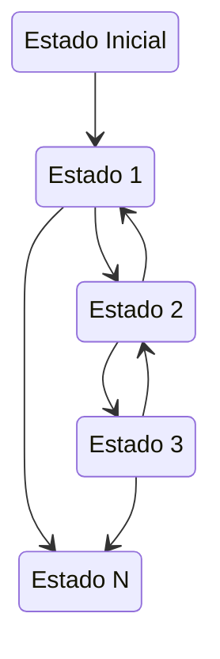

# Comunicação

O desenvolvimento de sistemas distribuídos usando diretamente Sockets como forma de comunicação entre componentes não é para os fracos de coração.
Sua grande vantagem está no **acesso baixo nível à rede**, e todo o ganho de desempenho que isso pode trazer.
Suas desvantagens, entretanto, são várias:

* interface de "arquivo" para se ler e escrever bytes;
* controle de fluxo de "objetos" é por conta da aplicação, isto é, a aplicação precisa sinalizar quantos bytes serão escritos de um lado, para que o outro saiba quanto ler para obter um "objeto" correto;
* logo, a serialização e desserialização de objetos é também por conta da aplicação;
* tratamento de desconexões e eventuais reconexões também é gerenciado pela aplicação e nem a tão famosa confiabilidade do TCP ajuda.

Enquanto se poderia argumentar que algumas destas desvantagens podem ser descartadas em função da discussão de incluir ou não API na comunicação [fim-a-fim](http://web.mit.edu/Saltzer/www/publications/endtoend/endtoend.pdf), é certo que algumas funcionalidades são ubíquas em aplicações distribuídas.
Aqui discutiremos algumas destas funcionalidades e como podem e são implementadas por *frameworks* de comunicação de mais alto nível.
No mundo dos sistemas distribuídos, estes *frameworks* são conhecidos como ***middleware***.

## Middleware

??? sideslide "Middleware"
    * software
    * hardware/OS
    * aplicação
    * diversas funcionalidades

De acordo com [Tanenbaum & Van Steen](https://www.amazon.com/Distributed-Systems-Principles-Paradigms-Tanenbaum-dp-B00DEKA7T2/dp/B00DEKA7T2/ref=mt_hardcover?_encoding=UTF8&me=&qid=), *middleware* é 
> ... the software layer that lies between the operating system and applications on each side of a distributed computing system in a network.

Isto é, o *middleware* é a camada *ware* que fica no *middle*, entre, o *software* e o *hardware*. 
Software, no caso, é a aplicação distribuída sendo desenvolvida e hardware é a **abstração** do *host* em que se executam os componentes, provida pelo sistema operacional.
Uso aqui o termo **abstração** porquê o sistema operacional pode encapsular *hardware* real, mas também pode encapsular outra abstração de *hardware*, por exemplo, uma máquina virtual ou contêiner.

A figura seguinte   mostra um exemplo com três aplicações executando sobre um *middleware*, que por sua vez é executado sobre diferentes sistemas operacionais, em *hosts*  conectados por uma rede de comunicação. 


{: style="width:500px"}[^0101]

[^0101]: Distributed Systems: Principles and Paradigms. Capítulo 1, Figura 1.

Com este cenário em mente, é importante entender o que diz [Sacha Krakowiak](https://web.archive.org/web/20050507151935/http://middleware.objectweb.org/) quando afirma que as principais funções do *middleware* são:

* esconder a distribuição e o fato de que um aplicação é geralmente composta por múltiplas partes, executando em localizações geograficamente distintas,
* esconder a heterogeneidade dos vários componentes de hardware, sistemas operacionais e protocolos de comunicação
* prover interfaces uniformes, de alto nível e padronizadas para os desenvolvedores de aplicação e integradores, de forma que aplicações possam ser facilmente compostas, reusadas, portadas e feitas interoperáveis.


Assim, os *middleware* facilitam a conexão entre componentes e permitem o uso de protocolos mais abstratos que as operações de  `write(byte[])` e `read(): byte[]` dos protocolos de baixo nível, escondendo a complexidade da coordenação de sistemas independentes.
Desenvolver sistemas distribuídos sem usar um *middleware* é como desenvolver um aplicativo sem usar quaisquer bibliotecas: possível, mas complicado, e estará certamente reinventando a roda. Isto é, você praticamente tem que refazer o *middleware* antes de desenvolver o sistema em si.

Idealmente, com o *middleware*, o desenvolvedor conseguiria facilmente implementar uma aplicação em que a distribuição fosse totalmente transparente, levando o sistema, uma coleção de sistemas computacionais (software ou hardware) independentes, a se apresentar para o usuário como **um sistema único**, monolítico.
Pense no browser e na WWW, por exemplo: o quanto você sabe sobre as páginas estarem particionadas em milhões de servidores? Isso é o que chamamos de **transparência**.

#### Transparência

??? sideslide "Transparência Total"
    Acesso + Localização + Relocação + Migração + Replicação + Falha

Se não há qualquer indício de que a aplicação é distribuída, então temos **transparência total**.  
Podemos quebrar esta transparência total em várias transparências mais simples: **Acesso**, **Localização**, **Relocação**,
**Migração**, **Replicação**, e **Falha**.
Vejamos cada uma destas separadamente.

##### Transparência de Acesso

??? sideslide "Transparência de Acesso"
    * como se apresenta
    * representação de dados
        * arquitetura
        * OS
        * linguagem
    * padrões abertos e bem conhecidos.

A transparência de acesso diz respeito à representação de dados e mecanismos de invocação (arquitetura, formatos, linguagens...).
Cada computador tem uma arquitetura e uma forma de representar seus dados. Por exemplo, considere os padrões para representação de números em ponto flutuante IEEE e IBM. Ambos dividem os bits em sinal, expoente e mantissa, mas com tamanhos diferentes.

!!!note "IEEE[^IEEEFP]"

     Precisão | Tamanho total (bits) | Sinal (bits) | Expoente (bits) | Mantissa (bits)
    :--------:|:--------------------:|:------------:|:---------------:|:--------------:
     Half | 16 | 1 | 5 | 10 
     Single | 32 | 1 | 8 | 23
     Double | 64 | 1 | 11 | 52
     Quadruple | 128 | 1 | 15 | 112

!!! note "IBM[^IBMFP]"

     Precisão | Tamanho total (bits) | Sinal (bits) | Expoente (bits) | Mantissa (bits)
    :--------:|:--------------------:|:------------:|:---------------:|:--------------:
     Single | 32 | 1 | 7 | 24
     Double | 64 | 1 | 7 | 56
     Quadruple | 128 | 1 | 7 | 112 (8b ignorados)

[^IEEEFP]: [IEEE Floating Point](https://www.tutorialspoint.com/fixed-point-and-floating-point-number-representations)
[^IBMFP]: [IBM Floating Point](https://en.wikipedia.org/wiki/IBM_hexadecimal_floating_point#Single-precision_32-bit)

E se dois componentes de um SD executam em máquinas com arquiteturas diferentes, como trocam números em ponto flutuante?
É preciso que usem um padrão conhecido por ambos os *hosts*, seja o padrão a arquitetura "nativa" do host ou um padrão intermediário, definido pelo *middleware*.

A mesma questão é válida para representações de strings e classes, e diferenças de sistemas operacionais e linguagens.
No caso específico das strings, pense em um programa escrito em linguagem C e que este programa deva comunicar-se com um outro, escrito em Java, e trocar strings com o mesmo.
Enquanto em C uma string é uma sequência de bytes imprimíveis terminadas por um `\0`, em Java uma string é uma classe que encapsula uma sequência de chars, sendo que cada [char é um código 16 bits](https://docs.oracle.com/javase/8/docs/technotes/guides/intl/overview.html) representativo de um código Unicode[^stringjava].
Como transferir strings entre duas plataformas?  Não fazê-lo? Simplificar a string Java?  Estender a string C?  
Para se tentar obter transparência de acesso, é importante que se use **padrões** implementados em múltiplas arquiteturas, **abertos**  e bem conhecidos, com **interfaces bem definidas**.

[^stringjava]: Simplificações são possíveis, mas introduzem outras complexidades.


##### Transparência de Localização

??? sideslide "Transparência de localização"
    * onde está o objeto
    * latência
        * cache
        * paralelismo
        * programação assíncrona
        * arquiteturas reativas

A transparência de localização diz respeito a onde está o objeto acessado pela aplicação, seja um BD, página Web ou serviço de echo: pouco importa ao usuário, se está dentro da mesma máquina de onde executa o acesso, se na sala ao lado ou em um servidor do outro lado do globo, desde que o serviço seja provido de forma rápida e confiável.
A esta transparência é essencial uma boa distribuição do serviço, sobre uma rede com baixa latência, ou o uso de técnicas que permitam esconder a latência.

###### Escondendo a Latência

Para se esconder a latência, várias táticas são utilizáveis:

* *Caching* de dados
    * Em vez de sempre buscar os dados no servidor, mantenha cópias locais dos dados que mudam menos (e.g., o CSS do *stack overflow*).
* Use paralelismo
    * Em vez de validar formulário após preenchimento de cada campo, valide em paralelo enquanto usuário preenche o campo seguinte.
    * Use *callbacks* para indicar campos com problemas a serem corrigidos.
    * Saiba que nem todo problema é paralelizável, por exemplo, autenticação
* Use programação assíncrona
    * AsyncIO
    * C# [await/async](https://docs.microsoft.com/en-us/dotnet/csharp/async)
    * [Futures e Promises](https://en.wikipedia.org/wiki/Futures_and_promises)

Outra forma de diminuir latência é trazer para próximo do usuário parte da computação.
Isto é comumente feito com a interface com usuário,  mas pode ser usado também para outras partes do sistema. 
Como exemplo do primeiro, pense em consoles de video-game que fazem o processamento gráfico pesado de jogos online na casa do usuário[^stadia].
Como exemplo do segundo, pense em aplicativos que mantém os dados em celulares até que uma boa conexão, por exemplo WiFi, esteja disponível para sincronizar com o servidor.

[^stadia]: O [Google stadia](https://stadia.google.com/) é uma plataforma de jogos que vai na contramão desta ideia, levando todo o processamento pesado para a nuvem.

De forma geral, pense em esconder latência pelos seguintes passos:

* Distribua tarefas
  * Delegue computação aos clientes (e.g., JavaScript e Applets Java)
  * Particione dados entre servidores (e.g., Domain Name Service e World Wide Web) para dividir a carga e aumentar a vazão
* Aproxime dados dos clientes
  * Mantenha cópias de dados em múltiplos lugares.
  * Atualize dados de acordo com necessidade (e.g., cache do navegador, com código do google.com sendo atualizado a cada 4 dias)


##### Transparência de Relocação

??? sideslide "Transparência de relocação"
    * como se movimenta
    * visto por clientes

As vezes componentes do sistema distribuído precisam ser movimentados de uma localização à outra, por exemplo porquê um novo *host* foi contratado.
Se implementadas corretamente, as técnicas que entregam transparência de localização não deixam que o cliente perceba a movimentação, no que chamamos transparência de Relocação.

* Rede de baixa latência
* Distribuição inteligente
    * E.g: Serviços de nome
* Múltiplas cópias
    * Cópias temporárias


##### Transparência de Migração

??? sideslide "Transparência de migração"
    * como se movimenta
    * visto por si mesmo

Do ponto de vista do próprio serviço, não perceber que se está sendo movimentado é chamado transparência de Migração.
Um serviço com esta propriedade, não precisa ser parado e reconfigurado quando a mudança acontece.
Uma das formas de se implementar esta propriedade é através da migração provida por máquinas virtuais, usado, por exemplo, para consolidar o uso de servidores em nuvens computacionais.
Veja o exemplo do VMotion da VMware.


Na verdade, a movimentação neste cenário, é uma cópia da máquina virtual. Uma vez que a cópia esteja próxima do fim, a imagem original é congelada, a cópia concluída, e há um chaveamento na rede para se direcionar toda comunicação para nova cópia. O máquina original é então descartada.

##### Transparência de Replicação

??? sideslide "Transparência de replicação"
    * redundância
    * visto por clientes

A capacidade de ter cópias de um serviço e de direcionar trabalho de uma para outra é também útil para se obter transparência no caso de falhas.
Isto porquê para se manter um serviço funcional a despeito de falhas, é preciso ter múltiplas cópias, prontas para funcionar a qualquer momento.

Dependendo das garantias desejadas na manutenção da **consistência** entre as cópias, o custo pode variar muito, de forma que para se ter um custo menor, tem-se garantias mais fracas, por exemplo, que as réplicas tem um **atraso** entre elas de no máximo $X$ minutos. Este é um dilema parecido com o TCP x UDP, em que mais garantias implicam em maior custo de comunicação.

Algumas aplicações toleram inconsistências e podem viver com menores custos. Um exemplo famoso é o dos "carrinhos de compra" da [Amazon.com](https://www.allthingsdistributed.com/2008/12/eventually_consistent.html), que podem fechar pedidos com conteúdo diferente do desejado pelo cliente.

Outras aplicações são normalmente construídas com requisitos de consistência forte entre as réplicas, como sistemas financeiros.
Para estas aplicações, uma técnica importante para se conseguir replicação é o uso de *frameworks* de **comunicação em grupo**, que entregam para múltiplas instâncias de um mesmo serviço, as mesmas mensagens, permitindo que elas se mantenham como cópias.
Esta técnica funciona se os serviços forem máquinas de estado determinísticas, que consideram como eventos as mensagens entregues pelo protocolo de comunicação em grupo e é denominada [**replicação de máquinas de estado**](https://en.wikipedia.org/wiki/State_machine_replication).

??? sideslide "Replicação de Máquina de Estados"
    * determinística
    * mesmo estado inicial
    * mesmos eventos
    * mesmo estado final
    * atraso entre réplicas



??? todo
    Figura com state machine replication

Novamente é preciso chamar à atenção a questão dos custos desta técnica.
Replicação de Máquinas de Estados é muito custosa e por isso faz-se um esforço para não utilizá-la ou para utilizá-la em "cantinhos" do sistema onde inconsistências são absolutamente caras demais para sere permitidas.
Isto porquê manter múltiplas cópias $\Rightarrow$ sincronização $\Rightarrow$ custos. 
Se houver mudanças frequentes nos dados, tal custo precisa ser pago também frequentemente.
Mitigações incluem uso de réplicas temporárias, protocolos de invalidação de cache, contratação de redes com mais largura de banda  e menor latência, sendo que estes últimos esbarram em limitações financeiras e físicas.


##### Transparência de Concorrência

??? sideslide "Transparência de concorrência"
    * obliviedade a outros serviços
    * visto por clientes

Outra transparência almejável é de concorrência, isto é, imperceptibilidade quanto ao fato de que o serviço está executando concorrentemente a outros serviços e sendo acessado por outros clientes.
Isto é importante tanto em termos de segurança, no sentido de que um cliente não deveria acessar os dados do outro, caso isso seja um requisito do sistema, quanto tem termos de desempenho.
Nuvens computacionais são um exemplo de onde este tipo de transparência é essencial.

Considere um serviço de banco de dados em uma nuvem qualquer. Para prover a mesma interface com a qual usuários estão acostumados a anos, é possível que este serviço seja simplesmente um *wrapper* ao redor do SGBD que se comprava e instalava *in-house* anteriormente.
Para se tornar viável, contudo, uma mesma instância deve servir múltiplos clientes, os *tenants*, sem que a carga de trabalho introduzida por um, interfira no desempenho do outro. No meio, chamamos esta propriedade de *multi-tenancy*, mas é apenas um exemplo de transparência de concorrência.

* 


Esta transparência está fundamentalmente ligada à escalabilidade, isto é, à adequação dos *pool* de recursos às demandas dos clientes: se mais clientes estão presentes, então aumente a quantidade de servidores (*scale up*) e separe as cargas (*sharding*); se menos clientes estão presentes, então desligue algumas máquinas (*scale down*) e consolide recursos.

##### Desafios para se obter transparência

Apesar de desejáveis, as transparência discutidas são difíceis de se conseguir, principalmente se em conjunto.
Isto porquê, do **ponto de vista de usuários** espalhados pelo globo, atrás de redes heterogêneas e com possibilidade de erros, acontecerão atrasos e perdas na comunicação, denunciando a distribuição.

Do **ponto de vista do desenvolvedor**, é preciso tomar decisões baseado em premissas ligadas à realidade da rede. Por exemplo, se uma requisição não foi respondida, quanto tempo um cliente deve esperar antes de reenviá-la, possivelmente para outro servidor, sem incorrer em risco significativo da requisição ser processada duas vezes? A resposta para esta pergunta é muito mais complicada do que pode parecer.

**De forma geral**, qualquer aumento de transparência tem um custo, seja em termos monetários (e.g., contratação de enlace dedicado ou de *host* em outra posição geográfica), ou em termos de desempenho (e.g., coordenar a entrega de mensagens em sistemas de comunicação em grupo).

Provavelmente os maiores obstáculos para se alcançar os diversos tipos de  transparência são impostos pela parte da infraestrutura que torna o sistema distribuído possível, a rede.
Para entender o porquê, vejamos algumas premissas normalmente assumidas sobre a rede que não são, definitivamente, verdade:

* A latência é zero.
* A largura de banda é infinita.
* A rede é confiável.
* A rede é segura.
* A rede é homogênea.
* A rede é estática.
* A rede tem acesso grátis.
* A rede é administrada por você ou alguém acessível.


## Representação de dados

Exceto por aplicações muito simples, processos em um sistema distribuído trocam dados complexos, por exemplo estruturas ou classes com diversos campos, incluindo valores numéricos de diversos tipos, strings e vetores de bytes, com diversos níveis de aninhamento e somando vários KB.
Neste cenário, vários fatores precisam ser levados em consideração na hora de colocar esta estrutura *no fio*, como:

* variações de definições de tipos, por exemplo, `inteiro`: 8: 16, 32, ou 64 bits?
* variações na representação de dados complexos: classe x estrutura   
* conjunto de caracteres diferentes: ASCII x UTF
* little endian, como x64 e IA-32, ou  big endian como SPARC (< V9), Motorola e PowerPC? ou aidna, flexível como  ARM,  MIPS ou  IA-64?
* fim de linha com crlf (DOS) x lf (Unix)?
* fragmentação de dados na rede   
  [](http://www.acsa.net/IP/)

### Representação Textual

Uma abordagem comumente usada é a representação em formato textual "amigável a humanos".
Veja o exemplo de como o protocolo HTTP requisita e recebe uma página HTML.
```HTML
telnet www.google.com 80
Trying 187.72.192.217...
Connected to www.google.com.
Escape character is '^]'.
GET / HTTP/1.1
host: www.google.com

```
As linhas 5 e 6 são entradas pelo cliente para requisitar a página raiz do sítio [www.google.com](https://www.google.com).
A linha 7, vazia, indica ao servidor que a requisição está terminada.

Em resposta a esta requisição, o servidor envia o seguinte, em que as primeiras linhas trazem metadados da página requisitada e, após a linha em branco, vem a resposta em HTML à requisição.

```HTML
HTTP/1.1 302 Found
Location: http://www.google.com.br/?gws_rd=cr&ei=HTDqWJ3BDYe-wATs_a3ACA
Cache-Control: private
Content-Type: text/html; charset=UTF-8
P3P: CP="This is not a P3P policy! See https://www.google.com/support/accounts/answer/151657?hl=en for more info."
Date: Sun, 09 Apr 2017 12:59:09 GMT
Server: gws
Content-Length: 262
X-XSS-Protection: 1; mode=block
X-Frame-Options: SAMEORIGIN
Set-Cookie: NID=100=NB_AruuFWL0hXk2-h7VDduHO_UkjAr6RaqgG7VbccTsfLzFfhxEKx21Xpa2EH7IgshgczE9vU4W1TyKsa07wQeuZosl5DbyZluR1ViDRf0C-5lRpd9cCpCD5JXXjy-UE; expires=Mon, 09-Oct-2017 12:59:09 GMT; path=/; domain=.google.com; HttpOnly

<HTML><HEAD><meta http-equiv="content-type" content="text/html;charset=utf-8">
<TITLE>302 Moved</TITLE></HEAD><BODY>
<H1>302 Moved</H1>
The document has moved
<A HREF="http://www.google.com.br/?gws_rd=cr&amp;ei=HTDqWJ3BDYe-wATs_a3ACA">here</A>.
</BODY></HTML>
```

Representações textuais são usadas em diversos protocolos como SMTP, POP, e telnet.
Algumas destas representações seguem padrões formalizados, o que facilita a geração e interpretação dos dados. 
Dois padrões bem conhecidas são XML e JSON.

[XML](https://xml.org) é o acrônimo para *Extensible Markup Language*, ou seja, uma linguagem marcação que pode ser estendida para representar diferentes tipos de informação.
A HTML, por exemplo, é uma instância de XML destinada à representação de hipertexto (A bem da verdade, XML foi uma generalização de HTML).

Por exemplo, para representarmos os dados relativos à uma pessoa, podemos ter uma instância XML assim:

```xml
<person>
    <name>John Doe</name>
    <id>112234556</id>
    <email>jdoe@example.com</email>
    <telephones>
       <telephone type="mobile">123 321 123</telephone>
       <telephone type="home">321 123 321</telephone>
    </telephones>
</person>
```

Uma das grandes vantagens do uso de XML é a possibilidade de se formalizar o que pode ou não estar em um arquivo para um certo domínio utilizando um [XML *Domain Object Model*](https://docs.microsoft.com/pt-br/dotnet/standard/data/xml/xml-document-object-model-dom). Há, por exemplo, modelos para representação de documentos de texto, governos eletrônicos, representação de conhecimento, [etc](http://www.xml.org/).
Sua maior desvantagem é que é muito verborrágico e por vezes complicado de se usar, abrindo alas para o seu mais famoso concorrente, JSON.


[JSON](http://json.org/) é o acrônimo de *Javascript Object Notation*, isto é, o formato para representação de objetos da linguagem Javascript.
Devido à sua simplicidade e versatilidade, entretanto, foi adotado como forma de representação de dados em sistemas desenvolvidos nas mais diferentes linguagens.
O mesmo exemplo visto anteriormente, em XML, é representado em JSON assim:

```json
{
    "name": "John Doe",
    "id": 112234556,
    "email": "jdoe@example.com",
    "telephones": [
        { "type": "mobile", "number": "123 321 123"},
        { "type": "home", "number": "321 123 321"},
    ]
}
```

Em Python, por exemplo, JSON são gerados e interpretados nativamente, sem a necessidade de *frameworks* externos, facilitando seu uso.
Mas de fato, a opção final por XML ou JSON é questão de preferência, uma vez que os dois formatos são, de fato, equivalentes na questão da representação de informação.

Outros formatos, binários, oferecem vantagens no uso de espaço para armazenar e transmitir dados, e por isso são frequentemente usados como forma de *serialização* de dados em sistemas distribuídos, isto é, na transformação de TAD para sequências de bytes que seguirão "no fio".

* ASN.1 (Abstract Syntax Notation), pela ISO
* XDR (eXternal Data Representation)
* Java serialization
* Google Protocol Buffers
* Thrift

ASN.1 e XDR são de interesse histórico, mas não os discutiremos aqui.
Quanto à serialização feita nativamente pelo Java, por meio de `ObjectOutputStreams`, como neste [exemplo](https://www.tutorialspoint.com/java/java_serialization.htm), embora seja tentadora para quem usa Java, é necessário saber que ela é restrita à JVM e que usa muito espaço, embora minimize riscos de uma desserialização para uma classe diferente.

Nos foquemos nas autras alternativas listadas, ProtoBuffers e Thrift, que podem levar a representações binárias e textuais.

### ProtoBuffers

Nas palavras dos [criadores](https://developers.google.com/protocol-buffers/),
> Protocol buffers are a language-neutral, platform-neutral extensible mechanism for serializing structured data.

Por meio de protobuffers, é possível estruturar dados e gerar o código correspondente em diversas linguagens, for forma compartilhável entre as mesmas. Veja o exemplo a seguir, que especifica os dados referentes a uma pessoa. 
Observe a presença de campos de preenchimento opcional (**optional**), de enumerações (**enum**), e de coleções (**repeated**).

```protobuf
message Person {
	required string name = 1;
	required int32 id = 2;
	optional string email = 3;
	enum PhoneType {
		MOBILE = 0;
		HOME = 1;
		WORK = 2;
	}
	message PhoneNumber {
		required string number = 1;
		optional PhoneType type = 2 [default = HOME];
	}
	repeated PhoneNumber phone = 4;
}
```

Com tal definição é possível gerar código como o seguinte, em C++, que serializa os dados para escrita em um arquivo...

```c++
Person person;
person.set_name("John Doe");
person.set_id(1234);
person.set_email("jdoe@example.com");
fstream output("myfile", ios::out | ios::binary);
person.SerializeToOstream(&output);
```

e lê do arquivo e desserializa para hidratar um novo objeto.

```c++
fstream input("myfile", ios::in | ios::binary);
Person person;
person.ParseFromIstream(&input);
cout << "Name: " << person.name() << endl;
cout << "E-mail: " << person.email() << endl;
```

De acordo com *benchmarks* do próprio [projeto](https://developers.google.com/protocol-buffers/docs/overview), a operação em XML seria mais ordens de grandeza mais lenta e ocuparia mais espaço.

> When this message is encoded to the protocol buffer binary format, it would probably be 28 bytes long and take around 100-200 nanoseconds to parse. The XML version is at least 69 bytes if you remove whitespace, and would take around 5,000-10,000 nanoseconds to parse.

### Thrift

??? bug "TODO"
    Thrift como forma de representação de dados: [Thrift type system](https://thrift-tutorial.readthedocs.io/en/latest/thrift-types.html)

## Invocação Remota de Procedimentos - RPC

Em 1984, Birrel e Nelson[^birrel]
introduziram o mecanismo de **Invocação Remota de Procedimentos** (*Remote Procedure Calls*), que permite que processos façam, pasmem, invocações de procedimentos remotos!
Óbvio, a inovação não está na capacidade de uma máquina conversar com outra, mas em como esta conversa acontece, do ponto de vista do programador.
Por exemplo, RPC permita que se procure a *substring* `"teste"` dentro da string apontada por `a`, a partir da posição 3, usando `x = substring(a,3,"teste");`, mas com o invocador da função em um processo e a implementação da função propriamente dita, em outro, possivelmente em outra máquina.

[^birrel]:[Implementing RPC](http://www.birrell.org/andrew/papers/ImplementingRPC.pdf)

### Stubs
Antes de nos aprofundarmos, vejamos como uma invocação de funções acontece normalmente dentro de um único processo[^omissao].
O código `x = substring(a,3,"teste");`, que procura `"teste"` em `*a`, é traduzido nos seguintes passos em linguagem de máquina:
		
[^omissao]: Omitirei alguns detalhes aqui, em nome da generalidade, mas vocês podem recuperá-los em seus livros de Arquitetura de Computadores.

* coloque o endereço de `"teste"` na pilha
* coloque `3` na pilha
* coloque o valor de `a` na pilha
* coloque o endereço de retorno na pilha (junto com outros dados de controle)
* salte para `substring` ajustando o *instruction pointer*
* ... procure substring ...
* coloque o resultado no acumulador
* limpe a pilha
* salte de volta recuperando o endereço de retorno da pilha e ajustando o IP
* coloque resultado em `x`

Se o que queremos é colocar o código da função `substring` em um outro processo e executá-lo como se estivéssemos no mesmo processo que faz a invocação, precisamos pensar em várias questões relativas ao fluxo mostrado acima.
Claramente não podemos usar o mesmo fluxo para invocar uma função, mas precisamos de código de simule a invocação local mas que, por baixo do capô, use sockets para se comunicar com o processo remoto.  
Estq simulação usará código extra, que finge implementar `substring` para o invocador mas delega ao código remoto o trabalho real da busca.
Este código extra é conhecido como **stub**, ou para ser mais preciso, *stub cliente*, que faz parte do processo invocando a operação, e *stub* servidor, que faz parte do processo executando a operação invocada[^skeleton].

[^skeleton]: O *stub* do servidor também é conhecido como *skeleton*.
		
Assim, o cliente invoca função no stub cliente, achando que é a função que quer executar.
Stub cliente faz o **marshaling** [^marshal]  dos parâmetros e usa o SO para transferir os dados via rede para o stub servidor.
Quando recebe a resposta do servidor, o stub cliente retorna a mesma resposta, como se tivesse calculado localmente.

[^marshal]: Marshalling: representar parâmetros de forma própria para transmissão "no fio".

!!! note "Stub cliente"
    Implementa uma função `substring(char*, int, char*)` que

    * abre socket para servidor
    * envia parâmetros
    * especifica função
    * espera resposta
    * retorna resultado

Já o stub servidor fica esperando o contato do cliente.
Quando acontece, faz o "unmarshalling" dos dados, invoca a função localmente na aplicação servidor e pega o resultado, que retona ao cliente.
		
!!!note "Stub servidor"
    * espera conexão
    * recebe parâmetros
    * recebe especificação da função
    * invoca função localmente
    * envia resultado para cliente
	


### Transparência

É para o programador a grande vantagem do uso de RPC, pois se pode escrever código distribuído "igual" ao centralizado, certo? Isto é, **interface baseada em procedimentos** e sem a necessidade de detalhar **portas, sockets, e representação de dados**.  Ou seja, tudo é transparente!
Como já discutimos, vários fatores trabalham contra a [transparência em sistemas distribuídos](../intro/#transparencia).
Em específico quanto à transparência dada pelo RPC, também temos limitações.
O problema é que há uma distinção clara em pelo menos dois processos e se pensarmos no código descrito acima, temos que entender que 

* processos independentes não compartilham um espaço de endereçamento, e
* processos independentes não compartilham uma pilha.

Assim, como fica a **passagem de parâmetro por referência**, uma vez que o stub servidor não pode usar endereços do espaço de endereçamento do cliente?
Algumas abordagens para simular a passagem por referência são possíveis. Por exemplo, **o valor apontado pelo ponteiro é passado para o servidor**, que armazena o valor e alguma posição de memória e passa o endereço de tal posição para a função invocada.
Contudo, a modificação do valor pela função não reflete imediatamente no invocador; tais valores tem que ser copiados novamente e usados para sobrescrever o valor original no cliente.
Além disso, esta abordagem só é possível se o valor apontado for delimitado, o que nem sempre é fácil de determinar. 
Por exemplo, se o ponteiro for para o primeiro elemento de uma lista, o que deve ser copiado para o servidor? Só o primeiro elemento? Toda a lista? Como ensinar para o *framework* RPC o que é "toda" a lista?

Java "resolve" o problema da passagem de parâmetro por referência passando todo o grafo do objeto passado como parâmetro para o servidor. Isto é, além de serializar o objeto apontado no parâmetro, se o mesmo aponta para outros objetos, estes também serão serializados e transferidos; o servidor irá então reconstruir todo o grafo e passar para o método sendo invocado.
É muito fácil ver que esta abordagem pode se tornar inviável rapidamente. Quando for o caso, Java permite marcar objetos como **remotos** e, em vez de serializar este objeto e enviar para o servidor, envia informação suficiente para que o servidor possa invocar métodos em tal objeto no cliente, tornando nebulosa a definição de quem é quem.

Outros fatores também trabalham contra a transparência para o desenvolvedor. Vejamos alguns

#### Descoberta de Serviços
Por exemplo, mesmo que o socket seja ocultado, ele ainda existe e precisa de informações sobre **onde se conectar** (endereço e porta), que de alguma forma deve ser passada para o framework de RPC.
Esta informação pode ser configurada *a priori* por um administrador de sistemas, mas requer atualizações sempre que a localização do serviço for alterada ou novos servidores adicionados.
Mais interessante seria um mecanismo que permitisse uma indireção para o serviço; o próprio DNS pode ser uma opção inicial, mas um serviço dedicado pode ser mais apropriado, pois permite descobrir serviços e não apenas servidores.

Birrel e Nelson propuseram um serviço de **Páginas Amarelas**, no qual clientes podem questionar quem oferece um certo serviço e serem redirecionados automaticamente.
Esta abordagem tem seus próprios problemas, como por exemplo determinar **quem administra** o serviço para incluir novos servidores.
E como determinar qual serviço acessar, caso hajam **múltiplas opções de servidores**.

Apesar dos problemas, **páginas amarelas** foram usadas em abordagens muito mais recentes para descobertas de serviços, por exemplo [Web Services Discovery](https://en.wikipedia.org/wiki/Web_Services_Discovery), que permite a descoberta de Web Services em escala global, e [Java Remote Object Registry](https://docs.oracle.com/javase/7/docs/technotes/tools/solaris/rmiregistry.html) que permite a descoberta de objetos remotos Java.

#### Tratamento de Exceções

Uma vez que a invocação é remota, há sempre o risco de problemas de comunicação entre cliente e servidor.
Logo, é necessária a introdução de código para tratamento de erros deste tipo, o que absolutamente não era necessário no caso do código centralizado.
Assim, o que era um simples `x = substring(a,3,"teste");` passa para algo assim (em uma linguagem fictícia):

```c
int x = -2;
try {
    x = substring(a,3,"teste");`
} catch(CommunicationFailureException cfe) {
    log_error("Como pode substring falhar? Desespero!!!");
}

if (x == -2)
    system_exit(-2)
else if (x == -1)
    //não achou
else
    //achou "teste" na posição x
```

O que nos leva novamente ao ponto sobre não haver transparência total em sistemas distribuídos... e esta falta de transparência pode ser muito mais complicada do que simplesmente adicionar try e catch ao seu código.

Mais que isso, imagine que a operação sendo executada altere algum estado no servidor.
Se esta fosse uma operacão local, cada invocação da operação corresponderia a exatamente uma execução da operação, na ausência de falhas.
No caso de falhas, se o processo quebra como um todo, no seu reinício, pode-se identificar se a operação foi ou não executada e aplicar ações corretivas.
Mas e no caso remoto?

#### Reexecuções

No caso da operação distribuída, se o servidor quebra, isso levará a um erro ser percebido do lado do cliente como uma **falha na conexão**.
Se o cliente havia invocado uma operação mas percebeu o erro antes de receber uma confirmação de sua execução, isto pode indicar que:

* (i) ou a requisição nunca foi recebida pelo servidor e, portanto, não foi executada,
* (ii) ou a execução foi recebida e executada, mas a resposta não foi enviada.

O cliente tem que tratar o erro, mas como?
Se a operação **precisa** ser executada **a qualquer custo**, o cliente pode retentá-la quando conseguir novo contato com o servidor (ou mesmo com outro).
Neste caso, se o que de fato aconteceu foi a situação (i), então retentar garantirá que a operação seja executada pelo servidor, mesmo que várias tentativas sejam necessárias.
Contudo, se o que o ocorreu foi a situação (ii), então reenviar a operação levará a mesma a ser executada múltiplas vezes, o que pode ou não ser ok.
Esta abordagem é garantirá que a execução acontece **pelo menos 1 vez**.

Imagine que a operação se tratasse de uma transferência de saldo, ou a encomenda de de um caminhão carregado de algum produto caro. Neste caso, reexecutar não parece ser uma opção.
Neste caso, talvez a melhor opção seja não retentar a operação, o que levará a zero execuções na situação (ii) e uma execução na situação, ou seja, a **no máximo uma** execução.
Uma situação em que esta abordagem é claramente preferível é a entrega de quadros em um *stream* de vídeo ou áudio, devido à importância da operação ser atrelada ao momento de sua execução.

Nenhuma destas abordagens é igual ao que é garantido na versão centralizada e que é provelmente o que todo desenvolvedor desejaria para suas invocações de métodos, que fossem executados **exatamente uma** vez.
Garantir esta semântica na comunicação é muito difícil, pois é impossível ter certeza de que uma mensagem não foi processada pelo servidor ainda.
De fato, é impossível ter certeza se o servidor falhou; pode ter sido apenas uma falha na comunicação.


!!! note "Quantidade de execuções"
    * No máximo uma - não retentar
    * Exatamente uma - impedir que falhas aconteçam :/
    * Pelo menos uma - retentar até ter confirmação

Como é impossível evitar falhas, se uma operação deve executada, ela deve ser retentada. 
Mas ela não pode ser repetida, então a alternativa é tornar as operações [**idempotentes**](https://en.wikipedia.org/wiki/Idempotence), o que quer dizer que o efeito desejado é alcançado pela primeira execução e que execuções seguintes não alteram o estado.

!!! note "Operações idempotentes"
    Múltiplas execuções tem o mesmo efeito uma execução.

    * Exemplo: `x = 10`
    * Anti-exemplo:  `x = x+1`.


Infelizmente não é trivial programar para idempotência, principalmente se o servidor for acessado concorrentemente por múltiplos clientes, tornando seu estado uam região crítica.

#### Concorrência no servidor

É importante notar que um servidor não está obrigado a atender requisições de somente um cliente.
Logo, se múltiplos clientes acessam o mesmo servidor, o estado do servidor será "compartilhado" pelos vários clientes e passos são necessários para que o comportamento no acesso deste estado seja coerente com a especificação.

Pense por exemplo em um servidor que conta o número de acessos feitos por clientes.
O incremento do contador deve ser considerado uma região crítica, caso múltiplos threads tratem as requisições dos clientes, o que já vimos ser uma boa idia.
Claro que dificilmente seu servidor seria algo tão simples assim.
Em vez disso, ele provavelmente executará lógicas complicadas, como por exemplo, armazenar o estado de contas bancárias e, neste caso, as funções expostas por RPC incluiríam a operação **transferir saldo de A para B**, o que nos leva a mais um problema interessante, o do risco de reexecuções.

Além disso, o servidor provavelmente suportará diversas operações e por isso deverá identificar qual a operação sendo requisitada.
Isto é feito por um *dispatcher*, que demultiplexa as operações requisitadas; o dispatcher pode, em algumas arquiteturas, ser independente do skeleton em si.

### Interface Definition Language - IDL

Há diversas opções de *frameworks* para RPC, com diferentes características, focos, e garantias.
Alguns são parte da linguagem e outros são implementados como bibliotecas.
Alguns suportam múltiplas linguagens e alguns apenas uma.

!!! note "Suporte a RPC na linguagem"
    * Sem RPC: C, C++, Java < 5.0 (1.5), Python
    * Com RPC: Java, Go, Erlang, Scala, Haskell
    * Ambientes heterogêneos: Thrift, gRPC, Akka, SOAP

Frameworks mais modernos permitem escolher a forma de serialização dos dados, se legível para humanos ou binário, se o transporte é via HTTP ou protocolo mais baixo nível, se os dados trafegam abertamente ou se faz uso de comunicação criptografada (SSL).
Outros permitem escolher semântica de execução entre **no máximo uma** e **pelo menos uma**, e há até quem prometa **exatamente uma**.
Mas todos os **frameworks** tem algumas características em comum e uma delas é o uso de uma **Linguagem de Definição de Interface** (IDL).

Uma [IDL](https://en.wikipedia.org/wiki/Interface_description_language) é a linguagem pela qual desenvolvedor define quais as operações (funções, procedimentos, métodos) serão acessíveis via RPC e quais os seus operandos.
Há várias IDL definidas, para os diversos *frameworks* disponíveis.

A imagem a seguir mostra um exemplo genérico da criação cliente e servidor usando um framework RPC genérico, inclusive o processamento da definição feita em IDL do serviço e a junção deste código gerado ao código escrito pelo desenvolvedor.


O fluxo de processamento é o seguinte:

* Arquivo em IDL é compilado por um compilador IDL e gera diversos arquivos:
    * *stub* cliente - código que implementa a interface, com código para repassar invocações para o servidor.
    * *stub* servidor (*skeleton*) - código que atende a conexões do *stub* cliente e repassa para a implementação própria da função.
    * conversão de dados - código que serializa e deserializa dados para serem trafegados de e para o servidor
    * cabeçalhos - definições da interface na linguagem de desenvolvimento da aplicação; se linguagem C, por exemplo, estes serão arquivos `.h`, se em Java, então estes serão arquivos`.java`, com definição de `interface`.
* O código cliente é compilado e gera o cliente, que deve 
    * inicializar a infraestrutura RPC
        * Tipo de transporte
        * SSL?
        * Localizar servidor
    * Lidar com falhas
* O código servidor é compilado e gera o servidor, que deve
    * exportar e localizar serviços (serviço de nomeação)
    * Gerenciamento de portas
    * Conexões

Mas para entendermos melhor o fluxo, vejamos algumas ferramentas reais.

### Estudo de Caso RPC: gRPC

gRPC é um framework para invocação remota de procedimentos multi-linguagem e sistema operacional, usando internamente pelo Google há vários anos para implementar sua arquitetura de micro-serviços.
Inicialmente desenvolvido pelo Google, o gRPC é hoje de código livre encubado pela Cloud Native Computing Foundation.

O sítio [gRPC.io](https://grpc.io) documenta muito bem o gRPC, inclusive os [princípios](https://grpc.io/blog/principles/) que nortearam seu projeto.

O seu uso segue, em linhas gerais, o modelo discutido nas seções anteriores, isto é, inicia-se pela definição de estruturas de dados e serviços, "compila-se" a definição para gerar stubs na linguagem desejada, e compila-se os stubs juntamente com os códigos cliente e servidor para gerar os binários correspondentes.
Vejamos a seguir um tutorial passo a passo, em Java, baseado no [quickstart guide](https://grpc.io/docs/quickstart/java.html).

#### Instalação

Os procedimentos de instalação dependem da linguagem em que pretende usar o gRPC, tanto para cliente quanto para servidor.
No caso do **Java**, **não há instalação propriamente dita**.

#### Exemplo Java

Observe que o repositório base apontado no tutorial serve de exemplo para diversas linguagens e diversos serviços, então sua estrutura é meio complicada. Nós nos focaremos aqui no exemplo mais simples, uma espécie de "hello word" do RPC.

##### Pegando o código

Para usar os exemplos, você precisa clonar o repositório com o tutorial, usando o comando a seguir.

```bash
git clone -b v1.33.0 https://github.com/grpc/grpc-java
```

Uma vez clonado, entre na pasta de exemplo do Java e certifique-se que está na versão 1.33, usada neste tutorial.

```bash
cd grpc-java\examples
git checkout v1.33.0
```

##### Compilando e executando

O projeto usa [gradle](https://gradle.org/) para gerenciar as dependências. Para, use o *wrapper* do gradle como se segue.

```bash
./gradlew installDist
```

Caso esteja na UFU, coloque também informação sobre o proxy no comando.

```bash
./gradlew -Dhttp.proxyHost=proxy.ufu.br -Dhttp.proxyPort=3128 -Dhttps.proxyHost=proxy.ufu.br -Dhttps.proxyPort=3128 installDist
```

Como quando usamos sockets diretamente, para usar o serviço definido neste exemplo, primeiros temos que executar o servidor.

```bash
./build/install/examples/bin/hello-world-server
```

Agora, em **um terminal distinto** e a partir da mesma localização, execute o cliente, quantas vezes quiser.

```bash
./build/install/examples/bin/hello-world-client
```

##### O serviço

O exemplo não é muito excitante, pois tudo o que o serviço faz é enviar uma saudação aos clientes.
O serviço é definido no seguinte arquivo `.proto`, localizado em `./src/main/proto/helloworld.proto`.

```protobuffer
message HelloRequest {
  string name = 1;
}

message HelloReply {
  string message = 1;
}


// The greeting service definition.
service Greeter {
  rpc SayHello (HelloRequest) returns (HelloReply) {}
}
```

No arquivo, inicialmente são definidas duas mensagens, usadas como requisição (cliente para servidor) e outra como resposta (servidor para cliente) do serviço definido em seguida.

A mensagem `HelloRequest` tem apenas um campo denominado `name`, do tipo `string`. Esta mensagem conterá o nome do cliente, usado na resposta gerada pelo servidor.

A mensagem `HelloReply` também tem um campo do tipo `string`, denominado `message`, que conterá a resposta do servidor.

O serviço disponível é definido pela palavra chave `service`e de nome `Greeter`; é importante entender que este nome será usado em todo o código gerado pelo compilador gRPC e que se for mudado, todas as referências ao código gerado devem ser atualizadas.

O serviço possui apenas uma operação, `SayHello`, que recebe como entrada uma mensagem `HelloRequest` e gera como resposta uma mensagem `HelloReply`.
Caso a operação precisasse de mais do que o conteúdo de `name` para executar, a mensagem `HelloRequest` deveria ser estendida, pois não há passar mais de uma mensagem para a operação.
Por outro lado, embora seja possível passar zero mensagens, esta não é uma prática recomendada.
Isto porquê caso o serviço precisasse ser modificado no futuro, embora seja possível estender uma mensagem, não é possível modificar a assinatura do serviço. 
Assim, caso não haja a necessidade de se passar qualquer informação para a operação, recomenda-se que seja usada uma mensagem de entrada vazia, que poderia ser estendida no futuro.
O mesmo se aplica ao resultado da operação.

Observe também que embora o serviço de exemplo tenha apenas uma operação, poderia ter múltiplas.
Por exemplo, para definir uma versão em português da operação `SayHello`, podemos fazer da seguinte forma.

```protobuf
message HelloRequest {
  string name = 1;
}

message HelloReply {
  string message = 1;
}

message OlaRequest {     // <<<<<====
  string name = 1;
}

message OlaReply {       // <<<<<====
  string message = 1;
}

service Greeter {
  rpc SayHello (HelloRequest) returns (HelloReply) {}
  rpc DigaOla (OlaRequest) returns (OlaReply) {}// <<<<<====
}
...
```

Observe que a nova operação recebe como entrada  mensagens `OlaRequest` e `OlaReply`, que tem definições exatamente iguais a `HellorRequest` e `HelloReply`.
Logo, em vez de definir novas mensagens, poderíamos ter usado as já definidas. Novamente, esta não é uma boa prática, pois caso fosse necessário evoluir uma das operações para atender a novos requisitos e estender suas mensagens, não será necessário tocar o restante do serviço.
Apenas reforçando, é boa prática definir *requests* e *responses* para cada método, a não ser que não haja dúvida de que serão para sempre iguais.


##### Implementando um serviço

Agora modifique o arquivo `.proto` como acima, para incluir a operação `DigaOla`, recompile e reexecute o serviço.
Não dá certo, não é mesmo? Isto porquê você adicionou a definição de uma nova operação, mas não incluiu o código para implementá-la.
Façamos então a modificação do código, começando por `./src/main/java/io/grpc/examples/helloworld/HelloWorldServer.java`.
Este arquivo define a classe que **implementa** o serviço `Greeter`, `GreeterImpl`, com um método para cada uma das operações definidas. 
Para confirmar, procure por `sayHello`para encontrar a implementação de `SayHello`; observe que a diferença do `casing` vem das boas práticas de Java, de definir métodos e variáveis em *Camel casing*.

Para que sua versão estendida do serviço `Greeter` funcione, defina um método correspondendo à `DigaOla`, sem consultar o código exemplo abaixo, mas usando o código de `sayHello` como base; não se importe por enquanto com os métodos sendo invocados.
Note que os `...` indicam que parte do código, que não sofreu modificações, foi omitido.

```java
...
private class GreeterImpl extends GreeterGrpc.GreeterImplBase {
...

  @Override
  public void sayHello(HelloRequest req, StreamObserver<HelloReply> responseObserver) {
      ...
  }

  @Override
  public void digaOla(OlaRequest req, StreamObserver<OlaReply> responseObserver) {
    OlaReply reply = 
      OlaReply.newBuilder().setMessage("Ola " + req.getName()).build();
    responseObserver.onNext(reply);
    responseObserver.onCompleted();
  }
}
```

Se você recompilar e reexecutar o código, não perceberá qualquer mudança na saída do programa. Isto porquê embora tenha definido um novo serviço, você não o utilizou. Para tanto, agora modifique o cliente, em `src/main/java/io/grpc/examples/helloworld/HelloWorldClient.java`, novamente se baseando no código existente e não se preocupando com "detalhes".

```java
public void greet(String name) {
  logger.info("Will try to greet " + name + " ...");
...
  OlaRequest request2 = OlaRequest.newBuilder().setName(name).build();
  OlaReply response2;
  try {
    response2 = blockingStub.digaOla(request2);
  } catch (StatusRuntimeException e) {
    logger.log(Level.WARNING, "RPC failed: {0}", e.getStatus());
   return;
  }
  logger.info("Greeting: " + response2.getMessage());
}
```

Agora sim, você pode reexecutar cliente e servidor.

```bash
./gradlew installDist
./build/install/examples/bin/hello-world-server &
./build/install/examples/bin/hello-world-client
```

Percebeu como foi fácil adicionar uma operação ao serviço? Agora nos foquemos nos detalhes.

##### Stub do servidor

* Como criar o servidor
* Como definir o serviço
* Como "startar" o servidor.

##### Stub do cliente

* Stub bloqueante
* Stub não bloqueante

##### IDL gRPC

Outras características da IDL do gRPC

* Tipos básicos
    * bool: boolean (true/false)
    * double: 64-bit; ponto-flutuante 
    * float: 32-bit; ponto-flutuante 
    * i32: 32-bit; inteiro sinalizado 
    * i64: 64-bit; inteiro sinalizado
    * siXX: signed
    * uiXX: unsigned
    * sfixedXX: codificação de tamanho fixo
    * bytes: 8-bit; inteiro sinalizado
    * string: string UTF-8 ou ASCII 7-bit
    * Any: tipo indefinido
* [Diferentes traduções](https://developers.google.com/protocol-buffers/docs/proto3)
* Coleções
Defina e implemente uma operação `DigaOlas` em que uma lista de nomes é enviada ao servidor e tal que o servidor responda com uma longa string cumprimentando todos os nomes, um ap;os o outro.

* *Streams*
    - Do lado do servidor   
    ```java
    List<String> listOfHi = Arrays.asList("e aih", "ola", "ciao", "bao", "howdy", "s'up");

    @Override
    public void digaOlas(OlaRequest req, StreamObserver<OlaReply> responseObserver) {
    for (String hi: listOfHi)
    {
      OlaReply reply = OlaReply.newBuilder().setMessage(hi + ", " req.getName()).build();
      responseObserver.onNext(reply);
    }
    responseObserver.onCompleted();
    }
    ```   
    - Do lado do cliente   
     ```java
     OlaRequest request = OlaRequest.newBuilder().setName(name).build();
     try {
        Iterator<OlaReply> it = blockingStub.digaOlas(request);
        while (it.hasNext()){
          OlaReply response = it.next();
          logger.info("Greeting: " + response.getMessage());
        }
     } catch (StatusRuntimeException e) {
        logger.log(Level.WARNING, "RPC failed: {0}", e.getStatus());
        return;
     }
     ```

##### Exemplo Python

```bash
apt-get install python3
apt-get install python3-pip
python3 -m pip install --upgrade pip
python3 -m pip install grpcio
python3 -m pip install grpcio-tools

git clone -b v1.10.x https://github.com/grpc/grpc
cd grpc/examples/python/helloworld
python3 greeter\_server.py
python3 greeter\_client.py
```

Para recompilar os stubs, faça

```bash
python3 -m grpc_tools.protoc -I../../protos --python_out=. --grpc_python_out=. ../../protos/helloworld.proto
```

Modifique o servidor

```Python
def DigaOla(self, request, context):
	return helloworld_pb2.OlaReply(message='Ola, %s!' + request.name)
```

Modifique o cliente

```Python
response = stub.DigaOla(helloworld_pb2.OlaRequest(name='zelelele'))
print("Greeter client received: " + response.message)
```

### Estudo de Caso RPC: Thrift

[Thrift](https://thrift.apache.org/)

#### Instalação

* [Baixe](http://www.apache.org/dyn/closer.cgi?path=/thrift/0.13.0/thrift-0.13.0.tar.gz) e compile o thrift
* ou instale-o usando apt-get, por exemplo. `apt-get install thrift-compiler`
* execute "thrift" na linha de comando.
* Para thrift com Java, também precisarão dos seguintes arquivos
  * [slf4j](http://mvnrepository.com/artifact/org.slf4j/slf4j-api/1.7.21)
  * [libthrift0.13.0.jar](https://mvnrepository.com/artifact/org.apache.thrift/libthrift/0.13.0)
  * coloque-os na pasta `jars`


#### IDL Thrift

*  Tipos básicos
    * bool: boolean (true/false)
    * byte: 8-bit; inteiro sinalizado
	* i16: 16-bit; inteiro sinalizado
	* i32: 32-bit; inteiro sinalizado
	* i64: 64-bit; inteiro sinalizado
	* double: 64-bit; ponto-flutuante 
	* string: string UTF-8
	* binary: sequência de bytes
* Estruturas
```thrift
struct Example {
    1:i32 number,
    2:i64 bigNumber,
    3:double decimals,
    4:string name="thrifty"
}
```	
* Serviços
```thrift
service ChaveValor {
    void set(1:i32 key, 2:string value),
    string get(1:i32 key) throws (1:KeyNotFound knf),
    void delete(1:i32 key)
}
```
* **Não se pode retornar NULL!!!**
* Exceções
```thrift
exception KeyNotFound {
   1:i64 hora r,
   2:string chaveProcurada="thrifty"
}
```
*  Containers
    * List
	* Map
	* Set


Exemplo: chavevalor.thrift

```Thrift
namespace java chavevalor
namespace py chavevalor


exception KeyNotFound
{
}


service ChaveValor
{
    string getKV(1:i32 key) throws (1:KeyNotFound knf),
    bool setKV(1:i32 key, 2:string value),
    void delKV(1:i32 key)
}  
``` 	

Compilação

`thrift --gen java chavevalor.thrift`

`thrift --gen py chavevalor.thrift`

ChaveValorHandler.java
```Java
namespace java chavevalor
namespace py chavevalor


exception KeyNotFound
{
}


service ChaveValor
{
    string getKV(1:i32 key) throws (1:KeyNotFound knf),
    bool setKV(1:i32 key, 2:string value),
    void delKV(1:i32 key)
}  
 	
package chavevalor;

import org.apache.thrift.TException;
import java.util.HashMap;
import chavevalor.*;

public class ChaveValorHandler implements ChaveValor.Iface {
   private HashMap<Integer,String> kv = new HashMap<>();
   @Override
   public String getKV(int key) throws TException {
       if(kv.containsKey(key))
          return kv.get(key);
       else
          throw new KeyNotFound();
   }
   @Override
   public boolean setKV(int key, String valor) throws TException {
       kv.put(key,valor);
       return true;
   }
   @Override
   public void delKV(int key) throws TException {
       kv.remove(key);
   }    
}
```

#### Arquitetura 

* Runtime library -- componentes podem ser selecionados em tempo de execução e implementações podem ser trocadas
* Protocol -- responsável pela serializaçãoo dos dados
    * TBinaryProtocol
	* TJSONProtocol
	* TDebugProtocol
	* ...
* Transport -- I/O no ``fio''
    * TSocket
	* TFramedTransport (non-blocking server)
	* TFileTransport
	* TMemoryTransport
* Processor -- Conecta protocolos de entrada e saída com o \emph{handler}
		
* Handler -- Implementação das operações oferecidas
* Server -- Escuta portas e repassa dados (protocolo) para o processors
    * TSimpleServer
	* TThreadPool
	* TNonBlockingChannel


#### Classpath

```bash
javac  -cp jars/libthrift0.9.3.jar:jars/slf4japi1.7.21.jar:gen-java  -d . *.java 
java -cp jars/libthrift0.9.3.jar:jars/slf4japi1.7.21.jar:gen-java:. chavevalor.ChaveValorServer
java -cp jars/libthrift0.9.3.jar:jars/slf4japi1.7.21.jar:gen-java:. chavevalor.ChaveValorClient	
```

#### Referências

[Tutorial](http://thrift-tutorial.readthedocs.org/en/latest/index.html)


### Estudo de Caso RPC: RMI

??? bug "TODO"
    Como usar RMI.

## Comunicação orientada a Mensagens

??? bug "TODO"
    * [MOM](https://en.wikipedia.org/wiki/Message-oriented_middleware)
    * [Enterprise Message Bus](https://en.wikipedia.org/wiki/Enterprise_service_bus)
    * [To Message Bus or Not: distributed system design](https://www.netlify.com/blog/2017/03/02/to-message-bus-or-not-distributed-systems-design/)

O foco aqui é na descrição da tecnologia, mas não das arquiteturas resultantes, que serão vistas no capítulo seguinte.

## Publish/Subscribe

O padrão *publish/subscribe* (ou *pub/sub*) se apresenta como uma alternativa à arquitetura cliente-servidor.
Enquanto no modelo client-servidor, o cliente se comunica diretamente com um *endpoint* representado pelo servidor, no padrão *pub/sub* temos clientes que enviam mensagens, ou *publishers*, e clientes que recebem as mensagens, ou *subscribers*. Esses dois tipos de clientes nunca se comunicam diretamente e não precisam nem saber da existência do outro.
Um agente especial, denominado *broker*, gerencia a conexão, armazena e filtrando as mensagens, além de distribuí-las corretamente aos *subscribers*.

### Desacoplamento

Um dos aspectos mais importantes proporciados pelo padrão *pub/sub* é o desacoplamento entre as partes envolvidas, o qual ocorre em várias dimensões:

* Espaço: *publishers* e *subscribers* não precisam se conhecer (por exemplo, não há necessidade de informar endereço IP e porta de cada um).
* Tempo: *publishers* e *subscribers* não precisam nem estar em execução ao mesmo tempo.
* Sincronização: operações em cada componente não precisa ser interrompida durante a publicação ou recebimento.

### Filtragem

O *broker* tem um papel fundamental pois permite a especificação de diversos níveis de filtragem:

* Baseada em assunto: *subscribers* se registram para receber mensagens de um ou mais tópicos de interesse. Em geral esses tópicos são strings com um formato hierárquico, por exemplo `/devices/sensor/+/temperature`.
* Baseada em conteúdo: baseada em linguagem de filtragem de conteúdo específica. *Downside:* mensagem não pode ser criptografada.
* Baseada em tipo: leva em consideração o tipo ou classe de uma mensagem ou evento, como o tipo *Exception* e subtipos, por exemplo.

### MQTT

MQTT é um protocolo de transporte para publish/subscribe do tipo cliente-servidor.
É leve, aberto e fácil de implementar, ideal para comunicação *Machine to Machine* (M2M) e uso no contexto de Internet das Coisas (*Internet of Things - I0T*).

>MQTT is a very light weight and binary protocol, and due to its minimal packet overhead, MQTT excels when transferring data over the wire in comparison to protocols like HTTP. Another important aspect of the protocol is that MQTT is extremely easy to implement on the client side. Ease of use was a key concern in the development of MQTT and makes it a perfect fit for constrained devices with limited resources today.

O padrão é definido pela OASIS, uma organização aberta responsável por padrões como SAML e DocBook. A especificação atual é a de número 5, lançada em março de 2019.

### Referência

[MQTT Essentials](https://www.hivemq.com/mqtt-essentials/)

### Estudo de caso: MosQuiTTo

>[Eclipse Mosquitto](https://mosquitto.org) is an open source (EPL/EDL licensed) message broker that implements the MQTT protocol versions 5.0, 3.1.1 and 3.1. Mosquitto is lightweight and is suitable for use on all devices from low power single board computers to full servers.

#### Instalação

```bash
apt-get install mosquitto # Ubuntu
brew install mosquitto # MacOS
```

#### Inicializando o serviço

O arquivo `mosquito.conf` contém as configurações para o *broker*. 
As configurações funcionam bem para o nosso caso. O *broker* aceita requisições na porta 1883 e *publishers* e *subscribers* também utilizam essa porta por padrão.
Basta iniciar o *broker* com a opção `-v` para ter mais detalhes sobre o que ocorre internamente.

```bash
mosquitto -v
```

#### Publicando

Para publicar uma mensagem, o *publisher* deve indicar um host, porta, tópico e mensagem. Caso o host e porta sejam omitidos, assume-se `localhost:1883`.

```bash
# publicando valor de 40 para tópicos 'sensor/temperature/1' e 'sensor/temperature/2'
mosquitto_pub -t sensor/temperature/1 -m 40
mosquitto_pub -t sensor/temperature/2 -m 32
```

Caso o *subscriber* não esteja em execução, adicione a opção `-r` para que o broker retenha a mensagem.

#### Consumindo

O consumidor funciona de maneira semelhante, informando o tópico de interesse:

```bash
# consumindo mensagens de tópico /sensor/temperature/*
mosquito_pub -t sensor/temperature/+
```

#### Programando

Existem também APIs em diversas linguagem para desenvolvimento de aplicações que utilizem o Mosquitto.
A biblioteca pode ser baixada [aqui](https://repo.eclipse.org/content/repositories/paho-snapshots/org/eclipse/paho/org.eclipse.paho.client.mqttv3/1.2.6-SNAPSHOT/org.eclipse.paho.client.mqttv3-1.2.6-20200715.040602-1.jar).

##### Exemplo de *Publisher*

```java
import org.eclipse.paho.client.mqttv3.MqttClient;
import org.eclipse.paho.client.mqttv3.MqttConnectOptions;
import org.eclipse.paho.client.mqttv3.MqttException;
import org.eclipse.paho.client.mqttv3.MqttMessage;
import org.eclipse.paho.client.mqttv3.persist.MemoryPersistence;

public class MqttPublishSample {

  public static void main(String[] args) {
    String topic        = "MQTT Examples";
    String content      = "Message from MqttPublishSample";
    int qos             = 2;
    String broker       = "tcp://mqtt.eclipse.org:1883";
    String clientId     = "JavaSample";
    MemoryPersistence persistence = new MemoryPersistence();

    try {
      MqttClient sampleClient = new MqttClient(broker, clientId, persistence);
      MqttConnectOptions connOpts = new MqttConnectOptions();
      connOpts.setCleanSession(true);
      System.out.println("Connecting to broker: "+broker);
      sampleClient.connect(connOpts);
      System.out.println("Connected");
      System.out.println("Publishing message: "+content);
      MqttMessage message = new MqttMessage(content.getBytes());
      message.setQos(qos);
      sampleClient.publish(topic, message);
      System.out.println("Message published");
      sampleClient.disconnect();
      System.out.println("Disconnected");
      System.exit(0);
    } catch(MqttException me) {
      System.out.println("reason "+me.getReasonCode());
      System.out.println("msg "+me.getMessage());
      System.out.println("loc "+me.getLocalizedMessage());
      System.out.println("cause "+me.getCause());
      System.out.println("excep "+me);
      me.printStackTrace();
    }
  }
}
```


<!-- Distinction from message queues
There is a lot of confusion about the name MQTT and whether the protocol is implemented as a message queue or not. We will try to shed some light on the topic and explain the differences. In our last post, we mentioned that MQTT refers to the MQseries product from IBM and has nothing to do with “message queue“. Regardless of where the name comes from, it’s useful to understand the differences between MQTT and a traditional message queue:

A message queue stores message until they are consumed When you use a message queue, each incoming message is stored in the queue until it is picked up by a client (often called a consumer). If no client picks up the message, the message remains stuck in the queue and waits to be consumed. In a message queue, it is not possible for a message not to be processed by any client, as it is in MQTT if nobody subscribes to a topic.

A message is only consumed by one client Another big difference is that in a traditional message queue a message can be processed by one consumer only. The load is distributed between all consumers for a queue. In MQTT the behavior is quite the opposite: every subscriber that subscribes to the topic gets the message.

Queues are named and must be created explicitly A queue is far more rigid than a topic. Before a queue can be used, the queue must be created explicitly with a separate command. Only after the queue is named and created is it possible to publish or consume messages. In contrast, MQTT topics are extremely flexible and can be created on the fly.

If you can think of any other differences that we overlooked, we would love to hear from you in the comments. -->

??? bug "TODO"
    Diferenciar de MOM

<!-- O foco aqui é na descrição da tecnologia, mas não das arquiteturas resultantes, que serão vistas no capítulo seguinte. -->

!!! question "Exercícios - RPC e Publish/Subscribe"
    * Usando *thrift* e a linguagem Java, extenda o serviço ChaveValor para retornar o valor antigo de uma determinada chave na operação `setKV()`  caso a chave já exista.
    * Usando o *broker* mosquitto instalado localmente, faça em Java um *publisher* que simula um sensor de temperatura e publica valores aleatórios entre 15 e 45 a cada segundo.
    * Faça o *subscriber* que irá consumir esses dados de temperatura.
