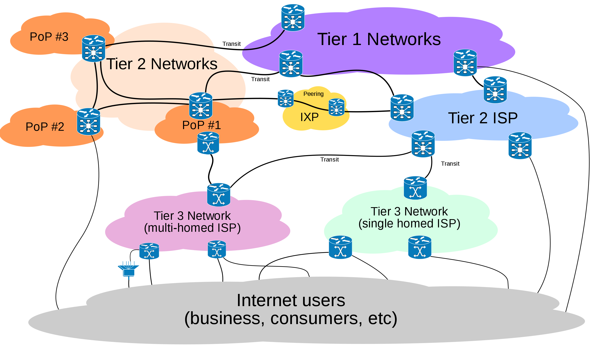

# A Internet

Se você se lembrar da pilha de protocolos de comunicação de referência OSI, lembrará que há uma organização em camadas em que cada camada é responsável pela comunicação em um nível e serve de fundação para a funcionalidade da camada de cima, isto é, cada camada é responsável pela comunicação em um nível de abstração que serve de base para o nível imediatamente superior:
O protocolo de cada camada inclui **cabeçalhos** (*header*) e **carga** (*payload*) e o conjunto de cabeçalho + carga de uma camada é considerado carga da camada inferior.
Assim, embora tenha-se a impressão de que cada camada conversa com a equivalente do outro lado da comunicação, na prática, a comunicação desce e sobe a pilha. 

São sete as camadas:

1. Física: Bits
2. Enlace: Frames/quadros; controle de fluxo; acesso ao meio.
3. Rede: Datagramas/pacotes; roteamento
4. Transporte: Controle de fluxo; fim a fim; confiabilidade; tcp e udp
5. Sessão: Streams/fluxos; conexões lógicas; restart; checkpoint; http, ssl
6. Apresentação: Objetos; json, xml; criptografia
7. Aplicação: Aplicações; http, pop, ftp

O ***internetworking protocol***, ou IP, é um protocolo da camada 3, mas apesar disso, nos referimos à pilha que usa este protocolo como a pilha IP.
Esta pilha é, na prática, diferente da pilha de referência OSI por ser mais simples, como se vê na figura a seguir

O IP trabalha conectando diversas redes via os **roteadores**, nós que fazem parte de mais de uma rede.
Nestes nós, os os pacotes de dados sobem somente até a camada 3 e lá são encaminhados, por  **melhor esforço** para o próximo segmento rumo ao destinatário.

Assim, para a aplicação usando o IP, as redes se comportam como uma única e coerente rede, exceto por alguns detalhes.
Esta habilidade é o que dá o nome ao protocolo e, de fato, a toda a Internet.

[{: style="max-width:500px"}](https://en.wikipedia.org/wiki/Tier_1_network)[^internet]

[^internet]: By User:Ludovic.ferre - Internet Connectivity Distribution&Core.svg, CC BY-SA 3.0, (https://commons.wikimedia.org/w/index.php?curid=10030716)

Como usuários da pilha IP, temos que entender que o fato da pilha IP ser mais simples que a OSI implica que as funcionalidades das camadas 5 e 6 devem ser implementadas na camada de aplicação, por você desenvolvedor.
Contudo, não tema! Estas funcionalidades podem se normalmente implementadas por meio de *frameworks* ou do *middleware* em uso.
Alguns exemplos de tais funcionalidades são

* (De)Serialização - conversão de estruturas complexas, e.g., objetos e estruturas, em sequência de bytes.
* Nomeamento - identificação de *hosts*
* Criptografia - ocultação dos dados trafegados
* Replicação - comunicação com múltiplos interlocutores
* Invocação remota de procedimentos - abstração de protocolos de comunicação

A grande vantagem desta abordagem é que se pode implementar exatamente e somente as funcionalidades desejadas.
Este característica é conhecida como o [argumento fim-a-fim no projeto de sistemas](http://web.mit.edu/Saltzer/www/publications/endtoend/endtoend.pdf); uma análise recente deste argumento foi feita [aqui](https://blog.acolyer.org/2014/11/14/end-to-end-arguments-in-system-design/).

Quanto às camadas mais baixas, embora tenhamos que entender como a camada 3 funciona, dificilmente interagiremos com algo abaixo da camada 4, a camada de **transporte**, o que fazemos usando **sockets**.