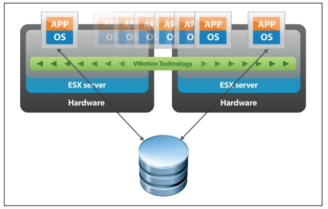

# Middleware e Transparência

??? info inline end "Middleware"
    * software
    * hardware/OS
    * aplicação
    * diversas funcionalidades

De acordo com [Tanenbaum & Van Steen](https://www.amazon.com/Distributed-Systems-Principles-Paradigms-Tanenbaum-dp-B00DEKA7T2/dp/B00DEKA7T2/ref=mt_hardcover?_encoding=UTF8&me=&qid=), *middleware* é 
> ... the software layer that lies between the operating system and applications on each side of a distributed computing system in a network.

Isto é, o *middleware* é a camada *ware* que fica no *middle*, entre, o *software* e o *hardware*. 
Software, no caso, é a aplicação distribuída sendo desenvolvida e hardware é a **abstração** do *host* em que se executam os componentes, provida pelo sistema operacional.
Uso aqui o termo **abstração** porquê o sistema operacional pode encapsular *hardware* real, mas também pode encapsular outra abstração de *hardware*, por exemplo, uma máquina virtual ou contêiner.

A figura seguinte   mostra um exemplo com três aplicações executando sobre um *middleware*, que por sua vez é executado sobre diferentes sistemas operacionais, em *hosts*  conectados por uma rede de comunicação. 

{: style="width:500px"}[^0101]

[^0101]: Distributed Systems: Principles and Paradigms. Capítulo 1, Figura 1.

Com este cenário em mente, é importante entender o que diz [Sacha Krakowiak](https://web.archive.org/web/20050507151935/http://middleware.objectweb.org/) quando afirma que as principais funções do *middleware* são:

* esconder a distribuição e o fato de que um aplicação é geralmente composta por múltiplas partes, executando em localizações geograficamente distintas,
* esconder a heterogeneidade dos vários componentes de hardware, sistemas operacionais e protocolos de comunicação
* prover interfaces uniformes, de alto nível e padronizadas para os desenvolvedores de aplicação e integradores, de forma que aplicações possam ser facilmente compostas, reusadas, portadas e feitas interoperáveis.

Assim, os *middleware* facilitam a conexão entre componentes e permitem o uso de protocolos mais abstratos que as operações de  `write(byte[])` e `read(): byte[]` dos protocolos de baixo nível, escondendo a complexidade da coordenação de sistemas independentes.
Desenvolver sistemas distribuídos sem usar um *middleware* é como desenvolver um aplicativo sem usar quaisquer bibliotecas: possível, mas complicado, e estará certamente reinventando a roda. Isto é, você praticamente tem que refazer o *middleware* antes de desenvolver o sistema em si.

Idealmente, com o *middleware*, o desenvolvedor conseguiria facilmente implementar uma aplicação em que a distribuição fosse totalmente transparente, levando o sistema, uma coleção de sistemas computacionais (software ou hardware) independentes, a se apresentar para o usuário como **um sistema único**, monolítico.
Pense no browser e na WWW, por exemplo: o quanto você sabe sobre as páginas estarem particionadas em milhões de servidores? Isso é o que chamamos de **transparência**.

??? info inline end "Transparência Total"
    Acesso + Localização + Relocação + Migração + Replicação + Falha

Se não há qualquer indício de que a aplicação é distribuída, então temos **transparência total**.  
Podemos quebrar esta transparência total em várias transparências mais simples: **Acesso**, **Localização**, **Relocação**,
**Migração**, **Replicação**, e **Falha**.
Vejamos cada uma destas separadamente.

###### Transparência de Acesso

??? info inline end "Transparência de Acesso"
    * como se apresenta
    * representação de dados
        * arquitetura
        * OS
        * linguagem
    * padrões abertos e bem conhecidos.

A transparência de acesso diz respeito à representação de dados e mecanismos de invocação (arquitetura, formatos, linguagens...).
Cada computador tem uma arquitetura e uma forma de representar seus dados. Por exemplo, considere os padrões para representação de números em ponto flutuante IEEE e IBM. Ambos dividem os bits em sinal, expoente e mantissa, mas com tamanhos diferentes.

!!!note "IEEE[^IEEEFP]"

     Precisão | Tamanho total (bits) | Sinal (bits) | Expoente (bits) | Mantissa (bits)
    :--------:|:--------------------:|:------------:|:---------------:|:--------------:
     Half | 16 | 1 | 5 | 10 
     Single | 32 | 1 | 8 | 23
     Double | 64 | 1 | 11 | 52
     Quadruple | 128 | 1 | 15 | 112

!!! note "IBM[^IBMFP]"

     Precisão | Tamanho total (bits) | Sinal (bits) | Expoente (bits) | Mantissa (bits)
    :--------:|:--------------------:|:------------:|:---------------:|:--------------:
     Single | 32 | 1 | 7 | 24
     Double | 64 | 1 | 7 | 56
     Quadruple | 128 | 1 | 7 | 112 (8b ignorados)

[^IEEEFP]: [IEEE Floating Point](https://www.tutorialspoint.com/fixed-point-and-floating-point-number-representations)
[^IBMFP]: [IBM Floating Point](https://en.wikipedia.org/wiki/IBM_hexadecimal_floating_point#Single-precision_32-bit)

E se dois componentes de um SD executam em máquinas com arquiteturas diferentes, como trocam números em ponto flutuante?
É preciso que usem um padrão conhecido por ambos os *hosts*, seja o padrão a arquitetura "nativa" do host ou um padrão intermediário, definido pelo *middleware*.

A mesma questão é válida para representações de strings e classes, e diferenças de sistemas operacionais e linguagens.
No caso específico das strings, pense em um programa escrito em linguagem C e que este programa deva comunicar-se com um outro, escrito em Java, e trocar strings com o mesmo.
Enquanto em C uma string é uma sequência de bytes imprimíveis terminadas por um `\0`, em Java uma string é uma classe que encapsula uma sequência de chars, sendo que cada [char é um código 16 bits](https://docs.oracle.com/javase/8/docs/technotes/guides/intl/overview.html) representativo de um código Unicode[^stringjava].
Como transferir strings entre duas plataformas?  Não fazê-lo? Simplificar a string Java?  Estender a string C?  
Para se tentar obter transparência de acesso, é importante que se use **padrões** implementados em múltiplas arquiteturas, **abertos**  e bem conhecidos, com **interfaces bem definidas**.

[^stringjava]: Simplificações são possíveis, mas introduzem outras complexidades.

###### Transparência de Localização

??? info inline end "Transparência de localização"
    * onde está o objeto
    * latência
        * cache
        * paralelismo
        * programação assíncrona
        * arquiteturas reativas

A transparência de localização diz respeito a onde está o objeto acessado pela aplicação, seja um BD, página Web ou serviço de echo: pouco importa ao usuário, se está dentro da mesma máquina de onde executa o acesso, se na sala ao lado ou em um servidor do outro lado do globo, desde que o serviço seja provido de forma rápida e confiável.
A esta transparência é essencial uma boa distribuição do serviço, sobre uma rede com baixa latência, ou o uso de técnicas que permitam esconder a latência.

###### Escondendo a Latência

Para se esconder a latência, várias táticas são utilizáveis:

* *Caching* de dados
    * Em vez de sempre buscar os dados no servidor, mantenha cópias locais dos dados que mudam menos (e.g., o CSS do *stack overflow*).
* Use paralelismo
    * Em vez de validar formulário após preenchimento de cada campo, valide em paralelo enquanto usuário preenche o campo seguinte.
    * Use *callbacks* para indicar campos com problemas a serem corrigidos.
    * Saiba que nem todo problema é paralelizável, por exemplo, autenticação
* Use programação assíncrona
    * AsyncIO
    * C# [await/async](https://docs.microsoft.com/en-us/dotnet/csharp/async)
    * [Futures e Promises](https://en.wikipedia.org/wiki/Futures_and_promises)

Outra forma de diminuir latência é trazer para próximo do usuário parte da computação.
Isto é comumente feito com a interface com usuário,  mas pode ser usado também para outras partes do sistema. 
Como exemplo do primeiro, pense em consoles de video-game que fazem o processamento gráfico pesado de jogos online na casa do usuário[^stadia].
Como exemplo do segundo, pense em aplicativos que mantém os dados em celulares até que uma boa conexão, por exemplo WiFi, esteja disponível para sincronizar com o servidor.

[^stadia]: O [Google stadia](https://stadia.google.com/) é uma plataforma de jogos que vai na contramão desta ideia, levando todo o processamento pesado para a nuvem.

De forma geral, pense em esconder latência pelos seguintes passos:

* Distribua tarefas
  * Delegue computação aos clientes (e.g., JavaScript e Applets Java)
  * Particione dados entre servidores (e.g., Domain Name Service e World Wide Web) para dividir a carga e aumentar a vazão
* Aproxime dados dos clientes
  * Mantenha cópias de dados em múltiplos lugares.
  * Atualize dados de acordo com necessidade (e.g., cache do navegador, com código do google.com sendo atualizado a cada 4 dias)

###### Transparência de Relocação

??? info inline end "Transparência de relocação"
    * como se movimenta
    * visto por clientes

As vezes componentes do sistema distribuído precisam ser movimentados de uma localização à outra, por exemplo porquê um novo *host* foi contratado.
Se implementadas corretamente, as técnicas que entregam transparência de localização não deixam que o cliente perceba a movimentação, no que chamamos transparência de Relocação.

* Rede de baixa latência
* Distribuição inteligente
    * E.g: Serviços de nome
* Múltiplas cópias
    * Cópias temporárias

###### Transparência de Migração

??? info inline end "Transparência de migração"
    * como se movimenta
    * visto por si mesmo

Do ponto de vista do próprio serviço, não perceber que se está sendo movimentado é chamado transparência de Migração.
Um serviço com esta propriedade, não precisa ser parado e reconfigurado quando a mudança acontece.
Uma das formas de se implementar esta propriedade é através da migração provida por máquinas virtuais, usado, por exemplo, para consolidar o uso de servidores em nuvens computacionais.
Veja o exemplo do VMotion da VMware.

Na verdade, a movimentação neste cenário, é uma cópia da máquina virtual. Uma vez que a cópia esteja próxima do fim, a imagem original é congelada, a cópia concluída, e há um chaveamento na rede para se direcionar toda comunicação para nova cópia. O máquina original é então descartada.

###### Transparência de Replicação

??? info inline end "Transparência de replicação"
    * redundância
    * visto por clientes

A capacidade de ter cópias de um serviço e de direcionar trabalho de uma para outra é também útil para se obter transparência no caso de falhas.
Isto porquê para se manter um serviço funcional a despeito de falhas, é preciso ter múltiplas cópias, prontas para funcionar a qualquer momento.

Dependendo das garantias desejadas na manutenção da **consistência** entre as cópias, o custo pode variar muito, de forma que para se ter um custo menor, tem-se garantias mais fracas, por exemplo, que as réplicas tem um **atraso** entre elas de no máximo $X$ minutos. Este é um dilema parecido com o TCP x UDP, em que mais garantias implicam em maior custo de comunicação.

Algumas aplicações toleram inconsistências e podem viver com menores custos. Um exemplo famoso é o dos "carrinhos de compra" da [Amazon.com](https://www.allthingsdistributed.com/2008/12/eventually_consistent.html), que podem fechar pedidos com conteúdo diferente do desejado pelo cliente.

Outras aplicações são normalmente construídas com requisitos de consistência forte entre as réplicas, como sistemas financeiros.
Para estas aplicações, uma técnica importante para se conseguir replicação é o uso de *frameworks* de **comunicação em grupo**, que entregam para múltiplas instâncias de um mesmo serviço, as mesmas mensagens, permitindo que elas se mantenham como cópias.
Esta técnica funciona se os serviços forem máquinas de estado determinísticas, que consideram como eventos as mensagens entregues pelo protocolo de comunicação em grupo e é denominada [**replicação de máquinas de estado**](https://en.wikipedia.org/wiki/State_machine_replication).

??? info inline end "Replicação de Máquina de Estados"
    * determinística
    * mesmo estado inicial
    * mesmos eventos
    * mesmo estado final
    * atraso entre réplicas

??? todo
    Figura com state machine replication

Novamente é preciso chamar à atenção a questão dos custos desta técnica.
Replicação de Máquinas de Estados é muito custosa e por isso faz-se um esforço para não utilizá-la ou para utilizá-la em "cantinhos" do sistema onde inconsistências são absolutamente caras demais para sere permitidas.
Isto porquê manter múltiplas cópias $\Rightarrow$ sincronização $\Rightarrow$ custos. 
Se houver mudanças frequentes nos dados, tal custo precisa ser pago também frequentemente.
Mitigações incluem uso de réplicas temporárias, protocolos de invalidação de cache, contratação de redes com mais largura de banda  e menor latência, sendo que estes últimos esbarram em limitações financeiras e físicas.

###### Transparência de Concorrência

??? info inline end "Transparência de concorrência"
    * obliviedade a outros serviços
    * visto por clientes

Outra transparência almejável é de concorrência, isto é, imperceptibilidade quanto ao fato de que o serviço está executando concorrentemente a outros serviços e sendo acessado por outros clientes.
Isto é importante tanto em termos de segurança, no sentido de que um cliente não deveria acessar os dados do outro, caso isso seja um requisito do sistema, quanto tem termos de desempenho.
Nuvens computacionais são um exemplo de onde este tipo de transparência é essencial.

Considere um serviço de banco de dados em uma nuvem qualquer. Para prover a mesma interface com a qual usuários estão acostumados a anos, é possível que este serviço seja simplesmente um *wrapper* ao redor do SGBD que se comprava e instalava *in-house* anteriormente.
Para se tornar viável, contudo, uma mesma instância deve servir múltiplos clientes, os *tenants*, sem que a carga de trabalho introduzida por um, interfira no desempenho do outro. No meio, chamamos esta propriedade de *multi-tenancy*, mas é apenas um exemplo de transparência de concorrência.

* 

Esta transparência está fundamentalmente ligada à escalabilidade, isto é, à adequação dos *pool* de recursos às demandas dos clientes: se mais clientes estão presentes, então aumente a quantidade de servidores (*scale up*) e separe as cargas (*sharding*); se menos clientes estão presentes, então desligue algumas máquinas (*scale down*) e consolide recursos.

###### Desafios para se obter transparência

Apesar de desejáveis, as transparência discutidas são difíceis de se conseguir, principalmente se em conjunto.
Isto porquê, do **ponto de vista de usuários** espalhados pelo globo, atrás de redes heterogêneas e com possibilidade de erros, acontecerão atrasos e perdas na comunicação, denunciando a distribuição.

Do **ponto de vista do desenvolvedor**, é preciso tomar decisões baseado em premissas ligadas à realidade da rede. Por exemplo, se uma requisição não foi respondida, quanto tempo um cliente deve esperar antes de reenviá-la, possivelmente para outro servidor, sem incorrer em risco significativo da requisição ser processada duas vezes? A resposta para esta pergunta é muito mais complicada do que pode parecer.

**De forma geral**, qualquer aumento de transparência tem um custo, seja em termos monetários (e.g., contratação de enlace dedicado ou de *host* em outra posição geográfica), ou em termos de desempenho (e.g., coordenar a entrega de mensagens em sistemas de comunicação em grupo).

Provavelmente os maiores obstáculos para se alcançar os diversos tipos de  transparência são impostos pela parte da infraestrutura que torna o sistema distribuído possível, a rede.
Para entender o porquê, vejamos algumas premissas normalmente assumidas sobre a rede que não são, definitivamente, verdade:

* A latência é zero.
* A largura de banda é infinita.
* A rede é confiável.
* A rede é segura.
* A rede é homogênea.
* A rede é estática.
* A rede tem acesso grátis.
* A rede é administrada por você ou alguém acessível.

