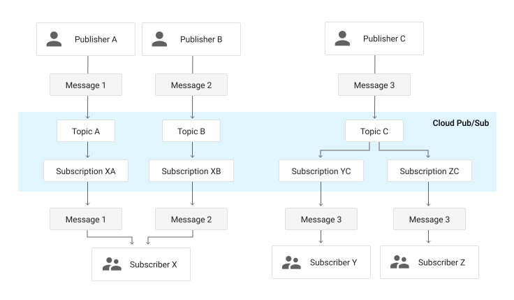

# Message Oriented Middleware
Nesta seção, discutiremos ***Message Oriente Middleware*** (MOM), *middlewares* focados nas mensagens trocadas entre processos em um nível mais alto do que quando revisamos *sockets*, que também são uma tecnologia para a troca de mensagens entre processos em um nível de abstração mais baixo e mais difícil de usar corretamente.

MOM apresentam-se em muitas formas, deste a ***Message Passing Interface*** (MPI), usada em aplicações HPC (*high performance computing*), quanto os sistemas de ***Message Queues*** (MQ) e ***Publisher/Subscriber*** (PubSub), usados em sistemas de informação, ***Internet of Things*** (IOT) e ***Big Data***.

## Message Passing Interface
***Message Passing Interface*** é uma tecnologia muito usada para coordenar a distribuição e agregação de dados em aplicações em HPC (*high performance computing*). 

Com este foco em HPC, é natural implementações se concentram em torno das linguagens percebidas como de melhor desempenho e mais usadas pelas comunidades que fazer uso de HPC, como C, C++ e Fortran. Por exemplo, ***[OpenMPI](https://www.open-mpi.org/)***, que se destaca como implementação de MPI por ser de código livre e bem mantida pela sua comunidade, é focada nestas três linguagens, contudo, há também uma versão para Java.

Sistemas usando MPI normalmente implementam o paradigma ***Single Program Multiple Data***, em que o mesmo binário é executado em vários computadores diferentes, simultaneamente.
Os processos então recebem **parte** do volume total de dados a serem processados, e os processam da mesma forma (**paralelismo de dados**: mesma tarefa, mas dados diferentes) ou recebem todos os dados mas executam processamentos diferentes (**paralelismo de tarefas**: mesmos dados mas tarefas diferentes).
Quatro das operações providas pelas implementações de MPI, mostradas na figura a seguir, provêem as ferramentas para espalhar dados (***broadcast***), fragmentos dos dados (***scatter***), coletar e compor fragmentos (***gather***), ou reduzir resultados parciais (***reduce***).

Por exemplo, suponha que você esteja desenvolvendo uma aplicação que fará buscas de caminhos em grafos, com várias propriedades distintas.
Digamos que precise calcular uma rota entre vários vértices do grafo usando caminhadas aleatórias. Usando a função *broadcast*, você pode enviar uma cópia do grafo para cada processo disponível para que independentemente calcule alguma rota. 

Ao final do cálculo, um processo pode coletar os resultados de cada processo e escolher a melhor entre as rotas encontradas usando a função *reduction*.

Se preferir que cada busca se restrinja a um subgrafo, onde os vários subgrafos são complementares, então a função *scatter* seria usada.[^scatter]

Finalmente, a função *gather* poderia ser usada para coletar subgrafos com rotas encontradas e montar um grafo com todas as alternativas.

[^scatter]: O particionamento básico provido pela MPI é simplesmente uma divisão do buffer com os dados entre os vários processos, então para fragmentar um grafo, você teria um pouco de trabalho.

## Filas de mensagem
**Filas de mensagem** provêm uma forma de encaminhar dados para nós específicos sem a necessidade de conexão direta com os mesmos, através de **caixas de entrada**, funcionando como um serviço de correio, parecido o serviço de email ou mesmo as redes sociais para trocas de mensagens.

Estes *middleware* permitem enfrentar uma das dificuldades de se implementar sistemas distribuídos hoje, advinda do número cada vez maior de componentes, o fato de que componentes em saem do sistema frequentemente, por diversas razões, e que é difícil garantir que componentes que precisam interagir estarão online ao mesmo tempo.
Por exemplo, imagine se redes sociais tivessem o mesmo problema, isto é, se suas mensagens só pudessem ser entregues se tanto você quanto o destinatário estivessem *online* ao mesmo tempo.
O modelo de caixa de entrada, contudo, permite que haja um **desacoplamento temporal** das contrapartes na conversa ao armazenar mensagens até que o destinatário esteja apto a recebê-las.
Obviamente o desacoplamento temporal vale somente para remetentes e destinatários; os processos implementando o canal de comunicação onde as caixas de entrada residem, os ***brokers***, devem se manter online para permitir a comunicação.

As filas de mensagem, existentes há muito tempo, ganharam mais notoriedade recentemente, com a expansão de seu uso em sistemas com arquiteturas microsserviços, que estudaremos mais tarde.

???todo "Exemplos"
     * RabbitMQ
     * ZeroMQ
     * IBM Websphere
     * Estudos de caso

Contudo, mesmo com as filas, outro problema permanece: com mais e mais componentes, é difícil fazer com que todos se conheçam e que cada um saiba exatamente qual informação deve disponibilizar para cada outro. Este problema seria semelhante a exigir que toda vez que fosse expressar sua opinião na internet sobre variabilidade da taxa de geração de memes nos fins de semana, tivesse que contactar individualmente cada um dos usuários da mesma rede para perguntar se está interessado.
Felizmente, também assim como nas redes sociais, outro MOM permite que mensagens sejam ofertadas no sistema distribuído e que somente aqueles processos que tenham se declarado interessados no tópico as receberão.

    
## Publish/Subscribe
Os mecanismos de comunicação estudados até agora exigem que os processos se identifiquem e se enderecem para que haja troca de informação.
Quando falamos de comunicação *publish/subscribe* (ou *pub/sub*), esta este requisito não está mais presente. 
Isto porquê neste modelo o processo que envia uma mensagem, ***publisher***, não envia mensagens para um destinatário. 
Em vez disso, publica mensagens com um **tópicos**, aos quais os ***subscribers*** se subscrevem.
Assim, a comunicação não acontece diretamente mas via *brokers* *publishers* e *subscribers* não precisam executar ao mesmo tempo ou sequer saber da existência um do outro.

Desta forma, um dos aspectos mais importantes proporcionados pelo padrão *pub/sub* é o desacoplamento em várias dimensões das partes envolvidas.

* Espaço: *publishers* e *subscribers* não precisam se conhecer (por exemplo, não há necessidade de informar endereço IP e porta de cada um).
* Tempo: *publishers* e *subscribers* não precisam nem estar em execução ao mesmo tempo.
* Sincronização: operações em cada componente não precisam ser interrompida durante a publicação ou recebimento.

Além disso, os *brokers* que servem de ponto de conexão entre *publishers*  e *subscribers* e que dão persistência às mensagens (caso necessário) e distribuem as mensagens a quem devido, também permitem especificação de filtros de mensagens associados às subscrições, em diversos níveis.

* Baseada em assunto: *subscribers* se registram para receber mensagens de um ou mais tópicos de interesse. Em geral esses tópicos são strings com um formato hierárquico, por exemplo `/devices/sensor/+/temperature`.
* Baseada em conteúdo: baseada em linguagem de filtragem de conteúdo específica. *Downside:* mensagem não pode ser criptografada.
* Baseada em tipo: leva em consideração o tipo ou classe de uma mensagem ou evento, como o tipo *Exception* e subtipos, por exemplo.

Observe que uma mesma mensagem pode ser entregue a múltiplos *subscribers* se pertencer a um tópico de interesse em comum e que um mesmo *subscriber* pode se interessar por diversos tópicos.

Embora simples, frameworks pub/sub permitem a implementação de arquiteturas complexas, como o exemplo da figura a seguir e como estudaremos mais adiante.

