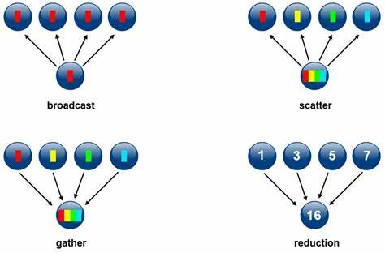

# Message Oriented Middleware

Nesta seção, discutiremos *middleware* focados nas mensagens trocadas entre processos e não em como estas mensagens são tratadas, diferentemente de quando revisamos *sockets que, afinal, são uma tecnologia para a troca de mensagens entre processos.
Como *sockets* são uma abstração de baixo nível, difíceis de se usar corretamente, precisamos de abstrações de mais alto nível.

## Message Passing Interface
Subindo as camadas de abstração uma tecnologia interessante é a ***Message Passing Interface***, muito usada para coordenar a distribuição e agregação de dados em aplicações em HPC (*high performance computing*). 
Quatro das operações providas pelas implementações de MPI são mostradas na figura a seguir, responsáveis por espalhar dados (***broadcast***), fragmentos dos dados (***scatter***), coletar e compor fragmentos (***gather***), ou reduzir resultados parciais (***reduce***).

Por exemplo, suponha que você esteja desenvolvendo uma aplicação que fará buscas de caminhos em grafos, com várias propriedades distintas.
Digamos que precise calcular uma rota entre vários vértices do grafo usando caminhadas aleatórias. Usando a função *broadcast*, você pode enviar uma cópia do grafo para cada processo disponível para que independentemente calcule alguma rota. 

Ao final do cálculo, um processo pode coletar os resultados de cada processo e escolher a melhor entre as rotas encontradas usando a função *reduction*.

Se preferir que cada busca se restrinja a um subgrafo, onde os vários subgrafos são complementares, então a função *scatter* seria usada.[^scatter]

Finalmente, a função *gather* poderia ser usada para coletar subgrafos com rotas encontradas e montar um grafo com todas as alternativas.

[^scatter]: O particionamento básico provido pela MPI é simplesmente uma divisão do buffer com os dados entre os vários processos, então para fragmentar um grafo, você teria um pouco de trabalho.

## Filas de mensagem
???todo "TODO"
     * Conteúdo. 
     * Gancho para pub/sub.
    
## Publish/Subscribe

Em capítulos anteriores, estudamos a arquitetura cliente/servidor, em que o cliente envia mensagens diretamente ao um servidor para que este, em reação à mensagem, realize alguma operação.
Na arquitetura *publish/subscribe* (ou *pub/sub*), há também a figura de um processo envia mensagens, o ***publisher***, e a figura do que recebe mensagens, o ***subscriber***, mas com pelo menos duas diferenças fundamentais que fazem com pub/sub se apresente como uma alternativa à cliente/servidor.
Em primeiro lugar, os dois processos nunca comunicam diretamente e não precisam nem saber da existência do outro ou sequer executarem ao mesmo tempo, estando **desacoplados**.
Em segundo lugar, mensagens são associadas a **tópicos**, aos quais os ***subscribers*** se subscrevem; somente tópicos de interesse são entregues aos *subscribers*, em um tipo de **filtragem**.

###### Desacoplamento
Um dos aspectos mais importantes proporcionados pelo padrão *pub/sub* é o desacoplamento entre as partes envolvidas, o qual ocorre em várias dimensões:

* Espaço: *publishers* e *subscribers* não precisam se conhecer (por exemplo, não há necessidade de informar endereço IP e porta de cada um).
* Tempo: *publishers* e *subscribers* não precisam nem estar em execução ao mesmo tempo.
* Sincronização: operações em cada componente não precisa ser interrompida durante a publicação ou recebimento.

Este desacoplamento é implementado por meio de ***brokers***, processos especiais que servem de ponto de conexão entre *publishers*  e *subscribers*, que dão persistência às mensagens (caso necessário), e distribuem as mensagens a quem devido.

###### Filtragem

O *broker* tem um papel fundamental pois permite a especificação de diversos níveis de filtragem:

* Baseada em assunto: *subscribers* se registram para receber mensagens de um ou mais tópicos de interesse. Em geral esses tópicos são strings com um formato hierárquico, por exemplo `/devices/sensor/+/temperature`.
* Baseada em conteúdo: baseada em linguagem de filtragem de conteúdo específica. *Downside:* mensagem não pode ser criptografada.
* Baseada em tipo: leva em consideração o tipo ou classe de uma mensagem ou evento, como o tipo *Exception* e subtipos, por exemplo.

Observe que uma mesma mensagem pode ser entregue a múltiplos *subscribers* se pertencer a um tópico de interesse em comum e que um mesmo *subscriber* pode se interessar por diversos tópicos.

###### Arquiteturas baseadas em Pub/Sub

Embora simples, frameworks pub/sub permitem a implementação de arquiteturas complexas, como o exemplo da figura a seguir.

