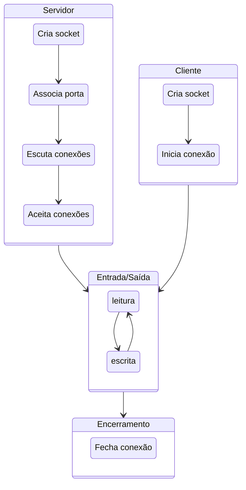

Para se definir um socket a partir de um ***host*** é necessário identificar o outro fim da comunicação, isto é, o outro *host*, ou melhor, uma de suas interfaces de rede.
Os sockets são então a abstração dos canais de comunicação, mas como dito antes, é necessário definir também os protocolos usados por estes sockets.
O primeiro protocolo é o de endereçamento, que define qual pilha de protocolos usar, na camada 3.
No caso da pilha IP, usa-se o protocolo AF\_INET ou PF\_INET.
Escolhido o protocolo, 

* cada interface tem um endereço MAC, na camada 2, que a identifica entre as interfaces na mesma rede local, e 
* cada interface tem um endereço IPv4/IPv6 de 32/128 bits, que o indentifica entre todos os hosts na Internet.[^ippub]

[^ippub]:Endereços IP não públicos não servem como identificadores únicos na Internet.

Mas dentro de um *host*, podem haver diversas aplicações sendo executadas. Como identificar exatamente com qual se quer conversar?
Isto é feito pela definição uma porta:

* Porta: inteiro de 16 bits
* Associadas a serviços pela [Internet Assigned Numbers Authority](http://www.iana.org), IANA.
     * Portas "Bem conhecidas": 0-1023
     * Portas Proprietárias: 49151
     * Portas Dinâmicas: 65535

Também é necessário definir o protocolo de transporte dos dados, na camada 4.
Novamente, no caso da pilha IP, pode-se usar TCP (**SOCK\_STREAM**) ou UDP (**SOCK\_DGRAM**).

A API usada para estabelecer a conversa via socket tem várias chamadas, que devem ser executadas na ordem certa no processo iniciando a conversa e naquele que aceita participar da mesma. Comecemos estudando o TCP.

## TCP

O fluxograma da criação de um socket TCP é apresentado na seguinte figura:


<!---->

Estabelecido o socket, o mesmo pode ser usado como um **arquivo**, isto é, lendo-se e escrevendo-se bytes.
O que exatamente deve ser escrito e como o que é lido deve ser interpretado é o protocolo da camada 7, **sua responsabilidade**.

Vejamos um exemplo do uso de sockets, em Python, descrito no arquivo `server.py`.[^pyname]

[^pyname]:Você pode usar outro nome, desde que não seja `socket.py`, e que adapte o comando para sua execução.

```python
#server.py
#!/usr/bin/python                           # This is server.py file

import socket                               # Import socket module

s = socket.socket()                         # Create a socket object
host = socket.gethostname()	                # Get local machine name
port = 12345                                # Reserve a port for your service.
s.bind((host, port))                        # Bind to the port

s.listen(5)                                 # Now wait for client connections.
while True:
   c, addr = s.accept()                     # Establish connection with client.
   print('Got connection from', addr)
   c.send('Thank you for connecting'.encode())
   c.close()                                # Close the connection
```

Para executá-lo, execute o seguinte comando em um terminal. 

```bash
python server.py
```

Em outro terminal, execute **um dos** dois comandos a seguir. [^telnet]

[^telnet]:O programa `telnet` é normalmente instalado por padrão tanto no Windows, OSX quanto no Linux. Já o `netcat` normalmente precisa ser instalado por você. Em alguns sistemas, em vez de `netcat` o comando é o `nc`.

```bash
telnet localhost 12345
```

```bash
netcat localhost 12345
```

No segundo terminal a mensagem 
`Thank you for connecting`
será impressa, enquanto no primeiro veremos algo como 
 `('Got connection from', ('127.0.0.1', 57801))` 
 
O que está acontecendo aqui é um processo criou um socket e ficou aguardando uma conexão, usando o código em Python.
Tanto o telnet quando o netcat são programas genéricos para se conversar com outro processo usando TCP/IP.
Aqui, estes programas simplesmente se conectaram e imprimiram o que quer que o primeiro processo lhes tenha enviado, assumindo que correspondia a uma string, o que neste caso é correto.
Simples, não é mesmo?

Duas observações importantes a serem feitas aqui. 
A primeira é que, em geral, denominamos o processo que fica aguardando a conexão de **servidor** e o processo que se conecta de **cliente**. Isto por quê, em geral, o servidor executa alguma tarefa, serve, o cliente, embora isto não seja necessariamente verdade.


Por completude, vamos também escrever o código do cliente, agora que você já sabe que o servidor funciona.
Do lado cliente, estabelece-se uma conexão apontando-se para onde está o servidor.
```Python
#client.py

#!/usr/bin/python                      # This is client.py file

import socket                          # Import socket module

s = socket.socket()                    # Create a socket object
host = socket.gethostname()            # Get local machine name
port = 12345                           # Reserve a port for your service.

s.connect((host, port))
data = s.recv(1024)
print(data.decode())
s.close()                              # Close the socket when done
```

E para se executar o cliente, faça:
```bash
python client.py
```

Observe que o `socket.close()` encerra a conexão do lado de quem invoca. Na contraparte, invocações a `socket.recv()` retornam com 0 bytes lidos.

A título de comparação, em Java, a criação do socket do lado do servidor seria muito mais simples, consistindo apenas em: 
```Java
Socket s = new ServerSocket(port);
```

O cliente em Java também é simplificado.
```Java
Socket s = new Socket(hostname,port);
```

!!! question "Exercício: Múltiplos Pacotes"
    Façamos agora uma modificação no código do servidor para que envie não uma, mas duas mensagens para o cliente. Isto é, modifique seu servidor assim

    ```Python
    ...
    c.send('Thank you for connecting'.encode())
    c.send('Come back often'.encode())
    ...
    ```

    Agora execute novamente o cliente e veja o que acontece.  Consegue explicar o fenômeno?

    Modifiquemos o cliente agora, para que tenha dois `recv`, assim.
    ```Python
    ...
    print("1")
    data = s.recv(1024)
    print(data.decode())
    print("2")
    data = s.recv(1024)
    print(data.decode())
    ...
    ```

    E agora, o que acontece? A saída é como esperava? Como explica este fenômeno e como poderia corrigí-lo?

!!! question "Exercício: Ping-Pong"

    Modifique cliente e servidor tal que o cliente envie uma mensagem passada na linha de comando ao servidor e fique esperando uma resposta, e tal que o servidor fique esperando uma mensagem e então solicite ao operador que digite uma resposta e a envie para o cliente. O loop continua até que o usuário digite SAIR, e a conexão seja encerrada.


    | Terminal 1                 |  Terminal 2 |
    |----------------------------|-------------|
    | python server.py           | python client.py| 
    | Esperando conexão.         | conectando-se ao servidor |
    | Conectado                  | Conectado                 |
    | Esperando mensagem         | Digite mensagem: lalala   |
    |                            | Mensagem enviada          |
    | Mensagem recebida: lalala  | Esperando resposta        |
    | Digite resposta: lelele    |                           |
    | Resposta enviada.          |  Resposta recebida: lelele|
    |                            |  Digite mensagem: SAIR    |
    |                            |  Desconectando.           |
    | Conexão encerrada.         |                           |
    | Esperando conexão.         |                           |
  
    Observe que para ler do teclado em Python 2 você deve usar `#!py3 x = raw_input()`, enquanto que em Python 3 seria `#!py3 x = input()`. Além disso, em Python 2, você deve remover as invocações para `encode` e `decode`.


## UDP 

No exemplo anterior, usamos o protocolo TCP (o padrão da API). Caso quiséssemos usar UDP, precisaríamos nos atentar a alguns detalhes.

A criação do socket é feita explicitando-se o uso de **datagramas**: `#!py3 s = socket.socket(socket.AF_INET,socket.SOCK_DGRAM)`

Um servidor UDP não executa `listen` ou `accept` e, em Python, simplesmente executa `#!py3 data, addr = sock.recvfrom(4096)` para receber o datagrama, onde `data` é o conteúdo recebido e  `addr` o endereço de quem enviou o datagrama.

Neste caso, um mesmo socket é usado para manter comunicação com múltiplos interlocutores. Para enviar uma resposta a um interlocutor em específico, `addr` é usado: `#!py3 sent = sock.sendto(data, addr)`, onde `sent` é a quantidade de bytes enviados.

Além deste detalhe, é importante manter em mente outras características do UDP:

* falta de ordem
* falta de confiabilidade
* menos dados lidos que enviados.
* mais dados lidos que enviados (pode acontecer também no TCP)

Com tantas dificuldades para se usar o UDP, fica a questão: **para que serve UDP?**

!!! question "Exercício: Ping-Pong UDP"
    Modifique o código do exercício Ping-Pong para usar UDP em vez de TCP na comunicação entre nós.
    Execute múltiplos clientes ao mesmo tempo. Como o seu servidor lida com isso? Modifique-o para mandar um "eco" da mensagem recebida de volta ao remetente. 


## IP-Multicast

Imagine que você tenha que enviar um *stream* de vídeo para um amigo mostrando como você está jogando o mais novo jogo da velha no mercado.
Qual protocolo de transporte você usaria? TCP, provavelmente, já que garante a entrega ordenada dos pacotes do vídeo.
Como você já sabe, o TCP envia confirmações de pacotes recebidos e usa uma janela deslizante para determinar quais pacotes reenviar, o que pode causar interrupções na execução do vídeo.
Além do mais, as pessoas provavelmente preferirão perder alguns quadros que perder a sincronia com sua excitante partida.
Parece que uma opção melhor seria então usar UDP, correto?

Imagine agora que os mesmos dados devam ser enviados para múltiplos destinatários (você está ficando famoso!)
Com múltiplos destinatários, múltiplos controles precisariam ser mantidos no TCP, o que pode se tornar custoso; mais uma razão para usar UDP!


Para terminar, lhe darei uma razão final: IP-Multicast!
Multicast, em oposição ao Unicast, é a capacidade de enviar mensagens para um grupo de destinatários, em vez de apenas um. 


IP-Multicast é uma implementação desta ideia, usando umaa configuração específica do UDP, associada a recursos dos comutadores de rede, para otimizar o envio dos mesmos dados a múltiplos destinatários.
Grupos são identificados por endereços IP especiais, conhecidos como Classe D (224.0.0.0-239.255.255.255), e propagados pela rede.
A seguinte tabela descreve os usos das sub-faixas de endereços.[^multicast_use]
[^multicast_use]:  [Understanding IP Multicast](http://www.dasblinkenlichten.com/understanding-ip-multicast/)

| Endereço | Uso |
|----------|-----|
|224.0.0.0-224.0.0.255| Multicast local - Usado por protocolos L2, como EIGRP e OSPF|
|224.0.1.0-224.0.1.255| Multicast roteaddo - Usado por protocolos L3| 
|232.0.0.0-232.255.255.255| *Source Specific Multicast* - Receptores definem fontes confiáveis|
|233.0.0.0-233.255.255.255| Reservado para detentores *Autonomous Systems* |
|239.0.0.0-239.255.255.255| Reservado para IANA |
|Resto | Uso geral|


Quando um pacote é enviado para o endereço do grupo, **todos** os membros do grupo recebem tal mensagem.
Melhor dizendo, todos os membros podem receber a mensagem, mas como estamos falando de UDP, **é possível que alguns não recebam**.
Além disso, **não há garantia qualquer sobre a ordem de recepção das mensagens**.

Apenas reforçando, IP-Multicast só funciona com UDP, pois lidar com retransmissões em um grupo grande levaria a um estado imenso sendo mantido na origem dos dados.
Outro ponto importante é que pelo podencial desestabilizador do IP-Multicast, ele é normalemente limitado à pequenas seções das redes.

Mas experimentemos com esta tecnologia na prática.
Criemos um programa que **criar Socket UDP**, **associa-o a um grupo**, e **recebe pacotes** destinados ao grupo.

```Java
// MReceiver.java
import java.io.*;
import java.net.*;

public class MReceiver {
  public static void main(String[] args) {
    byte[] inBuf = new byte[256];
    try {
      MulticastSocket socket = new MulticastSocket(8888);
      InetAddress address = InetAddress.getByName("224.2.2.3");
      socket.joinGroup(address);
      while (true) {
        DatagramPacket inPacket = new DatagramPacket(inBuf, inBuf.length);
        socket.receive(inPacket);
        String msg = new String(inBuf, 0, inPacket.getLength());
        System.out.println("From " + inPacket.getAddress() + " Msg : " + msg);
      }
    }catch (IOException ioe) {
      System.out.println(ioe);
    }
  }
}
```

Instancie múltiplos processos deste, na mesma máquina e em máquinas distintas.
Agora criemos um programa que envia pacotes para o dito grupo.

```Java 
// MSender.java
import java.io.*;
import java.net.*;
public class MSender {
 public static void main(String[] args) {
  byte[] outBuf;
  final int PORT = 8888;
  try {
   DatagramSocket socket = new DatagramSocket();
   long counter = 0;
   InetAddress address = InetAddress.getByName("224.2.2.3");
   while (true) {
    counter++;
    outBuf = ("Multicast numero " + counter + " " + address).getBytes();
    DatagramPacket outPacket = new DatagramPacket(outBuf, outBuf.length, address, PORT);
    socket.send(outPacket);
    try { Thread.sleep(500); }catch (InterruptedException ie) {}
   }
  } catch (IOException ioe) { System.out.println(ioe); }
 }
}
```

Observe como a mesma mensagem é recebida pelos vários membros e que como diferentes fontes tem seus pacotes recebidos.

A título de curiosidade, IP-Multicast também está presente em IPv6, mas com algumas pequenas diferenças 

!!! tip "IP-Multicast em IPv6[^ipv6multi]"
    In IPv6, the left-most bits of an address are used to determine its type. For a multicast address, the first 8 bits are all ones, i.e. FF00::/8. Further, bit 113-116 represent the scope of the address, which can be either one of the following 4: Global, Site-local, Link-local, Node-local.

    In addition to unicast and multicast, IPv6 also supports anycast, in which a packet can be sent to any member of the group, but need not be sent to all members.''

[^ipv6multi]: [IP-Multicast em IPv6](http://www.baeldung.com/java-broadcast-multicast)


!!! question "Exercício: IP-Multicast"
    Implemente e teste o seguinte **receiver**, colocando várias instâncias para executar em múltiplos terminais, ao mesmo tempo.

    ```Python
    import socket
    import struct

    MCAST_GRP = '224.1.1.1'
    MCAST_PORT = 5007

    sock = socket.socket(socket.AF_INET, socket.SOCK_DGRAM, socket.IPPROTO_UDP)
    sock.setsockopt(socket.SOL_SOCKET, socket.SO_REUSEADDR, 1)
    sock.bind(('', MCAST_PORT))
    mreq = struct.pack("=4sl", socket.inet_aton(MCAST_GRP), socket.INADDR_ANY)
    #4 bytes (4s) seguidos de um long (l), usando ordem nativa (=)

    sock.setsockopt(socket.IPPROTO_IP, socket.IP_ADD_MEMBERSHIP, mreq)

    while True:
        print(sock.recv(10240).decode())
    ```

    Implemente e teste o seguinte **sender**.

    ```Python
    import socket

    MCAST_GRP = '224.1.1.1'
    MCAST_PORT = 5007

    sock = socket.socket(socket.AF_INET, socket.SOCK_DGRAM, socket.IPPROTO_UDP)
    sock.setsockopt(socket.IPPROTO_IP, socket.IP_MULTICAST_TTL, 2)
    sock.sendto(input().encode(), (MCAST_GRP, MCAST_PORT))
    ```


