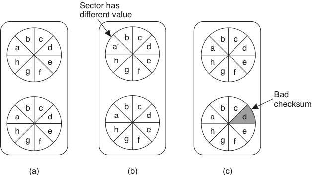
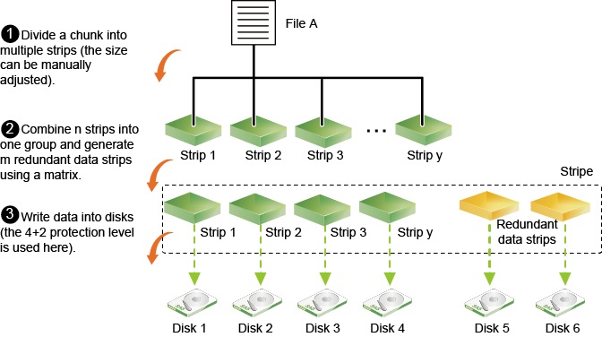
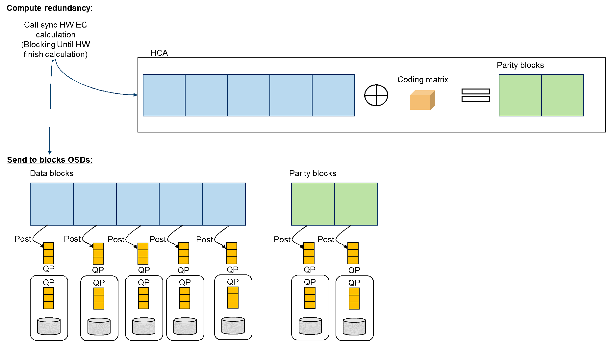
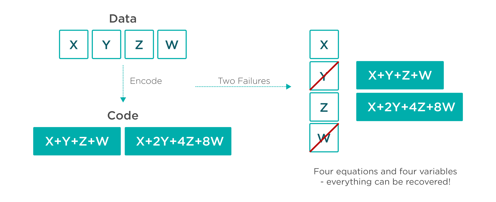
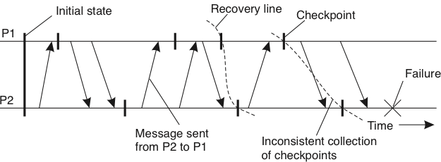
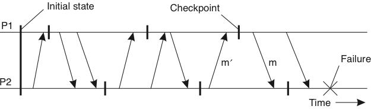

##  Recuperação & Checkpoint

Assumindo que o modelo de consistência implementado é satisfatório, temos que garantir que este modelo não será quebrado na presença de falhas.
Isto é, suponha que uma série de erros aconteceram no sistema, e que não é possível continuar o processamento em algum ou todos os módulos do sistema.
Neste cenário, o sistema precisa agir para ou avançar para um novo estado, livre de erros, ou retroceder a um estado anterior, correto.

Voltar a um estado correto parece ser a solução mais fácil, mas pare isto é preciso garantir a informação sobre estados anteriores seja recuperável. 

### Log Recuperável

###### Replicação

Como garantir que o log poderá ser lido para recuperar o processo?

* Dois discos iguais?
* Dados diferentes, mas ambos bons?
* Um bom outro estragado?
* Ambos estragados?

###### Blocos de paridade

###### Erasure Coding

Blocos de paridade

Cálculo da paridade

Recuperação de blocos perdidos

[Reed Solomon](https://en.wikipedia.org/wiki/Reed%E2%80%93Solomon_error_correction)

### Estado global consistente

Um estado global, o conjunto com um estado local de cada processo no sistema e também são conhecidos como ou ***snapshots***.

Para serem úteis, *snapshots* precisam formar **Estado Globais Consistentes**, que são estados globais tal que toda mensagem recebida no estado local de um processo também precisa fazer parte do estado local do processo remetente.

O mais recente estado global consistente forma uma **linha de recuperação**.

**Linhas de Recuperação** podem ser usados para, não surpreendentemente, recuperação do sistema, mas também para **coleta de lixo** (remover objetos não referenciados em nenhum outro processo), **detecção de deadlocks** e **depuração** (pausar o sistema).

Se o sistema provê comunicação confiável, então toda mensagem enviada no estado local de um processo também precisa fazer parte do estado local do destinatário, ou o estado global precisa capturar o estado dos canais de comunicação.

#### Checkpointing independente
Cada processo faz o checkpoint local independentemente, incorrendo no risco de um *rollback* em cascata.

* Seja $C_i^m$ o $m$-ésimo checkpoint do processo $p_i$.
* Seja $I_i^m$ o intervalo entre $C_i^{m-1}$ e $C_i^m$.
* Quando o processo $p_i$ envia a mensagem no intervalo $I_i^m$, envia $(i,m)$ em piggyback
* Quando o processo $p_j$ recebe a mensagem no intervalo $I_j^n$, grava a dependência $I_i^m \rightarrow I_j^n$
* A dependência $I_i^m \rightarrow I_j^n$ é salva junto com o checkpoint $C_j^n$

* Se o processo $p_j$ é revertido para o estado $C_j^n$, então o $p_i$ não pode reverter para nenhum estado anterior a $C_i^m$, ou não teria enviado as mensagens recebidas por $p_j$ 4 inclusas em $C_j^n$.

ou

* Se o processo $p_i$ é revertido para o estado $C_i^{m-1}$, então o $p_j$ tem que ser revertido pelo menos até $C_j^{n-1}$, ou incluiria mensagens ainda não enviadas por $p_i$.

 Como implementar a recuperação?

####### Caso patológico

* $p_i$ e $p_j$ no estado inicial ($C_i^0, C_j^0$)
* $p_i$ manda mensagens para $p_j$ ($C_i^1 \rightarrow C_j^1$)
* $C_j^1$
* $p_j$ manda mensagens para $p_i$ $C_j^2 \rightarrow C_i^1$
* $C_i^1$
* $p_i$ manda mensagens para $p_j$ $C_i^2 \rightarrow C_j^2$
* $C_j^2$
* $p_j$ manda mensagens para $p_i$ $C_j^3 \rightarrow C_i^2$
* $C_i^2$
* ...

Se estados locais são capturados na "hora errada", a linha de recuperação pode ser o estado inicial, fazendo um **rollback em cascata***

#### Checkpointing coordenado

Processos se coordenam por troca de mensagem para executar checkpointing "simultaneamente".

###### Bloqueio em duas fases

* Um coordenador faz multicast da mensagem "checkpoint-request"
* Quando um participante recebe "checkpoint-request"
    * faz um checkpoint local
    * para de mandar mensagens da aplicação
    * responde com "checkpoint-taken"
* Quando "checkpoint-taken" recebido de todos os participantes, multicast "checkpoint-done"
* Quando receber "checkpoint-done", retoma computação normal
* Por quê funciona?  Impede formação de dependências circulares.
* Todos os processos precisam participar?  Somente os que dependem da recuperação do coordenador.

Pontos negativos? 

* Se o coordenador falha, outros processos ficam bloqueados?  
     * Timeout!
* Como eleger outro coordenador? 
     * E se dois aparecerem juntos? 
     * Pode ser resolvido com um protocolo de eleição como o do RAFT. 
     * Não é garantido, mas aumenta as chances de sucesso.

###### Chandy-Lamport

* Não interfere na aplicação
* Cada processo grava snapshot independentemente

* Observador (iniciador do snapshot)
    * Salva o próprio estado
    * Envia uma mensagem "snapshot" aos outros processos em cada canal de saída
    * Grava as mensagens chegando em cada canal até que receba uma mensagem "snapshot" naquele canal.

* Um processo $p$ que receba "snapshot" de um processo $q$
    * grava estado local $S_p$
    * grava estado do canal $C_{q,p} =\emptyset$
    * Envia uma mensagem "snapshot" aos outros processos em cada canal de saída
    * Grava as mensagens chegando em cada canal até que receba uma mensagem "snapshot" naquele canal (excluindo $C_{q,p}$)

* Protocolo termina para o processo $p$ quando tiver recebido marcador "snapshot" em cada um de seus canais.
* O estado global consiste dos snapshots + estado em cada um dos canais.
 * Exige canais FIFO
	

###### Message Logging
Em vez de checkpoints frequentes, crie um log da comunicação e o re-execute a partir do último checkpoint.

**Ideia básica:**	

A computação é determinada pela troca de mensagens (eventos não determinísticos). 
Ao se enviar a mesma mensagem a partir de um certo estado, a computação desencadeada é sempre a mesma.

Realista este modelo? Há outros eventos não determinísticos no sistema?

	
* $Hdr(m)$
	* Cabeçalho da mensagem $m$ contendo fonte, destino, número de sequência e número de entrega.
	* O cabeçalho contém a informação necessária para reenviar e re-receber a mensagem na ordem certa (dados devem ser reproduzidos para aplicação).
	* A mensagem $m$ é estável se $Hdr(m)$ estiver em memória estável.
	
* $Dep(m)$: o conjunto de processos a quem $m$ ou mensagens que dependem de $m$ foram entregues.
* $Copy(m)$: o conjunto de processos que tem uma cópia de $Hdr(m)$ em memória volátil.

Se $C$ é um conjunto de processos falhos, então $Q\not\in C$ é um órfão se existe uma mensagem $m$ tal que $Q \in Dep(m)$ e $Copy(m)\subseteq C$	

Se os processos em $C$ forem reiniciados, então a computação seguirá um caminho possivelmente distinto do que levou $Q$ a receber $m$ ou um mensagem causalmente dependente de $m$.

Para cada mensagem $m$ não estável, há no máximo um processo dependente em $m$ ($Dep(m) \leq 1$)
 
Uma mensagem não estável, no protocolo pessimista, deve ser estabilizada antes do envio da próxima mensagem.

Toda mensagem é precedida por uma escrita em disco.

Para cada mensagem $m$ não estável, então devemos garantir que se $Copy(m) \subseteq C$, então *eventually* $Dep(m) \subseteq C$, onde $C$ é o conjunto de processos que falharam.
 
Para garantir que $Dep(m) \subseteq C$, fazemos um rollback de cada órfão $Q$ até que $Q \not\in Dep(m)$

Isto é, forçamos $Q$ a ser recuperado mesmo que não tenha falhado.