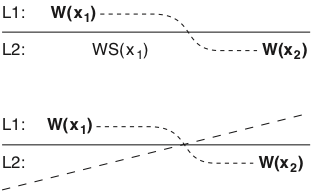

# Modelos Centrados nos Clientes

**Ideia básica**

Evitar sincronização global focando-se no que os clientes vêem do sistema. Se para os clientes parecer consistente, tudo bem.

* Consistência Eventual
    * Se nenhuma escrita ocorrer em período considerável de tempo, os clientes gradualmente se sincronizarão e ficarão consistentes.
    * Se clientes sempre acessarem as mesmas réplicas, terão impressão de consistência.

* Garantias são do ponto de vista de *um* cliente.
    * Leituras monotônicas
    * Escrita monotônicas
    * Leia suas escritas
    * Escritas seguem leituras.

##### Modelo de Sistema

Cliente pode se mover antes de sua última operação ter replicado do servidor onde estava para o novo servidor.

##### Leituras Monotônicas
**Garantia**

Se um processo lê o valor de um item $x$, qualquer leitura sucessiva de $x$ retornará o mesmo valor ou um mais recente.

* Toda vez que se conecta a um servidor de email, seu cliente lê novas mensagens, caso haja.
* O cliente nunca esquece uma mensagem, mesmo que ainda não esteja no servidor conectado por último.
* WS($x_i$) -- operações de escrita (*write set*) que levaram a variável $x$ a ter o valor $x_i$.
* WS($x_i;x_j$) -- operações de escrita relativas a $x_j$ incluem operações de escrita relativas a $x_i$

##### Escritas Monotônicas
**Garantia:**

Se um processo escreve em item $x$, então esta operação deve terminar antes que qualquer escrita sucessiva em $x$ possa ser executada pelo mesmo processo.

* Em um sistema de arquivos na rede, a escrita do conteúdo de um arquivo, em certa posição, só pode ser feita se escritas anteriores já estão registradas no arquivo, independentemente de o cliente contactar novo servidor de arquivos.

##### Leia suas Escritas
**Garantia:**

Se um processo escreve em item $x$, então leituras sucessivas no mesmo item pelo mesmo processo devem refletir tal escrita.

* Atualizar código fonte de uma página e exigir que o navegador carrega a nova versão.

##### Escritas seguem Leituras
**Garantia:**

Se um processo lê um item $x$, então escritas sucessivas no mesmo item só podem ser completadas se o mesmo reflete o valor lido anteriormente.

* Só é permitido enviar uma resposta a uma mensagem se a mensagem em si é vista, independentemente do cliente ter se movimentado.

