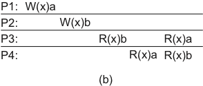
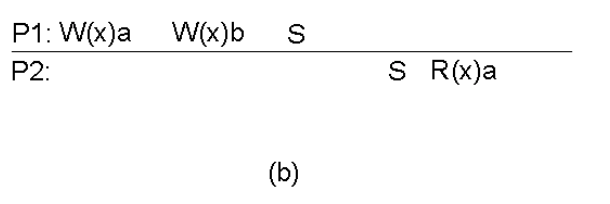
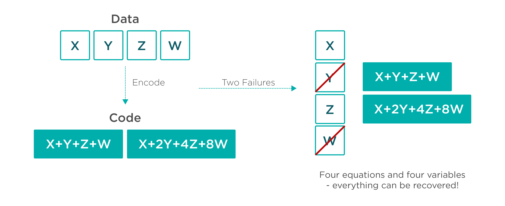

Considere por um momento, uma ***Content Delivery Network*** (CDN).

???sideslide "CDN"
    * Conteúdo é colocado próximo aos clientes. 
    * Conteúdo estático ou majoritariamente determinístico. 
    * Um pequeno atraso na replicação é tolerado.
    * Atualização acontece infrequentemente.

As *Content Delivery Networks* são sistemas que replicam os dados do contratante para, dinamicamente, colocar o conteúdo próximo ao usuário.

Se o conteúdo é majoritariamente estático, entregar esta funcionalidade é "simples", implicando apenas em um pequeno atraso entre a publicação de novo conteúdo e sua disponibilização para os usuários.
Neste caso, um protocolo de difusão totalmente ordenada, como o RAFT, pode ser usado na replicação, isto é, para garantir que todos os servidores vejam as mesmas mudanças, na mesma ordem, e que alcancem o mesmo estado final em algum momento.
Contudo, os protocolos de difusão totalmente ordenada tem um alto custo para atualizar as réplicas e este custo pode ser demais para a aplicação.
Neste caso, podemos tentar relaxar os requisitos da aplicação, por exemplo permitindo que atualizações sejam vistas em ordens diferentes por diferentes "réplicas", agora com aspas.
Por exemplo, se em vez de difusão atômica usássemos IP-Multicast, teríamos uma atualização mais barata dos dados, mas alguns valores escritos poderiam nunca ser vistos.

O que quero mostrar aqui é **há custos inerentes** na coordenação das partes do sistema distribuído, mas que é possível pensar em níveis diferentes de coordenação, com diferentes custos e é aí que entram os diversos modelos ou níveis de consistência.

## Modelos de Consistência

Embora não seja necessário, para falarmos sobre modelos de consistência, falaremos sobre bancos de dados pois é algo próximo da realidade da maioria dos estudantes e torna mais fácil o entendimento do tópico.
Um banco de dados pode ser pensado, em sua forma mais simplista, como um conjunto de variáveis nas quais valores são armazenados.
Assim, clientes do banco de dados essencialmente executam comandos como **$X$ recebe 'João'** e **$Y$ recebe 'joao arroba hmail.com'**.
Obviamente que $X$ e $Y$ não precisam ser declarados antes da primeira escrita, assim como chaves primárias não são declaradas até que sejam usadas, e que o valor associado a uma variável pode ter várias partes, como **"{'Endereço':'Av 1, número 2', 'Profissão':'Computeiro'}** e cada parte um tipo. Veja bem, eu disse uma simplificação, mas não quer dizer que nao seja uma simplificação poderosa.

Quando um processo se comunica com um banco de dados, ele o faz com certas expectativas quanto ao funcionamento deste banco.
Por exemplo, ao escrever um dados no banco, independentemente de como o banco é implementado, o cliente geralmente espera que as escritas aconteçam na ordem em que as disparou e que, ao ler uma variável, lhe seja retornado o "último" valor escrito na mesma.

Esta expectativa é independente do banco de dados ser implementado de forma distribuída ou não. Isto é, mesmo que os dados armazenados no banco sejam particionados ou replicados entre vários nós, o cliente espera que o banco tenha comportamento consistente com o de um banco não distribuído e retorne ou aquilo que escreveu ou algo mas recente.

???sidesline "Níveis de Consistência"
      * Consistência forte: leituras sempre retornam a versão mais recente do dado sendo lido.
           * Propagação instantânea ou *locks* dos dados sendo manipulados enquanto a propagação acontece.
      * Consistência fraca: leituras retornam algum dado escrito anteriormente.
           * Qualquer coisa vale
      * Consistência eventual: se não houver novas escritas, a partir de algum momento as leituras retornam a versão mais recente do dado sendo lido.
           * Propagação acontece no segundo plano

A expectativa, ou melhor, a forma como o banco de dados age dada uma interação com o cliente, ou clientes, é o que denominamos um **modelo de consistência**.
Em particular, a expectativa descrita acima é denominada **linearabilidade**, também conhecida como **consistência forte**.
Com o advento do NOSQL, mais e mais desenvolvedores buscam modelos alternativos, por exemplo, consistência ***eventual***, em que há a garantia de que atualizações estarão disponíveis a partir de algum momento para a leitura, mas não há uma definição clara de quando isso ocorrerá.[^eventual]

[^eventual]: Enquanto no Português *Eventual* quer dizer **possivelmente**, no inglês quer dizer **em algum momento** não determinado, mas vindouro.

Enquanto consistência eventual traz melhoras de desempenho, trabalhar com este modelo implica em muito mais complexidade no desenvolvimento dos sistemas que usam o banco.

Um terceiro modelo geral de consistência seria a consistência **fraca**, em que a única garantia é de que o valor retornado nas leituras foi escrito em algum momento.
Na verdade, podemos pensar nos modelos de consistência como um espectro com **forte** e **fraca** nos extremos e diversos modelos, incluindo ***eventual***, no meio.
Diferentes bancos de dados oferecem diferentes modelos, com nomes parecidos ou até iguais e é preciso conhecer o que cada sistema está entregando para poder utilizá-lo da forma correta.

Além disso, os modelos podem ser divididos em **Centrados nos Dados**  e **Centrados nos Clientes**, sendo que no primeiro o modelo é definido em termos das garantias de consistência dos dados e, no segundo, em termos das garantias sobre o que os clientes vêem.[^util]

[^util]: Caso esteja se perguntando se este modelo e estudo tem alguma serventia para você, afinal nos bancos de dados com que trabalhou ou trabalha as operações são agrupadas em **transações** e não executadas individualmente e as transações garantem ACID, lhe asseguro que sim e que falaremos em transações mais adiante.

### Modelos Centrados nos Dados

???sideslide "Modelos de consistência"
    * Propagação por ordenação de operações
        * Linearabilidade: ordenação total que segue a linha do tempo.
        * Sequencial: ordenação total
        * Causal: ordenação causal
        * FIFO: ordenação FIFO
    * Propagação quando necessário
        * Consistência fraca geral
        * Consistência de entrada

###### Notação

* A leitura de x em (a) retorna a
* A primeira leitura de x em (b) retorna Nil
* A segunda  leitura de x em (b) retorna a

#### Linearabilidade
Qualquer leitura de um objeto $X$ retorna o valor gravado em $X$ pela operação de escrita mais recente em $X$.

* O que quer dizer "mais recente" em um sistema distribuído assíncrono?
* Todas as operações de escrita são instantaneamente visíveis a todos os processos  *tempo global* é respeitado.
* Comportamento observado em um sistema sem conflitos ou centralizado

Em qual(is) cenário(s) temos consistência estrita?

#### Consistência Sequencial
O resultado de qualquer execução é equivalente a alguma execução sequencial das operações dos processos e as operações da cada processo aparecem nesta execução sequencial na ordem especificada por seu programa.

 

 P2, P3, P4, P1, P4, P3

 

 P1 ou P2, qual veio primeiro?

#### Consistência Causal
Escritas com potencial relação causal são vistas por todos os processos na mesma ordem. Escritas concorrentes (não causalmente relacionadas) podem se vistas em ordens diferentes por processos diferentes.

 W(x)b depende de R(x)a que depende de W(x)a 
 W(x)c e W(x)b são concorrentes.

 W(x)b depende de R(x)a que depende de W(x)a. W(x)a deve ser ordenado com W(x)b. P3 não pode ter lido b e depois a.

 

#### Consistência FIFO
Escritas de um processo são vistas por todos os outros processos na ordem em que foram feitas. Escritas de diferentes processos podem ser vistas em ordens diferentes.

#### Consistência de Entrada

###### Grupos de Operações

* Efeitos de operações individuais em um grupo não são visíveis.
* Variáveis de sincronização
     * Acesso às variáveis de sincronização da datastore é sequencialmente consistente.
     * Acesso à variável de sincronização não é permitido até que todas as escritas das anteriores tenham sido executadas em todos os lugares.
     * Acesso aos dados não é permitido até que todas as variáveis de sincronização tenham sido liberadas.
     * Transações tornam o trancamento/destrancamento de variáveis transparente.

###### Variáveis de sincronização

###### Locks
 Materializando variáveis de sincronização na forma de *locks*

* Lock de leitura só retorna quando todas as mudanças guardadas por aquele lock tiverem sido executadas no processo.
* Lock de escrita só retorna quando nenhum outro processo tiver um lock, de leitura ou escrita.
* Para ler uma variável, processo deve primeiro contactar o dono atual do lock cercando a variável, para pegar as mais recentes atualizações.

### Modelos Centrados nos Clientes

**Ideia básica**

Evitar sincronização global focando-se no que os clientes vêem do sistema. Se para os clientes parecer consistente, tudo bem.

* Consistência Eventual
    * Se nenhuma escrita ocorrer em período considerável de tempo, os clientes gradualmente se sincronizarão e ficarão consistentes.
    * Se clientes sempre acessarem as mesmas réplicas, terão impressão de consistência.

* Garantias são do ponto de vista de *um* cliente.
    * Leituras monotônicas
    * Escrita monotônicas
    * Leia suas escritas
    * Escritas seguem leituras.

##### Modelo de Sistema

Cliente pode se mover antes de sua última operação ter replicado do servidor onde estava para o novo servidor.

##### Leituras Monotônicas
**Garantia**

Se um processo lê o valor de um item $x$, qualquer leitura sucessiva de $x$ retornará o mesmo valor ou um mais recente.

* Toda vez que se conecta a um servidor de email, seu cliente lê novas mensagens, caso haja.
* O cliente nunca esquece uma mensagem, mesmo que ainda não esteja no servidor conectado por último.
* WS($x_i$) -- operações de escrita (*write set*) que levaram a variável $x$ a ter o valor $x_i$.
* WS($x_i;x_j$) -- operações de escrita relativas a $x_j$ incluem operações de escrita relativas a $x_i$

##### Escritas Monotônicas
**Garantia:**

Se um processo escreve em item $x$, então esta operação deve terminar antes que qualquer escrita sucessiva em $x$ possa ser executada pelo mesmo processo.

* Em um sistema de arquivos na rede, a escrita do conteúdo de um arquivo, em certa posição, só pode ser feita se escritas anteriores já estão registradas no arquivo, independentemente de o cliente contactar novo servidor de arquivos.

##### Leia suas Escritas
**Garantia:**

Se um processo escreve em item $x$, então leituras sucessivas no mesmo item pelo mesmo processo devem refletir tal escrita.

* Atualizar código fonte de uma página e exigir que o navegador carrega a nova versão.

##### Escritas seguem Leituras
**Garantia:**

Se um processo lê um item $x$, então escritas sucessivas no mesmo item só podem ser completadas se o mesmo reflete o valor lido anteriormente.

* Só é permitido enviar uma resposta a uma mensagem se a mensagem em si é vista, independentemente do cliente ter se movimentado.

## Gerenciamento de Réplicas

### Posicionamento

Onde colocar réplicas para conseguir melhor escalabilidade do sistema? Menor custo de comunicação?

* Objetos (código/dados)
* Permanente
* Sob demanda do servidor -- por exemplo em uma CDN
* Sob demanda do cliente -- por exemplo um cache.

###### Sob demanda do Servidor

* $Q$ conta acessos ao arquivo $F$
* Agrega acessos por possível réplica mais próxima ($P$)
* Número de acessos acima de limiar $R$, replica para $P$
* Número de acessos abaixo de $D$, apaga de $P$
* $D < R$
* Se não é alto o suficiente para replicar nem baixo o suficiente para ignorar (entre $D$ e $R$), considera migrar.

### Propagação de Atualizações
Réplicas precisam ser atualizadas.

* Propagar dados -- não reexecuta operações.
* Propagar operações -- não copia todos os dados modificados.
* Propagar notificações -- réplica precisa solicitar atualização.  Usado em caches.

Melhor opção depende do custo das operações, dados manipulados, e taxa de leitura/escrita dos dados.

* Propagar dados
    * razão leitura/escrita é grande
    * operações são caras
* Propagar operações
    * razão leitura/escrita é grande
    * operações são baratas
* Propagar notificações
    * razão leitura/escrita é pequena
    * pouco uso da rede
	
###### Proativo/Push ou Reativo/Pull

* Proativo
    * Mantém réplicas consistentes
    * Desnecessário se leitura $<<$ escrita.

* Reativo
    * Réplicas só se tornam consistentes quando necessário.
    * Lento se leitura $>>$ escrita

*Qual é melhor?*

###### Híbrido: Lease

* Réplica se registra para receber atualizações/notificações por um período.
* Estado sobre réplicas é mantido enquanto possível, pelo período contratado.
* Em caso de sobrecarga, deixa de mandar atualizações/notificações.
* Em caso de lease antigo não renovado, deixa de mandar atualizações/notificações.
* Em caso de renovações frequentes, aumenta o período do lease.

##  Recuperação & Checkpoint

Assumindo que o modelo de consistência implementado é satisfatório, temos que garantir que este modelo não será quebrado na presença de falhas.
Isto é, suponha que uma série de erros aconteceram no sistema, e que não é possível continuar o processamento em algum ou todos os módulos do sistema.
Neste cenário, o sistema precisa agir para ou avançar para um novo estado, livre de erros, ou retroceder a um estado anterior, correto.

Voltar a um estado correto parece ser a solução mais fácil, mas pare isto é preciso garantir a informação sobre estados anteriores seja recuperável. 

### Log Recuperável

###### Replicação

Como garantir que o log poderá ser lido para recuperar o processo?

* Dois discos iguais?
* Dados diferentes, mas ambos bons?
* Um bom outro estragado?
* Ambos estragados?

###### Blocos de paridade

###### Erasure Coding

Blocos de paridade

Cálculo da paridade

Recuperação de blocos perdidos

[Reed Solomon](https://en.wikipedia.org/wiki/Reed%E2%80%93Solomon_error_correction)

### Estado global consistente

Um estado global, o conjunto com um estado local de cada processo no sistema e também são conhecidos como ou ***snapshots***.

Para serem úteis, *snapshots* precisam formar **Estado Globais Consistentes**, que são estados globais tal que toda mensagem recebida no estado local de um processo também precisa fazer parte do estado local do processo remetente.

O mais recente estado global consistente forma uma **linha de recuperação**.

**Linhas de Recuperação** podem ser usados para, não surpreendentemente, recuperação do sistema, mas também para **coleta de lixo** (remover objetos não referenciados em nenhum outro processo), **detecção de deadlocks** e **depuração** (pausar o sistema).

Se o sistema provê comunicação confiável, então toda mensagem enviada no estado local de um processo também precisa fazer parte do estado local do destinatário, ou o estado global precisa capturar o estado dos canais de comunicação.

#### Checkpointing independente
Cada processo faz o checkpoint local independentemente, incorrendo no risco de um *rollback* em cascata.

* Seja $C_i^m$ o $m$-ésimo checkpoint do processo $p_i$.
* Seja $I_i^m$ o intervalo entre $C_i^{m-1}$ e $C_i^m$.
* Quando o processo $p_i$ envia a mensagem no intervalo $I_i^m$, envia $(i,m)$ em piggyback
* Quando o processo $p_j$ recebe a mensagem no intervalo $I_j^n$, grava a dependência $I_i^m \rightarrow I_j^n$
* A dependência $I_i^m \rightarrow I_j^n$ é salva junto com o checkpoint $C_j^n$

* Se o processo $p_j$ é revertido para o estado $C_j^n$, então o $p_i$ não pode reverter para nenhum estado anterior a $C_i^m$, ou não teria enviado as mensagens recebidas por $p_j$ 4 inclusas em $C_j^n$.

ou

* Se o processo $p_i$ é revertido para o estado $C_i^{m-1}$, então o $p_j$ tem que ser revertido pelo menos até $C_j^{n-1}$, ou incluiria mensagens ainda não enviadas por $p_i$.

 Como implementar a recuperação?

####### Caso patológico

* $p_i$ e $p_j$ no estado inicial ($C_i^0, C_j^0$)
* $p_i$ manda mensagens para $p_j$ ($C_i^1 \rightarrow C_j^1$)
* $C_j^1$
* $p_j$ manda mensagens para $p_i$ $C_j^2 \rightarrow C_i^1$
* $C_i^1$
* $p_i$ manda mensagens para $p_j$ $C_i^2 \rightarrow C_j^2$
* $C_j^2$
* $p_j$ manda mensagens para $p_i$ $C_j^3 \rightarrow C_i^2$
* $C_i^2$
* ...

Se estados locais são capturados na "hora errada", a linha de recuperação pode ser o estado inicial, fazendo um **rollback em cascata***

#### Checkpointing coordenado

Processos se coordenam por troca de mensagem para executar checkpointing "simultaneamente".

###### Bloqueio em duas fases

* Um coordenador faz multicast da mensagem "checkpoint-request"
* Quando um participante recebe "checkpoint-request"
    * faz um checkpoint local
    * para de mandar mensagens da aplicação
    * responde com "checkpoint-taken"
* Quando "checkpoint-taken" recebido de todos os participantes, multicast "checkpoint-done"
* Quando receber "checkpoint-done", retoma computação normal
* Por quê funciona?  Impede formação de dependências circulares.
* Todos os processos precisam participar?  Somente os que dependem da recuperação do coordenador.

Pontos negativos? 

* Se o coordenador falha, outros processos ficam bloqueados?  
     * Timeout!
* Como eleger outro coordenador? 
     * E se dois aparecerem juntos? 
     * Pode ser resolvido com um protocolo de eleição como o do RAFT. 
     * Não é garantido, mas aumenta as chances de sucesso.

###### Chandy-Lamport

* Não interfere na aplicação
* Cada processo grava snapshot independentemente

* Observador (iniciador do snapshot)
    * Salva o próprio estado
    * Envia uma mensagem "snapshot" aos outros processos em cada canal de saída
    * Grava as mensagens chegando em cada canal até que receba uma mensagem "snapshot" naquele canal.

* Um processo $p$ que receba "snapshot" de um processo $q$
    * grava estado local $S_p$
    * grava estado do canal $C_{q,p} =\emptyset$
    * Envia uma mensagem "snapshot" aos outros processos em cada canal de saída
    * Grava as mensagens chegando em cada canal até que receba uma mensagem "snapshot" naquele canal (excluindo $C_{q,p}$)

* Protocolo termina para o processo $p$ quando tiver recebido marcador "snapshot" em cada um de seus canais.
* O estado global consiste dos snapshots + estado em cada um dos canais.
 * Exige canais FIFO
	

###### Message Logging
Em vez de checkpoints frequentes, crie um log da comunicação e o re-execute a partir do último checkpoint.

**Ideia básica:**	

A computação é determinada pela troca de mensagens (eventos não determinísticos). 
Ao se enviar a mesma mensagem a partir de um certo estado, a computação desencadeada é sempre a mesma.

Realista este modelo? Há outros eventos não determinísticos no sistema?

	
* $Hdr(m)$
	* Cabeçalho da mensagem $m$ contendo fonte, destino, número de sequência e número de entrega.
	* O cabeçalho contém a informação necessária para reenviar e re-receber a mensagem na ordem certa (dados devem ser reproduzidos para aplicação).
	* A mensagem $m$ é estável se $Hdr(m)$ estiver em memória estável.
	
* $Dep(m)$: o conjunto de processos a quem $m$ ou mensagens que dependem de $m$ foram entregues.
* $Copy(m)$: o conjunto de processos que tem uma cópia de $Hdr(m)$ em memória volátil.

Se $C$ é um conjunto de processos falhos, então $Q\not\in C$ é um órfão se existe uma mensagem $m$ tal que $Q \in Dep(m)$ e $Copy(m)\subseteq C$	

Se os processos em $C$ forem reiniciados, então a computação seguirá um caminho possivelmente distinto do que levou $Q$ a receber $m$ ou um mensagem causalmente dependente de $m$.

Para cada mensagem $m$ não estável, há no máximo um processo dependente em $m$ ($Dep(m) \leq 1$)
 
Uma mensagem não estável, no protocolo pessimista, deve ser estabilizada antes do envio da próxima mensagem.

Toda mensagem é precedida por uma escrita em disco.

Para cada mensagem $m$ não estável, então devemos garantir que se $Copy(m) \subseteq C$, então *eventually* $Dep(m) \subseteq C$, onde $C$ é o conjunto de processos que falharam.
 
Para garantir que $Dep(m) \subseteq C$, fazemos um rollback de cada órfão $Q$ até que $Q \not\in Dep(m)$

Isto é, forçamos $Q$ a ser recuperado mesmo que não tenha falhado.

## Referências
* https://blog.yugabyte.com/a-primer-on-acid-transactions/
* https://jepsen.io/consistency
* https://fauna.com/blog/demystifying-database-systems-part-4-isolation-levels-vs-consistency-levels
* https://aphyr.com/posts/313-strong-consistency-models
* [Database Consistency Models](../refs/encyclopedia18.pdf)
* [Chandy e Lamport](http://composition.al/blog/2019/04/26/an-example-run-of-the-chandy-lamport-snapshot-algorithm/)

