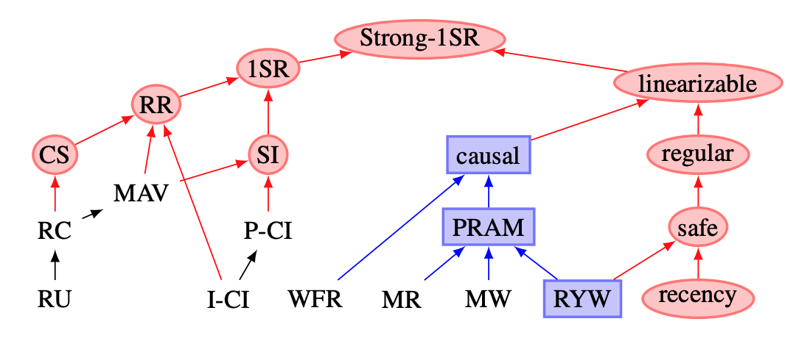

# Modelos
Modelos de consistência surgiram em dois mundos diferentes, o dos sistemas concorrentes (dos quais sistemas distribuídos fazem parte) e o dos bancos de dados.
Nos sistemas distribuídos, consistência diz respeito à execução conjuntos de operações individuais sobre objetos simples, como uma variável.
Nos bancos de dados, consistência se refere às garantias de dadas por transações, conjuntos de operações que leem e modificam diversos objetos em conjunto.
Apesar do ponto de partida disjunto, os dois pontos de vista podem ser unificados, apesar das nomenclaturas diferentes.
O universo de modelos, contudo, é vasto, conforme mostram as figuras adiante, com as classificações de
Bailis et. al[^highlyavailabletransactions] e Viotti & Vukolic[^consistency].

???todo "TODO"
     Juntar as duas imagens.

[^highlyavailabletransactions]: [Highly Available Transactions: Virtues and Limitations](http://www.vldb.org/pvldb/vol7/p181-bailis.pdf)

[^consistency]: [Consistency in Non-Transactional Distributed Storage Systems](https://arxiv.org/pdf/1512.00168.pdf)

###### Um banco de dados *to rule them all*
Para simplificar a discussão sobre modelos de consistência, usaremos um banco de dados para falar tanto sobre modelos para operações simples quanto para grupos de operações (transações), uma vez que bancos de dados são algo com o qual você já tem alguma familiaridade.

Neste contexto, um banco de dados pode ser pensado, de uma forma bem simplista, como uma tabela do tipo chave/valor.
As entradas desta tabela podem ser ser pensadas linhas de uma relação de um banco de dados ou como posições na memória de um computador (variáveis), e são manipuladas por comandos como **$X$ recebe 'João'** e **qual o valor de $Y$**.
Obviamente que $X$ e $Y$ não precisam ser declarados antes da primeira escrita, assim como chaves primárias não são declaradas até que sejam usadas, e que o valor associado a uma variável pode ter várias partes, como **"{'Endereço':'Av 1, número 2', 'Profissão':'Computeiro'}** e cada parte um tipo. 
Essa á uma simplificação dos bancos de dados, mas uma simplificação poderosa.

###### Expectativa x Realidade
Quando um processo se comunica com um banco de dados, ele o faz com certas expectativas quanto ao funcionamento deste banco.
Por exemplo, ao escrever um dados no banco, independentemente de como o banco é implementado, o cliente geralmente espera que as escritas aconteçam na ordem em que as disparou e que, ao ler uma variável, lhe seja retornado o "último" valor escrito na mesma.

Esta expectativa é independente do banco de dados ser implementado de forma distribuída ou não. 
Isto é, mesmo que os dados armazenados no banco sejam particionados ou replicados entre vários nós, o cliente espera que o banco tenha comportamento consistente com o de um banco não distribuído e retorne ou aquilo que escreveu ou algo mais recente.

!!!note inline end "Níveis de Consistência"
      * Consistência forte: leituras sempre retornam a versão mais recente do dado sendo lido.
           * Propagação instantânea ou *locks* dos dados sendo manipulados enquanto a propagação acontece.
      * Consistência fraca: leituras retornam algum dado escrito anteriormente.
           * Qualquer coisa vale
      * Consistência eventual: se não houver novas escritas, a partir de algum momento as leituras retornam a versão mais recente do dado sendo lido.
           * Propagação acontece no segundo plano

A expectativa, ou melhor, a forma como o banco de dados age dada uma interação com o cliente, ou clientes, é o que denominamos um **modelo de consistência**.

A grande dificuldade na implementação de qualquer modelo de consistência em um banco de dados distribuído vem do fato das operações não serem atômicas, como mostrado acima.
Se os processos estão em máquinas distintas, há uma naturalmente um tempo de propagação para os comandos e respostas, e a execução se parece mais com o seguinte, onde as operações são espalhadas no tempo.

O problema se agrava quando o próprio banco de dados é distribuído, replicado ou particionando seus dados. 
Para entender como isso afeta a implementação, considere a execução seguinte, em que cada cliente se comunica com uma réplica.
Neste caso, a operação de atualização de $Y$ para 20, que já havia terminado do ponto de vista do cliente de baixo, ainda não havia sido propagada para a réplica de cima, o que fez com que a leitura iniciada depois não visse o valor 20.

Para impedir execuções como esta, os processos devem coordenar suas ações, o que tem um custo em termos do desempenho do sistema, forçando a comunidade a buscar por modelos em que o custo seja menor mas que as garantias dadas ainda sejam úteis.

###### Consistência Forte e Fraca
O modelo de consistência descrito acima é denominado **linearabilidade**, também conhecida como **consistência forte**, e se implementar este modelo é difícil, a comunidade procura por modelos mais fáceis mas também úteis.
Em particular, recentemente os bancos de dados NOSQL se difundiram com a promessa de que podem ser úteis sem incorrer nos custos de coordenação, garantindo a chamada consistência ***eventual***, em que há a garantia de que atualizações estarão disponíveis a partir de algum momento para a leitura em todas as réplicas/partições, mas não há uma definição clara de quando isso ocorrerá.[^eventual]

[^eventual]: Enquanto no Português *Eventual* quer dizer **possivelmente**, no inglês quer dizer **em algum momento** não determinado, mas vindouro.

Enquanto consistência eventual traz melhoras de desempenho, trabalhar com este modelo implica em muito mais complexidade no desenvolvimento dos sistemas, pois o banco dá poucas garantias para o desenvolvedor.

Um terceiro modelo geral de consistência seria a consistência **fraca**, em que a única garantia é de que o valor retornado nas leituras foi escrito em algum momento (ou nenhum dado é retornado).
Na verdade, podemos pensar nos modelos de consistência como um espectro com **forte** e **fraca** nos extremos e diversos modelos, incluindo ***eventual***, no meio.
Diferentes bancos de dados oferecem diferentes modelos, com nomes parecidos ou até iguais e é preciso conhecer o que cada sistema está entregando para poder utilizá-lo da forma correta.
Nas seções seguintes, discutiremos alguns dos modelos, focando-nos em operações simples.

???todo "TODO"
     Versão simplificada da figura anterior, mostrando quais modelos serão discutidos.

<!--Além disso, os modelos podem ser divididos em **Centrados nos Dados**  e **Centrados nos Clientes**, sendo que no primeiro o modelo é definido em termos das garantias de consistência dos dados e, no segundo, em termos das garantias sobre o que os clientes veem.[^util]-->

[^util]: Caso esteja se perguntando se este modelo e estudo tem alguma serventia para você, afinal nos bancos de dados com que trabalhou ou trabalha as operações são agrupadas em **transações** e não executadas individualmente e as transações garantem ACID, lhe asseguro que sim e que falaremos em transações mais adiante.

## Linearabilidade (*linearizability*)

!!!example inline end "Linearabilidade"
     * Operação individual
     * Objeto individual
     * Execução atômica (pontual)

O modelo mais forte de consistência, para operações simples sobre objetos individuais é a **linearabilidade**,
que implica que operações aparentam executar atomicamente (acontece em um ponto indivisível da execução), respeitando a ordem temporal das operações, isto é, se uma operação $b$ foi iniciada depois que uma outra operação $a$ foi terminada, então, os efeitos de $a$ devem ser vistos antes dos efeitos de $b$.
A execução mostrada anteriormente, é um exemplo de execução linearizável.

Observe que a execução é equivalente à seguinte, onde não há concorrência entre operações (caixas com bordas arredondadas).[^multiplas]

[^multiplas]: Observe também que se $X$ e $Y$ forem considerados objetos diferentes, então estamos falando em duas execuções distintas, uma verde e outra vermelha, ambas linearizáveis.

De fato, cada operação poderia ser substituída por um único ponto e mesmo a distribuição poderia ser ignorada; tudo o que importa para que a execução seja linearizável são os efeitos das operações, não o fato do banco ser distribuído, replicado ou particionado.

Como já mencionamos, implementar este modelo mesmo em um sistema distribuído assíncrono demanda muita coordenação entre os processos, estendendo o tempo de execução de cada operação para "cobrir" esta coordenação. 
Reveja o exemplo seguinte, em que a operação de atualização de $Y$ para 20 não foi refletida na última leitura.

Para corrigir o problema, as réplicas precisam se "sincronizar" antes de executarem leituras.

## Consistência sequencial
A grande dificuldade em se garantir a linearabilidade vem da exigência das operações respeitarem uma ordem baseada no tempo de execução. Isso exige que haja uma sincronização entre os nós onde o dado é armazenado, a cada operação, o que pode se muito custoso.

