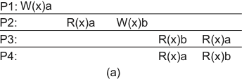

# Modelos Centrados nos Dados

???sideslide "Modelos de consistência"
    * Propagação por ordenação de operações
        * Linearabilidade: ordenação total que segue a linha do tempo.
        * Sequencial: ordenação total
        * Causal: ordenação causal
        * FIFO: ordenação FIFO
    * Propagação quando necessário
        * Consistência fraca geral
        * Consistência de entrada

###### Notação
{: style="width:800px"}

* A leitura de x em (a) retorna a
* A primeira leitura de x em (b) retorna Nil
* A segunda  leitura de x em (b) retorna a

#### Linearabilidade
Qualquer leitura de um objeto $X$ retorna o valor gravado em $X$ pela operação de escrita mais recente em $X$.

* O que quer dizer "mais recente" em um sistema distribuído assíncrono?
* Todas as operações de escrita são instantaneamente visíveis a todos os processos  *tempo global* é respeitado.
* Comportamento observado em um sistema sem conflitos ou centralizado

Em qual(is) cenário(s) temos consistência estrita?
{: style="width:800px"}

#### Consistência Sequencial
O resultado de qualquer execução é equivalente a alguma execução sequencial das operações dos processos e as operações da cada processo aparecem nesta execução sequencial na ordem especificada por seu programa.

 {: style="width:400px"}

 P2, P3, P4, P1, P4, P3

 {: style="width:400px"}

 P1 ou P2, qual veio primeiro?

#### Consistência Causal
Escritas com potencial relação causal são vistas por todos os processos na mesma ordem. Escritas concorrentes (não causalmente relacionadas) podem se vistas em ordens diferentes por processos diferentes.

{: style="width:400px"}

 W(x)b depende de R(x)a que depende de W(x)a 
 W(x)c e W(x)b são concorrentes.

{: style="width:400px"}

 W(x)b depende de R(x)a que depende de W(x)a. W(x)a deve ser ordenado com W(x)b. P3 não pode ter lido b e depois a.

 {: style="width:400px"}

#### Consistência FIFO
Escritas de um processo são vistas por todos os outros processos na ordem em que foram feitas. Escritas de diferentes processos podem ser vistas em ordens diferentes.

{: style="width:400px"}

#### Consistência de Entrada

###### Grupos de Operações

* Efeitos de operações individuais em um grupo não são visíveis.
* Variáveis de sincronização
     * Acesso às variáveis de sincronização da datastore é sequencialmente consistente.
     * Acesso à variável de sincronização não é permitido até que todas as escritas das anteriores tenham sido executadas em todos os lugares.
     * Acesso aos dados não é permitido até que todas as variáveis de sincronização tenham sido liberadas.
     * Transações tornam o trancamento/destrancamento de variáveis transparente.

###### Variáveis de sincronização
{: style="width:400px"}

{: style="width:400px"}

###### Locks
 Materializando variáveis de sincronização na forma de *locks*

* Lock de leitura só retorna quando todas as mudanças guardadas por aquele lock tiverem sido executadas no processo.
* Lock de escrita só retorna quando nenhum outro processo tiver um lock, de leitura ou escrita.
* Para ler uma variável, processo deve primeiro contactar o dono atual do lock cercando a variável, para pegar as mais recentes atualizações.

{: style="width:800px"}