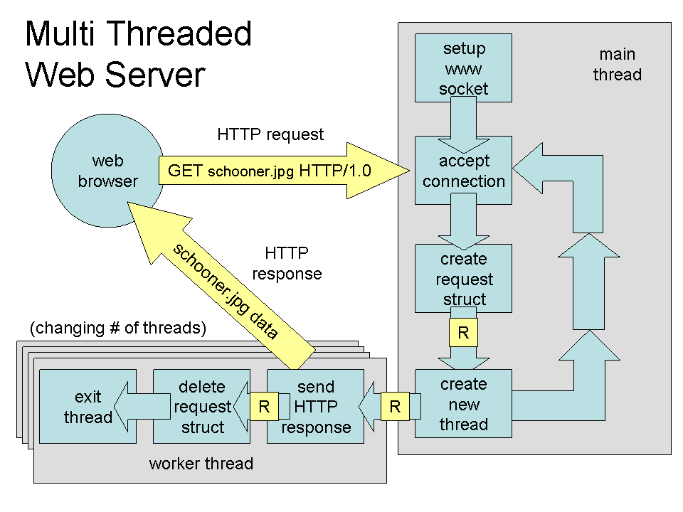
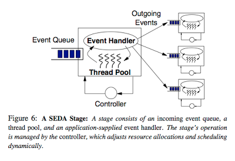

## Concorrência

Também importantes, de um ponto de vista prático do desenvolvimento, são os conceitos de concorrência e paralelismo, pois componentes pode necessitar manter várias "conversas" em paralelo com múltiplos outros componentes.


É impossível pensar em sistemas distribuídos sem pensar em concorrência na forma de múltiplos processos executando (normalmente) em hosts distintos e em termos de múltiplos *threads* nos processos.
Os exemplos apresentados até agora, consistem todos em um processo cliente requisitando ações de algum processo servidor.
Apesar disso, a interação entre tais processos aconteceu sempre de forma sincronizada, *lock-step*, em que o cliente requisitava o serviço e ficava bloqueado esperando a resposta do servidor para então prosseguir em seu processamento, e o servidor fica bloqueado esperando requisições que atende e então volta a dormir.
Este cenário, apresentado na figura a seguir, mostra que apesar do uso de processadores distintos e da concorrência na execução dos processos, temos um baixo grau de efetivo paralelismo; a requisição (2) só é processada depois que a resposta (1) é enviada.


Este modelo de sincronização entre as partes comunicantes é um exemplo de **E/S bloqueante**. 
O principal ponto positivo desta estratégia é a **simplicidade do código** e o principal ponto negativo é a **limitação do paralelismo** no uso de recursos, uma das razões de ser da computação distribuída.

Para usarmos melhor os recursos disponíveis, tanto do lado dos clientes quanto servidores, temos então que pensar em termos de eventos sendo disparados entre os componentes, que devem ser tratados assim que recebidos ou tão logo haja recursos para fazê-lo. 
Estes eventos correspondem tanto a requisições quanto a respostas (efetivamente tornando difícil a distinção).

No modelo bloqueante, quando um evento é disparado (no exemplo, a requisição), o sistema fica bloqueado até que um evento específico seja observado (no exemplo, a chegada da resposta).
Sempre que possível, um componente não deve ficar esperando por eventos em específico, aproveitando a chance executar outras tarefas; quando eventos são recebidos, são então atendidos. Esta é a forma de fazer **E/S assíncrona**.

Dada que processos interagem com a rede usando sockets, cuja interface mais simples para operações de leitura é bloqueante, neste curso não falaremos especificamene sobre E/S assíncrono[^asyncio] e por isso, para vermos como aumentar a concorrência no sistema, é necessário falar de *multithreading* e as várias formas em que aparecem nos sistemas.

[^asyncio]: Um bom ponto de partida para o tópico é a sua entrada na [wikipedia](https://en.wikipedia.org/wiki/Asynchronous_I/O).

Há duas razões claras para estudarmos *multithreading*. 
A primeira, de ordem prática, é a discutida acima: permitir o desenvolvimento de componentes que utilizem "melhormente" os recursos em um host.
A segunda, didática, é o fato que muitos dos problemas que aparecem em programação *multithread*, aparecem em programação multi-processo (como nos sistemas distribuídos), apenas em um grau de complexidade maior.
Para relembrar, há várias diferenças entre *threads* e processos, mas a abstração é essencialmente a mesma:

|| Processo | Thread |
-|----------|--------
Definição | Instância de um programa | "Processo leve"
Função de entrada | `main` | função "qualquer"
Compartilhamento de código e dados | Privado ao processo | Compartilhado pelos threads
Estado | Código, Stack, Heap, descritores (e.g, file descriptors), controle de acesso | Stack, variáveis locais 
Comunicação| IPC (*Inter Process Communication*): sockets, FIFO, memória compartilhada, etc  | IPC, mutex, variáveis de condição, semáforos, etc
Nível da implementação | Sistema operacional | Diferentes implementações 
API || Posix, C++, Java, ...
Bloqueio | Mudança de contexto para outro thread mesmo sem terminar quantum | Mudança de contexto para outro thread do mesmo processo
Tempo de criação, terminação e mudança de contexto| Demora mais | Demora menos


Vejamos como o uso de múltiplos threads podem melhorar o desenvolvimento de sistemas distribuídos na prática.
Considere os exemplos de clientes e servidores vistos [anteriormente](#tcp).
Imagine que em vez do serviço simples feito no exemplo, o servidor retorne uma página Web.
Detalhes do protocolo seguido por navegadores e servidores serão vistos mais tarde. Por agora, considere apenas que uma requisição `GET arquivo.html` será enviada para o servidor que lerá o arquivo especificado do sistema de arquivos; como você sabe, ler um arquivo é uma operação lenta e que não requer CPU.

### Cliente

Do ponto de vista do cliente, a vantagem do uso de múltiplos threads são claras: permite lidar com **várias tarefas concorrentemente**, por exemplo solicitar CSS, HTML e imagens concorrentemente, **escondendo latência** das várias operações, e permite **organizar código** em blocos/módulos.
Se você usar o console de desenvolvimento do navegador, verá como múltiplos arquivos são baixados em paralelo quando acessa um sítio. 
A figura a seguir mostra a carga do sítio da [Facom](https://www.facom.ufu.br).
O primeiro arquivo, `index.html` é baixado individualmente, mas uma vez que isso acontece e são determinados quais os demais arquivos necessários, requisições concorrentes são disparadas, minimizando o tempo total da operação.


Como outros exemplos, considere um formulário *online* em que a validação de um campo é executada enquanto o campo seguinte está sendo preenchido, ou um serviço de email em que arquivos são carregados enquanto a mensagem é confeccionada.


### Servidor

Do lado dos servidores há diversas possibilidades de uso de threads para aumentar o paralelismo no processamento de requisições, melhor utilizando recursos disponíveis e melhorando a experiência do usuário.


#### Single-threaded
A estratégia mais simples de se implementar é a de usar apenas um thread, como temos feito até agora.
Considere um servidor Web com esta esta característica; o fluxo no tratamento de uma requisição é exemplificado na pela figura a seguir:


0. O servidor é iniciado, criando o socket e invocando accept
1. o cliente envia a requisição para o servidor
2. o servidor aceita a conexão em seu único thread
3. uma tarefa é gerada para ler o arquivo
4. o arquivo é lido, de forma bloqueante, e uma resposta para o cliente é preparada
5. a resposta é enviada para o cliente, de forma bloqueante
6. a requisição é descartada
7. o thread do servidor volta a esperar uma nova requisição

Se novas requisições forem recebidas enquanto o servidor está executando os passos de 2 a 6, sejam requisições paralelas do mesmo cliente ou de um outro cliente, estas ficarão bloqueadas. 
A espera será maior quanto mais o servidor demorar para atender à primeira requisição, por exemplo, se precisar consultar um banco de dados ou carregar o arquivo requisitado do disco.
Para evitar que isto ocorra, o servidor pode usar mais threads.

#### Thread per request
O servidor pode criar um novo thread para cada nova requisição, permitindo que múltiplas requisições sejam tratadas concorrentemente.
Isto é, mesmo que um thread do servidor seja bloqueado por muito tempo, somente um cliente terá sua resposta atrasada (excluindo-se necessidades de coordenação entre múltiplos threads) e outros clientes podem continuar sendo atendidos normalmente, como mostrado na figura a seguir.



Lembre-se, entretanto, que o número de threads que se pode criar em um SO é limitado, pois cada thread usa recursos do SO. 
Além disso, a criação e destruição de threads é cara pois é feita por meio de uma chamada de sistema, pelo kernel, e portanto implica em alternar entre modo usuário e modo protegido.
Se possível, devemos evitar a criação de novos threads em aplicações com requisitos de desempenho, e recliclá-los pode ser uma boa estratégia.

#### Thread pool
Para reciclarmos threads, podemos criar *pools*, um balde de threads que são usados quando necessário e devolvidos para o balde quando não mais.
No cerne desta abordagem, junto com o *pool* de threads, fica uma fila bloquenante na qual tarefas são inseridas e de onde os threads tentam retirá-las.

Como a fila é bloqueante, se estiver vazia, o thread é bloqueado e para de consumir recursos. Tão logo nova tarefa seja inserida, a fila acorda os threads para que a processem. Para garantir a corretude no processamento, a fila deve ser **thread-safe**, isto é, que se mantem correta mesmo quando múltiplos threads operam nela tanto para inserir quanto remover tarefas.

Na figura, um thread principal é encarregado de receber as requisições e colocar na fila bloqueante; se a fila fica cheia, o thread principal fica bloqueado esperando por espaço, fazendo com que novas conexões tenham que esperar.

[](https://www3.nd.edu/~dthain/courses/cse30341/spring2009/project4/project4.html)

Os threads do pool removem uma tarefa da fila, a tratam e, ao final do atendimento,  pegam nova requisição na fila, em um loop infinito; requisições que demandam menor processamento liberam o thread mais rapidamente para que pegue nova tarefa.
Se todas as tarefas são pequenas, os threds ficarão bloqueados por muito tempo. Se todas são grandes, as tarefas se acumularão na fila.
Por isso é importante dimensionar bem o tamanho to *pool*, ou mesmo torná-lo dinâmico para que use menos recursos (threads) quando não necessário e não deixe tarefas pendentes por muito tempo. 

Se considerarmos que cada tarefa na verdade tem várias partes, 
é possível refinar mais este modelo, quebrando o processamento em vários pools.

#### Estágios
Na arquitetura baseada em estágios, e.g.,  **Staged Event-Driven Architecture**, SEDA, cada **estágio**, cada estágio é responsável por processar uma parte da tarefa, passada adiante até que seja completada.[^seda]

[^seda]: O artigo [SEDA: An Architecture for Well-Conditioned, Scalable Internet Services](http://www.sosp.org/2001/papers/welsh.pdf) descreve em detalhes a arquitetura SEDA.


[](http://images.cnitblog.com/blog/13665/201306/15180500-a54c8eb3d73246469f1b74ee74f2119b.png)

Uma característica importante deste modelo é que cada estágio pode ser escalado individualmente de acordo com a demanda uma vez que cada estágio tem seu próprio *pool*. Por exemplo, se um estágio faz algum cálculo leve, então poucos *threads* são necessários ao mesmo. Já um estágio que precise efetuar E/S talvez precise mais *threads*, uma vez que estes ficam bloqueandos enquanto a operação é executada. [^ioasync]

[^ioasync]: Pode-se argumentar que E/S assíncrona resolveria o problema aqui, mas isso não vem ao caso.

[](http://images.cnitblog.com/blog/13665/201306/15180500-a54c8eb3d73246469f1b74ee74f2119b.png)


### Desafios

Embora a ideia de usar múltiplos threads seja melhorar desempenho e experiência do usuário, fazê-lo efetivamente é não trivial.
Vejamos por exemplo o problema do falso compartilhamento; considere o seguinte pseudo-código:

```c
...
int32 X;
int32 Y;

thread1 = tread_new(threadfunction, &X);
thread2 = tread_new(threadfunction, &Y);

void threadfunction(int32 * exclusivo) {
    int32 local = *exclusivo;
    while (true) {
        local = processa(local);
        *exclusivo = local;
    }
}
...
```

Cada um dos threads criados acessa exclusivamente uma das variáveis. Logo, não há interferência entre as threads e se cada uma for colocada em um processador diferente, executarão no máximo de seu potencial, correto?
Não exatamente, pois mesmo este código simplíssimo podemos sofrer de [falso compartilhamento](https://dzone.com/articles/false-sharing).
Isto acontece, por exemplo, se cada linha da cache do sistema onde este programa executa tiver 8 ou mais bytes de comprimento. Como tanto `X` quanto `Y` no programa tem 4 bytes, as duas variáveis poderão ficar na mesma linha da cache e toda vez que uma thread modificar uma variável a cache da outra será invalidada para leitura.


Para que isto não ocorra, é preciso se certificar que as variáveis fiquem em linhas diferentes da cache; no exemplo, poderia-se definir X e Y como vetores do tamanho da linha da cache e usar efetivamente apenas a primeira posição de cada vetor.

Se o compartilhamento for real, por exemplo se ambos os threads usarem a variável X, então o problema não será tão facilmente resolvível.
Neste caso, poder-se-ia definir afinidade entre threads, isto é, notar quais threads compartilham estado de forma que threads afins sejam colocados nos mesmos processadores e compartilhem as mesmas memórias. 
Isto torna muito mais fácil e eficiente o controle de concorrência, do ponto de vista do SO e hardware.


???- info inline end "Multiprogramação"
     

Fazer esta divisão pode ser complicado pois a relação de compartilhamento entre threads pode ser complexa em função da tarefa sendo resolvida, por exemplo, se diferentes threads compartilharem diferentes variáveis uns com os. Ainda que que uma configuração ótima em termos de afinidade exista, encontrá-la pode ser custo.
Ainda assim, precisamos lidar com estado compartilhado e enfrentar condições de corrida de forma a não levar a **inconsistências** na executação de tarefas, nos referindo a inconsistência aqui como qualquer desvio no comportamento do programa daquilo que foi especificado pelo desenvolvedor.
Para isso, usamos as primitivas de controle de concorrência que estudaram em SO, que também tem seus problemas em potencial, como **deadlocks** e **inanição**.
Veja o seguinte vídeo para uma análise de diversos pontos importantes no uso de multithreads.

<iframe width="560" height="315" src="https://www.youtube.com/embed/JRaDkV0itbM" frameborder="0" allow="accelerometer; autoplay; encrypted-media; gyroscope; picture-in-picture" allowfullscreen></iframe>


### Estado
A questão das regiões críticas está intimamente relacionada à questão da manutenção de estado nos servidores.
Quanto a este respeito, podemos classificar servidores como **stateful** e **stateless**, dois termos que ouvirão frequentemente enquanto trabalhando com SD.

???- info inline end "To state or not to state?"
      * Complexidade e desempenho
      * Falhas
      * Balanceamento

O "state" nos dois nomes se refere ao estado mantido por um serviço para atender a requisições.
Caso mantenha estado, por exemplo informando em quais arquivos o cliente está interessado, fica mais fácil para o servidor continuar o trabalho feito em requisições anteriores.
Imagine por exemplo que um cliente esteja acessando linhas em um banco de dados, de forma paginada: a cada requisição, o cliente recebe $n$ novas linhas para processar e, quando estiver pronto, requisite $n$ novas linhas.
Imagine quão infeficiente seria se o servidor seguisse o seguinte fluxo:

1. receba requisição informando a última linha lida
2. recalcule todas as respostas para consulta
3. salte até a linha informada pelo cliente
4. retorne as próximas $n$ linhas para o cliente
5. feche o resultado da consulta.

Se em vez disso o servidor mantiver um mapa com consultas recentes, em que a chave seja algum identificador do cliente e o valor uma *visão*  dos resultados; a cada nova requisição, basta o servidor resgatar a visão usando o identificador do cliente e selecionar as seguintes $n$ entradas da visão. Manter o mapa como estado acelera o processamento e melhora a experiência do usuário, neste caso.
Por outro lado, considere que múltiplos clientes fazem consultas concorrentemente: quanto recurso seria necessário para que o servidor mantenha a visão de todos os clientes?

Também a complexidade do servidor aumenta. Considere as algumas de muitas perguntas possíveis neste cenário:

* Como o servidor mantém as respostas a novas requisições consistentes com as respostas anteriores? E se linhas são removidas ou inseridas no banco de dados?
* Se múltiplos servidores existem, como compartilhar os estado entre os mesmos?
* Se o cliente resolva não fazer mais requisições, por exemplo por ter encontrado o que procurava, por quanto tempo o servidor deve manter a visão aberta?

Você já deve ter adivinhado que no primeiro exemplo temos um servidor *stateless* e no segundo um *stateful*, e percebido que cada um tem suas vantagens e desvantagens.
Vejamos mais algumas.

#### Sessão

Essencialmente, o servidor *stateless* não mantem informação sobre a sessão do cliente e requer que a cada nova requisição, quaisquer informações necessárias para realizar a tarefa requisitada sejam novamente fornecidas ao servidor.
No caso *stateful*, o servidor pode se lembrar, como no exemplo anterior, até onde o trabalho já foi executado, quais arquivos o cliente manipulou (e mantê-los abertos), qual o endereço o cliente e enviar-lhe notificações importantes (e.g., "Novo dado inserido!").

#### Falhas

Enquanto servidores *stateful* obviamente levam a melhor desempenho no *happy path* (contanto que recursos suficientes sejam providos), no caso de falhas, serviços *stateless* tendem a voltar ao ar mais rapidamente, uma vez que não há estado que precise ser recuperado.
Pela mesma razão, clientes que percebem que um servidor falhou podem rapidamente se dirigir a outros servidores e continuar suas requisições de onde estavam, uma vez que são detentores de toda a informação necessária para o próximo passo do processamento.

Lidar com falhas também introduz outro requisito aos servidores: memória estável.
Para que possa o recuperar o estado anterior à falha, o servidor precisa colocar o estado em algum lugar que independa do processo para se manter, por exemplo,
[nvRAM](https://en.wikipedia.org/wiki/Non-volatile_random-access_memory), [SSD](https://en.wikipedia.org/wiki/Solid-state_drive) ou [spindles](https://en.wikipedia.org/wiki/Hard_disk_drive#Spindle).
A perda deste estado implicaria na incapacidade de prover o serviço corretamente.
Um projeto *stateless* não depende deste estado e por isso pode ser mais rapidamente recuperado, replicado ou substituído.

#### Stateless x Stateful

Não surpreendentemente, a resposta para "qual abordagem é melhor, *stateful* ou *stateless*?" é **depende**.
Ambos as opções tem suas vantagens e desvantagens e para algums serviços apenas uma opção será viável.
Se seu serviço precisa manter estado (um SGBD, por exemplo), ele terá que manter estado, mesmo que não sobre clientes.
Veja um pequeno comparativo das características das duas abordagens.


| Stateless | Stateful |
|-----------|----------|
| Resultado depende da entrada| Depende do histórico de entradas |
| Qualquer servidor pode atender | Mesmo servidor deve atender |
| Não promete notificar o cliente | Assina contrato com o cliente |
| Repete operações | Aproveita resultados anteriores |
| Não fica inconsistente com relação ao cliente | Pode ficar inconsistente se perder estado ou conexão feita com outro servidor |
| re-autenticação (mesmo que simplficada) a cada requisição | Autentica no começo da sessão |


### Multithread na prática

#### POSIX

[POSIX Threads](https://en.wikipedia.org/wiki/POSIX_Threads) ou PThreads, são uma definição **aberta** de como *threads* devem funcionar em sistemas operacionais.
Várias implementações desta especificação estão disponíveis tanto para sistemas Unix, que se esforçam para ser compatíveis com especifições POSIX, mas também para Windows, via subsistemas que compatibilizam diferentes API.
Além disso, mesmo implementações não POSIX tem funcionalidade equivalentes e, por este motivo, entender POSIX servirá de base para entender quaisquer API para programação *multi-threaded*.

Para se definir um *thread*, é necessário definir uma função de entrada, que será para o *thread* como a função `main` é para o processo em si.
No exemplo a seguir a função foi definida com retorno `void *` e com único parâmetro, também `void *`; esta é uma obrigatoriedade para funções de entrata PThread.
Observe contudo que `void *` pode ser tratado como um blob para mascarar outros tipos de dados, por exemplo um vetor, um ponteiro para uma enumeração ou uma `struct`.
Também observe que a função tem uma variável local `my_id` que só está definida no contexto da thread (linha 8); se múltiplas *threads* forem instanciadas, cada uma terá a sua versão da variável. 
Há também uma variável global `thread_count`, compartilhada por todas as instâncias (linha 5).

```c
#include <stdio.h>
#include <stdlib.h>
#include <pthread.h>
	
int thread_count;

void* hello(void* id) {
	long my_id = (long) id;
	printf("Hello from thread %ld of %d\n", my_id, thread_count);
	return NULL;
}
```

Um *thread*  é criado pela função `pthread_create` (linha 14), que coloca em um `pthread_t` um *handle* para o *thread*.
O *handle* do *thread* deve ser alocado previamente à função de criação do *thread* (linha 11).
A função recebe como parâmetros opções para configuração, a função de entrada, e o parâmetro do tipo `void *`.

```c
int main(int argc, char* argv[]) {
	long thread;
	pthread_t* thread_handles;
	
	if(argc < 2) {
		printf("usage: %s <number of threads>", argv[0]); 
		return 1;
	}
	
	thread_count = strtol(argv[1], NULL, 10);
	thread_handles = malloc(thread_count*sizeof(pthread_t));
	
	for (thread = 0; thread < thread_count; thread++)
		pthread_create(&thread_handles[thread], NULL, hello, (void*) thread);
	
	printf("Hello from the main thread\n");
```

É possível esperar pelo fim da execução do *thread* usando o `pthread_join`, que recebe como parâmetro o *handle* do *thread* e um ponteiro para onde o resultado da função de entrada deve ser colocado, do tipo `void **` (linha 2). No exemplo, nenhum retorno é esperado, então um endereço nulo é passado como parâmetro.
Ao final da execução, o *handle* deve ser liberado (linha 4).

```c
	for (thread = 0; thread < thread_count; thread++)
		pthread_join(thread_handles[thread], NULL);
	
	free(thread_handles);
```


Para executar um programa PThread, compile com
```bash
gcc -pthread teste.c -o teste
```
e execute com
```bash
./teste 5
```
e observe que a saída das threads é *ordenada*. 

Agora experimente
```bash
./teste 200
```
Observe que a saída é desordenada (pode ser necessário executar múltiplas vezes ou aumentar de 200 para, digamos, 1000 para observar a desordem.
Isto acontece porquê a execução das threads independe da ordem de criação.
De fato, usando PThreads, temos pouco controle sobre os threads que criamos. 
Mas isto não quer dizer que estamos "órfãos" de API; várias outras operações podem ser executadas, e podem ser encontradas a partir do [manual de `pthread_create`](http://man7.org/linux/man-pages/man3/pthread_create.3.html). Alguns exemplos interessantes:

* `pthread_tryjoin` - espera thread terminar
* `pthread_exit` - termina a thread e retorna resultado 
   > An implicit call to `pthread_exit()` is made when a thread other than the thread in which `main()` was first invoked returns from the start routine that was used to create it. The function's return value serves as the thread's exit status. [Manual de `pthread_exit`](http://man7.org/linux/man-pages/man3/pthread_exit.3.html).
	
* `pthread_attr_setaffinity_np` - ajusta afinidade dos threads.

#### Python

Em Python, como seria de se esperar, há várias formas de se trabalhar com *threads*. 
O exemplo a seguir usa o pacote `thread` e é essencialmente um envólucro POSIX.

```python
#!/usr/bin/python
import thread
import time

# Define a function for the thread
def print_time( threadName, delay):
   count = 0
   while count < 5:
      time.sleep(delay)
      count += 1
      print "%s: %s" % ( threadName, time.ctime(time.time()) )

# Create two threads as follows
try:
   thread.start_new_thread( print_time, ("Thread-1", 2, ) )
   thread.start_new_thread( print_time, ("Thread-2", 4, ) )
except:
   print "Error: unable to start thread"

while True:
   pass
```

Já o próximo exemplo usa o pacote `threading` e uma abordagem orientada a objetos. Observe que há momentos distintos no ciclo de vida do thread em que acontece a criação e o início da execução.

```python
#!/usr/bin/python

import threading
import time

exitFlag = 0

class myThread (threading.Thread):
   def __init__(self, threadID, name, counter):
      threading.Thread.__init__(self)
      self.threadID = threadID
      self.name = name
      self.counter = counter
   def run(self):
      print "Starting " + self.name
      print_time(self.name, self.counter, 5)
      print "Exiting " + self.name

   def print_time(threadName, counter, delay):
      while counter:
         if exitFlag:
            threadName.exit()
         time.sleep(delay)
         print "%s: %s" % (threadName, time.ctime(time.time()))
         counter -= 1

# Create new threads
thread1 = myThread(1, "Thread-1", 1)
thread2 = myThread(2, "Thread-2", 2)

# Start new Threads
thread1.start()
thread2.start()

print "Exiting Main Thread"
```

Uma consequência desta divisão é que um mesmo objeto do tipo `Thread` pode ser reciclado e executado várias vezes.

#### Java

Outro exemplo importante de API para multithreading é a do Java, pois nesta linguagem há, essencialmente, duas formas de se conseguir concorrência. 
A primeira é via instâncias explícitas da classe `Thread` e, a segunda, via abstrações de mais alto nível, os `Executors`.
Aqui nos focaremos em aspectos básicos de concorrência na linguagem, mas esteja ciente de que a mesma é muito rica neste tópico, por exemplo provendo diversas estruturas para comunicação e coordenação de *threads* no pacote `java.util.concurrent`.
Uma ótima documentação sobre o uso de *threads* e estruturas é dispobinilizada pela [Oracle](https://docs.oracle.com/javase/tutorial/essential/concurrency/).

Há duas formas básicas de definir um novo *thread* em Java, ou via extensão da classe `Thread` ou via implementação da interface `Runnable`; observe o quão pouco muda no código dos exemplos a seguir.
Note também que, nos dois exemplos, um método `run()` é implementado com o código a ser executado pelo *thread* mas que em nenhum momento tal método é invocado diretamente.
Em vez disto, o método `start()` é que é invocado, porquê antes de executar as instruções definidas pelo pelo programador no método `run()`,
a máquina virtual precisa executar alguma "mágica" por baixo dos panos como, por exemplo, solicitar ao sistema operacional a criação de um *thread* do SO, que servirá de hospedeiro para o *thread* Java. 
Isto acontece dentro do `start()`, que em algum ponto de sua execução levará à invocação do método `run()`.

=== "Thread"
    ```Java
    public class Hello extends Thread {
        public void run() {
            System.out.println("Hello from a thread!");
        }

        public static void main(String args[]) {
            Thread t = new Hello();
            t.start();
        }
    }
    ```

=== "Runnable"
    ```Java
    public class Hello implements Runnable {
        public void run() {
            System.out.println("Hello from a thread!");
        }

        public static void main(String args[]) {
            Thread t = new Thread(new Hello());
            t.start();
        }
    }
    ```
Além de servider base para outras classes, a classe `Thread` também provê uma série de métodos que permitem gerenciar a vida dos *threads* criados.
Por exemplo, o método de classe `Thread.sleep()` permite bloquear o thread no qual a invocação aconteceu por um determinado período.

```Java
public class Hello implements Runnable {
    public void run() {
        for (int i = 0; i < 10; i ++){
            System.out.println("Hello at instant " + i);
            try {
                Thread.sleep(1000);
            } catch (InterruptedException ie) {
                System.out.println("awoken");
            }
        }
    }

    public static void main(String args[]) {
        Thread t = new Thread(new Hello());
        t.start();
    }
}
```

Observe que a chamada a `sleep()` deve estar dentro de um bloco `try/catch`, pois é permitido à JVM acordar o *thread* em qualquer instante, antes ou após o tempo especificado. 
Assim, embora normalmente o tempo "dormido" seja próximo ao especificado, se há requisitos de precisão, é sugerido que a *thread* durma em pequenas frações até chegar ao valor total e que, ao acordar, verifique se já não dormiu o suficiente.
No exemplo seguinte, o *thread* dorme por pelo menos 1000 milissegundos a cada iteração.

```Java
public class Hello implements Runnable {
    public void run() {
        for (int i = 0; i < 10; i ++){
            System.out.println("Hello at instant " + i);
            long before = System.currentTimeMillis();
            long timeout = 1000;
            while(before + timeout > System.currentTimeMillis()){
                try {
                    Thread.sleep(Math.max(0,System.currentTimeMillis() - (before + timeout)));
                } catch (InterruptedException ie) {
                    System.out.println("awoken");
                }
            }
        }
    }

    public static void main(String args[]) {
        Thread t = new Thread(new Hello());
        t.start();
    }
}
```

Quando um *thread* está sendo executado, outros podem ter que esperar até que complete. Por exemplo, no caso de um navegador
Web, o *thread* que faz a renderização da página não pode começar a trabalhar enquanto o *thread*  que solicitou o HTML
do servidor não receber sua resposta. Um *thread* indica a intenção de esperar por outro usando o método `join()`.


```Java
public class Hello implements Runnable {
    public void run() {
        Random rand = new Random();
        for (int i = 0; i < 10; i ++){
            System.out.println("Hello at instant " + i);
            long before = System.currentTimeMillis();
            long timeout = 901 + rand.nextInt(200);
            while(before + timeout > System.currentTimeMillis()){
                try {
                    Thread.sleep(Math.max(0,System.currentTimeMillis() - (before + timeout)));
                } catch (InterruptedException ie) {
                    System.out.println("awoken");
                }
            }
        }
    }

    public static void main(String args[]) {
        Thread t = new Thread(new Hello());
        //t.setDaemon(true);
        t.start();
        try {
            t.join();
            //t.join(10000);
        } catch (InterruptedException ie) {
            System.out.println("Waiting was interrupted");
        }
        if (t.isAlive())
            System.out.println("Got tired of waiting");
        else
            System.out.println("Wait is over");
    }
}
```

Invocar `t.join()` fará com que o *thread* corrente, neste caso o principal, espere indefinidamente até que `t` termine de executar.
Caso seja necessário limitar o tempo de espera, um limite pode ser especificado como na linha comentada.
Caso a espera termine por causa de um *timeout*, é possível testar o estado atual do thread com `Thread.isAlive()`.

Outro método interessante, `Thread.setDaemon()`, especifica que o *thread* pode ser terminado quando a *thread* principal terminar. Descomente a invocação e teste o efeito.

!!! question "Exercício: contador"
    Façamos um exercício simples do uso de *threads*. Considere a classe e siga as instruções abaixo.

    ```Java
    class Counter {
        private int c = 0;

        public int increment() {
            return ++c;
        }

        public int decrement() {
            return --c;
        }

        public int value() {
            return c;
        }
    }
    ```

    * Instancie um programa que gere 10 *threads*. 
    * Todos os *threads* devem compartilhar **uma mesma instância** de `Counter`
    * Cada *thread* deve executar um *loop* em que incrementa o valor do contador 20 vezes 
      * a cada vez, imprime o resultado precedido do identificador do *thread* (use `Thread.getName()` ou `Thread.currentThread().getName()`)
    * A *thread*  principal deve esperar todas as outras terminarem antes de terminar (use `Thread.join()`).
    * Analise a saída do programa observando a ordem de execução dos *threads*.


    ???note "Análise"
        É fácil observar que a saída do programa é aleatória nos identificadores e tende a ser incremental nos contadores, mas nem sempre isso é verdade. Isso acontece porquê a execução dos *threads* é não determinística; uma vez que estejam prontos para executar, cabe ao escalonador do sistema operacional a decisão sobre qual processo e em qual processador deverá executar.
    
Além de extensão de `Thread` e implementação de `Runnable`, Java disponibiliza também `ExecutorService` como abstração de mais alto nível para execução de tarefas concorrentes.
Os `ExecutorService`, de forma genérica, provê o acesso a *pools* de *thread* e a API para submeter tarefas para este pool.
Para iniciar tal processo, você pode criar um executor service usando uma das muitas fábricas providas pela classe [`Executors`](https://docs.oracle.com/javase/7/docs/api/java/util/concurrent/Executors.html) ou pela instanciação de *thread* *pools*  diretamente.
O mais simples é o de tamanho fixo em que há um número inicial de *threads* criados e que, no caso de algum ser terminado, por exemplo por causa de uma exceção não tratada, cria substitutos para manter o número constante.


```java
ExecutorService es1 = Executors.newFixedThreadPool(10);
ExecutorService es2 = new ThreadPoolExecutor(1, 1, 0L, TimeUnit.MILLISECONDS, new LinkedBlockingQueue<>());
```

Uma vez criado o executor, você atribui tarefas para serem executadas, que devem implementar `Runnable` ou `Callable`.
No caso de `Runnable`, você pode usar o método `execute` para executá-las em algum momento, sem a possibilidade de retorno de resultados.


=== "Implements"
    ```java
    class MyRunnable implements Runnable {
        public void run(){
            System.out.println("R0");
        }
    }

    Runnable r = new MyRunnable();

    es1.execute(r);
    es1.execute(r);
    es2.execute(r);
    ```

=== "Anônimo"
    ```java
    Runnable r = new Runnable() {
        public void run(){
            System.out.println("R1");
        }
    }

    es1.execute(r);
    es1.execute(r);
    es2.execute(r);
    ```

=== "Lambda"
    ```java
    Runnable r = () -> {
        System.out.println("R2");
    }

    es1.execute(r);
    es1.execute(r);
    es2.execute(r);
    ```


Já usando `Callable`, é possível retornar resultados na forma de `Future<T>`. No exemplo a seguir, a `c` retorna um `Integer`, e portanto `submit` retorna `Future<Integer>`; para acessar o resultado, use `Future<>.get()`:

```java
Callable<Integer> c = () -> {
    System.out.println("C1");
    return 3;
}

Future<Integer> f = es1.submit(c);

/* Outras tarefas... */

int resultado = f.get();
```

Outros métodos interessantes dos `ExecutorService` são `invokeAny()` e `invokeAll()`, que permitem passar uma lista de tarefas e retornam o resultado de qualquer tarefa ou implica na execução de todas, respectivamente.

Alguns executores são interessantes por razões diferentes. Primeiro, o `ForkJoinPool` é um executor interessante por funcionar da seguinte forma: 

```
if (my portion of the work is small enough)
  do the work directly
else
  split my work into two pieces
  invoke the two pieces and wait for the results
```

Segundo, os `ScheduledExecutorService` permitem a execução agendada ou periódica de tarefas, por exemplo:

```java
ScheduledExecutorService es3 = Executors.newSingleThreadScheduledExecutor();
Future<Integer> f = executorService.schedule(c, 1, TimeUnit.SECONDS);
//Executa a cada 5 segundos, depois de esperar por 1 segundo para começar. 
executorService.scheduleAtFixedDelay(r1, 1000, 5000, TimeUnit.MILLISECONDS);
//Como a anterior, mas pode atrasar a próxima invocação para permiter à anterior que termine.
executorService.scheduleAtFixedRate(r1, 1000, 5000, TimeUnit.MILLISECONDS);
```


#### Coordenação
Como visto no exercício anterior, a execução de *threads* é não determinística. Contudo, estas execuções frequentemente precisam ser coordenadas para que não pisem uns nos calcanhares dos outros, por exemplo, decidindo quem deve ser o próximo a entrar em uma região crítica ou será o responsável por uma determinada tarefa. 

Há várias astrações que podem ser usadas para coordenar as operações de *threads*, como deve se lembrar no estudo de Sistemas Operacionais. Alguns exemplos são *locks*, variáveis de condição e semáforos.

Especificamente em Java, provavelmente a abstração mais simples são os blocos `synchronized`.

###### `synchronized`
Ao definir métodos como `synchronized`, garante-se que os mesmos nunca serão executados concorrentemente. 
Observe a classe a seguir, que modifica o contador do exercício anterior.

```Java
public class SynchronizedCounter {
    private int c = 0;

    public synchronized int increment() {
        return ++c;
    }

    public synchronized int decrement() {
        return --c;
    }

    public synchronized int value() {
        return c;
    }
}
```

Caso dois *threads* invoquem os métodos `increment` e `decrement` ao mesmo tempo, por exemplo, a JVM fará com que um dos *threads* pare sua execução até que o outro tenha completado a invocação.
Isto não quer dizer que executar o exercício anterior com esta versão do contador levará a saídas com incrementos completamente sequenciais, pois um *thread*  poderia parar de ser executado logo após incrementar o contador, depois de terminado o método `increment`, e só voltar a executar depois que outro tenha incrementado e impresso na tela o valor obtido. 
O que quer dizer é que, mesmo que saídas estranhas existam, cada método foi executada integralmente antes da operação seguinte.

!!!question "Exercício: synchronized"
    Modifique o código do exercício anterior para usar a versão `synchronized` do contador. Depois de executá-lo, adicione um `println("Dentro: " + c)` **dentro** do método de incremento para verificar que estas saídas acontecem ordenadamente.


`synchronized` funciona porquê limita a concorrência, mas é problemático exatamente pela mesma razão. 
Por isso, é essencial que o `synchronized` seja o mais limitado possível em termos de escopo, o que nos leva ao uso de `synchronized` em blocos de código menores que métodos. Por exemplo:

```Java
public class Namer {
    String lastName = null;
    int nameCount = 0;

    public void addName(String name) {
       lastName = name;
        synchronized(this) {
           nameCount++;
        }
        nameList.add(name);
    }
}
```

Neste caso, blocos sincronizados **no mesmo objeto**, não são executados concorrentemente, mas outros blocos sim.

!!!question "Exercício: bloco synchronized"
    Neste exercício, use dois objetos para travar o acesso a dois contadores. Instancie um programa com dois *threads*  tal que:

    * executem um loop 1000 vezes em que
    * o primeiro *thread* primeiro invoca `inc1` e depois `inc2`
    * o segundo *thread* primeiro invoca `inc2` e depois `inc1`
    * ambos os threads imprimem o valor de `c1` e `c2`

    ??? tip "Análise"
        ```Java
        public class MsLunch {
            private long c1 = 0;
            private long c2 = 0;
            private Object lock1 = new Object();
            private Object lock2 = new Object();

            public void inc1() {
                synchronized(lock1) {
                    c1++;
                }
            }

            public void inc2() {
                synchronized(lock2) {
                    c2++;
                }
            }
        }
        ```


###### Sinalização
Usados corretamente, o bloco `synchronized` é executado de forma atômica, isto é, indivisível.
Algumas operações muito simples são naturalmente atômicas, e não precisam ser "protegidas" pelo `synchronized`.
Por exemplo, leituras e escritas de tipos básicos como `int`, `char` e `byte`, mas não `long` ou `double`, pois usam mais de uma palavra em algumas arquiteturas, ou variáveis declaradas `volatile`.
Usando estas variáveis, é possível coordenar *threads*, como no exemplo a seguir.

```Java
boolean condicao = false;

...

public void espereCondicao() {
    while(!condicao) {}
    System.out.println("condicao alcancada.");
}

...

public void satisfacaCondicao() {
    condicao = true;
}
```


Embora correta, esta abordagem, conhecida como **espera ocupada**, não é eficiente pois desperdiça computação.
Felizmente, em Java, todos os objetos implementam os métodos `wait` e `notify/notifyAll`, que podem ser usados para sincronizar eficientemente *threads*.

```Java
public class Sync{
   Object synch = new Object();
   boolean condicao = false;
   public void espereCondicao() {
      while(!condicao) {
         try {
             synchronized(synch){
                 synch.wait();
             }
         } catch (InterruptedException e) {}
      }
      System.out.println("Condicao alcancada");
   }
...
   public void satisfacaCondicao() {
      condicao = true;
      synchronized(synch){
          synch.notifyAll();
      }
   }
}
```

Neste exemplo a execução da função `espereCondicao` é "pausada" por `#!java synch.wait()` até que uma notificação seja enviada via `#!java sync.notifiyAll()`, na função `#!java satisfacaCondicao()`.
Observe que estas operações só podem ocorrer dentro de blocos sincronizados na variável usada na sinalização.

###### *Locks*
Outras abstrações para coordenação de *threads* estão disponíveis no pacote `java.util.concurrent`. 
As mais simples delas são `java.util.concurrent.locks.Lock` e `java.util.concurrent.locks.ReentrantLock`. 
Veja um exemplo de uso, notando o idioma de uso dentro de block `try/catch/finally`, que garante que o *lock* será liberado a despeito de exceções no bloco.

```Java
Lock l = new ReentrantLock();
  l.lock();
  try {
     // access the resource protected by this lock
  } finally {
     l.unlock();
  }
```

Como bem sabido, o uso dos "locks" em ordens diferentes pode levar a um *deadlock* pois um ciclo de dependências pode ser formado entre locks, detentores de locks e interessados em locks. O grafo de dependência seguinte exemplifica o cenário, em que o *thread* T1 obteve o lock2 e tenta obter o lock1, e o *thread* T2 obteve o lock1 e tenta obter o lock2.


###### Estruturas *thread-safe*

Finalmente, Java também disponibiliza estruturas de dados que podem ser acessadas concorrentemente por múltiplos *threads* sem risco de corrupção, denominadas *thread-safe*.

* `BlockingQueue` - bloqueia *threads*  se não houver elementos na fila.
* `ConcurrentMap/ConcurrentHashMap` - operações atômicas;
   * `if (!m.containsKey(k)) m.put(k,v);`
   * `vOld = m.putIfAbsent(k,v);`

###### Tipos Atômicos

```java
import java.util.concurrent.atomic.AtomicInteger;

class AtomicCounter {
    private AtomicInteger c = new AtomicInteger(0);

    public void increment() {
        c.incrementAndGet();
    }

    public void decrement() {
        c.decrementAndGet();
    }

    public int value() {
        return c.get();
    }
}
```


###### ThreadLocal
```java
private static ThreadLocal<Integer> myId = new ThreadLocal<Integer>() {
   public Integer initialValue() {
      return new Random().nexInt();
   } 
};

public static Integer getMyId() { 
    return myId.get();
}
```


!!! question "Exercício - Anel Multithread"
    * Usando uma linguagem de alto-nível como C/C++/Java, escrever um programa que crie 30 threads e faça com que uma mensagem circule entre os mesmos. 
    * A mensagem é uma string aleatória de pelo menos 80 caracteres. 
    * A cada vez que um thread recebe a mensagem ele a imprime, modifica o primeiro caractere minúsculo para maiúsculo, caso exista, dorme por 1 segundo, e repassa a mensagem. 
    * Quando todos os caracteres forem maiúsculos, o processo repassa a mensagem e então termina. 
    * Antes de terminar, o processo deve imprimir a mensagem resultante.


## Referências

* Sockets
    * [UDP em Python](http://pymotw.com/2/socket/udp.html)
    * [UDP em Python](http://www.tutorialspoint.com/python/python_networking.htm)
    * [Multicast em Java](lycog.com/programming/multicast-programming-java/)
    * [Multicast em Python](https://pymotw.com/2/socket/multicast.html)
    * [Beej's Guide to Network Programming - Using Internet Sockets](https://beej.us/guide/bgnet/)

* Concorrência em Java
    * [Java Concurrency in Practice](http://jcip.net/)
    * [The Well-Grounded Java Developer](https://www.manning.com/books/the-well-grounded-java-developer)
    * [Concorrência em Java](http://docs.oracle.com/javase/tutorial/essential/concurrency/simple.html)
    * [Futures e Promises](http://winterbe.com/posts/2015/04/07/java8-concurrency-tutorial-thread-executor-examples/)
    * [Locks](http://winterbe.com/posts/2015/04/30/java8-concurrency-tutorial-synchronized-locks-examples/)
    * [Tipos Atômicos](http://winterbe.com/posts/2015/05/22/java8-concurrency-tutorial-atomic-concurrent-map-examples/)

* Concorrência em Python
    * [Threads em Python](https://www.tutorialspoint.com/python/python_multithreading.htm)

* Estado
    * Uma visão interessante sobre estado é apresentada em [On stateless software design](https://leonmergen.com/on-stateless-software-design-what-is-state-72b45b023ba2). Observe que não necessariamente eu concordo com tudo o que está escrito aqui, principalmente a questão sobre *stateful* ser sempre mais complexo. A discrepância de visão está no fato de parte da complexidade ser levada para o cliente, no caso dos servidores *stateless*, mas não necessariamente ser eliminada.
    * [Sobre IO não bloqueante em Java.](https://www.developer.com/java/data/understanding-asynchronous-socket-channels-in-java.html)


## Coordenação


Como visto na seção sobre [concorrência](../fundamentals/#concorrencia), diversas tarefas exigem coordenação entre threads em uma aplicação monolítica em que se faz uso de concorrência para melhor uso de recursos computacionais, obtenção de melhor desempenho, e modularização do código. 

Sistemas distribuídos levam concorrência a um novo patamar de complexidade, fazendo uso de múltiplos processos, cada um com possivelmente múltiplos *threads*, ainda por cima, espalhados geograficamente. 
Outras soluções e abstrações são portanto necessárias.

## Exclusão Mútua
Um dos problemas enfrentados em sistemas que fazem uso de concorrência, distribuídos ou não, é a exclusão mútua.
Em um sistema monolítico, uma variável global, um lock, ou outra primitiva de sincronização podem ser usadas na sincronização, mas em um sistema distribuído, primitivas simples como estas provavelmente não estarão disponíveis ou o sistema será muito restrito.
Como, então, controlar o acesso de múltiplos processos a um recurso compartilhado, garantindo que cada processo controla **exclusivamente** aquele recurso durante seu acesso?
Qualquer solução que se proponha a este problema de exclusão mútua, precisa ter as propriedades 1, 2, 3, e, idealmente, a 4, a seguir:

!!!info "Exclusão Mútua"
    1. **exclusão mútua** - somente um processo pode estar na **região crítica** em qualquer instante de tempo;
    2. **ausência de deadlocks** - se processos estão tentando acessar o recurso, então **algum processo deve conseguir acesso** em algum instante, dado que nenhum processo fique na região crítica indefinidamente;
    3. **não-inanição** - todos os processos interessados conseguem, em algum momento, acessar o recurso;
    4. **espera limitada** - o tempo de espera pelo recurso é limitado.

Há diversas soluções para exclusão mútua em sistemas distribuídos, em diversos cenários, com seus prós e contras.
Três das mais simples, e que ilustram o universo de soluções são via um processo centralizador, em um anel em que "a vez" é circulada, e baseada em quóruns.

### Coordenador 

Enquanto em um sistema monolítico há um sistema operacional que  provê abstrações simples para os processos a serem coordenados, em um sistema distribuído, não há naturalmente tal entidade.
Uma possível solução para o problema de exclusão mútua em um ambiente distribuído é justamente dar um passo para trás e introduzir um coordenador.

Nesta abordagem, os processos que precisam acessar a região crítica são denominados **participantes** e um dos processos assume o papel de **coordenador**. É possível que um mesmo processo atue nos dois papéis sem nenhum prejuízo. Os processos executam o seguinte protocolo:

!!!example "Participante"
    1. Envia requisição de acesso ao coordenador
    2. Espera por resposta do coordenador
    3. Acessa o recurso
    4. Envia liberação do recurso para o coordenador

!!!example "Coordenador"
    1. Inicializa recurso como livre
    2. Ao receber uma requisição, a enfileira
    3. Ao receber uma liberação, marca o recurso como livre
    4. Sempre que recurso estiver marcado como livre **E** a fila não estiver vazia
        1. remove primeiro processo da fila
        2. envia liberação para processo removido
        3. marca o recurso como ocupado

O diagrama a seguir apresenta uma execução deste protocolo em um cenário com três participantes.
O estado do coordenador mostra se o recurso está livre ou ocupado e quais processos esperam por permissão de acesso.


Este algoritmo satisfaz as características elencadas acima.   

* Exclusão mútua - se o coordenador autoriza um participante X, somente após o participante X liberar o recurso é que outro participante poderá obter nova autorização.
* Ausência de deadlocks - Todo processo que requisitar o recurso, entrará em uma fila, em apenas uma posição; assim, a fila proverá uma ordem total para os acessos, sem a possibilidade de circularidade nesta ordem.
* Não-inanição - Dado que ninguém fura a fila e que a cada vez que o recurso é liberado a fila anda, em algum momento a vez do processo chegará.
* Espera limitada - Dado que a posição na fila pode apenas decrementar, seria possível estimar quanto tempo o participante precisa esperar para acessar o recurso.

Outra vantagem deste algoritmo é sua simplicidade e, consequentemente, facilidade de implementação.
Contudo, este algoritmo tem também desvantagens, por exemplo, se muitas requisições de acesso forem feitas, o coordenador pode ser sobrecarregado e se tornar um **gargalo** no acesso à região crítica.

Mais sério ainda é a questão de como lidar com falhas, por exemplo, se ou o coordenador ou o participante que detem o direito de acesso ao recurso para de funcionar,  então nenhum outro processo conseguirá acesso.
Estes aspectos nos permitem mergulhar na área de tolerância a falhas, e o faremos, mas mais tarde. 
Por enquanto, consideraremos tolerância a falhas de forma superficial, após discutirmos outra abordagem.

### Anel

Nesta abordagem, os processos se organizam em um anel lógico, com um processo antes e outro depois. 
Um dos processos é iniciado com um *token* que dá acesso ao recurso e o *token* é passado adiante no anel; sempre que estiver de posse do token, o processo pode acessar o recurso. Ou seja, todos os participantes executam o seguinte protocolo:

!!!example "Participante"
    1. Ao receber o *token* de acesso, se quiser acessar o recurso, acessa.
    2. Envia o *token* para o próximo nó do anel.

O diagrama adiante mostra uma execução do algoritmo em que apenas os participantes 1 e 3 acessam o recurso.
  


Como o algoritmo centralizado, o algoritmo do anel também garante as propriedades 1, 2, 3 e 4, além de ser fácil de implementar, testar e entender.
Diferente do algoritmo centralizado, o algoritmo do anel não sofre com problemas de gargalo, pois nenhum processo precisa participar em todos os acessos, como o coordenador.
Contudo, o algoritmo do anel desperdiça tempo passando o *token* para quem não necessariamente quer acessar a região crítica.
Também importante é que este algoritmo também sofre com falhas: se um participante falha enquanto com o *token*, levando-o para além.

### Lidando com Falhas 
Em ambos os algoritmos, centralizado e do anel, se um processo falhar, o algoritmo pode ficar "travado". 
Vejamos alguns casos específicos:

* No algoritmo centralizado, se o coordenador falha antes de liberar o acesso para algum processo, ele leva consigo a permissão.
* Em ambos os algoritmos, se o processo acessando o recurso falha, a permissão é perdida e os demais processos sofrerão inanição.
* No algoritmo do anel, se qualquer outro processo falha, o anel é interrompido o anel não conseguirá circular.

Observe que nem falamos de falhas dos canais e já temos diversos cenários a serem resolvidos, para os quais se lhes pedir uma solução, tenho certeza absoluta de que me oferecerão alguma baseada em *timeouts*.
Por exemplo, se o processo não devolver a permissão de acesso antes de que uma certa quantidade de tempo tenha passado, um *timeout*, então assuma que o mesmo parou de funcionar e não voltará mais, e gere uma nova permissão a ser passada a outros requisitantes.  Aplicada esta ideia do *timeout*  no algoritmo com coordenador, teremos o efeito ilustrado a seguir.


O problema desta e outras "soluções" baseadas em *timeouts* está no **assumir que o processo parou de funcionar**, pois caso isso não seja verdade, teremos agora duas autorizações ao mesmo tempo no sistema, podendo levar à violação da propriedade de exclusão mútua. 


Por mais que se ajuste o valor do temporizador, em um sistema distribuído assíncrono, mesmo que aumentado com um relógio para medir a passagem do tempo local, o mesmo pode **sempre** estar errado. 

!!! warning "Impossibilidade de detecção de falhas"
    Em um sistema distribuído assíncrono, é impossível distinguir um processo falho de um processo lento.

Mais tarde discutiremos as implicações desta impossibilidade. Por agora, tentemos responder à seguinte questão.

!!! question "Pergunta!"
    Qual deve ser um *timeout*  **razoável** para o meu sistema?

A resposta depende de mais perguntas, como:

* Qual o custo $E$ de esperar por mais tempo?
* Qual o custo $C$ de cometer um engano?
* Qual a probabilidade $p$ de cometer um engano?

O custo esperado por causa dos erros, isto é, a esperança matemática da variável aleatória custo, é menor que o custo de se esperar por mais tempo, isto é, $C * p < E$?

Embora esta análise possa ser feita para estes algoritmos, a verdade é que são realmente limitados e outras abordagens seriam melhor destino dos seus esforços.
Por exemplo, podemos partir para a análise de algoritmos probabilísticos, pois afinal, como disse certa vez Werner Vogels, CTO da Amazon

> Se o mundo é probabilístico, porquê meus algoritmos devem ser determinísticos?"

Uma abordagem probabilística interessante é baseada em quóruns.

### Quórum

De acordo com o [Dicionário Priberam da Língua Portuguesa, consultado em 17-04-2019](https://dicionario.priberam.org/quorum), "quórum" é o  
> Número de pessoas imprescindível para a realização de algo.

Aqui, este este *algo* será a liberação de acesso ao recurso almejado pelos processos no sistema distribuído.

Esta abordagem é semelhante em vários aspectos à coordenada.
De fato, um dos papéis na abordagem é o de coordenador, que executa o mesmo protocolo que antes.
Entretanto, em vez de apenas um coordenador no sistema, temos $n$, dos quais o participante precisa obter $m > n/2$ autorizações antes de acessar o recurso; $m$ é o quórum do sistema.

!!! note "Quórum"
    * $n$ coordenadores.
    * $m > n/2$ coordenadores

Já os demais participantes devem agora considerar todo o conjunto de coordenadores antes de assumir que tem acesso a um recurso. O algoritmo completo é o seguinte:   

!!!example "Coordenador"
    1. Inicializa recurso como livre
    2. Ao receber uma requisição, a enfileira
    3. Ao receber uma liberação
        1. se do processo a quem autorizou, marca o recurso como livre
        2. senão e se de um processo na fila, remove o processo da fila[^id]
        3. senão, ignore mensagem.
    4. Sempre que recurso estiver marcado como livre **E** a fila não estiver vazia
        1. remove primeiro processo da fila
        2. envia liberação para processo removido
        3. marca o recurso como ocupado

[^id]: para evitar que mensagens de requisições distintas do mesmo processo se confundam, é útil identificar cada requisição, por exemplo, com um contador de requisições.

!!!example "Participante"
    1. Envia requisição de acesso aos $n$ coordenadores
    2. Espera por resposta de $m$ coordenadores
    3. Acessa o recurso
    4. Envia liberação do recurso para os $n$ coordenadores


Vejamos uma execução bem sucedida destes algoritmo, com $n=3$ e $m=2$.


Para tornamos o problema mais interessante e demonstrar o potencial deste algoritmo, consideremos que as autorizações são armazenadas somente em memória, e que coordenadores, ao falhar e então resumir suas atividades, esquecem das autorizações já atribuídas.

!!!warning "Perda de memória"
    Quando um coordenador falha, esquece que deu ok e reinicia seu estado.


Este algoritmo é bom? Suponhamos o seguinte cenário:

* Coordenadores = {Coord1,Coord2,Coord3}
* $n = 3$
* $m = 2$
* Participante Part1 consegue autorização de {Coord1,Coord2} e entra na região crítica.
* Coordenador Coord2 falha e se recupera
* Participante Part2 consegue autorização de {Coord2,Coord3} e entra na região crítica.


Neste cenário, a propriedade de **Exclusão Mútua** é violada. 
Isto porquê, dados os dois quóruns, todos os processos na interseção foram reiniciados.
Mas de forma geral, qual a probabilidade de isso acontecer? 
Ou seja, dados dois quóruns, de tamanho $m$, que se sobrepõem em $k$ processos, qual a probabilidade $P_v$ de que os $k$ processos na interseção sejam reiniciados e levem à violação?


Seja a $P$ a probabilidade de **um coordenador em específico falhar** e se recuperar dentro de uma janela de tempo $\delta t$. Temos

* Probabilidade de falha de **exatamente 1** coordenador: $P^1(1-P)^{n-1}$
* Probabilidade de **$k$ coordenadores** falharem: $P^k(1-P)^{n-k}$
* Probabilidade de quaisquer $k$ em $m$ coordenadores falharem: $\binom{m}{k} P^k(1-P)^{m-k}$		

Mas qual é o tamanho $k$ da interseção?

* $\left| A \cup B\right| = \left| A \right| + \left|B\right| - \left| A \cap B \right| \Rightarrow n = m + m - k$
* $\left| A \cap B \right| = \left| A \right| + \left|B\right| - \left| A \cup B\right| \Rightarrow k = m + m - n = 2m - n$

Até agora consideramos que a $k$ corresponde à cardinalidade da interseção dos dois quóruns, mas se mais do que a interseção forem reiniciados, também teremos problemas. Assim, se $k$ assume qualquer valor entre o tamanho da interseção e o número total de coordenadores, teremos problemas. 

* Probabilidade de quaisquer $k$ em $m$ coordenadores falharem, para qualquer $k$ variando de $2m-n$ a $n$: $P_v = \sum_{k=2m-n}^n \binom{m}{k} P^k(1-P)^{m-k}$


Para facilitar o entendimento desta grandeza, considere o exemplo:

* $P=0.0001$ (1 minuto a cada 10 dias)
* $n = 32$
* $m = 0.75n$
* $P_v < 10^{-40}$ ([Curiosidade sobre $10^{40}$](https://cosmosmagazine.com/mathematics/the-big-baffling-number-at-the-heart-of-a-cosmic-coincidence))

A probabilidade de violação da exclusão mútua, neste caso, é muito pequena, a despeito de suportar falhas dos coordenadores. 

!!! note "Pró"
    * Tolera falhas de coordenadores, com probabilidade controlada de violação de exclusão mútua.

Mas e as outras propriedades desejáveis do algoritmo de exclusão mútua, são alcançadas? Relembrando:

!!! note "Contras"
    * Exclusão Mútua probabilística: $1 - P_v$
    * Não-inanição
        * E se cada participante obtiver o ok de um coordenador?
        * Temporizador para quebrar o *deadlock*?
    * Espera limitada
        * Aborts podem levar a espera infinita.

Assim, este algoritmo também pode não ser adequado para certas situações. Vamos tentar re-acessar os problemas da primeira abordagem.
Por um lado, o uso de um líder para coordenar ações em um SD simplifica o projeto, mas, por outro, o coordenador pode se tornar um ponto único de falha, como no algoritmo de exclusão mútua centralizado.
Mas e se substituíssemos o coordenador no caso de falhas? Este é o problema conhecido como eleição de líderes.

???bug "TODO"
    * Maekawa - Diminui número de votos necessários ([descrição](https://www.geeksforgeeks.org/maekawas-algorithm-for-mutual-exclusion-in-distributed-system/?ref=rp))
    * Lamport - Usa relógios lógicos, mas é possível entender sem este background ([descrição](https://www.geeksforgeeks.org/lamports-algorithm-for-mutual-exclusion-in-distributed-system/))
    * Ricart-Agrawala - Melhora algoritmo de Lamport ([descrição](https://www.geeksforgeeks.org/ricart-agrawala-algorithm-in-mutual-exclusion-in-distributed-system/?ref=rp))
    * [Distributed-Mutual-Exclusion-slides](https://www.cs.cmu.edu/~dga/15-440/F09/lectures/Distributed-Mutual-Exclusion-slides.pdf)

## Eleição de Líderes

O problema da escolha de um processo centralizador, ou líder, pode ser posto informalmente como o procedimento pelo qual **um processo é escolhido** dentre os demais processos, sendo que o **processo escolhido é ciente da escolha** e **todos os demais processos o identificam como eleito**. Uma **nova eleição** deve acontecer sempre que o líder se tornar **indisponível**.
Formalmente, um algoritmo de eleição de líderes deve satisfazer as seguintes condições.

!!!note "Eleição de Líderes[^guptaetal]"
     * Terminação: algum processo deve se considerar líder em algum momento.
     * Unicidade: somente um processo se considera líder.
     * Acordo: todos os outros processos sabem quem foi eleito líder.

[^guptaetal]:[A Probabilistically Correct Leader Election Protocol for Large Groups](https://www.cs.cornell.edu/home/rvr/papers/ProbLeaderElection.pdf)


Para entendermos melhor o problema, tentemos desenvolver um protocolo simples para escolhermos um líder, por exemplo, em sua turma da disciplina de Sistemas Distribuídos. Vejamos algumas questões importantes.

* Candidatos: todos os membros são elegíveis ou apenas um subconjunto dos mesmos?
* Comunicação: todos se conhecem e se falam diretamente ou há grupos incomunicáveis dentro da turma?
* Estabilidade: de que adianta eleger um dos colegas se frequentemente não está presente quando necessário?

Em termos computacionais, estas questões são relevantes pois todos os processos **não** nascem iguais; alguns residem em máquinas com mais memória, mais poder de processamento, melhor conexão com o resto do mundo ou maior grau de conectividade. Talvez este processo seja um líder mais útil que os demais.
Além disso, se o processo está frequentemente desconectado, mesmo que bem servido de recursos, não será um bom líder.

Ainda que assumamos um conjunto de processos indiferenciáveis entre si, com acesso equivalente a recursos e que estejam sempre disponíveis, ou exatamente por isso, temos  um problem mais fundamental para resolver: **para eleger um líder, precisamos diferenciar processos**.
Dentro de uma única máquina, identificamos processos facilmente usando seu **PID**, ou *process id*, um inteiro associado a cada processo instanciado pelo sistema operacional; o PID é válido enquanto o processo estiver executando e pode ser reciclado uma vez que o processo para de executar, o que pode ser um problema. Além disso, se o *host* é reiniciado, os PID também são, e portanto esta identificação não é duradoura. Mais importante, o PID só faz sentido dentro de uma única máquina e não em um sistema distribuído.

Se apenas uma instância do processo executa em um mesmo *host*, então o identificador do *host* (e.g., endereço IP) em si é suficiente e, de fato, comumente utilizado. 
Se mais de um processo executa no mesmo *host*, então cabe ao desenvolvedor criar um esquema que permita diferenciar os processos, e não precisa ser nada complicado; pode ser apenas um **parâmetro** passado na inicialização do processo ou a combinação **IP/porta**.

Assumindo que um esquema de nomeação está disponível e que todos os processos se conhecem, voltemos ao problema de eleger um líder para sua turma.
Uma abordagem que pode funcionar é colocar todos os candidatos para brigar e quem sobrar em pé no final, é o novo líder.

[](https://esportes.umcomo.com.br/artigo/como-construir-um-octogono-de-mma-21408.html)

A despeito desta opção gerar um líder não muito popular, o algoritmo do brigão é um clássico.


### Algoritmo do Brigão (*Bully*)
No algoritmo do brigão, alguma **característica comparável** dos processos é escolhida e aquele processo funcional com o valor de tal característica mais vantajoso para um líder é escolhido como tal.
Por exemplo, pode ser vantajoso ter um líder com maior quantidade de memória, frequência da CPU ou largura de banda da conexão com a Internet; no caso de empate, o identificador do processo pode ser usado para gerar uma ordem total entre os processos.

Para simplificar, vamos assumir que o identificador do processo reflete as qualidades do mesmo para a liderança, tal que o processo com maior identificador seja o melhor candidato. Os maiores processos, os "brigões", eliminam os processos menores da competição, sempre que uma eleição acontecer. 
O algoritmo é apresentado a seguir, onde $p$ e $q$ são usados para representar tanto identificadores de processos quando os processos em si.

!!!example "Algoritmo do Brigão"
    * Quando $p$ suspeita que o líder não está presente (muito tempo se receber mensagens do mesmo)
        * $p$ envia mensagem (ELEICAO,$p$) para todos os processos com identificador maior que $p$
        * Inicia temporizador de respostas
    * Quando temporizador de respostas expira
        * Envia (COORD,$p$) para todos os processos
    * Quando recebe (Ok,$p$)
        * Para temporizador de resposta
	* Quando $p$ recebe (ELEICAO,$q$), $q < p$
        * Envia (OK,$q$)
	* Quando um processo falho se recupera
        * Inicia uma eleição

Observe como o algoritmo foi descrito em termos de **eventos** e não de forma sequencial. Este tipo de especificação é comum para algoritmos paralelos e distribuídos, pois não há uma sequência pré-estabelecida de passos a serem executados por todos os processos, apenas alguns pontos de coordenação.
No exemplo a seguir, temos 5 processos, com identificadores de 1 a 5, passando por 7 passos até que a eleição se complete.
Observe que os processos não sabem a priori como os eventos aconteceram e apenas reagem aos **eventos** de **recepção de mensagens** e **expiração de temporizadores**.

1. o líder já é o processo 5 (em rosa).
2. os processos 2 e 3 (amarelo) se "cansaram" de esperar por 5, que falhou (em cinza, e se candidataram a líder, enviando (ELEICAO,2) e (ELEICAO,3), respectivamente, (verde).
3. 4 responde a 2 a 3 com (OK,2) e (OK,3) como resposta a 2 e 3, respectivamente, e 3 envia (OK,2) para 2.
4. 1 se candidata com enviando (ELEICAO,1).
5. 2, 3 e 4 respondem com (OK,1).
6. 4 se candidata enviando (ELEICAO,4) para 5, que não responde, já que está falho.
7. 4 se declara líder e envia (COORD,4) a todos os processos. 

](images/bully.png)


Como já discutido antes, a escolha do valor temporizador é fundamental para o bom funcionamento do algoritmo.
Se o temporizador usado pelos processos para esperar pelo líder for ajustado de forma agressiva, frequentemente serão iniciadas eleições mesmo que o líder não tenha falhado.
Já se o valor do temporizador for muito grande, o sistema **demorará a eleger um novo líder**.
Da mesma forma, se o tempo esperado por um candidato antes de se declarar líder for muito curto, **mais de um processo pode se declarar líder**, uma situação conhecida como *split-brain*.

Idealmente, um processo deveria esperar por outro enquanto o outro estiver apto a responder, mas isso requer saber quando o outro processo não está mais apto, isto é, falhou.
Como identificar exatamente quando isso aconteceu é impossível em sistemas distribuídos assíncronos, o algoritmo do brigão não resolve o problema neste ambiente.

  

Mas se delimitarmos melhor o ambiente, podemos chegar a soluções melhores.


### Algoritmos em Anéis

Consideremos processos organizados em um anel lógico em que processos troquem mensagens apenas com processos à "esquerda" e à "direita".
Considere também que todos os processos são exatamente idênticos, inclusive não possuindo identificadores próprios.
Suponha o seguinte algoritmo de eleição neste anel, em que um processo inicialmente Seguidor se torna Candidato, então se declara Eleito, avisa a seus pares e, finalmente, se declara Empossado.

!!!example "Algoritmo do Anel 1"
     * Na iniciação
         * Organize os nós em um anel lógico
         * $C \gets$ Seguidor
     * Quando um processo acha que o líder está morto
          * $C \gets$ Candidato
          * Envia (VoteEmMim) para "a direita" no anel.
     * Quando um processo recebe (VoteEmMim)
          * Se $C =$ Seguidor 
              * envia (VoteEmMim) para a direita
          * Se $C =$ Candidato 
              * $C \gets$ Eleito
              * envia (HabemosLeader) para a direita
     * Quando um processo recebe (HabemosLeader)
          * Se $C =$ Seguidor
              * envia (HabemosLeader) para a direita
          * Se $C =$ Eleito 
              * $C \gets$ Empossado

Imagine um cenário com dois processos, como na imagem a seguir. 
Os nomes dos processos são apenas para facilitar o entendimento do fluxo de mensagens e não estão acessíveis aos processos.   
   
Executando o algoritmo Anel 1, os processos enviam ($\rightarrow$) e recebem ($\leftarrow$) as seguintes mensagens e ajustam $C$ da seguinte forma.

| 1 | 2 |
|----------|--------|
| $C \gets$ Seguidor  | $C \gets$ Seguidor |
| $C \gets$ Candidato |  |
| (VoteEmMim) $\rightarrow$| |
| | (VoteEmMim) $\leftarrow$|
| | (VoteEmMim) $\rightarrow$|
| (VoteEmMim) $\leftarrow$| |
| $C \gets$ Eleito |  |
| (HabemosLider) $\rightarrow$| |
| | (HabemosLider) $\leftarrow$|
| | (HabemosLider) $\rightarrow$|
| (HabemosLider) $\leftarrow$| |
| $C \gets$ Empossado |  |

Agora imagine que por um acaso, tanto processo 1 quanto o 2 se candidatassem ao mesmo tempo.

| 1 | 2 |
|----------|--------|
| $C \gets$ Seguidor  | $C \gets$ Seguidor |
| $C \gets$ Candidato | $C \gets$ Candidato |
| (VoteEmMim) $\rightarrow$| (VoteEmMim) $\rightarrow$|
| (VoteEmMim) $\leftarrow$ | (VoteEmMim) $\leftarrow$|
| $C \gets$ Eleito | $C \gets$ Eleito |
| (HabemosLider) $\rightarrow$| (HabemosLider) $\rightarrow$ |
| (HabemosLider) $\leftarrow$ | (HabemosLider) $\leftarrow$|
| $C \gets$ Empossado | $C \gets$ Empossado |

Como não há nada que diferencie os processos entre si, este cenário é perfeitamente válido, e se no primeiro cenário o algoritmo estava correto ao eleger o processo 1, então no segundo cenário o 1 também deve ser eleito, já que a sequência de evento observadas é exatamente a mesma.
Mas o processo 2 também vê a mesma sequência, então também deve ser eleito.
Assim, violamos a propriedade da Unicidade.

Para quebrar essa simetria entre os processo, podemos permitir que saibam seus identificadores.
No algoritmo seguinte, permitimos que os processos conheçam seus identificadores e um processo que suspeite do líder atual, envia uma mensagem no anel para coletar os identificadores de todos os processos.

!!!example "Algoritmo do Anel 2"
     * Organize os nós em um anel lógico
     * Quando $p$ acha que o líder está morto:
          * Envia mensagem [$p$] "à direita".
     * Quando $p$ recebe $l$
          * Se $p \not \in l$
              * Envia  $[p:l]$ para a direita.
          * Se $p \in l$
              *  Escolhe menor id em $l$ como líder.

Este algoritmo envia até $n^2$ mensagens, se todos iniciarem a eleição ao mesmo tempo, e as mensagens crescem até o tamanho $n$.
O algoritmo de Chang e Robert[^changrobert] limita o tamanho das mensagens ao pré-selecionar candidatos viáveis.

[^changrobert]: [An improved algorithm for decentralized extrema-finding in circular configurations of processes](https://dl.acm.org/doi/10.1145/359104.359108).

!!!note "Algoritmo de Chang e Robert"
        * Organize os nós em um anel lógico
        * Quando $p$ acha que o líder está morto:
            * Envia mensagem $(p)$ à direita
        * Quando $p$ recebe $(q)$
            * Se $p = q$
                * $p$ se declara líder
            * Senão e se $q > p$
                * Envia $(q)$ para a direita.

Neste algoritmo, todas as mensagens tem tamanho $O(1)$ e somente uma mensagem dá uma volta completa do anel; todas as outras são descartadas no meio do caminho.
Apesar disso, pode-se demonstrar que o pior caso em termos de número de mensagens do algoritmo até que alguém se declare líder é $O(n^2)$.

!!!exercise "Exercício: Quantidade de mensagens"
    * O pior caso em termos de número de mensagens até que alguém seja eleito é $O(n^2)$. Descreva como os nós devem estar organizados para que esta situação ocorra.
    * Observe que no algoritmo um processo apenas se "declara líder", mas os outros não necessariamente ficam sabendo disso. Como você o corrigiria para que terminasse?

Diversos outros algoritmos existem para a topologia em anel. O algoritmo de Franklin é um dos que propõe melhorias para reduzir quantidade de mensagens usadas na eleição.
Ele faz isso em rodadas, comparando identificadores com outros processos ativos tanto à esquerda quanto à direita e desativando os processos não viáveis.

!!!note "Algoritmo de Franklin"
    * Organize os nós em um anel lógico
    * Ativo $\gets 1$
    * Quando $p$ acha que o líder está morto e se Ativo $ = 1$ :
        * Envia mensagem $(p)$ à direita e à esquerda
    * Quando $p$ recebe $e$ e $d$, da esquerda e da direita, respectivamente:
        * Se Ativo $=1$
            * Se $max(e,d) < p$
                * Envia mensagem $(p)$ à direita e à esquerda
            * Se $max(e,d) > p$
                * Ativo $\gets 0$
                * Envia mensagem $-p$ à direita e à esquerda
            * Se $max(e,d) = p$
                * $p$ se declara líder.
        * Se Ativo $=0$
            * Repassa cada mensagem para o outro lado.

No exemplo na figura, os nós brancos são ativos e os amarelos inativos. 
Observe o papel do nó no centro, supondo que tem o maior identificador entre todos os processos. 
Inicialmente ele envia as mensagens em verde para os lados, que levam seus vizinhos imediatos a se inativarem.
Na segunda rodada, as mensagens são repassadas para os vizinhos dos vizinhos, que também se inativam.


Observe o seguinte:

* Em cada fase, para qualquer par de vizinhos ativos, pelos um dos dois é inativado e, portanto, o número de ativos cai pela metade; logo há no máximo $O(log n)$ fases.
* Na primeira fase, cada processo ativo leva a $4$ mensagens serem enviadas na rede (sem nenhuma otimização). Dado que são $n$ processos, temos $4n$ mensagens, $O(n)$
* Na segunda fase, cada processo ativo leva a 8 mensagens. Contudo, metade dos processos, pelo menos, foram inativados na primeira fase. Logo, temos $8n \times n/2, O(n)$
* Assim, no máximo $O(n log n)$ mensagens são enviadas em uma execução do algoritmo.


### Algoritmo do YoYo 
Saindo da topologia em anel, vejamos o algoritmo do Yoyo, que funciona em qualquer topologia conexa, mesmo se processos não puderem se falar diretamente.
Inicialmente as arestas do formado pelos processos e seus canais de comunicação são não direcionadas, mas na medida em que o protocolo é executado,  as arestas são marcadas como tendo um ou outro sentido.
Esta marcação é apenas lógica e mensagens fluem em ambos os sentidos.
De acordo com o tipo de arestas que um processo tem, ele é classificado como um de três tipos: 

* Fonte (source) - processo que só tem arestas de saída
* Vertedouro (sink) - processo que só tem arestas de chegada
* Interno - processo que tem arestas de chegada e de saída

O algoritmo executa em duas fases. Na primeira, cada processo marca sua arestas como apontando para o maior dentre si próprio e seus vizinhos.
Na segunda fase, mensagens "vão e voltam", o que dá o nome ao algoritmo.
Na "ida", as mensagens vão das fontes para os vertedouros, que identificam quais fontes tem os menores identificadores e sinalizam para que continuem fontes na próxima etapa com mensagens de volta.
As mensagens de volta reordenam as arestas para garantir este comportamento.
Vejamos o algoritmo em mais detalhes.

!!!note "Algoritmo do YoYo"
    * Fase 1
         * $p$ envia seu identificador para seus vizinhos.
            * Quando $p$ recebe $q$
                * Se $p>q$
                     * Marca a aresta em que recebeu $q$ como sendo de chegada ($p\leftarrow q$)
                * Senão
                     * Marca a aresta em que recebeu $q$ como sendo de saída ($q\leftarrow p$)

    * Fase 2
         * Se $p$ é uma **fonte**
            * $p$ envia seu identificador em todas as suas arestas de saída.
            * Quando $p$ receber $S$ ou $N$ em todas as suas arestas de saída
                * Se recebeu apenas $S$
                    * Executa fase 2 novamente 

        * Se $p$ é um **nó interno**

            * Quando $p$ receber identificadores em todas as suas arestas de entrada

                * escolhe o menor id recebido $m$

                * envia $m$ em todas as suas arestas de saída

            * Quando $p$ recebeu $S$ ou $N$ em todas as suas arestas de saída

                * Se recebeu algum $S$
                    
                    * envia $S$ para vizinhos de onde recebeu $m$

                    * envia $N$ para vizinhos de onde recebeu $m' \neq m$
                
                * Se não recebeu $S$
                
                    * envia $N$ para vizinhos de onde recebeu algum id.

        * Se $p$ é um **vertedouro**

            * Quando $p$ receber identificadores em todas as suas arestas de entrada

                * escolhe o menor id recebido $m$

                * envia $S$ para vizinhos de onde recebeu $m$

                * envia $N$ para vizinhos de onde recebeu $m' \neq m$
        
        * N inverte a direção das arestas em que trafega.

[Fonte](https://en.wikipedia.org/wiki/Leader_election)

Veja um exemplo com 3 processos em destaque, uma fonte, um interno e um vertedouro.


Veja o seguinte exemplo, em que cada figura mostra um estágio da resolução do problema de eleição de líderes.

* a) A rede em seu estado inicial.
* b) Rede orientada pela primera fase
* c) Propagação de Fontes
* d) Propagação de Vertedouros
* e) Inativação dos vertedouros

Exemplo: 
](images/yoyo.png)


Embora interessante, este algoritmo também tem problemas, sendo um dos mais críticos a forma de lidar com falhas, mesmo sem considerar falhas de processos.
Suponha que o canal de comunicação entre os processos 2 e 10 pare de funcionar. O que acontecerá?
Esta é uma situação que denominamos **particionamento** da rede e que neste caso levará a duas eleições concorrentes acontecerem e, consequentemente, a dois líderes sendo eleitos, o que é conhecido na área como ***split-brain***.
Vejamos esta e outras situações problemáticas em eleição de líderes.


### Questões importantes

#### *Split-brain*
Se o algoritmo viola a propriedade de unicidade, então fica com *split-brain*, em que parte da rede vê um processo como líder e parte vê outro.
Se o líder é o responsável por coordenar o acesso a uma região crítica, como visto no algoritmo coordenado de exclusão mútua, então ter dois líderes poderá levar a dois processos na região crítica e portanto violação da exclusão mútua. 

Uma das formas de evitar *split-brain* é atribuir um **"peso"** para cada processo e só aceitar que um líder seja declarado se o mesmo seus votos carregarem mais da metade do peso do sistema.
Ainda assim, temos problemas, pois é necessário que rodadas sucessivas do algoritmo invalidem as eleições anteriores.
O algoritmo Raft de difusão atômica, que estudaremos adiante, define mandatos e garante, com pesos, que somente um líder existe em cada mandato. Devido à natureza assíncrona do sistema, processos podem se achar em mandatos distintos e, por isso, o mandato é associado a todas as comunicações; mensagens recebidas de mandatos anteriores são sumariamente descartadas.

Mas por quê precisamos de mandatos sucessivos? Para substituir um líder que tenha falhado. O que nos leva a outros dois problemas, o da detecção de falhas e o da estabilidade do líder.

#### Estabilidade
Dizemos que um algoritmo de eleição de líderes é estável se uma vez que um líder é eleito, uma nova eleição só acontece se o líder falha.
Considere o algoritmo do brigão. Imagine, no exemplo apresentado, que o processo 5 teve problemas de comunicação e foi percebido como falho pelos demais.  Neste caso, o 4 seria eleito líder.
Mas se o problema que aflige 5 é temporário, 5 voltará e executará nova eleição, tornando-se líder novamente. Se este cenário se repente indefinidamente, o sistema poderá ser seriamente comprometido em seu desempenho.

Uma versão estável do algoritmo tentaria, por exemplo, associar ao peso do processo o tempo de execução ininterrupta do mesmo. Assim, quanto mais tempo um processo execute, maior será seu peso e sua capacidade de manter a liderança. 
Se o mesmo falhar, então seu peso será drasticamente reduzido e suas chances de ser eleito líder reduzidas temporariamente.

Observe que os problemas enfrentados são ligados à detecção e contorno de falhas.

#### Detecção de falhas
Como já mencionado antes, detecção de falhas é o mecanismo pelo qual um processo monitora e percebe se outro falhou.
Pensemos em como um processo monitora o outro em um sistema distribuído. Claramente, por meio de troca de mensagens e temporizadores.
Mas se estamos falando de sistemas distribuídos assíncronos, então mensagens podem ser atrasadas indefinidamente ou relógios podem ser atrasados, então não se pode confiar na falta de recepção de uma mensagem como garantia de que um processo parou de funcionar.
Aprofundemo-nos nos próximos capítulo nos conceitos de tempo e tolerância a falhas, mas enquanto isso, fiquemos com o seguinte resultado.

!!!note "Detecção de falhas"
    * Detecção de falhas perfeita é impossível...
    * em sistemas distribuídos assíncronos (Internet)
    * sujeitos à partições (Internet)
    * com requisitos de disponibilidade total.


