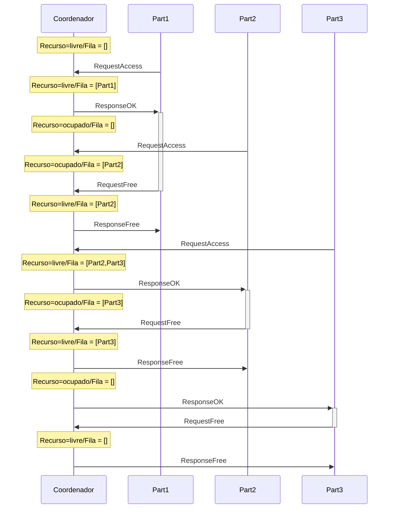
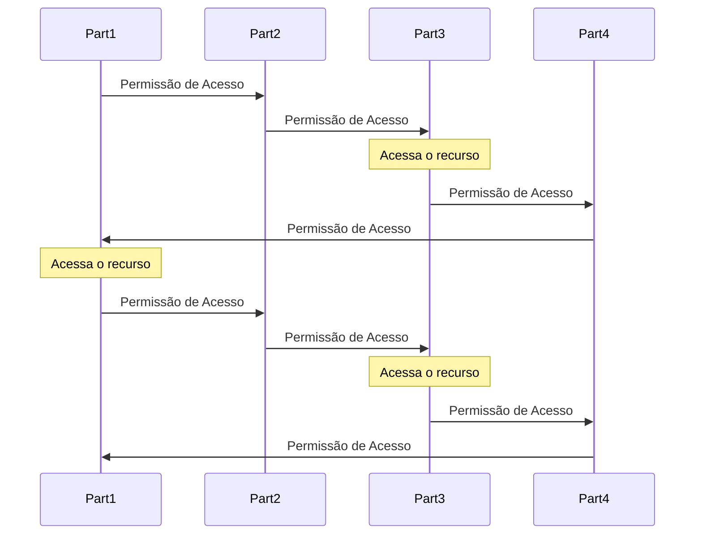
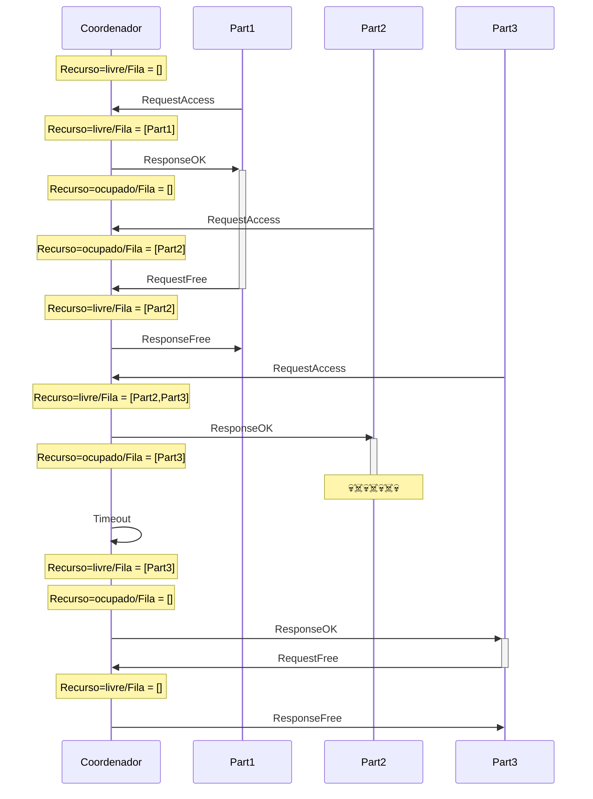
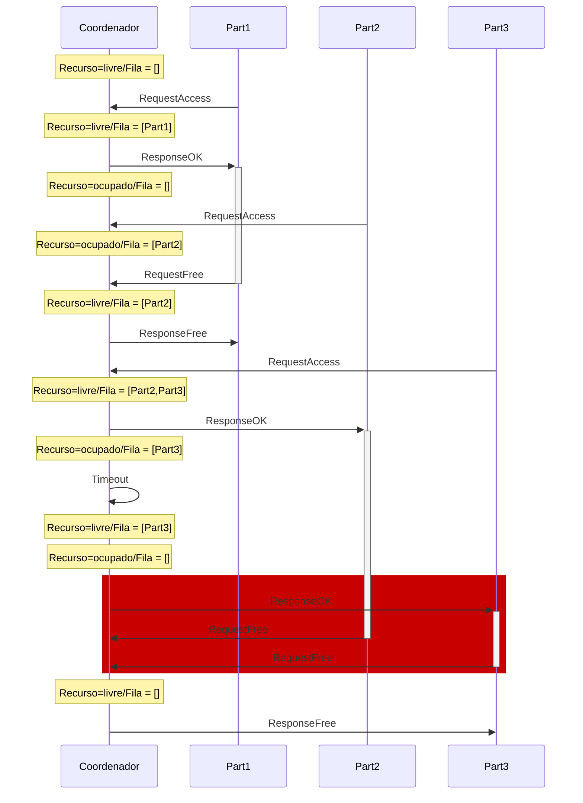
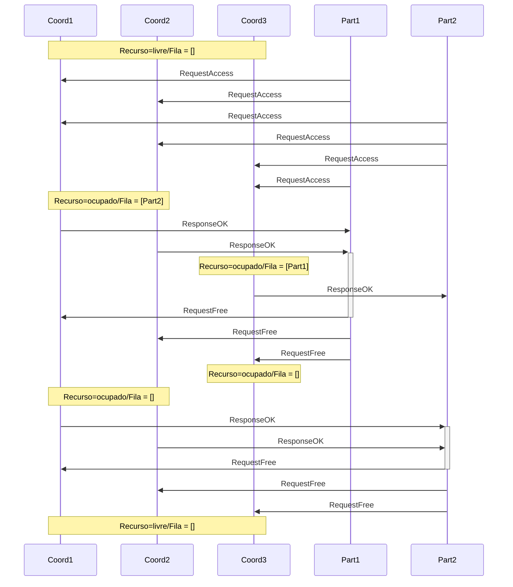
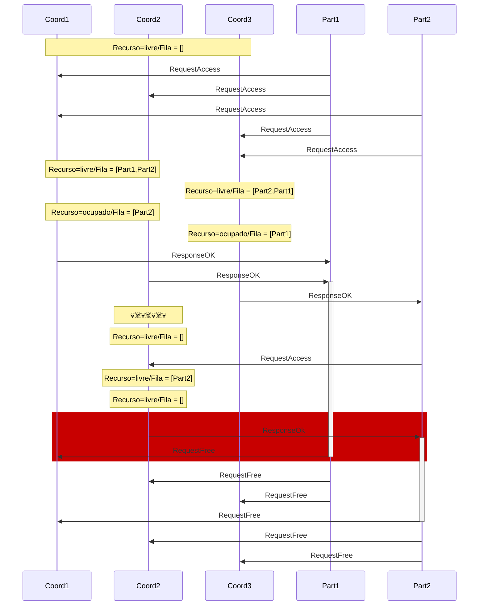

# Coordenação

Como visto na seção sobre [Multiprogramação](../Multiprogramação concorrencia/concorrencia.md), diversas tarefas exigem coordenação entre threads em uma aplicação monolítica em que se faz uso de concorrência para melhor uso de recursos computacionais, obtenção de melhor desempenho, e modularização do código. 

Sistemas distribuídos levam concorrência a um novo patamar de complexidade, fazendo uso de múltiplos processos, cada um com possivelmente múltiplos *threads*, ainda por cima, espalhados geograficamente. 
Outras soluções e abstrações são portanto necessárias.

## Exclusão Mútua
Um dos problemas enfrentados em sistemas que fazem uso de concorrência, distribuídos ou não, é a exclusão mútua.
Em um sistema monolítico, uma variável global, um lock, ou outra primitiva de sincronização podem ser usadas na sincronização, mas em um sistema distribuído, primitivas simples como estas provavelmente não estarão disponíveis ou o sistema será muito restrito.
Como, então, controlar o acesso de múltiplos processos a um recurso compartilhado, garantindo que cada processo controla **exclusivamente** aquele recurso durante seu acesso?
Qualquer solução que se proponha a este problema de exclusão mútua, precisa ter as propriedades 1, 2, 3, e, idealmente, a 4, a seguir:

!!!info "Exclusão Mútua"
    1. **exclusão mútua** - somente um processo pode estar na **região crítica** em qualquer instante de tempo;
    2. **ausência de deadlocks** - se processos estão tentando acessar o recurso, então **algum processo deve conseguir acesso** em algum instante, dado que nenhum processo fique na região crítica indefinidamente;
    3. **não-inanição** - todos os processos interessados conseguem, em algum momento, acessar o recurso;
    4. **espera limitada** - o tempo de espera pelo recurso é limitado.

Há diversas soluções para exclusão mútua em sistemas distribuídos, em diversos cenários, com seus prós e contras.
Três das mais simples, e que ilustram o universo de soluções são via um processo centralizador, em um anel em que "a vez" é circulada, e baseada em quóruns.

### Coordenador 

Enquanto em um sistema monolítico há um sistema operacional que  provê abstrações simples para os processos a serem coordenados, em um sistema distribuído, não há naturalmente tal entidade.
Uma possível solução para o problema de exclusão mútua em um ambiente distribuído é justamente dar um passo para trás e introduzir um coordenador.

Nesta abordagem, os processos que precisam acessar a região crítica são denominados **participantes** e um dos processos assume o papel de **coordenador**. É possível que um mesmo processo atue nos dois papéis sem nenhum prejuízo. Os processos executam o seguinte protocolo:

!!!example "Participante"
    1. Envia requisição de acesso ao coordenador
    2. Espera por resposta do coordenador
    3. Acessa o recurso
    4. Envia liberação do recurso para o coordenador

!!!example "Coordenador"
    1. Inicializa recurso como livre
    2. Ao receber uma requisição, a enfileira
    3. Ao receber uma liberação, marca o recurso como livre
    4. Sempre que recurso estiver marcado como livre **E** a fila não estiver vazia
        1. remove primeiro processo da fila
        2. envia liberação para processo removido
        3. marca o recurso como ocupado

O diagrama a seguir apresenta uma execução deste protocolo em um cenário com três participantes.
O estado do coordenador mostra se o recurso está livre ou ocupado e quais processos esperam por permissão de acesso.

Este algoritmo satisfaz as características elencadas acima.   

* Exclusão mútua - se o coordenador autoriza um participante X, somente após o participante X liberar o recurso é que outro participante poderá obter nova autorização.
* Ausência de deadlocks - Todo processo que requisitar o recurso, entrará em uma fila, em apenas uma posição; assim, a fila proverá uma ordem total para os acessos, sem a possibilidade de circularidade nesta ordem.
* Não-inanição - Dado que ninguém fura a fila e que a cada vez que o recurso é liberado a fila anda, em algum momento a vez do processo chegará.
* Espera limitada - Dado que a posição na fila pode apenas decrementar, seria possível estimar quanto tempo o participante precisa esperar para acessar o recurso.

Outra vantagem deste algoritmo é sua simplicidade e, consequentemente, facilidade de implementação.
Contudo, este algoritmo tem também desvantagens, por exemplo, se muitas requisições de acesso forem feitas, o coordenador pode ser sobrecarregado e se tornar um **gargalo** no acesso à região crítica.

Mais sério ainda é a questão de como lidar com falhas, por exemplo, se ou o coordenador ou o participante que detem o direito de acesso ao recurso para de funcionar,  então nenhum outro processo conseguirá acesso.
Estes aspectos nos permitem mergulhar na área de tolerância a falhas, e o faremos, mas mais tarde. 
Por enquanto, consideraremos tolerância a falhas de forma superficial, após discutirmos outra abordagem.

### Anel

Nesta abordagem, os processos se organizam em um anel lógico, com um processo antes e outro depois. 
Um dos processos é iniciado com um *token* que dá acesso ao recurso e o *token* é passado adiante no anel; sempre que estiver de posse do token, o processo pode acessar o recurso. Ou seja, todos os participantes executam o seguinte protocolo:

!!!example "Participante"
    1. Ao receber o *token* de acesso, se quiser acessar o recurso, acessa.
    2. Envia o *token* para o próximo nó do anel.

O diagrama adiante mostra uma execução do algoritmo em que apenas os participantes 1 e 3 acessam o recurso.
  

Como o algoritmo centralizado, o algoritmo do anel também garante as propriedades 1, 2, 3 e 4, além de ser fácil de implementar, testar e entender.
Diferente do algoritmo centralizado, o algoritmo do anel não sofre com problemas de gargalo, pois nenhum processo precisa participar em todos os acessos, como o coordenador.
Contudo, o algoritmo do anel desperdiça tempo passando o *token* para quem não necessariamente quer acessar a região crítica.
Também importante é que este algoritmo também sofre com falhas: se um participante falha enquanto com o *token*, levando-o para além.

### Lidando com Falhas 
Em ambos os algoritmos, centralizado e do anel, se um processo falhar, o algoritmo pode ficar "travado". 
Vejamos alguns casos específicos:

* No algoritmo centralizado, se o coordenador falha antes de liberar o acesso para algum processo, ele leva consigo a permissão.
* Em ambos os algoritmos, se o processo acessando o recurso falha, a permissão é perdida e os demais processos sofrerão inanição.
* No algoritmo do anel, se qualquer outro processo falha, o anel é interrompido o anel não conseguirá circular.

Observe que nem falamos de falhas dos canais e já temos diversos cenários a serem resolvidos, para os quais se lhes pedir uma solução, tenho certeza absoluta de que me oferecerão alguma baseada em *timeouts*.
Por exemplo, se o processo não devolver a permissão de acesso antes de que uma certa quantidade de tempo tenha passado, um *timeout*, então assuma que o mesmo parou de funcionar e não voltará mais, e gere uma nova permissão a ser passada a outros requisitantes.  Aplicada esta ideia do *timeout*  no algoritmo com coordenador, teremos o efeito ilustrado a seguir.

O problema desta e outras "soluções" baseadas em *timeouts* está no **assumir que o processo parou de funcionar**, pois caso isso não seja verdade, teremos agora duas autorizações ao mesmo tempo no sistema, podendo levar à violação da propriedade de exclusão mútua. 

Por mais que se ajuste o valor do temporizador, em um sistema distribuído assíncrono, mesmo que aumentado com um relógio para medir a passagem do tempo local, o mesmo pode **sempre** estar errado. 

!!! warning "Impossibilidade de detecção de falhas"
    Em um sistema distribuído assíncrono, é impossível distinguir um processo falho de um processo lento.

Mais tarde discutiremos as implicações desta impossibilidade. Por agora, tentemos responder à seguinte questão.

!!! question "Pergunta!"
    Qual deve ser um *timeout*  **razoável** para o meu sistema?

A resposta depende de mais perguntas, como:

* Qual o custo $E$ de esperar por mais tempo?
* Qual o custo $C$ de cometer um engano?
* Qual a probabilidade $p$ de cometer um engano?

O custo esperado por causa dos erros, isto é, a esperança matemática da variável aleatória custo, é menor que o custo de se esperar por mais tempo, isto é, $C * p < E$?

Embora esta análise possa ser feita para estes algoritmos, a verdade é que são realmente limitados e outras abordagens seriam melhor destino dos seus esforços.
Por exemplo, podemos partir para a análise de algoritmos probabilísticos, pois afinal, como disse certa vez Werner Vogels, CTO da Amazon

> Se o mundo é probabilístico, porquê meus algoritmos devem ser determinísticos?"

Uma abordagem probabilística interessante é baseada em quóruns.

### Quórum

De acordo com o [Dicionário Priberam da Língua Portuguesa, consultado em 17-04-2019](https://dicionario.priberam.org/quorum), "quórum" é o  
> Número de pessoas imprescindível para a realização de algo.

Aqui, este este *algo* será a liberação de acesso ao recurso almejado pelos processos no sistema distribuído.

Esta abordagem é semelhante em vários aspectos à coordenada.
De fato, um dos papéis na abordagem é o de coordenador, que executa o mesmo protocolo que antes.
Entretanto, em vez de apenas um coordenador no sistema, temos $n$, dos quais o participante precisa obter $m > n/2$ autorizações antes de acessar o recurso; $m$ é o quórum do sistema.

!!! note "Quórum"
    * $n$ coordenadores.
    * $m > n/2$ coordenadores

Já os demais participantes devem agora considerar todo o conjunto de coordenadores antes de assumir que tem acesso a um recurso. O algoritmo completo é o seguinte:   

!!!example "Coordenador"
    1. Inicializa recurso como livre
    2. Ao receber uma requisição, a enfileira
    3. Ao receber uma liberação
        1. se do processo a quem autorizou, marca o recurso como livre
        2. senão e se de um processo na fila, remove o processo da fila[^id]
        3. senão, ignore mensagem.
    4. Sempre que recurso estiver marcado como livre **E** a fila não estiver vazia
        1. remove primeiro processo da fila
        2. envia liberação para processo removido
        3. marca o recurso como ocupado

[^id]: para evitar que mensagens de requisições distintas do mesmo processo se confundam, é útil identificar cada requisição, por exemplo, com um contador de requisições.

!!!example "Participante"
    1. Envia requisição de acesso aos $n$ coordenadores
    2. Espera por resposta de $m$ coordenadores
    3. Acessa o recurso
    4. Envia liberação do recurso para os $n$ coordenadores

Vejamos uma execução bem sucedida destes algoritmo, com $n=3$ e $m=2$.

Para tornamos o problema mais interessante e demonstrar o potencial deste algoritmo, consideremos que as autorizações são armazenadas somente em memória, e que coordenadores, ao falhar e então resumir suas atividades, esquecem das autorizações já atribuídas.

!!!warning "Perda de memória"
    Quando um coordenador falha, esquece que deu ok e reinicia seu estado.

Este algoritmo é bom? Suponhamos o seguinte cenário:

* Coordenadores = {Coord1,Coord2,Coord3}
* $n = 3$
* $m = 2$
* Participante Part1 consegue autorização de {Coord1,Coord2} e entra na região crítica.
* Coordenador Coord2 falha e se recupera
* Participante Part2 consegue autorização de {Coord2,Coord3} e entra na região crítica.

Neste cenário, a propriedade de **Exclusão Mútua** é violada. 
Isto porquê, dados os dois quóruns, todos os processos na interseção foram reinicidaos.
Mas de forma geral, qual a probabilidade de isso acontecer? 
Ou seja, dados dois quóruns, de tamanho $m$, que se sobrepõem em $k$ processos, qual a probabilidade $P_v$ de que os $k$ processos na interseção sejam reiniciados e levem à violação?

Seja a $P$ a probabilidade de **um coordenador em específico falhar** e se recuperar dentro de uma janela de tempo $\delta t$. Temos

* Probabilidade de falha de **exatamente 1** coordenador: $P^1(1-P)^{n-1}$
* Probabilidade de **$k$ coordenadores** falharem: $P^k(1-P)^{n-k}$
* Probabilidade de quaisquer $k$ em $m$ coordenadores falharem: $\binom{m}{k} P^k(1-P)^{m-k}$		

Mas qual é o tamanho $k$ da interseção?

* $\left| A \cup B\right| = \left| A \right| + \left|B\right| - \left| A \cap B \right| \Rightarrow n = m + m - k$
* $\left| A \cap B \right| = \left| A \right| + \left|B\right| - \left| A \cup B\right| \Rightarrow k = m + m - n = 2m - n$

Até agora consideramos que a $k$ corresponde à cardinalidade da interseção dos dois quóruns, mas se mais do que a interseção forem reiniciados, também teremos problemas. Assim, se $k$ assume qualquer valor entre o tamanho da interseção e o número total de coordenadores, teremos problemas. 

* Probabilidade de quaisquer $k$ em $m$ coordenadores falharem, para qualquer $k$ variando de $2m-n$ a $n$: $P_v = \sum_{k=2m-n}^n \binom{m}{k} P^k(1-P)^{m-k}$

Para facilitar o entendimento desta grandeza, considere o exemplo:

* $P=0.0001$ (1 minuto a cada 10 dias)
* $n = 32$
* $m = 0.75n$
* $P_v < 10^{-40}$ ([Curiosidade sobre $10^{40}$](https://cosmosmagazine.com/mathematics/the-big-baffling-number-at-the-heart-of-a-cosmic-coincidence))

A probabilidade de violação da exclusão mútua, neste caso, é muito pequena, a despeito de suportar falhas dos coordenadores. 

!!! note "Pró"
    * Tolera falhas de coordenadores, com probabilidade controlada de violação de exclusão mútua.

Mas e as outras propriedades desejáveis do algoritmo de exclusão mútua, são alcançadas? Relembrando:

!!! note "Contras"
    * Exclusão Mútua probabilística: $1 - P_v$
    * Não-inanição
        * E se cada participante obtiver o ok de um coordenador?
        * Temporizador para quebrar o *deadlock*?
    * Espera limitada
        * Aborts podem levar a espera infinita.

Assim, este agoritmo também pode não ser adequado para certas situações. Vamos tentar reacessar os problemas da primeira abordagem.
Por um lado, o uso de um líder para coordenar ações em um SD simplifica o projeto, mas, por outro, o coordenador pode se tornar um ponto único de falha, como no algoritmo de exclusão mútua centralizado.
Mas e se substituíssemos o coordenador no caso de falhas? Este é o problema conhecido como eleição de líderes.

???bug "TODO"
    * Maekawa - Diminui número de votos necessários ([descrição](https://www.geeksforgeeks.org/maekawas-algorithm-for-mutual-exclusion-in-distributed-system/?ref=rp))
    * Lamport - Usa relógios lógicos, mas é possível entender sem este background ([descriçao](https://www.geeksforgeeks.org/lamports-algorithm-for-mutual-exclusion-in-distributed-system/))
    * Ricart-Agrawala - Melhora algoritmo de Lamport ([descrição](https://www.geeksforgeeks.org/ricart-agrawala-algorithm-in-mutual-exclusion-in-distributed-system/?ref=rp))
    * [Distributed-Mutual-Exclusion-slides](https://www.cs.cmu.edu/~dga/15-440/F09/lectures/Distributed-Mutual-Exclusion-slides.pdf)

## Eleição de Líderes

O problema da escolha de um processo centralizador, ou líder, pode ser posto informalmente como o procedimento pelo qual **um processo é escolhido** dentre os demais processos, sendo que o **processo escolhido é ciente da escolha** e **todos os demais processos o identificam como eleito**. Uma **nova eleição** deve acontecer sempre que o líder se tornar **indisponível**.
Formalmente, um algoritmo de eleição de líderes deve satisfazer as seguintes condições.

!!!note "Eleição de Líderes[^guptaetal]"
     * Terminação: algum processo deve se considerar líder em algum momento.
     * Unicidade: somente um processo se considera líder.
     * Acordo: todos os outros processos sabem quem foi eleito líder.

[^guptaetal]:[A Probabilistically Correct Leader Election Protocol for Large Groups](https://www.cs.cornell.edu/home/rvr/papers/ProbLeaderElection.pdf)

Para entendermos melhor o problema, tentemos desenvolver um protocolo simples para escolhermos um líder, por exemplo, em sua turma da disciplina de Sistemas Distribuídos. Vejamos algumas questões importantes.

* Candidatos: são todos os membros elegíveis ou apenas um subconjunto dos mesmos?
* Comunicação: todos se conhecem e se falam diretamente ou há grupos incomunicáveis dentro da turma?
* Estabilidade: de que adianta eleger um dos colegas se frequentemente falta não está presente quando necessário?

Em termos computacionais, estas questões são relevantes pois todos os processos **não** nascem iguais; alguns residem em máquinas com mais memória, mais poder de processamento, melhor conexão com o resto do mundo ou maior grau de conectividade. Talvez este processo seja um líder mais útil que os demais.
Além disso, se o processo está frequentemente desconectado, mesmo que bem servido de recursos, não será um bom líder.

Ainda que assumamos um conjunto de processos indiferenciáveis entre si, com acesso equivalente a recursos e que estejam sempre disponíves, ou exatamente por isso, temos  um problem mais fundamental para resolver: para eleger um líder, precisamos diferenciar processos.
Dentro de uma única máquina, identificamos processos facilmente usando seu **PID**, ou *process id*, um inteiro associado a cada processo instanciado pelo sistema operacional; o PID é válido enquanto o processo estiver executando e pode ser reciclado uma vez que o processo para de executar, o que pode ser um problema. Além disso, se o *host* é reiniciado, os PID também são, e portanto esta identificação não é duradoura. Mais importante, o PID só faz sentido dentro de uma única máquina e não em um sistema distribuído.

Se apenas uma instância do processo executa em um mesmo *host*, então o identificador do *host* (e.g., endereço IP) em si é suficiente e, de fato, comumente utilizado. 
Se mais de um processo executa no mesmo *host*, então cabe ao desenvolvedor criar um esquema que permita diferenciar os processos, e não precisa ser nada complicado; pode ser apenas um **parâmetro** passado na inicialização do processo ou a combinação **IP/porta**.

Assumindo que um esquema de nomeação está disponível e que todos os processos se conhecem, voltemos ao problema de eleger um líder para sua turma.
Uma abordagem que pode funcionar é colocar todos os candidatos para brigar e quem sobrar em pé no final, é o novo líder.

A despeito desta opção gerar um líder não muito popular, o algoritmo do brigão é um clássico.

### Algoritmo do Brigão (*Bully*)
No algoritmo do brigão, alguma **características comparável** dos processos é escolhida e aquele processo funcional com o valor de tal característica mais vantajoso para um líder é escolhido como tal.
Por exemplo, pode ser vantajoso ter um líder com maior quantidade de memória, frequência da CPU ou largura de banda da conexão com a Internet; no caso de empate, o identificador do processo pode ser usado para gerar uma ordem total entre os processos.

Para simplificar, vamos assumir que o identificador do processo reflete as qualidades do mesmo para a liderança, tal que o processo com maior identificador seja o melhor candidato. Os maiores processos, os "brigões", eliminam os processos menores da competição, sempre que uma eleição acontecer. 
O algoritmo é apresentado a seguir, onde $p$ e $q$ são usados para representar tanto identificadores de processos quando os processos em si.

!!!example "Algoritmo do Brigão"
    * Quando $p$ suspeita que o líder não está presente (muito tempo se receber mensagens do mesmo)
        * $p$ envia mensagem (ELEICAO,$p$) para todos os processos com identificador maior que $p$
        * Inicia temporizador de respostas
    * Quando temporizador de respostas expira
        * Envia (COORD,$p$) para todos os processos
    * Quando recebe (Ok,$p$)
        * Para temporizador de resposta
	* Quando $p$ recebe (ELEICAO,$q$), $q < p$
        * Envia (OK,$q$)
	* Quando um processo falho se recupera
        * Inicia uma eleição

Observe como o algoritmo foi descrito em termos de **eventos** e não de forma sequencial. Este tipo de especificação é comum para algoritmos paralelos e distribuídos, pois não há uma sequência pré-estabelecida de passos a serem executados por todos os processos, apenas alguns pontos de coordenação.
No exemplo a seguir, temos 5 processos, com identificadores de 1 a 5, passando por 7 passos até que a eleição se complete.
Observe que os processos não sabem a priori como os eventos aconteceram e apenas reagem aos **eventos** de **recepção de mensagens** e **expiração de temporizadores**.

1. o líder já é o processo 5 (em rosa).
2. os processos 2 e 3 (amarelo) se "cansaram" de esperar por 5, que falhou (em cinza, e se candidataram a líder, enviando (ELEICAO,2) e (ELEICAO,3), respectivamente, (verde).
3. 4 responde a 2 a 3 com (OK,2) e (OK,3) como resposta a 2 e 3, respectivamente, e 3 envia (OK,2) para 2.
4. 1 se candidata com enviando (ELEICAO,1).
5. 2, 3 e 4 respondem com (OK,1).
6. 4 se candidata enviando (ELEICAO,4) para 5, que não responde, já que está falho.
7. 4 se declara líder e envia (COORD,4) a todos os processos. 

](./images/bully.png)

Como já discutido antes, a escolha do valor temporizador é fundamental para o bom funcionamento do algoritmo.
Se o temporizador usado pelos processos para esperar pelo líder for ajustado de forma agressiva, frequentemente serão iniciadas eleições mesmo que o líder não tenha falhado.
Já se o valor do temporizador for muito grande, o sistema **demorará a eleger um novo líder**.
Da mesma forma, se o tempo esperado por um candidato antes de se declarar líder for muito curto, **mais de um processo pode se declarar líder**, uma situação conhecida como *split-brain*.

Idealmente, um processo deveria esperar por outro enquanto o outro estiver apto a responder, mas isso requer saber quando o outro processo não está mais apto, isto é, falhou.
Como identificar exatamente quando isso aconteceu é impossível em sistemas distribuídos assíncronos, o algoritmo do brigão não resolve o problema neste ambiente.

  

Mas se delimitarmos melhor o ambiente, podemos chegar a soluções melhores.

### Algoritmos em Anéis

Consideremos processos organizados em um anel lógico em que processos troquem mensagens apenas com processos à "esquerda" e à "direita".
Considere também que todos os processos são exatamente idênticos, inclusive não possuindo identificadores próprios.
Suponha o seguinte algoritmo de eleição neste anel, em que um processo inicialmente Seguidor se torna Candidato, então se declara Eleito, avisa a seus pares e, finalmente, se declara Empossado.

!!!example "Algoritmo do Anel 1"
     * Organize os nós em um anel lógico
     * $C \gets$ Seguidor
     * Quando um processo acha que o líder está morto
          * $C \gets$ Candidato
          * Envia (VoteEmMim) para "a direita" no anel.
     * Quando um processo recebe (VoteEmMim)
          * Se $C =$ Seguidor 
              * envia (VoteEmMim) para a direita
          * Se $C =$ Candidato 
              * $C \gets$ Eleito
              * envia (HabemosLeader) para a direita
     * Quando um processo recebe (HabemosLeader)
          * Se $C =$ Seguidor
              * envia (HabemosLeader) para a direita
          * Se $C =$ Eleito 
              * $C \gets$ Empossado

Imagine um cenário com dois processos, como na imagem a seguir. 
Os nomes dos processos são apenas para facilitar o entendimento do fluxo dem mensagens e não estão acessíveis aos processos.   
   
Executando o algoritmo Anel 1, os processos enviam ($\rightarrow$) e recebem ($\leftarrow$) as seguintes mensagens e ajustam $C$ da seguinte forma.

| 1 | 2 |
|----------|--------|
| $C \gets$ Seguidor  | $C \gets$ Seguidor |
| $C \gets$ Candidato |  |
| (VoteEmMim) $\rightarrow$| |
| | (VoteEmMim) $\leftarrow$|
| | (VoteEmMim) $\rightarrow$|
| (VoteEmMim) $\leftarrow$| |
| $C \gets$ Eleito |  |
| (HabemosLider) $\rightarrow$| |
| | (HabemosLider) $\leftarrow$|
| | (HabemosLider) $\rightarrow$|
| (HabemosLider) $\leftarrow$| |
| $C \gets$ Empossado |  |

Agora imagine que por um acaso, tanto processo 1 quanto o 2 se candidatassem ao mesmo tempo.

| 1 | 2 |
|----------|--------|
| $C \gets$ Seguidor  | $C \gets$ Seguidor |
| $C \gets$ Candidato | $C \gets$ Candidato |
| (VoteEmMim) $\rightarrow$| (VoteEmMim) $\rightarrow$|
| (VoteEmMim) $\leftarrow$ | (VoteEmMim) $\leftarrow$|
| $C \gets$ Eleito | $C \gets$ Eleito |
| (HabemosLider) $\rightarrow$| (HabemosLider) $\rightarrow$ |
| (HabemosLider) $\leftarrow$ | (HabemosLider) $\leftarrow$|
| $C \gets$ Empossado | $C \gets$ Empossado |

Como não há nada que diferencie os processos entre si, este cenário é perfeitamente válido, e se no primeiro cenário o algoritmo estava correto ao eleger o processo 1, então no segundo cenário o 1 também deve ser eleito, já que a sequência de evento observadas é exatamente a mesma.
Mas o processo 2 também vê a mesma sequência, então também deve ser eleito.
Assim, violamos a propriedade da Unicidade.

Para quebrar essa simetria entre os processo, podemos permitir que saibam seus identificadores.
No algoritmo seguinte, permitimos que os processos conheçam seus identificadores e um processo que suspeite do líder atual, envia uma mensagem no anel para coletar os identificadores de todos os processos.

!!!example "Algoritmo do Anel 2"
     * Organize os nós em um anel lógico
     * Quando $p$ acha que o líder está morto:
          * Envia mensagem [$p$] "à direita".
     * Quando $p$ recebe $l$
          * Se $p \not \in l$
              * Envia  $[p:l]$ para a direita.
          * Se $p \in l$
              *  Escolhe menor id em $l$ como líder.

Este algoritmo envia até $n^2$ mensagens, se todos iniciarem a eleição ao mesmo tempo, e as mensagens crescem até o tamanho $n$.
O algoritmo de Chang e Robert[^changrobert] limita o tamanho das mensagens ao pré-selecionar candidatos viáveis.

[^changrobert]: [An improved algorithm for decentralized extrema-finding in circular configurations of processes](https://dl.acm.org/doi/10.1145/359104.359108).

!!!note "Algoritmo de Chang e Robert"
        * Organize os nós em um anel lógico
        * Quando $p$ acha que o líder está morto:
            * Envia mensagem $(p)$ à direita
        * Quando $p$ recebe $(q)$
            * Se $p = q$
                * $p$ se declara líder
            * Senão e se $q > p$
                * Envia $(q)$ para a direita.

Neste algoritmo, todas as mensagens tem tamanho $O(1)$ e somente uma mensagem dá uma volta completa do anel; todas as outras são descartadas no meio do caminho.
Apesar disso, pode-se demonstrar que o pior caso em termos de número de mensagens do algoritmo até que alguém se declare líder é $O(n^2)$.

!!!exercise "Exercício: Quantidade de mensagens"
    * O pior caso em termos de número de mensagens até que alguém seja eleito é $O(n^2)$. Descreva como os nós devem estar organizados para que esta situação ocorra.
    * Observe que no algoritmo um processo apenas se "declara líder", mas os outros não necessariamente ficam sabendo disso. Como você o corrigiria para que terminasse?

Diversos outros algoritmos existem para a topologia em anel. O algoritmo de Franklin é um dos que propõe melhorias para reduzir quantidade de mensagens usadas na eleição.
Ele faz isso em rodadas, comparando identificadores com outros processos ativos tanto à esquerda quanto à direita e desativando os processos não viáveis.

!!!note "Algoritmo de Franklin"
    * Organize os nós em um anel lógico
    * Ativo $\gets 1$
    * Quando $p$ acha que o líder está morto e se Ativo$ = 1$:
        * Envia mensagem $(p)$ à direita e à esquerda
    * Quando $p$ recebe $e$ e $d$, da esquerda e da direita, respectivamente:
        * Se Ativo $=1$
            * Se $max(e,d) < p$
                * Envia mensagem $p$ à direita e à esquerda
            * Se $max(q,r) > p$
                * Ativo $\gets 0$
                * Envia mensagem $-p$ à direita e à esquerda
            * Se $max(q,r) = p$
                * $p$ se declara líder.
        * Se Ativo $=0$
            * Repassa cada messagem para o outro lado.

No exemplo na figura, os nós brancos são ativos e os amarelos inativos. 
Observe o papel do nó no centro, supondo que tem o maior identificador entre todos os processos. 
Inicialmente ele envia as mensagens em verde para os lados, que levam seus vizinhos imediatos a se inativarem.
Na segunda rodada, as mensagens são repassadas para os vizinhos dos vizinhos, que também se inativam.

Observe o seguinte:

* Em cada fase, para qualquer par de vizinhos ativos, pelos um dos dois é inativado e, portanto, o número de ativos cai pela metade; logo há no máximo $O(log n)$ fases.
* Na primeira fase, cada processo ativo leva a $4$ mensagens serem enviadas na rede (sem nenhuma otimização). Dado que são $n$ processos, temos $4n$ mensagens, $O(n)$
* Na segunda fase, cada processo ativo leva a 8 mensagens. Contudo, metade dos processos, pelo menos, foram inativados na primeira fase. Logo, temos $8n \times n/2, O(n)$
* Assim, no máximo $O(n log n)$ mensagens são enviadas em uma execução do algoritmo.

### Algoritmo do YoYo 
Saindo da topologia em anel, vejamos o algoritmo do Yoyo, que funciona em qualquer topologia conexa, mesmo se processos não puderem se falar diretamente.
Inicialmente as arestas do formado pelos processos e seus canais de comunicação são não direcionadas, mas na medida em que o protocolo é executado,  as arestas são marcadas como tendo um ou outro sentido.
Esta marcação é apenas lógica e mensagens fluem em ambos os sentidos.
De acordo com o tipo de arestas que um processo tem, ele é classificado como um de três tipos: 

* Fonte (source) - processo que só tem arestas de saída
* Vertedouro (sink) - processo que só tem arestas de chegada
* Interno - processo que tem arestas de chegada e de saída

O algoritmo executa em duas fases. Na primera, cada processo marca sua arestas como apondando para o maior dentre si próprio e seus vizinhos.
Na segunda fase, mensagens "vão e voltam", o que dá o nome ao algoritmo.
Na "ida", as mensagens vão das fontes para os vertedouros, que identificam quais fontes tem os menores identificadores e sinalizam para que continuem fontes na próxima etapa com mensagens de volta.
As mensagens de volta reordenam as arestas para garantir este comportamento.
Vejamos o algoritmo em mais detalhes.

!!!note "Algoritmo do YoYo"
	* Fase 1
		* $p$ envia seu identificador para seus vizinhos.
		* Quando $p$ recebe $q$
			* Se $p>q$
                * Marca a aresta em que recebeu $q$ como sendo de chegada ($p\leftarrow q$)
			* Senão
                * Marca a aresta em que recebeu $q$ como sendo de saída ($q\leftarrow p$)
	* Fase 2
        * Se $p$ é uma **fonte**
            * $p$ envia seu identificador em todas as suas arestas de saída.
            * Quando $p$ receber $S$ ou $N$ em todas as suas arestas de saída
                * Se recebeu apenas $S$
                    * Executa fase 2 novamente

        * Se $p$ é um **nó interno**
            * Quando $p$ receber identificadores em todas as suas arestas de entrada
                * escolhe o menor id recebido $m$
                * envia $m$ em todas as suas arestas de saída
            * Quando $p$ recebeu $S$ ou $N$ em todas as suas arestas de saída
                * Se recebeu algum $S$
                    * envia $S$ para vizinhos de onde recebeu $m$
                    * envia $N$ para vizinhos de onde recebeu $m' \neq m$
                * Se não recebeu $S$
                    * envia $N$ para vizinhos de onde recebeu algum id.

        * Se $p$ é um **vertedouro**
            * Quando $p$ receber identificadores em todas as suas arestas de entrada
                * escolhe o menor id recebido $m$
                * envia $S$ para vizinhos de onde recebeu $m$
                * envia $N$ para vizinhos de onde recebeu $m' \neq m$
	    
	    * N inverte a direção das arestas em que trafega.

[Fonte](https://en.wikipedia.org/wiki/Leader_election)

Veja um exemplo com 3 processos em destaque, uma fonte, um interno e um vertedouro.

Veja o seguinte exemplo, em que cada figura mostra um estágio da resolução do problema de eleição de líderes.

* a) A rede em seu estado inicial.
* b) Rede orientada pela primera fase
* c) Propagação de Fontes
* d) Propagação de Vertedouros
* e) Inativação dos vertedouros

Exemplo: 
](./images/yoyo.png)

Embora interessante, este algoritmo também tem problemas, sendo um dos mais críticos a forma de lidar com falhas, mesmo sem considerar falhas de processos.
Suponha que o canal de comunicação entre os processos 2 e 10 pare de funcionar. O que acontecerá?
Esta é uma situação que denominamos **particionamento** da rede e que neste caso levará a duas eleições concorrentes acontecerem e, consequentemente, a dois líderes sendo eleitos, o que é conhecido na área como ***split-brain***.
Vejamos esta e outras situações problemáticas em eleição de líderes.

### Questões importantes

#### *Split-brain*
Se o algoritmo viola a propridade de unicidade, então fica com *split-brain*, em que parte da rede vê um processo como líder e parte vê outro.
Se o líder é o responsável por coordenar o acesso a uma região crítica, como visto no algoritmo coordenado de exclusão mútua, então ter dois líderes poderá levar a dois processos na região crítica e portanto violação da exclusão mútua. 

Uma das formas de evitar *split-brain* é atribuir um **"peso"** para cada processo e só aceitar que um líder seja declarado se o mesmo seus votos carregarem mais da metade do peso do sistema.
Ainda assim, temos problemas, pois é necessário que rodadas sucessivas do algoritmo invalidem as eleições anteriores.
O algoritmo Raft de difusão atômica, que estudaremos adiante, define mandatos e garante, com pesos, que somente um líder existe em cada mandato. Devido à natureza assíncrona do sistema, processos podem se achar em mandatos distintos e, por isso, o mandato é associado a todas as comunicações; mensagens recebidas de mandatos anteriores são sumariamente descartadas.

Mas por quê precisamos de mandatos sucessivos? Para substituir um líder que tenha falhado. O que nos leva a outros dois problemas, o da detecção de falhas e o da estabilidade do líder.

#### Estabilidade
Dizemos que um algoritmo de eleição de líderes é estável se uma vez que um líder é eleito, uma nova eleição só acontece se o líder falha.
Considere o algoritmo do brigão. Imagine, no exemplo apresentado, que o processo 5 teve problemas de comunicação e foi percebido como falho pelos demais.  Neste caso, o 4 seria eleito líder.
Mas se o problema que aflige 5 é temporário, 5 voltará e executará nova eleição, tornando-se líder novamente. Se este cenário se repente indefinidamente, o sistema poderá ser seriamente comprometido em seu desempenho.

Uma versão estável do algoritmo tentaria, por exemplo, associar ao peso do processo o tempo de exeção ininterrupta do mesmo. Assim, quanto mais tempo um processo execute, maior será seu peso e sua capacidade de manter a liderança. 
Se o mesmo falhar, então seu peso será drasticamente reduzido e suas chances de ser eleito líder reduzidas temporariamente.

Observe que os problemas enfrentados são ligados à detecção e contornação de falhas.

#### Detecção de falhas
Como já mencionado antes, detecção de falhas é o mecanismo pelo qual um processo monitora e percebe se outro falhou.
Pensemos em como um processo monitora o outro em um sitema distribuído. Claramente, por meio de troca de mensagens e temporizadores.
Mas se estamos falando de sistemas distribuídos assíncronos, então mensagens podem ser atrasadas indefinidamente ou relógios podem ser atrasados, então não se pode confiar na falta de recepção de uma mensagem como garantia de que um processo parou de funcionar.
Aprofundemo-nos nos próximos capítulo nos conceitos de tempo e tolerância a falhas, mas enquanto isso, fiquemos com o seguinte resultado.

!!!note "Detecção de falhas"
    * Detecção de falhas perfeita é impossível...
    * em sistemas distribuídos assíncronos (Internet)
    * sujeitos à partições (Internet)
    * com requisitos de disponibilidade total.

