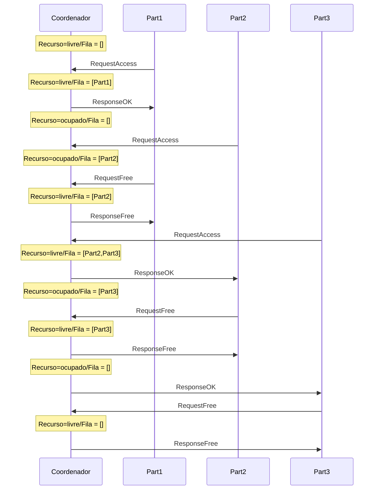

# Coordenação

Como visto na seção sobre [Multiprogramação](../basics/#multiprogramacao-e-multithreading-em-sistemas-distribuidos
../Multiprogramação concorrencia/concorrencia.md), diversas tarefas exigem coordenação entre threads em uma aplicação centralizada em que se faz uso de concorrência para melhor uso de recursos computacionais, obtenção de melhor desempenho, e modularização do código. 

Sistemas distribuídos levam concorrência a um novo patamar de complexidade, fazendo uso de múltiplos processos, cada um com possivelmente múltiplos *threads*, ainda por cima, espalhados geograficamente. 
Outras soluções e abstrações são portanto necessárias.

## Exclusão Mútua
Um dos problemas enfrentados em sistemas que fazem uso de concorrência, distribuídos ou não, é a exclusão mútua.
Em um sistema centralizado, uma variável global, um lock, ou outra primitiva de sincronização podem ser usadas na sincronização, mas em um sistema distribuído, primitivas simples como estas provavelmente não estarão disponíveis ou o sistema será muito restrito.
Como, então, controlar o acesso de múltiplos processos a um recurso compartilhado, garantindo que cada processo controla **exclusivamente** aquele recurso durante seu acesso?
Qualquer solução que se proponha a este problema de exclusão mútua, precisa ter as propriedades 1, 2, 3, e, idealmente, a 4, a seguir:

!!!info "Exclusão Mútua"
    1. **exclusão mútua** - somente um processo pode estar na **região crítica** em qualquer instante de tempo;
    2. **ausência de deadlocks** - se processos estão tentando acessar o recurso, então **algum processo deve conseguir acesso** em algum instante, dado que nenhum processo fique na região crítica indefinidamente;
    3. **não-inanição** - todos os processos interessados conseguem, em algum momento, acessar o recurso;
    4. **espera limitada** - idealmente, o tempo de espera pelo recurso é limitado.

Há diversas soluções para exclusão mútua em sistemas distribuídos, em diversos cenários, com seus prós e contras.
Três das mais simples, e que ilustram o universo de soluções são via um processo centralizador, em um anel em que a vez é circulada, e baseada em quoruns.

### Coordenador 

Enquanto em um sistema centralizado há um sistema operacional que  provê abstrações simples para os processos a serem coordenados, em um sistema distribuído, não há naturalmente tal entidade.
Uma possível solução para o problem de exclusão mútua em um ambiente distribuído é justamente dar um passo para trás e introduzir um coordenador.

Nesta abordagem, os processos que precisam acessar a região crítica são denominados **participantes** e um dos processos assume o pal de **coordenador**. É possível que um mesmo processo atue nos dois papéis sem nenhum prejuízo. Os processos executam o seguinte protocolo:

* Participante
    1. Envia requisição de acesso ao coordenador
    2. Espera por resposta do coordenador
    3. Acessa o recurso
    4. Envia liberação do recurso para o coordenador
* Coordenador
    1. Inicializa recurso como livre
    2. Ao receber uma requisição, a enfileira
    3. Ao receber uma liberação, marca o recurso como livre
    4. Sempre que recurso estiver marcado como livre **E** a fila não estiver vazia
        1. remove primeiro processo da fila
        2. envia liberação para processo removido
        3. marca o recurso como ocupado

O diagrama a seguir apresenta uma execução deste protocolo em um cenário com três participantes.
O estado do coordenador mostra se o recurso está livre ou ocupado e quais processos esperam por permissão de acesso.

Este algoritmo satisfaz as características elencadas acima.   
* Exclusão mútua - se o coordenador autoriza um participante, somente após outro participante liberar o recurso, outro participante poderá obter tal autorização.
* Ausência de deadlocks - Todo processo que requisitar o recurso, entrará em uma fila, em apenas uma posição; assim, a fila proverá uma ordem total para os acessos, sem a possibilidade de circularidade nesta ordem.
* Não-inanição - Dado que ninguém fura a fila e que a cada vez que o recurso é liberado a fila anda, em algum momento a vez do processo chegará.
* Espera limitada - Dado que a posição na fila pode apenas decrementar, seria possível estimar quanto tempo o participante precisa esperar para acessar o recurso.

Outra vantagem deste algoritmo é sua simplicidade e, conseguentemente, facilidade de implementação.
Contudo, este algoritmo tem também desvantagens, por exemplo, se muitas requisições de acesso forem feitas, o coordenador pode ser sobrecarregado e se tornar um **gargalo** no acesso à região crítica.

Mais sério ainda é a questão de como lidar com falhas, por exemplo, se ou o coordenador ou o participante que detem o direito de acesso ao recurso para de funcionar,  então nenhum outro processo conseguirá acesso.
Estes aspectos nos permitem mergulhar na área de tolerância a falhas, e o faremos, mas mais tarde. 
Por enquanto, consideraremos tolerância a falhas de forma superficial, após discutirmos outra abordagem.

### Anel

Nesta abordagem, os processos se organizam em um anel lógico, com um processo antes e outro depois. 
Um dos processos é iniciado com um *token* que dá acesso ao recurso e o *token* é passado adiante no anel; sempre que estiver de posse do token, o processo pode acessar o recurso. Ou seja, todos os participantes executam o seguinte protocolo:

* Participante
    1. Ao receber o *token* de acesso, se quiser acessar o recurso, acessa.
    2. Envia o *token* para o próximo nó do anel.

O diagrama adiante mostra uma execução do algoritmo em que apenas os participantes 1 e 3 acessam o recurso.
  

Como o algoritmo centralizado, o algoritmo do anel também garante as propriedades 1, 2, 3 e 4, além de ser fácil de implementar testar e entender.
Diferente do algoritmo centralizado, o algoritmo do anel não sofre com problemas de gargalo, pois nenhum processo precisa participar em todos os acessos, como o coordenador.
Contudo, o algoritmo do anel desperdiça tempo passando o *token* para quem não necessariamente quer acessar a região crítica.
Também importante é que este algoritmo também sofre com falhas: se um participante falha enquanto com o *token*, levando-o para além.

### Lidando com Falhas 
Em ambos os algoritmos, centralizado e do anel, se um processo falhar, o algoritmo pode ficar "travado". 
Vejamos alguns casos específicos:

* No algoritmo centralizado, se o coordenador falha antes de liberar o acesso para algum processo, ele leva consigo a permissão.
* Em ambos os algoritmos, se o processo acessando o recurso falha, a permissão é perdida e os demais processos sofrerão inanição.
* No algoritmo do anel, se qualquer outro processo falha, o anel é interrompido o anel não conseguirá circular.

Observe que nem falamos de falhas dos canais e já temos diversos cenários a serem resolvidos, para os quais se lhes pedir uma solução, tenho certeza absoluta de que me oferecerão alguma baseada em *timeouts*.
Por exemplo, se o processo não devolver a permissão de acesso antes de que uma certa quantidade de tempo tenha passado, um *timeout*, então assuma que o mesmo parou de funcionar e não voltará mais, e gere uma nova permissão a ser passada a outros requisitantes.

O problema desta e outras "soluções" baseadas em *timeouts* está no **assumir que o processo parou de funcionar**, pois caso isso não seja verdade, teremos agora dois *tokens*  no sistema, podendo levar à violação da propriedade de exclusão mútua. 

??? bug "Violação da exclusão mútua"
     Fazer diagrama de sequência mostrando violação da exclusão mútua.

Por mais que se ajuste o valor do temporizador, em um sistema distribuído assíncrono, mesmo que aumentado com um relógio para medir a passagem do tempo local, o mesmo pode **sempre** estar errado. 

!!! warning "Impossibilidade de detecção de falhas"
    Em um sistema distribuído assíncrono, é impossível distinguir um processo falho de um processo lento.

Mais tarde discutiremos as implicações desta impossibilidade. Por agora, tentemos responder à seguinte questão.

!!! question
    Qual deve ser um *timeout*  **razoável** para o meu sistema?

A resposta depende de mais perguntas, como:

* Qual o custo $E$ de esperar por mais tempo?
* Qual o custo $C$ de cometer um engano?
* Qual a probabilidade $p$ de cometer um engano?
* $C * p < E$.

Embora esta análise possa ser feita para estes algoritmos, a verdade é que são realmente limitados e outras abordagens seriam melhor destino dos seus esforços.
Por exemplo, podemos partir para a análise de algoritmos probabilísticos, pois como disse certa vez Werner Fogels, CTO da Amazon

> Se o mundo é probabilístico, porquê meus algoritmos devem ser determinísticos?"

Uma abordagem probabilística interessante é baseada em quóruns.

### Quórum

De acordo com o [Dicionário Priberam da Língua Portuguesa, consultado em 17-04-2019](https://dicionario.priberam.org/quorum), "quórum" é o  
> Número de pessoas imprescindível para a realização de algo.

Aqui, este este *algo* será a liberação de acesso ao recurso almejado pelos processos no sistema distribuído.

Esta abordagem é semelhante em vários aspectos à coordenada.
De fato, um dos papéis na abordagem é o de coordenador, que executa o mesmo protocolo que antes.
Entretanto, em vez de apenas um coordenador no sistema, temos $n$, dos quais o participante precisa obter $m > n/2$ autorizações antes de acessar o recurso; $m$ é o quórum do sistema.

!!! note "Quórum"
    * $n$ coordenadores.
    * $m > n/2$ coordenadores

Já os demais participantes devem agora considerar todo o conjunto de coordenadores antes de assumir que tem acesso a um recurso. O algoritmo completo é o seguinte:
* Coordenador
    1. Inicializa recurso como livre
    2. Ao receber uma requisição, a enfileira
    3. Ao receber uma liberação, marca o recurso como livre
    4. Sempre que recurso estiver marcado como livre **E** a fila não estiver vazia
        1. remove primeiro processo da fila
        2. envia liberação para processo removido
        3. marca o recurso como ocupado
* Participante
    1. Envia requisição de acesso aos $n$ coordenadores
    2. Espera por resposta de $m$ coordenadores
    3. Acessa o recurso
    4. Envia liberação do recurso para o coordenador

Além disso, para tornamos o problema mais interessante e demonstrar o potencial deste algoritmo, consideremos que as autorizações são armazenadas somente em memória, e que coordenadores, ao falhar e então resumir suas atividades, esqueceme das autorizações já atribuídas.

!!! warning "Perda de memória"
    Quando um coordenador falha, esquece que deu ok e reinicia seu estado.

Vejamos uma execução bem sucedida destes algoritmo:

???bug "TODO"
     Construir execução bem sucedida.

---

Este algoritmo é bom? Suponha o seguinte cenário:

* Coordenadores = {$c_1,c_2,c_3,c_4,c_5,c_6,c_7$}
* $n = 7$
* $m = 4$
* Participante $p_1$ consegue autorização de {$c_1,c_2,c_3,c_4$} e entra na região crítica.
* Coordenador $c_4$ falha e se recupera
* Participante $p_2$ consegue autorização de {$c_4,c_5,c_6,c_7$} e entra na região crítica.
* **Exclusão Mútua** é violada.

Qual a probabilidade $P_v$ desta violação ocorrer?

* Probabilidade de um coordenador falhar e se recuperar em $\delta t$, dentro de uma janela $T$: $P$.
* Probabilidade de falha de exatamente 1 coordenador: $P^1(1-P)^{n-1}$
* Probabilidade de $k$ coordenadores falharem: $P^k(1-P)^{n-k}$
* Probabilidade de quaisquer $k$ em $m$ coordenadores falharem: $\binom{m}{k} P^k(1-P)^{m-k}$		
* Probabilidade de quaisquer $k$ em $m$ coordenadores falharem: $\binom{m}{k} P^k(1-P)^{m-k}$
* Diferentes valores de $k$ que são problemáticos
    * ???bug "TODO"
          desenho dos quóruns sobrepostos
    * $\left| A \cup B\right| = \left| A \right| + \left|B\right| - \left| A \cap B \right| \Rightarrow n = m + m - k$
    * $\left| A \cap B \right| = \left| A \right| + \left|B\right| - \left| A \cup B\right| \Rightarrow k = m + m - n = 2m - n$
* Probabilidade de quaisquer $k$ em $m$ coordenadores falharem, para qualquer $k$ que seja problemático: $P_v = \sum_{2m-n}^n \binom{m}{k} P^k(1-P)^{m-k}$

Para facilitar o entendimento desta grandeza, considere o exemplo:

* $p=0.0001$ (1 minuto a cada 10 dias)
* $n = 32$
* $m = 0.75n$
* $P_v < 10^{-40}$ ([Curiosidade sobre $10^40$](https://cosmosmagazine.com/mathematics/the-big-baffling-number-at-the-heart-of-a-cosmic-coincidence))

A probabilidade de violação da exclusão mútua, neste caso, é muito pequena, a despeito de suportar falhas dos coordenadores. 

!!! note "Pró"
    * Tolera falhas de coordenadores, com probabilidade controlada de violação de exclusão mútua.

Mas e as outras propriedades desejáveis do algoritmo de exclusão mútua, são alcançadas? Relembrando:

!!! note "Contras"
    * Exclusão Mútua probabilística: $1 - P_v$
    * Não-inanição
        * E se cada participante obtiver o ok de um coordenador?
        * Temporizador para quebrar o *deadlock*?
    * Espera limitada
        * Aborts podem levar a espera infinita.

Assim, este agoritmo também pode não ser adequado para certas situações. Vamos tentar reacessar os problemas da primeira abordagem.
Por um lado, o uso de um líder para coordenar ações em um SD simplifica o projeto, mas, por outro, o coordenador pode se tornar um ponto único de falha, como no algoritmo de exclusão mútua centralizado.
Mas e se substituíssemos o coordenador no caso de falhas? Este é o problema conhecido como eleição de líderes.

???bug "TODO"
    Outros algoritmos

## Eleição de Líderes

O problema da escolha de um processo centralizador pode ser posto informamente como:

* Procedimento pelo qual um processo é escolhido dentre os demais processos.
* Todos os processos identificam o mesmo processo como eleito.
* Uma nova eleição deve acontecer sempre que o líder corrente se tornar indisponível.

Experimentemos com protocolos triviais. Vamos eleger um líder na sala. Do que precisamos?

---
##### Eleição de representate de sala

* Votação?
  * Identidade
* Teste de força?
* Estabilidade?

---

PARA SER TERMINADO
==================

\begin{frame}{Identidade}
Antes de qualquer coisa, é preciso ser possível identificar um processo.

Como isso pode ser feito, na prática?

\pause

\begin{itemize}
	\item PID -- Process Identier
	\item IP -- Internet Protocol Address
	\item Socket -- IP + Port
\end{itemize}
\end{frame}

\begin{frame}{Algoritmo do Brigão/Bully}
\begin{itemize}
	\item Selecione o processo ``vivo'' com o maior identificador!
	\item Quando $p$ acha que o líder está morto:
	\begin{itemize}
		\item Envia mensagem ``eleição,$p$'' para todos os processo com identificador maior
		\item Se ninguém responde, $p$ assume como líder
		\item Se algum responde, aguarda notificação.
	\end{itemize}
	\item Quando $q$ recebe ``eleição,$p$''
	\begin{itemize}
		\item Envia ``ok'' para $p$
		\item Fica ciente de que o coordenador atual está morto
	\end{itemize}
\pause
	\item Ao assumir como líder, o processo notifica a todos os outros
	\item Se um processo falho se recupera, inicia uma eleição.
	
\end{itemize}
\end{frame}

\begin{frame}{Algoritmo do Brigão/Bully}
	\includegraphics[width=.75\textwidth]{images/bully}
	
	\href{https://my.oschina.net/juliashine/blog/88173}{Fonte}
\end{frame}

\begin{frame}{Algoritmo do Anel}
\begin{itemize}
	\item Organize os nós em um anel lógico
	\item Quando $p$ acha que o líder está morto:
	\begin{itemize}
		\item Envia mensagem \{$p$\} para ``a direita'' no anel.
		\item Se processo à direita está falho, salte-o, e assim por diante.
	\end{itemize}
	\pause
	\item Quando $q$ recebe \{$p$\}
	\begin{itemize}
		\item Envia  \{$p,q$\} para a direita.
	\end{itemize}
	\pause
	\item Quando $p$ recebe $S$ tal que $q \in S$
	\begin{itemize}
		\item Escolhe menor id em $S$, por exemplo, e anuncia como líder.
	\end{itemize}
\end{itemize}
\end{frame}

\begin{frame}{Chang \& Robert's}
\begin{itemize}
	\item Organize os nós em um anel lógico
	\item Quando $p$ acha que o líder está morto:
	\begin{itemize}
		\item Envia mensagem $p$ para ``a direita'' no anel, saltando falhos.
		\item Liga flag ``participante''
	\end{itemize}
	\pause
	\item Quando $q$ recebe $p$
	\begin{itemize}
		\item Se $p > q$, repassa $p$ para a direita.
		\item Senão, envia  $q$ para a direita.
		\item Liga flag ``participante''		
	\end{itemize}
	\pause
	\item Quando $p$ recebe $q$ da esquerda 
	\begin{itemize}
		\item Se ``participante'' está ligado, identifica $q$ como líder.
		\item Desliga ``participante''
		\item Se $p \neq q$, repassa $q$ à direita
	\end{itemize}
\end{itemize}
\end{frame}

\begin{frame}[allowframebreaks]{Yo-Yo}
\begin{itemize}
	\item Grafos incompletos
	\item Duas fases
\end{itemize}

	\framebreak

	\begin{block}{Fase 1}
	\begin{itemize}
		\item $p$ envia seu identificador para seus vizinhos.
		\item Quando $q$ recebe $p$
		\begin{itemize}
			\item Se $p>q$, adiciona aresta $q\rightarrow p$
			\item Senão, adiciona aresta $q\leftarrow p$
			\item Fonte (source)
			\item Vertedouro (sink)
			\item Interno
		\end{itemize}
	\end{itemize}
	\end{block}

\framebreak

	\begin{block}{Fase 2: Yo-\alert{Yo}}
	\begin{itemize}
	\item Fontes enviam seus identificadores para seus vizinhos.
	\item Interno espera msg de todas as arestas de entrada, escolhe o menor id, e repassa para arestas de saída.
	\item Vertedouro espera msg de todas as arestas de entrada e escolhe o menor id.
	\end{itemize}
	\end{block}

\framebreak

	\begin{block}{Fase 2: \alert{Yo}-Yo}
	\begin{itemize}
	\item Vertedouro envia S para vizinhos de onde viu menor valor e N para os demais.
	\item Interno repassa S para o vizinho correspondente ao menor id e N para os demais.
	\item Fonte espera por todos os votos. Se todos são S, continua; caso contrário, desiste.
	\item N inverte a direção das arestas em que trafega.
	\item Possível otimizar para eliminar nós e arestas irrelevantes.
	\end{itemize}
	\end{block}
\framebreak

	\includegraphics[width=.8\textwidth]{images/yoyo}*
	
\begin{small}
a) The network, b) Oriented network after setup phase, c) YO- phase in which source values are passed, d)-YO phase sending responses from sinks, e) updated structure after -YO phase. **

*\href{https://commons.wikimedia.org/w/index.php?curid=36757409}{Fonte: Hemis62 - Own work, CC BY-SA 4.0, }

**\href{https://en.wikipedia.org/wiki/Leader_election}{Fonte}
\end{small}
\end{frame}

\begin{frame}{Problemas?}
O que acontece se a rede é particionada?
\end{frame}

\begin{frame}{Split Brain}
\begin{itemize}
	\item Network Partitioning: rede dividida em duas partes incomunicáveis.
	\item Múltiplas eleições podem acontecer em paralelo.
	\item Múltiplos líderes em paralelo.
	\item Como lidar com este problema?	
	\pause
	\begin{itemize}
		\item Use primeiro algoritmo e só eleja líder após maioria de votos.
		\item Rede redundante, disco compartilhado \pause ,... centralização...\pause volta ao primeiro caso.
	\end{itemize}
\end{itemize}
\end{frame}

\begin{frame}{Detecção de Falhas}
Eleição de líderes perfeita é impossível em cenários realísticos.
\begin{itemize}
	\item Detecção de falhas perfeita é impossível...
	\item em sistemas distribuídos assíncronos (Internet)
	\item sujeitos à partições (Internet)
	\item com requisitos de disponibilidade total.
	\pause
	\item Falemos mais sobre este problema depois.
\end{itemize}
\end{frame}

