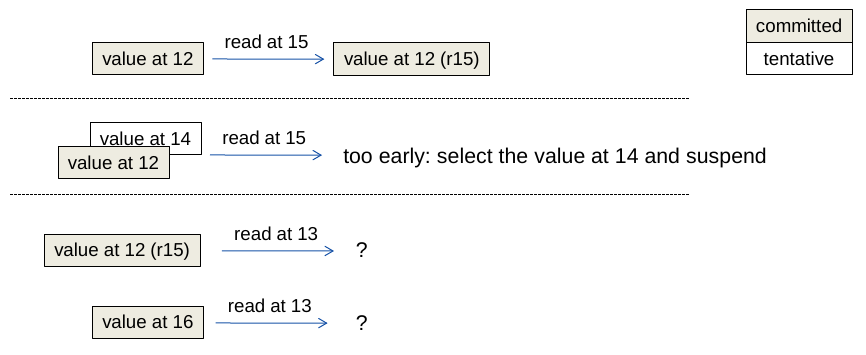
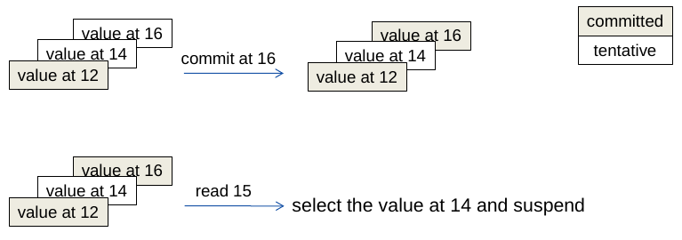
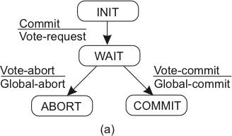

Voltemo-nos agora aos bancos de dados mais tradicionais, isto é, bancos de dados relacionais.
Destaco que quando falamos em bancos de dados relacionais, geralmente pensamos em bancos de dados transacionais, mas o que são transações?

## Transações
No banco de dados vistos no capítulo anterior, **operações** são enviadas **individualmente** para as réplicas do banco.
Já no modelo transacional, normalmente pensamos em **conjunto de operações** em vez de operações individuais; estes conjuntos de operações são as **transações**.

Considere um sistema bancário que mantém contas com saldos inteiros.
Seguindo a notação apresentada anteriormente, $R(C)10$ é um operação de leitura da conta $C$ que retorna o valor 10 e $W(C)20$ é a operação de atualização do saldo de $C$ para 20.
Vamos estender a notação para que $a = R(C)$  armazene o valor lido de $C$ em $a$.
Seja $T$ uma transação que incrementa o valor de uma conta em $1$; ela pode ser especificada como 

$a = R(C); W(C)a+1$

Imagine duas instâncias desta transação executando serialmente. 
Ao final da execução o saldo foi acrescido de 2, como esperado.

Se em vez disso as duas instâncias executassem concorrentemente, teríamos um resultado diverso, mesmo que o esperado fosse o mesmo resultado.

Ao final da execução, apesar do valor ter sido modificado duas vezes, o saldo teria sido acrescido de 1.
Esta diferença entre o esperado e o real está enraizada nas garantias dadas por bancos de dados tradicionais, conhecidas como ACID, acrônimo para **Atomicidade, Consistência, Isolamento e Durabilidade**.

???sideslide "ACID"
    * Atomicidade
    * Consistência
    * Isolamento
    * Durabilidade

A atomicidade diz respeito ao tratamento das operações como um conjunto indivisível, isto é, **ou todas as operações no conjunto são executadas ou nenhuma é.**

A propriedade de consistência dita que todas as transições do banco de dados devem **respeitar restrições nos seus dados**, por exemplo, os tipos de cada entrada no banco e integridade referencial.

Já a propriedade de isolamento se refere a como e quando os efeitos de uma transação passam a ser visíveis para outras transações, possivelmente concorrentes.
Há diversos níveis de isolamento, sendo menos restritivos, como **consistência eventual**[^cons], ou mais restritivo, como **seriabilidade estrita**.

[^cons]: Consistência no sentido visto no capítulo anterior, não no sentido ACID.

Finalmente, durabilidade é a garantia de que os resultados de uma transação são permanentemente gravados no sistema, a despeito de falhas.

Caso estas propriedades não sejam garantidas na execução de transações, problemas podem acontecer, como no exemplo anterior.
Por exemplo, seja uma transação que move 10% do saldo da segunda conta da primeira para a segunda, isto é, se $a$ tem saldo inicial 50 e $b$ tem saldo inicial 100, a transação transfere 10 de $a$ para $b$.

| T1(a,b)|
|----|
|$sB = R(b)$ 
|$W(b)sB*1.1$
|$sA = R(a)$
|$W(a)sA - (sB*0.1)$

E seja uma transação que calcule o somatório dos saldos em todas as contas especificadas, isto é, se aplicada às contas $a$ e $b$ do exemplo anterior, retorna 150 como resultado.

| T2([a,b])| 
|----|
|$sA = R(a)$
|$sB = R(b)$
|$sT = sA + sB$

Agora, seja uma execução concorrente destas transações da seguinte forma (tempo passa para baixo) e que o saldo inicial de $a$ e $b$ são ambos 10.

|T1(a,b) |  T2([a,b])| 
|----|-----|
|$sB = R(b)$      | 
|                         |  $sA = R(a)$
|     $W(b)sB*1.1$|
|                         |   $sB = R(b)$
|$sA = R(a)$     |
|  $W(a)sA - (sB*0.1)$|
|                         | $sT = sA+sB$

Qual o valor final calculado?

???example "Execução"
    Se $a$ inicialmente tem 50 e $b$ 100, então a seguinte execução ocorre:

    |T1(a,b) |  T2([a,b])| 
    |----|-----|
    |$sB = R(b)$ = 100     | 
    |                         |  $sA = R(a) = 50$
    |     $W(b)sB*1.1$ = 110|
    |                         |   $sB = R(b) = 110$
    |$sA = R(a) = 50$     |
    |  $W(a)sA - (sB*0.1) = 40$|
    |                         | $sT = sA+sB = 160$

O problema aqui é que dados sendo modificados, isto é, não finais, "vazaram" de T1 para T2, um fenômeno conhecido como ***dirty read***.
Isso ocorreu porquê o nível de isolamento provido foi nenhum.

Supondo uma execução de duas instâncias de T1, podemos observar outro problema, que pode deixar o BD em estado inválido.

|T1(a,b) |  T1(a,b)|
|----|-----|
|$sB = R(b)$      | 
|                         |  $sB = R(b)$
|                         | $W(b)sB*1.1$
|     $W(b) sB*1.1$|
|                         |$sA = R(a)$     
|                          |  $W(a)sA-(sB*0.1)$
|$sA = R(a)$     |
|  $W(a)sA-sB*0.1$|

???example "Execução"
    Se $a$ inicialmente tem 50 e $b$ 100, então a seguinte execução ocorre:

    |T1(a,b) |  T1(a,b)|
    |----|-----|
    |$sB = R(b) = 100$      | 
    |                         |  $sB = R(b) = 100$
    |                         | $W(b)sB*1.1 = 110$
    |     $W(b) sB*1.1$ = 110|
    |                         |$sA = R(a) = 50$     
    |                          |  $W(a)sA-(sB*0.1) = 40$
    |$sA = R(a) = 40$     |
    |  $W(a)sA-sB*0.1 = 30$|

Observe que $sB*0.1$ foi perdido, o que é conhecido como ***lost update***, agora porquê faltou isolamento.

Qual a solução? No primeiro exemplo deste capítulo, uma execução serial das operações não causou problema, enquanto a concorrente sim.
Testemos novamente uma **execução** em que as transações não se sobrepõem.

|T1(a,b) |  T1(a,b)|
|----|-----|
|                         |  $sB = R(b)$
|                         | $W(b)sB*1.1$
|                         |$sA = R(a)$
|                         |  $W(a)sA-(sB*0.1)$
|$sB = R(b)$      | 
|     $W(b)sB*1.1$|
|$sA = R(a)$     |
|  $W(a)sA-sB*0.1$|

Esta solução funciona, mas, na prática, queremos o máximo de **concorrência** para garantir o melhor **desempenho**.
O que queremos então é uma execução das transações semelhante à serial, para garantir a corretude dos resultados, mas com o desempenho garantido pela execução concorrente.
Isto é, **não queremos uma execução serial**, queremos uma execução **equivalente a uma execução serial**.

## Equivalência Serial

De forma geral, dizemos que duas execuções de transações são equivalentes se

* são execuções das mesmas transações (mesmas operações)
* quaisquer duas operações conflitantes são executadas na mesma ordem nas duas execuções.

Duas operações são conflitantes se 

* pertencem a transações diferentes,
* operam no mesmo dado, e
* pelo menos uma delas é escrita.

Uma execução tem **equivalência serial** se é equivalente a alguma execução serial das transações.
Ora, se uma execução é equivalente a uma execução serial e a execução serial não tem problemas relacionados a isolamento, pois não há transação concorrente que acesse dados incompletos, então a execução serial garante resultados corretos.
Assim, para obter tanto desempenho advindo da concorrência quanto corretude advinda da serialização, escalone as operações de forma a garantir equivalência serial.

Mas como obter equivalência serial? Não seria viável executar as operações e demonstrar *post facto* que a execução é correta.
Em vez disso, precisamos garantir por construção a equivalência serial, o que é bem mas simples, principalmente se considerarmos a seguinte restrição

* a execução de duas transações tem Equivalência Serial se todos os pares de operações conflitantes entre as transações são executados na mesma ordem.

Revisitemos o exemplo do *lost update*. Quais operações conflitam nesta execução?

???sideslide "Conflitos"
     Conflitos: 1x3:$\rightarrow$, 2x4:$\leftarrow$, 3x4:$\leftarrow$

|Operação|T1(a,b) |  T1(c,b)|
|----|----|-----|
|**1** |$sB = R(b)$| 
|**2** |                         |  $sB = R(b)$
|**3** |                         | $W(b)sB*1.1$
|**4** |     $W(b)sB*1.1$|
||                         |$sC = R(c)$     
||                         |  $W(c)sC-sB*0.1$
||$sA = R(a)$     |
||  $W(a)sA-sB*0.1$|

Claramente, os pares (1,3), (2,4) e (3,4) são conflitantes. Para se obter equivalência serial então é necessário garantir que em todos os pares se executem as operações na mesma ordem, isto é, ou da esquerda para a direita ou da direita para a esquerda.
Observe que este não é o caso neste exemplo.
Mas e se modificarmos a execução como a seguir?

???sideslide "Conflitos"
     Conflitos: 1x3:$\leftarrow$, 2x4:$\leftarrow$, 3x4:$\leftarrow$

|Operação|T1(a,b) |  T1(c,b)|
|----|----|-----|
|**2** |                         |  $sB = R(b)$
|**3** |                         | $W(b)sB*1.1$
|**1** |$sB = R(b)$| 
|**4** |     $W(b)sB*1.1$|
||                         |$sC = R(c)$     
||                         |  $W(c)sC-sB*0.1$
||$sA = R(a)$     |
||  $W(a)sA-sB*0.1$|

Neste exemplo modificado teremos as operações nos pares de conflitos sendo executadas da direita para a esquerda, o que garante a equivalência serial da execução.
Contudo, o modelo de transações usado até agora, em que o conjunto de operações é sempre executado até o fim, não corresponde à realidade.
Precisamos adicionar a este modelo a possibilidade da transação ser **abortada**, isto é, ter seus efeitos revertidos.
Sob este novo modelo, considere o seguinte exemplo, onde a transação da direita é abortada.

|T1(a,b) |  T1(c,b)|
|----|-----|
|                         |  $sB = R(b)$
|                         | $W(b)sB*1.1$
|$sB = R(b)$| 
|     $W(b)sB*1.1$|
|                         |$sC = R(c)$     
|                         |  $W(c)sC-sB*0.1$
|$sA = R(a)$     |
|  $W(a)sA-sB*0.1$|
|| aborte!|

Apesar das operações serem ordenadas da direita para a esquerda, houve um *dirty read* na execução da transação da esquerda.
Uma forma de pensar em como isso aconteceu, é considerar que o **aborte!** é uma operação que toca todos os dados usados pela transação abortada.
Assim, o **aborte!** conflita com as leituras de $b$ e de $a$ feitas pela transação da esquerda e, portanto, houve uma violação na ordem de execução das operações.

Para que este dirty read não leve a inconsistências, a transação da esquerda deve também abortar.
Esta estratégia pode ser implementada da seguinte forma: 

* se uma transação lê um dado atualizado por uma transação não comitada, suspenda a transação executando a leitura.
* se transação que atualizou o dado foi abortada, todas as suspensas que leram dela devem ser abortadas.
* repita passo anterior.

Graficamente, podemos ver o exemplo acima assim, tanto no caso de commit quando de abort da segunda transação.

Apesar de correta, esta abordagem tem um caso patológico que leva a **abortos em Cascata**: 
se T1 lê algo que T2 escreveu, e T2 lê algo que T3 escreveu, e assim por diante, se a última transação nesta cadeia de dependências for abortada, todas deverão ser abortadas.

Mas, e se evitarmos dirty reads em vez de tratarmos? Podemos fazê-lo com a seguinte estratégia:

* quando um transação T1 tenta ler um dado "sujo" escrito por T2, suspenda a execução da transação T1, antes da leitura acontecer.
* quando transação T2 for terminada, continue a execução de T1.

O que estamos tentando obter aqui é uma **execução estrita**, ou seja, uma execução em que Leituras e Escritas devem ser atrasadas até que todas as transações anteriores que contenham escritas nos mesmos dados sejam "comitadas" ou abortadas. Execuções estritas garante Isolamento, contudo, levam a menor concorrência, já que transações ficam suspensas.
Fica então a pergunta: **como implementar execuções estritas eficientes**?
A resposta está no controle de concorrência das transações.

## Controle de Concorrência

Consideremos três abordagens de controle de concorrência usadas por bancos de dados:

* locking: abordagem pessimista que paga um alto preço de sincronização mesmo quando as transações não interferem umas nas outras.
* multi-versão: abordagem otimista, que tem algo custo quando há muitos conflitos entre as transações.
* timestamp: abordagem mais complexa de se implementar.

### Locking

Nesta abordagem, todos os objetos usados por uma transação são trancados, impedindo que sejam acessados por outras transações, até que sejam destrancados.
Contudo, se os objetos são destrancados tão logo não sejam mais usados na transação, continuamos a ter *dirty reads*, como a operação em vermelho na figura a seguir.

Mesmo que se tentasse abortar a transação que executou a *dirty read*, poderia ser tarde demais, como no exemplo a seguir que demonstra uma **escrita prematura**.

Estes problemas podem ser evitados com o uso de ***strict two phase locking***, em que as transações **trancam o objeto quando primeiro acessado** e só **destrancam ao final da transação**, atomicamente com a terminação.

Já para aumentar a concorrência, é possível usar locks para leitura, compartilhados, e para escrita, exclusivos.

???sideslide "Read/Write locks"
    * dois níveis de acesso
    * múltiplos leitores
    * único escritor
    * reads por ser transformados em locks
    * writes *não* podem se transformados em reads (violaria Strict Two-Phase Locking)

Ou, ainda, locks com diferentes granularidades; em um banco de dados relacional, por exemplo, pode ser possível obter um lock em uma coluna de uma linha do banco, de toda a linha, de toda a relação, ou mesmo de todo o banco de dados.

Mas mesmo com estes ajustes, locks deveriam, via de regra, serem evitados sempre que a probabilidade de conflitos for baixa. 
Isso porquê os locks são uma abordagem **pessimista**, que incorrem em ***overhead*** mesmo quando transações não acessam os mesmos dados, lembrando que os locks só podem ser liberados no final das transações.

???sideslide "Evitar locks"
    * pessimista
    * overhead mesmo se não há conflitos
    * ou restritivo ou risco de deadlock
    * lock liberado somente no final, para evitar dirty reads/escrita prematura.

### Multi-versão

Uma alternativa otimista aos locks é assumir que não há conflitos nas transações enquanto elas executam e, somente ao final da execução, testar a validade desta premissa e, caso falhe, abortar a transação.
O controle de concorrência multi-versão (MVCC, do termo em inglês) faz isso mantendo uma cópia privada dos dados acessados pela transação.
Ao final da execução, na fase de **validação**, se a cópia pública de onde a privada foi copiada não tiver sido modificada, a transação é bem sucedida e atualizações são feitas nas cópias públicas.[^atu]

[^atu]: Na prática, a atualização consiste apenas em mudar um ponteiro para apontar para a cópia privada.

Esta técnica, conhecida como *deferred update* pois atrasa a atualização da cópia pública até o final da transação, tem como vantagens o **baixo** ***overhead***, se não houver conflitos.
Entretanto, se houver muitos conflitos, o trabalho da transação é todo desperdiçado já que a transação será abortada na **validação**.

A validação consiste em verificar se os *read* e *write sets* de quaisquer transações concorrentes são disjuntos, isto é, se dados transações $t1$ e $t2$:

* t1 não deve ler dados escritos por t2
* t2 não deve ler dados escritos por t1
* t1/t2 não deve escrever dados escritos por t2/t1

Na imagem a seguir, a transação **preta** precisa ser validada ou frente às transações **concorrentes** vermelhas, já comitadas, ou às azuis, ainda por comitar.

No caso da validação com transações já comitadas (***backward validation***) a validação pode ser simplificada assim:

* t1: transação sendo validada
* t2: transação já comitada.
* t1 não deve ler dados escritos por t2

Se a validação for com as transações ainda em execução (***forward validation***) a regra passa a ser:

* t1: transação sendo validada
* t2: transação ainda em execução
* t2 não deve ler dados escritos por t1

É preciso destacar que a ***forward validation*** pode levar a um cenário em que nenhuma transação é jamais comitada, pois uma cascata de aborts pode ocorrer.

### Timestamping [^kth]

[^kth]: Baseado no material disponível em [Distributed Systems, Basic Course](https://www.kth.se/social/course/ID2201/).

Uma terceira forma de controlar a concorrência associando uma ordem lógica para a execução das transações, de acordo com o início das transações.

* transação recebe um *timestamp* no início
* operações são validadas na execução
    * leia somente se nenhuma transação com maior timestamp tiver escrito e comitado
    * escreva somente se nenhuma transação com maior timestamp tiver lido e comitado
* transações "executam na ordem do timestamp"

Como implementar?

#### Como implementar

* objetos tem valores *tentativos*, não comitados
* objetos tem versões em que foram escritos
* em que foram comitados
* e em que foram lidos

* consistência é testado na execução da operação

#### Como implementar -- escrita

* escritas tem sucesso somente se versão sendo escrita é maior que versões lidas
* se versão sendo escrita é menor que versão já escrita, ignore e continue

### como implementar -- leitura

* leitura com versão v tem sucesso se maior versão é comitada e menor que v ou alguma não comitada
* leitura com versão v é suspensa se maior versão é não comitada e menor que v

* leitura com versão v é abortada se maior versão comitada é maior que v

## Bancos de dados distribuídos

Agora que relembramos como transações funcionam e temos uma noção de como podem ser implementadas em um sistema centralizado, vamos tentar entender como fazê-lo em um sistema distribuído.

* múltiplos servidores
* transações em cada servidor
* transações distribuídas
* como obter equivalência serial em transações distribuídas

### Transação distribuída

* `begintransaction(): tid` (transaction id)
* `operation(tid,op)`
* `endtransaction(tid): ok/nok`
* `aborttransaction(tid)`

Temos vários papéis sendo desempenhados aqui:

* cliente
* servidor: *resource managers*
* servidor: *transaction monitor/manager*

Localmente, cada bd funciona como um sistema centralizado normal, usando abordagens otimistas ou pessimista para garantir consistência.

O grande problema no bd distribuído é garantir o *acordo* na terminação.

### Comprometimento distribuído

O problema...

* transação $t$ acessa recursos nos resource managers (rm)
* terminar com sucessos $t$ em todos os rm - commit - ou
* abortar $t$ em todos os rm
* ainda que enlaces de comunicação, nós e rm falhem, antes ou durante a terminação da transação.

* participante -- resource manager "tocados" pela transação
* coordenador -- transaction manager

* Cliente decide quando iniciar o commit.
* Cada participante faz commit ou abort da transação local.   
    pode retornar ok ou nok.
* Coordenador não começa a commit até que a $t$ tenha terminado em todos os participantes e cliente tenha solicitado.
* Participantes falham por parada.

#### 1PC

* cliente envia `endtransaction(tid)` para o coordenador
* coordenador envia mensagem para participantes "comitarem" 

Mas...

* e se um participante retornar nok enquanto outros retornam ok?
* e se um participante não responder?

#### 2PC

* cliente envia `endtransaction(tid)` para o coordenador
* coordenador envia mensagem para participantes se prepararem para terminar
* coordenador espera que todos se preparem ou digam se não podem
* coordenador envia *ordem* de terminação

###### Comprometimento

* um participante $p$ está pronto para commit se tiver todos os valores modificados por $t$ em memória estável e nenhuma razão para abortar a transação (outras transações conflituosas fizeram commit?)
* o coordenador não pode começar a terminação até que todos os participantes estejam prontos.
* se algum participante aborta, o coordenador deve abortar. 

Problema de acordo, mas não igual ao consenso.

###### 2PC - o protocolo

* fase 1
    * a: coordenador envia vote-request para participantes.
    * b: participante responde com vote-commit ou vote-abort para o coordenador; se vote-abort, aborta localmente.

* fase 2
    * a: coordenador coleta votos de todos os processos; se forem todos vote-commit, envia global-commit para os participantes e ok para o cliente
    * b: participantes esperam por global-commit ou global-abort

| **Coordenador**        | **Participante**       |
| ---------------------- | ---------------------- |
|  |  |

###### Falha no Participante
Participante falha no estado $S$ e, ao se recuperar, identifica tal fato ao reprocessar o log de operações em memória durável.

Se está no estado

* INIT:  nem sabia que a terminação começou.  Aborta unilateralmente, pois ou já abortaram ou vão abortar.
* ABORT: havia votado abort ou recebido global-abort -- continua protocolo.
* COMMIT: estava pronto para terminar a transação com sucesso -- continua protocolo.
* READY:  estava esperando por commit ou abort.  Precisa saber se coordenador enviou global-commit ou global-abort -- consulta coordenador.

###### 2PC
Por que é difícil?

* E se $R_i$ falhar depois de ter se preparado?
* E se $R_i$ falhar mas $R_j$ continuar funcionando?
* E se todos estiverem desligados quando $R_i$ se recuperar?
* E se $R_i$ estiver lento e parecer que a transação falhou?

###### Falha no Participante

* READY: esperando por commit ou abort. Precisa saber se coordenador enviou global-commit our global-abort -- consulta coordenador.

*E se coordenador não estiver presente?*
	
Assumindo que participantes se conhecem, contate participante $Q$	

* Se $Q$ em COMMIT , vai para COMMIT
* Se $Q$ em ABORT , vai para ABORT
* Se $Q$ em INIT , ordena que Q aborte e, se confirmado, veja passo anterior
* Se $Q$ em READY , consulta outro participante.

*Se todos os participantes em READY?*  Possivelmente o coordenador já respondeu ao cliente.

*Precisa* esperar pelo coordenador.

###### Falha no Coordenador

O problema principal é: e se ninguém ouviu a decisão final do coordenador?

Neste caso, o protocolo não pode continuar, enquanto o coordenador não retornar, pois se os RM abortarem, podem estar contradizendo algo dito ao cliente, por exemplo, "Sim, ATM, pode entregar o dinheiro", ou executando um comando que o cliente vê como anulado, como "Reenvie o pedido de mais 27 carros à fábrica."

###### Recuperação do Coordenador
Ao se recuperar, o coordenador:

* sabe se começou a terminação de alguma transação
* sabe se já enviou alguma resposta final para as transações inacabadas
* sabe se já recebeu a confirmação de todos os participantes (se transação não estiver em aberto)
* reenvia a última mensagem das transações em aberto.

###### Otimizações

* Participantes "somente-leitura"
    * Não se importa com a decisão; termina após fase 1.
    * Responde com vote-commit-ro

* Abort presumido
    * Se ocorrer timeout, coordenador envia global-abort a todos e esquece transação
    * Se questionado, responde com global-abort.

* Transferência de coordenação
    * se houver somente um participante...
    * vote-request-transfer
    * participante responde com global-commit/global-abort

###### Coleta de Lixo
Mesmo quando somente um participante falha...

Após receber decisão, o participante pode concluir e esquecer a transação. 

Mas e se o participante falho precisar se recuperar e todos os outros envolvidos tiverem esquecido a transação?

 Coleta de lixo só pode ser feita quando todos tiverem confirmado a execução da transação e, por isso, Fase 2b é necessária.

#### 3-PC

Estende o protocolo para permitir contornar  falha do coordenador.

###### O Protocolo

* Fase 1a -- Coordenador envia vote-request para participantes.
* Fase 1b -- Participante responde com vote-commit ou vote-abort para o coordenador; se vote-abort, aborta localmente.
* Fase 2a -- Coordenador coleta votos de todos os processos; se forem todos vote-commit, envia *prepare-commit* para os participantes; se não, global-abort e para.
* Fase 2b -- Participantes esperam por prepare-commit ou global-abort; se o primeiro, *respondem com ready-commit*; se o segundo, param.
* Fase 3a -- coordenador espera por ready-commit de todos e então envia global-commit.
* Fase 3b -- participantes esperam por global-commit.

| Coordenador            | Participante           |
| ---------------------- | ---------------------- |
|  |  |

###### Falha no Participante

$P$ consegue saber o que fazer após se recuperar da falha no estado READY ou PRE-COMMIT

* Participantes e coordenador não distam mais que um estado.
* Se alguém em READY, o coordenador não mandou global-commit ainda; Aborte.
* Se *todos* em PRE-COMMIT, é possível comitar, comite.
* A execução dos passos anteriores tem que anular o poder do coordenador.

*Se todos os participantes em READY?*

###### 3PC x 2PC
* 3PC -- Aumenta disponibilidade
* 2PC -- Falha do coordenador é "corner case"
* 3PC -- Aumenta o custo do "caminho feliz" e por isso não é usado na prática
* Nenhum escala e não usá-los é uma das razões para o surgimento dos sistemas NoSQL

#### Paxos-Commit
Usa instâncias de Consenso Distribuído para votar. Se o consenso é tolerante a falhas e consistente, todos vêem o mesmo resultado na transação.

###### O protocolo

* Para terminar a transação $T$, o coordenador envia request-commit a todos os participantes.
* Um participante $P$ propõe seu voto na instância $T_P$ de consenso.
* Todo participante $P$ espera pelas decisões das instâncias de consenso $T_i$ para todos os participantes $i$, inclusive si mesmo; se todas as decisões forem commit, o participante comita a transação.

* Se cansar de esperar por $T_Q$, o participante propõe abort em $T_Q$.

###### Falha no Participante

* Se o participante falha antes de votar, então alguém votará abort por ele.
* Se o participante $P$ falha, ou é suspeito de, então é possível que dois votos diferentes tenham sido propostos em $T_P$; isso não é um problema pois a decisão é a mesma para todos observando a instância.
* Após se recuperar, o participante recupera as decisões de todas as instâncias $T_i$ e termina apropriadamente.

## Referências
* [Modern Algorithms and Data Structures: Bloom-Filter](http://www.slideshare.net/quipo/modern-algorithms-and-data-structures-1-bloom-filters-merkle-trees)
* [Balancing Strong and Eventual Consistency with Datastore](https://cloud.google.com/datastore/docs/articles/balancing-strong-and-eventual-consistency-with-google-cloud-datastore/)
* https://blog.yugabyte.com/a-primer-on-acid-transactions/
* https://jepsen.io/consistency
* https://fauna.com/blog/demystifying-database-systems-part-4-isolation-levels-vs-consistency-levels
* https://www.postgresql.org/docs/9.5/transaction-iso.html
* Inspirado nas notas de aula de Johan Montelius e Vladimir Vlassov, da disciplina ID2201 Distributed Systems, KTH Royal Institute of Technology. Imagens copiadas descaradamente de seus slides em https://www.kth.se/social/files/57c2cbd7f276541680e39e6d/transactions.pdf
* https://www.cs.ucy.ac.cy/~dzeina/courses/epl446/lectures/16.pdf
* https://www.cs.princeton.edu/courses/archive/fall18/cos418/docs/p8-consistency.pdf
* https://aphyr.com/posts/313-strong-consistency-models 

!!!todo "TODO"
    * Mover ED SD de Tecnologias para cá
    * Combinar
          * https://adambcomer.com/blog/simple-database/motivation-design.html
          * https://adambcomer.com/blog/simple-database/memtable.html
          * https://adambcomer.com/blog/simple-database/wal.html
          * https://www.jasondavies.com/bloomfilter/

