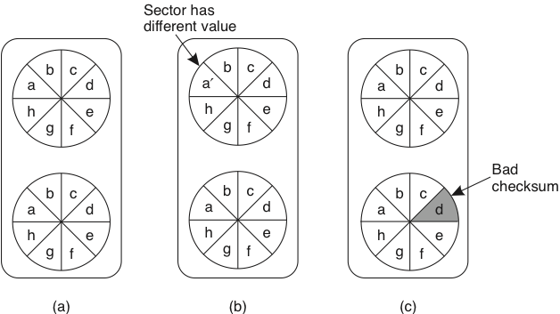
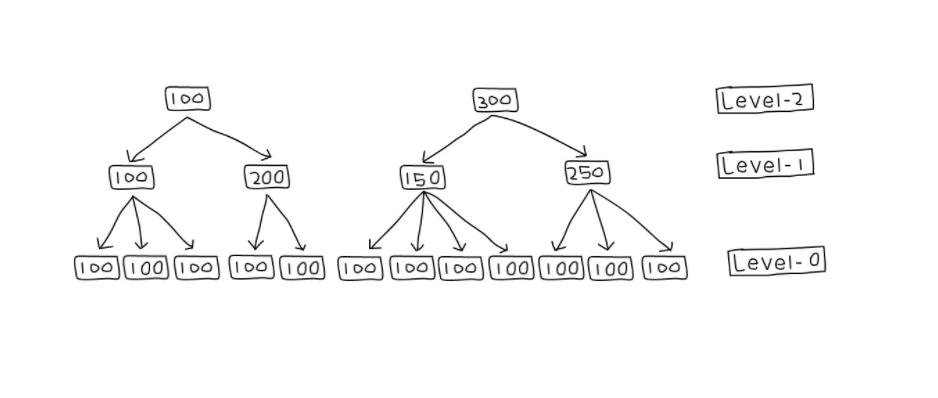

Vejamos alguns destes modelos de consistência, começando por aqueles com que estão mais acostumados, isto é, o que experimentam nos bancos de dados relacionais com que trabalham.
Antes, lembre-mo-nos de que quando falamos em bancos de dados relacionais, pensamos em bancos de dados transacionais, mas o que são transações?


## Transações
No modelo de Máquinas de Estados Replicadas, **operações** são enviadas **individualmente** para as réplicas, que as executam em ordem.
Já no modelo transacional, também desejamos que as operações dos clientes sejam executadas atomicamente, mas normalmente pensamos em **conjunto de operações** em vez de operações individuais. 
Estes conjuntos de operações são as **transações**, das quais nos habituamos a esperar algumas propriedades, conhecidas como ACID.

* Atomicidade - O conjunto de operações em uma transação é tratado como uma unidade e **ou todas as operações na unidade são executadas ou nenhuma é.**
* Consistência - Toda transação leva o banco de dados **de um estado válido para um estado válido**.
* Isolamento - Trata sobre quando e como os efeitos de uma transação passam a ser visíveis para outra transação, tendo vários níveis.
* Durabilidade - Garante que os resultados de uma transação são permanentemente gravados no sistema, a despeito de falhas.
     * **Nemória estável**
          * HD -- Hard Drives
          * SSD -- Solid State Drives
          * NVRAM -- Non Volatile RAM


### O Banco
Conta C

```
C.getSaldo()
C.setSaldo(montante)
```

#### Transação
Mova 10% do saldo de B, de A para B.
```
T1: a -> b
sB = b.getSaldo()
     b.setSaldo(sB*1.1)
sA = a.getSaldo()                          
     a.setSaldo(sA-sB*0.1)
```

#### Transação
Qual o saldo total das contas?
```
T2: a + b
sA = a.getSaldo()
sB = b.getSaldo()
sT = sA + sB
```

#### Execução Concorrente
Execução concorrente de T1 e T2?
```
T1                           T2
sB = b.getSaldo()            
                             sA = a.getSaldo()
     b.setSaldo(sB*1.1) .    
                             sB = b.getSaldo()
sA = a.getSaldo()                          
     a.setSaldo(sA-sB*0.1) 
                             sT = sA+sB
```

 Dados não finais "vazaram". *Dirty Read*. 

 Falta *Isolamento*.

Pode levar a mais que um resultado errado. Pode deixar o BD em estado inválido.

#### Execução Concorrente
Mova 10% do saldo de B, de A para B.
```
T1                       T1
sB = b.getSaldo()
                          sB = b.getSaldo()
                               b.setSaldo(sB*1.1)
     b.setSaldo(sB*1.1)                                        
                          sA = a.getSaldo()                          
                               a.setSaldo(sA-sB*0.1)
sA = a.getSaldo()                          
     a.setSaldo(sA-sB*0.1)
```

 `sB*0.1`  foi perdido. *Lost Update*

 Perdeu *Consistência*

#### Solução?!
Para garantir Isolamento

* Execuções dos conjuntos não podem se sobrepor.
* Execute um conjunto de operações por vez, serialmente!
* Garantirá também Consistência

*Que tal?*

Limite a concorrência de transações.


## Equivalência Serial

### Concorrência
Além de ACID, queremos o máximo de *concorrência* para garantir o melhor *desempenho*.

Queremos uma execução das transações semelhante à serial, mas com o desempenho de concorrente.

Não queremos uma execução serial, mas uma *Equivalência Serial*, isto é, que os efeitos das transações, executadas concorrentemente, sejam equivalentes aos de alguma execução serial destas transações.


### Equivalência Serial
Preocupe-se com Operações Conflitantes

* Transações diferentes
* Uma é escrita
* Mesmo dado


Duas execuções (de transações) são equivalentes se

* as transações tem as mesmas operações
* quaisquer duas operações conflitantes são executadas na mesma ordem nas duas execuções


Uma execução tem Equivalência Serial se é equivalente a alguma execução serial das transações.

Escalone operações concorrentemente, de forma a obter o melhor desempenho, mas de forma a manter Equivalência Serial.

Esta definição difícil de ser testada. Algo mais simples?

* Como demonstrar Equivalência Serial? 
* Tenho que testar todas as execuções seriais e ver se uma casa com o que planejo fazer?
* É caro fazer este planejamento. É mais eficiente garantir por construção.

Simplificação: A execução de duas transações tem Equivalência Serial se todos os pares de operações conflitantes entre as transações são executados na mesma ordem.

### Lost Update
Mova 10% do saldo de X, de Y para X.
```
a -> b                     c -> b
s = b.getSaldo() [1]
                           [2]s = b.getSaldo()
                           [3]    b.setSaldo(s*1.1)
    b.setSaldo(s*1.1)[4]                                        
                                  c.setSaldo(s*0.1)
    a.setSaldo(s*0.1)
```

Conflitos: 1x3:$\rightarrow$, 2x4:$\leftarrow$, 3x4:$\leftarrow$

Consistência -- `s*0.1` foi perdido


Mova 10% do saldo de X, de Y para X.
```
a -> b                    c -> b
                          [2] s = b.getSaldo()
                          [3]     b.setSaldo(s*1.1)
s = b.getSaldo() [1]
    b.setSaldo(s*1.1)[4]                                        
                                  c.setSaldo(s*0.1)
    a.setSaldo(saldo*0.1)
```

Conflitos: 1x3:$\leftarrow$, 2x4:$\leftarrow$, 3x4:$\leftarrow$


### Dirty Read

Saldo total?
```
a -> b                  a -> b
s = b.getSaldo()
    b.setSaldo(s*1.1)
    b.setSaldo(s*1.1)                                        
    a.saque(s*0.1)
                        s = b.getSaldo()
                            b.setSaldo(s*1.1)
                            b.setSaldo(s*1.1)                                        
                            a.saque(s*0.1)
```
 Tem Equivalência Serial.

 Exceto se
```
abortTransaction()
```
Nenhuma transação que fez uma dirty read pode comitar. Logo, aborte a transação da direita.

### Aborto em Cascata
T1 faz uma escrita. T2 lê o que T1 escreveu e faz outra escrita. T3 lê o que T2 escreveu e faz outra escrita. T4 lê o que... *T1 aborta*.


### Dirty Read
Como lidar?

* Suspenda a transação quando esta fizer dirty read.
* Se transação foi abortada, todas as suspensas (que leram dela) devem ser abortadas.
* Repita passo anterior.


 E se evitarmos dirty reads em vez de tratarmos?


* Suspenda antes de fazer dirty read.
* Quando transação for terminada, continue execução.

 Abordagem leva a menor concorrência.


Para nos permitir identificar transações, vamos usar o seguinte framework para operá-las.

### Transações

* ` beginTransaction(`)
* operações
* `commitTransaction(): Ok/NOk`
* `abortTransaction()`


### Escrita Prematura
```
Saldo inicial: 100

a.setSaldo(105)
                   a.setSaldo(110)  
                   commitTransaction()
abortTransaction()
```

A transação da direita não le, apenas escreve. O resultado?  O saldo volta para 100.


### Strict Execution

* Leituras e Escritas devem ser atrasadas até que todas as transações anteriores que contenham escritas sejam commitadas ou abortadas.
* Execução estrita garante Isolamento.
* Como implementar eficientemente?


## Controle de Concorrência

### Como
* locks (pessimista): simples, mas problemático
* multi-versão (otimista): custo se há muitos conflitos
* timestamp: *time* é algo complicado

### Locks
Tranque todos os objetos para que outras transações não consigam ler ou escrevê-los. Destranque quando não mais necessários.

Sofre de dirty reads e escritas prematuras.

#### Strict Two Phase Locking

* tranque quando necessário
* destranque ao final da transação
* termine a transação

Como aumentar a concorrência?

### Read-Write Locks

* dois níveis de acesso
* múltiplos leitores
* único escritor
* reads por ser transformados em locks
* writes *não* podem se transformados em reads (violaria Strict Two-Phase Locking)


<!--
### variantes

* two-version locking (read/write/commit)
%	similar idea but now with: read, write and commit locks.
%	
%		* a read lock is allowed unless a commit lock is taken.
%		* one write lock is allowed if no commit lock is taken (i.e. even if read locks are taken)
%		* written values are held local to the transaction and are not visible before commit.
%		* a write lock can be promoted to a commit lock if there are no read locks.
%		* when a transaction commits it tries to promote write locks to commit locks.
%	
* lock hierárquico (granularidades variadas)
%	locks of mixed granularity.
%	
%		* small locks increase concurrency
%		* large locks decrease overhead
%	
-->


### Lock -- por que evitar?

* pessimista
* overhead mesmo se não há conflitos
* ou restritivo ou risco de deadlock
* lock liberado somente no final, para evitar dirty reads/escrita prematura.


### Abordagem mais otimista?

* modifique uma cópia privada dos dados
* na hora de terminar a transação, verifique se nenhuma transação modificou o dado, isto é, se a cópia privada ainda é válida
* substitua a cópia pública pela privada

Esta técnica é conhecida como *deferred update*, pois o update dos dados só ocorre no final, se a validação passar.

#### Abordagem otimista

* baixo overhead, se não houver conflitos
* validação é rápida
* update é simples

Se houver muitos conflitos, o trabalho da transação é todo desperdiçado.

### Validação
read e write sets de quaisquer transações concorrentes deve ser disjuntos.

* t1 não deve ler dados escritos por t2
* t2 não deve ler dados escritos por t1
* t1/t2 não deve escrever dados escritos por t2/t1


#### Backward validation

* t1: transação sendo validada
* t2: transação já comitada.
* t1 não deve ler dados escritos por t2

Em caso de não validação, aborte t1


#### Forward validation

* t1: transação sendo validada
* t2: transação ainda em execução
* t2 não deve ler dados escritos por t1

Em caso de não validação, aborte t1, possivelmente nunca terminando uma transação.<br/>
ou aborte t2.


### Timestamping

* transação recebe um *timestamp* no início
* operações são validadas na execução
    * leia somente se nenhuma transação com maior timestamp tiver escrito e comitado
    * escreva somente se nenhuma transação com maior timestamp tiver lido e comitado
* transações "executam na ordem do timestamp"


Como implementar?


#### Como implementar

* objetos tem valores *tentativos*, não comitados
* objetos tem versões em que foram escritos
* em que foram comitados
* e em que foram lidos


* consistência é testado na execução da operação

#### Como implementar -- escrita

* escritas tem sucesso somente se versão sendo escrita é maior que versões lidas
* se versão sendo escrita é menor que versão já escrita, ignore e continue


### como implementar -- leitura

* leitura com versão v tem sucesso se maior versão é comitada e menor que v ou alguma não comitada
* leitura com versão v é suspensa se maior versão é não comitada e menor que v


* leitura com versão v é abortada se maior versão comitada é maior que v


#### Referências
Inspirado nas notas de aula de johan montelius e vladimir vlassov, da disciplina id2201 distributed systems, kth royal institute of technology. imagens copiadas descaradamente de seus slides.

Também aqui, https://www.cs.ucy.ac.cy/~dzeina/courses/epl446/lectures/16.pdf


## Bancos de dados distribuídos

## bancos de dados transacionais distribuídos
Agora que relembramos como transações funcionam e temos uma noção de como podem ser implementadas em um sistema centralizado, vamos tentar entender como fazê-lo em um sistema distribuído.

* múltiplos servidores
* transações em cada servidor
* transações distribuídas
* como obter equivalência serial em transações distribuídas


## Transação distribuída

* `begintransaction(): tid` (transaction id)
* `operation(tid,op)`
* `endtransaction(tid): ok/nok`
* `aborttransaction(tid)`

### Papéis
* cliente
* servidor: *resource managers*
* servidor: *transaction monitor/manager*


Localmente, cada bd funciona como um sistema centralizado normal, usando abordagens otimistas ou pessimista para garantir consistência.

O grande problema no bd distribuído é garantir o *acordo* na terminação.


## Comprometimento distribuído

### atomicidade
O problema...

* transação $t$ acessa recursos nos resource managers (rm)
* terminar com sucessos $t$ em todos os rm -- commit -- ou
* abortar $t$ em todos os rm
* ainda que enlaces de comunicação, nós e rm falhem, antes ou durante a terminação da transação.

### 2PC - 2 Phase Commit

* participante -- resource manager "tocados" pela transação
* coordenador -- transaction manager

#### Premissas

* Cliente decide quando iniciar o commit.
* Cada participante faz commit ou abort da transação local.<br/>
pode retornar ok ou nok.
* Coordenador não começa a commit até que a $t$ tenha terminado em todos os participantes e cliente tenha solicitado.
* Participantes falham por parada.

#### 1PC

* cliente envia `endtransaction(tid)` para o coordenador
* coordenador envia mensagem para participantes "comitarem" 
* e se um participante retornar nok? % enquanto outros retornam ok?
* e se um participante não responder?

#### 2PC

* cliente envia `endtransaction(tid)` para o coordenador
* coordenador envia mensagem para participantes se prepararem para terminar
* coordenador espera que todos se preparem ou digam se não podem
* coordenador envia *ordem* de terminação

#### Comprometimento

* um participante $p$ está pronto para commit se tiver todos os valores modificados por $t$ em memória estável e nenhuma razão para abortar a transação (outras transações conflituosas fizeram commit?)
* o coordenador não pode começar a terminação até que todos os participantes estejam prontos.
* se algum participante aborta, o coordenador deve abortar. 

Problema de acordo, mas não igual ao consenso.

#### 2PC -- o protocolo

* fase 1
    * a: coordenador envia vote-request para participantes.
    * b: participante responde com vote-commit ou vote-abort para o coordenador; se vote-abort, aborta localmente.


* fase 2
    * a: coordenador coleta votos de todos os processos; se forem todos vote-commit, envia global-commit para os participantes e ok para o cliente
    * b: participantes esperam por global-commit ou global-abort

| **Coordenador**        | **Participante**       |
| ---------------------- | ---------------------- |
|  |  |


#### Falha no Participante
Participante falha no estado $S$ e, ao se recuperar, identifica tal fato ao reprocessar o log de operações em memória durável.

Se está no estado

* INIT:  nem sabia que a terminação começou.  Aborta unilateralmente, pois ou já abortaram ou vão abortar.
* ABORT: havia votado abort ou recebido global-abort -- continua protocolo.
* COMMIT: estava pronto para terminar a transação com sucesso -- continua protocolo.
* READY:  estava esperando por commit ou abort.  Precisa saber se coordenador enviou global-commit ou global-abort -- consulta coordenador.


#### 2PC
Por que é difícil?

* E se $R_i$ falhar depois de ter se preparado?
* E se $R_i$ falhar mas $R_j$ continuar funcionando?
* E se todos estiverem desligados quando $R_i$ se recuperar?
* E se $R_i$ estiver lento e parecer que a transação falhou?


#### Falha no Participante

* READY: esperando por commit ou abort. Precisa saber se coordenador enviou global-commit our global-abort -- consulta coordenador.

*E se coordenador não estiver presente?*
	
Assumindo que participantes se conhecem, contate participante $Q$	

* Se $Q$ em COMMIT , vai para COMMIT
* Se $Q$ em ABORT , vai para ABORT
* Se $Q$ em INIT , ordena que Q aborte e, se confirmado, veja passo anterior
* Se $Q$ em READY , consulta outro participante.

*Se todos os participantes em READY?*  Possivelmente o coordenador já respondeu ao cliente.

*Precisa* esperar pelo coordenador.

#### Falha no Coordenador

O problema principal é: e se ninguém ouviu a decisão final do coordenador?

Neste caso, o protocolo não pode continuar, enquanto o coordenador não retornar, pois se os RM abortarem, podem estar contradizendo algo dito ao cliente, por exemplo, "Sim, ATM, pode entregar o dinheiro", ou executando um comando que o cliente vê como anulado, como "Reenvie o pedido de mais 27 carros à fábrica."


#### Recuperação do Coordenador
Ao se recuperar, o coordenador:

* sabe se começou a terminação de alguma transação
* sabe se já enviou alguma resposta final para as transações inacabadas
* sabe se já recebeu a confirmação de todos os participantes (se transação não estiver em aberto)
* reenvia a última mensagem das transações em aberto.


#### Otimizações

* Participantes "somente-leitura"
    * Não se importa com a decisão; termina após fase 1.
    * Responde com vote-commit-ro

* Abort presumido
    * Se ocorrer timeout, coordenador envia global-abort a todos e esquece transação
    * Se questionado, responde com global-abort.

* Transferência de coordenação
    * se houver somente um participante...
    * vote-request-transfer
    * participante responde com global-commit/global-abort


#### Coleta de Lixo
Mesmo quando somente um participante falha...

Após receber decisão, o participante pode concluir e esquecer a transação. 

Mas e se o participante falho precisar se recuperar e todos os outros envolvidos tiverem esquecido a transação?

 Coleta de lixo só pode ser feita quando todos tiverem confirmado a execução da transação e, por isso, Fase 2b é necessária.


### 3-PC

Estende o protocolo para permitir contornar  falha do coordenador.

#### O Protocolo

* Fase 1a -- Coordenador envia vote-request para participantes.
* Fase 1b -- Participante responde com vote-commit ou vote-abort para o coordenador; se vote-abort, aborta localmente.
* Fase 2a -- Coordenador coleta votos de todos os processos; se forem todos vote-commit, envia *prepare-commit* para os participantes; se não, global-abort e para.
* Fase 2b -- Participantes esperam por prepare-commit ou global-abort; se o primeiro, *respondem com ready-commit*; se o segundo, param.
* Fase 3a -- coordenador espera por ready-commit de todos e então envia global-commit.
* Fase 3b -- participantes esperam por global-commit.


| Coordenador            | Participante           |
| ---------------------- | ---------------------- |
|  |  |


#### Falha no Participante

$P$ consegue saber o que fazer após se recuperar da falha no estado READY ou PRE-COMMIT

* Participantes e coordenador não distam mais que um estado.
* Se alguém em READY, o coordenador não mandou global-commit ainda; Aborte.
* Se *todos* em PRE-COMMIT, é possível comitar, comite.
* A execução dos passos anteriores tem que anular o poder do coordenador.

*Se todos os participantes em READY?*

#### 3PC x 2PC
* 3PC -- Aumenta disponibilidade
* 2PC -- Falha do coordenador é "corner case"
* 3PC -- Aumenta o custo do "caminho feliz" e por isso não é usado na prática
* Nenhum escala e não usá-los é uma das razões para o surgimento dos sistemas NoSQL


### Paxos-Commit
Usa instâncias de Consenso Distribuído para votar. Se o consenso é tolerante a falhas e consistente, todos vêem o mesmo resultado na transação.


#### O protocolo

* Para terminar a transação $T$, o coordenador envia request-commit a todos os participantes.
* Um participante $P$ propõe seu voto na instância $T_P$ de consenso.
* Todo participante $P$ espera pelas decisões das instâncias de consenso $T_i$ para todos os participantes $i$, inclusive si mesmo; se todas as decisões forem commit, o participante comita a transação.

* Se cansar de esperar por $T_Q$, o participante propõe abort em $T_Q$.


#### Falha no Participante

* Se o participante falha antes de votar, então alguém votará abort por ele.
* Se o participante $P$ falha, ou é suspeito de, então é possível que dois votos diferentes tenham sido propostos em $T_P$; isso não é um problema pois a decisão é a mesma para todos observando a instância.
* Após se recuperar, o participante recupera as decisões de todas as instâncias $T_i$ e termina apropriadamente.


## Log Recuperável

Como garantir que o log poderá ser lido para recuperar o processo?

### Disco Duplicado


* Dois discos iguais?
* Dados diferentes, mas ambos bons?
* Um bom outro estragado?
* Ambos estragados?


<!-- ## NoSQL -->

## Estruturas de Dados para SD

Qualquer que seja a escolha de algoritmo para fazer o particionamento dos dados entre servidores, sobra ainda a questão de como manipular os dados dentro do servidor.
Idealmente, toda operação seria executada a partir da memória principal, tendo assim a menor latência possível.
Contudo, para que se tenha também durabilidade das operações executadas, para que os dados manipulados sobrevivam a reinicializações do servidor, intencionais ou não, é preciso armazenar os dados em **memória estável**, da qual a mais comum são os **discos rígidos**.

É notório que escritas em disco são muito mais lentas que em memória principal, mas o que exatamente é lento no acesso ao disco?
Essencialmente, o posicionamento da cabeca de leitura/escrita na trilha correta do disco, pois esta operação é mecânica.
Por esta razão, acessos aleatórios são mais custosos que acessos sequenciais, pois neste o custo de posicionamento é pago apenas uma vez.
Por este motivo, muitos bancos de dados, especialmente DHT pois tem seu uso focado em quantidades muito grandes de dados, gerados e acessados com grande velocidade, tentam acessar o disco sempre de forma sequencial.
Alguns bancos de dados, como o Cassandra, armazenam os dados na forma de uma *Log Structured Merge Tree*, ou LSMT.

### Log Structured Merge Tree

Uma ***Log Structured Merge Tree*** é uma forma de se armazenar dados em disco de forma de forma quase sempre sequencial, minimizando assim os o impacto da durabilidade no desempenho do sistema.
Considere um banco armazenando uma pequena quantidade de dados, que cabe em memória principal.
Na LSMT, operações de escrita são adicionadas a um ***commit log***, em disco,  e somente então são executadas em memória principal e confirmadas para o cliente; a estrutura que armazena os dados em memória é denominada *memory table*, ou simplesmente **memtable**.
Neste cenário o acesso ao disco na escrita é sequencial, o melhor que se pode ter em um disco, e a recuperação dos dados é feita diretamente da memória, rápida.


No caso de uma reinicialização do processo, a reexecução do *commit log* restaurará o estado da memtable. Contudo, se o *commit log* for extenso, reexecutá-lo demandará um tempo significativo.
Uma forma de acelerar o processo é fazer ***snapshots*** da memtable de forma sincronizada com a escrita no log.
Isto é, digamos que todas as operações de escrita, até a décima, estão salvas no commit log e refletidas na memtable.
Digamos também que todas as operações são modificações da mesma linha do banco de dados em memória.
Se um *snapshot*  é tomado, ele será correspondente ao commit log, isto é, conterá o efeito de exatamente as mesmas 10 operações, mas de forma mais compacta que o log, uma vez que o log conterá dez operações e o snapshot somente uma linha de dados.
Após o snapshot ser concluído, o log correspondente pode ser apagado.
Novas operações de escrita devem ser armazenadas em um novo log e, no caso de uma reinicialização, primeiro se deve restaurar o *snapshot* e então o novo log.
Para lidar com corrupções de arquivo no sistema, pode ser uma boa ideia manter mais do que o último log e *snapshot*, já que a recuperação do estado exigiria voltar mais atrás na reexecução de operações.

Observe que, além da escrita dos logs, todos os outros acessos ao disco também são sequenciais, seja o *flush* das memtables, ou a leitura dos snapshots para recuperação e do commit log para reexecução, e já que operações de leitura são todas respondidas da memória, o sistema terá um excelente desempenho.
Contudo, há outro limitante de desempenho importante, relacionado à premissa pouco realista de que os dados cabem todos em memória. Isto é, se os dados não cabem em memória, *snapshots*  serão importantes não somente para permitir coletar lixo dos logs, isto é, dados obsoletos, mas também, para usar a capacidade de armazenamento dos discos.

Consideremos então um cenário em que a memtable cabe apenas *n* entradas; quando a operação para adicionar $n+1$-ésima entrada à memtable é recebida, um ***flushs*** dos dados para um novo *snapshot* é feito e a memtable é *resetada*, liberando espaço em memória. Para melhorar o desempenho, estas descargas podem ser feitas proativamente antes da chegada de novas entradas e fora do *caminho crítico* da operação de escrita, mas isto é apenas uma otimização e portanto não a consideraremos aqui.


Neste novo fluxo, os arquivos em disco não correspondem mais a *snapshots* do banco de dados, então nos referiremos a eles como *stable storage tables*, ou **sstables**, em oposição às *memtables*, pelo menos por enquanto.


##### Compactações

Apesar deste novo fluxo de escrita aumentar a capacidade de armazenamento do nosso banco de dados, ele traz problemas para o fluxo de leitura.
Digamos que a chave $k$ teve um valor atribuído e descarregado em uma sstable em diversas ocasiões.
O primeiro problema aqui é que há vários valores antigos associados a $k$, inutilmente e ocupando espaço, isto é, lixo.
O segundo é que caso o valor associado a $k$ seja requisitado, o sistema deverá retornar a última versão, que pode estar em diversos arquivos.
Para lidar com ambos os problemas, podemos **compactar** as sstables juntas, eliminados dados obsoletos e minimizando o número de arquivos a serem pesquisados no caso de leitura.
Caso a sstables estejam ordenadas, o procedimento de compactação pode ser feito como a união de dois segmentos de dados no *merge sort*, isto é, iterando-se paralelamente nos dois arquivos e escolhendo sempre a menor chave da vez e movendo-a para um novo segmento que conterá a união dos dados.
A figura a seguir mostra um exemplo que várias sstables de nível 0, aquelas geradas por *flushs*, são unidas gerando sstables de nível 1 e assim sucessivamente.
Observe como as compactações geram uma árvore (na verdade, uma floresta), razão do nome *merge tree*.




No caso de uma pesquisa, somente as tabelas mais à direita e de nível mais alto precisam ser consultadas e portanto as sstables já usadas como entrada podem ser eliminadas como lixo do sistema.
Ainda assim, no caso de uma leitura, diversas sstables potencialmente contém o dado a ser retornado.
O problema se agrava em sistemas em que partes do dado possam ser gravadas independentemente, como no CassandraDB, em que cada coluna é independente das outras.
Diversas propostas poderiam ser feitas para se identificar mais rapidamente se uma sstable contém uma chave.


Por exemplo, pode-se associar a cada tabela um bitmap indicando a presença ou não de uma certa chave, mas esta abordagem obviamente falha se o espaço de chaves for grande.
Outra possibilidade é lembrar a faixa de chaves contida na tabela. Esta estratégia pode ser útil caso haja localidade no espaço de chaves no momento da escrita, mas falhará miseravelmente se o espaço de chaves for usado uniformemente, resultando em faixas grandes entre a menor e maior chaves de cada tabela.
Como acelerar a identificação das sstables pertinentes? Entram em cena os filtros de **Bloom**.

### Filtros de Bloom

De acordo com nossa fonte mais que confiável, a [Wikipedia](https://en.wikipedia.org/wiki/Bloom_filter)

!!!quote "Bloom Filter"
    A Bloom filter is a ***space-efficient probabilistic*** data structure, conceived by Burton Howard *Bloom* in 1970, that is used to test whether an element is a member of a set. False positive matches are possible, but false negatives are not, thus a Bloom filter has a 100% recall rate. In other words, a query returns either **"possibly in set"** or **"definitely not in set"**.

Se associarmos a cada sstable um filtro de Bloom, então só será preciso lê-la se o filtro correspondente disser que a chave possivelmente está contida, como no seguinte exemplo.


Mas como exatamente construímos um filtro de Bloom?
Iniciamos com um vetor de bits inicialmente zerados e um conjunto finito de funções de hash cujo resultado seja uniformemente distribuído no tamanho do vetor de bits.
Para cada elemento colocado no conjunto a ser refletido pelo filtro, aplicamos cada uma das funções hash e colocamos o bit 1 na posição do vetor igual ao resultado da função.
No exemplo a seguir, inserimos os elementos x, y e z e usamos três funções hash.

](./images/bf.png)


Na **consulta**, cada elemento passa por pelas mesmas funções hash.
Se algum dos índices apontados não estiver com um 1, como no caso do c, no exemplo, o elemento não pertence ao conjunto.
Caso contrário, o filtro responderá que é possível que pertença.

Mas quão bom é um filtro de Bloom na identificação do das sstables? Ou, de outra forma, quais fatores influenciam na taxa de falsos positivos do filtro?

* o número $n$ de elementos no conjunto, uma vez que quanto mais elementos, mais bits  1;
* o número $k$ de hashes, pois quanto mais hashes, mais bits transformados em 1; e,
* o número $m$ de bits no vetor, pois quanto menos bits, mais colisões de bits.

De forma mais precisa,

* a probabilidade de setar um certo bit na inserção de um elemento é $1/m$, e
* a probabilidade de não setar tal bit é $1 - 1/m$;
* a probabilidade de $k$ hashes não setarem um bit é $(1 - 1/m)^k$;
* a probabilidade de não setar um bit após $n$ inserções é $(1 - 1/m)^{kn}$;
* a probabilidade de setar um bit após $n$ inserções é $1 - (1 - 1/m)^{kn}$

Logo,

* a probabilidade de falso positivo $p = (1 - (1 - 1/m)^{kn})^k \approx (1 - e^{-kn/m})^k$
O que nos permite chegar à relação
* $m/n = - 1.44\log_2 p$, em que podemos calcular $m$ em função do $n$ esperado e do $p$ desejado.
E podemos também identificar o $k$ ótimo para a situação, pela equação
* $k = - \frac{\ln p}{\ln 2} = - \log_2 p$

Uma forma "simples" de visualizar este resultado é dada pela figura a seguir, em que o eixo Y dá a taxa de falsos positivos do filtro em função do número de elementos inseridos, indicado no eixo X, para diversas configurações, apresentadas como curvas.
Por exemplo, com um filtro com $m = 2^{24}b = 2MB$, após 1 milhão de inserções, tem-se probabilidade de falsos positivo $p = 0,0001$.


## Referências
* [Modern Algorithms and Data Structures: Bloom-Filter](http://www.slideshare.net/quipo/modern-algorithms-and-data-structures-1-bloom-filters-merkle-trees)
* [Balancing Strong and Eventual Consistency with Datastore](https://cloud.google.com/datastore/docs/articles/balancing-strong-and-eventual-consistency-with-google-cloud-datastore/)
* https://blog.yugabyte.com/a-primer-on-acid-transactions/
* https://jepsen.io/consistency
* https://fauna.com/blog/demystifying-database-systems-part-4-isolation-levels-vs-consistency-levels


!!!todo "TODO"
    * Mover ED SD de Tecnologias para cá
    * Combinar
          * https://adambcomer.com/blog/simple-database/motivation-design.html
          * https://adambcomer.com/blog/simple-database/memtable.html
          * https://adambcomer.com/blog/simple-database/wal.html
          * https://www.jasondavies.com/bloomfilter/

