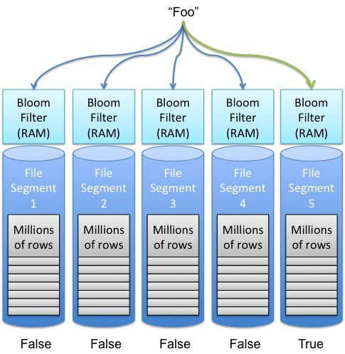

# Bancos de Dados Distribuídos

## NoSQL

## Estruturas de Dados para SD

Qualquer que seja a escolha de algoritmo para fazer o particionamento dos dados entre servidores, sobra ainda a questão de como manipular os dados dentro do servidor.
Idealmente, toda operação seria executada a partir da memória principal, tendo assim a menor latência possível.
Contudo, para que se tenha também durabilidade das operações executadas, para que os dados manipulados sobrevivam a reinicializações do servidor, intencionais ou não, é preciso armazenar os dados em **memória estável**, da qual a mais comum é são os **discos rígidos**.

É notório que escritas em disco são muito mais lentas que em memória principal, mas o que exatamente é lento no acesso ao disco?
Essencialmente, o posicionamento da cabeca de leitura/escrita na trilha correta do disco, pois esta operação é mecânica.
Por esta razão, acessos aleatórios são mais custosos que acessos sequenciais, pois neste o custo de posicionamento é pago apenas uma vez.
Por este motivo, muitos bancos de dados, especialmente DHT pois tem seu uso focado em quantidades muito grandes de dados, gerados e acessados com grande velocidade, tentam acessar o disco sempre de forma sequencial.
Alguns bancos de dados, como o Cassandra, armazenam os dados na forma de uma *Log Structured Merge Tree*, ou LSMT.

### Log Structured Merge Tree

Uma Log Structured Merge Tree é uma forma de se armazenar dados em disco de forma de forma quase sempre sequencial, minimizando assim os o impacto da durabilidade no desempenho do sistema.
Considere um banco armazenando uma pequena quantidade de dados, que cabe em memória principal.
Na LSMT, operações de escrita são adicionadas a um ***commit log***, em disco,  e somente então são executadas em memória principal e confirmadas para o cliente; a estrutura que armazena os dados em memória é denominada *memory table*, ou simplesmente **memtable**.
Neste cenário o acesso ao disco na escrita é sequencial, o melhor que se pode ter em um disco, e a recuperação dos dados é feita diretamente da memória, rápida.

No caso de uma reinicialização do processo, a reexecução do *commit log* restaurará o estado da memtable. Contudo, se o *commit log* for extenso, reexecutá-lo demandará um tempo significativo.
Uma forma de acelerar o processo é fazer ***snapshots*** da memtable de forma sincronizada com a escrita no log.
Isto é, digamos que todas as operações de escrita, até a décima, estão salvas no commit log e refletidas na memtable.
Digamos também que todas as operações são modificações da mesma linha do banco de dados em memória.
Se um *snapshot*  é tomado, ele será correspondente ao commit log, isto é, conterá o efeito de exatamente as mesmas 10 operações, mas de forma mais compacta que o log, uma vez que o log conterá dez operações e o snapshot somente uma linha de dados.
Após o snapshot ser concluído, o log correspondente pode ser apagado.
Novas operações de escrita devem ser armazenadas em um novo log e, no caso de uma reinicialização, primeiro se deve restaurar o *snapshot* e então o novo log.
Para lidar com corrupções de arquivo no sistema, pode ser uma boa ideia manter mais do que o último log e *snapshot*, já que a recuperação do estado exigiria voltar mais atrás na reexecução de operações.

Observe que, além da escrita dos logs, todos os outros acessos ao disco também são sequenciais, seja o *flush* das memtables, ou a leitura dos snapshots para recuperação e do commit log para reexecução, e já que operações de leitura são todas respondidas da memória, o sistema terá um excelente desempenho.
Contudo, há outro limitante de desempenho importante, relacionado à premissa pouco realista de que os dados cabem todos em memória. Isto é, se os dados não cabem em memória, *snapshots*  serão importantes não somente para permitir coletar lixo dos logs, isto é, dados obsoletos, mas também, para usar a capacidade de armazenamento dos discos.

Consideremos então um cenário em que a memtable cabe apenas *n* entradas; quando a operação para adicionar $n+1$-ésima entrada à memtable é recebida, um ***flushs*** dos dados para um novo *snapshot* é feito e a memtable é *resetada*, liberando espaço em memória. Para melhorar o desempenho, estas descargas podem ser feitas proativamente antes da chegada de novas entradas e fora do *caminho crítico* da operação de escrita, mas isto é apenas uma otimização e portanto não a consideraremos aqui.

Neste novo fluxo, os arquivos em disco não correspondem mais a *snapshots* do banco de dados, então nos referiremos a eles como *stable storage tables*, ou **sstables**, em oposição às *memtables*, pelo menos por enquanto.

##### Compactações

Apesar deste novo fluxo de escrita aumentar a capacidade de armazenamento do nosso banco de dados, ele traz problemas para o fluxo de leitura.
Digamos que a chave $k$ teve um valor atribuído e descarregado em uma sstable em diversas ocasiões.
O primeiro problema aqui é que há vários valores antigos associados a $k$, inutilmente e ocupando espaço, isto é, lixo.
O segundo é que caso o valor associado a $k$ seja requisitado, o sistema deverá retornar a última versão, que pode estar em diversos arquivos.
Para lidar com ambos os problemas, podemos **compactar** as sstables juntas, eliminados dados obsoletos e minimizando o número de arquivos a serem pesquisados no caso de leitura.
Caso a sstables estejam ordenadas, o procedimento de compactação pode ser feito como a união de dois segmentos de dados no *merge sort*, isto é, iterando-se paralelamente nos dois arquivos e escolhendo sempre a menor chave da vez e movendo-a para um novo segmento que conterá a união dos dados.
A figura a seguir mostra um exemplo que várias sstables de nível 0, aquelas geradas por *flushs*, são unidas gerando sstables de nível 1 e assim sucessivamente.
Observe como as compactações geram uma árvore (na verdade, uma floresta), razão do nome *merge tree*.

No caso de uma pesquisa, somente as tabelas mais à direita e de nível mais alto precisam ser consultadas e portanto as sstables já usadas como entrada podem ser eliminadas como lixo do sistema.
Ainda assim, no caso de uma leitura, diversas sstables potencialmente contém o dado a ser retornado.
O problema se agrava em sistemas em que partes do dado possam ser gravadas independentemente, como no CassandraDB, em que cada coluna é independente das outras.
Diversas propostas poderiam ser feitas para se identificar mais rapidamente se uma sstable contém uma chave.

Por exemplo, pode-se associar a cada tabela um bitmap indicando a presença ou não de uma certa chave, mas esta abordagem obviamente falha se o espaço de chaves for grande.
Outra possibilidade é lembrar a faixa de chaves contida na tabela. Esta estratégia pode ser útil caso haja localidade no espaço de chaves no momento da escrita, mas falhará miseravelmente se o espaço de chaves for usado uniformemente, resultando em faixas grandes entre a menor e maior chaves de cada tabela.
Como acelerar a identificação das sstables pertinentes? Entram em cena os filtros de **Bloom**.

### Filtros de Bloom

De acordo com nossa fonte mais que confiável, a [Wikipedia](https://en.wikipedia.org/wiki/Bloom_filter)
> *A Bloom filter is a **space-efficient** **probabilistic** data structure, conceived by Burton Howard *Bloom* in 1970, that is used to test whether an element is a member of a set. False positive matches are possible, but false negatives are not, thus a Bloom filter has a 100% recall rate. In other words, a query returns either **"possibly in set"** or **"definitely not in set"**.*

Se associarmos a cada sstable um filtro de Bloom, então só será preciso lê-la se o filtro correspondente disser que a chave possivelmente está contida, como no seguinte exemplo.

Mas como exatamente construímos um filtro de Bloom?
Iniciamos com um vetor de bits inicialmente zerados e um conjunto finito de funções de hash cujo resultado seja uniformemente distribuído no tamanho do vetor de bits.
Para cada elemento colocado no conjunto a ser refletido pelo filtro, aplicamos cada uma das funções hash e colocamos o bit 1 na posição do vetor igual ao resultado da função.
No exemplo a seguir, inserimos os elementos x, y e z e usamos três funções hash.

](./images/bf.png)

Na **consulta**, cada elemento passa por pelas mesmas funções hash.
Se algum dos índices apontados não estiver com um 1, como no caso do w, no exemplo, o elemento não pertence ao conjunto.
Caso contrário, o filtro responderá que é possível que pertença.

Mas quão bom é um filtro de Bloom na identificação do das sstables? Ou, de outra forma, quais fatores influenciam na taxa de falsos positivos do filtro?
* o número $n$ de elementos no conjunto, uma vez que quanto mais elementos, mais bits  1;
* o número $k$ de hashes, pois quanto mais hashes, mais bits transformados em 1; e,
* o número $m$ de bits no vetor, pois quanto menos bits, mais colisões de bits.

De forma mais precisa,
* a probabilidade de setar um certo bit na inserção de um elemento é $1/m$, e
* a probabilidade de não setar tal bit é $1 - 1/m$;
* a probabilidade de $k$ hashes não setarem um bit é $(1 - 1/m)^k$;
* a probabilidade de não setar um bit após $n$ inserções é $(1 - 1/m)^{kn}$;
* a probabilidade de setar um bit após $n$ inserções é $1 - (1 - 1/m)^{kn}$

Logo,
* a probabilidade de falso positivo $p = (1 - (1 - 1/m)^{kn})^k \approx (1 - e^{-kn/m})^k$
O que nos permite chegar à relação
* $m/n = - 1.44\log_2 p$, em que podemos calcular $m$ em função do $n$ esperado e do $p$ desejado.
E podemos também identificar o $k$ ótimo para a situação, pela equação
* $k = - \frac{\ln p}{\ln 2} = - \log_2 p$

Uma forma "simples" de visualizar este resultado é dada pela figura a seguir, em que o eixo Y dá a taxa de falsos positivos do filtro em função do número de elementos inseridos, indicado no eixo X, para diversas configurações, apresentadas como curvas.
Por exemplo, com um filtro com $m = 2^{24}b = 2MB$, após 1 milhão de inserções, tem-se probabilidade de falsos positivo $p = 0,0001$.

##### Referências

[Modern Algorithms and Data Structures: Bloom-Filter](http://www.slideshare.net/quipo/modern-algorithms-and-data-structures-1-bloom-filters-merkle-trees)

!!!todo "TODO"
    * Mover ED SD de Tecnologias para cá
    * Combinar
          * https://adambcomer.com/blog/simple-database/motivation-design.html
          * https://adambcomer.com/blog/simple-database/memtable.html
          * https://adambcomer.com/blog/simple-database/wal.html

\section{Modelos de Consistência}

\subsection{Motivação}

\begin{frame}{Content Delivery Network}
\includegraphics[width=.7\textwidth]{images/cdn}

\begin{itemize}
	\item Conteúdo é colocado próximo aos clientes. 
	\item Conteúdo estático ou majoritariamente determinístico. 
	\item Um pequeno atraso na replicação é tolerado.
	\item Atualização acontece infrequentemente.
\end{itemize}

Fonte: \url{https://www.creative-artworks.eu/why-use-a-content-delivery-network-cdn/}
\end{frame}

\begin{frame} {RAFT}
Considere um sistema replicado usando RAFT. Após cada operação que modifica o estado, todas as réplicas tem o mesmo valor.

\includegraphics[width=.5\textwidth]{images/raft} %Fonte: http://thesecretlivesofdata.com/raft/

Caso um cliente queira apenas ler o estado, o que deve fazer?
\pause
\begin{itemize}
	\item Requisitar o valor do líder\pause : o valor lido será \alert{o último} valor escrito.\pause
	\item Requisitar o valor de alguma réplica\pause : o valor lido será \alert{um} valor escrito, não necessariamente o último. Mais tempo implica maior a probabilidade de ser o valor escrito.\pause
	\item Se em vez de difusão atômica usássemos IP-Multicast?\pause{} Alguns valores escritos poderiam nunca ser vistos.
\end{itemize}
\end{frame}

\begin{frame}{Replicação: solução ou problema?}
	Replicação aumenta disponibilidade mas tem custo em desempenho e, possivelmente, inconsistências temporárias nos dados.
\end{frame}

\begin{frame}{Conflitos}
O problema da replicação está em como lidar com conflitos nas operações dos clientes.
\begin{itemize}
	\item Leitura-Leitura: Não há conflitos. Qualquer quantidade de clientes.\\
	Replicar ``... é fácil, extremamente fácil ...''
	\item Leitura-Escrita: Clientes querem ler dados corretos e, geralmente, a última versão escrita.\\
	Como atualizar rapidamente as réplicas?
	\item Escrita-Escrita: Dados sendo atualizados em múltiplos lugares ao mesmo tempo.
	Ordenação/compatibilização das escritas.
\end{itemize}

%\pause Ordenação total das operações pode ser custosa demais. 
\pause Solução?

\pause Enfraquecer os requisitos de consistência dos sistema.
\end{frame}

\begin{frame}{Modelos de Consistência}
Diferentes formas de propagação e recuperação resultam em diferentes garantias, \pause diferentes \alert{modelos de consistência}. \pause

\begin{itemize}
	\item Consistência forte: todas a réplicas tem o mesmo valor dentro de um pequena janela de tempo.\\
	 Alto custo.
	\item Consistência eventual: réplicas um dia terão o mesmo valor.\\
	Demora em sincronizar.
	\item Consistência fraca: não há garantia da replicação.\\
	Yay!!!
	
\end{itemize}

\pause Diferentes modelos com nomes parecidos ou até iguais. É preciso conhecer o que cada sistema está entregando para poder utilizá-lo da forma correta.
\end{frame}

\begin{block}{Modelo de Consistência}
Contrato entre uma data-store (distribuída) em que se especifica os resultados de operações de leitura e escrita na presença de concorrência.
\end{block}
\end{frame}

\begin{frame}{Modelos Centrados nos Dados x Cliente}
\begin{itemize}
	\item Os dados são mantidos consistentes.
	\item Inconsistências não são vistas pelo cliente.
\end{itemize}
\end{frame}

\subsection{Modelos Centrados nos Dados}

\begin{frame}{Data store}
\begin{block}{Modelo Computacional}
	\center
	\includegraphics[width=.7\textwidth]{images/07-01}
\end{block}
\end{frame}

\begin{frame}{Modelos de Consistência Centrados nos Dados}
\begin{itemize}
	\item Consistência Forte: operações são sincronizadas
	\begin{itemize}
		\item Estrita (Strict): segue a linha do tempo.
		\item Sequencial: bancos de dados transacionais (quase).
		\item Causal: operações com dependência causal são ordenadas
		\item FIFO: ordem dos comandos de um mesmo cliente.
	\end{itemize}
	\item Consistência Fraca: sincronização acontece quando necessário.
	\begin{itemize}
		\item Consistência fraca geral
		\item Consistência de entrada
	\end{itemize}
	\item Quanto mais fraco, mais escalável.
\end{itemize}
\end{frame}

\begin{frame}{Notação}
\includegraphics[width=1\textwidth]{images/07-04}

\begin{itemize}
	\item A leitura de x em (a) retorna a
	\item A primeira leitura de x em (b) retorna Nil
	\item A segunda  leitura de x em (b) retorna a
\end{itemize}
\end{frame}

\begin{frame}{Consistência Estrita}
	Qualquer leitura de um objeto $X$ retorna o valor gravado em $X$ pela operação de escrita mais recente em $X$.

	\begin{itemize}
	\item O que quer dizer ``mais recente'' em um sistema distribuído assíncrono?
	\item Todas as operações de escrita são instantaneamente visíveis a todos os processos e \alert{tempo global} é respeitado.
	\item Comportamento observado em um sistema sem conflitos ou centralizado
\end{itemize}

	\includegraphics[width=1\textwidth]{images/07-04}

\end{frame}

\begin{frame}{Consistência Sequencial}
O resultado de qualquer execução é equivalente a alguma execução sequencial dos processos, e as operações da cada processo aparecem nesta execução sequencial na ordem especificada por seu programa.

\pause \includegraphics[width=.5 \textwidth]{images/07-05a}
\pause P2, P3, P4, P1, P4, P3

\pause \includegraphics[width=.5 \textwidth]{images/07-05b}
\pause P1 ou P2, qual veio primeiro?
\end{frame}

\begin{frame}{Consistência Causal}
Escritas com potencial relação causal são vistas por todos os processos na mesma ordem. Escritas concorrentes (não causalmente relacionadas) podem se vistas em ordens diferentes por processos diferentes.

\includegraphics[width=1 \textwidth]{images/07-08}

\pause W(x)b depende de R(x)a que depende de W(x)a\\
\pause W(x)c e W(x)b são concorrentes.
\end{frame}

\begin{frame}{Consistência Causal}
\includegraphics[width=.5 \textwidth]{images/07-09a}

\pause W(x)b depende de R(x)a que depende de W(x)a. W(x)a deve ser ordenado com W(x)b. P3 não pode ter lido b e depois a.

\pause \includegraphics[width=.5 \textwidth]{images/07-09b}
\end{frame}

\begin{frame}{Consistência FIFO}
Escritas de um processo são vistas por todos os outros processos na ordem em que foram feitas. Escritas de diferentes processos podem ser vistas em ordens diferentes.

\includegraphics[width=1 \textwidth]{images/07-08b}
\end{frame}

%
%\begin{frame}{Consistência Contínua}
%Grau de (in)consistência é limitado.
%\begin{itemize}
%	\item réplicas podem diferir na quantidade e ordem de atualizações executadas.
%	\item réplicas podem diferir em valores numéricos para dados
%	\item réplicas podem diferir na idade dos dados
%\end{itemize}
%
%\begin{block}{Conit}
%	Unidade de Consisência -- especifica uma unidade de dados sobre a qual consistência pode ser medida.
%\end{block}
%\end{frame}
%
%\begin{frame}{Conit}
%\includegraphics[width=.7\textwidth]{images/07-02}
%
%\begin{block}{Conit: $x$ e $y$ }
%\begin{itemize}
%	\item Relógio vetorial (Vector clock)
%	\item Operação em cinza é permanente
%\end{itemize}
%\end{block}
%\end{frame}
%
%\begin{frame}{Conit}
%\includegraphics[width=.7\textwidth]{images/07-02}
%
%\begin{block}{Conit: $x$ e $y$ }
%	\begin{itemize}
%		\item A tem três operações não permanentes (pendentes): desvio de ordem = 3.
%		\item B tem duas operações não permanentes: desvio de ordem = 2
%	\end{itemize}
%\end{block}
%\end{frame}
%
%
%\begin{frame}{Conit}
%\includegraphics[width=.7\textwidth]{images/07-02}
%
%\begin{block}{Conit: $x$ e $y$ }
%	\begin{itemize}
%		\item A não viu uma operação de B, que muda o valor em 5: desvio numérico (1,5)
%		\item B não viu tês operações de A, que muda o valor em 9: desvio numérico (3,\alert{9})
%	\end{itemize}
%\end{block}
%\end{frame}
%
%
%\begin{frame}{Conit}
%\includegraphics[width=.7\textwidth]{images/07-02}
%
%\begin{block}{Conit: $x$ e $y$ }
%	\begin{itemize}
%		\item A não viu 11 operações de B
%		\item B não viu 15 operações de A
%	\end{itemize}
%\end{block}
%\end{frame}
%
%\begin{frame}{Conit}
%Como manter distância numérica limitada?
%\end{frame}
%

\begin{frame}{Operações Simples}
Modelos desenvolvidos para processamento paralelo, especificando a ordem de execução de operações em múltiplos threads/processos.
\end{frame}

\begin{frame}{Grupos de Operações}
\begin{block}{Ideia}
Efeito de um grupo de operações se torna visível a outros processos ao mesmo tempo. 
Efeitos de operações individuais em um grupo não são visíveis.
\end{block}

\begin{itemize}
	\item Variáveis de sincronização
	\begin{itemize}
		\item Acesso às variáveis de sincronização da datastore é sequencialmente consistente.
		\item Acesso à variável de sincronização não é permitido até que todas as escritas das anteriores tenham sido executadas em todos os lugares.
		\item Acesso aos dados não é permitido até que todas as variáveis de sincronização tenham sido liberadas.
	\end{itemize}
\end{itemize}

\end{frame}

\begin{frame}{Variáveis de sincronização}
\includegraphics[width=.7\textwidth]{images/weaka}

\includegraphics[width=.7\textwidth]{images/weakb}

Materializando variáveis de sincronização na forma de \emph{locks}
\end{frame}

\begin{frame}{Consistência de Entrada}
\begin{itemize}
	\item Lock de leitura só retorna quando todas as mudanças guardadas por aquele lock tiverem sido executadas no processo.
	\item Lock de escrita só retorna quando nenhum outro processo tiver um lock, de leitura ou escrita.
	\item Para ler uma variável, processo deve primeiro contactar o dono atual do lock cercando a variável, para pegar as mais recentes atualizações.
\end{itemize}

\includegraphics[width=1\textwidth]{images/07-10}
\end{frame}

\begin{frame}{Transações}
Tornam o trancamento/destrancamento de variáveis transparente.
\end{frame}

\subsection{Modelos Centrados nos Clientes}

\begin{frame}{Modelos Centrados nos Clientes}
\begin{block}{Ideia}
	Evitar sincronização global focando-se no que os clientes vêem do sistema. Se para os clientes parecer consistente, tudo bem.
\end{block}

\begin{itemize}
	\item Consistência Eventual
	\begin{itemize}
		\item Se nenhuma escrita ocorrer em período considerável de tempo, os clientes gradualmente se sincronizarão e ficarão consistentes.
		\item Se clientes sempre acessarem as mesmas réplicas, terão impressão de consistência.
	\end{itemize}
	\item Garantias são do ponto de vista de \alert{um} cliente.
	\begin{itemize}
		\item Leituras monotônicas
		\item Escrita monotônicas
		\item Leia suas escritas
		\item Escritas seguem leituras.
	\end{itemize}
\end{itemize}
\end{frame}

\begin{frame}{Modelo de Sistema}
\includegraphics[width=1\textwidth]{images/07-11}

Cliente pode se mover antes de sua última operação ter replicado do servidor onde estava para o novo servidor.
\end{frame}

\begin{frame}[allowframebreaks]{Leituras Monotônicas}
\begin{block}{Garantia}
	Se um processo lê o valor de um item $x$, qualquer leitura sucessiva de $x$ retornará o mesmo valor ou um mais recente.
\end{block}
\begin{itemize}
	\item Toda vez que se conecta a um servidor de email, seu cliente lê novas mensagens, caso haja.
	\item O cliente nunca esquece uma mensagem, mesmo que ainda não esteja no servidor conectado por último.
\end{itemize}

\framebreak

\begin{itemize}
	\item WS($x_i$) -- operações de escrita (\emph{write set}) que levaram a variável $x$ a ter o valor $x_i$.
	\item WS($x_i;x_j$) -- operações de escrita relativas a $x_j$ incluem operações de escrita relativas a $x_i$
\end{itemize}

\includegraphics[width=.5\textwidth]{images/07-12}

\end{frame}

\begin{frame}{Escritas Monotônicas}
\begin{block}{Garantia}
	Se um processo escreve em item $x$, então esta operação deve terminar antes que qualquer escrita sucessiva em $x$ possa ser executada pelo mesmo processo.
\end{block}
\begin{itemize}
	\item Em um sistema de arquivos na rede, a escrita do conteúdo de um arquivo, em certa posição, só pode ser feita se escritas anteriores já estão registradas no arquivo, independentemente de o cliente contactar novo servidor de arquivos.
\end{itemize}

\includegraphics[width=.5\textwidth]{images/07-13}

\end{frame}

\begin{frame}{Leia suas Escritas}
\begin{block}{Garantia}
	Se um processo escreve em item $x$, então leituras sucessivas no mesmo item pelo mesmo processo devem refletir tal escrita.
\end{block}
\begin{itemize}
	\item Atualizar código fonte de uma página e exigir que o navegador carrega a nova versão.
\end{itemize}

\includegraphics[width=.5\textwidth]{images/07-14}

\end{frame}

\begin{frame}{Escritas seguem Leituras}
\begin{block}{Garantia}
	Se um processo lê um item $x$, então escritas sucessivas no mesmo item só podem ser completadas se o mesmo reflete o valor lido anteriormente.
\end{block}
\begin{itemize}
	\item Só é permitido enviar uma resposta a uma mensagem se a mensagem em si é vista, independentemente do cliente ter se movimentado.
\end{itemize}

\includegraphics[width=.5\textwidth]{images/07-15}
\end{frame}

\section{Posicionamento de Réplicas}
\begin{frame}{Posicionamento de Réplicas}
Onde colocar réplicas para conseguir melhor escalabilidade do sistema? Menor custo de comunicação?
\end{frame}

\begin{frame}{Posicionamento de Réplicas}
\begin{itemize}
	\item Objetos (código/dados)
	\item Permanente
	\item Sob demanda do servidor -- por exemplo em uma CDN
	\item Sob demanda do cliente -- por exemplo um cache.
\end{itemize}

\includegraphics[width=\textwidth]{images/07-17}
\end{frame}

\begin{frame}{Sob demanda do Servidor}
\begin{itemize}
	\item $Q$ conta acessos ao arquivo $F$
	\item Agrega acessos por possível réplica mais próxima ($P$)
	\item Número de acessos acima de limiar $R$, replica para $P$
	\item Número de acessos abaixo de $D$, apaga de $P$
	\item $D < R$
	\item Se não é alto o suficiente para replicar nem baixo o suficiente para ignorar (entre $D$ e $R$), considera migrar.
\end{itemize}

\includegraphics[width=.5\textwidth]{images/07-18}
\end{frame}

\begin{frame}{Propagação de Atualizações}
Réplicas precisam ser atualizadas.\pause
\begin{itemize}
	\item Propagar dados -- não reexecuta operações.
	\item Propagar operações -- não copia todos os dados modificados.
	\pause
	\item Propagar notificações -- réplica precisa solicitar atualização.\\ Usado em caches.
\end{itemize}

Melhor opção depende do custo das operações, dados manipulados, e taxa de leitura/escrita dos dados.
\end{frame}

\begin{frame}{Propagação de Atualizações}
Réplicas precisam ser atualizadas.
\begin{itemize}
	\item Propagar dados
	\begin{itemize}
		\item razão leitura/escrita é grande.
		\item operações são caras.
	\end{itemize}
	\item Propagar operações
	\begin{itemize}
		\item razão leitura/escrita é grande.
		\item operações são baratas.
	\end{itemize}
	\item Propagar notificações
	\begin{itemize}
		\item razão leitura/escrita é pequena.
		\item pouco uso da rede
	\end{itemize}
\end{itemize}
\end{frame}

\begin{frame}{Proativo/Push ou Reativo/Pull}
\begin{itemize}
	\item Proativo
	\begin{itemize}
		\item Mantém réplicas consistentes
		\item Desnecessário se leitura $<<$ escrita.
	\end{itemize}
	\item Reativo
	\begin{itemize}
		\item Réplicas só se tornam consistentes quando necessário.
		\item Lento se leitura $>>$ escrita
	\end{itemize}
\end{itemize}

Qual é melhor?
\end{frame}

\begin{frame}{Híbrido: Lease}
\begin{itemize}
	\item Réplica se registra para receber atualizações/notificações por um período.
	\item Estado sobre réplicas é mantido enquanto possível, pelo período contratado.
	\item Em caso de sobrecarga, deixa de mandar atualizações/notificações.
	\item Em caso de lease antigo não renovado, deixa de mandar atualizações/notificações.
	\item Em caso de renovações frequentes, aumenta o período do lease.
\end{itemize}
\end{frame}

\section{Checkpointing \& Recuperação}
\begin{frame}{Recuperação}
	Suponha que uma série de erros aconteceram no sistema, e que não é possível continuar o processamento como o sistema está. Neste cenário, é necessário ou avançar para um novo estado, livre de erros, ou retroceder a um estado correto anterior.
\end{frame}

\begin{frame}{Recuperação}
Voltar a um estado correto parece ser a solução mais fácil.

\pause Para isso, precisamos de \alert{Pontos de Recuperação}
\end{frame}

\begin{frame}{Snapshots}
Podem ser usados na:
\begin{itemize}
	\item Recuperação do sistema.
	\item Coleta de lixo (remover objetos não referenciados em nenhum outro processo).
	\item Deteção de deadlocks.
	\item Depuração (pausar o sistema).
\end{itemize}
\end{frame}

\begin{frame}{Pontos de Recuperação}
Ponto de Recuperação válidos são a união de backups locais que formam um \alert{Estado Global Consistente}.
\end{frame}

\begin{frame}{Estado Global Consistente}

\begin{block}{O quê?}
	Conjunto com um estado local de cada processo no sistema tal que toda mensagem recebida no estado local de um processo também precisa fazer parte do estado local do processo remetente.
\end{block}

\begin{block}{Linha de recuperação}
	O mais recente Estado Global Consistente
\end{block}

\includegraphics[width=.7\textwidth]{images/08-24}
\end{frame}

\begin{frame}{Estado Global Consistente}
\begin{block}{Comunicação Confiável}
Se o sistema provê comunicação confiável, então toda mensagem enviada no estado local de um processo também precisa fazer parte do estado local do destinatário.
\end{block}

\includegraphics[width=.7\textwidth]{images/08-24}
\end{frame}

\begin{frame}{Rollback em Cascata}
\begin{block}{Bad timing}
	Se estados locais são capturados na ``hora errada'', a linha de recuperação pode ser o estado inicial.
\end{block}

\includegraphics[width=.7\textwidth]{images/08-25}
\end{frame}

\begin{frame}{Armazenamento em Disco}
Segue a técnica já estudada.

\includegraphics[width=.7\textwidth]{images/08-23}
\end{frame}

\subsection{Checkpointing independente}

\begin{frame}{Checkpointing independente}
Cada processo faz o checkpoint local independentemente, incorrendo no risco de um \emph{rollback} em cascata.

\begin{itemize}
	\item Seja $C_i^m$ o $m$-ésimo checkpoint do processo $p_i$.
	\item Seja $I_i^m$ o intervalo entre $C_i^{m-1}$ e $C_i^m$.
	\item Quando o processo $p_i$ envia a mensagem no intervalo $I_i^m$, envia $(i,m)$ em piggyback
	\item Quando o processo $p_j$ recebe a mensagem no intervalo $I_j^n$, grava a dependência $I_i^m \rightarrow I_j^n$
	\item A dependência $I_i^m \rightarrow I_j^n$ é salva junto com o checkpoint $C_j^n$
\end{itemize}
\end{frame}

\begin{frame}{Checkpointing independente}
\begin{block}{Restrição}
Se o processo $p_j$ é revertido para o estado $C_j^n$, então o $p_i$ não pode reverter para nenhum estado anterior a $C_i^m$, ou não teria enviado as mensagens recebidas por $p_j$ 4 inclusas em $C_j^n$.
\end{block}

Ou

\begin{block}{Restrição}
Se o processo $p_i$ é revertido para o estado $C_i^{m-1}$, então o $p_j$ tem que ser revertido pelo menos até $C_j^{n-1}$, ou incluiria mensagens ainda não enviadas por $p_i$.
\end{block}

\pause Como implementar a recuperação?
\end{frame}

\begin{frame}{Caso patológico}
\begin{itemize}
	\item $p_i$ e $p_j$ no estado inicial ($C_i^0, C_j^0$)
	\item $p_i$ manda mensagens para $p_j$ ($C_i^1 \rightarrow C_j^1$)
	\item $C_j^1$
	\item $p_j$ manda mensagens para $p_i$ $C_j^2 \rightarrow C_i^1$
	\item $C_i^1$
	\item $p_i$ manda mensagens para $p_j$ $C_i^2 \rightarrow C_j^2$
	\item $C_j^2$
	\item $p_j$ manda mensagens para $p_i$ $C_j^3 \rightarrow C_i^2$
	\item $C_i^2$
	\item ...
\end{itemize}
\end{frame}

\subsection{Checkpointing coordenado}

\begin{frame}{Checkpointing coordenado}
Processos se coordenam por troca de mensagem para executar checkpointing ``simultaneamente''.

\pause Qual a vantagem sobre o não coordenado?

\end{frame}

\begin{frame}{Bloqueio em duas fases}
\begin{itemize}
	\item Um coordenador faz multicast da mensagem ``checkpoint-request''.
	\item Quando um participante recebe ``checkpoint-request''
	\begin{itemize}
		\item faz um checkpoint local,
		\item para de mandar mensagens da aplicação
		\item responde com ``checkpoint-taken''
	\end{itemize}
	\item Quando ``checkpoint-taken'' recebido de todos os participantes, multicast ``checkpoint-done''
	\item Quando receber ``checkpoint-done'', retoma computação normal
\end{itemize}

\begin{itemize}
	\item Por quê funciona? \pause Impede formação de dependências circulares.
	\item Todos os processos precisam participar? \pause Somente os que dependem da recuperação do coordenador.
\end{itemize}
\end{frame}

\begin{frame}{Bloqueio em duas fases}
Pontos negativos? \pause
\begin{itemize}
	\item Duas fases? Já vi isso antes... \pause Se o coordenador falha, outros processos ficam bloqueados? \pause Timeout!
	\item Como eleger outro coordenador? E se dois aparecerem juntos?\pause Pode ser resolvido com um protocolo de eleição como o do RAFT. \pause{} Não é garantido, mas aumenta as chances de sucesso.
\end{itemize}
\end{frame}

\begin{frame}{Chandy-Lamport}
	
	\begin{itemize}
		\item Não interfere na aplicação
		\item Cada processo grava snapshot independentemente
	\end{itemize}
\end{frame}

\begin{frame}{Chandy-Lamport}
	\begin{itemize}
		\item Observador (iniciador do snapshot)
		\begin{itemize}
			\item Salva o próprio estado
			\item Envia uma mensagem ``snapshot'' aos outros processos em cada canal de saída
			\item Grava as mensagens chegando em cada canal até que receba uma mensagem ``snapshot'' naquele canal.
		\end{itemize}
		\item Um processo $p$ que receba ``snapshot'' de um processo $q$
		\begin{itemize}
			\item grava estado local $S_p$
			\item grava estado do canal $C_{q,p} =\emptyset$
			\item Envia uma mensagem ``snapshot'' aos outros processos em cada canal de saída
			\item Grava as mensagens chegando em cada canal até que receba uma mensagem ``snapshot'' naquele canal (excluindo $C_{q,p}$)
		\end{itemize}
		\item Protocolo termina para o processo $p$ quando tiver recebido marcador ``snapshot'' em cada um de seus canais.
		\item O estado global consiste dos snapshots + estado em cada um dos canais.
		\pause \item Exige canais FIFO
	\end{itemize}
	
	\url{https://youtu.be/RQquDTYkHKY?t=383}
\end{frame}

\subsection{Message Logging}
\begin{frame}{Message Logging}
	Em vez de checkpoints frequentes, crie um log da comunicação e o re-execute a partir do último checkpoint.
	
	\begin{block}{Ideia}
		A computação é determinada pela troca de mensagens (eventos não determinísticos). 
		Ao se enviar a mesma mensagem a partir de um certo estado, a computação desencadeada é sempre a mesma.
	\end{block}
	
	\pause Realista este modelo? Há outros eventos não determinísticos no sistema?
\end{frame}

\begin{frame}{Message Logging}
	
	
	\includegraphics[width=\textwidth]{images/08-26}
\end{frame}

\begin{frame}{Notação}
	\begin{itemize}
		\item $Hdr(m)$
		\begin{itemize}
			\item Cabeçalho da mensagem $m$ contendo fonte, destino, número de sequência e número de entrega.
			\item O cabeçalho contém a informação necessária para reenviar e re-receber a mensagem na ordem certa (dados devem ser reproduzidos para aplicação).
			\item A mensagem $m$ é estável se $Hdr(m)$ estiver em memória estável.
		\end{itemize}
		\item $Dep(m)$ o conjunto de processos a quem $m$ ou mensagens que dependem de $m$ foram entregues.
		\item $Copy(m)$: o conjunto de processos que tem uma cópia de $Hdr(m)$ em memória volátil.
	\end{itemize}
\end{frame}

\begin{frame}{Órfãos}
	\begin{block}{Definição}
		Se $C$ é um conjunto de processos falhos, então $Q\not\in C$ é um órfão se existe uma mensagem $m$ tal que $Q \in Dep(m)$ e $Copy(m)\subseteq C$	
	\end{block}
	
	Se os processos em $C$ forem reiniciados, então a computação seguirá um caminho possivelmente distinto do que levou $Q$ a receber $m$ ou um mensagem causalmente dependente de $m$.

\end{frame}

\begin{frame}{Protocolo Pessimista}
	Para cada mensagem $m$ não estável, há no máximo um processo dependente em $m$ ($Dep(m) \leq 1$)
	
	\pause 
	Uma mensagem não estável, no protocolo pessimista, deve ser estabilizada antes do envio da próxima mensagem.
	
	\pause
	Toda mensagem é precedida por uma escrita em disco.
\end{frame}

\begin{frame}{Protocolo Otimista}
	Para cada mensagem $m$ não estável, então devemos garantir que se $Copy(m) \subseteq C$, então \emph{eventually} $Dep(m) \subseteq C$, onde $C$ é o conjunto de processos que falharam.
	
	\pause 
	Para garantir que $Dep(m) \subseteq C$, fazemos um rollback de cada órfão $Q$ até que $Q \not\in Dep(m)$
	
	\pause Isto é, forçamos $Q$ a ser recuperado mesmo que não tenha falhado.
\end{frame}

\section{Bancos de Dados}

\subsection{Transações}
Falar em bancos de dados distribuídos implica falar em bancos transacionais e P2P.

\begin{frame}{Operações Atômicas}
Falar em bancos de dados distribuídos implica falar em bancos Relacionais/Transactionais e P2P.

Falar em bancos transacionais, implica falar ACID!
\end{frame}

\begin{frame}{Operações Atômicas}
No modelo de Máquinas de Estados Replicadas, operações são enviadas para as réplicas, que as executam em ordem, deterministicamente e também \emph{atomicamente}. Isto é, cada operação é ou executada independentemente das outras e por completo, ou não é executada.
\end{frame}

\begin{frame}{Conjuntos de Operações}
Mesmo com Operações Atômicas, frequentemente queremos/precisamos agrupar operações tal que
\begin{itemize}
	\item \alert{todas ou nenhuma} sejam executadas
	\item mesmo na presença de falhas.
\end{itemize}

\pause \emph{Atomicidade}.
\end{frame}

\begin{frame}{Memória Estável}
Para que os efeitos de operações não sejam esquecidos, eles precisam ser armazenados em \emph{memória estável} como
\begin{itemize}
	\item HD -- Hard Drives
	\item SSD -- Solid State Drives
	\item NVRAM -- Non Volatile Ram
\end{itemize} 

\pause \emph{Durabilidade}.
\end{frame}

\begin{frame}{Transações}
\begin{itemize}
	\item \alert{Atomicidade} -- Todas as operações ou nenhuma.
	\item Consistência -- Os dados transitam de estado válido para estado válido.
	\item Isolamento -- Transações não interferem umas nas outras.
	\item \alert{Durabilidade} -- Efeitos não são esquecidos.
\end{itemize}
\end{frame}

\begin{frame}{O Banco}
Conta C
\begin{itemize}
	\item C.\alert{get}Saldo()
	\item C.\alert{set}Saldo(montante)
\end{itemize}
\end{frame}

\begin{frame}[fragile]{Transação}
Mova 10\% do saldo de X, de Y para X.
\begin{verbatim}
T1: a -> b
sB = b.getSaldo()
     b.setSaldo(sB*1.1)
sA = a.getSaldo()                          
     a.setSaldo(sA-sB*0.1)
\end{verbatim}
\end{frame}

\begin{frame}[fragile]{Transação}
Qual o saldo total das contas?
\begin{verbatim}
T2: a + b
sA = a.getSaldo()
sB = b.getSaldo()
sT = sA + sB
\end{verbatim}
\end{frame}

\begin{frame}[fragile]{Execução Concorrente}
Execução concorrente de T1 e T2?
\begin{verbatim}
T1                           T2
sB = b.getSaldo()
                             sA = a.getSaldo()
     b.setSaldo(sB*1.1)
                             sB = b.getSaldo()
sA = a.getSaldo()                          
     a.setSaldo(sA-sB*0.1)
                             sT = sA+sB
\end{verbatim}

\pause Dados não finais ``vazaram''. \emph{Dirty Read}. 

\pause Falta \emph{Isolamento}.
\end{frame}

Pode levar a mais que um resultado errado. Pode deixar o BD em estado inválido.

\begin{frame}[fragile]{Execução Concorrente}
Mova 10\% do saldo de X, de Y para X.
\begin{verbatim}
T1                       T1
sB = b.getSaldo()
                          sB = b.getSaldo()
                               b.setSaldo(sB*1.1)
     b.setSaldo(sB*1.1)                                        
                          sA = a.getSaldo()                          
                               a.setSaldo(sA-sB*0.1)
sA = a.getSaldo()                          
     a.setSaldo(sA-sB*0.1)
\end{verbatim}

\pause \verb|sB*0.1| foi perdido. \emph{Lost Update}

\pause Perdeu \emph{Consistência}
\end{frame}

\begin{frame}{Solução?!}
Para garantir Isolamento
\begin{itemize}
	\item Execuções dos conjuntos não podem se sobrepor.
	\item Execute um conjunto de operações por vez, serialmente!
	\item Garantirá também Consistência
\end{itemize}

\pause \alert{Que tal?}
\pause Limite a concorrência de transações.
\end{frame}

\subsection{Equivalência Serial}

\begin{frame}{Concorrência}
Além de ACID, queremos o máximo de \emph{concorrência} para garantir o melhor \emph{desempenho}.\pause

Queremos uma execução das transações semelhante à serial, mas com o desempenho de concorrente.\pause

Não queremos uma execução serial, mas uma \alert{Equivalência Serial}, isto é, que os efeitos das transações, executadas concorrentemente, sejam equivalentes aos de alguma execução serial destas transações.
\end{frame}

\begin{frame}{Equivalência Serial}
Preocupe-se com Operações Conflitantes
\begin{itemize}
	\item Transações diferentes
	\item Uma é escrita
	\item Mesmo dado
\end{itemize}

Duas execuções (de transações) são equivalentes se
\begin{itemize}
	\item as transações tem as mesmas operações
	\item quaisquer duas operações conflitantes são executadas na mesma ordem nas duas execuções
\end{itemize}

Uma execução tem Equivalência Serial se é equivalente a alguma execução serial das transações.
\end{frame}

\begin{frame}{Equivalência Serial}
Escalone operações concorrentemente, de forma a obter o melhor desempenho, mas de forma a manter Equivalência Serial.
\end{frame}

Esta definição difícil de ser testada. Algo mais simples?

\begin{frame}{Equivalência Serial}
\begin{itemize}
	\item Como demonstrar Equivalência Serial? 
	\item Tenho que testar todas as execuções seriais e ver se uma casa com o que planejo fazer?
	\item É caro fazer este planejamento. É mais eficiente garantir por construção.
\end{itemize}
\end{frame}

\begin{frame}{Equivalência Serial}
Simplificação: A execução de duas transações tem Equivalência Serial se todos os pares de operações conflitantes entre as transações são executados na mesma ordem.
\end{frame}

\begin{frame}[fragile]{Lost Update}
Mova 10\% do saldo de X, de Y para X.
\begin{verbatim}
a -> b                     c -> b
s = b.getSaldo() [1]
                           [2]s = b.getSaldo()
                           [3]    b.setSaldo(s*1.1)
    b.setSaldo(s*1.1)[4]                                        
                                  c.setSaldo(s*0.1)
    a.setSaldo(s*0.1)
\end{verbatim}

Conflitos: 1x3:$\rightarrow$, 2x4:$\leftarrow$, 3x4:$\leftarrow$

\pause Consistência -- \verb|s*0.1| foi perdido
\end{frame}

\begin{frame}[fragile]{Lost Update}
Mova 10\% do saldo de X, de Y para X.
\begin{verbatim}
a -> b                    c -> b
                          [2] s = b.getSaldo()
                             [3]  b.setSaldo(s*1.1)
s = b.getSaldo() [1]
    b.setSaldo(s*1.1)[4]                                        
                              c.setSaldo(s*0.1)
    a.setSaldo(saldo*0.1)
\end{verbatim}

Conflitos: 1x3:$\leftarrow$, 2x4:$\leftarrow$, 3x4:$\leftarrow$
\end{frame}

\begin{frame}[fragile]{Dirty Read}
Saldo total?
\begin{verbatim}
a -> b                  a -> b
s = b.getSaldo()
    b.setSaldo(s*1.1)
    b.setSaldo(s*1.1)                                        
    a.saque(s*0.1)
                        s = b.getSaldo()
                            b.setSaldo(s*1.1)
                            b.setSaldo(s*1.1)                                        
                            a.saque(s*0.1)
\end{verbatim}
\pause Tem Equivalência Serial.

\pause Exceto se
\begin{verbatim}
abortTransaction()
\end{verbatim}
\pause Nenhuma transação que fez uma dirty read pode comitar. Logo, aborte a transação da direita.
\end{frame}

\begin{frame}{Aborto em Cascata}
T1 faz uma escrita. T2 lê o que T1 escreveu e faz outra escrita. T3 lê o que T2 escreveu e faz outra escrita. T4 lê o que... \alert{T1 aborta.}
\end{frame}

\begin{frame}{Dirty Read}
Como lidar?
\begin{itemize}
	\item Suspenda a transação quando esta fizer dirty read.
	\item Se transação foi abortada, todas as suspensas (que leram dela) devem ser abortadas.
	\item Repita passo anterior.
\end{itemize}

\pause E se evitarmos dirty reads em vez de tratarmos?
\pause
\begin{itemize}
	\item Suspenda antes de fazer dirty read.
	\item Quando transação for terminada, continue execução.
\end{itemize}
\pause Abordagem leva a menor concorrência.
\end{frame}

Para nos permitir identificar transações, vamos usar o seguinte framework para operá-las.
\begin{frame}{Transações}
\begin{itemize}
	\item beginTransaction()
	\item operações
	\item commitTransaction(): Ok/NOk
	\item abortTransaction()
\end{itemize}
\end{frame}

\begin{frame}[fragile]{Escrita Prematura}
\begin{verbatim}
Saldo inicial: 100

a.setSaldo(105)
                   a.setSaldo(110)  
                   commitTransaction()
abortTransaction()
\end{verbatim}

A transação da direita não le, apenas escreve. O resultado?  O saldo volta para 100.
\end{frame}

\begin{frame}{Strict Execution}
\begin{itemize}
	\item Leituras e Escritas devem ser atrasadas até que todas as transações anteriores que contenham escritas sejam commitadas ou abortadas.
	\item Execução estrita garante Isolamento.
	\item Como implementar eficientemente?
\end{itemize}
\end{frame}

\subsection{Controle de Concorrência}

\begin{frame}{Como}
\begin{itemize}
	\item locks (pessimista): simples, mas problemático
	\item multi-versão (otimista): custo se há muitos conflitos
	\item timestamp: \alert{time} é algo complicado
\end{itemize}
\end{frame}

\subsubsection{Locks}
\begin{frame}{Locks}
Tranque todos os objetos para que outras transações não consigam ler ou escrevê-los. Destranque quando não mais necessários.

Sofre de dirty reads e escritas prematuras.

\begin{block}{Strict Two Phase Locking}
\begin{itemize}
	\item tranque quando necessário
	\item destranque ao final da transação
	\item termine a transação
\end{itemize}

\end{block}

Como aumentar a concorrência?
\end{frame}

\begin{frame}{Read-Write Locks}
\begin{itemize}
	\item dois níveis de acesso
	\item múltiplos leitores
	\item único escritor
	\item reads por ser transformados em locks
	\item writes \alert{não} podem se transformados em reads (violaria Strict Two-Phase Locking)
\end{itemize}
\end{frame}

\begin{frame}{Variantes}
\begin{itemize}
	\item Two-version locking (read/write/commit)
%	Similar idea but now with: read, write and commit locks.
%	\begin{itemize}
%		\item A read lock is allowed unless a commit lock is taken.
%		\item One write lock is allowed if no commit lock is taken (i.e. even if read locks are taken)
%		\item Written values are held local to the transaction and are not visible before commit.
%		\item A write lock can be promoted to a commit lock if there are no read locks.
%		\item When a transaction commits it tries to promote write locks to commit locks.
%	\end{itemize}
	\item Lock hierárquico (granularidades variadas)
%	locks of mixed granularity.
%	\begin{itemize}
%		\item Small locks increase concurrency
%		\item Large locks decrease overhead
%	\end{itemize}
\end{itemize}
\end{frame}

\begin{frame}{Lock -- Por quê evitar?}
\begin{itemize}
	\item Pessimista
	\item Overhead mesmo se não há conflitos
	\item Ou restritivo ou risco de deadlock
	\item Lock liberado somente no final, para evitar dirty reads/escrita prematura.
\end{itemize}
\end{frame}

\subsubsection{Otimista}
\begin{frame}{Abordagem mais otimista?}
\begin{itemize}
	\item Modifique uma cópia privada dos dados
	\item Na hora de terminar a transação, verifique se nenhuma transação modificou o dado, isto é,
	\item se a cópia privada ainda é válida.
	\item Substitua a cópia pública pela privada
\end{itemize}

Esta técnica é conhecida como \emph{deferred update}, pois o Update dos dados só ocorre no final, se a Validação passar.
\end{frame}

\begin{frame}{Abordagem Otimista}
\begin{itemize}
	\item Baixo overhead, se não houver conflitos
	\item Validação é rápida
	\item Update é simples
\end{itemize}

Se houver muitos conflitos, o trabalho da transação é todo desperdiçado.
\end{frame}

\begin{frame}{Validação}
Read e Write sets de quaisquer transações concorrentes deve ser disjuntos.
\begin{itemize}
	\item T1 não deve ler dados escritos por T2
	\item T2 não deve ler dados escritos por T1
	\item T1/T2 não deve escrever dados escritos por T2/T1
\end{itemize}
\includegraphics[width=.7\textwidth]{images/trans_validation}
\end{frame}

\begin{frame}{Backward Validation}
\begin{itemize}
	\item T1: transação sendo validada
	\item T2: transação já comitada.
	\item T1 não deve ler dados escritos por T2
\end{itemize}
Em caso de não validação, aborte T1

\includegraphics[width=.7\textwidth]{images/trans_validation}
\end{frame}

\begin{frame}{Forward Validation}
\begin{itemize}
	\item T1: transação sendo validada
	\item T2: transação ainda em execução
	\item T2 não deve ler dados escritos por T1
\end{itemize}
Em caso de não validação, aborte T1

\includegraphics[width=.7\textwidth]{images/trans_validation}

\pause, possivelmente nunca terminando uma transação.\\
Ou aborte T2.
\end{frame}

\subsubsection{Timestamp}
\begin{frame}{Timestamping}
\begin{itemize}
	\item Transação recebe um \emph{timestamp} no início
	\item Operações são validadas na execução
	\begin{itemize}
		\item leia somente se nenhuma transação com maior timestamp tiver escrito e comitado
		\item escreva somente se nenhuma transação com maior timestamp tiver lido e comitado
	\end{itemize}
	\item Transações ``executam na ordem do timestamp''
\end{itemize}

Como implementar?
\end{frame}

\begin{frame}{Como implementar}
\begin{itemize}
	\item Objetos tem valores \emph{tentativos}, não comitados
	\item Objetos tem versões em que foram escritos
	\item em que foram comitados
	\item e em que foram lidos
	
	\includegraphics[width=.9\textwidth]{images/timestamp1}

	\item Consistência é testado na execução da operação
	
\end{itemize}
\end{frame}

\begin{frame}{Como implementar -- Escrita}
\begin{itemize}
	\item Escritas tem sucesso somente se versão sendo escrita é maior que versões lidas
	\item Se versão sendo escrita é menor que versão já escrita, ignore e continue

	\includegraphics[width=.9\textwidth]{images/timestamp1}
\end{itemize}
\end{frame}

\begin{frame}{Como implementar -- Leitura}
\begin{itemize}
	\item Leitura com versão v tem sucesso se maior versão é comitada e menor que v ou alguma não comitada
	\item Leitura com versão v é suspensa se maior versão é não comitada e menor que v
	\includegraphics[width=.9\textwidth]{images/timestamp2}
\end{itemize}
\end{frame}

\begin{frame}{Como implementar}
\begin{itemize}
	\item Leitura com versão v é abortada se maior versão comitada é maior que v
	\includegraphics[width=.9\textwidth]{images/timestamp3}	
\end{itemize}
\end{frame}

\begin{frame}{Referências}
Inspirado nas notas de aula de Johan Montelius e Vladimir Vlassov, da disciplina ID2201 Distributed Systems, KTH Royal Institute of Technology. Imagens copiadas descaradamente de seus slides.

Também aqui, \url{https://www.cs.ucy.ac.cy/~dzeina/courses/epl446/lectures/16.pdf}
\end{frame}

\section{Bancos de Dados Distribuídos}

\subsection{Transações Distribuídas}
\begin{frame}{Bancos de Dados Transacionais Distribuídos}
Agora que relembramos como transações funcionam e temos uma noção de como podem ser implementadas em um sistema centralizado, vamos tentar entender como fazê-lo em um sistema distribuído.

\begin{itemize}
	\item Múltiplos servidores
	\item Transações em cada servidor
	\item Transações distribuídas
	\item Como obter Equivalência Serial em transações distribuídas
\end{itemize}
\end{frame}

\begin{frame}{Transação Distribuída}
\begin{itemize}
	\item beginTransaction(): tid (transaction id)
	\item operation(tid,op)
	\item endTransaction(tid): Ok/NOk
	\item abortTransaction(tid)
\end{itemize}
\end{frame}

\begin{frame}{Transações Distribuídas}
\begin{itemize}
	\item Cliente
	\item Servidor: \emph{resource managers}
	\item Servidor: \emph{transaction monitor/manager}
\end{itemize}

\begin{center}
	\includegraphics[width=.55\textwidth]{images/01-10}
\end{center}

\begin{itemize}
	\item beginTransaction(): tid (transaction id)
	\item operation(tid,op)	
	\item endTransaction(tid): Ok/NOk
	\item abortTransaction(tid)
\end{itemize}
\end{frame}

\begin{frame}{Transações Distribuídas}
Localmente, cada BD funciona como um sistema centralizado normal, usando abordagens otimistas ou pessimista para garantir consistência.

O grande problema no BD distribuído é garantir o \emph{acordo} na terminação.
\end{frame}

\subsection{Comprometimento Distribuído}

\begin{frame}{Atomicidade}
\begin{block}{O problema...}
	\begin{itemize}
		\item Transação $T$ acessa recursos nos Resource Managers (RM)
		\item Terminar com sucessos $T$ em todos os RM -- commit -- ou
		\item abortar $T$ em todos os RM
		\item ainda que enlaces de comunicação, nós e RM falhem, antes ou durante a terminação da transação.
	\end{itemize}
\end{block}

\alert{Comprometimento Distribuído}
\end{frame}

\begin{frame}{2PC}
\begin{itemize}
	\item Participante -- Resource Manager ``tocados'' pela transação
	\item Coordenador -- Transaction Manager
\end{itemize}
\end{frame}

\begin{frame}{Premissas}
\begin{itemize}
	\item Cliente decide quando iniciar o commit.
	\item Cada Participante faz commit ou abort da transação local.\\
		  Pode retornar Ok ou NOk.
	\item Coordenador não começa a commit até que a $T$ tenha terminado em todos os participantes e cliente tenha solicitado.
	\item Participantes falham por parada.
\end{itemize}
\end{frame}

\subsubsection{1 Phase Commit -- 1PC}
\begin{frame}[fragile]{Comprometimento em 1 Fase}
Aka 1-Phase Commit -- 1PC
\begin{itemize}
	\item Cliente envia \verb|endTransaction(tid)| para o Coordenador
	\item Coordenador envia mensagem para participantes ``comitarem'' \pause
	\item E se um participante retornar NOk? % enquanto outros retornam Ok?
	\item E se um participante não responder?
\end{itemize}
\end{frame}

\subsubsection{2-PC}

\begin{frame}[fragile]{Comprometimento em 2 Fases}
Aka 2-Phase Commit -- 2PC

\begin{itemize}
	\item Cliente envia \verb|endTransaction(tid)| para o coordenador
	\item coordenador envia mensagem para participantes se prepararem para terminar
	\item coordenador espera que todos se preparem ou digam se não podem
	\item coordenador envia \alert{ordem} de terminação
\end{itemize}
\end{frame}

\begin{frame}{Comprometimento}
\begin{itemize}
	\item Um Participante $P$ está pronto para commit se tiver todos os valores modificados por $T$ em memória estável e nenhuma razão para abortar a transação (outras transações conflituosas fizeram commit?)
	\item O Coordenador não pode começar a terminação até que todos os participantes estejam prontos.
	\item Se algum participante aborta, o Coordenador deve abortar. 
\end{itemize}

Problema de Acordo, mas não igual ao Consenso.
\end{frame}

\begin{frame}{2PC -- O Protocolo}
\begin{itemize}
	\item Fase 1
	\begin{itemize}
		\item A: Coordenador envia vote-request para participantes.
		\item B: Participante responde com vote-commit ou vote-abort para o coordenador; se vote-abort, aborta localmente.
	\end{itemize}
	\item Fase 2
	\begin{itemize}
		\item A: Coordenador coleta votos de todos os processos; se forem todos vote-commit, envia global-commit para os participantes e ok para o cliente
		\item B: Participantes esperam por global-commit ou global-abort
	\end{itemize}
\end{itemize}
\end{frame}

\begin{frame}{O Protocolo}
Coordenador \hfill Participante

\hfill
\includegraphics[width=.45\textwidth]{images/08-18a}
\hfill
\includegraphics[width=.45\textwidth]{images/08-18b}
\end{frame}

\begin{frame}{Falha no Participante}
Participante falha no estado $S$ e, ao se recuperar, identifica tal fato ao reprocessar o log de operações em memória durável.

Se está no estado
\begin{itemize}
	\item INIT: \pause nem sabia que a terminação começou. \pause Aborta unilateralmente, pois ou já abortaram ou vão abortar.\pause
	\item ABORT: havia votado abort ou recebido global-abort -- continua protocolo.
	\item COMMIT: estava pronto para terminar a transação com sucesso -- continua protocolo. 
	\item READY: \pause estava esperando por commit ou abort. \pause Precisa saber se coordenador enviou global-commit ou global-abort\pause -- consulta coordenador.
\end{itemize}
\end{frame}

\begin{frame}{2PC}
Por quê difícil?
\begin{itemize}
	\item E se $R_i$ falhar depois de ter se preparado?\pause
	\item E se $R_i$ falhar mas $R_j$ continuar funcionando?\pause
	\item E se todos estiverem desligados quando $R_i$ se recuperar?\pause
	\item E se $R_i$ estiver lento e parecer que a transação falhou?
\end{itemize}
\end{frame}

\begin{frame}{Falha no Participante}
\begin{itemize}
	\item READY: esperando por commit ou abort. Precisa saber se coordenador enviou global-commit our global-abort -- consulta coordenador.
\end{itemize}
	\alert{E se coordenador não estiver presente?} \pause 
	
Assumindo que participantes se conhecem \pause , contate participante $Q$	
	\begin{itemize}
		\item Se $Q$ em COMMIT\pause , vai para COMMIT
		\item Se $Q$ em ABORT\pause , vai para ABORT
		\item Se $Q$ em INIT\pause , ordena que Q aborte e, se confirmado, veja passo anterior
		\item Se $Q$ em READY\pause , consulta outro participante.
	\end{itemize}
\pause \alert{Se todos os participantes em READY?} \pause Possivelmente o coordenador já respondeu ao cliente.

\pause\alert{Precisa} esperar pelo coordenador.
\end{frame}

\begin{frame}{Falha no Coordenador}
O problema principal é: e se ninguém ouviu a decisão final do coordenador?

Neste caso, \pause o protocolo não pode continuar, enquanto o coordenador não retornar, pois se os RM abortarem, podem estar contradizendo algo dito ao cliente, por exemplo, "Sim, ATM, pode entregar o dinheiro", ou executando um comando que o cliente vê como anulado, como "Reenvie o pedido de mais 27 carros à fábrica."
\end{frame}

\begin{frame}{Recuperação do Coordenador}
	Ao se recuperar, o coordenador:
	\begin{itemize}
		\item sabe se começou a terminação de alguma transação
		\item sabe se já enviou alguma resposta final para as transações inacabadas
		\item sabe se já recebeu a confirmação de todos os participantes (se transação não estiver em aberto)
		\item reenvia a última mensagem das transações em aberto.
	\end{itemize}
\end{frame}

\begin{frame}{Otimizações}
	\begin{itemize}
		\item Participantes ``somente-leitura''
			\begin{itemize}
				\item Não se importa com a decisão; termina após fase 1.
				\item Responde com vote-commit-ro
			\end{itemize} 
		\item Abort presumido
			\begin{itemize}
				\item Se ocorrer timeout, coordenador envia global-abort a todos e esquece transação
				\item Se questionado, responde com global-abort.
			\end{itemize}
		\item Transferência de coordenação
			\begin{itemize}
				\item se houver somente um participante...
				\item vote-request-transfer
				\item participante responde com global-commit/global-abort
			\end{itemize} 
	\end{itemize}
\end{frame}

\begin{frame}{Coleta de Lixo}
Mesmo quando somente um participante falha...

Após receber decisão, o participante pode concluir e esquecer a transação. 

Mas e se o participante falho precisar se recuperar e todos os outros envolvidos tiverem esquecido a transação?

\pause Coleta de lixo só pode ser feita quando todos tiverem confirmado a execução da transação e, por isso, Fase 2b é necessária.
\end{frame}

\subsubsection{3-PC}

\begin{frame}{Comprometimento em Três Fases}
Estende o protocolo para permitir contornar  falha do coordenador.
\end{frame}

\begin{frame}{O Protocolo}
\begin{itemize}
	\item Fase 1a -- Coordenador envia vote-request para participantes.
	\item Fase 1b -- Participante responde com vote-commit ou vote-abort para o coordenador; se vote-abort, aborta localmente.
	\item Fase 2a -- Coordenador coleta votos de todos os processos; se forem todos vote-commit, envia \alert{prepare-commit} para os participantes; se não, global-abort e para.
	\item Fase 2b -- Participantes esperam por prepare-commit ou global-abort; se o primeiro, \alert{respondem com ready-commit}; se o segundo, param.
	\item Fase 3a -- coordenador espera por ready-commit de todos e então envia global-commit.
	\item Fase 3b -- participantes esperam por global-commit.
\end{itemize}
\end{frame}

\begin{frame}{O Protocolo}
Coordenador \hfill Participante

\includegraphics[width=.45\textwidth]{images/08-22a}
\hfill
\includegraphics[width=.45\textwidth]{images/08-22b}
\end{frame}

\begin{frame}{Falha no Participante}

$P$ consegue saber o que fazer após se recuperar da falha no estado READY ou PRE-COMMIT

\pause 
\begin{itemize}
	\item Participantes e coordenador não distam mais que um estado.
	\item Se alguém em READY, o coordenador não mandou global-commit ainda; Aborte.
	\item Se \alert{todos} em PRE-COMMIT, é possível comitar, comite.
	\item A execução dos passos anteriores tem que anular o poder do coordenador.
\end{itemize}
\pause \alert{Se todos os participantes em READY?}
\end{frame}

\begin{frame}{3PC x 2PC}
	\begin{itemize}
		\item 3PC -- Aumenta disponibilidade
		\item 2PC -- Falha do coordenador é ``corner case''
		\item 3PC -- Aumenta o custo do ``caminho feliz'' e por isso não é usado na prática
		\item Nenhum escala e não usá-los é uma das razões para o surgimento dos sistemas NoSQL
	\end{itemize}
\end{frame}

\subsubsection{Paxos-Commit}
\begin{frame}{Paxos-Commit}
Usa instâncias de Consenso Distribuído para votar. Se o consenso é tolerante a falhas e consistente, todos vêem o mesmo resultado na transação.
\end{frame}

\begin{frame}{O protocolo}
\begin{itemize}
	\item Para terminar a transação $T$, o coordenador envia request-commit a todos os participantes.
	\item Um participante $P$ propõe seu voto na instância $T_P$ de consenso.
	\item Todo participante $P$ espera pelas decisões das instâncias de consenso $T_i$ para todos os participantes $i$, inclusive si mesmo; se todas as decisões forem commit, o participante comita a transação.
	
	\item Se cansar de esperar por $T_Q$, o participante propõe abort em $T_Q$.
\end{itemize}
\end{frame}

\begin{frame}{Falha no Participante}
\begin{itemize}
	\item Se o participante falha antes de votar, então alguém votará abort por ele.
	\item Se o participante $P$ falha, ou é suspeito de, então é possível que dois votos diferentes tenham sido propostos em $T_P$;\pause isso não é um problema pois a decisão é a mesma para todos observando a instância.
	\item Após se recuperar, o participante recupera as decisões de todas as instâncias $T_i$ e termina apropriadamente.
\end{itemize}
\end{frame}

\subsection{Log Recuperável}
\begin{frame}{Log Recuperável}
Como garantir que o log poderá ser lido para recuperar o processo?
\end{frame}

\begin{frame}{Disco Duplicado}
\includegraphics[width=.7\textwidth]{images/08-23}

\begin{itemize}
	\item Dois discos iguais?
	\item Dados diferentes, mas ambos bons?
	\item Um bom outro estragado?
	\item Ambos estragados?
\end{itemize}
\end{frame}

