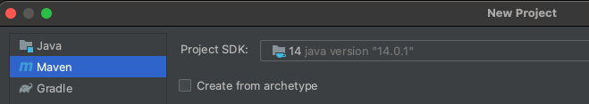

## Tolerância a Falhas

Nós escrevemos software para que resolvam problemas de espectro bem amplo, indo, do controle de braços robóticos em cirurgias remotas à sistemas de comércio eletrônico, do controle de usinas hidroelétricas à jogos de truco online.
Independentemente do problema sendo resolvido, gostaríamos de poder contar com o sistema, de poder depender nele para executar sua tarefa.
Desta situação, surge a ideia de dependabilidade, isto é, de um sistema ter a propriedade de se poder depender do mesmo.

### Dependabilidade
Dizemos que um componente **$C$ depende de um componente $C'$** se a corretude do comportamento de $C$ depende da corretude do componente $C'$.
Dizemos também que um componente é "dependável" (*dependable*) na medida em que outros podem depender dele.
A dependabilidade é essencial aos componentes de sistemas distribuídos, pois como diz o ditado, uma corrente é tão forte quanto seu elo mais fraco.

De acordo com [Avizienis et al](https://www.nasa.gov/pdf/636745main_day_3-algirdas_avizienis.pdf), tem-se dependabilidade quando os seguintes atributos estão presentes.

* Disponibilidade (*Availability*) - Prontidão para uso.
* Confiabilidade/Fiabilidade (*Reliability*) - Continuidade do serviço.
* Segurança (*Safety*) - Tolerância a catástrofes.
* Integridade (*Integrity*) - Tolerância a modificações.
* Manutenabilidade (*Maintainability*) - Facilidade de reparo.

Além da dependabilidade, outra propriedade importante e desejável para os sistemas é a **Confidencialidade**, que quando combinada à **Integridade** e **Confidencialidade** é também chamada de **Segurança** (*Security*). 

* Confidencialidade (*Confidentiality*) -- informação somente é acessível a quem é devido.

Aqui nós nos focaremos apenas na disponibilidade que, por si só, é bem abrangente:

!!!quote "Disponibilidade"
    The term 'availability' means ensuring timely and reliable access to and use of information.
    
    [NIST SP 800-59](https://doi.org/10.6028/NIST.SP.800-59), no termo Availability [44 U.S.C., Sec. 3542 (b)(1)(C))](https://www.gpo.gov/fdsys/granule/USCODE-2011-title44/USCODE-2011-title44-chap35-subchapIII-sec3542)

Mais especificamente, sobre como manter um sistema online para que possa responder a requisições, mesmo quando problemas aparecem. Mas para isso, primeiro precisamos entender os tipos de problemas que aparecem em vários níveis, desde o seu desenvolvimento até seu uso.

### Falhas, Erros e Defeitos
No nível mais básico dos problemas a serem contornados para se obter dependabilidade, temos as **falhas** (*defect*, *fault*, para alguns, falta), que é um erro no desenvolvimento do sistema, como *bugs* ou defeitos de fabricação, que o leva a ficar diferente do que foi especificado, ou mesmo um erro na especificação.
Uma falha existe mesmo se for raramente ativada e mesmo se seus efeitos nunca forem percebidos. 
Por exemplo, se o código tem um `<=` em vez de `<` na especificação de uma iteração, mas se uma condição faz com que a iteração seja interrompida antes, o código ainda tem uma falha.

```c++
char minha_string[11];
int i;

initialize(minha_string);

for(i = 0; i <= 10; i++){
    if (minha_string[i] == '.')
        break;

    minha_string[i] = 'a';
}

minha_string[i] = '\0';
```

No segundo nível, temos o **erro** (*error*), que é a manifestação da falha levando a algum comportamento indevido. No exemplo acima, um erro seria quando a iteração passasse do ponto correto por causa do `<=`, por exemplo, na hora de escrever uma *string* em um array, estourando o limite do array na pilha mas sobrescrevendo uma variável que não seja mais usada.
O erro pode passar despercebido, mas ainda assim é um erro.

Finalmente, no terceiro nível, temos os **defeitos** (*failure*, para alguns, falha), um erro percebido pelo usuário. 
Continuando o exemplo, um *stack overflow* que leva a uma falha de segmentação, leva a um defeito.

Quando um componente manifesta um defeito, outros componentes que dele dependem, internalizarão entradas indevidas, uma falha externa, o que levará a seu próprio estado interno a estar errôneo e possivelmente também manifestar um defeito. 
Esta cadeia pode levar cenários catastróficos.

!!!example "Falhas Famosas"
    === "Ariane 5"

        O Ariane 5 foi um foguete desenvolvido pela agencia espacial européia que explodiu durante o lançamento.

        !!!quote "The Explosion of the Ariane 5"
              On June 4, 1996 an unmanned Ariane 5 rocket launched by the European Space Agency exploded just forty seconds after its lift-off [...] after a decade of development costing \$7B. The destroyed rocket and its cargo were valued at \$500M. [...] the failure was a software error [...] a 64 bit floating point number [...] was converted to a 16 bit signed integer. The number was larger than 32,767, the largest integer storeable in a 16 bit signed integer, and thus the conversion failed.

        ](images/ariane5.jpg)

        O erro gerado foi tratado como input, causando outros erros, que geraram instabilidade e que levou o sistema a se auto-destruir.

    === "787 Dreamliner"

        O avião 787 dreamliner, da Boeing, tem um problema que torna necessário reiniciar o sistema elétrico a cada 248 dias, ou o mesmo pode ter uma pane.

        !!!quote
             The plane’s electrical generators fall into a failsafe mode if kept continuously powered on for 248 days. The 787 has four such main generator-control units that, if powered on at the same time, could fail simultaneously and cause a complete electrical shutdown.

        Segundo as "más línguas", o problema é que acontece um *overflow* em um contador de tempo

        !!!quote
             <blockquote class="twitter-tweet"><p lang="en" dir="ltr">248 days == 2^31 100ths of a second.<br><br>even in 2015, our airplanes have integer overflow bugs <a href="https://t.co/6Z8d4y9gjM">https://t.co/6Z8d4y9gjM</a></p>&mdash; Fiora @ 日本語でFF14 (@FioraAeterna) <a href="https://twitter.com/FioraAeterna/status/594110518203260929?ref_src=twsrc%5Etfw">May 1, 2015</a></blockquote> <script async src="https://platform.twitter.com/widgets.js" charset="utf-8"></script>


    === "737 Max"

        O Boeing 737 Max é uma modificação do 737 original em que o motores maiores foram usados sem modificar a estrutura do restante do avião e portanto alterando o seu centro de massa. Por causa da diferença, o avião pode subir rápido demais, correndo o risco de perder sustentação. Para auxiliar os pilotos e evitar a necessidade de treinamento específico, um sensor é usado para detectar se o avião está nesta situação e forcar o nariz do avião para baixo para corrigir o problema.
        Contudo, no 737 Max apenas um sensor é usado e no caso de falha do mesmo, o avião é forçado para baixo e em direção ao solo, o que levou à morte de centenas de pessoas.[^737max]


    === "Subaru SUV"
        Em 2018 a Subaru fez um *recall* gigante, de mais de 1 milhão de unidades de um seus modelos de SUV, porquê uma falha em um software fez com que soldagens fossem feitas incorretamente no chassis dos veículos.
        O erro era irreparável, levando a grandes prejuízos.

        ![[Recall Subaru()https://spectrum.ieee.org/riskfactor/computing/it/coding-error-leads-293-subaru-ascents-to-the-car-crusher)]](images/subaru.png)


        <!--Car Hack -- 2017, images/carhack, https://www.wired.com/story/car-hack-shut-down-safety-features/-->

[^737max]: [Boeing 737 Max: why was it grounded, what has been fixed and is it enough?](https://theconversation.com/boeing-737-max-why-was-it-grounded-what-has-been-fixed-and-is-it-enough-150688)


Quando defeitos aparecem, é importante identificar suas causas, isto é, a cadeia de eventos que os levaram a acontecer.
Algumas empresas até publicam as ***root cause analysis*** ou a análise *post-mortem* para a comunidade como forma de compartilhar conhecimento e também por questões de transparência, mas mais importante, conhecer a causa pode ajudar a evitar que novas instâncias da mesma falha ou similares, [^rca] aumentando a dependabilidade do sistema.

[^rca]: [Post-mortems](https://github.com/danluu/post-mortems) para uma extensa lista de análises.

#### Classes de Defeitos
Falhas são um fato da vida, uma constante no desenvolvimento de sistemas, mas se precisamos lidar com elas, previnindo e tolerando sua presença, precisamos entender como se manifestam e, para isso, uma classificação é essencial.

##### Quebra
Defeitos de **quebra** (***crash***) são defeitos em que o componente para de funcionar, irreversivelmente.
Uma vez que o componente cessa seu funcionamento, qualquer comunicação com o mesmo é interrompida e pode dar bons indicativos do defeito aos outros componentes.
Em um sistema assíncrono, contudo, não há garantias de que esta detecção do defeito será correta.

Alguns sistemas, denominados ***fail-stop***, forçam-se a parar de funcionar quando percebem um defeito, imitando uma quebra, e implementando um comportamento ***fail-fast***.[^failfastfast]
Estes sistemas podem emitir um "canto do cisne" para permitir que outros componentes detectem o defeito.

[^failfastfast]: [Fail Fast Is Failing… Fast!](https://pathelland.substack.com/p/fail-fast-is-failing-fast)

Após pararem, alguns sistemas podem aplicar passos de recuperação e voltar a funcionar, no que é denominado ***fail-recover***. Ao retornar à operação, o processo poderia assumir uma nova identidade.

##### Omissão

Em um **defeito de omissão** (***omission failure***), um componente não executa alguma ação. Por exemplo, uma requisição recebida por um servidor não é executada, um disco não armazena os dados no meio magnético, ou uma mensagem não é transmitida.
Este tipo de defeito é difícil de ser identificado pois outros componentes não necessariamente tem acesso direto ao resultado da operação.
Por exemplo, se o meio de comunicação se recusou a entregar uma mensagem, então houve um defeito de omissão.
Mas se a mensagem é retransmitida até que tenha sua entrega confirmada, então o defeito é mascarado.


##### Temporização

Em sistemas em que há limites de tempo para a execução de ações, uma violação destes limites é **defeito de temporização**.
Por exemplo, se o meio de comunicação se recusou a entregar uma mensagem, então houve uma falha de omissão.
Novamente considerando problemas de transmissão de mensagens, se o meio de comunicação se recusou a entregar uma mensagem que deveria ser entregue dentro de 3ms, então houve um defeito de omissão.
Mas se a mensagem é retransmitida até que tenha sua entrega confirmada, mas a mesma é entregue com 5ms, então o defeito é mascarado como um defeito de temporização.
Defeitos de temporização podem acontecer devido a problemas de sincronização de relógios, como no algoritmo de difusão totalmente ordenada visto [anteriormente.](../time/#usos-de-relogios-sincronizados)

##### Arbitrários
Um defeito **arbitrário** ou **bizantino** é um no qual qualquer comportamento pode acontecer. 
Por exemplo, uma mensagem pode ser modificada, um servidor pode reiniciar-se constantemente, todos os dados podem ser apagados, ou acesso pode ser dado a quem não é devido.
Estes defeitos podem ser causados por agentes mal intencionados, como hackers e vírus.


##### Hierarquia
Os tipos de defeitos apontados acima podem ser hierarquizados como a seguir, o que quer dizer que uma quebra é apenas uma omissão por tempo infinito:

Fail-stop $\subset$ Quebra $\subset$ Omissão $\subset$ Temporização $\subset$ Arbitrária


##### Defeitos intermitentes

Alguns defeitos fogem à classificação acima por terem um comportamento especial, se manifestando de forma intermitente, por causa de eventos esparsos como picos de energia, ou pelo comportamento emergente da interação com outros sistemas. Para capturar estas idiossincrasias, recorremos a uma outra [classificação](http://www.idc-online.com/technical_references/pdfs/information_technology/Classification_Of_Software_Bugs.pdf), bem informal.

!!!quote "Bohrbug"
     A BohrBug is just your average, straight-forward bug. Simple like the Bohr model of the atom: A smallsphere. You push it, it moves. BohrBugs are reproducible, and hence are easily fixed once discovered. These are named after Niels Bohr, who proposed a simple and easy-to-understand atomic model in 1913. In Bohr’s model, things like the path and momentum of an electron in an atom are predictable.

!!!quote "Heisenbug"
     A bug that disappears or alters its behavior when one attempts to probe or isolate it. No matter how much time and effort is spent trying to reproduce the problem, the bug eludes us. Such bugs were named Heisenbugs, after Werner Heisenberg, who is known for his “uncertainty principle”. According to his theory, it is not possible to accurately or certainly determine the position and velocity of an electron in an atom at a particular moment.

!!!quote "Mandelbug"
      When the cause of the bug is too complex to understand, and the resulting bug appears chaotic, it is called a Mandelbug. These are named after Benoît Mandelbrot, who is considered the father of fractal geometry (fractals are complex, self-similar structures). A bug in an operating system that depends on scheduling is an example of a Mandelbug.

!!!quote "Schroedinbug"
      Sometimes, you look into the code, and find that it has a bug or a problem that should never have allowed it to work in the first place. When you try out the code, the bug promptly shows up, and the software fails! Though it sounds very uncommon, such bugs do occur and are known as Schroedinbugs. They are named after the scientist Erwin Schrödinger, who proposed that in quantum physics, quantum particles like atoms could exist in two or more quantum states.

!!!quote "Fractal Bugs"
      A bug, after which its resolution is found, reveals additional self-similar bugs elsewhere in the code, after which they are fixed, likewise appear elsewhere still.

#### Correlação entre falhas
Algumas falhas são ativadas por entradas e, neste caso, mesmo que se tenha várias cópias do mesmo sistema, todas falharão uma vez que a entrada problemática acontecer.
Este é um cenário em que as falhas não são independentes, mas correlatas. Para evitá-lo, podemos usar ***n-version programming***, que consiste basicamente em ter múltiplas implementações do mesmo sistema desenvolvidas de forma independente, isto é, fazendo uso de um ou mais da seguintes opções:

* múltiplos times
* múltiplos sistemas operacionais
* múltiplas linguagens de programação.

Esta técnica é interessante mais raramente usada, basicamente pelo seu alto custo.
Além disso, erros de especificação são reproduzidos e levam times diferentes a produzir erros iguais.

<!--
### Degradação graciosa

Dependendo dos efeitos e tratamentos.

* Fail safe - defeito não leva a comportamento inseguro (sistema de entretenimento no avião)
* Fail soft - graceful degradation (sistema de controle de vôo)
* Fail fast - para o fluxo de defeitos (e possível reinício)


* Robusto - erros não atrapalham execução (tratamento de exceções)
* Quebradiço (*brittle*) - não resiliente a falhas
-->


#### Falhas Bizantinas
???todo
    * exércitos bizantino


### Como lidar com falhas?

Mas se o objetivo é a dependabilidade, isto é, ter o sistema pronto para uso e apto a manter este estado durante o período de uso, mesmo na presença de catástrofes, precisamos de formas de lidar com falhas, **previnindo**, **removendo** e **tolerando**-as.

A **prevenção de falhas** acontece por meio de técnicas bem estabelecidas de engenharia.
No caso de sistemas de software, modularização, uso de linguagens de programação fortemente tipadas e encapsulamento são passos importantes. 
Outras técnicas envolvidas na prevenção de falhas são análise estática, especificação formal, teste e prova destas especificações.
Por exemplo, diversas empresas usam linguagens como [TLA$^+$](https://lamport.azurewebsites.net/tla/tla.html)[^tla_real] e [Promela](https://en.wikipedia.org/wiki/Promela), associados a verificadores de modelo como TLC e Spin, respectivamente, para testar e verificar a corretude de seus algoritmos.


[^tla_real]: [*Using TLA+ in the Real World to Understand a Glibc Bug*](https://probablydance.com/2020/10/31/using-tla-in-the-real-world-to-understand-a-glibc-bug/)

Mesmo uma especificação correta pode produzir um sistema com falhas pois a tradução de especificações formais para código é um passo complexo.
Testes e manutenção do sistema permitem a **remoção de falhas** que passarem despercebidas pelas tentativas de prevenção.

Testes, contudo, apenas aumentam a confiança no sistema, não sendo capazes de certificar a ausência de problemas.
Assim, tenta-se desenvolver os sistemas de forma que, mesmo se falhas ainda estiverem presentes, seus efeitos não sejam percebidos como defeitos, isto é, sistemas que tenha **tolerância a falhas** (ou **prevenção de defeitos**).

Para se alcançar tolerância a falhas é necessário detectar e se recuperar de erros. 
Por exemplo, um sistema de arquivos que mantenha um *journal*, como o [Ext v3](https://en.wikipedia.org/wiki/Ext3#Journaling_levels), armazena informação de forma redundante e, quando **detecta** que os dados em sua forma principal estão corrompidos, usa o *journal* para **recuperar** os dados, **mascarando** o erro.

De acordo como Avizienis *et al.*, temos as seguintes técnicas para tolerar falhas:

](images/laprie_fault_tol.png)

Um sistema que sofra de defeitos recorrentes é um bom candidato a previsão de defeitos, em que se estima quando uma falha ocorrerá baseado no histórico.
Por exemplo, um sistema que sofra falha por uso excessivo de memória a cada dez dias em uso, pode ser reiniciado no nono dia, em condições controladas, para evitar problemas maiores enquanto a razão do uso excessivo de memória é corrigido.

Se remover todas as possibilidades de defeitos de um componente é algo difícil, apostemos na tolerância a falhas.
De forma geral, tolerância a falhas é obtida por algum tipo de **redundância**. 
Redundância pode ser aplicada em vários níveis, por exemplo, gastando **mais tempo na especificação do projeto**, ou montando um laboratório de testes mais próximo do ambiente de produção.

Outra forma óbvia de redundância é a **replicação** de componentes. Por exemplo, pense no pneu estepe de um carro, no gerador de eletricidade de um hospital.
Replicação permite remover os **pontos únicos de falha** (SPOF, *Single Point of Failure*), ou seja, componentes não dependáveis.
Seja como for, redundância implica em mais custos, então o grau de redundância a ser utilizado depende de uma análise custo x benefício.
No caso de um sistema distribuído, quando falamos em redundância, normalmente falamos em processos redundantes, cópias ou réplicas, mesmo que não desenvolvidos usando *n-version programming*.
Assim, com múltiplas cópias, quando um processo apresenta um defeito, outro podem continuar executando o serviço.

Dois modos clássicos de replicação são o **primário/cópia** e **ativo/ativo**.
No caso da replicação **primário/cópia**, também conhecida como **mestre/escravo**, o primário é responsável por lidar com clientes e por informar cópias das modificações de estado.


Como as atualizações de estado fluem do primário para a cópia, é possível que a cópia não tenha o estado mais atual.
Para visualizarmos melhor esta situação, vejamos a **replicação em cadeia**, uma generalização de primário/cópia em que os processos se organizam em um sequência para executar operações.


**Atualizações** no sistema são sempre **direcionadas ao primário**, a cabeça da sequência. 
**Leituras**, se absolutamente necessitarem dos dados escritos mais recentemente, também devem ser direcionadas à **cabeça**. 
Caso contrário, podem ser direcionadas aos processos na **cauda**, diminuindo a carga de trabalho na cabeça.

No caso da replicação ativa, as **várias cópias executam todos os comandos** enviados para o sistema, estando assim todas aptas a continuar a executar o serviço. 
A técnica de **replicação de máquinas de estados vista no capítulo anterior** é uma materialização da replicação ativa.
Como vimos anteriormente, replicação de máquinas de estados utiliza primitivas de comunicação em grupo, mas as vistas anteriormente não são funcionais principalmente por não serem tolerantes a falhas. Vejamos a porquê é difícil desenvolver primitivas tolerantes a falhas.


## Problemas de Acordo
Há diversas primitivas de comunicação em grupo, das quais se destaca a **difusão atômica**, primitiva pela qual se pode facilmente implementar replicação de máquina de estados.
Difusão atômica, por sua vez, é equivalente ao problema do **consenso distribuído**, que está no coração da classe de problemas de **acordo**.
Problemas de acordo são aqueles em que processos devem concordar em quais ações executar.
Dependendo do modelo computacional em que o problema deve ser resolvido, soluções vão de triviais a impossíveis.
Vejamos um exemplo.

### Uma história de três exércitos
**Era uma vez** uma cidade estado no alto de uma montanha. 
A despeito de sofrer de falta de água, afinal, estava no alto de uma montanha, a cidade era invejada pelos vizinhos.
Como a cidade era muito bem fortificada, ela poderia se defender de qualquer **ataque em uma única frente**. 
Se atacada em **duas frentes**, contudo, cairia.
Sabendo disso, o rei de uma das cidades vizinhas resolveu tomar a cidade e repartiu suas forças em **dois exércitos** sob o comando de Alice (a sociedade era feminista) e Bastião (sim, Bastião, não Bob).[^2generalsparadox]

[^2generalsparadox]: Esta é uma variação do problema de coordenação de *gangsters* apresentado no em [Some constraints and trade-offs in the design of network communications](https://doi.org/10.1145%2F800213.806523)


Um complicador no ataque é que a **comunicação entre os dois exércitos é feita por mensageiros** que devem contornar a montanha para alcançar o outro exército. 
O trajeto é complexo e cheio de armadilhas e por isso **mensageiros podem se perder** e demorar um longo tempo para chegar ou até mesmo **serem mortos** e nunca entregarem suas mensagens.

Alice, a comandante mais sênior, deve decidir quando atacar e informar a Bastião, por exemplo, simplesmente ordenando "**Atacar no dia 3, ao nascer do sol.**"
Bastião **obedecerá** a ordem de atacar contanto que esteja certo de que Alice também atacará, e é justamente daí que vem a dificuldade do problema.
Se mensagens podem ser perdidas, **Alice não tem garantias de que Bastião recebeu o comando** e por isso não pode simplesmente considerar como certo o ataque de Bastião.
Como o problema pode ser resolvido?

Uma resposta natural é usar **mensagens de confirmação**. Isto é, quando Bastião recebe uma ordem, envia um mensageiro de volta para Alice com uma confirmação da recepção.
Alice ao receber tal mensagem, sabe que Bastião executará a ordem, correto? Mas não é tão simples assim no caso da ordem de atacar.
Lembre-se que qualquer exército que ataque sozinho, perderá, seja Alice ou Bastião. 
Por isso, ao enviar uma mensagem de confirmação do ataque, Bastião precisa estar certo de que Alice a recebeu, ou atacará sozinho.
Novamente podemos apelar para uma mensagem de confirmação ou, neste caso, uma confirmação da confirmação.
E o problema se repete indefinidamente.


!!!sideslide "Paradoxo dos 2 Exércitos"
    * $A$ e $B$ devem concordar na hora do ataque.
	* $A$ ataca se estiver certo que $B$ atacará.
	* $B$ ataca se estiver certo que $A$ atacará.
	* A comunicação por troca de mensagens.
       * Mensagens podem ser arbitrariamente atrasadas.
	   * Mensagens podem ser perdidas.
	
	Como um exército tem certeza que o outro irá atacar?

Suponhamos que **há um algoritmo correto** que executa uma sequência finita de troca de mensagens em que ao final tanto Alice quanto Bastião estão seguros, e corretos em sua segurança, de que o outro também atacará. Seja $n$ o número máximo de mensagens trocadas. 
Em uma execução em que todas as $n$ mensagens possíveis são usadas, suponha sem perda de generalidade que Alice enviou a $n$-ésima mensagem.


Observe que, do ponto de vista de Alice, uma execução do algoritmo em que a nenhuma mensagem é perdida, é indistinguível de uma execução em que a $n$-ésima mensagem é perdida.


Dado que ao final da primeira execução completa **Alice ataca**, no final da execução onde a mensagem $n$ é perdida, Alice também deve atacar.
Mas se o algoritmo é correto, então também **Bastião ataca**, mesmo sem ter recebido a enésima mensagem. Logo, a enésima mensagem é desnecessária ao algoritmo, que deve funcionar com $n-1$ mensagens.

Repetindo-se o argumento mais $n-1$ vezes, temos que o algoritmo deve funcionar com zero mensagens, o que é um **absurdo**. Logo não existem algoritmos corretos para o problema como definido, isto é, em que mensagens podem ser perdidas; é **impossível** resolver o problema.

!!!sideslide "Impossibilidades"
    Impossibilidade de resolução x resolução na prática.

Apesar de ser impossível resolver este problema aparentemente simples, devemos fazê-lo frequentemente no mundo real. Como reconciliar estes dois fatos?

### Impossibilidade
Quando dizemos que é impossível resolver um problema queremos dizer que é impossível produzir um algoritmo que **sempre levará a uma resposta correta**.
Isto quer dizer, ignorando-se algoritmos que sempre levarão a respostas incorretas, podemos produzir algoritmos que ou às vezes **levarão a respostas incorretas** ou que, mesmo que nunca levem a respostas incorretas, às vezes **não levarão a respostas** alguma; ambos podem ser úteis na prática.

Por exemplo, ainda no problema dos exércitos tentando tomar a cidade, suponha que em vez de mandar um único mensageiro com a ordem de ataque, Alice envie 100, ou 200, ou 1000.
A **confiança** de Alice de que Bastião também atacaria, seria muito maior e não precisaria receber uma confirmação de entrega de mensagens.
Esta abordagem faria com com que o ataque funcionasse com uma **alta probabilidade** $P$, mas com uma pequena probabilidade $P-1$ de levar a um ataque fracassado, onde $P$ pode ser feita **tão grande quanto se "queira"**.

Resultados de impossibilidade abundam na área de computação distribuída[^impossibilidades] e não podem nos desencorajar de continuar a buscar soluções práticas.

[^impossibilidades]: [Hundred Impossibility Proofs for Distributed Computing](https://groups.csail.mit.edu/tds/papers/Lynch/MIT-LCS-TM-394.pdf), [Impossibility Results for Distributed Computing](https://doi.org/10.2200/S00551ED1V01Y201311DCT012)

### Consenso
O problema que os comandantes estão tentando resolver é, essencialmente, o problema do Consenso Distribuído.
Neste problema, cada um de um conjunto de processos propõe um único valor, sua **proposta**. O objetivo é decidir um dentre os valores propostos, garantindo as seguintes propriedades.

* Validade: Somente um valor proposto pode ser decidido.
* Acordo: Se um processo decide-se por $v$ e outro por $w$, então $v = w$
* Terminação: Todo processo não **defeituoso** decide-se.

Um processo é defeituoso se apresentou um defeito; como estamos considerando apenas defeitos do tipo quebra, um processo é defeituoso se ele parou de funcionar.
Um processo que não é defeituoso é um processo correto.

!!!sideslide "Terminação"
    Na prática, algoritmos exploram oportunidades para progredir, mesmo que não garantam que vão terminar.

Dependendo do modelo computacional, é possível resolver este problema. Contudo, **é impossível resolver deterministicamente o problema do consenso em sistema assíncrono sujeito a falhas**,[^flp85] e assíncrono sujeito a falhas é exatamente o que temos, a rigor, na Internet.
Mas o consenso é resolvido frequentemente em sistemas assíncronos sujeitos a falhas. Isso porque normalmente estes sistemas se comportam sincronamente.
Há diversos algoritmos de consenso que terminam quando o sistema se comporta bem, sendo os mais famosos, atualmente, [Raft](https://raft.github.io/) e [Paxos](http://paxos.systems/index.html)


[^flp85]: [Impossibility of Distributed Consensus with One Faulty Process](https://groups.csail.mit.edu/tds/papers/Lynch/jacm85.pdf). Uma explicação da prova está disponível no [Paper Trail](https://www.the-paper-trail.org/post/2008-08-13-a-brief-tour-of-flp-impossibility/)

A grande razão para que seja impossível chegar a um acordo entre processos neste modelo é a impossibilidade de diferenciar processos defeituosos de processos corretos, mas lentos. Em termos do paradoxo dos 2 generais, a resposta do comandante não chegou porquê ele morreu ou porquê ele está demorando para responder?
Os detectores de defeito abstraem este problema.


### Detectores de Defeitos não Confiáveis

Chandra e Toueg[^CT96] introduziram o conceito de **Detectores de Defeitos** como forma de encapsular a percepção do estado funcional dos outros processos.
Assim, um detector de defeitos pode ser visto como **oráculo distribuído**, com módulos acoplados aos processos do sistema e que trabalha monitorando os outros processos.

[^CT96]: [Unreliable Failure Detectors for Reliable Distributed Systems](https://www.cs.utexas.edu/~lorenzo/corsi/cs380d/papers/p225-chandra.pdf)


Chandra e Toueg classificaram os detectores de defeitos segundo suas características de completude (*completeness*) e acurácia (*accuracy*), ou seja, a capacidade de suspeitar de um processo defeituoso e a capacidade de não suspeitar de um processo correto, respectivamente. 
Embora não seja obrigatório, detectores de falhas são normalmente implementados por meio de trocas de mensagens de *heartbeat*.
Mensagens são esperadas em momentos específicos para sugerir que o remetente continua funcional.


Quando os *heartbeats* não chegam até o limite de tempo, o processo remetente passa a ser considerado **suspeito** de falha.


*Heartbeats*  que chegam depois podem corrigir erros, mas também podem levar a atrasos na detecção de defeitos.


Para capturar estas combinações de eventos, foram definidos os seguintes níveis de 

Os níveis destas propriedades são os seguintes:

* Completude Forte - A partir de algum instante futuro, todo processo defeituoso é suspeito permanentemente por todos os processos corretos.
* Completude Fraca - A partir de algum instante futuro, todo processo defeituoso é suspeito permanentemente por algum processo correto.
* Precisão Forte - Todos os processos são suspeitos somente após terem apresentado defeito.
* Precisão Fraca - Algum processo correto nunca é suspeito de ter apresentado defeito.
* Precisão Eventual Forte - A partir de algum instante futuro, todos os processos são suspeitos somente após apresentarem defeito.
* Precisão Eventual Fraca - A partir de algum instante futuro, algum processo ativo nunca é suspeito antes de ter apresentado defeito.

Um detector ideal seria um com Completude Forte e Precisão Forte, pois detectaria somente processos defeituosos e todos os processos defeituosos.
Este detector é conhecido como $P$ ou *Perfect*.
Infelizmente os detectores perfeitos só podem ser implementados em sistemas síncronos, onde se pode confiar que a falta de uma mensagem implica em que a mensagem não será entregue por quê o remetente deve ser defeituosos.
Assim, é preciso se focar em detectores não perfeitos ou **não confiáveis**.

Em ambientes **parcialmente síncronos**, ou seja, assíncronos aumentados com algum tipo de sincronia, já é possível implementar detectores não confiáveis.
Por exemplo, se os processos dispõem de **temporizadores** precisos, um detector pode contar a passagem do tempo nos intervalos de comunicação com outros processos e, considerando um **limite de tempo** para estes intervalos, tentar determinar se tais processos encontram-se defeituosos ou não. 
Esta determinação é por certo imprecisa e os detectores podem voltar atrás em suas suspeitas tão logo percebam um erro. 
Entretanto, a despeito desta incerteza, a informação provida por estes detectores já pode ser suficiente para que se alcance o consenso se combinada a uma restrição de que **uma maioria dos processos não seja defeituosa**.

???todo "Maioria"
    Adicionar prova.

Chandra, Hadzilacos e Toueg  demonstram que o detector mais fraco com o qual se pode resolver consenso tem as propriedades de Completude Fraca e Acurácia Eventual Fraca.[^CHT96] 
Este detector, conhecido como $\Diamond W$, ou *Eventual Weak*, e é implementável em sistemas nos quais há um **limite superior** de tempo para a transmissão de mensagens, **mesmo que este limite seja desconhecido**.
Vários protocolos de consenso utilizam o detector equivalente, $\Diamond S$, equivalente ao $\Diamond W$ mas com completude forte, ou o eleitor de líderes $\Omega$, que usa a informação do $\Diamond S$ para sugerir um líder entre os processos.
Estes protocolos são escritos de forma que se o limite superior não existe, o protocolo não termina e um **resultado errado nunca é alcançado**, ou seja, os protocolos sempre garantem que as propriedades de corretude não são violadas, mesmo que não garanta que a terminação será alcançada.

[^CHT96]: [The Weakest Failure Detector for Solving Consensus](https://www.cs.utexas.edu/~lorenzo/corsi/cs380d/papers/weakestfd.pdf)

???todo "Figura"
    figura 2.2 da dissertação.

### Paxos: Algoritmo do Sínodo

???todo "Algoritmo"
    Descrever. Por enquanto, vejam esta explicação ou [https://www.cs.rutgers.edu/~pxk/417/notes/paxos.html] ou este vídeo [https://www.youtube.com/watch?v=JEpsBg0AO6o] ou este video [https://www.youtube.com/watch?v=s8JqcZtvnsM].

### Difusão Totalmente Ordenada
Se pudermos resolver o consenso, podemos então resolver o problema da **difusão totalmente ordenada** (*total order multicast*) e com ela implementar a replicação de máquinas de estados.
Relembrando, na  temos que:

* Difusão: mensagens são enviadas de 1 para n (comunicação em grupo)
* Totalmente Ordenada: todos os processos entregam as mensagens na mesma ordem.


Para fazermos isso, precisamos primeiro formalizar as primitivas em vários níveis da resolução do problema.
No nível do canal de comunicação, da rede, processos **enviam** e **recebem** mensagens.
No nível do consenso, processos fazem **propostas** e **aprendem** um valor decidido. Para chegar a uma única decisão, várias mensagens podem ser enviadas e recebidas.
No nível da difusão atômica, mensagens são **difundidas** e **entregues**. Se implementado sobre o consenso, para uma difusão ser bem sucedida, uma instância de consenso é necessária.

!!!note "Primitivas de comunicação"
     * enviar & receber (*send & receive*) - rede
     * propor & decidir (*propose & decide*) - consenso
     * difundir & entregar (*broadcast & deliver*) - difusão


Dado infinitas instâncias de consenso, pode-se usá-las para resolver difusão atômica usando o seguinte procedimento:

* Ordene as instâncias de consenso.
* Para difundir mensagem $m$, proponha a mensagem na menor instância $i$ em que não tiver visto uma decisão.
* Se a decisão de $i$ não é $m$, volte para o passo anterior.
* Entregue as decisões na ordem das instâncias.

No exemplo a seguir, duas mensagens, $m$ e $m'$ foram **difundidas** pelas aplicações App1 e App2, respectivamente, por meio do módulo de difusão atômica junto a cada aplicação.
O módulo de difusão determina qual a menor instância de consenso ainda não decidida, azul, em que propõem as mensagens.
Ao final da instância de conseno, $m$ é decidida e é entregue pelos módulos de difusão.
O módulo ABCast2 insiste na difusão de $m'$, propondo-a na próxima instância, vermelha, que decide $m'$ e leva esta mensagem a ser entregue.


Ambas as aplicações, embora tivessem intenções diferentes sobre qual deveria ser a próxima mensagem entregue, entregam-nas na mesma ordem, isto é, primeiro $m$ e depois $m'$.
Se forem usadas como entrada para algum processamento, na ordem em que foram entregues, as aplicações chegarão ao mesmo estado, em algum momento.

#### Estudo de Caso: Raft

Raft é um protocolo de difusão atômica associado a um protocolo de eleição de líderes.
Líderes são eleitos para mandatos pelo voto de uma maioria de processos, o que garante que nunca existirão dois líderes para um mesmo mandato.
Um mandato se estende enquanto o líder mantiver seus seguidores cientes de sua presença, o que faz pelo envio periódico de *heartbeats*.
Atrasos na comunicação ou a falha do líder atual levam a uma suspeita de que o líder falhou, levando a nova eleição e novo mandado.
A comunicação necessária para implementar a difusão atômica acontece em *piggyback* nos *heartbeats*.

No tutorial [The Secret lives of data](http://thesecretlivesofdata.com/raft/), podemos ver com mais detalhes como o protocolo funciona.
O tutorial, entretando, foge da nomenclatura padrão da área usando *log-replication* no lugar de difusão atômica (ou totalmente ordenada).


#### Estudo de Caso: Paxos

???todo "Paxos"
    * Sínodo (Synod): consenso
    * Paxos: Difusão Atômica


### Outras Ordenações
Como colocado diversas vezes, se todos os processos executam a mesma sequência de comandos determinísticos, todos avançam pelos mesmos estados, implementando a técnica da replicação de máquinas de estados.
Se usada em um sistema de arquivos, por exemplo, a seguinte sequência de comandos levará sempre ao estado final em que há um arquivo `/tmp/file2` e uma pasta denominada `/dir1`.

* `touch /tmp/file1`
* `echo "teste testando" >> /tmp/file2`
* `rm /tmp/file1`
* `mkdir /dir1`

Há outras ordens dos mesmos comandos que levariam ao mesmo efeito, como a seguinte. Alguns protocolos de replicação de máquinas de estados permitem que reordenações ocorram, desde que não afetem o resultado final dos comandos. 
Contudo, estes protocolos são mais complexos de se implementar e por isso raramente usados.

* `echo "teste testando" >> /tmp/file2`
* `mkdir /dir1`
* `touch /tmp/file1`
* `rm /tmp/file1`


### Arcabouços para coordenação
Há muitas formas de se usar algoritmos de acordo em uma aplicação, embora se recomente que seu escopo seja minimizado a um núcleo onde a consistência forte é absolutamente necessária e que este núcleo seja usado para suportar outras partes do sistema[^cons_core].
Seja implementando a replicação de máquinas de estados, seja implementando um core, ou qualquer outra abstração sobre algoritmos de acordo ou comunicação em grupo, você tem a opção de implementar o protocolo zero, uma tarefa ingrata[^paxosmade]. Felizmente, também tem a opção de usar arcabouços prontos tanto para para comunicação em grupo quanto para diversos outros problemas de coordenação comuns em sistemas distribuídos.

[^paxosmade]: Um exemplo de como traduzir um algoritmo complexo para código pode se ingrato é reportado em [Paxos Made Live - An Engineering Perspective](https://www.cs.utexas.edu/users/lorenzo/corsi/cs380d/papers/paper2-1.pdf).

[^cons_core]: [Consistent Core](https://martinfowler.com/articles/patterns-of-distributed-systems/consistent-core.html)

#### Estudo de caso: Copycat 

[Copycat](http://atomix.io/copycat/) é um arcabouço de replicação de máquinas de estados implementada pela [Atomix](http://atomix.io/).
Na base do Copycat está uma implementação do Raft.
Sobre o Raft, uma API simples mas moderna permite a criação de máquinas de estados usando **lambdas**, **futures**, e o estilo **fluent** de encadeamento de invocações.

!!!note ""
    === "Lambda"
        * Classe com um único método.

        ```java
        class Tarefa implements Runnable {
          public void run(){
            while (true)
              System.out.println("Bem vindo a um loop infinito");
            }   
        }

        new Thread(new Tarefa()).start();
        ```

        * Classe anônima - uso único

        ```java
        new Thread( new Runnable() {
          public void run(){
            while (true)
              System.out.println("Bem vindo a um loop infinito");
          }   
        }).start();
        ```

        * Lambda

        ```java
        new Thread(() -> {
                        while (true)
                          System.out.println("Bem vindo a um loop infinito");
                      }).start();
        ```

    === "Fluent"
        * Encadeamento

        ```java
            Collection<Pessoa> c = ...;
            c.stream()
              .filter(p -> p.idade > 33)
              .map(Pessoa::sobrenomeNome)//.map(p -> p.sobrenomeNome())
              .forEach(s -> System.out.println(s));
        ```

    === "Future"
        * Promessa de computação e resultado.
      
        ```java
        ExecutorService executor = Executors.newSingleThreadExecutor();
        Future<Integer> futFib = executor.submit(() -> { return Fibonacci(217)};
        ```

        * Quando será executado?  Em algum momento.    
        * Como pegar o resultado? 

        ```java
        while (!futFib.isDone())
          System.out.println("tah calculando...");

        int fib217 = futFib.get();
        ```

        * Em qual thread?  Em algum thread. Depende do Executor Service usado.	

Há várias versões do Copycat disponíveis, com vantagens e desvantagens.

!!!note "Versões"
    === "Versão 1.1.4"
        * Baseado em http://atomix.io/copycat/docs/getting-started/ e https://www.baeldung.com/atomix
        * Código funcional em https://github.com/pluxos/atomix_labs
        * Documentação oficial removida

    === "Versão >= 2"
        * Melhor desempenho
        * Documentação ruim ou inexistente
        * https://github.com/atomix/atomix

    === "Versão 3"
        * em Go
        * evolução rápida
        * o código é a documentação


Aqui usaremos a versão 1.1.4, que apesar de antiga, é a melhor documentada atualmente, pelo tutorial referenciado acima.

* Clone e compile o projeto
	* Instale dependências:
      * git
      * maven 
      * JDK >= 1.8
	* `git clone https://github.com/pluxos/atomix_labs`
	* `cd atomix_labs`
	* `cd replication`
	* `mvn compile`
	* `mvn test`


Você deve ver uma saída semelhante à seguinte, o que quer dizer que seu código está compilando perfeitamente.

```bash
Tests run: 1, Failures: 0, Errors: 0, Skipped: 0

[INFO] ---------------------------------------
[INFO] BUILD SUCCESS
[INFO] ---------------------------------------
[INFO] Total time: 6.898 s
[INFO] Finished at: 2017-10-25T08:38:08-02:00
[INFO] Final Memory: 15M/159M
[INFO] ---------------------------------------
```

Antes de começar a escrever suas prórpia máquinas de estado, familiarize-se com a estrutura do projeto em https://github.com/pluxos/atomix_labs/tree/master/replication/src/main/java/atomix_lab/state_machine

Observe que há três pastas: 

* `type` - tipos dos dados mantidos pela replica (Edge e Vertex)  
   Os tipos são serializable para que o Java saiba como transformá-los em bytes.
* `command` - estruturas que contêm informações para modificar os tipos  
	Os comandos serão enviadas do cliente para o cluster e são naturalmente serializable.
* `client` - cria comandos e os envia para serem executados no cluster  
	Respostas podem ser esperadas síncrona ou assincronamente.
* `server` - recebe os comandos na ordem definida pelo Raft e os executa

O projeto foi construído seguindo as instruções no tutorial mencionado antes, saltando-se a parte dos snapshots, isto é:

* crie um projeto maven  
	eclipse tem template para isso
* adicione dependências no `pom.xml`  
	como so criei um projeto, coloquei as dependências tanto do cliente quando do servidor
* defina `Command` que modifiquem o estado das réplicas
* defina `Queries` que consultem o estado das réplicas
* implemente a réplica para lidar com os comandos
* implemente o cliente para emitir comandos


Para executar um servidor, você precisa passar diversos parâmetros

* identificador do processo (inteiro)
* IP do processo com identificador 0
* porta do processo com identificar 0
* IP do processo com identificador 1
* porta do processo com identificar 1
* ...

Sabendo seu identificador, o servidor sabe em qual porta escutar e em quais IP/porta se conectar para se comunicar com os outros servidores.

Para testar o projeto, execute três servidores, em três terminais distintos. 
Usando o maven, da linha de comando, basta executar os seguintes comandos[^\\]:

[^\\]: O `\\` no final da linha é só para mostrar que o comando continua na próxima e facilitar a visualização. 
Na hora de executar, use apenas uma linha, sem o `\\`.

```bash
mvn exec:java \\
  -Dexec.mainClass="atomix_lab.state_machine.server.GraphStateMachine" \\
  -Dexec.args="0 127.0.0.1 5000 127.0.0.1 5001 127.0.0.1 5002"
	
mvn exec:java \\
  -Dexec.mainClass="atomix_lab.state_machine.server.GraphStateMachine" \\
  -Dexec.args="1 127.0.0.1 5000 127.0.0.1 5001 127.0.0.1 5002"
	
mvn exec:java \\
  -Dexec.mainClass="atomix_lab.state_machine.server.GraphStateMachine" \\
  -Dexec.args="2 127.0.0.1 5000 127.0.0.1 5001 127.0.0.1 5002"
```


O cliente não precisa de um identificador, apenas dos pares IP/porta dos servidores.
Por exemplo, use o comando:

```bash
mvn exec:java \\
  -Dexec.mainClass="atomix_lab.state_machine.client.GraphClient" \\
  -Dexec.args="127.0.0.1 5000 127.0.0.1 5001 127.0.0.1 5002"
```


!!!exercise "Exercício"
    Uma vez executado o projeto, modifique-o para incluir uma nova operação (`Command`) e nova consulta (`Query`), de sua escolha.


#### Estudo de caso: Ratis

[Ratis](http://ratis.apache.org/) é um arcabouço de coordenação recentemente emancipado como um projeto no [Apache](https://apache.org).
Embora mal documentado, o projeto tem alguns exemplos que demonstram como usar abstrações já implementadas. 
A seguir veremos um passo-a-passo, baseado nestes exemplos, de como usar o Ratis para implementar uma máquina de estados replicada.

Crie um novo projeto Maven com o nome `ChaveValor` (eu estou usando IntelliJ, mas as instruções devem ser semelhantes para Eclipse).



Abra o arquivo `pom.xml` do seu projeto e adicione o seguinte trecho, com as dependências do projeto, incluindo o próprio Ratis.

```xml
<dependencies>
    <!-- https://mvnrepository.com/artifact/org.apache.ratis/ratis-server -->
    <dependency>
        <groupId>org.apache.ratis</groupId>
        <artifactId>ratis-server</artifactId>
        <version>2.0.0</version>
    </dependency>

    <!-- https://mvnrepository.com/artifact/org.apache.ratis/ratis-netty -->
    <dependency>
        <groupId>org.apache.ratis</groupId>
        <artifactId>ratis-netty</artifactId>
        <version>2.0.0</version>
    </dependency>
    <dependency>
        <groupId>org.apache.ratis</groupId>
        <artifactId>ratis-grpc</artifactId>
        <version>2.0.0</version>
    </dependency>
    <dependency>
        <groupId>com.beust</groupId>
        <artifactId>jcommander</artifactId>
        <version>1.78</version>
    </dependency>
    <dependency>
        <groupId>org.slf4j</groupId>
        <artifactId>slf4j-api</artifactId>
        <version>1.7.25</version>
    </dependency>
    <!-- https://mvnrepository.com/artifact/org.apache.logging.log4j/log4j-slf4j-impl -->
    <dependency>
        <groupId>org.apache.logging.log4j</groupId>
        <artifactId>log4j-slf4j-impl</artifactId>
        <version>2.14.1</version>
        <scope>compile</scope>
    </dependency>
    <dependency>
        <groupId>org.apache.logging.log4j</groupId>
        <artifactId>log4j-api</artifactId>
        <version>2.14.1</version>
    </dependency>
    <dependency>
        <groupId>org.apache.logging.log4j</groupId>
        <artifactId>log4j-core</artifactId>
        <version>2.14.1</version>
        <scope>provided</scope>
    </dependency>
</dependencies>
```

Adicione também o plugin Maven e o plugin para gerar um `.jar` com todas as dependências. Observe que estou usando Java 14, mas você pode mudar para a sua versão.

```xml
<build>
    <plugins>
        <plugin>
            <groupId>org.apache.maven.plugins</groupId>
            <artifactId>maven-compiler-plugin</artifactId>
            <version>${maven.compiler.version}</version>
            <configuration>
                <source>14</source>
                <target>14</target>
            </configuration>
        </plugin>
        <plugin>
            <artifactId>maven-assembly-plugin</artifactId>
            <executions>
                <execution>
                    <phase>package</phase>
                    <goals>
                        <goal>single</goal>
                    </goals>
                </execution>
            </executions>
            <configuration>
                <descriptorRefs>
                    <descriptorRef>jar-with-dependencies</descriptorRef>
                </descriptorRefs>
            </configuration>
        </plugin>
    </plugins>
</build>
```

Crie uma nova classe denominada `Cliente` no arquivo `Cliente.java`.
Nesta classe, iremos criar um objeto `RaftClient` que será usado para enviar operações para os servidores. 
Esta classe é importada juntamente com outras várias dependências, adicionadas no `pom.xml`, que devemos instanciar antes do `RaftClient`.

Neste exemplo eu coloco praticamente todos os parâmetros de configuração do Ratis *hardcoded* para simplificar o código.
Obviamente que voce deveria ser estes parâmetros como argumentos para o programa ou de um arquivo de configuração.

```java
import org.apache.ratis.client.RaftClient;
import org.apache.ratis.conf.Parameters;
import org.apache.ratis.conf.RaftProperties;
import org.apache.ratis.grpc.GrpcFactory;
import org.apache.ratis.protocol.*;
import org.apache.ratis.thirdparty.com.google.protobuf.ByteString;

import java.io.IOException;
import java.net.InetSocketAddress;
import java.nio.charset.Charset;
import java.util.HashMap;
import java.util.Map;

public class Cliente
{
```

O campo `raftGroupId` identifica um cluster Ratis; isso quer dizer que um mesmo processo pode participar de vários *clusters*, mas aqui nos focaremos em apenas um. O valor do campo deve ter exatamente caracteres, o que soma 32 bytes em java, e será interpretado como um [UUID](https://pt.wikipedia.org/wiki/Identificador_%C3%BAnico_universal).

`id2addr` é um mapa do identificador de cada processo no cluster para seu endereço IP + Porta.
Aqui usei várias portas distintas porquê todos os processos estão rodando na mesma máquina, mas se estivesse executando em máquinas distintas, com IP distintos, poderia usar a mesma porta em todos.

`addresses` é uma lista de `RaftPeer` construída a parti de `id2addr`.

O campo `raftGroup` é uma referência a todos os servidores, associados ao identificador do grupo, `raftGroupId`.


```java
    public static void main(String args[]) throws IOException
    {
        String raftGroupId = "raft_group____um"; // 16 caracteres.
        
        Map<String,InetSocketAddress> id2addr = new HashMap<>();
        id2addr.put("p1", new InetSocketAddress("127.0.0.1", 3000));
        id2addr.put("p2", new InetSocketAddress("127.0.0.1", 3500));
        id2addr.put("p3", new InetSocketAddress("127.0.0.1", 4000));

        List<RaftPeer> addresses = id2addr.entrySet()
                .stream()
                .map(e -> RaftPeer.newBuilder().setId(e.getKey()).setAddress(e.getValue()).build())
                .collect(Collectors.toList());

        final RaftGroup raftGroup = RaftGroup.valueOf(RaftGroupId.valueOf(ByteString.copyFromUtf8(raftGroupId)), addresses);
```

Uma vez criado o grupo, criamos o cliente usando a fábrica retornada por `RaftClient.newBuilder()`.
A fábrica deve ser configurada com os dados do grupo e o tipo de transporte, neste caso gRPC.
Também é necessário o identificador do processo que está se conectando ao grupo; neste caso, usamos um identificador aleatório qualquer, diferente do que faremos com os servidores.

```java
        RaftProperties raftProperties = new RaftProperties();

        RaftClient client = RaftClient.newBuilder()
                                      .setProperties(raftProperties)
                                      .setRaftGroup(raftGroup)
                                      .setClientRpc(new GrpcFactory(new Parameters())
                                      .newRaftClientRpc(ClientId.randomId(), raftProperties))
                                      .build();
```

Uma vez criado o cliente, podemos fazer invocações de operações nos servidores. Cada operação será invocada em todos os servidores, na mesma ordem.
Este protótipo suporta duas operações, `add` e `get`, incluindo algumas variações, que ignoraremos por enquanto.
A operação `add` é codificada como uma `String`, `add:k:v`, onde `k` e `v` são do tipo `String`. `add:k:v` adiciona uma entrada em um mapa implementado pelo nosso servidor com chave `k` e valor `v`.
Já a operação `get:k` recupera o valor `v` associado à chave `k`, se presente no mapa.

O método `RaftClient.io().send` é usado para enviar modificações para as réplicas e deve, necessariamente, passar pelo protocolo Raft.
Já o método `RaftClient.io().sendReadOnly` é usado para enviar consultas a qualquer das réplicas.
Ambos os métodos codificam o comando sendo enviado (`add:k:v` ou `get:k`) no formato interno do Ratis para as réplicas e retorna um objeto `RaftClientReply`, que pode ser usado para pegar a resposta da operação. 
O código é auto explicativo.

```java
        RaftClientReply getValue;
        CompletableFuture<RaftClientReply> compGetValue;
        String response;
        switch (args[0]){
            case "add":
                getValue = client.io().send(Message.valueOf("add:" + args[1] + ":" + args[2]));
                response = getValue.getMessage().getContent().toString(Charset.defaultCharset());
                System.out.println("Resposta:" + response);
                break;
            case "get":
                getValue = client.io().sendReadOnly(Message.valueOf("get:" + args[1]));
                response = getValue.getMessage().getContent().toString(Charset.defaultCharset());
                System.out.println("Resposta:" + response);
                break;
            case "add_async":
                compGetValue = client.async().send(Message.valueOf("add:" + args[1] + ":" + args[2]));
                getValue = compGetValue.get();
                response = getValue.getMessage().getContent().toString(Charset.defaultCharset());
                System.out.println("Resposta: " + response);
                break;
            case "get_stale":
                getValue = client.io().sendStaleRead(Message.valueOf("get:" + args[1]), 0, RaftPeerId.valueOf(args[2]));
                response = getValue.getMessage().getContent().toString(Charset.defaultCharset());
                System.out.println("Resposta: " + response);
                break;
            default:
                System.out.println("comando inválido");
        }

        client.close();
    }
}
```

Um vez criado o cliente, crie a classe `Servidor`, no arquivo `Servidor.java`; a parte inicial do código é semelhante à do cliente.

```java
import org.apache.ratis.conf.RaftProperties;
import org.apache.ratis.grpc.GrpcConfigKeys;
import org.apache.ratis.protocol.RaftGroup;
import org.apache.ratis.protocol.RaftGroupId;
import org.apache.ratis.protocol.RaftPeer;
import org.apache.ratis.protocol.RaftPeerId;
import org.apache.ratis.server.RaftServer;
import org.apache.ratis.server.RaftServerConfigKeys;
import org.apache.ratis.thirdparty.com.google.protobuf.ByteString;
import org.apache.ratis.util.LifeCycle;

import java.io.File;
import java.io.IOException;
import java.net.InetSocketAddress;
import java.util.Collections;
import java.util.HashMap;
import java.util.Map;
import java.util.concurrent.TimeUnit;

public class Servidor
{

    //Parametros: myId
    public static void main(String args[]) throws IOException, InterruptedException
    {
        String raftGroupId = "raft_group____um"; // 16 caracteres.

        //Setup for node all nodes.
        Map<String,InetSocketAddress> id2addr = new HashMap<>();
        id2addr.put("p1", new InetSocketAddress("127.0.0.1", 3000));
        id2addr.put("p2", new InetSocketAddress("127.0.0.1", 3500));
        id2addr.put("p3", new InetSocketAddress("127.0.0.1", 4000));

        List<RaftPeer> addresses = id2addr.entrySet()
                                          .stream()
                                          .map(e -> RaftPeer.newBuilder().setId(e.getKey()).setAddress(e.getValue()).build())
                                          .collect(Collectors.toList());
```

A primeira diferença vem na necessidade de identificar o servidor dentro do conjunto de servidores, o que é feito com um `RaftPeerId`.
Como cada servidor deve usar um identificador único, do conjunto pré-determinado em `id2addr`, o identificador é passado como argumento para o programa, obrigatoriamente.

```java
        //Setup for this node.
        RaftPeerId myId = RaftPeerId.valueOf(args[0]);

        if (addresses.stream().noneMatch(p -> p.getId().equals(myId)))
        {
            System.out.println("Identificador " + args[0] + " é inválido.");
            System.exit(1);
        }
```

Encare a seção seguinte como uma receita, mas observe que o método `RaftServerConfigKeys.setStorageDir` recebe o nome de uma pasta como argumento, que será usada para armazenar o estado da máquina de estados.
Se você executar o servidor múltiplas vezes, a cada nova execução o estado anterior do sistema será recuperado desta pasta.
Para **limpar** o estado, apague as pastas de cada servidor.

```java
        RaftProperties properties = new RaftProperties();
        properties.setInt(GrpcConfigKeys.OutputStream.RETRY_TIMES_KEY, Integer.MAX_VALUE);
        GrpcConfigKeys.Server.setPort(properties, 1000);
        RaftServerConfigKeys.setStorageDir(properties, Collections.singletonList(new File("/tmp/" + myId)));
```

A máquina de estados em si é especificada no próximo excerto, em `setStateMachine`, que veremos a seguir.

```java
        //Join the group of processes.
        final RaftGroup raftGroup = RaftGroup.valueOf(RaftGroupId.valueOf(ByteString.copyFromUtf8(raftGroupId)), id2addr);
        RaftServer raftServer = RaftServer.newBuilder()
                .setServerId(myId)
                .setStateMachine(new MaquinaDeEstados()).setProperties(properties)
                .setGroup(raftGroup)
                .build();
        raftServer.start();
```

Uma vez iniciado o servidor, basta esperar que ele termine antes de sair do programa.

```java
        while(raftServer.getLifeCycleState() != LifeCycle.State.CLOSED) {
            TimeUnit.SECONDS.sleep(1);
        }
    }
}
```

Vamos agora para a definição da classe `MaquinaDeEstados`, no arquivo `MaquinaDeEstados.java`.
Esta classe deve implementar a interface `org.apache.ratis.statemachine.StateMachine` e seus vários métodos ou, mais simples, estende `org.apache.ratis.statemachine.impl.BaseStateMachine`, a abordagem que usaremos aqui.

```java
public class MaquinaDeEstados extends BaseStateMachine
{
```

Por enquanto, ignoraremos o armazenamento do estado em disco, mantendo-o simplesmente em memória no campo `key2values`, e simplesmente implementaremos o processamento de comandos, começando pela implementação do método `query`.

Este método é reponsável por implementar operações que não alteram o estado da máquina de estados, enviadas com o método `RaftClient::sendReadOnly`. A única `query` no nosso sistema é o `get`.
No código, o conteúdo da requisição enviada pelo cliente deve ser recuperado em quebrado em operação (`get`) e chave , usando `:` como delimitador.
Recuperado o valor associado à chave, o mesmo é colocado em um `CompletableFuture` e retornado.

```java
    private final Map<String, String> key2values = new ConcurrentHashMap<>();

    @Override
    public CompletableFuture<Message> query(Message request) {
        final String[] opKey = request.getContent().toString(Charset.defaultCharset()).split(":");
        final String result = opKey[0]+ ":"+ key2values.get(opKey[1]);

        LOG.debug("{}: {} = {}", opKey[0], opKey[1], result);
        return CompletableFuture.completedFuture(Message.valueOf(result));
    }
```

O método `applyTransaction` implementa operações que alteram o estado, como `add`, enviadas com o método `RaftClient::send`. 
Da mesma forma que em `get`, a operação deve ser recuperada em quebrada em operação (`add`), chave e valor, usando `:` como delimitador.

```java

    @Override
    public CompletableFuture<Message> applyTransaction(TransactionContext trx) {
        final RaftProtos.LogEntryProto entry = trx.getLogEntry();
        final String[] opKeyValue = entry.getStateMachineLogEntry().getLogData().toString(Charset.defaultCharset()).split(":");

        final String result = opKeyValue[0]+ ":"+ key2values.put(opKeyValue[1], opKeyValue[2]);

        final CompletableFuture<Message> f = CompletableFuture.completedFuture(Message.valueOf(result));

        final RaftProtos.RaftPeerRole role = trx.getServerRole();
        LOG.info("{}:{} {} {}={}", role, getId(), opKeyValue[0], opKeyValue[1], opKeyValue[2]);

        return f;
    }
```

Pronto, você já tem uma máquina de estados replicada, bastando agora apenas compilá-la e executá-la.
Para compilar, de raiz do projeto execute o comando `mvn package`. 
A primeira vez que faz isso pode demorar um pouco pois várias dependências são baixadas da Internet.
Ao final da execução do comando você deveria ver algo semelhante ao seguinte

```bash
...
INFO] ------------------------------------------------------------------------
[INFO] BUILD SUCCESS
[INFO] ------------------------------------------------------------------------
[INFO] Total time:  4.793 s
[INFO] Finished at: 2020-12-06T23:06:32-03:00
[INFO] ------------------------------------------------------------------------
```

Então, em três terminais diferentes, execute os seguintes comandos:

```bash
java -cp target/ChaveValor-1.0-SNAPSHOT-jar-with-dependencies.jar Servidor p1
java -cp target/ChaveValor-1.0-SNAPSHOT-jar-with-dependencies.jar Servidor p2
java -cp target/ChaveValor-1.0-SNAPSHOT-jar-with-dependencies.jar Servidor p3
```

Para executar o cliente, em um outro terminal, faça, por exemplo,

```bash
java -cp target/ChaveValor-1.0-SNAPSHOT-jar-with-dependencies.jar Cliente add k1 testek1
java -cp target/ChaveValor-1.0-SNAPSHOT-jar-with-dependencies.jar Cliente get k1

java -cp target/ChaveValor-1.0-SNAPSHOT-jar-with-dependencies.jar Cliente add k2 testek2
```

Todo o código está disponível no [Github](https://github.com/lasarojc/ds_notes/tree/master/docs/fault/code/ChaveValor)

???todo "Exercício"
    * Adicionar operações 
        * `del`
        * `clear`

###### Operações assíncronas
???todo "TODO"
    * Operações assíncronas usando `async()` em vez de `io()`.
    * `CompletableFuture`


###### Leituras "velhas"
???todo "TODO"
    * *stale reads* usando `sendStaleRead` em vez de `sendRead`.
    * índice inicial
    * nó
    * `java -cp target/ChaveValor-1.0-SNAPSHOT-jar-with-dependencies.jar Cliente get_stale  k1 p1`


#### Estudo de caso: Zookeeper
Porquê sistemas distribuídos são como zoológicos, com animais de diversas espécies, sendo obrigados a conviver de forma anti-natural, foi criado o [Zookeeper](http://zookeeper.apache.org/).


###### Visão Geral

De acordo com os criadores
!!!quote "O quê?"
     ZooKeeper is a **centralized** service for maintaining **configuration** information, **naming**, providing distributed **synchronization**, and providing **group services**. All of these kinds of services are used in some form or another by **distributed applications**. Each time they are implemented there is a lot of work that goes into fixing the bugs and race conditions that are inevitable. Because of the difficulty of implementing these kinds of services, applications initially usually skimp on them, which make them brittle in the presence of change and difficult to manage. Even when done correctly, different implementations of these services lead to management **complexity** when the applications are deployed.

O arcabouço foi criado pelo [Yahoo!](http://www.yahoo.com) para servir como peça na construção de sistemas distribuídos dentro da empresa.

!!!quote "Por quê?"
	  Coordination services are notoriously hard to get right. They are especially prone to errors such as race conditions and deadlock. The motivation behind ZooKeeper is to relieve distributed applications the responsibility of implementing coordination services from scratch.

Mais tarde o sistema tornou-se *Open Source* e tornou-se parte de diversos projetos, também abertos e proprietários.
A razão de seu sucesso, arrisco dizer, é a simplicidade de sua API, semelhante a um sistema de arquivos.

!!!quote "Como?"
     ZooKeeper is a **distributed**, open-source **coordination service for distributed applications**. It exposes a **simple set of primitives** that distributed applications can build upon to implement higher level services for synchronization, configuration maintenance, and groups and naming. It is designed to be easy to program to, and uses a data model styled after the familiar **directory tree structure of file systems*. It runs in Java and has bindings for both **Java** and **C**.

     ZooKeeper allows distributed processes to coordinate with each other through a **shared hierarchal namespace which is organized similarly to a standard file system**. The name space consists of data registers - called **znodes**, in ZooKeeper parlance - and these are **similar to files and directories**. Unlike a typical file system, which is designed for storage, ZooKeeper data is kept **in-memory**, which means ZooKeeper can achieve **high throughput and low latency** numbers.

O sistema de arquivos do Zookeeper tem nós denominados **znodes**, em referência aos i-nodes do mundo Unix.
O znode raiz é denominado `/` e um filho da raiz nomeado `teste` é referido como `/teste`.
Cada znode pode ser visto como **arquivo** e **diretório** ao mesmo tempo.


O sistema de arquivos do Zookeeper é replicado em vários nós.


Znodes são manipulados, essencialmente, por 4 operações

* C: create
* R: get
* U: set
* D: delete
* ls *: get children

Znodes são lidos e escritos sempre integralmente. Isto é, não se pode escrever apenas parte do conteúdo do "arquivo". Por isso, recomenda-se que os arquivos sejam sempre pequenos, onde pequeno é relativo.

Os comandos que atualizam dados, como **create** e **delete** são enviados para todas as réplicas via o protocolo ZAB, Zookeeper Atomic Broadcast, que entrega as mensagens de forma totalmente ordenada. O sistema de arquivos é, portanto, uma máquina de estados replicada.
Já comandos de leitura são executados direto na réplica que os recebe.


Por causa do custo em termos de mensagens trocadas entre os processos para mensagens de atualização e pelo baixo custo das mensagens de leitura, o zookeeper é recomendado para cargas de trabalho com poucas escritas.

!!!quote "Desempenho"
    ZooKeeper is fast [...] and it performs best where reads are more common than writes, at ratios of around 10:1.
	  
O gráfico seguinte mostra como o desempenho do sistema varia com o número de processos.
No eixo Y, a quantidade de requisições processadas por segundo, ou seja, a vazão.
No eixo X, a percentagem das requisições do teste que são leituras e, portanto, repondidas na réplica em que são recebidas.
As diferentes curvas mostram diferentes configurações do sistema, indo de 3 a 12 réplicas.


Em geral, todas as configurações apresentam melhor desempenho quando há uma percentagem maior de leituras.
Mas observe como as curvas se invertem, se focando primeiro na curva para 3 servidores: quando todas as operações são de escrita, e portanto precisam passar pelo protocolo de difusão atômica, esta curva apresenta os melhores resultados. Isto ocorre porquê o *overhead* de executar o protocolo é mais baixo entre 3 servidores que entre 13. Em compensação, quando temos mais leituras, que não precisam de sincronização, então ter mais servidores é mais vantajoso pois sobre menos carga de trabalho para cada servidor.


###### Laboratório

Instale o Zookeeper em sua máquina seguindo estas instruções.

* Baixe: `wget www-eu.apache.org/dist/zookeeper/zookeeper-3.6.2`
* Descomprima: `tar xvzf zookeeper*.tgz`
* Entre na pasta criada.
* Configure: copie o arquivo `conf/zoo_sample.cfg` para `conf/zoo.cfg`
* Execute
    * `./bin/zkServer.sh start-foreground` em um terminal
    * `./bin/zkCli.sh -server 127.0.0.1:2181` em outro terminal

Do shell do programa cliente (executado por último), digite `help` e enter para ver uma lista de todos os comandos disponíveis.
Vejamos alguns exemplos básicos.

* `ls /` - lista os nós filhos da raiz.
* `create /teste lala` - cria o nó `/teste` com conteúdo `lala`
* `get /teste` - pega o conteúdo do arquivo
* `set /teste lele` - atualiza o conteúdo do arquivo
* `delete /teste` - apaga o arquivo

Outros comandos interessantes são:

* `stat /teste` - mostra medatados do arquivo, por exemplo versão, e *timestamps*
* `set -v V /teste lili` - faz um update condiciona, isto é, atualiza o conteúdo do arquivo se a versão do mesmo, como mostrada pelo comando `stat`, for igual a `V`

###### Nós Efêmeros e Watches
O Zookeeper tem muitas funcionalidades interessantes, mas chamarei a atenção a duas que são particularmente úteis:

Nós **efêmeros**, criados com a flag `-e`, p.e., `create -ef /teste/noefemero efemero`, são automaticamente destruídos quando o cliente que os criou se desconecta do servidor. E **watches** avisam ao cliente quando uma operação em um certo znode ou em seus filhos acontece. Para ser avisado quando os dados de um nó forem alterados, use a opção `-w` do get, por exemplo, `get -w /teste`. Para monitorar alterações no conjunto de filhos de um nó, use `-w` no `ls`, por exemplo, `ls -w /teste`.

!!!exercise "Nós Efêmeros e Watches"
    * Crie um zNode /teste
    * Debaixo de /teste, crie três outros, sequenciais
	
    * Crie um zNode /teste2
    * Crie um zNode efêmero
    * Conecte-se com outro cliente
    * Coloque um watch em /teste2
    * Desconecte o primeiro cliente
    * Observe o evento gerado no segundo cliente
    * Reconecte o primeiro cliente


###### Cluster tolerante a falhas

Observe que você está executando o Zookeeper em apenas um nó, ou seja, não há tolerância a falhas alguma aqui.
Para tolerar falhas, você precisa de um cluster multi-nós, mesmo que seja em uma única máquina. 
Neste caso, crie três arquivos de configuração, `zoo1.cfg`, `zoo2.cfg` e `zoo3.cfg`. O arquivo `zooX.cfg`, onde `1 <= X <= 3`, fica assim:

* `dataDir=/tmp/lasaro/zooX #Substitua o X pelo valor correto`
* `server.1=zoo1:2888:3888`
* `server.2=zoo2:2889:3889`
* `server.3=zoo3:2890:3890`
* `clientPort=218X #Substitua o X pelo valor correto`
	
Crie diretórios e arquivos de identificação.

* `mkdir /tmp/lasaro/zooX`
* `echo X > /tmp/lasaro/zooX/myid`

Execute servidores.

* `./bin/zkServer.sh start conf/zooX.cfg`

Ainda que tenha três servidores executando em uma mesma máquina, seu cluster parará de funcionar se a máquina parar de funcionar. O ideal é que cada servidor execute em uma máquina distinta.


###### Receitas

É possível resolver diversos problemas encontrados em sistemas distribuídos usando-se o ZooKeeper, por exemplo, o problema de descoberta de processos.

!!!example "Rendezvous"
    Ponto de encontro de processos. 
    
    * Defina um zNode raiz a ser usado: /rendezvous/app1/ 
	  * Cada filho de /rendezvous/app1 corresponde a um processo:
  	    * IP
        * Porta
        * Número de processadores
        * ...
    * Processo p ao ser iniciado:
        * procura /rendezvous/app1/p
        * se achar, continua
        * se não achar, cria /rendezvous/app1/p
    * lista os filhos de /rendezvous/app1
		

Como lidar com saída de processos?
Faça todos os zNodes são efêmeros.
Quando um nó é desconectado, o zNode correspondente será destruído.


Como detectar mudanças no grupo de processos?

Monitore os filhos de /rendezvous/app1  
Sempre que receber notificações, refaça o cálculo do ***membership***.


Eleição de Líderes
Rendezvous.
Faça os zNodes sequenciais.
Ordene os zNodes e escolha o primeiro.
Monitore o zNode. Se ele sumir, eleja outro líder.


!!!exaple "Exclusão Mútua"
     Construa uma fila usando nós efêmeros e sequenciais. O processo na cabeça da fila tem direito de acesso. Em caso de falhas, o processo é removido da cabeça da fila.

Várias outras receitas podem ser facilmente encontradas no [sítio do projeto](http://zookeeper.apache.org/doc/trunk/recipes.html):

* Lock distribuído
* Filas, e.g. de prioridades
* Barreira
* Serviço de nomes
* Terminação em duas fases
* Contador atômico

Além destas, outro projeto, o [Curator](http://curator.apache.org) se dedica apenas a colecionar implementações corretas de receitas para o Zookeeper.


#### Estudo de caso: Etcd

???todo
    descrever o [etcd](https://etcd.io/)


#### Estudo de caso: Kafka

???todo
     Descrever o Kafka


<!--
O quê?
* Manter dados/serviços disponíveis a despeito de falhas.

Replicação
* No Kafka, o \alert{Replication Factor} determina quantas cópias de cada tópico (todas as partições no tópico).

Líder e Seguidor
*  Produtor conversa com líder. Líder grava localmente e envia ack ao produtor.
*  Consumidor conversa com líder. Líder envia dados ao consumidor.
*  Líder replica dados para seguidores.

Replicar
* Passo 6  ensina a criar um sistema com múltiplos brokers.

*  Identificador
*  Porta (mesmo servidor)
*  \alert{Log directory}

Replicar
*  Crie um novo tópico, com RF = 3 e duas partições
*  \lstinline|bin/kafka-topics.sh --list --zookeeper localhost:2181 --describe --topic <topico>|
*  Lista de réplicas
*  Lista de réplicas sincronizadas: \emph{list of \alert{i}n \alert{s}ync \alert{r}eplicas}


Zookeeper
*  Permite que nós do cluster se descubram
*  Elege líder

Armazenamento
*  Dado deve ser removido depois de um tempo de ``retenção''
*  Pode definir retenção por tamanho (por partição, não tópico)


Produtor

*  Produtor envia mensagens para os brokers
*  Producer API
*  [Learning Journal](https://github.com/LearningJournal/ApacheKafkaTutorials)

SimpleProducer.java

```java
import org.apache.kafka.clients.producer.KafkaProducer;
import org.apache.kafka.clients.producer.Producer;
import org.apache.kafka.clients.producer.ProducerRecord;
import java.util.Properties;

public class SimpleProducer {
 public static void main(String[] args) {
  String topicName = "SimpleProducerTopic";
  String key = "Chave";
  String value = "Valor";
  Properties props = new Properties();
  props.put("bootstrap.servers", "localhost:9092, localhost:9093");
  props.put("key.serializer", "org.apache.kafka.common.serialization.StringSerializer");
  props.put("value.serializer", "org.apache.kafka.common.serialization.StringSerializer");

  Producer<String, String> producer = new KafkaProducer<String, String>(props);

  ProducerRecord<String, String> record = new ProducerRecord<String, String>(topicName, key, value);

  producer.send(record);
  producer.close();

  System.out.println("SimpleProducer Completed.");
 }
}
```

Workflow
images/kafka6.png)

*  Particionador default
	*  Partition
	*  Hash da ``chave''
	*  Round robin
*  Retry automático


Fire and Forget
* Envia a mensagem e não se importa com o resultado.

Synchronous Call
* Envia a mensagem e espera para saber se foi entregue ou não.

```java
try{
 RecordMetadata metadata = producer.send(record).get();
 System.out.println("Message is sent to Partition no " + metadata.partition() + " and offset " + metadata.offset());
 System.out.println("SynchronousProducer Completed with success.");
}catch (Exception e) {
 e.printStackTrace();
 System.out.println("SynchronousProducer failed with an exception");
}finally{
 producer.close();
}
```

*  Future

Callback
Envia a mensagem e é invocado depois de receber um ACK

```
producer.send(record, new MyProducerCallback());

...

class MyProducerCallback implements Callback{
 @Override
 public  void onCompletion(RecordMetadata recordMetadata, Exception e) {
  if (e != null)
   System.out.println("AsynchronousProducer failed with an exception");
  else
   System.out.println("AsynchronousProducer call Success:");
 }
}
```

*  max.in.flight.requests.per.connection


Default Partitioner


*  Partition
*  Hash da ``chave'' \% \#partition
*  Round robin

\href{https://github.com/LearningJournal/ApacheKafkaTutorials/blob/master/ProducerExamples/SensorPartitioner.java}{Exemplo de Custom Partitioner}
\end{frame}

\subsection{Consumidor}

\begin{frame}{Consumer Groups}
\begin{itemize}
*  Múltiplos consumidores processam dados em paralelo
*  Grupo de consumidores de tópicos
*  Grupo pertence à mesma aplicação
	\includegraphics[width=.6\textwidth]{images/kafka7}
*  Duplicate reads? Consumidores não compartilham partições
*  Group coordinator (broker eleito): lista de consumidores
*  Group líder: rebalanceamento
\end{itemize}
\end{frame}

\begin{frame}[fragile, allowframebreaks]{Consumer}
\begin{lstlisting}[language=Java]
import org.apache.kafka.clients.consumer.ConsumerRecord;
import org.apache.kafka.clients.consumer.ConsumerRecords;
import org.apache.kafka.clients.consumer.KafkaConsumer;

import java.io.IOException;
import java.util.Arrays;
import java.util.Properties;

public class SimpleConsumer {
 public static void main(String[] args) throws IOException {
  String topicName = "SimpleProducerTopic";
  String groupName = "SupplierTopicGroup";

  Properties props = new Properties();
  props.put("bootstrap.servers", "localhost:9092,localhost:9093");
  props.put("group.id", groupName);
  props.put("key.deserializer", "org.apache.kafka.common.serialization.StringDeserializer");
  props.put("value.deserializer", "org.apache.kafka.common.serialization.StringDeserializer");

  KafkaConsumer<String, String> consumer = null;

  try {
   consumer = new KafkaConsumer<String, String>(props);
   consumer.subscribe(Arrays.asList(topicName));

   while (true) {
    ConsumerRecords<String,String> records = consumer.poll(100);

    for (ConsumerRecord<String, String> record: records)
     System.out.println("Key = " + record.key() + " Value = " + record.value());
   }
  } catch (Exception ex) {
   ex.printStackTrace();
  } finally {
   consumer.close();
  }
 }
}
\end{lstlisting}

\begin{itemize}
*  Se não definir grupo, será novo grupo, e lerá todas as mensagens disponíveis
\end{itemize}
\end{frame}


\begin{frame}{Poll}
\begin{itemize}
*  poll também envia hearbeat
*  executar a cada 3s, no mínimo	
*  Current offset: a cada poll, broker incrementa current offset
*  Commited offset: o consumidor informa quais índices foram processados
	\begin{itemize}
	*  Auto Commit
		\begin{itemize}
		*  enable.auto.commit
		*  auto.commit.interval.ms
		*  Pode causar reprocessamento de mensagens
		\end{itemize}
	*  Manual Commit
		\begin{itemize}
		*  CommitSync
		*  CommitAsync
		\end{itemize}
	\end{itemize}
\end{itemize}
\end{frame}


\subsection{Arquitetura}
%\begin{frame}{Líder}

%\end{frame}

%mensagens são ack depois de copiadas para todas as réplicas
%replicas lentas são removidas se lentas ou falhas
%at least once, at most once, exactly one (nao suportado)
%rolling upgrade
%tls security
%rest
%CRUD


### Falhas Bizantinas 

Uma história de três exércitos -- Versão 2}
Exércitos estão às portas de Bizâncio, aka Constantinopla, aka Istambul.

Todos os exércitos tem que atacar em conjunto ou se retirar em conjunto.

Cada exército é comandado por um General. Alguns destes preferem atacar, enquanto outros preferem se retirar.

Alguns generais podem ter sido comprados, e mandar mensagens discrepantes para os outros, ou simplesmente não mandar mensagens.

Fonte: \href{http://research.microsoft.com/en-us/um/people/lamport/pubs/byz.pdf}{Lamport, L.; Shostak, R.; Pease, M. (1982). "The Byzantine Generals Problem" (PDF). ACM Transactions on Programming Languages and Systems. 4 (3): 382–401. doi:10.1145/357172.357176.}


Generais e Tenentes
Problema pode ser mudado para:

	* Comandante envia ordem.
	* Todos os tenentes leais executam ordem recebida.
	* Comandante pode ser traidor.


Generais e Tenentes
Suponha 3 exércitos. \\
Comandante (traidor) diz "Ataque!" Tenente A e "Retirada!" tenente B.\\
Ou \\
Comandante diz "Ataque!" a ambos. Tenente A segue a ordem mas B se retira.

 E se os tenentes trocarem informações?

 Como diferenciar casos em que Comandante ou Tenente é traidor?


Generais e Tenentes
Só há solução se mais de $\frac{2}{3}$ dos Generais/Tenentes são leais.


%http://www.drdobbs.com/cpp/the-byzantine-generals-problem/206904396?pgno=5

Comunicação}

	* Toda mensagem enviada é entregue corretamente.
	* A ausência de mensagem pode ser detectada (mensagem Null é entregue no lugar) (Sistema síncrono)


4/0}
General manda ordens.

Ausência de ordem = Retirada

Tenente repassa ordens

Maioria de comandos é comando a ser seguido


4/0}
General manda ordens.

Ausência de ordem = Retirada

Tenente repassa ordens

Maioria de comandos é comando a ser seguido


Comunicação}

	* Toda mensagem enviada é entregue corretamente.
	* Toda mensagem é assinada.
	* A ausência de mensagem pode ser detectada (mensagem Null é entregue no lugar) (Sistema síncrono)


 É possível detectar inconsistências e processos bizantinos.


%http://cs.brown.edu/courses/cs138/s16/lectures/19consen-notes.pdf
\section{Outros tópicos}

%TODO \subsection{Detectores de Falhas}


\subsection{Reconfiguração}

Reconfiguração da Aplicação}
Na segunda entrega do projeto, você distribuiu a carga do seu banco de dados entre vários nós. Caso um nó falhe, parte dos seus dados será perdida.

Para corrigir esta deficiência, na terceira entrega, cada nó será replicado em três vias e, assim, caso um nó falhe, outros dois continuarão a manter o dado.


Reconfiguração da Aplicação}
Ainda assim, há problemas. E se mais de um, de um mesmo conjunto de réplicas, falhar? 

 Embora seja pequena a probabilidade de dois nós de um mesmo grupo falharem em instantes próximos, dado tempo suficiente, qualquer evento com probabilidade diferente de 0 acontecerá.

 Precisamos de uma forma de trocar nós da aplicação que falharam por novos nós. 

Este é problema denominado Pertinência de Grupo ou \emph{Group Membership}


Group Membership}
Para não correr o risco, retire o processo falhos do grupo e coloque outro no lugar!

I.e., mude a visão que o sistema de quem é o grupo.


Visões}
\includegraphics[width=.7\textwidth]{images/vc}

Fonte: \href{https://www.cs.rutgers.edu/~pxk/417/notes/virtual_synchrony.html}{Paul Krzyzanowski}

$G$ é o grupo de processos participando do sistema, é a Visão do Sistema.


Inicialmente, $G$ consiste de apenas o processo $p$, como o processo que cria o cluster no Atomix. Na sequência, outros processo vão se unindo ao grupo através de View Changes. Uma vez que $p$ e $q$ estão no grupo, inicia-se a comunicação entre eles. Quando $r, s$ e $t$ aparecem, também entram no grupo por meio de uma nova visão.

Finalmente, quando ambos $p$ e $q$ falham, os outros processo os excluem da visão, e continuam funcionando normalmente.


Impossibilidade de Detecção de Falhas}
Em um sistema distribuído assíncrono, é impossível distinguir com toda certeza um processo falho (parou de funcionar) de um que está lento.

 Como decidir se mudar ou não de visão?


Ou aceita a imprecisão e muda quando suspeitar de uma falha, ou corre o risco de ficar esperando \emph{ad eternum} e não mudar, mesmo quando uma falha aconteceu.

Uma ``solução''!}
Quando suspeitar de falha, reporte suspeita a outros processos, que também passarão a suspeitar.

Tome decisão baseado na suspeita, isto é, troque de visão quando houver suspeita.

Pague o preço de uma suspeita errada, isto é, quando um processo for removido da visão indevidamente, adicione-o novamente.


Sincronismos Virtual}
Gerenciamento de Grupo/Group Membership e Comunicação em Grupo

	* Processos se unem ao grupo
	* Processos saem do grupo
	* Processos enviam mensagens para o grupo
	* Diferentes ordenações
		
			* Atomic Multicast
		


Visão de Grupo}

	* Visão: conjunto de processos no sistema.
	* Multicast feito para processos na visão.
	* Visão é consistente entre os processos.
	* Entrada e saída de processos muda a visão.


Eventos}

	* Mensagem
	* Mudança de Visão
	* Checkpoint


Visões}
\includegraphics[width=.7\textwidth]{images/vc}

Fonte: \href{https://www.cs.rutgers.edu/~pxk/417/notes/virtual_synchrony.html}{Paul Krzyzanowski}


Sincronismo Virtual}
Deve satisfazer

	* Se uma mensagem é enviada em uma visão, ela só pode ser entregue naquela visão.
	* Se uma mensagem é entregue a um processo correto em uma visão, então é entregue a todos os processos corretos naquela visão.
	* Se um processo não recebe a mensagem, ele não estará na próxima visão.
	* Ao entrar em uma visão, o processo recebe o estado dos outros processos e seu estado se torna equivalente ao de um processo que recebeu todas as mensagens já entregues.


A troca de Visão é uma barreira.


ISIS Toolkit}
	Sistema de Sincronismo Virtual tolerante a falhas desenvolvido por Ken Birman, Cornell University (\url{http://www.cs.cornell.edu/Info/Projects/Isis/})\\
	ISIS: An Environment for Constructing Fault-Tolerant Distributed Systems. Kenneth Birman, D. Skeen, A. El Abbadi, W. C. Dietrich and T. Raeuchle. May 1983.
	

	* 100.000's/s
	* Em uso até 2009
	* NY Stock Exchange
	* Swiss Exchange
	* US Navy
	* Precursos de sistemas como Zookeeker
	* Totem, ISIS, Horus, Transis (Partições), \alert{Spread}, \alert{Ensamble}, \alert{JGroups}, Appia, QuickSilver, vSynch (née ISIS 2)


Difusão Totalmente Ordenada}

	* Corretude: Se um processo $p$ envia uma mensagem $m$ para processos no grupo $G$, então se $p$ não falha, todos os processos corretos em $G$ recebem a mensagem.
	
	* Acordo: Se um processo correto em $G$ recebe uma mensagem $m$, então todo processo correto em $G$ recebe $m$
	
	* Ordenação: Se um processo recebe mensagem $m$ e depois $n$, então qualquer processo que receba a mensagem $n$ deve primeiro receber $m$
	
	* Validade: Somente mensagens difundidas são entregues.


E se mandarmos mensagens do tipo ``A partir da entrega desta mensagem, o grupo de processos é $G$.''


Sincronismo Virtual}
Deve satisfazer

	* Se uma mensagem é enviada em uma visão, ela só pode ser entregue naquela visão.\\
	Mensagens de troca de visão podem incrementar um contador\\
	Mensagens normais carregam o valor atual do contador\\
	Mensagem descartada se valor na mensagem é maior contador no destinatário
	
	* Se uma mensagem é entregue a um processo correto em uma visão, então é entregue a todos os processos corretos naquela visão.\\
	Pela difusão, se a mensagem de troca for entregue para um processo, será entregue para todos os corretos, na mesma ordem
	Se mensagem comum for entregue antes para algum, será entregue ante para todos.
	
	* Se um processo não recebe a mensagem, ele não estará na próxima visão.\\
	Se um processo não recebe uma mensagem comum que foi entregue pelos outros, então ele não troca de visão.

	* Ao entrar em uma visão, o processo recebe o estado dos outros processos e seu estado se torna equivalente ao de um processo que recebeu todas as mensagens já entregues.\\
	Caso contrário, não haveria porquê trocar os processos


State Transfer}
\includegraphics[width=.7\textwidth]{images/state_transfer}


\href{http://www.gsd.inesc-id.pt/~ler/docencia/tfd0405/bib/BSRNA.pdf}{Building Secure and Reliable Network Applications}


Difusão Atômica $\equiv$ Sincronismo Virtual?}
Seria uma boa aproximação, mas que poderia ser relaxada. 

Em certas aplicações, FIFO ou Causal seriam suficientes dentro da visão, desde que a mensagem de mudança da visão seja totalmente ordenada com as comuns.


Particionamento}
E se dois subconjuntos mutuamente exclusivos se formarem e criarem visões independentes?

 \emph{Primary Partition Model} -- Somente a partição primária pode mudar de visão.

 Lembram-se que no Raft somente uma partição com uma maioria de processo pode decidir? É exatamente a mesma situação, pois os processos estão chegando a um Consenso sobre quem é a nova visão.


Extended Virtual Synchrony}
\emph{Primary Partition Model} -- Não é adequado a uma rede geograficamente distribuída (Internet scale).

 Lembram-se que no Raft somente uma partição com uma maioria de processo pode decidir? É exatamente a mesma situação, pois os processos estão chegando a um Consenso sobre quem é a nova visão.


É possível que no trabalho dois, alguns de vocês tenham tentado gerar locks do sistema para manipular objetos distribuídos no sistema. Esse locks são perigosos por quê processos pode travar/quebrar/falhar e nunca liberarem os locks. O uso de um algoritmo VS poderia ser usado para resolver o problema.\right 


[Swim](https://asafdav2.github.io/2017/swim-protocol/)


http://courses.cs.vt.edu/cs5204/fall05-gback/lectures/Lecture8.pdf


-->