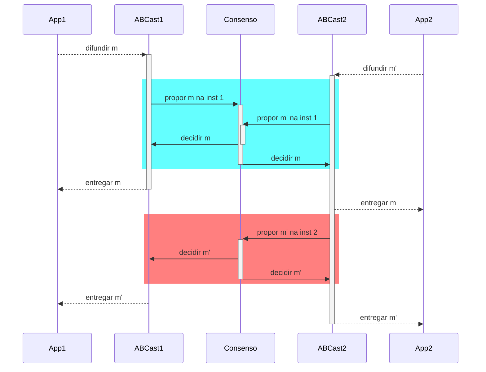

# Acordo

Há diversas primitivas de comunicação em grupo, das quais se destaca a **difusão atômica**, primitiva pela qual se pode facilmente implementar replicação de máquina de estados.
Difusão atômica, por sua vez, é equivalente ao problema do **consenso distribuído**, que está no coração da classe de problemas de **acordo**.
Problemas de acordo são aqueles em que processos devem concordar em quais ações executar.
Dependendo do modelo computacional em que o problema deve ser resolvido, soluções vão de triviais a impossíveis.
Vejamos um exemplo.

### Consenso
O problema que os comandantes estão tentando resolver é, essencialmente, o problema do Consenso Distribuído.
Neste problema, cada um de um conjunto de processos propõe um único valor, sua **proposta**. O objetivo é decidir um dentre os valores propostos, garantindo as seguintes propriedades.

* Validade: Somente um valor proposto pode ser decidido.
* Acordo: Se um processo decide-se por $v$ e outro por $w$, então $v = w$
* Terminação: Todo processo não **defeituoso** decide-se.

Um processo é defeituoso se apresentou um defeito; como estamos considerando apenas defeitos do tipo quebra, um processo é defeituoso se ele parou de funcionar.
Um processo que não é defeituoso é um processo correto.

!!! info inline end "Terminação"
    Na prática, algoritmos exploram oportunidades para progredir, mesmo que não garantam que vão terminar.

Dependendo do modelo computacional, é possível resolver este problema. Contudo, **é impossível resolver deterministicamente o problema do consenso em sistema assíncrono sujeito a falhas**,[^flp85] e assíncrono sujeito a falhas é exatamente o que temos, a rigor, na Internet.
Mas o consenso é resolvido frequentemente em sistemas assíncronos sujeitos a falhas. Isso porque normalmente estes sistemas se comportam sincronamente.
Há diversos algoritmos de consenso que terminam quando o sistema se comporta bem, sendo os mais famosos, atualmente, [Raft](https://raft.github.io/) e [Paxos](http://paxos.systems/index.html)

[^flp85]: [Impossibility of Distributed Consensus with One Faulty Process](https://groups.csail.mit.edu/tds/papers/Lynch/jacm85.pdf). Uma explicação da prova está disponível no [Paper Trail](https://www.the-paper-trail.org/post/2008-08-13-a-brief-tour-of-flp-impossibility/)

A grande razão para que seja impossível chegar a um acordo entre processos neste modelo é a impossibilidade de diferenciar processos defeituosos de processos corretos, mas lentos. Em termos do paradoxo dos 2 generais, a resposta do comandante não chegou porquê ele morreu ou porquê ele está demorando para responder?
Os detectores de defeito abstraem este problema.

### Detectores de Defeitos não Confiáveis

Chandra e Toueg[^CT96] introduziram o conceito de **Detectores de Defeitos** como forma de encapsular a percepção do estado funcional dos outros processos.
Assim, um detector de defeitos pode ser visto como **oráculo distribuído**, com módulos acoplados aos processos do sistema e que trabalha monitorando os outros processos.

[^CT96]: [Unreliable Failure Detectors for Reliable Distributed Systems](https://www.cs.utexas.edu/~lorenzo/corsi/cs380d/papers/p225-chandra.pdf)

Chandra e Toueg classificaram os detectores de defeitos segundo suas características de completude (*completeness*) e acurácia (*accuracy*), ou seja, a capacidade de suspeitar de um processo defeituoso e a capacidade de não suspeitar de um processo correto, respectivamente. 
Embora não seja obrigatório, detectores de falhas são normalmente implementados por meio de trocas de mensagens de *heartbeat*.
Mensagens são esperadas em momentos específicos para sugerir que o remetente continua funcional.

Quando os *heartbeats* não chegam até o limite de tempo, o processo remetente passa a ser considerado **suspeito** de falha.

*Heartbeats*  que chegam depois podem corrigir erros, mas também podem levar a atrasos na detecção de defeitos.

Para capturar estas combinações de eventos, foram definidos os seguintes níveis de 

Os níveis destas propriedades são os seguintes:

* Completude Forte - A partir de algum instante futuro, todo processo defeituoso é suspeito permanentemente por todos os processos corretos.
* Completude Fraca - A partir de algum instante futuro, todo processo defeituoso é suspeito permanentemente por algum processo correto.
* Precisão Forte - Todos os processos são suspeitos somente após terem apresentado defeito.
* Precisão Fraca - Algum processo correto nunca é suspeito de ter apresentado defeito.
* Precisão Eventual Forte - A partir de algum instante futuro, todos os processos são suspeitos somente após apresentarem defeito.
* Precisão Eventual Fraca - A partir de algum instante futuro, algum processo ativo nunca é suspeito antes de ter apresentado defeito.

Um detector ideal seria um com Completude Forte e Precisão Forte, pois detectaria somente processos defeituosos e todos os processos defeituosos.
Este detector é conhecido como $P$ ou *Perfect*.
Infelizmente os detectores perfeitos só podem ser implementados em sistemas síncronos, onde se pode confiar que a falta de uma mensagem implica em que a mensagem não será entregue por quê o remetente deve ser defeituosos.
Assim, é preciso se focar em detectores não perfeitos ou **não confiáveis**.

Em ambientes **parcialmente síncronos**, ou seja, assíncronos aumentados com algum tipo de sincronia, já é possível implementar detectores não confiáveis.
Por exemplo, se os processos dispõem de **temporizadores** precisos, um detector pode contar a passagem do tempo nos intervalos de comunicação com outros processos e, considerando um **limite de tempo** para estes intervalos, tentar determinar se tais processos encontram-se defeituosos ou não. 
Esta determinação é por certo imprecisa e os detectores podem voltar atrás em suas suspeitas tão logo percebam um erro. 
Entretanto, a despeito desta incerteza, a informação provida por estes detectores já pode ser suficiente para que se alcance o consenso se combinada a uma restrição de que **uma maioria dos processos não seja defeituosa**.

???todo "Maioria"
    Adicionar prova.

Chandra, Hadzilacos e Toueg  demonstram que o detector mais fraco com o qual se pode resolver consenso tem as propriedades de Completude Fraca e Acurácia Eventual Fraca.[^CHT96] 
Este detector, conhecido como $\Diamond W$, ou *Eventual Weak*, e é implementável em sistemas nos quais há um **limite superior** de tempo para a transmissão de mensagens, **mesmo que este limite seja desconhecido**.
Vários protocolos de consenso utilizam o detector equivalente, $\Diamond S$, equivalente ao $\Diamond W$ mas com completude forte, ou o eleitor de líderes $\Omega$, que usa a informação do $\Diamond S$ para sugerir um líder entre os processos.
Estes protocolos são escritos de forma que se o limite superior não existe, o protocolo não termina e um **resultado errado nunca é alcançado**, ou seja, os protocolos sempre garantem que as propriedades de corretude não são violadas, mesmo que não garanta que a terminação será alcançada.

[^CHT96]: [The Weakest Failure Detector for Solving Consensus](https://www.cs.utexas.edu/~lorenzo/corsi/cs380d/papers/weakestfd.pdf)

???todo "Figura"
    figura 2.2 da dissertação.

???todo "SWIM"
    https://www.youtube.com/watch?v=0bAJ4iNnf5M

### Paxos: Algoritmo do Sínodo

???todo "Algoritmo"
    Descrever. 
    Por enquanto, vejam esta explicação ou [https://www.cs.rutgers.edu/~pxk/417/notes/paxos.html] ou este vídeo [https://www.youtube.com/watch?v=JEpsBg0AO6o] ou este video [https://www.youtube.com/watch?v=s8JqcZtvnsM].

### Difusão Totalmente Ordenada
Se pudermos resolver o consenso, podemos então resolver o problema da **difusão totalmente ordenada** (*total order multicast*) e com ela implementar a replicação de máquinas de estados.
Relembrando, na  temos que:

* Difusão: mensagens são enviadas de 1 para n (comunicação em grupo)
* Totalmente Ordenada: todos os processos entregam as mensagens na mesma ordem.

Para fazermos isso, precisamos primeiro formalizar as primitivas em vários níveis da resolução do problema.
No nível do canal de comunicação, da rede, processos **enviam** e **recebem** mensagens.
No nível do consenso, processos fazem **propostas** e **aprendem** um valor decidido. Para chegar a uma única decisão, várias mensagens podem ser enviadas e recebidas.
No nível da difusão atômica, mensagens são **difundidas** e **entregues**. Se implementado sobre o consenso, para uma difusão ser bem sucedida, uma instância de consenso é necessária.

!!!note "Primitivas de comunicação"
     * enviar & receber (*send & receive*) - rede
     * propor & decidir (*propose & decide*) - consenso
     * difundir & entregar (*broadcast & deliver*) - difusão

Dado infinitas instâncias de consenso, pode-se usá-las para resolver difusão atômica usando o seguinte procedimento:

* Ordene as instâncias de consenso.
* Para difundir mensagem $m$, proponha a mensagem na menor instância $i$ em que não tiver visto uma decisão.
* Se a decisão de $i$ não é $m$, volte para o passo anterior.
* Entregue as decisões na ordem das instâncias.

No exemplo a seguir, duas mensagens, $m$ e $m'$ foram **difundidas** pelas aplicações App1 e App2, respectivamente, por meio do módulo de difusão atômica junto a cada aplicação.
O módulo de difusão determina qual a menor instância de consenso ainda não decidida, azul, em que propõem as mensagens.
Ao final da instância de conseno, $m$ é decidida e é entregue pelos módulos de difusão.
O módulo ABCast2 insiste na difusão de $m'$, propondo-a na próxima instância, vermelha, que decide $m'$ e leva esta mensagem a ser entregue.

Ambas as aplicações, embora tivessem intenções diferentes sobre qual deveria ser a próxima mensagem entregue, entregam-nas na mesma ordem, isto é, primeiro $m$ e depois $m'$.
Se forem usadas como entrada para algum processamento, na ordem em que foram entregues, as aplicações chegarão ao mesmo estado, em algum momento.

#### Paxos: Difusão atômica

???todo "Paxos"
    * Difusão Atômica

#### Raft: Difusão atômica

Raft é um protocolo de difusão atômica associado a um protocolo de eleição de líderes.
Líderes são eleitos para mandatos pelo voto de uma maioria de processos, o que garante que nunca existirão dois líderes para um mesmo mandato.
Um mandato se estende enquanto o líder mantiver seus seguidores cientes de sua presença, o que faz pelo envio periódico de *heartbeats*.
Atrasos na comunicação ou a falha do líder atual levam a uma suspeita de que o líder falhou, levando a nova eleição e novo mandado.
A comunicação necessária para implementar a difusão atômica acontece em *piggyback* nos *heartbeats*.

No tutorial [The Secret lives of data](http://thesecretlivesofdata.com/raft/), podemos ver com mais detalhes como o protocolo funciona.
O tutorial, entretando, foge da nomenclatura padrão da área usando *log-replication* no lugar de difusão atômica (ou totalmente ordenada).

### Outras Ordenações
Como colocado diversas vezes, se todos os processos executam a mesma sequência de comandos determinísticos, todos avançam pelos mesmos estados, implementando a técnica da replicação de máquinas de estados.
Se usada em um sistema de arquivos, por exemplo, a seguinte sequência de comandos levará sempre ao estado final em que há um arquivo `/tmp/file2` e uma pasta denominada `/dir1`.

* `touch /tmp/file1`
* `echo "teste testando" >> /tmp/file2`
* `rm /tmp/file1`
* `mkdir /dir1`

Há outras ordens dos mesmos comandos que levariam ao mesmo efeito, como a seguinte. Alguns protocolos de replicação de máquinas de estados permitem que reordenações ocorram, desde que não afetem o resultado final dos comandos. 
Contudo, estes protocolos são mais complexos de se implementar e por isso raramente usados.

* `echo "teste testando" >> /tmp/file2`
* `mkdir /dir1`
* `touch /tmp/file1`
* `rm /tmp/file1`

### Arcabouços para coordenação
Há muitas formas de se usar algoritmos de acordo em uma aplicação, embora se recomente que seu escopo seja minimizado a um núcleo onde a consistência forte é absolutamente necessária e que este núcleo seja usado para suportar outras partes do sistema[^cons_core].
Seja implementando a replicação de máquinas de estados, seja implementando um core, ou qualquer outra abstração sobre algoritmos de acordo ou comunicação em grupo, você tem a opção de implementar o protocolo zero, uma tarefa ingrata[^paxosmade]. Felizmente, também tem a opção de usar arcabouços prontos tanto para para comunicação em grupo quanto para diversos outros problemas de coordenação comuns em sistemas distribuídos.

[^paxosmade]: Um exemplo de como traduzir um algoritmo complexo para código pode se ingrato é reportado em [Paxos Made Live - An Engineering Perspective](https://www.cs.utexas.edu/users/lorenzo/corsi/cs380d/papers/paper2-1.pdf).

[^cons_core]: [Consistent Core](https://martinfowler.com/articles/patterns-of-distributed-systems/consistent-core.html)