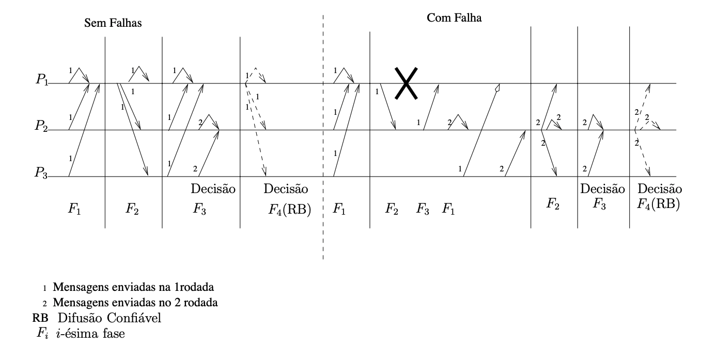
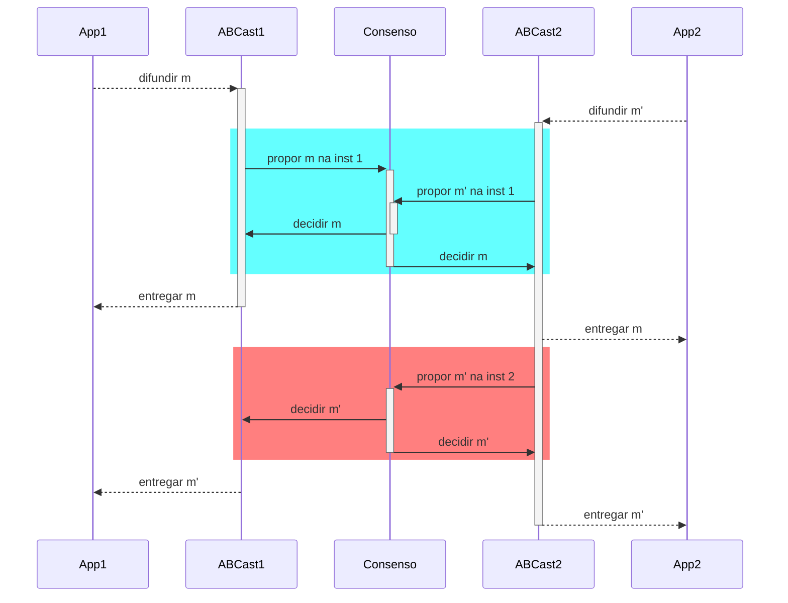

# Problemas de Acordo
Implementar a replicação de processos consiste basicamente em fazer com que múltiplos processos entrem em **acordo** quanto a uma sequência de comandos a serem processados por todos.
De forma geral, problemas de acordo são aqueles em que processos devem **concordar** em alguma coisa, por exemplo, quais ações executar, quais processos considerar parte do sistema, quais transações honrar.
Dependendo do modelo computacional em que o problema deve ser resolvido, soluções vão de triviais a impossíveis.

Como já visto, a construção da sequência de mensagens é feita por primitivas de comunicação em grupo, dentre as quais se destaca a **difusão atômica**, primitiva que garante a entrega confiável e ordenada de mensagens.  A difusão atômica é um problema de acordo, mas não é o único.
Esta primitiva é equivalente ao problema do **consenso distribuído**, que é um problema com especificação mais simples e que está no cerne da classe de problemas de acordo.

## Consenso
No problema do Consenso Distribuído, processos propõe valores, **propostas**,  e, pela execução do protocolo, um dentre os valores propostos é elevado ao status de **decisão**, reconhecido por todos os processos que participaram do protocolo. 
Formalmente, algoritmos para este problema devem garantir as seguintes propriedades.

* Validade: Somente um valor proposto pode ser decidido.
* Acordo: Se um processo decide-se por $v$ e outro por $w$, então $v = w$
* Terminação: Todo processo não **falho** decide-se.

Um processo é **falho** se apresentou uma falha; como estamos considerando apenas falhas do tipo quebra, um processo é falho se ele parou de funcionar.
Um processo que não é falho é um processo **correto**.

!!! info inline end "Terminação"
    Na prática, algoritmos exploram oportunidades para progredir, mesmo que não garantam que vão terminar.

Dependendo do modelo computacional, é possível resolver este problema. 
Contudo, **é impossível resolver deterministicamente o problema do consenso em sistema assíncrono sujeito a falhas**,[^flp85] e assíncrono sujeito a faltas é exatamente o que temos, a rigor, na Internet.
A grande razão para que seja impossível chegar a um acordo entre processos neste modelo é a impossibilidade de diferenciar processos falhos de processos corretos, mas lentos: a mensagem não chegou porquê o processo falhou ou porquê o processo está lento ou a mensagem ainda está em trânsito?

[^flp85]: [Impossibility of Distributed Consensus with One Faulty Process](https://groups.csail.mit.edu/tds/papers/Lynch/jacm85.pdf). Uma explicação da prova está disponível no [Paper Trail](https://www.the-paper-trail.org/post/2008-08-13-a-brief-tour-of-flp-impossibility/)

!!!todo "FLP85"
    * Considere o consenso binário (0 e 1 são as únicas propostas válidas).
    * Pela validade, se todos as propostas são 1, a decisão deve ser 1.
    * Pela validade, se todos as propostas são 0, a decisão deve ser 0.
    * Se começarmos com todos os valores 1 formos trocando um-a-um por 0, em algum momento sairemos de uma entrada que necessariamente leva a 1 para uma que pode levar a 0.
    * Uma execução em que o último valor alterado pertence a um processo correto/falho pode ser construída de forma que leve a uma decisão 1/0.
    * Como os processos não tem certeza se ele falhou o não, ambas as decisões deve ser possíveis neste cenário, pois são indistinguíveis.
    * Logo, há um estado bivalente, decidido pela troca de mensagens e não pelos valores iniciais.

    * Dado um estado bivalente, sempre é possível forçar um próximo estado bivalente.

A despeito desta impossibilidade, o consenso é resolvido frequentemente em sistemas assíncronos sujeitos a falhas! 
Isso porque normalmente estes sistemas se comportam sincronamente e há diversos algoritmos de consenso que terminam quando o sistema se comporta bem, sendo os mais famosos, atualmente, [Raft](https://raft.github.io/) e [Paxos](http://paxos.systems/index.html)

Chandra, Hadzilacos e Toueg demonstraram que o detector mais fraco com o qual se pode resolver consenso em um sistema distribuído assíncrono e sujeito a falhas é o $\Diamond W$, que tem as propriedades de Completude Fraca e Acurácia Eventual Fraca. [^CHT96]
Mesmo com este detector, outras limitações existem, sendo uma fundamental o fato de que pelo menos uma maioria dos processos deve ser correta para que o processo não viole a propriedade de acordo.

???todo "Maioria"
    * Se falhas são possíveis e um detector de falhas não confiável é usado, então qualquer protocolo que termine com menos de uma maioria pq suspeita que os outros processos estão falhos pode estar errado pois os outros processos podem estar na mesma situação de decidir um valor diferente.

[^CHT96]: [The Weakest Failure Detector for Solving Consensus](https://www.cs.utexas.edu/~lorenzo/corsi/cs380d/papers/weakestfd.pdf)

### Chandra & Toueg

O algoritmo de Chandra e Toueg [^CT96] é executado em rodadas assíncronas, sendo cada uma dividida em quatro fases. 
A comunicação é centralizada em um coordenador, isto é, toda comunicação ou parte de ou é direcionada ao coordenador. 
O coordenador $c_p$ é pré-determinado, por exemplo, pela função $c_p = r_p~\text{mod}~n$, sendo $r_p$ a rodada atual e $n$ o número de processos que participam do consenso. 
O algoritmo considera a existência de um detector de falhas da classe $\Diamond S$.

[^CT96]: [Unreliable Failure Detectors for Reliable Distributed Systems](https://www.cs.utexas.edu/~lorenzo/corsi/cs380d/papers/p225-chandra.pdf)

* Fase 1: Todos os processos enviam sua estimativa corrente e o número da última rodada na qual a estimativa foi atualizada (*timestamp*), para o coordenador.
* Fase 2 : O coordenador recolhe uma maioria ($\lceil \frac{n+1}{2}\rceil$) de estimativas e propõe um dos valores com o maior timestamp.
* Fase 3 : Todos os processos esperam a proposta do coordenador, enviando uma mensagem de reconhecimento quando a recebem (Ack) e assumindo a proposta do coordenador como sua estimativa corrente. 
    Se o processo, antes de receber a mensagem, suspeita que o coordenador falhou, então envia uma mensagem de NAck para todos os processos, levando todos a passarem para uma nova rodada.
* Fase 4 : O coordenador espera por ($\lceil \frac{n+1}{2}\rceil$) mensagens. 
    Se nenhuma mensagem recebida for do tipo NAck, o coordenador envia sua estimativa como decisão para todos os processos via difusão confiável. 
    Caso contrário, procede para uma nova rodada. 
    Qualquer processo que receba a decisão do coordenador decide-se automaticamente pelo mesmo valor.

Uma instância de execução do algoritmo, exemplificando seu padrão de mensagens, é exibida na figura adiante. 
Mensagens da primeira e segunda rodadas trafegam ao mesmo tempo nos canais de comunicação. 
Na parte esquerda da figura, o algoritmo transcorre sem falhas. 
Na parte direita, o processo P1, o coordenador inicial em ambas as execuções, falha.

<!--Uma propriedade interessante deste algoritmo é o travamento de um valor tão logo uma maioria o tenha aceitado, isto é, tão logo $\lceil \frac{n+1}{2}\rceil$ processos tenham aceitado um valor como suas estimativas, este torna-se o único valor possível de ser decidido. 
Isso ocorre pois o coordenador, ao esperar uma maioria de estimativas e usar as que foram resultado de atualizações mais recentes, necessariamente escolhe este valor como sua proposição.-->

O algoritmo de Chandra e Toueg é facilmente ludibriado por suspeitas incorretas, que levam à emissão de NAck’s. 
Se um número suficiente de Ack’s foi gerado, mas um único NAck é recebido antes que todos os Ack’s tenham chegado ao coordenador, então a rodada é abandonada. 

### Paxos: Algoritmo do Sínodo

???todo "Algoritmo"
    * Descrever. 
    * Por enquanto, vejam esta explicação ou [https://www.cs.rutgers.edu/~pxk/417/notes/paxos.html] 
    * ou este vídeo [https://www.youtube.com/watch?v=JEpsBg0AO6o] ou este video [https://www.youtube.com/watch?v=s8JqcZtvnsM].

## Difusão Totalmente Ordenada
Se pudermos resolver o consenso, podemos então resolver o problema da **difusão totalmente ordenada** (*total order multicast*) e com ela implementar a replicação de máquinas de estados.
Relembrando, na  temos que:

* Difusão: mensagens são enviadas de 1 para n (comunicação em grupo)
* Totalmente Ordenada: todos os processos entregam as mensagens na mesma ordem.

Para fazermos isso, precisamos primeiro formalizar as primitivas em vários níveis da resolução do problema.
No nível do canal de comunicação, da rede, processos **enviam** e **recebem** mensagens.
No nível do consenso, processos fazem **propostas** e **aprendem** um valor decidido. Para chegar a uma única decisão, várias mensagens podem ser enviadas e recebidas.
No nível da difusão atômica, mensagens são **difundidas** e **entregues**. Se implementado sobre o consenso, para uma difusão ser bem sucedida, uma instância de consenso é necessária.

!!!note "Primitivas de comunicação"
     * enviar & receber (*send & receive*) - rede
     * propor & decidir (*propose & decide*) - consenso
     * difundir & entregar (*broadcast & deliver*) - difusão

Dado infinitas instâncias de consenso, pode-se usá-las para resolver difusão atômica usando o seguinte procedimento:

* Ordene as instâncias de consenso.
* Para difundir mensagem $m$, proponha a mensagem na menor instância $i$ em que não tiver visto uma decisão.
* Se a decisão de $i$ não é $m$, volte para o passo anterior.
* Entregue as decisões na ordem das instâncias.

No exemplo a seguir, duas mensagens, $m$ e $m'$ foram **difundidas** pelas aplicações App1 e App2, respectivamente, por meio do módulo de difusão atômica junto a cada aplicação.
O módulo de difusão determina qual a menor instância de consenso ainda não decidida, azul, em que propõem as mensagens.
Ao final da instância de conseno, $m$ é decidida e é entregue pelos módulos de difusão.
O módulo ABCast2 insiste na difusão de $m'$, propondo-a na próxima instância, vermelha, que decide $m'$ e leva esta mensagem a ser entregue.

Ambas as aplicações, embora tivessem intenções diferentes sobre qual deveria ser a próxima mensagem entregue, entregam-nas na mesma ordem, isto é, primeiro $m$ e depois $m'$.
Se forem usadas como entrada para algum processamento, na ordem em que foram entregues, as aplicações chegarão ao mesmo estado, em algum momento.

### Paxos: Difusão atômica

???todo "Paxos"
    * Difusão Atômica

### Raft: Difusão atômica

Raft é um protocolo de difusão atômica associado a um protocolo de eleição de líderes.
Líderes são eleitos para mandatos pelo voto de uma maioria de processos, o que garante que nunca existirão dois líderes para um mesmo mandato.
Um mandato se estende enquanto o líder mantiver seus seguidores cientes de sua presença, o que faz pelo envio periódico de *heartbeats*.
Atrasos na comunicação ou a falha do líder atual levam a uma suspeita de que o líder falhou, levando a nova eleição e novo mandado.
A comunicação necessária para implementar a difusão atômica acontece em *piggyback* nos *heartbeats*.

No tutorial [The Secret lives of data](http://thesecretlivesofdata.com/raft/), podemos ver com mais detalhes como o protocolo funciona.
O tutorial, entretanto, foge da nomenclatura padrão da área usando *log-replication* no lugar de difusão atômica (ou totalmente ordenada).

### Outras Ordenações
Como colocado diversas vezes, se todos os processos executam a mesma sequência de comandos determinísticos, todos avançam pelos mesmos estados, implementando a técnica da replicação de máquinas de estados.
Se usada em um sistema de arquivos, por exemplo, a seguinte sequência de comandos levará sempre ao estado final em que há um arquivo `/tmp/file2` e uma pasta denominada `/dir1`.

* `touch /tmp/file1`
* `echo "teste testando" >> /tmp/file2`
* `rm /tmp/file1`
* `mkdir /dir1`

Há outras ordens dos mesmos comandos que levariam ao mesmo efeito, como a seguinte. Alguns protocolos de replicação de máquinas de estados permitem que reordenações ocorram, desde que não afetem o resultado final dos comandos. 
Contudo, estes protocolos são mais complexos de se implementar e por isso raramente usados.

* `echo "teste testando" >> /tmp/file2`
* `mkdir /dir1`
* `touch /tmp/file1`
* `rm /tmp/file1`

## Arcabouços para coordenação
Há muitas formas de se usar algoritmos de acordo em uma aplicação, embora se recomente que seu escopo seja minimizado a um núcleo onde a consistência forte é absolutamente necessária e que este núcleo seja usado para suportar outras partes do sistema[^cons_core].
Seja implementando a replicação de máquinas de estados, seja implementando um core, ou qualquer outra abstração sobre algoritmos de acordo ou comunicação em grupo, você tem a opção de implementar o protocolo zero, uma tarefa ingrata[^paxosmade]. Felizmente, também tem a opção de usar arcabouços prontos tanto para para comunicação em grupo quanto para diversos outros problemas de coordenação comuns em sistemas distribuídos.

[^paxosmade]: Um exemplo de como traduzir um algoritmo complexo para código pode se ingrato é reportado em [Paxos Made Live - An Engineering Perspective](https://www.cs.utexas.edu/users/lorenzo/corsi/cs380d/papers/paper2-1.pdf).

[^cons_core]: [Consistent Core](https://martinfowler.com/articles/patterns-of-distributed-systems/consistent-core.html)
