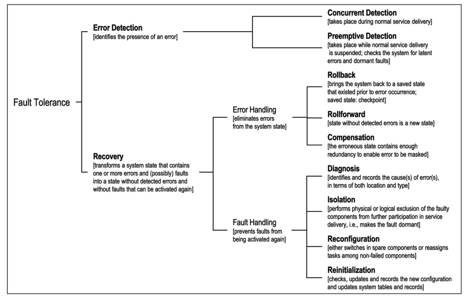
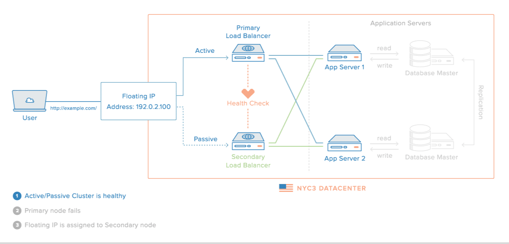

# Falhas, Erros e Defeitos
Para que possamos pensar em sistemas que atendam a qualquer requisito de qualidade de serviço na presença de problemas, primeiro precisamos entender os tipos de problemas que aparecem em vários níveis, desde o seu desenvolvimento até seu uso.

No nível mais básico dos problemas a serem contornados para se obter dependabilidade, temos as **falhas** (*defect*, *fault*, para alguns, falta), que é um erro no desenvolvimento do sistema, como *bugs* ou defeitos de fabricação, que o leva a ficar diferente do que foi especificado, ou mesmo um erro na especificação.
Uma falha existe mesmo se for raramente ativada e mesmo se seus efeitos nunca forem percebidos. 
Por exemplo, se o código tem um `<=` em vez de `<` na especificação de uma iteração, mas se uma condição faz com que a iteração seja interrompida antes, o código ainda tem uma falha.

```c++
char minha_string[11];
int i;

initialize(minha_string);

for(i = 0; i <= 10; i++){
    if (minha_string[i] == '.')
        break;

    minha_string[i] = 'a';
}

minha_string[i] = '\0';
```

No segundo nível, temos o **erro** (*error*), que é a manifestação da falha levando a algum comportamento indevido. No exemplo acima, um erro seria quando a iteração passasse do ponto correto por causa do `<=`, por exemplo, na hora de escrever uma *string* em um array, estourando o limite do array na pilha mas sobrescrevendo uma variável que não seja mais usada.
O erro pode passar despercebido, mas ainda assim é um erro.

Finalmente, no terceiro nível, temos os **defeitos** (*failure*, para alguns, falha), um erro percebido pelo usuário. 
Continuando o exemplo, um *stack overflow* que leva a uma falha de segmentação, leva a um defeito.

Quando um componente manifesta um defeito, outros componentes que dele dependem, internalizarão entradas indevidas, uma falha externa, o que levará a seu próprio estado interno a estar errôneo e possivelmente também manifestar um defeito. 
Esta cadeia pode levar cenários catastróficos.

!!!example "Falhas famosas"
    === "Ariane 5"

        O Ariane 5 foi um foguete desenvolvido pela agencia espacial européia que explodiu durante o lançamento.

        !!!quote "The Explosion of the Ariane 5"
              On June 4, 1996 an unmanned Ariane 5 rocket launched by the European Space Agency exploded just forty seconds after its lift-off [...] after a decade of development costing \$7B. The destroyed rocket and its cargo were valued at \$500M. [...] the failure was a software error [...] a 64 bit floating point number [...] was converted to a 16 bit signed integer. The number was larger than 32,767, the largest integer storeable in a 16 bit signed integer, and thus the conversion failed.

        ](../images/ariane5.jpg)

        O erro gerado foi tratado como input, causando outros erros, que geraram instabilidade e que levou o sistema a se auto-destruir.

    === "787 Dreamliner"

        O avião 787 dreamliner, da Boeing, tem um problema que torna necessário reiniciar o sistema elétrico a cada 248 dias, ou o mesmo pode ter uma pane.

        !!!quote
             The plane’s electrical generators fall into a failsafe mode if kept continuously powered on for 248 days. The 787 has four such main generator-control units that, if powered on at the same time, could fail simultaneously and cause a complete electrical shutdown.

        Segundo as "más línguas", o problema é que acontece um *overflow* em um contador de tempo

        !!!quote
             <blockquote class="twitter-tweet"><p lang="en" dir="ltr">248 days == 2^31 100ths of a second.<br><br>even in 2015, our airplanes have integer overflow bugs <a href="https://t.co/6Z8d4y9gjM">https://t.co/6Z8d4y9gjM</a></p>&mdash; Fiora @ 日本語でFF14 (@FioraAeterna) <a href="https://twitter.com/FioraAeterna/status/594110518203260929?ref_src=twsrc%5Etfw">May 1, 2015</a></blockquote> <script async src="https://platform.twitter.com/widgets.js" charset="utf-8"></script>


    === "737 Max"

        O Boeing 737 Max é uma modificação do 737 original em que o motores maiores foram usados sem modificar a estrutura do restante do avião e portanto alterando o seu centro de massa. Por causa da diferença, o avião pode subir rápido demais, correndo o risco de perder sustentação. Para auxiliar os pilotos e evitar a necessidade de treinamento específico, um sensor é usado para detectar se o avião está nesta situação e forcar o nariz do avião para baixo para corrigir o problema.
        Contudo, no 737 Max apenas um sensor é usado e no caso de falha do mesmo, o avião é forçado para baixo e em direção ao solo, o que levou à morte de centenas de pessoas.[^737max]


    === "Subaru SUV"
        Em 2018 a Subaru fez um *recall* gigante, de mais de 1 milhão de unidades de um seus modelos de SUV, porquê uma falha em um software fez com que soldagens fossem feitas incorretamente no chassis dos veículos.
        O erro era irreparável, levando a grandes prejuízos.

        ![[Recall Subaru()https://spectrum.ieee.org/riskfactor/computing/it/coding-error-leads-293-subaru-ascents-to-the-car-crusher)]](../images/subaru.png)


        <!--Car Hack -- 2017, images/carhack, https://www.wired.com/story/car-hack-shut-down-safety-features/-->


    === "Shark atack!"
        <iframe width="560" height="315" src="https://www.youtube.com/embed/VVJlKJi9FWU" title="YouTube video player" frameborder="0" allow="accelerometer; autoplay; clipboard-write; encrypted-media; gyroscope; picture-in-picture" allowfullscreen></iframe>

[^737max]: [Boeing 737 Max: why was it grounded, what has been fixed and is it enough?](https://theconversation.com/boeing-737-max-why-was-it-grounded-what-has-been-fixed-and-is-it-enough-150688)


Quando defeitos aparecem, é importante identificar suas causas, isto é, a cadeia de eventos que os levaram a acontecer.
Algumas empresas até publicam as ***root cause analysis*** ou a análise *post-mortem* para a comunidade como forma de compartilhar conhecimento e também por questões de transparência, mas mais importante, conhecer a causa pode ajudar a evitar que novas instâncias da mesma falha ou similares, [^rca] aumentando a dependabilidade do sistema.

[^rca]: [Post-mortems](https://github.com/danluu/post-mortems) para uma extensa lista de análises.

#### Classes de Defeitos
Falhas são um fato da vida, uma constante no desenvolvimento de sistemas, mas se precisamos lidar com elas, previnindo e tolerando sua presença, precisamos entender como se manifestam e, para isso, uma classificação é essencial.

##### Quebra
Defeitos de **quebra** (***crash***) são defeitos em que o componente para de funcionar, irreversivelmente.
Uma vez que o componente cessa seu funcionamento, qualquer comunicação com o mesmo é interrompida e pode dar bons indicativos do defeito aos outros componentes.
Em um sistema assíncrono, contudo, não há garantias de que esta detecção do defeito será correta.

Alguns sistemas, denominados ***fail-stop***, forçam-se a parar de funcionar quando percebem um defeito, imitando uma quebra, e implementando um comportamento ***fail-fast***.[^failfastfast]
Estes sistemas podem emitir um "canto do cisne" para permitir que outros componentes detectem o defeito.

[^failfastfast]: [Fail Fast Is Failing… Fast!](https://pathelland.substack.com/p/fail-fast-is-failing-fast)

Após pararem, alguns sistemas podem aplicar passos de recuperação e voltar a funcionar, no que é denominado ***fail-recover***. Ao retornar à operação, o processo poderia assumir uma nova identidade.

##### Omissão

Em um **defeito de omissão** (***omission failure***), um componente não executa alguma ação. Por exemplo, uma requisição recebida por um servidor não é executada, um disco não armazena os dados no meio magnético, ou uma mensagem não é transmitida.
Este tipo de defeito é difícil de ser identificado pois outros componentes não necessariamente tem acesso direto ao resultado da operação.
Por exemplo, se o meio de comunicação se recusou a entregar uma mensagem, então houve um defeito de omissão.
Mas se a mensagem é retransmitida até que tenha sua entrega confirmada, então o defeito é mascarado.


##### Temporização

Em sistemas em que há limites de tempo para a execução de ações, uma violação destes limites é **defeito de temporização**.
Por exemplo, se o meio de comunicação se recusou a entregar uma mensagem, então houve uma falha de omissão.
Novamente considerando problemas de transmissão de mensagens, se o meio de comunicação se recusou a entregar uma mensagem que deveria ser entregue dentro de 3ms, então houve um defeito de omissão.
Mas se a mensagem é retransmitida até que tenha sua entrega confirmada, mas a mesma é entregue com 5ms, então o defeito é mascarado como um defeito de temporização.
Defeitos de temporização podem acontecer devido a problemas de sincronização de relógios, como no algoritmo de difusão totalmente ordenada visto [anteriormente.](time/#usos-de-relogios-sincronizados)

##### Arbitrários
Um defeito **arbitrário** ou **bizantino** é um no qual qualquer comportamento pode acontecer. 
Por exemplo, uma mensagem pode ser modificada, um servidor pode reiniciar-se constantemente, todos os dados podem ser apagados, ou acesso pode ser dado a quem não é devido.
Estes defeitos podem ser causados por agentes mal intencionados, como hackers e vírus.


##### Hierarquia
Os tipos de defeitos apontados acima podem ser hierarquizados como a seguir, o que quer dizer que uma quebra é apenas uma omissão por tempo infinito:

Fail-stop $\subset$ Quebra $\subset$ Omissão $\subset$ Temporização $\subset$ Arbitrária


##### Defeitos intermitentes

Alguns defeitos fogem à classificação acima por terem um comportamento especial, se manifestando de forma intermitente, por causa de eventos esparsos como picos de energia, ou pelo comportamento emergente da interação com outros sistemas. Para capturar estas idiossincrasias, recorremos a uma outra [classificação](http://www.idc-online.com/technical_references/pdfs/information_technology/Classification_Of_Software_Bugs.pdf), bem informal.

!!!example "Tipos de bugs"

    === "Bohrbug"
        A BohrBug is just your average, straight-forward bug. Simple like the Bohr model of the atom: A smallsphere. You push it, it moves. BohrBugs are reproducible, and hence are easily fixed once discovered. These are named after Niels Bohr, who proposed a simple and easy-to-understand atomic model in 1913. In Bohr’s model, things like the path and momentum of an electron in an atom are predictable.

    === "Heisenbug"
        A bug that disappears or alters its behavior when one attempts to probe or isolate it. No matter how much time and effort is spent trying to reproduce the problem, the bug eludes us. Such bugs were named Heisenbugs, after Werner Heisenberg, who is known for his “uncertainty principle”. According to his theory, it is not possible to accurately or certainly determine the position and velocity of an electron in an atom at a particular moment.

    === "Mandelbug"
         When the cause of the bug is too complex to understand, and the resulting bug appears chaotic, it is called a Mandelbug. These are named after Benoît Mandelbrot, who is considered the father of fractal geometry (fractals are complex, self-similar structures). A bug in an operating system that depends on scheduling is an example of a Mandelbug.

    === "Schroedinbug"
         Sometimes, you look into the code, and find that it has a bug or a problem that should never have allowed it to work in the first place. When you try out the code, the bug promptly shows up, and the software fails! Though it sounds very uncommon, such bugs do occur and are known as Schroedinbugs. They are named after the scientist Erwin Schrödinger, who proposed that in quantum physics, quantum particles like atoms could exist in two or more quantum states.

    === "Fractal Bugs"
         A bug, after which its resolution is found, reveals additional self-similar bugs elsewhere in the code, after which they are fixed, likewise appear elsewhere still.

#### Correlação entre falhas
Algumas falhas são ativadas por entradas e, neste caso, mesmo que se tenha várias cópias do mesmo sistema, todas apresentarão erros uma vez que a entrada problemática acontecer.
Este é um cenário em que as falhas não são independentes, mas correlatas. Para evitá-lo, podemos usar ***n-version programming***, que consiste basicamente em ter múltiplas implementações do mesmo sistema desenvolvidas de forma independente, isto é, fazendo uso de um ou mais da seguintes opções:

* múltiplos times
* múltiplos sistemas operacionais
* múltiplas linguagens de programação.

Esta técnica é interessante mais raramente usada, basicamente pelo seu alto custo.
Além disso, erros de especificação são reproduzidos e levam times diferentes a produzir erros iguais.

<!--
### Degradação graciosa

Dependendo dos efeitos e tratamentos.

* Fail safe - defeito não leva a comportamento inseguro (sistema de entretenimento no avião)
* Fail soft - graceful degradation (sistema de controle de vôo)
* Fail fast - para o fluxo de defeitos (e possível reinício)


* Robusto - erros não atrapalham execução (tratamento de exceções)
* Quebradiço (*brittle*) - não resiliente a falhas
-->


#### Falhas Bizantinas

<!--
Uma história de três exércitos -- Versão 2}
Exércitos estão às portas de Bizâncio, aka Constantinopla, aka Istambul.

Todos os exércitos tem que atacar em conjunto ou se retirar em conjunto.

Cada exército é comandado por um General. Alguns destes preferem atacar, enquanto outros preferem se retirar.

Alguns generais podem ter sido comprados, e mandar mensagens discrepantes para os outros, ou simplesmente não mandar mensagens.

Fonte: \href{http://research.microsoft.com/en-us/um/people/lamport/pubs/byz.pdf}{Lamport, L.; Shostak, R.; Pease, M. (1982). "The Byzantine Generals Problem" (PDF). ACM Transactions on Programming Languages and Systems. 4 (3): 382–401. doi:10.1145/357172.357176.}


Generais e Tenentes
Problema pode ser mudado para:

	* Comandante envia ordem.
	* Todos os tenentes leais executam ordem recebida.
	* Comandante pode ser traidor.


Generais e Tenentes
Suponha 3 exércitos. \\
Comandante (traidor) diz "Ataque!" Tenente A e "Retirada!" tenente B.\\
Ou \\
Comandante diz "Ataque!" a ambos. Tenente A segue a ordem mas B se retira.

 E se os tenentes trocarem informações?

 Como diferenciar casos em que Comandante ou Tenente é traidor?


Generais e Tenentes
Só há solução se mais de $\frac{2}{3}$ dos Generais/Tenentes são leais.


%http://www.drdobbs.com/cpp/the-byzantine-generals-problem/206904396?pgno=5

Comunicação}

	* Toda mensagem enviada é entregue corretamente.
	* A ausência de mensagem pode ser detectada (mensagem Null é entregue no lugar) (Sistema síncrono)


4/0}
General manda ordens.

Ausência de ordem = Retirada

Tenente repassa ordens

Maioria de comandos é comando a ser seguido


4/0}
General manda ordens.

Ausência de ordem = Retirada

Tenente repassa ordens

Maioria de comandos é comando a ser seguido


Comunicação}

	* Toda mensagem enviada é entregue corretamente.
	* Toda mensagem é assinada.
	* A ausência de mensagem pode ser detectada (mensagem Null é entregue no lugar) (Sistema síncrono)


 É possível detectar inconsistências e processos bizantinos.


%http://cs.brown.edu/courses/cs138/s16/lectures/19consen-notes.pdf


-->


### Como lidar com falhas?

Mas se o objetivo é a dependabilidade, isto é, ter o sistema pronto para uso e apto a manter este estado durante o período de uso, mesmo na presença de catástrofes, precisamos de formas de lidar com falhas, **previnindo**, **removendo** e **tolerando**-as.

A **prevenção de falhas** acontece por meio de técnicas bem estabelecidas de engenharia.
No caso de sistemas de software, modularização, uso de linguagens de programação fortemente tipadas e encapsulamento são passos importantes. 
Outras técnicas envolvidas na prevenção de falhas são análise estática, especificação formal, teste e prova destas especificações.
Por exemplo, diversas empresas usam linguagens como [TLA$^+$](https://lamport.azurewebsites.net/tla/tla.html)[^tla_real] e [Promela](https://en.wikipedia.org/wiki/Promela), associados a verificadores de modelo como TLC e Spin, respectivamente, para testar e verificar a corretude de seus algoritmos.


[^tla_real]: [*Using TLA+ in the Real World to Understand a Glibc Bug*](https://probablydance.com/2020/10/31/using-tla-in-the-real-world-to-understand-a-glibc-bug/)

Mesmo uma especificação correta pode produzir um sistema com falhas pois a tradução de especificações formais para código é um passo complexo.
Testes e manutenção do sistema permitem a **remoção de falhas** que passarem despercebidas pelas tentativas de prevenção.

Testes, contudo, apenas aumentam a confiança no sistema, não sendo capazes de certificar a ausência de problemas.
Assim, tenta-se desenvolver os sistemas de forma que, mesmo se falhas ainda estiverem presentes, seus efeitos não sejam percebidos como defeitos, isto é, sistemas que tenha **tolerância a falhas** (ou **prevenção de defeitos**).

Para se alcançar tolerância a falhas é necessário detectar e se recuperar de erros. 
Por exemplo, um sistema de arquivos que mantenha um *journal*, como o [Ext v3](https://en.wikipedia.org/wiki/Ext3#Journaling_levels), armazena informação de forma redundante e, quando **detecta** que os dados em sua forma principal estão corrompidos, usa o *journal* para **recuperar** os dados, **mascarando** o erro.

De acordo como Avizienis *et al.*,[^avizienis] temos as seguintes técnicas para tolerar falhas:

[^avizienis]: [Basic Concepts and Taxonomy of Dependable and Secure Computing](https://www.nasa.gov/pdf/636745main_day_3-algirdas_avizienis.pdf)

[](https://www.nasa.gov/pdf/636745main_day_3-algirdas_avizienis.pdf)


Um sistema que sofra de defeitos recorrentes é um bom candidato a previsão de defeitos, em que se estima quando uma falha ocorrerá baseado no histórico.
Por exemplo, um sistema que sofra falha por uso excessivo de memória a cada dez dias em uso, pode ser reiniciado no nono dia, em condições controladas, para evitar problemas maiores enquanto a razão do uso excessivo de memória é corrigido.

Se remover todas as possibilidades de defeitos de um componente é algo difícil, apostemos na tolerância a falhas.
De forma geral, tolerância a falhas é obtida por algum tipo de **redundância**. 
Redundância pode ser aplicada em vários níveis, por exemplo, gastando **mais tempo na especificação do projeto**, ou montando um laboratório de testes mais próximo do ambiente de produção.

Outra forma óbvia de redundância é a **replicação** de componentes. Por exemplo, pense no pneu estepe de um carro, no gerador de eletricidade de um hospital.
Replicação permite remover os **pontos únicos de falha** (SPOF, *Single Point of Failure*), ou seja, componentes não dependáveis.
Seja como for, redundância implica em mais custos, então o grau de redundância a ser utilizado depende de uma análise custo x benefício.
No caso de um sistema distribuído, quando falamos em redundância, normalmente falamos em processos redundantes, cópias ou réplicas, mesmo que não desenvolvidos usando *n-version programming*.
Assim, com múltiplas cópias, quando um processo apresenta um defeito, outro podem continuar executando o serviço.

Dois modos clássicos de replicação são o **primário/cópia** e **ativo/ativo**.
No caso da replicação **primário/cópia**, também conhecida como **mestre/escravo**, o primário é responsável por lidar com clientes e por informar cópias das modificações de estado.



Como as atualizações de estado fluem do primário para a cópia, é possível que a cópia não tenha o estado mais atual.
Para visualizarmos melhor esta situação, vejamos a **replicação em cadeia**, uma generalização de primário/cópia em que os processos se organizam em um sequência para executar operações.


**Atualizações** no sistema são sempre **direcionadas ao primário**, a cabeça da sequência. 
**Leituras**, se absolutamente necessitarem dos dados escritos mais recentemente, também devem ser direcionadas à **cabeça**. 
Caso contrário, podem ser direcionadas aos processos na **cauda**, diminuindo a carga de trabalho na cabeça.

No caso da replicação ativa, as **várias cópias executam todos os comandos** enviados para o sistema, estando assim todas aptas a continuar a executar o serviço. 
A técnica de **replicação de máquinas de estados vista no capítulo anterior** é uma materialização da replicação ativa.
Como vimos anteriormente, replicação de máquinas de estados utiliza primitivas de comunicação em grupo, mas as vistas anteriormente não são funcionais principalmente por não serem tolerantes a falhas. Vejamos a porquê é difícil desenvolver primitivas tolerantes a falhas.


## Reconfiguração
<!--

\subsection{Reconfiguração}

Reconfiguração da Aplicação}
Na segunda entrega do projeto, você distribuiu a carga do seu banco de dados entre vários nós. Caso um nó falhe, parte dos seus dados será perdida.

Para corrigir esta deficiência, na terceira entrega, cada nó será replicado em três vias e, assim, caso um nó falhe, outros dois continuarão a manter o dado.


Reconfiguração da Aplicação}
Ainda assim, há problemas. E se mais de um, de um mesmo conjunto de réplicas, falhar? 

 Embora seja pequena a probabilidade de dois nós de um mesmo grupo falharem em instantes próximos, dado tempo suficiente, qualquer evento com probabilidade diferente de 0 acontecerá.

 Precisamos de uma forma de trocar nós da aplicação que falharam por novos nós. 

Este é problema denominado Pertinência de Grupo ou \emph{Group Membership}


Group Membership}
Para não correr o risco, retire o processo falhos do grupo e coloque outro no lugar!

I.e., mude a visão que o sistema de quem é o grupo.


Visões}
\includegraphics[width=.7\textwidth]{images/vc}

Fonte: \href{https://www.cs.rutgers.edu/~pxk/417/notes/virtual_synchrony.html}{Paul Krzyzanowski}

$G$ é o grupo de processos participando do sistema, é a Visão do Sistema.


Inicialmente, $G$ consiste de apenas o processo $p$, como o processo que cria o cluster no Atomix. Na sequência, outros processo vão se unindo ao grupo através de View Changes. Uma vez que $p$ e $q$ estão no grupo, inicia-se a comunicação entre eles. Quando $r, s$ e $t$ aparecem, também entram no grupo por meio de uma nova visão.

Finalmente, quando ambos $p$ e $q$ falham, os outros processo os excluem da visão, e continuam funcionando normalmente.


Impossibilidade de Detecção de Falhas}
Em um sistema distribuído assíncrono, é impossível distinguir com toda certeza um processo falho (parou de funcionar) de um que está lento.

 Como decidir se mudar ou não de visão?


Ou aceita a imprecisão e muda quando suspeitar de uma falha, ou corre o risco de ficar esperando \emph{ad eternum} e não mudar, mesmo quando uma falha aconteceu.

Uma ``solução''!}
Quando suspeitar de falha, reporte suspeita a outros processos, que também passarão a suspeitar.

Tome decisão baseado na suspeita, isto é, troque de visão quando houver suspeita.

Pague o preço de uma suspeita errada, isto é, quando um processo for removido da visão indevidamente, adicione-o novamente.


Sincronismos Virtual}
Gerenciamento de Grupo/Group Membership e Comunicação em Grupo

	* Processos se unem ao grupo
	* Processos saem do grupo
	* Processos enviam mensagens para o grupo
	* Diferentes ordenações
		
			* Atomic Multicast
		


Visão de Grupo}

	* Visão: conjunto de processos no sistema.
	* Multicast feito para processos na visão.
	* Visão é consistente entre os processos.
	* Entrada e saída de processos muda a visão.


Eventos}

	* Mensagem
	* Mudança de Visão
	* Checkpoint


Visões}
\includegraphics[width=.7\textwidth]{images/vc}

Fonte: \href{https://www.cs.rutgers.edu/~pxk/417/notes/virtual_synchrony.html}{Paul Krzyzanowski}


Sincronismo Virtual}
Deve satisfazer

	* Se uma mensagem é enviada em uma visão, ela só pode ser entregue naquela visão.
	* Se uma mensagem é entregue a um processo correto em uma visão, então é entregue a todos os processos corretos naquela visão.
	* Se um processo não recebe a mensagem, ele não estará na próxima visão.
	* Ao entrar em uma visão, o processo recebe o estado dos outros processos e seu estado se torna equivalente ao de um processo que recebeu todas as mensagens já entregues.


A troca de Visão é uma barreira.


ISIS Toolkit}
	Sistema de Sincronismo Virtual tolerante a falhas desenvolvido por Ken Birman, Cornell University (\url{http://www.cs.cornell.edu/Info/Projects/Isis/})\\
	ISIS: An Environment for Constructing Fault-Tolerant Distributed Systems. Kenneth Birman, D. Skeen, A. El Abbadi, W. C. Dietrich and T. Raeuchle. May 1983.
	

	* 100.000's/s
	* Em uso até 2009
	* NY Stock Exchange
	* Swiss Exchange
	* US Navy
	* Precursos de sistemas como Zookeeker
	* Totem, ISIS, Horus, Transis (Partições), \alert{Spread}, \alert{Ensamble}, \alert{JGroups}, Appia, QuickSilver, vSynch (née ISIS 2)


Difusão Totalmente Ordenada}

	* Corretude: Se um processo $p$ envia uma mensagem $m$ para processos no grupo $G$, então se $p$ não falha, todos os processos corretos em $G$ recebem a mensagem.
	
	* Acordo: Se um processo correto em $G$ recebe uma mensagem $m$, então todo processo correto em $G$ recebe $m$
	
	* Ordenação: Se um processo recebe mensagem $m$ e depois $n$, então qualquer processo que receba a mensagem $n$ deve primeiro receber $m$
	
	* Validade: Somente mensagens difundidas são entregues.


E se mandarmos mensagens do tipo ``A partir da entrega desta mensagem, o grupo de processos é $G$.''


Sincronismo Virtual}
Deve satisfazer

	* Se uma mensagem é enviada em uma visão, ela só pode ser entregue naquela visão.\\
	Mensagens de troca de visão podem incrementar um contador\\
	Mensagens normais carregam o valor atual do contador\\
	Mensagem descartada se valor na mensagem é maior contador no destinatário
	
	* Se uma mensagem é entregue a um processo correto em uma visão, então é entregue a todos os processos corretos naquela visão.\\
	Pela difusão, se a mensagem de troca for entregue para um processo, será entregue para todos os corretos, na mesma ordem
	Se mensagem comum for entregue antes para algum, será entregue ante para todos.
	
	* Se um processo não recebe a mensagem, ele não estará na próxima visão.\\
	Se um processo não recebe uma mensagem comum que foi entregue pelos outros, então ele não troca de visão.

	* Ao entrar em uma visão, o processo recebe o estado dos outros processos e seu estado se torna equivalente ao de um processo que recebeu todas as mensagens já entregues.\\
	Caso contrário, não haveria porquê trocar os processos


State Transfer}
\includegraphics[width=.7\textwidth]{images/state_transfer}


\href{http://www.gsd.inesc-id.pt/~ler/docencia/tfd0405/bib/BSRNA.pdf}{Building Secure and Reliable Network Applications}


Difusão Atômica $\equiv$ Sincronismo Virtual?}
Seria uma boa aproximação, mas que poderia ser relaxada. 

Em certas aplicações, FIFO ou Causal seriam suficientes dentro da visão, desde que a mensagem de mudança da visão seja totalmente ordenada com as comuns.


Particionamento}
E se dois subconjuntos mutuamente exclusivos se formarem e criarem visões independentes?

 \emph{Primary Partition Model} -- Somente a partição primária pode mudar de visão.

 Lembram-se que no Raft somente uma partição com uma maioria de processo pode decidir? É exatamente a mesma situação, pois os processos estão chegando a um Consenso sobre quem é a nova visão.


Extended Virtual Synchrony}
\emph{Primary Partition Model} -- Não é adequado a uma rede geograficamente distribuída (Internet scale).

 Lembram-se que no Raft somente uma partição com uma maioria de processo pode decidir? É exatamente a mesma situação, pois os processos estão chegando a um Consenso sobre quem é a nova visão.


É possível que no trabalho dois, alguns de vocês tenham tentado gerar locks do sistema para manipular objetos distribuídos no sistema. Esse locks são perigosos por quê processos pode travar/quebrar/falhar e nunca liberarem os locks. O uso de um algoritmo VS poderia ser usado para resolver o problema.\right 


http://courses.cs.vt.edu/cs5204/fall05-gback/lectures/Lecture8.pdf


-->

