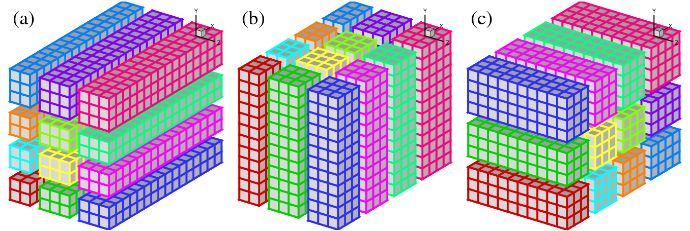

# Introdução

Escrever **bons sistemas distribuídos** é uma tarefa que esbarra em diversos obstáculos, sendo a definição do que é um sistema distribuído e do que é ser "bom" neste contexto sendo nossos primeiros obstáculos.

## O quê são Sistemas Distribuídos?

Para atacarmos a primeira questão e entendermos o que é um Sistema Distribuído, talvez seja mais fácil começar pelo que **não é um sistema não-distribuído**.
Estes são os **sistemas que contém em um único processo toda a lógica de negócio, armazenamento e interface com usuário**, mesmo que sejam divididos em vários módulos e usem diferentes bibliotecas e *frameworks*.
Sejam estes sistemas construído com blocos que se encaixam perfeitamente, disponibilizados basicamente pela biblioteca da linguagem que está utilizando;
ou desenvolvido por times com diversas pessoas e usando bibliotecas de muitos fornecedores diferentes, aumentando consideravelmente a complexidade do desenvolvimento;
o resultado, contudo, continua sendo um artefato só, executado como um único processo, e por isso os denominaremos sistemas **monolítico**.[^centr]

[^centr]: Muitos se referem a sistemas não-distribuídos como **centralizados** mas prefiro reservar este termo para sistemas distribuídos que usam um processo centralizador. 
O termo monolítico também é muito usado em contraposição à arquitetura de micro-serviços, mas sinto que este uso está de acordo com o uso que fazemos aqui.

Sistemas distribuídos são então aqueles separados e dispersos em vários componentes independentes (processos, sensores, atuadores, etc), mas que se coordenam para execução de alguma tarefa.

Vejamos alguns exemplos de tarefas executadas por sistemas distribuídos, que você usa hoje.

* Entregue este email para fulano@knowhere.uni.
* Envie o item I para o endereço E, após cobrança de D dinheiros da conta C.
* Em um ambiente de simulação de batalhas em 3D, simule o disparo de um projétil na direção em que o o avatar está olhando, com velocidade V, enquanto movimenta o avatar A para a esquerda com velocidade W.
* Autorize a transferência de D dinheiros da conta C para a conta C'.
* Movimente o braço mecânico que está segurando um bisturi, 3cm à direita, então abaixe-o 3mm, e movimente-o 4cm para a esquerda
* Inclua o comentário ``LOL!!!'' na lista de comentários do item XYZ, com marca de tempo T
* Leia o valor do sensor de temperatura T e, caso seu valor supere V, emita alarme luminoso vermelho intermitente e alarme sonoro

Fica claro por estes exemplos que há **comunicação entre diversos componentes**, por exemplo o console de videogame e um serviço que mantem uma "sala" aberta para um jogo.
Assim, uma possível definição de Sistema Distribuído, que me agrada, é a seguinte:

!!! note "Sistema Distribuído"
    **Coleção** de sistemas computacionais (software ou hardware), **independentes** mas com alguma forma de **comunicação**, que **colaboram** na execução de alguma **tarefa**.

??? info inline end "Componentes"
    * hospedeiro
    * nó

No jargão da área, os componentes independentes são denominados **nós**. 
Frequentemente, cada **nó** do sistema será, na prática, um processo em um computador hospedeiro, um ***host***, para que possa fazer uso de todos os recursos do hospedeiro e, por isso, frequentemente nos referimos ao próprio *host* como o nó.
Contudo, nada impede que possivelmente múltiplos nós possam ser executados em um mesmo *host* ou mesmo que múltiplos *hosts*  virtuais, sejam máquinas virtuais ou containers, executem na mesma máquina física; isso não muda o fato de que os componentes são independentes e poderiam ser distanciados. [^embed]

[^embed]: Escolhemos aqui ignorar o argumento muito plausível de que um algoritmo distribuído poderia ser executado entre, por exemplo, diversos chips em uma mesma placa.

??? info inline end "Comunicação"
    * memória compartilhada
    * mensagens

Quanto à comunicação, **ou** os nós podem **compartilhar um espaço de endereçamento** comum, seja porquê estão co-locados no mesmo hospedeiro ou seja porquê tem acesso a alguma forma de memória compartilhada distribuída, que veremos mais adiante **ou**  também podem se comunicar por **mensagens** trocadas via uma rede de comunicação, como a Internet.

Quanto à tarefa em comum, veja o seguinte exemplo, em que vários clientes trocam emails por meio de uma máquina com a qual se comunicam para entregar mensagens a serem enviadas e receber mensagens a eles destinadas; enquanto aguardam a entrega, mensagens são armazenadas em um Sistema Gerenciador de Banco de Dados (SGBD) em uma outra máquina, da qual os usuários não tem ciência. 

???info inline end "Dependência"
    * ao colaborarem, criam dependência
    * quando um funciona, outros podem funcionar
    * quando um para, outros param

Neste exemplo, cada celular, o processo que implementa o serviço de email e o servidor de banco de dados, são nós do sistema.
Observe que o nó do serviço de email é responsável por receber os emails e encaminhá-los para o banco em um sentido, bem como ler emails do banco e entregar para os destinatários, no outro.
Observe também que se o banco de dados para de funcionar, o serviço de email passa a ser inútil, uma vez que não pode armazenar novas mensagens e nem recuperar mensagens já armazenadas. 

Neste contexto, uma descrição cínica mas definitivamente realista é a de [Leslie Lamport](https://en.wikipedia.org/wiki/Leslie_Lamport), que certa vez disse:
> A distributed system is one in which the failure of a computer you didn't even know existed can render your own computer unusable.

Lamport está correto quanto aos problemas em sistemas distribuídos, e problemas podem se manifestar em diversas formas. Por exemplo, mesmo que um computador não pare, se ele ficar lento ou se o canal de comunicação não for confiável, uma aplicação crítica poderia ser inviabilizada, como no exemplo de telecirurgia acima.
Algumas aplicações, contudo, aparentemente conseguem superar estes obstáculos.
Pensemos em algumas aplicações distribuídas com as quais interagimos todos os dias e que, por seu sucesso, devem ser bons sistemas distribuídos.
Alguns exemplos óbvios são [Amazon.com](https://www.amazon.com), [Facebook](https://www.facebook.com), e [GMail](https://www.gmail.com).

Estes sistemas rodam em grandes *data centers* com [milhares de máquinas](https://youtu.be/D77WDo881Pc), estando constantemente sujeitos a fontes queimadas, discos corruptos, memórias defeituosas, etc.[^failures]  
Apesar disto, dificilmente estes serviços são reportados como fora do ar, são altamente responsíveis e, goste ou não do que fazem, são bem sucedidos porquê cumprem bem suas tarefas.
Assim, digamos que um sistema computacional é **bom** se está funcional a **maior parte do tempo**, com **bom desempenho** e é de **baixo custo**.
Observe que estar sempre funcional implica em continuar provendo o serviço mesmo que partes do sistema estejam com problemas, que ter bom desempenho implica que  respostas "rápidas" são dadas para o usuário, e que baixo custo implica em não gastar mais que o necessário para realizar a tarefa para a qual foi construído.

[^failures]: [What Can We Learn from Four Years of Data Center Hardware Failures?](http://people.iiis.tsinghua.edu.cn/~weixu/Krvdro9c/dsn17-wang.pdf)

??? info inline end "Um "bom" sistema"
     * Disponível: 
        * Sempre funcional
     * Poder computacional:
         * Capacidade de processamento
         * Capacidade de armazenamento
         * Baixa latência
     * Baixo custo
         * Tamanho apropriado à tarefa

Enquanto subjetiva, nossa definição de **bom** nos permite estabelecer um pano de fundo para delinear as **dificuldades** de se implementar sistemas distribuídos.
Como veremos adiante, os **requisitos** para um bom sistema distribuído são **conflitantes** e difíceis, às vezes impossíveis, de se alcançar. 
Mas se esta é a realidade da programação distribuída, por quê fazê-lo? A resposta tem a ver com a **colaboração**, na definição.

## Por quê desenvolvemos sistemas distribuídos?

A primeira razão é o fato é que computadores individuais tem capacidade reduzida de processamento e armazenamento, mas nossa necessidade de poder computacional cresce exponencialmente.

{: style="max-width:500px"}

Assim, precisamos crescer nosso poder computacional, mas aumentar a capacidade de um dispositivo (**scale up** ou **vertical scaling**), mesmo de forma linear, tem custo exponencial.

{: style="max-width:300px"}

O que nos resta então é agregar o poder computacional de diversos computadores "baratos" (**scale out** ou **horizontal scaling**) para satisfazer nossas necessidades.[^scaling]

[^scaling]: Mesmo que o custo não fosse um problema, seria impossível implementar *scale up* funcionalmente além de um certo limite, pois o computador teria que ser tão grande que suas partes teriam que ser tratadas independentemente, revertendo a um cenário *scale out* custoso demais.

{: style="width:600px"}

Mesmo se pensarmos que a escala com que estes sistemas trabalham deve ser muito diferente daquela dos sistemas que nós desenvolvemos, e portanto as **técnicas** usadas em sua construção devem ser muito distintas do que fazemos, a verdade não poderia ser mais longe disto.
Com a quantidade de informação armazenada a cada acesso a um sítio, a cada produto vendido, ou a cada consulta feita, praticamente qualquer sistema de informação de sucesso necessitará aplicar as técnicas de computação distribuída e superar as mesmas barreiras para conseguir atender ao número crescente de clientes (computacionais ou humanos) e aumentar sua área de cobertura, mesmo que não chegue a escala dos exemplos acima, e melhorar ou manter a qualidade do serviço que presta.

??? info inline end "PQ?"
     * escalabilidade
     * tolerância a falhas

Este último ponto, sobre qualidade do serviço, tem a ver com a capacidade de um sistema se manter no ar a despeito de problemas, isto é, de ser tolerante a faltas.
Tolerância a faltas implica em redundância, em cópias, o que fatidicamente implica em **distribuição** e em Sistemas Distribuídos.
Assim, podemos concluir que as principais razões para se desenvolver sistemas distribuídos são alcançar **escalabilidade** e **tolerância a faltas**, ambas resultantes da **agregação** (correta) do poder computacional de múltiplos componentes.

Uma vez que tenhamos entendido o porquê de desenvolver sistemas distribuídos, vejamos que tipos de sistemas resultam desta abordagem.

## Tipos de Sistemas Distribuídos

Há quem diga que [já somos todos desenvolvedores de sistemas distribuídos](https://devclass.com/2019/08/16/pivotal-cto-kubernetes-means-were-all-distributed-systems-programmers-now/).
Ainda assim, é importante entender que há vários tipos de sistemas distribuídos, com diversas finalidades e diversas arquiteturas, pois classificações nos ajudam a pensar sobre sistemas e a encontrar e reusar soluções previamente testadas e depuradas.

### Sistemas de Computação

A possibilidade de agregar poder de processamento de muitos computadores via uma rede de comunicação com altíssima largura de banda nos permite atacar problemas computacionalmente muito intensos.
***Clusters*** como o da imagem a seguir, do High Performance Computing Center de Stuttgart, são compartilhados por pesquisadores resolvendo problemas de áreas como bio-informática, engenharia, economia e inteligência artificial.

{: style="max-width:500px"}

Na engenharia, por exemplo, HPC pode ser usada para testar a eficiência de projetos sem construir protótipos.

=== "Turbina"
    {: style="max-width:500px"}  

=== "Carro"
    {: style="max-width:500px"}

=== "!?"
    {: style="max-width:500px"}

Os **nós** de um cluster são normalmente divididos em três categorias: administração, computação e armazenamento.
Nós de administração implementam um monitoramento distribuído dos demais nós, servem de ponto de entrada para usuários e provêem interface para submissão de tarefas, como o Torque, que executa sobre o MOAB.

[{: style="max-width:500px"}](https://dccn-hpc-wiki.readthedocs.io/en/latest/docs/cluster_howto/compute_torque.html)

Outro exemplo, o [Oscar](https://github.com/oscar-cluster/oscar) é um conjunto de softwares para gerenciamento de clusters.
Uma das ferramentas inclusas no Oscar é o OpenPBS, pelo qual tarefas são atribuídas aos diversos nós do sistema que estejam alocados para tal tarefa. 
O OpenPBS portanto é também um sistema distribuído.
Finalmente, as tarefas submetidas em si são também aplicações distribuídas em que cada processo executando em uma máquina distinta é responsável por resolver uma parte do problema.

???info inline end "Acoplamento"
    * Forte
    * Fraco

Este tipo de sistemas distribuídos são o que chamamos de **fortemente acoplados** pois há grande dependência dos componentes uns nos outros, tanto na administração quanto na aplicação, e se um dos componentes para de funcionar, normalmente os outros também param.

Um outro tipo de sistema, com a mesma finalidade de atacar problemas que exigem muita computação mas com componentes **fracamente acoplados**, são as [grades computacionais](https://en.wikipedia.org/wiki/Grid_computing). 
Muito usadas até meados da década passada, neste arranjo, membros de uma associação disponibilizam capacidade computacional a um *pool*. De lá, os recursos podem ser acessados, seguindo algum critério de gerenciamento, por quaisquer dos membros da associação.
Este modelo surgiu de iniciativas como o [SETI@home](https://en.wikipedia.org/wiki/SETI@home), em que pessoas doavam tempo ocioso do seu computador para analisar sinais de rádio recebidos do espaço. Após o sucesso inicial, a computação foi movida de computadores de voluntários para os de instituições com interesses em comum.

???info inline end "Computação utilitária"
    * Fornecimento sob demanda
    * Pagamento proporcional

As grades computacionais podem ser vistas como precursoras da **computação utilitária**, isto é, o fornecimento de recursos computacionais por provedores em troca de um pagamento **proporcional** à quantidade de recursos utilizados, como no fornecimento de água ou eletricidade.

{: style="max-width:500px"}

A materialização recente da computação utilitária são as nuvens computacionais.
Este tipo de sistema, embora possa ser pensando como infraestrutura para outros sistemas distribuídos, são, na verdade, complexas peças de engenharia, com diversos subsistemas responsáveis por sincronização de relógios, monitoração de falhas, coleta de logs, roteamento eficiente tolerante a falhas, movimentação de recursos virtualizados para consolidação de recursos físicos, armazenamento redundante de dados, etc.

O seguinte vídeo mostra, em 360 graus, um dos *datacenters* do Google, para que você tenha ideia da escala em que estes sistemas são construídos.
Já este outro [sítio](https://www.google.com/about/datacenters/gallery/#/all) apresenta uma viagem fotográfica por alguns *datacenters*.

<iframe width="560" height="315" src="https://www.youtube.com/embed/zDAYZU4A3w0" frameborder="0" allow="accelerometer; autoplay; encrypted-media; gyroscope; picture-in-picture" allowfullscreen></iframe>

### Sistemas de Informação
Provavelmente mais comuns entre os profissionais da computação, os sistemas de informação distribuídos são encontrados em diversas formas. 
De fato, o termo "sistema de informação" é tão abrangente, que dificilmente um sistema distribuído não estaria nesta classe.
Seja como for, o seguinte exemplo é de uma arquitetura em três camadas, onde a primeira implementa a interface com o usuário, a segunda contém a lógica do negócio, e a terceira mantem os dados da aplicação.

Peça fundamental desta abordagem, os bancos de dados na terceira camada são frequentemente distribuídos.
Isto é, um banco em que vários nós mantem os dados e portanto precisam se coordenar para manter os dados consistentes.
A figura a seguir mostra um cenário com três bancos; imagine que em um deles está uma relação com os dados dos clientes, em outro, os dados do estoque e, no terceiro, as ordens de compra. 
Quando um cliente faz um pedido, o cliente deve ser validado no primeiro nó, o item é removido do estoque no segundo, e uma cobrança é disparada para o cliente no terceiro. 
Se qualquer destas três relações não for corretamente consultada e alterada, os efeitos podem ser catastróficos para o negócio ou para o cliente.

Como implementar as famosas propriedades **ACID** neste banco de dados? 
Embora veremos isso um pouco mais para frente neste material, por enquanto, apenas assuma que não é exatamente fácil ou barato. 
Esta dificuldade foi a razão do surgimento dos bancos de dados NOSQL (née NoSQL), dos quais uma pequena amostra é dada pela seguinte figura.
Também discutiremos como estes bancos de dados funcionam, quando falarmos sobre sistemas P2P.

{: style="max-width:500px"}

### Integração de Aplicações

Frequentemente é necessário integrar sistemas de informação legados com sistemas mais modernos, ou simplesmente expô-los usando uma interface mais moderna. Nestes casos, é possível integrar diversos sistemas usando um ***middleware*** que os encapsule.

{: style="max-width:500px"}

Veremos mais adiante o que é um *middleware*; por enquanto, pense nele apenas como um camada de software que se interpõe entre os clientes e um serviço oferecido.
No exemplo, o *middleware* pode, por exemplo, se expor via interface REST para os clientes, mas consultar o sistema legado em um padrão antigo.

Outro exemplo, na imagem seguinte,  é um sistema que agrega subsistemas de diversos departamentos de uma empresa via troca de mensagens.
Observe que nenhum departamento precisa conversar diretamente com os outros, ou mesmo conhecê-los; eles apenas **publicam** a mensagem para quem tiver interesse e aguardam um resposta também na forma de uma mensagem.
Observe que nenhum componente tem que saber da existência do outro ou se torna indisponível caso os outros falhem, o que aumenta a escalabilidade do sistema e sua capacidade de tolerar falhas.

{: style="max-width:500px"}

### Sistemas Pervasivos/Ubíquos
Sistemas ubíquos também são geralmente distribuídos. Segundo Weiser, 1993

> Ubiquitous computing is the method of enhancing computer use by making many computers available throughout the physical environment, but making them effectively invisible to the user.

Assim, sistemas ubíquos aumentam e otimizam a interação do usuário com o ambiente, para que estes foquem-se na tarefa em vez de na ferramenta. Outra forma de se colocar, é que sistemas pervasivos devem ajudar as pessoas a realizar suas tarefas, de forma implícita, sem ter que pensar em como a tarefa será executada.
Para que seja realizada, a computação pervasiva requer que dispositivos **detectem o contexto** em que estão inseridos, **combinem-se** de forma *ad-hoc* e **compartilhem** informações.

!!! example "Exemplos fictícios e reais"

    === "Smart Life" 
        Esta é uma visão futurística da Microsoft para a integração de tecnologias.

        <iframe width="560" height="315" src="https://www.youtube.com/embed/M08fVm6zVyw" frameborder="0" allow="accelerometer; autoplay; encrypted-media; gyroscope; picture-in-picture" allowfullscreen></iframe>

    === "Amazon Go"
        Este mercado automatiza o pagamento dos itens escolhidos pelo consumidor, utilizando técnicas de processamento digital de imagens, aprendizado de máquina e sensores.
        <iframe width="560" height="315" src="https://www.youtube.com/embed/zdbumR6Bhd8" frameborder="0" allow="accelerometer; autoplay; encrypted-media; gyroscope; picture-in-picture" allowfullscreen></iframe>

    === "Reality Check"
        Para quem viu o filme [Minority Report](https://www.imdb.com/title/tt0181689/) e sonhou com as UI do futuro, aqui vai um *reality check*. Para quem não viu ainda, corrija esta falha em sua formação técnica o mais rapidamente possível.
        <iframe width="560" height="315" src="https://www.youtube.com/embed/RJ4KxaWraJc" frameborder="0" allow="accelerometer; autoplay; encrypted-media; gyroscope; picture-in-picture" allowfullscreen></iframe>

###### Redes de Sensores e Internet das Coisas

Eu vou me arriscar colocando Redes de Sensores e Internet das Coisas como uma subsessão de Sistemas Pervasivos.
Isto porquê, a meu ver, as redes de sensores são parte da infraestrutura para se obter sistemas pervasivos; são os sensores que percebem mudanças contexto e "leêm" o estado do contexto atual e alimentam outros sistemas que reagem a tal estado.
A Internet das Coisas (IoT, do inglês *Internet of Things*) vai também na mesma linha, levando à integração entre sensores, atuadores, e outros dispositivos que nos servem, em um ambiente de computação pervasiva.
"Mas se é assim, qual o risco?", você pergunta. Bem, a Internet das Coisas pode ser vista como algo além dos sistemas pervasivos, pois se estes últimos são focados nos humanos em um certo contexto, a IoT[^iot] não necessariamente foca-se nos humanos, mas na realização de alguma tarefa. 
Por exemplo, um sistema de irrigação que percebe o nível de umidade do ar, analisa previsões de chuva e decide em quanto irrigar uma plantação de laranjas provavelmente não se importará com a presença ou não de um humano na plantação.

{: style="max-width:500px"}

!!!example "Alguns exemplos de IoT e redes de sensores"
    * Smart grid e lavadora que escolhe horário
    * Termostatos que percebem movimento
    * Fechaduras que se abrem quando o dono se aproxima
    * Movimentação de tropas e de fauna
    * Índices de poluição
    * Abalos sísmicos e predição de avalanches
    * [link](https://beebom.com/examples-of-internet-of-things-technology/)

###### Uma nota sobre privacidade nos sistemas pervasivos

À medida em que aumentamos o ambiente ao nosso redor ou a nós mesmos com dispositivos computacionais, por um lado facilitamos nossa vida pois somos assistidos por tais dispositivos, mas por outro, nos tornamos cada vez mais dependentes nos mesmos, com sérios riscos à nossa privacidade.
Isto ocorre por que para que realizem suas tarefas, os sistemas pervasivos precisam de cada vez mais informações sobre nós, e há sempre o risco de que estas informações sejam usadas de forma que não nos apetece.

!!!example "Exemplos de *hacking* em IOT"
    * [Hackers Can Access Pacemakers, but Don’t Panic Just Yet](https://www.healthline.com/health-news/are-pacemakers-defibrillators-vulnerable-to-hackers)
    * [Ethical hacker shows us how easily smart devices can be hacked and give access to your personal info](https://www.news5cleveland.com/news/local-news/investigations/ethical-hacker-shows-us-how-easily-smart-devices-can-be-hacked-and-give-access-to-your-personal-info)
    * [Your Roomba May Be Mapping Your Home, Collecting Data That Could Be Shared](https://www.nytimes.com/2017/07/25/technology/roomba-irobot-data-privacy.html).

## Referências

[^log]: [The Log: What every software engineer should know about real-time data's unifying abstraction](https://engineering.linkedin.com/distributed-systems/log-what-every-software-engineer-should-know-about-real-time-datas-unifying)

[^iot]: [Vision and challenges for realising the Internet of things](https://publications.europa.eu/en/publication-detail/-/publication/ed079554-72c3-4b4e-98f3-34d2780c28fc)
