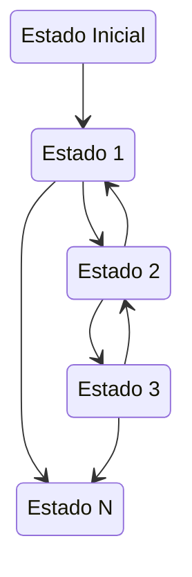
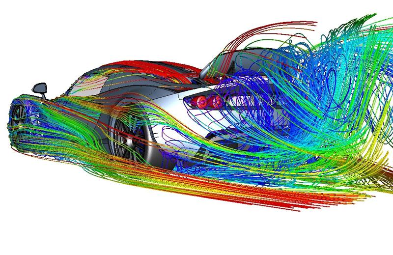
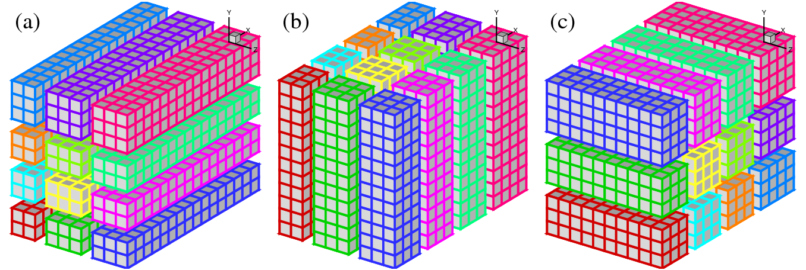
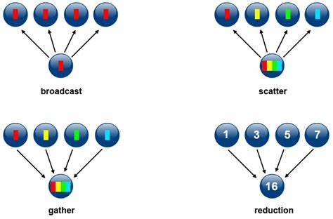
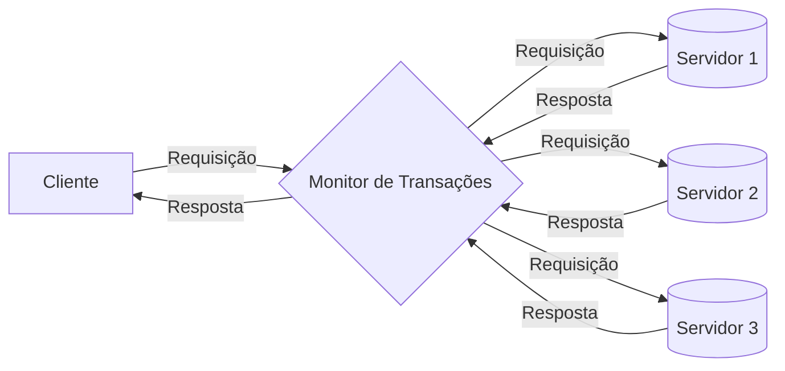
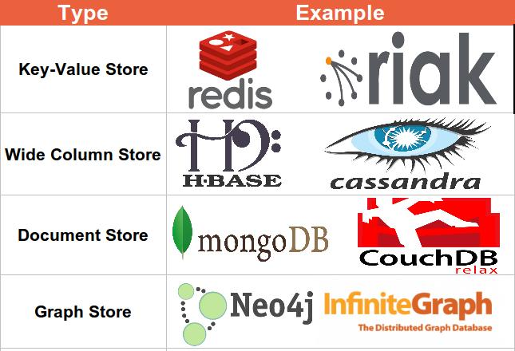
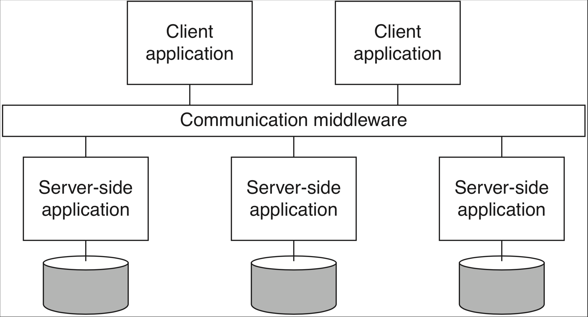
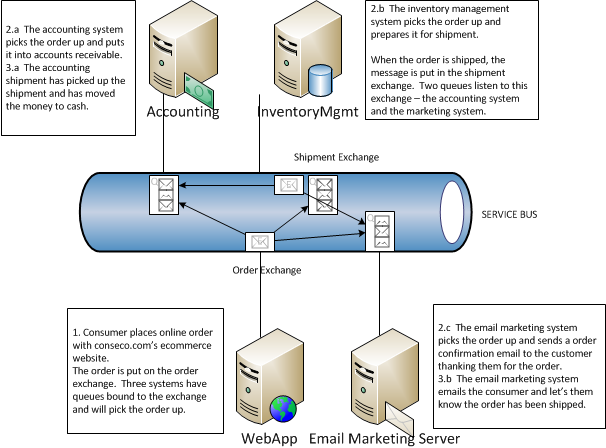

# Introdução

Escrever bons sistemas distribuídos é uma tarefa que esbarra em diversos obstáculos, sendo a definição do que é um sistema distribuído e do que é ser "bom" neste contexto sendo nossos primeiros obstáculos.

## O quê são Sistemas Distribuídos?

    
??? sideslide "Sistemas simples"
     {: style="width:300px"}

Para atacarmos a primeira questão e entendermos o que é um Sistema Distribuído, talvez seja mais fácil começar pelo que não é um sistema não-distribuído.
Estes são os sistemas que contém em um único processo toda a lógica de negócio, armazenamento e interface com usuário, mesmo que sejam divididos em vários módulos e usem diferentes bibliotecas e *frameworks*.
Sejam estes sistemas construído com blocos que se encaixam perfeitamente, disponibilizados basicamente pela biblioteca da linguagem que está utilizando;


??? sideslide "Sistemas não tão simples"
     {: style="width:300px"}

ou desenvolvido por times com diversas pessoas e usando bibliotecas de muitos fornecedores diferentes, aumentando consideravelmente a complexidade do desenvolvimento;
o resultado, contudo, continua sendo um artefato só, executado como um único processo, e por isso os denominaremos sistemas **monolítico**.[^centr]

[^centr]: Neste ponto, devo estressar que muitos se referem a sistemas não-distribuídos como **centralizados** mas preferimos reservar este termo para sistemas distribuídos que usam um processo centralizador. O termo monolítico também é muito usado em contraposição à arquitetura de micro-serviços, mas sentimos que este uso está de acordo com o uso que fazemos aqui.

Programar sistemas distribuídos é dar outro salto em complexidade, pois frequentemente temos que usar peças que não foram pensadas para trabalhar juntas, forçando-nos a usar um pouco de super-cola e arame. 

??? sideslide "Cable hell!"
     {: style="max-width:300px; max-height:150px;"}

Bem, na verdade, em vez de cola usamos *middleware*, como logo discutiremos, e, em vez de arame, usamos cabos de rede, o que é, 
de fato, a principal característica de um sistema distribuído em relação a um não-distribuído: separação e dispersão de suas partes em vários componentes independentes (processos, sensores, atuadores, etc), mas que se coordenam para execução de alguma tarefa.
Vejamos alguns exemplos de tarefas executadas por sistemas distribuídos, que você usa hoje.

* Entregue este email para fulano@knowhere.uni.
* Envie o item I para o endereço E, após cobrança de D dinheiros da conta C.
* Em um ambiente de simulação de batalhas em 3D, simule o disparo de um projétil na direção em que o o avatar está olhando, com velocidade V, enquanto movimenta o avatar A para a esquerda com velocidade W.
* Autorize a transferência de D dinheiros da conta C para a conta C'.
* Movimente o braço mecânico que está segurando um bisturi, 3cm à direita, então abaixe-o 3mm, e movimente-o 4cm para a esquerda
* Inclua o comentário ``LOL!!!'' na lista de comentários do item XYZ, com marca de tempo T
* Leia o valor do sensor de temperatura T e, caso seu valor supere V, emita alarme luminoso vermelho intermitente e alarme sonoro

Fica claro por estes exemplos que há comunicação entre diversos componentes, por exemplo o console de videogame e um serviço que mantem uma "sala" aberta para um jogo.
Assim, uma possível definição de Sistema Distribuído, que me agrada, é a seguinte:

!!! note "Sistema Distribuído"
    **Coleção** de sistemas computacionais (software ou hardware), **independentes** mas com alguma forma de **comunicação**, que **colaboram** na execução de alguma **tarefa**.

??? sideslide "Componentes"
    * hospedeiro
    * nó

No jargão da área, os componentes independentes são denominados **nós**. 
Frequentemente, cada **nó** do sistema será, na prática, um processo em um computador hospedeiro, um ***host***, para que possa fazer uso de todos os recursos do hospedeiro. 
Contudo, nada impede que possivelmente múltiplos nós possam ser executados em um mesmo *host* ou mesmo que múltiplos *hosts*  virtuais, sejam máquinas virtuais ou containers, executem na mesma máquina física; isso não muda o fato de que os componentes são independentes e poderiam ser distanciados. [^embed]

[^embed]: Escolhemos aqui ignorar o argumento muito plausível de que um algoritmo distribuído poderia ser executado entre, por exemplo, diversos chips em uma mesma placa.

??? sideslide "Comunicação"
    * memória compartilhada
    * mensagens

Quanto à comunicação, os nós podem compartilhar um espaço de endereçamento comum, seja porquê estão co-locados no mesmo hospedeiro ou seja porquê tem acesso a alguma forma de memória compartilhada distribuída, que veremos mais adiante.
Eles também podem se comunicar por mensagens trocadas via uma rede de comunicação, como a Internet.

Quanto à tarefa em comum, veja o seguinte exemplo, em que vários clientes trocam emails por meio de uma máquina com a qual se comunicam para entregar mensagens a serem enviadas e receber mensagens a eles destinadas; enquanto aguardam a entrega, mensagens são armazenadas em um Sistema Gerenciador de Banco de Dados (SGBD) em uma outra máquina, da qual os usuários não tem ciência. 


??? sideslide "Dependência"
    * Ao colaborarem, criam dependência
    * Falha pode parar o sistema

Neste exemplo, cada celular é um nó do sistema, assim como o processo responsável por receber os emails e encaminhá-los para o banco, bem como ler do banco e entregar para os destinatários.
Se o banco de dados para de funcionar, o processo na outra máquina passa a ser inútil, uma vez que não pode armazenar novas mensagens e nem recuperar mensagens já armazenadas. 

??? sideslide "Disponibilidade"
    * falhas
    * dependabilidade

Neste contexto, uma definição mais cínica mas definitivamente realista é a de [Leslie Lamport](https://en.wikipedia.org/wiki/Leslie_Lamport), que certa vez disse:
> A distributed system is one in which the failure of a computer you didn't even know existed can render your own computer unusable.

Lamport está correto quanto a problemas em sistemas distribuídos, e problemas podem se manifestar em diversas formas. Por exemplo, mesmo que um computador não pare, se ele ficar lento ou se o canal de comunicação não for confiável, a uma aplicação crítica poderá ser inviabilizada, como no exemplo de tele-cirurgia acima.
Algumas aplicações, contudo, aparentemente conseguem superar estes obstáculos.
Pensemos em algumas aplicações distribuídas com as quais interagimos todos os dias e que, por seu sucesso, devem ser bons sistemas distribuídos.
Alguns exemplos óbvios são [Amazon.com](https://www.amazon.com), [Facebook](https://www.facebook.com), e [GMail](https://www.gmail.com).

Estes sistemas rodam em grandes *data centers* com [milhares de máquinas](https://youtu.be/D77WDo881Pc), estando constantemente sujeitos a fontes queimadas, discos corruptos, memórias defeituosas, etc[^failures]. 
Apesar disto, dificilmente estes serviços são reportados como fora do ar, são altamente responsíveis e, goste ou não do que fazem, são bem sucedidos porquê cumprem bem suas tarefas.
Assim, digamos que um sistema computacional é **bom** se está sempre funcional, com bom desempenho e é de baixo custo.
Observe que estar sempre funcional implica em continuar provendo o serviço mesmo que partes do sistema estejam com problemas; bom desempenho implica que  respostas "rápidas" são dadas para o usuário; baixo custo implica não gastar mais que o necessário para realizar a tarefa para a qual foi construído.

[^failures]: [What Can We Learn from Four Years of Data Center Hardware Failures?](http://people.iiis.tsinghua.edu.cn/~weixu/Krvdro9c/dsn17-wang.pdf)


??? sideslide "Um "bom" sistema"
     * Disponível
         * Falhas
     * Rápido
         * Desempenho
         * Proximidade
     * Barato
         * Tamanho apropriado

Enquanto subjetiva, nossa definição de **bom** nos permite estabelecer um pano de fundo para delinear as dificuldades de se implementar.
Como veremos adiante, os requisitos para um bom sistema distribuído são conflitantes e difíceis, as vezes impossíveis, de serem alcançados. 
Mas se esta é a realidade da programação distribuída, por quê fazê-lo? A resposta tem a ver com a **colaboração**, na definição.

## Por quê desenvolvemos sistemas distribuídos?

A primeira razão é o fato é que computadores individuais tem capacidade reduzida de processamento e armazenamento, mas nossa necessidade de poder computacional cresce exponencialmente.

{: style="max-width:500px"}

Assim, precisamos crescer nosso poder computacional, mas aumentar a capacidade de um dispositivo (**scale up** ou **vertical scaling**), mesmo de forma linear, tem custo exponencial.


{: style="max-width:300px"}

O que nos resta então é agregar o poder computacional de diversos computadores "baratos" (**scale out** ou **horizontal scaling**) para satisfazer nossas necessidades.[^scaling]

[^scaling]: Mesmo que o custo não fosse um problema, seria impossível implementar *scale up* funcionalmente além de um certo limite, pois o computador teria que ser tão grande que suas partes teriam que ser tratadas independentemente, revertendo a um cenário *scale out* custoso demais.

{: style="width:600px"}

Mesmo se pensarmos que a escala com que estes sistemas trabalham deve ser muito diferente daquela dos sistemas que nós desenvolvemos, e portanto as técnicas usadas em sua construção devem ser muito distintas do que fazemos, a verdade não poderia ser mais longe disto.
Com a quantidade de informação armazenada a cada acesso a um sítio, a cada produto vendido, ou a cada consulta feita, praticamente qualquer sistema de informação de sucesso necessitará aplicar as técnicas de computação distribuída e superar as mesmas barreiras para conseguir atender ao número crescente de clientes (computacionais ou humanos) e aumentar sua área de cobertura, mesmo que não chegue a escala dos exemplos acima, e melhorar ou manter a qualidade do serviço que presta.

??? sideslide "PQ?"
     * escalabilidade
     * tolerância a falhas

Este último ponto, sobre qualidade do serviço, tem a ver com a capacidade de um sistema se manter no ar a despeito de problemas, isto é, de ser tolerante a falhas.
Tolerância a falhas implica em redundância, em cópias, o que fatidicamente implica em **distribuição** e em **Sistemas Distribuídos**.
Assim, podemos concluir que as principais razões para se desenvolver sistemas distribuídos são alcançar **escalabilidade** e **tolerância a falhas**, ambas resultantes da **agregação** (correta) do poder computacional de múltiplos componentes.


Mas se não temos alternativas à distribuição, precisamos então entender como podemos implementá-los e quais desafios encontraremos. 
O primeiro desafio é entender o ambiente no qual estão inseridos, suas limitações e fragilidades. 
Isto é, precisamos definir um **modelo computacional**, sabendo que alguns problemas tem soluções triviais ou inexistentes, dependendo do modelo.


### Modelos computacionais

Definido ou identificado o modelo computacional, podemos distribuir nosso sistema, isto é, dividir a computação/armazenamento em diversas máquinas, e coordenar suas ações para que sejam consistentes com a especificação, de forma a minimizar o tempo que o serviço fica fora do ar, entregando o serviço de acordo com expectativas especificadas.
Contudo, antes de implementar esta coordenação precisamos responder a diversas perguntas, por exemplo:

* Qual a probabilidade de um nó parar de funcionar?
* Como os nós se comunicam? Eles compartilham um espaço de endereçamento ou enviam mensagens uns para os outros?
* A quais atrasos a comunicação está sujeita? Pode haver atrasos infinitos?
* A comunicação pode ser corrompida?
* Os relógios dos hospedeiros marcam o mesmo valor no mesmo instante, ou melhor, são sincronizados?
* Há agentes que possam querer perturbar o sistema, por exemplo para ganhar acesso a mais recursos do que seria justo?

??? sideslide "Modelos"
    * Comunicação
    * Sincronismo
    * Falhas

Estas perguntas são, normalmente, divididos em três eixos: **Comunicação**, **Sincronismo** e **Falhas**.

#### Comunicação
De uma forma ou de outra, sistemas distribuídos tem à sua disposição múltiplos processadores e permitem o desenvolvimento de aplicações paralelas, isto é, onde múltiplas tarefas são executadas ao mesmo tempo ou paralelamente.
Contudo, por um lado, quando falamos em sistemas multiprocessados, normalmente estamos falando de sistemas em que os processadores estão **próximos** e compartilham um mesmo espaço de endereçamento, sejam computadores com múltiplos processadores ou sejam clusters de computadores que abstraiam múltiplos segmentos de memória como um único espaço de endereçamento via uma abstração de memória compartilhada distribuída. 
Seja como for, estes sistemas com **memória compartilhada** são normalmente usados para aplicações de computação intensiva e em cujo os componentes são mais **fortemente acoplados** e melhor estudados em um curso de computação paralela.

???todo "TODO"
    * Imagem shared memory
    * diagrama de Venn (Shared memory [ distributed shared memory  ) Distributed systems ] 

??? sideslide "Comunicação"
    * memória compartilhada
    * troca de mensagens

Por outro lado, estamos mais interessados aqui em sistemas de maior escala geográfica, o que se adequa melhor ao modelo de troca de mensagens, isto é, onde cada nó mantem controle total do seu espaço de endereçamento e só expõe seu estado via mensagens enviadas para os outros nós.
Este modelo é mais adequado ao desenvolvimento de aplicações com componentes **fracamente acoplados**, em que atrasos de comunicação e ocorrência de falhas independentes são intrínsecas.

???todo "TODO"
    * Imagem message passing
    * conectividade


#### Sincronismo

??? sideslide "Sincronismo"
    * operações
    * comunicação
    * relógio
    * sincronização

Quanto ao sincronismo, considera-se os limites de tempo para execução de operações, para troca de mensagens ou acesso à memória compartilhada (dependendo do modelo de comunicação), se os nós tem acesso a relógios para medição de passagem do tempo e quão acurazes este são e, finalmente, o quão sincronizados são estes relógios. 


#### Falhas

Quanto às falhas, primeiro é preciso aceitar o fato de que componentes independentes podem falhar independentemente e que quanto mais computadores, maior é a probabilidade de que pelo menos um deles tenha uma CPU, disco, fonte, ou que quer que seja, falhando; e estejam certos, **computadores [falham](https://www.statista.com/statistics/430769/annual-failure-rates-of-servers/) o tempo todo!**.
Isto é importante pois se em sistemas monolíticos uma falha pode facilmente fazer com que o sistema todo pare e, portanto, não tente progredir na ausência de um componente, em um sistema distribuído queremos exatamente o contrário, isto é, que apesar da falha de um componente, os outros continuem prestando o serviço, mesmo de forma deteriorada e sem comprometer a corretude do sistema.

??? sideslide "Falhas"
    * detectável
    * temporização
    * quebras
    * maliciosas
    * perda e corrupção de mensagens

Para lidar com falhas, precisamos entender quais são suas possíveis formas, isto é, se o levam componentes falhos a parar de funcionar totalmente e de forma identificável por outros ou não, se há falhas "maliciosas", se os limites de tempo estabelecidos acima podem ser violados, se mensagens podem ser perdidas ou corrompidas.

#### Outros fatores

??? sideslide "Outros"
    * carga de trabalho

Embora modelos clássicos sejam normalmente definidos em termos dos fatores acima, outras questões são também importantes, como o padrão da carga de trabalho do sistema (maior carga à noite? Na hora do almoço? *Black friday*?)


## Como desenvolvemos Sistemas Distribuídos?

Uma vez definido o **modelo computacional** e identificado os **algoritmos adequados** aos problemas que queremos resolver, passamos à implementação.
Distribuir é **dividir** a computação/armazenamento em diversos componentes, **possivelmente geograficamente distantes**, e **coordenar** suas ações para que resolvam a tarefa em questão de forma correta.
Com a distribuição objetiva-se **usar recursos** disponíveis nos hosts onde os componentes são executados[^recursos] e usar de **redundância** para garantir que o serviço sofra **degradação graciosa** em caso de falhas, ou seja, fazer com que o serviço continue funcionando, mesmo que com **vazão** reduzida, **latência** aumentada, menor capacidade de tratamento de requisições concorrentes, ou com  **funcionalidades** desabilitadas.

[^recursos]: Os recursos compartilhados vão desde alguns óbvios, como **capacidade de armazenamento** e de **processamento**, a própria **localização** de um nó, que pode ser geograficamente mais próxima e de menor latência até  um ponto de interesse, ou até mesmo a disponibilidade de uma conexão física com um recurso especial, como uma impressora.

Para colaborar, as diversas partes do sistema distribuído devem se comunicar, o que pode pode ser feito de diversas formas e em diversos níveis de abstração. Por exemplo, no caso troca de mensagens, estas podem ser desde pacotes de bytes entregues pelo IP/UDP como por **troca de mensagens** ordenadas, **fluxos de dados**, ou **invocação remota de procedimentos**.
Implementar estas abstrações em si já é uma tarefa complicada, pois é preciso levar em consideração que os componentes de um sistema distribuído **falham independentemente**, executam em *hosts*  com **relógios dessincronizados**, são desenvolvidos usando-se **linguagens diversas**, **sistemas operacionais distintos**, com **arquiteturas diferentes** e por **times independentes**.

Apesar de tantas variáveis, as abstrações precisam permitir que as aplicações que as usem possam se coordenar nos mínimos detalhes. 
Quero dizer, a complexidade de se implementar estas abstrações já é grande por si só e se formos reinventar a roda a cada novo sistema, não faremos muitos avanços.
Mas, como vocês bem sabem, camadas de abstração são a chave para se lidar com complexidade.
Assim, sistemas distribuídos são como cebolas, cheias de camadas e que nos fazem chorar quando precisamos manipulá-las.[^ogros]
Felizmente, para cada problema que tenha que resolver, há uma boa probabilidade de que alguém já o tenha atacado e disponibilizado uma solução, de forma comercial ou não.
Com sistemas distribuídos, não é diferente, e no caso da comunicação entre componentes distribuídos, a solução normalmente é usar um **middleware**.

[^ogros]: Lembrem-se que também  e você não quer que seu sistema seja como ogros, temperamentais e mal-cheirosos. Logo, planeje bem suas camadas de abstração.


### Middleware

??? sideslide "Middleware"
    * software
    * hardware/OS
    * aplicação
    * diversas funcionalidades

De acordo com [Tanenbaum & Van Steen](https://www.amazon.com/Distributed-Systems-Principles-Paradigms-Tanenbaum-dp-B00DEKA7T2/dp/B00DEKA7T2/ref=mt_hardcover?_encoding=UTF8&me=&qid=), *middleware* é 
> ... the software layer that lies between the operating system and applications on each side of a distributed computing system in a network.

Isto é, o *middleware* é a camada *ware* que fica no *middle*, entre, o *software* e o *hardware*. 
Software, no caso, é a aplicação distribuída sendo desenvolvida e hardware é a **abstração** do *host* em que se executam os componentes, provida pelo sistema operacional.
Uso aqui o termo **abstração** porquê o sistema operacional pode encapsular *hardware* real, mas também pode encapsular outra abstração de *hardware*, por exemplo, uma máquina virtual ou contêiner.

A figura seguinte   mostra um exemplo com três aplicações executando sobre um *middleware*, que por sua vez é executado sobre diferentes sistemas operacionais, em *hosts*  conectados por uma rede de comunicação. 


{: style="width:500px"}[^0101]

[^0101]: Distributed Systems: Principles and Paradigms. Capítulo 1, Figura 1.

Com este cenário em mente, é importante entender o que diz [Sacha Krakowiak](https://web.archive.org/web/20050507151935/http://middleware.objectweb.org/) quando afirma que as principais funções do *middleware* são:

* esconder a distribuição e o fato de que um aplicação é geralmente composta por múltiplas partes, executando em localizações geograficamente distintas,
* esconder a heterogeneidade dos vários componentes de hardware, sistemas operacionais e protocolos de comunicação
* prover interfaces uniformes, de alto nível e padronizadas para os desenvolvedores de aplicação e integradores, de forma que aplicações possam ser facilmente compostas, reusadas, portadas e feitas interoperáveis.


Assim, os *middleware* facilitam a conexão entre componentes e permitem o uso de protocolos mais abstratos que as operações de  `write(byte[])` e `read(): byte[]` dos protocolos de baixo nível, escondendo a complexidade da coordenação de sistemas independentes.
Desenvolver sistemas distribuídos sem usar um *middleware* é como desenvolver um aplicativo sem usar quaisquer bibliotecas: possível, mas complicado, e estará certamente reinventando a roda. Isto é, você praticamente tem que refazer o *middleware* antes de desenvolver o sistema em si.

Idealmente, com o *middleware*, o desenvolvedor conseguiria facilmente implementar uma aplicação em que a distribuição fosse totalmente transparente, levando o sistema, uma coleção de sistemas computacionais (software ou hardware) independentes, a se apresentar para o usuário como **um sistema único**, monolítico.
Pense no browser e na WWW, por exemplo: o quanto você sabe sobre as páginas estarem particionadas em milhões de servidores? Isso é o que chamamos de **transparência**.

#### Transparência

??? sideslide "Transparência Total"
    Acesso + Localização + Relocação + Migração + Replicação + Falha

Se não há qualquer indício de que a aplicação é distribuída, então temos **transparência total**.  
Podemos quebrar esta transparência total em várias transparências mais simples: **Acesso**, **Localização**, **Relocação**,
**Migração**, **Replicação**, e **Falha**.
Vejamos cada uma destas separadamente.

##### Transparência de Acesso

??? sideslide "Transparência de Acesso"
    * como se apresenta
    * representação de dados
        * arquitetura
        * OS
        * linguagem
    * padrões abertos e bem conhecidos.

A transparência de acesso diz respeito à representação de dados e mecanismos de invocação (arquitetura, formatos, linguagens...).
Cada computador tem uma arquitetura e uma forma de representar seus dados. Por exemplo, considere os padrões para representação de números em ponto flutuante IEEE e IBM. Ambos dividem os bits em sinal, expoente e mantissa, mas com tamanhos diferentes.

!!!note "IEEE[^IEEEFP]"

     Precisão | Tamanho total (bits) | Sinal (bits) | Expoente (bits) | Mantissa (bits)
    :--------:|:--------------------:|:------------:|:---------------:|:--------------:
     Half | 16 | 1 | 5 | 10 
     Single | 32 | 1 | 8 | 23
     Double | 64 | 1 | 11 | 52
     Quadruple | 128 | 1 | 15 | 112

!!! note "IBM[^IBMFP]"

     Precisão | Tamanho total (bits) | Sinal (bits) | Expoente (bits) | Mantissa (bits)
    :--------:|:--------------------:|:------------:|:---------------:|:--------------:
     Single | 32 | 1 | 7 | 24
     Double | 64 | 1 | 7 | 56
     Quadruple | 128 | 1 | 7 | 112 (8b ignorados)

[^IEEEFP]: [IEEE Floating Point](https://www.tutorialspoint.com/fixed-point-and-floating-point-number-representations)
[^IBMFP]: [IBM Floating Point](https://en.wikipedia.org/wiki/IBM_hexadecimal_floating_point#Single-precision_32-bit)

E se dois componentes de um SD executam em máquinas com arquiteturas diferentes, como trocam números em ponto flutuante?
É preciso que usem um padrão conhecido por ambos os *hosts*, seja o padrão a arquitetura "nativa" do host ou um padrão intermediário, definido pelo *middleware*.

A mesma questão é válida para representações de strings e classes, e diferenças de sistemas operacionais e linguagens.
No caso específico das strings, pense em um programa escrito em linguagem C e que este programa deva comunicar-se com um outro, escrito em Java, e trocar strings com o mesmo.
Enquanto em C uma string é uma sequência de bytes imprimíveis terminadas por um `\0`, em Java uma string é uma classe que encapsula uma sequência de chars, sendo que cada [char é um código 16 bits](https://docs.oracle.com/javase/8/docs/technotes/guides/intl/overview.html) representativo de um código Unicode[^stringjava].
Como transferir strings entre duas plataformas?  Não fazê-lo? Simplificar a string Java?  Estender a string C?  
Para se tentar obter transparência de acesso, é importante que se use **padrões** implementados em múltiplas arquiteturas, **abertos**  e bem conhecidos, com **interfaces bem definidas**.

[^stringjava]: Simplificações são possíveis, mas introduzem outras complexidades.


##### Transparência de Localização

??? sideslide "Transparência de localização"
    * onde está o objeto
    * latência
        * cache
        * paralelismo
        * programação assíncrona
        * arquiteturas reativas

A transparência de localização diz respeito a onde está o objeto acessado pela aplicação, seja um BD, página Web ou serviço de echo: pouco importa ao usuário, se está dentro da mesma máquina de onde executa o acesso, se na sala ao lado ou em um servidor do outro lado do globo, desde que o serviço seja provido de forma rápida e confiável.
A esta transparência é essencial uma boa distribuição do serviço, sobre uma rede com baixa latência, ou o uso de técnicas que permitam esconder a latência.

###### Escondendo a Latência

Para se esconder a latência, várias táticas são utilizáveis:

* *Caching* de dados
    * Em vez de sempre buscar os dados no servidor, mantenha cópias locais dos dados que mudam menos (e.g., o CSS do *stack overflow*).
* Use paralelismo
    * Em vez de validar formulário após preenchimento de cada campo, valide em paralelo enquanto usuário preenche o campo seguinte.
    * Use *callbacks* para indicar campos com problemas a serem corrigidos.
    * Saiba que nem todo problema é paralelizável, por exemplo, autenticação
* Use programação assíncrona
    * AsyncIO
    * C# [await/async](https://docs.microsoft.com/en-us/dotnet/csharp/async)
    * [Futures e Promises](https://en.wikipedia.org/wiki/Futures_and_promises)

Outra forma de diminuir latência é trazer para próximo do usuário parte da computação.
Isto é comumente feito com a interface com usuário,  mas pode ser usado também para outras partes do sistema. 
Como exemplo do primeiro, pense em consoles de video-game que fazem o processamento gráfico pesado de jogos online na casa do usuário[^stadia].
Como exemplo do segundo, pense em aplicativos que mantém os dados em celulares até que uma boa conexão, por exemplo WiFi, esteja disponível para sincronizar com o servidor.

[^stadia]: O [Google stadia](https://stadia.google.com/) é uma plataforma de jogos que vai na contramão desta ideia, levando todo o processamento pesado para a nuvem.

De forma geral, pense em esconder latência pelos seguintes passos:

* Distribua tarefas
  * Delegue computação aos clientes (e.g., JavaScript e Applets Java)
  * Particione dados entre servidores (e.g., Domain Name Service e World Wide Web) para dividir a carga e aumentar a vazão
* Aproxime dados dos clientes
  * Mantenha cópias de dados em múltiplos lugares.
  * Atualize dados de acordo com necessidade (e.g., cache do navegador, com código do google.com sendo atualizado a cada 4 dias)


##### Transparência de Relocação

??? sideslide "Transparência de relocação"
    * como se movimenta
    * visto por clientes

As vezes componentes do sistema distribuído precisam ser movimentados de uma localização à outra, por exemplo porquê um novo *host* foi contratado.
Se implementadas corretamente, as técnicas que entregam transparência de localização não deixam que o cliente perceba a movimentação, no que chamamos transparência de Relocação.

* Rede de baixa latência
* Distribuição inteligente
    * E.g: Serviços de nome
* Múltiplas cópias
    * Cópias temporárias


##### Transparência de Migração

??? sideslide "Transparência de migração"
    * como se movimenta
    * visto por si mesmo

Do ponto de vista do próprio serviço, não perceber que se está sendo movimentado é chamado transparência de Migração.
Um serviço com esta propriedade, não precisa ser parado e reconfigurado quando a mudança acontece.
Uma das formas de se implementar esta propriedade é através da migração provida por máquinas virtuais, usado, por exemplo, para consolidar o uso de servidores em nuvens computacionais.
Veja o exemplo do VMotion da VMware.


Na verdade, a movimentação neste cenário, é uma cópia da máquina virtual. Uma vez que a cópia esteja próxima do fim, a imagem original é congelada, a cópia concluída, e há um chaveamento na rede para se direcionar toda comunicação para nova cópia. O máquina original é então descartada.

##### Transparência de Replicação

??? sideslide "Transparência de replicação"
    * redundância
    * visto por clientes

A capacidade de ter cópias de um serviço e de direcionar trabalho de uma para outra é também útil para se obter transparência no caso de falhas.
Isto porquê para se manter um serviço funcional a despeito de falhas, é preciso ter múltiplas cópias, prontas para funcionar a qualquer momento.

Dependendo das garantias desejadas na manutenção da **consistência** entre as cópias, o custo pode variar muito, de forma que para se ter um custo menor, tem-se garantias mais fracas, por exemplo, que as réplicas tem um **atraso** entre elas de no máximo $X$ minutos. Este é um dilema parecido com o TCP x UDP, em que mais garantias implicam em maior custo de comunicação.

Algumas aplicações toleram inconsistências e podem viver com menores custos. Um exemplo famoso é o dos "carrinhos de compra" da [Amazon.com](https://www.allthingsdistributed.com/2008/12/eventually_consistent.html), que podem fechar pedidos com conteúdo diferente do desejado pelo cliente.

Outras aplicações são normalmente construídas com requisitos de consistência forte entre as réplicas, como sistemas financeiros.
Para estas aplicações, uma técnica importante para se conseguir replicação é o uso de *frameworks* de **comunicação em grupo**, que entregam para múltiplas instâncias de um mesmo serviço, as mesmas mensagens, permitindo que elas se mantenham como cópias.
Esta técnica funciona se os serviços forem máquinas de estado determinísticas, que consideram como eventos as mensagens entregues pelo protocolo de comunicação em grupo e é denominada [**replicação de máquinas de estado**](https://en.wikipedia.org/wiki/State_machine_replication).

??? sideslide "Replicação de Máquina de Estados"
    * determinística
    * mesmo estado inicial
    * mesmos eventos
    * mesmo estado final
    * atraso entre réplicas



??? todo
    Figura com state machine replication

Novamente é preciso chamar à atenção a questão dos custos desta técnica.
Replicação de Máquinas de Estados é muito custosa e por isso faz-se um esforço para não utilizá-la ou para utilizá-la em "cantinhos" do sistema onde inconsistências são absolutamente caras demais para sere permitidas.
Isto porquê manter múltiplas cópias $\Rightarrow$ sincronização $\Rightarrow$ custos. 
Se houver mudanças frequentes nos dados, tal custo precisa ser pago também frequentemente.
Mitigações incluem uso de réplicas temporárias, protocolos de invalidação de cache, contratação de redes com mais largura de banda  e menor latência, sendo que estes últimos esbarram em limitações financeiras e físicas.


##### Transparência de Concorrência

??? sideslide "Transparência de concorrência"
    * obliviedade a outros serviços
    * visto por clientes

Outra transparência almejável é de concorrência, isto é, imperceptibilidade quanto ao fato de que o serviço está executando concorrentemente a outros serviços e sendo acessado por outros clientes.
Isto é importante tanto em termos de segurança, no sentido de que um cliente não deveria acessar os dados do outro, caso isso seja um requisito do sistema, quanto tem termos de desempenho.
Nuvens computacionais são um exemplo de onde este tipo de transparência é essencial.

Considere um serviço de banco de dados em uma nuvem qualquer. Para prover a mesma interface com a qual usuários estão acostumados a anos, é possível que este serviço seja simplesmente um *wrapper* ao redor do SGBD que se comprava e instalava *in-house* anteriormente.
Para se tornar viável, contudo, uma mesma instância deve servir múltiplos clientes, os *tenants*, sem que a carga de trabalho introduzida por um, interfira no desempenho do outro. No meio, chamamos esta propriedade de *multi-tenancy*, mas é apenas um exemplo de transparência de concorrência.

* 


Esta transparência está fundamentalmente ligada à escalabilidade, isto é, à adequação dos *pool* de recursos às demandas dos clientes: se mais clientes estão presentes, então aumente a quantidade de servidores (*scale up*) e separe as cargas (*sharding*); se menos clientes estão presentes, então desligue algumas máquinas (*scale down*) e consolide recursos.

##### Desafios para se obter transparência

Apesar de desejáveis, as transparência discutidas são difíceis de se conseguir, principalmente se em conjunto.
Isto porquê, do **ponto de vista de usuários** espalhados pelo globo, atrás de redes heterogêneas e com possibilidade de erros, acontecerão atrasos e perdas na comunicação, denunciando a distribuição.

Do **ponto de vista do desenvolvedor**, é preciso tomar decisões baseado em premissas ligadas à realidade da rede. Por exemplo, se uma requisição não foi respondida, quanto tempo um cliente deve esperar antes de reenviá-la, possivelmente para outro servidor, sem incorrer em risco significativo da requisição ser processada duas vezes? A resposta para esta pergunta é muito mais complicada do que pode parecer.

**De forma geral**, qualquer aumento de transparência tem um custo, seja em termos monetários (e.g., contratação de enlace dedicado ou de *host* em outra posição geográfica), ou em termos de desempenho (e.g., coordenar a entrega de mensagens em sistemas de comunicação em grupo).

Provavelmente os maiores obstáculos para se alcançar os diversos tipos de  transparência são impostos pela parte da infraestrutura que torna o sistema distribuído possível, a rede.
Para entender o porquê, vejamos algumas premissas normalmente assumidas sobre a rede que não são, definitivamente, verdade:

* A latência é zero.
* A largura de banda é infinita.
* A rede é confiável.
* A rede é segura.
* A rede é homogênea.
* A rede é estática.
* A rede tem acesso grátis.
* A rede é administrada por você ou alguém acessível.


## Tipos

Há quem diga que [já somos todos desenvolvedores de sistemas distribuídos](https://devclass.com/2019/08/16/pivotal-cto-kubernetes-means-were-all-distributed-systems-programmers-now/).
Ainda assim, é importante entender que há vários tipos de sistemas distribuídos, com diversas finalidades e diversas as arquiteturas, pois classificações nos ajudam a pensar sobre sistemas e a encontrar e reusar soluções previamente testadas. 

### Computação de Alto Desempenho

A possibilidade de agregar poder de processamento de muitos computadores em um rede de comunicação com altíssima largura de banda nos permite atacar problemas computacionalmente muito intensos
Clusters como o da imagem a seguir, do High Performance Computing Center de Stuttgart, são compartilhados por pesquisadores resolvendo problemas áreas como bio-informática, engenharia, economia, inteligência artificial, etc.


Na engenharia, por exemplo, HPC pode ser usada para testar a eficiência de projetos sem construir protótipos, seja

* de uma turbina  
 
* um carro  
 
* ou uma vaca  
 

Os **nós** de um cluster são normalmente divididos em três categorias: administração, computação e armazenamento.
Nós de administração implementam um monitoramento distribuído dos demais nós, servem de ponto de entrada para usuários e provêem interface para submissão de tarefas.
O [Oscar](https://github.com/oscar-cluster/oscar), por exemplo, é uma é conjunto de softwares para gerenciamento de clusters.
Uma das ferramentas inclusas no Oscar é o OpenPBS, pelo qual tarefas são atribuídas aos diversos nós do sistema que sejam alocados para tal tarefa. O OpenPBS portanto é também um sistema distribuído.
Finalmente, as tarefas submetidas em si são normalmente aplicações distribuídas. Cada processo executando em uma máquina distinta é normalmente responsável por resolver uma parte do problema.



Para facilitar a comunicação entre as partes do domínio, são normalmente utilizadas API como a Message Passing Interface (MPI), que provê funções para distribuição e agregação de dados entre os vários processos.
A função broadcast, por exemplo, envia o mesmo conteúdo para diversos destinatários e a função scatter particiona o dado de acordo com o número de destinatários e envia uma parcela para cada um.




Este tipo de sistemas distribuídos são o que chamamos de fortemente acoplados pois a falha em um dos componentes leva normalmente à falha de todo o sistema.
Do ponto de vista deste curso, estamos mais interessados em sistemas fracamente acoplados.


### Sistemas de Informação

Provavelmente mais comuns entre os profissionais da computação, os sistemas de informação distribuídos são encontrados em diversas formas. De fato, o termo "sistema de informação" é tão abrangente, que dificilmente um sistema distribuído não estaria nesta classe.
O seguinte é um exemplo de uma arquitetura em três camadas, onde a primeira implementa a interface com o usuário, a segunda contém a lógica do negócio, e a terceira mantem os dados.

[](https://en.wikipedia.org/wiki/Multitier_architecture)

Peça fundamental desta abordagem, os bancos de dados na terceira camada são frequentemente transacionais.
Isto é, eles provêem as garantias na execução de transações conhecidas como propriedades ACID.

!!!note "ACID"
    * Atomicidade: transações são tratadas de forma indivisível, isto é, ou tudo ou nada.
    * Consistência: transações levam banco de um estado consistente a outro. E.g., `x == 2*y`
    * Isolamento: transações não vêem dados não comitados umas das outras.
    * Durabilidade: os efeitos de uma transação comitada devem persistir no sistema a despeito de falhas.


Para relembrar no que implica ACID, considere a seguinte sequência de operações, onde X e Y são valores guardados pelo banco de dados, a, b e c são variáveis definidas no programa, e SELECT e SET são comandos para ler e modificar o banco de dados.

```
1: a = SELECT X
2: c = a * 2
3: b = c + 10
4: SET X=c
5: SET Y=b
```
Suponha duas instâncias desta sequência, $T_1$ e $T_2$, concorrentes, em que as operações escalonadas da seguinte forma.

```
   T1                T2
1: a = SELECT X
2: c = a * 2
3: b = c + 10
4: SET X=c
5:                    a = SELECT X
6:                    c = a * 2
7:                    b = c + 10
8:                    SET X=c
9:                    SET Y=b
10:SET Y=b
```

Ao final da execução, X terá o valor atribuído por $T_2$, mas $Y$ terá o valor de $T_1$. 
Este escalonamento violou a **consistência** do banco de dados por quê as operações não foram executadas **isoladamente**.

Tente imaginar a dificuldade de se implementar um banco de dados distribuído. 
Isto é, um banco em que vários nós mantem os dados, participam de transações e, portanto, precisam coordenar-se para manter os dados consistentes. 
A figura a seguir mostra um cenário com três bancos. 
Imagine que em um deles está uma relação com os dados dos clientes, em outro, os dados do estoque e no terceiro as ordens de compra. 
Quando um cliente faz um pedido, o cliente deve ser validado no primeiro nó, o item é removido do estoque no segundo nó, e no terceiro é disparada uma cobrança para o cliente. 
Se qualquer destas três relações não for corretamente consultada e alterada, os efeitos podem ser catastróficos para o negócio ou para o cliente.



Como implementar ACID neste banco de dados? 
Embora veremos isso um pouco mais para frente neste material, por enquanto, apenas assuma que não é exatamente fácil ou barato. 
Esta dificuldade foi a razão do surgimento dos bancos de dados NOSQL (née NoSQL), dos quais uma pequena amostra é dada pela seguinte figura.
Tambem discutiremos como estes bancos de dados funcionam, quando falarmos sobre sistemas P2P.





### Integração de Aplicações

Frequentemente é necessário integrar sistemas de informação legados com sistemas mais modernos, ou simplesmente expô-los usando uma interface mais moderna. Nestes casos, é possível integrar diversos sistemas usando um *middleware* que os encapsule.



O *middleware* pode, por exemplo, se expor via interface REST para os clientes, mas consultar o sistema legado em um padrão antigo.

Outro exemplo é o sistema na imagem seguinte, que mostra diversos departamentos de uma empresa conversando via troca de mensagens. 
Observe que nenhum departamento precisa conversar diretamente com os outros, ou mesmo conhecê-los. 
Eles apenas publicam a mensagem para quem puder tratar. 
Da mesma forma, a resposta vem na forma de uma mensagem.




Este é um exemplo de sistema **fracamente acoplado**, pois nenhum componente tem que saber da existência do outro ou se torna indisponível caso os outros falhem.


Siga este [link](https://engineering.linkedin.com/distributed-systems/log-what-every-software-engineer-should-know-about-real-time-datas-unifying) para ler mais sobre este tipo de sistema.

### Sistemas Pervasivos/Ubíquos

Segundo Weiser, 1993
> Ubiquitous computing is the method of enhancing computer use by making many computers available throughout the physical environment, but making them effectively invisible to the user.

O que é importante aqui é o foco na tarefa em vez de na ferramenta. 
Assim, sistemas pervasivos devem ajudar as pessoas a realizar suas tarefas, de forma implícita, sem ter que pensar em como a tarefa será executada.
Para que seja realizada, a computação pervasiva requer que dispositivos **detectem o contexto** em que estão inseridos, **combinem-se** de forma *ad-hoc* e **compartilhem** informações.

!!! example "Exemplos fictícios e reais"

    === "Smart Life" 
        Esta é uma visão futurística da Microsoft para a integração de tecnologias.

        <iframe width="560" height="315" src="https://www.youtube.com/embed/M08fVm6zVyw" frameborder="0" allow="accelerometer; autoplay; encrypted-media; gyroscope; picture-in-picture" allowfullscreen></iframe>

    === "Amazon Go"
        Este mercado automatiza o pagamento dos itens escolhidos pelo consumidor, utilizando técnicas de processamento digital de imagens, aprendizado de máquina e sensores.
        <iframe width="560" height="315" src="https://www.youtube.com/embed/zdbumR6Bhd8" frameborder="0" allow="accelerometer; autoplay; encrypted-media; gyroscope; picture-in-picture" allowfullscreen></iframe>

    === "Reality Check"
        Para quem viu o filme [Minority Report](https://www.imdb.com/title/tt0181689/) e sonhou com as UI do futuro, aqui vai um *reality check*. Para quem não viu ainda, corrija esta falha em sua formação técnica o mais rapidamente possível.
        <iframe width="560" height="315" src="https://www.youtube.com/embed/RJ4KxaWraJc" frameborder="0" allow="accelerometer; autoplay; encrypted-media; gyroscope; picture-in-picture" allowfullscreen></iframe>

#### Redes de Sensores e Internet das Coisas

Eu vou me arriscar colocando Redes de Sensores e Internet das Coisas como uma subsessão de Sistemas Pervasivos.
Isto porquê, a meu ver, as redes de sensores são parte da infraestrutura para se obter sistemas pervasivos; são os sensores que percebem mudanças contexto e "leêm" o estado do contexto atual e alimentam outros sistemas que reagem a tal estado.
A Internet das Coisas (IoT, do inglês *Internet of Things*) vai também na mesma linha, levando à integração entre sensores, atuadores, e outros dispositivos que nos servem, em um ambiente de computação pervasiva.
"Mas se é assim, qual o risco?", você pergunta. Bem, a Internet das Coisas pode ser vista como algo além dos sistemas pervasivos, pois se estes últimos são focados nos humanos em um certo contexto, a IoT não necessariamente foca-se nos humanos, mas na realização de alguma tarefa. 
Por exemplo, um sistema de irrigação que percebe o nível de humidade do ar, analisa previsões de chuva e decide em quanto irrigar uma plantação de laranjas provavelmente não se importará com a presença ou não de um humano na plantação.


Para aprender mais sobre IoT, veja este [link](https://publications.europa.eu/en/publication-detail/-/publication/ed079554-72c3-4b4e-98f3-34d2780c28fc) que descreve diversos projetos europeus na área.


??? todo
    Alguns exemplos de IoT e redes de sensores:

    * Smart grid e lavadora que escolhe horário
    * Termostatos que percebem movimento
    * Fechaduras que se abrem quando o dono se aproxima
    * Movimentação de tropas e de fauna
    * Índices de poluição
    * Abalos sísmicos e predição de avalanches
    * [link](https://beebom.com/examples-of-internet-of-things-technology/)


#### Uma nota sobre privacidade nos sistemas pervasivos

À medida em que aumentamos o ambiente ao nosso redor ou a nós mesmos com dispositivos computacionais, por um lado facilitamos nossa vida pois somos assistidos por tais dispositivos, mas por outro, nos tornamos cada vez mais dependentes nos mesmos, com sérios riscos à nossa privacidade.
Isto ocorre por que para que realizem suas tarefas, os sistemas pervasivos precisam de cada vez mais informações sobre nós, e há sempre o risco de que estas informações sejam usadas de forma que não nos apetece.

??? todo
    Exemplos de problemas de privacidade.

    * [Roomba mapeando sua casa](https://www.nytimes.com/2017/07/25/technology/roomba-irobot-data-privacy.html).
    * Ghost in the shell
    * Snow crash

### Computação Utilitária

Um tipo importante de sistema distribuído mais recente são as nuvens computacionais, usadas no provimento de computação utilitária.
Este tipo de sistema, embora possa ser pensando como infraestrutura para outros sistemas distribuídos, são, na verdade, complexas peças de engenharia, com diversos subsistemas responsáveis por sincronização de relógios, monitoração de falhas, coleta de logs, roteamento eficiente tolerante a falhas, movimentação de recursos virtualizados para consolidação de recursos físicos, armazenamento redundante de dados, etc.

O seguinte vídeo mostra, em 360 graus, um dos datacenters do Google, para que você tenha ideia da escala em que estes sistemas são construídos.

<iframe width="560" height="315" src="https://www.youtube.com/embed/zDAYZU4A3w0" frameborder="0" allow="accelerometer; autoplay; encrypted-media; gyroscope; picture-in-picture" allowfullscreen></iframe>

Para uma viagem fotográfica, siga este [link](https://www.google.com/about/datacenters/gallery/#/all)


## Projeto
Como puderam ver até agora, a área de computação distribuída é rica aplicações e desenvolvê-los é topar de frente com vários problemas e decidir como resolvê-los ou contorná-los e, por isto, nada melhor que um projeto para experimentar em primeira mão as angústias e prazeres da área. Assim, proponho visitarmos o material destas notas à luz de uma aplicação genérica mas real, desenvolvida por vocês enquanto vemos a teoria.

O projeto consiste em uma aplicação com dois tipos de usuários, os clientes e os administradores. Você pode pensar em termos de compradores e lojistas, pacientes e médicos, ou consumidores e produtores de conteúdo. As funcionalidades são expostas para estes usuários via duas aplicações distintas, o **portal do cliente**  e o **portal administrativo**, mas ambos manipulam a mesma base de dados. A base de dados é particionada usando *consistent hashing* e as partições são mantidas em memória apenas. Uma terceira camada provê persistência de dados e tolerância a falhas, replicando os dados. A imagem descreve a aplicação.


Apesar de introduzir complexidade extra, usaremos diversos mecanismos para a comunicação entre as partes, para que possam experimentar com diversas abordagens.

* Cliente <-> Portal cliente - Sockets
* Administrador <-> Portal administrativo - RPC
* Portais <-> Cache - *Publish-Subscribe*/Fila de mensagens
* Cache <-> Banco de dados - Comunicação em grupo

A arquitetura também será híbrida, contendo um pouco de Cliente/Servidor e Peer-2-Peer, além de ser multicamadas.

### Etapa 1 - Usuários/Portais

* Portal Cliente
    * O Cliente possui identificador único, CID
    * O Cliente tem um "saco" de dados com diversas entradas armazenados no sistema, que podem ser manipuladas individualmente ou em conjunto.
        * inserirTarefa(CID, "titulo da tarefa", "descrição da tarefa"): Sucesso/Falha
        * modificarTarefa(CID, "titulo da tarefa", "nova descrição da tarefa"): Sucesso/Falha
        * listarTarefas(CID): List<Pair<titulo,Descrição>>
        * apagarTarefas(CID): Sucesso/Falha
        * apagarTarefa(CID, "titulo da tarefa"): Sucesso/Falha
    * Os dados são mantidos em uma tabela hash (BigInteger[^int64],Bytes)
    * A comunicação entre cliente e portal cliente se dá por sockets TCP/IP.

* Portal Administrativo
    * O Administrador gera um CID para cada cliente, baseado em seu nome ou outro atributo único.
    * O Administrador manipula clientes
        * inserirCliente(CID, "dados do cliente"): Sucesso/Falha
        * modificarCliente(CID, "novos dados do cliente"): Sucesso/Falha
        * recuperarCliente(CID): "dados do cliente"
        * apagarCliente(CID): Sucesso/Falha
    * Os dados são mantidos em uma tabela hash (BigInteger[^int64],Bytes)
    * A comunicação entre Administrador e portal Administrativo se dá por gRPC.

* Os portais sicronizam suas bases de dados
    * A sincronização acontece via MQTTP ou Kafka.
    * As bases poderão ficar inconsistentes, mas isso será resolvido na etapa 2.
    
* Clientes e Administradores devem ter uma aplicação para acesso aos portais.

[^int64]: Inteiro de 64 bits não é BigInteger.

### Etapa 2 - Cache

Nesta segunda etapa você modificará o sistema para que os portais, em vez de armazenar os dados em tabelas hash locais, o façam em uma tabela remota, compartilhada entre os portais.
A tabela hash remota é particionada para permitir o armazenamento de mais dados do que caberiam em apenas um computador. Isto é, é essencialmente uma Distributed Hash Table, a base dos bancos de dados NoSQL como Redis, Memcached ou Cassandra.

* Portais
    * Os dados são armazenados no banco distribuído
    * A comunicação com o banco é feita via MQTTP ou Kafka
* Banco
    * As partições usam *consistent hashing*  para distribuir os dados
    * Uma requisição feita para a partição errada deve ser encaminhada para a partição correta usando o algoritmo de roteamento Chord.

### Etapa 3 - Durabilidade

Nesta etapa tornaremos todas as operações feitas no banco de dados permanentes por meio de um log remoto ou pela replicação das partições. Mais detalhes se seguirão.


