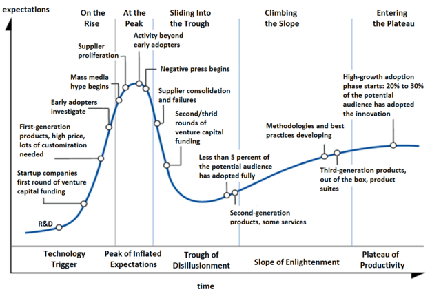

No dia 3 de Junho de 2020, o termo **microservice** resultava em 6.6 milhões de resultados no [Google](https://www.bing.com/search?q=microservice&PC=U316&FORM=CHROMN).
Isso porquê a organização de aplicações distribuídas na forma de "pequenos" processos, especializados e independentes e que colaboram para implementar um serviço maior, se tornou um padrão importante no desenvolvimento de novas aplicações.
Exatamente por isso, precisamos começar com um aviso: diversas tecnologias surgiram com grande estrondo, sendo alguns exemplos recentes Docker, Golang, Angular, e JQuery, e embora seja certo que algumas destas encontrarão seus nichos, como fizeram antes delas Cobol, C, e SQL, outras desaparecerão da face da indústria; afinal, quem sabe o que é Delphi e quem ainda usa JQuery? [Os micro-serviços não são uma panacéia](http://www.zdnet.com/article/microservices-101-the-good-the-bad-and-the-ugly/)

Este fenômeno é capturado pelas várias fases do *hype-cycle* da Gartner.[^hype_gartner]
[^hype_gartner]: "The hype cycle is a branded graphical presentation developed and used by the American research, advisory and information technology firm Gartner, for representing the maturity, adoption and social application of specific technologies."

A Arquitetura Orientada a microsserviços, tendo atingido o pico das expectativas infladas[^gartner_inflated] em 2017, está deslizando na [Trough of Desillusionment](https://www.gartner.com/en/documents/3955980/hype-cycle-for-application-architecture-and-development-)[^gartner_inflated] em 2019.
Isto é, este modelo de desenvolvimento não é mais propagandeado como uma bala de prata para todas as aplicações distribuídas.
Ainda assim, é um importante modelo. Mas afinal, o que é a arquitetura de microsserviços?
Em vez de explicar diretamente o que são, pode ser mais fácil pensar primeiro termos do que não são, em termos de sistemas monolíticos.   
   

[^gartner_inflated]: * Peak of Inflated - Expectations	Early publicity produces a number of success stories—often accompanied by scores of failures. Some companies take action; most don't.
* Technology Trigger -- A potential technology breakthrough kicks things off. Early proof-of-concept stories and media interest trigger significant publicity. Often no usable products exist and commercial viability is unproven.
*  Slope of Enlightenment -- More instances of how the technology can benefit the enterprise start to crystallize and become more widely understood. Second- and third-generation products appear from technology providers. More enterprises fund pilots; conservative companies remain cautious.
* Plateau of Productivity -- Mainstream adoption starts to take off. Criteria for assessing provider viability are more clearly defined. The technology's broad market applicability and relevance are clearly paying off.
* Trough of Disillusionment - Interest wanes as experiments and implementations fail to deliver. Producers of the technology shake out or fail. Investment continues only if the surviving providers improve their products to the satisfaction of early adopters.

Uma extrapolação que pode ser feita aqui, reforçando a observação que problemas (e soluções) de sistemas distribuídos são refletidos em nível de processamento paralelo e concorrente, é que a uma arquitetura SEDA lembra em muito a arquitetura de [micro-serviços](http://muratbuffalo.blogspot.com.br/2011/02/seda-architecture-for-well-conditioned.html).

Observe que à direita no exemplo de microsserviços, se vê um conector (ou componente) denominado ***event bus***.
A ideia é que componentes publiquem mensagens no barramento, os ***publishers***, e que componentes interessados em mensagens de algum tópico, os ***subscribers*** se subscrevam. 
O barramento então serve de canal de comunicação, entregando as mensagens publicadas a quem tiver interesse, implementando assim uma arquitetura ***publish/subscribe***.

### Monolitos
Muitas aplicações seguem o modelo de 3 camadas em que em um dos extremos tem-se a interface com os usuários, materializada normalmente por um navegador, no outro tem-se um SGBD onde são armazenados os dados da aplicação, e, no meio, a lógica do negócio.
A camada central, implementada por um único processo, que alimenta a interface com o usuário, manipula o modelo de dados, e onde reside a lógica do negócio, é um **monolito**.

Monolitos seguem um modelo simples e largamente utilizado de desenvolvimento em que vários contribuidores implementam partes distintas da lógica, que são compiladas em conjunto e colocadas em produção de forma atômica:   

1. Desenvolva
1. Teste
1. Implante
1. volte ao passo 1

Simples não quer dizer necessariamente eficiente; no caso de atualizações de uma parte do sistema, **todo o monolito precisa ser trocado**, incorrendo em, com raras exceções, **indisponibilidade total** do sistema, incluindo as partes não modificadas.
Esta dificuldade tende a limitar as **janelas de atualização** do sistema, o que aumenta no número de mudanças que ocorrem a cada atualização, o que **aumenta o risco de regressões** e portanto requer mais testes, o que aumenta o intervalo entre janelas de atualização. 
Além disso, nos caso de bugs, é mais difícil encontrar o problema, uma vez que fica **impossível aos desenvolvedores conhecer todo o sistema**.
Isso apenas exacerba o problema, o que limita mais ainda as atualizações, gerando um **ciclo vicioso** que mantem desenvolvedores acordados nas madrugadas de sexta para sábado quando é dia de *deploy*.

Sistemas monolíticos também podem ser problemáticos quanto à escalabilidade, pois quando a capacidade do sistema é atingida, ou todo o sistema é movido para um *host* de maior capacidade ou todo o sistema deve ser  replicado.
Na primeira abordagem, o custo geralmente é um empecilho, pois preços de hardware crescem exponencialmente com *scale up*. 
Além disso, um servidor, por mais parrudo que seja, é um Ponto Único de Falha (ou SPOF, do inglês *single point of failure*).
Quanto à segunda abordagem, ela traz complexidades na coordenação das réplicas e ineficiências ao replicar inclusive as partes subutilizadas.
Ambas as abordagens também esbarram na escalabilidade do banco de dados que lhes serve de *backend*.
Para contornar ou pelo menos minimizar estes problemas, pode-se fragmentar o serviço e o banco de dados, o que facilita tanto a escalabilidade vertical quanto horizontal de cada módulo, que é menor e mais simples de coordenar, e divide a carga nos bancos de dados; mas isso é a troca do serviço monolítico por microsserviços.

### Microsserviços
De acordo com [Lewis & Fowler](https://martinfowler.com/articles/microservices.html)
> The microservice architectural style is an approach to developing a single application as a suite of small services, each running in its own process and communicating with lightweight mechanisms, often an HTTP resource API. These services are built around business capabilities and independently deployable by fully automated deployment machinery. There is a bare minimum of centralized management of these services, which may be written in different programming languages and use different data storage technologies.

Em outras palavras, com os microsserviços, quebra-se o monolito em diferentes processos, "*small autonomous services that work together, modelled around a business domain*", cada um gerenciando os dados relevantes para aquela parte do sistema e, possivelmente, sua própria interação com o usuário.
Com o uso de microsserviços, se dá mais um passo em direção à máxima escalabilidade do sistema.

Este modelo tem implicações diretas no desenvolvimento: cada processo é desenvolvido por um time diferente, que mantem controle sobre desenvolvimento, teste, e manutenção em produção, o que é factível já que cada serviço é simples e focado em um problema pequeno e ninguém tem que entender em detalhes o funcionamento de todo o sistema.

Além disso, quando um serviço precisa ser atualizado, se bem projetados, todos os demais podem continuar operantes e é possível até que múltiplas versões do mesmo serviço sejam executadas concorrentemente, possibilitando atualizações sem janelas de manutenção.  

Quanto à escalabilidade, esta é feita independentemente também; no exemplo na imagem seguinte, é provável que o serviço de acesso ao catálogo seja mais utilizado que os demais e portanto merecedor de mais recursos e mais cópias.

Como se percebe facilmente, o uso de microsserviços pode ser relacionado às técnicas de processamento paralelo: trate dados diferentes em blocos diferentes (paralelismo de dados ou replicação) e trate funções diferentes em blocos diferentes (paralelismo de tarefas ou *sharding*).
Como na computação paralela, na "componentização" é importante considerar os requisitos das diferentes tarefas em termos de CPU, E/S, e memória, para que possam escalar independentemente e não gerar gargalos desnecessários.

### Do Monolito aos Microsserviços
Com tantas vantagens, surge a dúvida se todos os sistemas deveriam ser desenvolvidos usando-se a arquitetura de microsserviços.
A resposta é **não**, pois como colocado no início desta seção, **não existem balas de prata** e se um sistema monolítico está funcionando para você e não há perspectiva de problemas acometerem (a demanda no sistema não está aumentando, a lógica do sistema é muito simples, indisponibilidade não te traz prejuízo, você não pode arcar com a refatoração), então mantenha seu sistema como está.

Caso haja a necessidade de evolução e o modelo de microsserviços pareça adequado, existem recomendações de como a migração pode ser feita.
Primeiro, é preciso aceitar que o desenvolvimento de microsserviços afeta a organização do time de desenvolvimento e que a organização provavelmente refletirá a arquitetura.
O desenvolvimento, manutenção e operação de microsserviços acontece em times pequenos, de 1 a 8 pessoas ("pizza team"), dependendo da complexidade do serviço; se houver a necessidade de mais pessoas no time, o escopo do microsserviço provavelmente está grande demais; cada componente resolve um problema, bem.

Segundo, a mudança não deverá acontecer atomicamente. 
Uma boa estratégia é identificar uma parte do sistema que funcionaria bem como microsserviço, desenvolvê-la e modificar o monolito para usar o microsserviço.
O aprendizado então é usado para encontrar novo candidato e o procedimento é iterado até que o monolito seja apenas uma casca e possa também ser removido.
Mais fácil dito que feito, há muita documentação orientando o processo.

!!! tip "Para saber mais"
    Como esta arquitetura não faz parte ainda do nosso currículo, não nos aprofundaremos nela aqui.
    Felizmente há muito material na Web sobre este modelo, sendo a lista a seguir uma ínfima fração.

    Para uma explicação geral do que são, assista a Martin Fowler no vídeo seguinte, assista  
    <iframe width="560" height="315" src="https://www.youtube.com/embed/wgdBVIX9ifA" frameborder="0" allow="accelerometer; autoplay; encrypted-media; gyroscope; picture-in-picture" allowfullscreen></iframe>   
    ou consulte os vários artigos no seu [sítio](https://martinfowler.com/articles/microservices.html).

    Para entender os princípios por trás do uso da arquitetura,  
    <iframe width="560" height="315" src="https://www.youtube.com/embed/PFQnNFe27kU" frameborder="0" allow="accelerometer; autoplay; encrypted-media; gyroscope; picture-in-picture" allowfullscreen></iframe>

    Para um exemplo importante do uso de microsserviços, considere a Netflix, que usa microsserviços em larga escala em seus serviços. Quão larga? "...over five hundred services... we don't know how many..." Apesar de tal uso, ou justamente por causa dele, seus serviços mantém uma "...availability of 9.995...", ou seja, ficam indisponíveis por **menos de 16 segundos por ano**.   
    <iframe width="560" height="315" src="https://www.youtube.com/embed/57UK46qfBLY" frameborder="0" allow="accelerometer; autoplay; encrypted-media; gyroscope; picture-in-picture" allowfullscreen></iframe>   
Com respeito a estar preparado para falhas, afinal "... it is not if failures will happen... ... it is when it happens...", a empresa usa uma abordagem de injeção de falhas em serviços em produção.
    Os diferentes tiposde falhas são injetados por um "**exército de macacos do caos**"  
    <iframe width="560" height="315" src="https://www.youtube.com/embed/CZ3wIuvmHeM" frameborder="0" allow="accelerometer; autoplay; encrypted-media; gyroscope; picture-in-picture" allowfullscreen></iframe>   
    Para uma visão prática da implementação de microsserviços usando AWS, veja
    <iframe width="560" height="315" src="https://www.youtube.com/embed/Ijs55IA8DIk" frameborder="0" allow="accelerometer; autoplay; encrypted-media; gyroscope; picture-in-picture" allowfullscreen></iframe>
