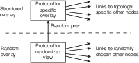

Antes de nos aprofundarmos nos exemplos, precisamos entender o conceito das redes **sobrepostas**.

### Rede Sobreposta (*Overlay*)

Os componentes de um sistema P2P se organizam em uma rede lógica, sobreposta à rede física.
Nesta rede lógica, os processos estabelecem canais de comunicação tipicamente na forma de conexões TCP/IP.
Por serem ignorantes à topologia física da rede e usarem a pilha de comunicação IP, as redes sobrepostas são mais simples e ao mesmo tempo mais poderosas. 
Nestas redes são executados diversos algoritmos, como de descoberta de nós, roteamento de pacotes e de otimização de rotas pelo descarte e criação de conexões.

Uma vez que as **conexões na rede sobreposta não correspondem a conexões físicas**, como se pode ver na seguinte figura, vizinhos em um rede sobreposta não necessariamente correspondem a vizinhos na rede física e vice-versa.
Isto também implica que a **otimização da rota lógica não necessariamente leva à otimização da rota física**.

Dependendo em como esta rede é organizada (ou não), a mesma é classificada como **estruturada** ou **não-estruturada**.

#### Rede Não-Estruturada

Se a rede sobreposta é construída de forma aleatória, por exemplo deixando os nós se conectarem apenas aos vizinhos na rede no ponto em que se conectaram inicialmente, então esta é denominada uma rede **não-estruturada**. 
A figura a seguir é um exemplo que se percebe que nós tem graus diferentes de conectividade e que não estão particularmente organizados em nenhuma topologia.

Suponha que esta rede seja usada para armazenar e consultar dados.
Inserções de dados podem ser feitas muito rapidamente, armazenando-os no primeiro nó disponível encontrado.
Os objetos amarelo e vermelho foram inseridos desta forma, e copiados em nós próximos para tolerar a falha de alguns hosts sem perder os dados.
Buscas, contudo, terão que vasculhar a rede usando algoritmos como **busca em largura**, **busca em profundidade** ou **caminhada aleatória** (resposta probabilística).

#### Rede Estruturada

Se as conexões são construídas e mantidas de forma a gerar uma **topologia bem definida**, chamamos esta rede de **estruturada**.
Nesta rede, a inserção de nós requer a propagação desta informação para outros nós e a atualização das conexões para manter a estrutura.
A estrutura geralmente serve ao propósito de associar os nós aos dados de uma forma planejada. 
Por exemplo, nós próximos na rede podem ser responsáveis por dados logicamente próximos.
Claramente, a inserção e acesso a dados nesta rede é mais custosa, pois independentemente de onde a requisição é feita, isto é, a partir de qual nó, ela deverá ser atendida por um nó específico. 

Veja o exemplo do Chord, uma rede P2P em que os nós formam um anel lógico, cujos detalhes veremos adiante.
Cada nó é responsável pela faixa de valores indexados por chaves entre o identificador do nó e o do nó anterior.
Logo, qualquer inserção ou consulta de dados, deve ser feita especificamente para um determinado nó, e deve ser **roteada** para o mesmo.
A estrutura da rede permite que tal roteamento seja feito eficientemente, no nível da rede sobreposta.

Como outro exemplo considere uma rede em que os nós armazenam informações sobre os dados de uma certa área geográfica e que nós vizinhos na rede sejam aqueles responsáveis por áreas que se tocam.

Neste exemplo, para se acessar os dados de um certo ponto no mapa, basta rotear a requisição para o vizinho mais próximo do ponto; necessariamente a requisição chegará ao nó correto.

#### De não estruturada a estruturada

A seguinte tabela resume as diferenças entre os dois tipos de redes sobrepostas.

 Estruturada                      | Não-Estruturada 
----------------------------------|---------------------------
 Estrutura bem definida           | Estrutura aleatória
 Adição de dados é lenta          | Adição de dados é rápida
 Adição de nós é lenta            | Adição de nós é rápida
 Busca por dados é rápida         | Busca por dados lenta

Mas, e se pudéssemos juntar o melhor dos dois mundos em um único sistema? Isso é possível em certos cenários. 
Por exemplo, seja uma grade $N \times N$ em que nós  em uma borda da matriz conseguem se conectar aos nós da borda oposta.
Distâncias entre nós são medidas como a soma das distâncias em $x$ mais a distância em $y$.

* $a = (x,y), b = (x', y')$
* $d_x(a,b) = min(|x - x'|, N - |x - x'|)$
* $d_y(a,b) = min(|y - y'|, N - |y - y'|)$
* $d(a,b) = d_x(a,b) + d_y(a,b)$

Suponha que cada divida a organização da topologia em dois módulos, um de descoberta de novos nós e outro de seleção.

O módulo de descoberta leva inicialmente ao estabelecimento de conexões aleatórias e à formação de uma rede sobreposta não estruturada como, por exemplo, a seguinte.

Após as conexões inicias, cada um dos nós executa o seguinte protocolo iteradamente.

* O módulo de descoberta, repetidamente, pergunta aos seus vizinhos quem são os seus vizinhos e se conecta aos mesmos.
* O módulo de seleção computa a distância entre o nó e todos os seus vizinhos e descarta as conexões com maior distância.

Ao final de múltiplas interações, cada nó terá como seus vizinhos, os nós mais próximos. Se a rede for completa (um nó em cada posição da grade), como no exemplo, e o módulo de seleção sempre mantiver quatro conexões, ao final do processo os vizinhos serão os nós à direita, esquerda, acima e abaixo.
Se a rede não for completa ou se menos conexões forem mantidas, uma aproximação será obtida.

A seguinte figura apresenta uma outra rede resultada da aplicação do mesmo princípio, mas em uma "grade" com três dimensões.

Se em vez da distância cartesiana fosse usada a distância de Hamming entre os identificadores dos nós, ao final das iterações, a topologia alcançada seria um hyper-cubo, como os da seguinte figura,[^hyper] no qual diversos [esquemas de roteamento eficientes podem ser usados](https://en.wikipedia.org/wiki/Hypercube_internetwork_topology).[^icpc_hyper]

[^hyper]: No caso da grade 4x4, a o hipercubo é topologicamente igual à rede obtida pela distância cartesiana como mostrado no exemplo acima.

[^icpc_hyper]: Neste [problema](https://icpcarchive.ecs.baylor.edu/external/22/2271.pdf) do ICPC, um esquema de nomeação dos nós de um hypercube é apresentado; usando este esquema, derive um algoritmo de roteamento em que a distância percorrida por qualquer mensagem seja sempre igual ao número de dimensões do cubo.

!!! info inline end "Sistemas P2P"
    * Arquitetura decentralizada;
    * Não há distinção de papéis entre nós ou conjuntos de nós desempenham os mesmos papéis, em parceria;
    * Escalabilidade geográfica global, isto é, com nós espalhados por todo o globo;
    * Pode haver entrada e saída de nós do sistema com alta frequência; 
    * Nós se organizam em redes sobrepostas (em inglês, *overlay*), redes lógicas sobre as redes físicas;
    * Auto-administração.
    * Resiliente a falhas

### Tabelas de Espalhamento Distribuídas (DHT)

A versatilidade dos sistemas P2P os levaram a ser amplamente estudados e aplicados, sendo que entre as aplicações mais bem sucedidas estão as Tabelas de Espalhamento Distribuídas (DHT, do inglês, *Distributed Hash Tables*).

As tabelas de espalhamento (também conhecidas como mapas, dicionários, arrays associativos) tem características que a tornam adequadas ao armazenamento de dados a vários cenários.
Em essência, estas tabelas são funções que **mapeiam** uma chave para um valor, uma função $f$ tal que

* $f(K): V \cup \{null\}$
* $K$: Universo de chaves
* $V$: Universo de valores

isto é, $f(k) = v, k\in K, v \in V$ ou $v =$ null.

Na prática, são estruturas de dados adaptáveis, com um API muito simples, e com operações de tempo (mais ou menos) constante para fazer CRUD de pares chave/valor.
Tanto $K$ quanto $V$ são **blobs** de dados, isto é, sem nenhuma forma distinta, e por isso podem ser usadas para resolver uma gama de problemas.

!!! note "API"
    * sejam $k \in K$ e $v,w \in V$
    * $put(k,v)$: 
         * if $f(k) = w \neq null$ then return $w$
         * else $f(k) \rightarrow v$;  return $null$
    * $update(k,v)$: 
         * if $f(k) = w \neq null$ then return $w$; $f(k) \rightarrow v$
         * else return $null$
    * $get(k)$: 
         * if $f(k) = w \neq null$ then return $w$
         * else return $null$ 
    * $del(k)$:
         * if $f(k) = w \neq null$ then return $w$ 
         * else return $null$
    * execução $O(1)$

Se as tabelas de espalhamento são estruturas de dados úteis, uma versão distribuída seria ainda mais útil, principalmente porquê ela poderia ser **tolerante a falhas** e ter **escalabilidade linear**.
É justamente desta idea que surgem as DHT, literalmente tabelas de espalhamento distribuídas, estruturas de dados que mantém **a mesma API** e funcionalidades de tabelas de espalhamento, mas que **agrega capacidades de diversos hosts**.

Dentre os desafios na implementação de uma DHT estão

* O que usar como chave? Uma DHT deve ser versátil para ser utilizada para vários fins, então a chave precisa ser independente da aplicação.
* Como dividir a carga entre hosts? É preciso balancear a carga para que um lado da rede não se torne mais importante que o outro e para não levar a uma hierarquização entre os nós.
* Como rotear requisições para o host correto? Uma vez que os dados devem ser particionados entre hosts para garantir escalabilidade, como encontrar o nó onde determinado dado está or deveria estar?

#### Identificação

A identificação de objetos precisa ser facilmente **determinável pela aplicação** para permitir a recuperação precisa dos dados. 
Por exemplo, podemos usar o identificador único CPF como chave para dados de pessoas e dividir seus possíveis valores em faixas, atribuídas a diferentes nós do sistema.

* 000.000.000-00 - 111.111.111-00: nó 1
* 111.111.111-01 - 222.222.222-00: nó 2
* 222.222.222-01 - 333.333.333-00: nó 3
* ...

Contudo, esta chave é ruim pois não propicia uma distribuição uniforme da carga de trabalho entre os hosts; como CPF são gerados sequencialmente, os hosts iniciais seriam responsáveis por mais dados que os demais.

Mas mesmo que a geração de CPF fosse aleatória, ainda teríamos outro problema com seu uso como chave: o CPF só se aplica a pessoas e portanto não é usável em outras aplicações.
Para resolver estes três problemas, recorremos a uma abordagem usada na literatura da área, dividindo a identificação em duas camadas:

* Seja $i$ o identificador do objeto, dado pela aplicação (e.g., CPF, nome, telefone)
* Seja $h$ uma função *hash* criptográfica
* O objeto identificado por $i$ na aplicação será identificado por $k = h(i)$ dentro da DHT.

#### Divisão da carga
Se usarmos, por exemplo, MD5, é fato que $k$ tem distribuição uniforme no espaço de 0 a $2^{160}-1$ possíveis valores.
Para dividirmos os dados entre os hosts também uniformemente, distribua os valores entre os hosts em função de $k$.
Alguns exemplos de divisão são:

* defina *buckets* para cada host e atribua o dado com chave $k$ para bucket $k \% b$, onde $b$ é o número de buckets
* divida a faixa de valores em $b$ segmentos e atribua a cada host uma faixa
* dados $2^n$ hosts, atribua ao host $0 < x < 2^n-1$ os dados cujas chaves terminem com o valor $x$.

São várias as formas de se dividir os dados e estas estão intimamente ligadas à rede sobreposta que se pretende montar e a como o roteamento será feito.

#### Roteamento
Para estudar o desafio do roteamento, nas seções seguintes estudaremos o Chord, um sistema P2P que surgiu no meio acadêmico mas cujo design influenciou fortemente a indústria no desenvolvimento dos bancos dados distribuídos NOSQL, como Cassandra, Dynamo, e Redis.

