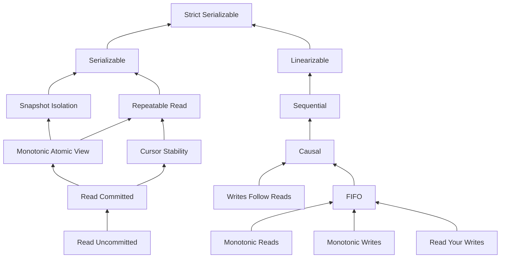

, como mostra a hierarquia a seguir, adaptada de [jepsen.io](https://jepsen.io/consistency).

```mermaid
graph BT
    S --> SS[Strict Serializable]
    RU[Read Uncommitted] --> RC[Read Committed]
    RC --> CS[Cursor Stability]
    RC --> MAV[Monotonic Atomic View]
    MAV --> RR[Repeatable Read]
    MAV --> SI[Snapshot Isolation]
    CS --> RR
    SI --> S[Serializable]
    RR --> S
    L[Linearizable] --> SS
    Seq[Sequential] --> L
    C[Causal] --> Seq
    WFR[Writes Follow Reads] --> C
    FIFO --> C
    MR[Monotonic Reads] --> FIFO
    MW[Monotonic Writes] --> FIFO
    RW[Read Your Writes] --> FIFO
```

e é aí que entram os modelos de consistência.