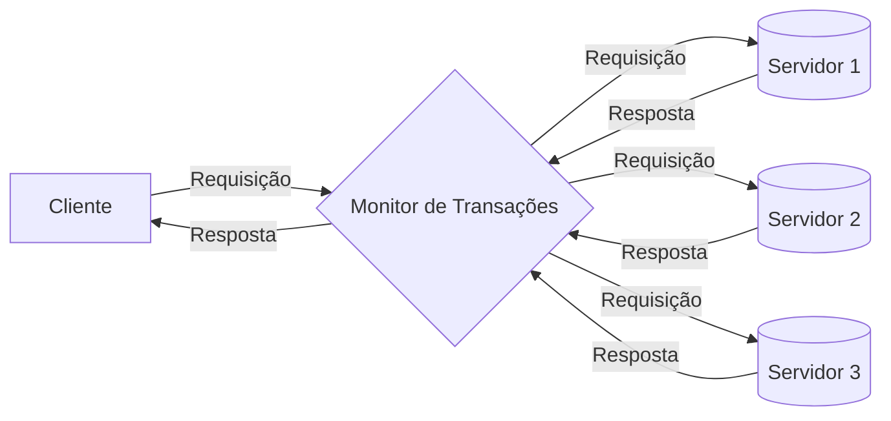
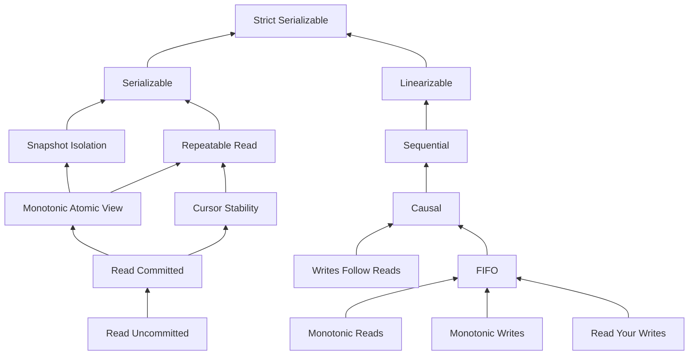

transacionais.
Isto é, eles provêem as garantias na execução de transações conhecidas como propriedades ACID.

!!!note "ACID"
    * Atomicidade: transações são tratadas de forma indivisível, isto é, ou tudo ou nada.
    * Consistência: transações levam banco de um estado consistente a outro. E.g., `x == 2*y`
    * Isolamento: transações não vêem dados não comitados umas das outras.
    * Durabilidade: os efeitos de uma transação comitada devem persistir no sistema a despeito de falhas.


Para relembrar no que implica ACID, considere a seguinte sequência de operações, onde X e Y são valores guardados pelo banco de dados, a, b e c são variáveis definidas no programa, e SELECT e SET são comandos para ler e modificar o banco de dados.

```
1: a = SELECT X
2: c = a * 2
3: b = c + 10
4: SET X=c
5: SET Y=b
```
Suponha duas instâncias desta sequência, $T_1$ e $T_2$, concorrentes, em que as operações escalonadas da seguinte forma.

```
   T1                T2
1: a = SELECT X
2: c = a * 2
3: b = c + 10
4: SET X=c
5:                    a = SELECT X
6:                    c = a * 2
7:                    b = c + 10
8:                    SET X=c
9:                    SET Y=b
10:SET Y=b
```

Ao final da execução, X terá o valor atribuído por $T_2$, mas $Y$ terá o valor de $T_1$. 
Este escalonamento violou a **consistência** do banco de dados por quê as operações não foram executadas **isoladamente**.


, como mostra a hierarquia a seguir, adaptada de [jepsen.io](https://jepsen.io/consistency).




e é aí que entram os modelos de consistência.