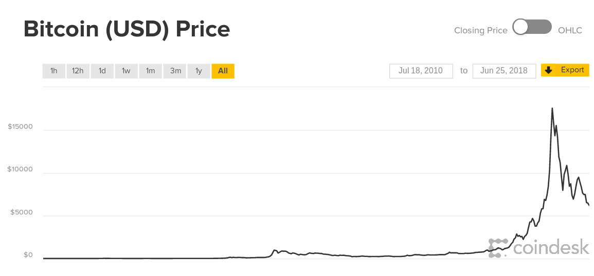
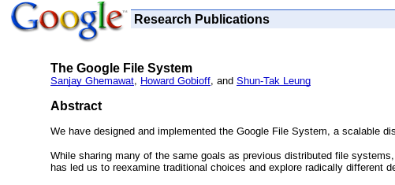
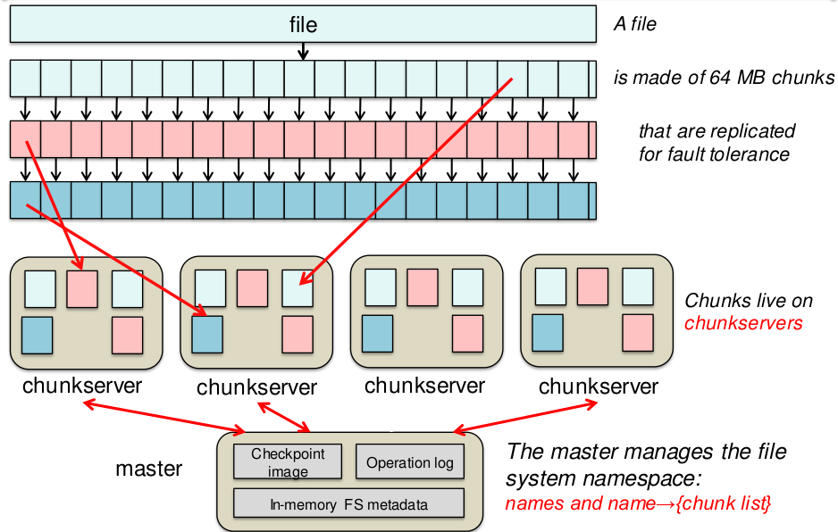
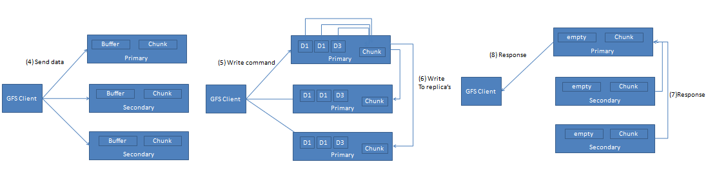
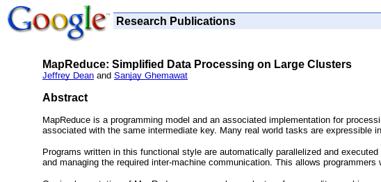
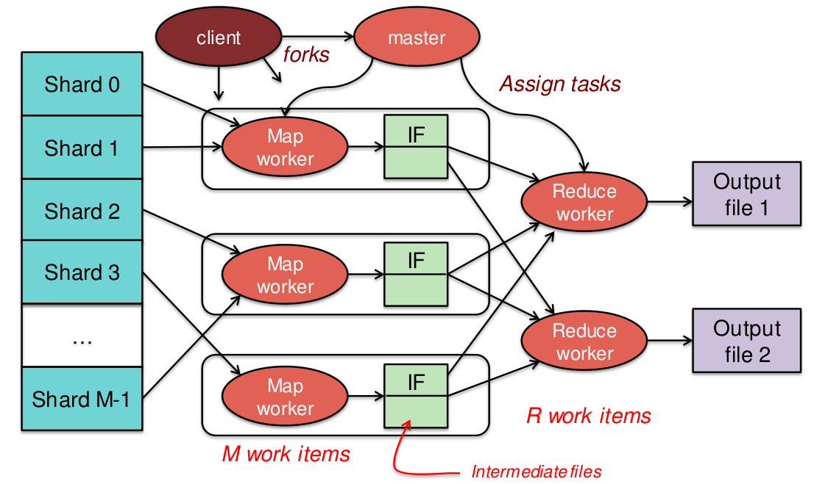
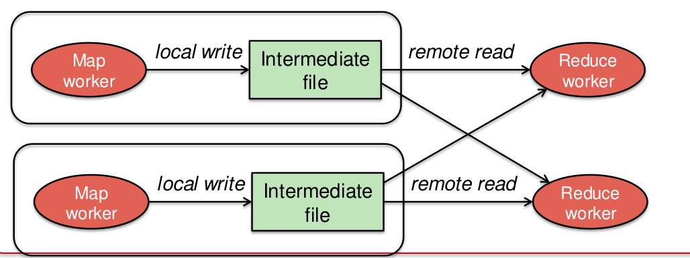
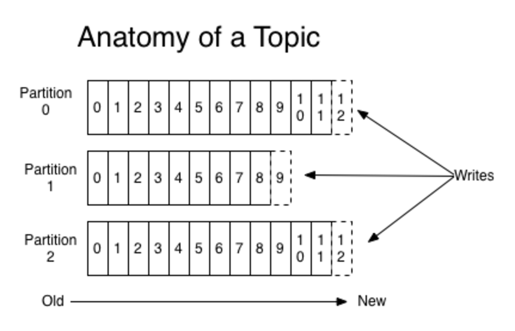

O objetivo deste capítulo é visitar algumas técnicas e tecnologias recentes e interessantes na área de sistemas distribuídos. Não espere então que as várias seções sejam conexas umas com as outras.


## Como sincronizar duas máquinas?

* Abordagem 1
    * Copie os arquivos da fonte para o destino
* Abordagem 2
    * Produza um hash do arquivo
    * Troque o hash com a outra máquina
    * Se hashes iguais, pronto.
    * Se hashes diferentes, copie o arquivo para a outra máquina.
* Abordagem 3 - Merkle Tree[^madsmt]
    * Divida o arquivo em blocos de mesmo tamanho
    * Faça um hash de cada bloco
    * Se mais de um hash gerado, 
	     * Concatene hashes duas a duas; cada concatenação resulta em um novo bloco.
         * Repita o processo; os hashes resultantes correspondem a uma árvore  
         
    * Troque hashes da raiz.
        * Se hashes iguais, pronto.
        * Se hashes diferentes troque hashes das raizes das subárvores e execute recursivamente.
        

[^madsmt]: [Modern Algorithms and Data Structures: Merkle Trees](http://www.slideshare.net/quipo/modern-algorithms-and-data-structures-1-bloom-filters-merkle-trees)


???question "Se um byte é adicionado no meio do arquivo?"
	


A conclusão é que blocos com tamanho pré-definido são problemáticos e que precisamos de blocos definidos pelo conteúdo. Por exemplo, em um texto, uma possibilidade é definir um bloco como um período ou um parágrafo; se uma palavra é inserida no texto, , somente o bloco em que foi inserida é modificado e somente o hash do mesmo terá novo valor. Mas esta abordagem não é genérica, pois qual o correspondente em uma imagem ou um áudio ou em um arquivo `tgz`?


## Rabin Fingerprinting


!!!todo "Rabin Fingerprint"
    [Rolling Hash](https://en.wikipedia.org/wiki/Rolling_hash)


## Blockchain

Uma cadeia de fornecimento (*supply chain*), temos, em vários níveis, **Clientes**, **Vendedores** e **Fornecedores**, que estabelecem **contratos** de bens e serviços.
A um consumidor seria interessante saber quem produziu o cacho de bananas que está comprando, se a produção é livre de trabalho escravo, se o transporte foi feito dentro de parâmetros corretos de temperatura, se não violou tratados de rotas marítimas para proteger baleias, e assim por diante. Essencialmente, seria interessante rastrear como o bem "bananas" foi transferido de mão em mão até chegar à feira livre. 
Há diversos tipos de **bens**, tangíveis (e.g., **casa**) e intangíveis (e.g., **patente**),  nominais (e.g., **promissória**) e ao portador (e.g., **dinheiro "vivo"**), etc.

As interações multipartido podem ser registradas em **livros razão** mantidos pelos independentemente pelos participantes, registrando cada troca bens envolvendo o participante responsável.
Esta abordagem **dificilmente permitiria aos participantes ou auditores reconstruir todo o trajeto**, que dirá um consumidor na ponta, além ser **suscetível a modificações**, intencionais ou não.

***Blockchains*** provêem um "livro razão" **incorruptível**, **decentralizado** e "facilmente" auditável.
Desde que Nakamoto introduziu a primeira *blockchain*[^nakamoto], destinada a "rastrear" a troca de uma moeda digital, a [bitcoin](https://bitcoin.org), [diversas outras *blockchains*](https://medium.com/wikidlt/a-complete-list-of-blockchain-platforms-2020-49cf01ee6688) foram desenvolvidas, para diferentes usos e com diferentes funcionalidades.

[^nakamoto]: [Bitcoin: A Peer-to-Peer Electronic Cash System](https://bitcoin.org/bitcoin.pdf)

Algumas características comuns, ou pelo menos desejáveis, das *blockchains* são

* Decentralizado - Replicado usando P2P e não facilmente subjugável. (Hyperledger, da IBM, não é.)
* Consenso - acordo na transação
* Proveniência - todo o histórico de um bem é mantido na *blockchain*
* Imutabilidade - entradas não podem ser alteradas
* Finalidade - entradas não podem ser refutadas

!!!quote "Bitcoin"
    Everything you don't understand about money, combined with everything you don't understand about technology.

    Joh Oliver, Last Week Tonight, Março 2018.

Além disso, no mundo dos negócios, é interessante que possa usar a **blockchain** para diferentes tipos de bens (na *bitcoin*, só a *bitcoin*), que as partes sejam **identificáveis** (na *bitcoin*, os usuários são anônimos), e que não gaste muito energia (*bitcoin* usa *proof-of-work*, que gasta muita, muita energia).

Vejamos um [exemplo de como uma blockchain funciona](https://andersbrownworth.com/blockchain/).

Os termos do negócio são mantidos na blockchain: "Se na data X a entidade E não tiver transferido D dinheiros para a entidade F, então transfira o asset A de E para F."
	

Se quiser saber mais, consulte esta pequena [lista](https://www.paperdigest.org/2020/06/recent-papers-on-blockchain-bitcoin/) artigos sobre *blockchain*.





???todo
    * Smart-contracts
	* proof-of-stake
	* grupos pequenos como certificadores.


------


## A Small Piece of Big Data

!!!quote "[Big-Data](https://en.wikipedia.org/wiki/Big_data)"
    Big data is a term for data sets that are so large or complex that traditional data processing application software is inadequate to deal with them.

Ciclo convencional:

* Coleta
* Armazenamento
* Análise
* Consulta
* Compartilhamento
* Visualização
* Atualização
...


Áreas

Grandes massas de dados:

* Propaganda
* Astronomia
* Ciência
* e-governos
* meteorologia
* genomics

Dados
Internet das coisas
sensoriamento remoto
suas fotos
logs de software
RFID
redes de sensores
...

Quão grande é ``big'' o suficiente? 
Depende dos dados, ferramentas, e capacidade de manipulá-los. 
Uma vez dado um passo, o alvo passa a ser o próximo passo. 
Isso quer dizer que vai de alguns TB até Petabytes, dependendo do problema.


!!!quote "Gartner, 2012"
     Big data is high volume, high velocity, and/or high variety information assets that require new forms of processing to enable enhanced decision making, insight discovery and process optimization.

     * Volume: incapacidade de armazenar todos os dados; apenas observe e guarde conclusões
     * Velocidade: dados passando em ``tempo real''
     * Variedade: imagens, vídeos, áudio, temperatura,...
     * Machine learning para automação de extração de informação, por exemplo, detecção de padrões, sem se preocupar com o porquê dos mesmos.


Como lidar?

* Bancos de dados colunares
* Stream DBs
* MapReduce
* ...

Google FS

* Google, 2003
* File System
* Dados recuperados da Internet usados em consultas
* Milhões de arquivos de múltiplos GB
* Chunks de 64MB (``blocos do disco'')
* Operações comuns são appends ou reads
* Servidores/discos/memórias estão sempre falhando
* Centenas de clientes concorrentes no mesmo arquivo





* Clusters de nós ``comuns''
* Master node: metadata
* Chunk servers: data
* Permite usar um cluster como um único HD elástico na rede.

[Fonte](https://www.cs.rutgers.edu/~pxk/417/lectures/l-dfs.html)


*  Apps recebem \emph{leases} de acesso direto aos dados
*  Atomic commitment garante consistência entre réplicas

[Fonte](http://google-file-system.wikispaces.asu.edu/)

* Consistência 


* Application sends the file name and data to the GFS client.
* GFS Client send the file name and chunk index to master
* Master sends the identity of the primary and other secondary replicas to the client.
* Client caches this information. Client contacts master again only when primary is unreachable or it sends a reply saying it does not holds the lease anymore.
* Considering the network topology the client sends the data to all the replicas.This improves performance. GFS separates data flow from the control flow. Replicas store the data in their LRU buffers till it is used.
* After all replicas receiving of the data, client sends write request to the primary. Primary decides the mutation order. It applies this order to its local copy.
* Primary sends the write request to all the secondary replicas. They perform write according to serial order decided by the primary.
* After completing the operation all secondary acknowledge primary.
* Primary replies the client about completion of the operation. In case of the errors that is when some of the secondary fail to write client request is supposed to be fail.This leaves modified chunk inconsistent. 
* Client handles this by retrying the failed mutation. 


[Fonte](http://google-file-system.wikispaces.asu.edu/)


Map Reduce

*  Google, 2004
*  Processamento distribuído
*  Processa arquivos no Google FS



Chubby

	*  Google, 2006
	


Hadoop

*  HDFS: Hadoop Distributed File System
*  Map Reduce
*  Yahoo!
*  Open source em 2011, 1.0.0
*  2012, 2.0.0,
*  2017, 3.0.0
*  nov 2018, 2.9.2

Ecosistema

*  Hive: data warehouse
*  Spark: 
*  Kafka
*  Yarn
*  Pig: linguagem para especificação de data flow.
*  HBase: banco de dados estruturado
*  Sqoop
*  Flume
*  Oozie
*  Avro: serialização
*  Mahout: machine learning


HDFS

*  Distribuído
*  Escalável
*  Cost effective
*  Tolerante a falhas
*  Alta vazão


Arquitetura

*  Rack e rack failure
*  Top of rack switch
*  Core switch
*  Name Node: nomes das pastas e arquivos
*  Data Node: conteúdo dos arquivos
*  Cliente

Arquitetura

*  Crie arquivo: cliente -> name node
*  Escreva um block (e.g., 128MB): cliente
*  Aloque block: cliente -> name node
*  Salve os dados: cliente -> data node
*  Heartbeat block report: data node -> name node
*  Dados são replicados (RF configurado por arquivo): Data node -> data node

Name node

Dados em memory e edit log.

*  Name node é um SPOF? 
*  Quorum Journal Manager replica edit log.
*  Standby Name Node
*  Zookeeper usado para decidir quem é o líder
*  Secondary Name Node replica checkpoint da imagem em memória.

MapReduce

*  Programação funcional
*  Map: (map length (() (a) (a b c)) = (0 1 3))
*  Fold/Reduce: (reduce + (1 2 3)) = 6

MapReduce

*  Não há dependência entre os dados
*  Dados divididos em \emph{shards}
*  Execução paralela e distribuída
*  Trabalhador recebe um shard
*  Mestre agrega valores
*  Milhares de processos
*  Petabytes de dados

MapReduce

*  Shards são arquivos do GFS/HDFS/EC2
*  Função mapeada a cada shard
*  Resultado é lista de chaves e valores
*  Agregação acontece por chaves
*  Resultado são arquivos no GFS/HDFS/EC2

MapReduce






Exemplo
```java
import ...

public class WordCount 
{
 public static class TokenizerMapper 
 extends Mapper<Object, Text, Text, IntWritable>
 {
  private final static IntWritable one = new IntWritable(1);
  private Text word = new Text();

  public void map(Object key, Text value, Context context) 
   throws IOException, InterruptedException 
  {
   StringTokenizer itr = new StringTokenizer(value.toString());
   while (itr.hasMoreTokens()) 
   {
    word.set(itr.nextToken());
    context.write(word, one);
   }
  } 
 }
...
```

```java
...
 public static class IntSumReducer 
  extends Reducer<Text,IntWritable,Text,IntWritable> 
 { 
  private IntWritable result = new IntWritable();
  public void reduce(Text key, Iterable<IntWritable> values, Context context) throws IOException, InterruptedException 
  {
   int sum = 0;
   for (IntWritable val : values) 
    sum += val.get();
   result.set(sum);
   context.write(key, result);
  }
 }
	
 public static void main(String[] args) throws Exception 
 {
  ...
 }
}
```

[Fonte](https://hadoop.apache.org/docs/current/hadoop-mapreduce-client/hadoop-mapreduce-client-core/MapReduceTutorial.html#Example:_WordCount_v1.0)


https://youtu.be/DJPwV2ge9m0?list=PLkz1SCf5iB4dw3jbRo0SYCk2urRESUA3v


## Estudo de caso: Kafka


*  Consumidores: recebem dados
*  Cluster/Broker: distribuído e tolerantes a falhas.
*  Conectores: integração simplificada com outras aplicações 
*  Stream processors: spark ou outros frameworks; transformam dados


Brokers

*  Cluster de brokers
*  Distribuído
*  Tolerante a falhas
*  Desacoplamento espacial
*  Desacoplamento temporal
*  Tópicos, não endereços


Tópicos

*  Nome de uma stream de dados: ordem de serviço, exame de sangue, MSFT
*  Quantidade pode ser imensa.


Partição

*  Subdivisões de tópicos
*  Número de partições é definido por usuário
*  Cada partição está associada a um único servidor


Offset

*  Índice de uma mensagem em uma partição
*  Índices atribuídos na ordem de chegada
*  Offsets são locais às partições
*  Mensagens são unicamente identificadas por (tópico, partição, índice)



Consumer group

*  Carga pode ser muito grande para um consumidor
*  Compartilham o processamento de um tópico
*  Cada mensagem é processada por um membro do grupo
*  A mesma mensagem pode ser processada por múltiplos grupos
*  Número de consumidores $\leq$ partições no tópico
*  Máximo de dois consumidores por partição (mantem pos. de cada um)


Siga o [tutorial](http://kafka.apache.org/quickstart), até o passo 5.

*  Baixe e descompacte
*  Rode o zookeeper (Terminal 1)
*  Rode o Kafka (Terminal 2)
*  Crie um tópico (Terminal 3) - 
		Mais de uma partição em um servidor
* Conecte-se ao Zookeeper e dê uma olhada. O que está vendo?
*  Liste os tópicos criados
*  Envie algumas mensagens
*  Inicie um consumidor (Terminal 4)


