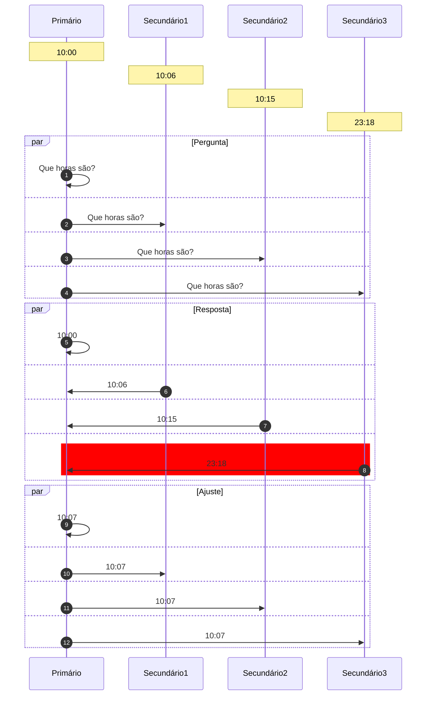
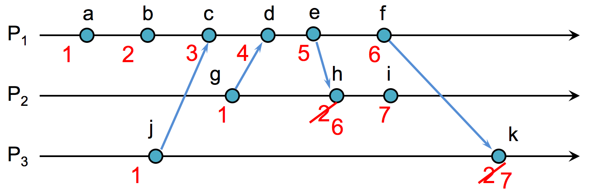
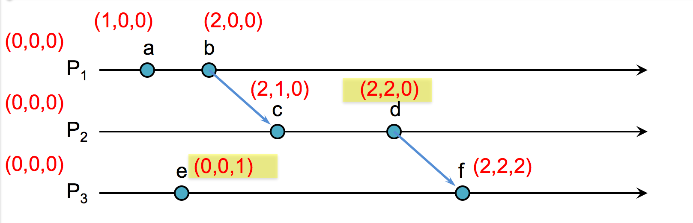
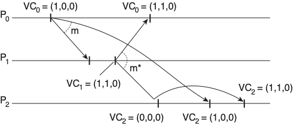
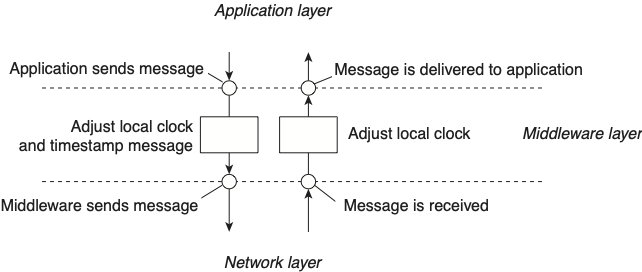

# Tempo

Neste capítulo discutiremos como o **tempo** é importante no desenvolvimento de sistemas distribuídos.
Comecemos por analisar o funcionamento de uma aplicação distribuída muito comum, o **armazenamento de arquivos na nuvem**, sincronizado com o sistema de arquivos local. 
Alguns exemplos do mundo real são Dropbox, Box, Google Drive and OneDrive; chamemos este serviço genericamente de **cloud-drive**.
No exemplo a seguir, um arquivo é sincronizado com uma nova cópia, Cliente 1, que altera o arquivo e sincroniza de volta com o servidor.
Na sequência, um novo cliente se registra, Cliente 2, recebe o arquivo, o altera e sincroniza com o servidor, que propaga a nova versão para Cliente 1.
Ao final da execução, todos os envolvidos tem cópias idênticas do arquivo. :thumbsup:

Se um mesmo arquivo no cloud-drive é modificado em duas máquinas diferentes, enquanto as mesmas estão desconectadas, o quê acontece quando elas se reconectam à Internet?
Mais especificamente, quando as duas máquinas se conectam e enviam suas versões do arquivo modificado para o servidor, sendo que ambas foram geradas a partir de um ancestral comum, qual versão deve ser armazenada e qual deve ser descartada?

Você pode se perguntar se isso realmente poderia acontecer, afinal, você não estará em dois lugares para fazer modificações concorrentes. Ignorando-se o fato de que outra pessoa poderia estar editando em paralelo, uma falha de comunicação poderia lhe permitir editar nos dois computadores **concorrentemente**.

Uma possibilidade simples é sempre aceitar cada nova versão como uma modificação do arquivo.
Assim, efetivamente, quando a primeira versão for entregue, será aceita e viverá momentaneamente até que a outra versão seja recebida e a sobrescreva.
No exemplo seguinte, o resultado deveria ser A, seguindo esta abordagem.

Contudo, vemos alguns problemas pois, pelo gráfico, vemos que a "Versão B" foi criada **depois** da "Versão A", mas que a versão final vista pelo servidor é exatamente a "A". 
Além disso, se encolhermos um pouco a desconexão do nó na parte de cima, o resultado final se inverte.

Isso quer dizer que a decisão de qual a versão deve ser mantida depende mais da rede que das edições do arquivo em si, ou mesmo do algoritmo ***last writes wins***.
Logo, a ordem de chegada ao servidor não serve como critério para escolha pois a ordem de chegada dos arquivos ao servidor não reflete necessariamente a ordem em que os arquivos foram modificados.

Assim, podemos pensar em outras alternativas de aproveitamento e descarte de arquivos baseadas no horário de  **criação** e **modificação** do arquivo. Contudo, o **horários são relativos** a onde a operação aconteceu e não ao grupo de processos que compõe o sistema, o que pode levar uma modificação que tenha acontecido mais tarde, do ponto de vista de um observador externo, a ter um horário de criação oficial anterior.

<!--Uma terceira abordagem é gerar uma terceira versão, com a "soma" das duas conflitantes. Para gerar esta terceira versão, faz mais sentido quebrar os arquivos em *operações de modificação*, e executar as operações de forma a chegar ao resultado final. O problema permanece, pois as operações agora devem ser ordenadas. , a menos que façamos com que os processo concordem na passagem do tempo.-->

Se for possível identificar a causalidade entre as modificações, isto é, qual versão originou qual outra, então é claro que se deve manter versões de acordo com a ordem causal.
Contudo, edições concorrentes, como a criação das versões A e B no exemplo anterior, não tem relação de causalidade entre si.

Assim, **em qualquer destas linhas de atuação, você tem em mãos um conflito para resolver**, e automatizar a resolução do mesmo é muito complicado. É por isso que o Dropbox, por exemplo, deixa os dois arquivos para que o usuário analise e decida o que fazer, que servidores git exigem que o usuário pegue a versão salva mais recentemente e compatibilize suas mudanças com ela antes de submeter novas mudanças, e o Perforce trabalha com *locks*  de arquivos.

Se pensarmos em termos não de arquivos sendo enviados para um servidor, mas de operações de modificações sendo executadas, então dada esta problemática, podemos simplificar a questão em nossas mãos.

!!!question "Como ordenar operações de clientes?"
     Se duas operações originadas em clientes são enviadas ao servidor, qual deve ser executada primeiro?

Embora, como já vimos, usar a ordem temporal da criação das operações também seja problemático, já que relógios são dessincronizados em sistemas distribuídos típicos, alguns sistemas tentam resolver automaticamente os conflitos usando exatamente estes relógios. 
O CassandraDB, por exemplo, usa ***last write wins*** ou ***latest version wins***, onde ***last*** é definido em termos do relógio do cliente.
Neste cenário, temos novo problema:

!!!question "Pergunta"
      Como determinar qual foi enviada primeiro, em um sistema assíncrono?

!!!sideslide "Como sincronizar?"
    Como sincronizar relógios em um sistema distribuído?

Para usar esta abordagem, precisamos encontrar uma **fonte de tempo confiável e distribuída**, construída pelo uso de protocolos de **sincronização de relógios físicos**

## Tempo Físico

Para falarmos sobre sincronização de relógios em um cenário distribuído, primeiro devemos entender como funcionam os relógios em nível de uma única máquina, isto é, seus relógios físicos e como são usados pelo sistema operacional.

### Relógios de Quartzo e Atômicos
Quando falamos em relógios, provavelmente falamos sobre relógios a base de quartzo.
Para uma introdução rápida, assista ao seguinte vídeo.

<iframe width="560" height="315" src="https://www.youtube.com/embed/3jfgQF3jX7A" frameborder="0" allow="accelerometer; autoplay; encrypted-media; gyroscope; picture-in-picture" allowfullscreen></iframe>

!!!sideslide "Quartzo"
    * Efeito piezoelétrico
    * 32768Hz
    * Erro de 0,5s por dia

Em suma, um relógio de quartzo consiste em um **diapazão de quartzo** cortado a laser que, devido ao **efeito Piezoelétrico**[^piezo] e sua forma particular, vibra a $32768 = 2^{15}$Hz[^freq], e em um contador que conta cada vibração, medindo a passagem do tempo.
Estes relógios erram na medição do tempo em no máximo **1/2s por dia**, desde que operem dentro da faixa de 5 a 35C, mas isso também muda com a idade do cristal, a corrente elétrica passando por ele e também devido a imperfeições no cristal[^quartz].

[^quartz]: [Explain that stuff.](https://www.explainthatstuff.com/quartzclockwatch.html)

[^piezo]: Distorção mecânica gera corrente elétrica e submissão a uma corrente elétrica gera uma distorção mecânica.
[^freq]: 32768 é a primeira potência de 2 maior que 20000, a maior frequência sonora audível aos seres humanos.

Computadores em geral usam relógios de quartzo, por serem baratos, como base de um relógio mantido em software.
Isto é, do ponto de vista de um computador comum, o tempo é medido com base em um relógio quartzo, cujos incrementos são capturados em um contador;
o contador gera **interrupções em intervalos programados** (e.g., Linux >2.6 usa 250Hz por padrão; máximo 1000Hz) e as interrupções causam ajustes em um **relógio em software**, um contador indireto $C$.

!!!sideslide "Precisão"
     Dado a frequência padrão de 250Hz, medições de tempo menores que 4ms são altamente imprecisas.
     Como medir o tempo gasto em uma função do seu código?

Este relógio em software, $C$, que usa um relógio de quartzo, impreciso, pode marcar a passagem do tempo com erro para mais ou para menos. Embora o erro exato do relógio seja desconhecido, o mesmo é limitado probabilisticamente. 
A taxa de erro é denominada *drift*, é representada por $\rho$.

Assumindo um relógio perfeito, $t$, temos que $1 - \rho \leq \frac{dC}{dt} \leq 1 + \rho$.
Assim, um $\rho$ de 0.1 implica em um erro de mais ou menos 10%; a figura a seguir mostra a faixa em que $C$ pode operar e que o erro em relação a $t$ vai aumentando com a passagem do tempo.

Embora adequado para humanos, o erro dos relógios de quartzo é inaceitável em algumas operações computacionais. 
Felizmente, os erros do destes relógios podem ser minimizados ao ponto de termos um erros menores que 1s em milhões de anos, nos dispositivos conhecidos como **relógios atômicos**.

<iframe width="560" height="315" src="https://www.youtube.com/embed/p2BxAu6WZI8" frameborder="0" allow="accelerometer; autoplay; encrypted-media; gyroscope; picture-in-picture" allowfullscreen></iframe>

Embora muito bons, os relógios atômicos também não são perfeito e, devido a várias razões, podem levar também a erros.
Mas o quê mais se pode fazer no sentido de **melhorar a precisão dos relógios**? A resposta está no UTC.

### Tempo Universal Coordenado 
O UTC, de uma mistura dos nomes em Inglês e Francês do **Tempo Universal Coordenado**, um padrão global para coordenação da medição da passagem do tempo.
Segundo o UTC, o sol está a pino às 12:00 na latitude 0, ou a no máximo 1s deste instante; ao redor da latitude 0 grau estabelece-se uma faixa em que todos os pontos tem o mesmo horário, e outras 23 faixas como esta com deslocamentos consecutivos de +-1 hora.
Estas faixas, conhecidas coloquialmente como fusos, sofrem ajustes por fatores políticos; a China, por exemplo, apesar de seu tamanho, está toda dentro de um mesmo horário, "correto" para Beijing.

](images/TimeZones.png)

O UTC é definido com base no TAI, Tempo Atômico Internacional, calculado como a média dos valores de relógios atômicos espalhados pelo globo. O TAI mede perfeitamente a passagem do tempo, mas como a rotação da terra é irregular, medir perfeitamente não é o adequado. Assim, o UTC leva em consideração o fato do dia não ter exatamente 24 horas e, de fato, não ter duração constante. Por exemplo, após um grande terremoto o centro de massa da terra pode ser alterado e a rotação ter sua velocidade aumentada ou diminuída.

!!!quote "UTC"
     Nearly all UTC days contain exactly 86,400 SI seconds with exactly 60 seconds in each minute. However, because the mean solar day is slightly longer than 86,400 SI seconds, occasionally the last minute of a UTC day is adjusted to have 61 seconds. The extra second is called a leap second. It accounts for the grand total of the extra length (about 2 milliseconds each) of all the mean solar days since the previous leap second. The last minute of a UTC day is permitted to contain 59 seconds to cover the remote possibility of the Earth rotating faster, but that has not yet been necessary.

Uma vez que tenhamos um tempo global, com o qual todos os relógios concordam, resolvemos os problemas apresentados acima, correto?
Não exatamente, pois os relógios precisam ser sincronizados com o UTC e, como vimos, **mesmo que sincronizados inicialmente, relógios podem se distanciar uns dos outros** na marcação do tempo.

### Sincronização de Relógios
Dado o UTC, temos então uma referência de tempo adequada para uso em sistemas computacionais, colocamos nova pergunta:

* Se o relógio se distância da medida correta da passagem do tempo, é possível corrigir este distanciamento, sincronizando-o com uma fonte correta, da qual UTC é nossa melhor aproximação, para que todos percebam a mesma passagem do tempo?

Embora a resposta seja negativa, no sentido de que não é possível alcançar sincronização perfeita, nada nos impede de fazer um melhor esforço e, neste sentido, também temos que nos perguntar qual a frequência de sincronização?

!!!question "Frequência de Sincronização"
      Como garantir que um relógio com erro máximo igual a $\rho$ não diferirá em mais que $\delta$ unidades de tempo do UTC?
      
Vejamos um exemplo:
      
* $\rho = 0,1$ (10%)
* $\delta$ = 1s
* Após 10s, um nó com estas características se dessincronizaria em, no máximo, 1s em relação ao UTC. 
* Logo, a sincronização deve ser feita a cada 10s, i.e, $\frac{\delta}{\rho} = \frac{1s}{0,1} = \frac{1s}{0,1} = 10s$

Mas, e se quisermos sincronizar dois relógios com UTC, um com erro $\rho$, de forma que estes dois relógios não se distanciem mais que $\delta$ unidades, o problema é mais difícil?

Se todos se sincronizarem com a mesma fonte, a cada $\frac{\delta}{\rho}$ segundos, como ambos tem um erro máximo de $\delta$ em relação à fonte, o erro máximo entre os dois nós é $2\delta$. Como este erro é o dobro do desejado, basta dobrar a frequência de sincronização para cortar o erro pela metade. Vejamos novamente o exemplo

* $\rho = 0,1$
* $\delta$ = 1s
* Após 10s, um nó com estas características se dessincronizaria em, no máximo, 1s em relação ao UTC. 
* Como cada nó poderia estar errando em "direções"  diferentes, após 5s, um nó poderia se adiantar em 0,5s enquanto o outro poderia se atrasar pela mesma quantidade de tempo, somando 1s de diferença. Logo, eles tem que se sincronizar a cada 5s, i.e, $\frac{\delta}{2\rho} = \frac{1s}{2 \times 0,1} = \frac{1s}{0,2} = 5s$

Finalmente, se considerarmos relógios com erros distintos, $\rho, \rho'$, a sincronização deve ser feita pela média dos erros, isto é, $\frac{\delta}{2\frac{\rho + \rho'}{2}} = \frac{\delta}{\rho + \rho'}$.

Agora que você já tem uma fonte confiável de tempo, o UTC, e sabe com que frequência sincronizar os relógios, só nos falta fazer a sincronização. 
Contudo, falta ainda definir o protocolo pelo qual a sincronização é feita e exatamente com quem, uma vez que simplesmente UTC é muito genérico. 
Comecemos com vetor "próximo" do UTC, os relógios atômicos em satélites GPS.

#### Global Positioning System
Receptores GPS, com seus relógios sincronizados com os dos satélites, que difundem regularmente sua posição e o instante em que a difusão é feita, determinam sua posição relativa aos satélites, em uma técnica conhecida como trilateração, que consiste em determinar a distância do receptor em termos dos eixos $x$, $y$ e $z$ em relação a cada um dos satélites. 

Em outras palavras, baseado na informação de um satélite, o receptor determina sua distância ao mesmo e, portanto, determina que está em uma esfera no entorno do satélite.
Combinando a informação de 2 satélites, a posição do receptor é limitada a uma circunferência, isto é, a interseção de duas esferas. 
Com um terceiro satélite, a posição é reduzida a dois pontos, a interseção de uma esfera e uma circunferência, sendo um no espaço e que pode ser facilmente descartado. 

Contudo, para que funcione, relógios dos satélites e receptores precisam estar sincronizados para que o cálculo da distância possa ser feito, mas sincronizar os relógios é exatamente o problema que estamos tentando resolver. Para contornar esta restrição, usa-se um quarto satélite, para determinar a distância no "eixo temporal".

Assim, temos uma receita simples para sincronização de relógios com UTC:

* Coloque um receptor GPS em cada nó do seu sistema
* Tenha erro de 0,1ns a 1ms do UTC

Apesar da queda dos preços dos receptores, colocar um GPS em cada dispositivo pode ser custoso demais. 
Em vez disso, podemos usar um recurso amplamente disponível, redes de computadores, e sincronizar com outra máquina, que fez o investimento necessário para manter o erro baixo.
Para estes computadores "de segundo escalão", a receita então é:

* Pergunte que horas são.
* Use a resposta para ajustar o relógio local.
* Considere o erro introduzido pela latência variável da rede.

Sendo mais específico, nomeemos os processos como cliente, quem pergunta, e servidor, quem responde, e os instantes em que os eventos acontecem:

* Cliente pergunta "que horas são?" - $t_0$
* Servidor recebe pergunta - $t_1$
* Servidor anota o valor do relógio - $t_s$
* Servidor envia resposta - $t_2$
* Cliente recebe resposta - $t_3$

Esta receita básica pode ser ajustada de diversas formas, sendo a primeira dada pelo algoritmo de Cristian.

#### Algoritmo de Cristian

No algoritmo de Cristian, assumimos que o relógio do Cliente é bom o suficiente para medir a passagem de tempo em períodos curtos, mesmo que tenha uma *drift* rate considerável em períodos mais longos. Assim, podemos executar o algoritmo genérico, adicionando o seguinte:

* Assuma $t_1 = t_s = t_2$
* Assuma $\frac{t_3-t_0}{2}$ como o tempo de transmissão da resposta (média da ida e da volta)
* Cliente ajusta relógio para $C = t_s + \frac{t_3-t_0}{2}$

Mas e a aproximação $\frac{t_3-t_0}{2}$, é boa? É uma aproximação tão boa quanto possível, pois medir a latência em uma única direção demandaria relógios sincronizados, exatamente o que estamos tentando resolver com este algoritmo. Quero dizer, temos uma dependência circular aqui, como o vídeo a seguir mostra.

<iframe width="560" height="315" src="https://www.youtube.com/watch?v=pTn6Ewhb27k&list=TLPQMDcwNDIwMjEDgk_ulUs7Ig&index=2" frameborder="0" allow="accelerometer; autoplay; encrypted-media; gyroscope; picture-in-picture" allowfullscreen></iframe>

Bom, na verdade no nosso caso é um pouco mais fácil de dizer que as duas direções tem latências diferentes, pois sabemos que, em uma rede de larga escala, é possível e comum que pacotes tomem caminhos diferentes na ida e na volta. Neste, podemos estimar o erro que a aproximação introduz na sincronização, desde que tenhamos estimativas de tempo mínimo para a transmissão em cada sentido, $T_{min}$. A figura a seguir demonstra o erro desta técnica[^erro], onde 

* $t_3 - t_0$ corresponde ao tempo medido entre o envio da requisição e recepção da resposta
* as setas vermelhas indicam o caso em que a requisição foi muito mais rápida que resposta ($T_{min}$)
* as setas verdes indicam o caso em que a resposta foi muito mais rápida que requisição ($T_{min}$)

No caso vermelho, a aproximação $\frac{t_3-t_0}{2}$ é muito menor que o tempo de propagação da resposta, $t3 - t1$, e no caso verde a aproximação é maior que o tempo $t_3 - t_2$.
Em ambos os casos, o erro é está limitado a $\frac{t_2 - t1}{2}$, ou seja, $+- \frac{t_3 - t_0}{2} - T_{min}$.

[^erro]: Adaptado das notas de aula disponíveis [aqui](https://www.cs.rutgers.edu/~pxk/417/notes/content/05-clock-synchronization-slides.pdf).

<!--Observe que há dois casos extremos de erro na estimativa.
No primeiro caso, dado um tempo de ida + volta igual a $T_1 - T_0$, na figura, a mensagem de ida trafega no tempo mínimo e a volta lentamente. Neste caso, a estimativa $\frac{t_3-t_0}{2}$ é menor que o tempo de volta real.
No segundo caso, a mensagem de ida trafega lentamente e a de volta no tempo mínimo, levando $\frac{t_3-t_0}{2}$ a ser maior que tempo de transmissão real da mensagem.
O erro, contudo, está limitado à faixa amarela no desenho, que tem duração $T_1 - T_0 - 2T_{min}$. 
O erro então varia de mais ou menos metade deste valor. -->

#### Algoritmo de Berkeley

Enquanto o algoritmo de Cristian permite sincronizar um nó com uma fonte, outro algoritmo, de Berkeley, permite sincronizar múltiplos nós uns com os outros. Este algoritmo assume o que não há uma "fonte da verdade" do tempo, mas sim a necessidade de que todos os processos convirjam para um mesmo valor do relógio. É como nos filmes de espião em que os relógios são sincronizados; pouco importa se a bomba explodirá 10:57 ou 10:59, desde que todos concordem quando isso vai acontecer. Isso é o que chamamos de **sincronização interna** em vez de externa, como provido pelo algoritmo de Cristian.

O algoritmo de Berkeley requer que todo nó execute um processo de sincronização, um "daemon", e separa seus papéis em dois tipos, **primário** e **secundário**.
O papel do primário pode ser rotacionado entre os vários processos, sem perdas para sua execução. O algoritmo então é executa como se segue:

* Primário pergunta "que horas são" para cada secundário (mensages 1,2,3 e 4)
* Secundário responde com valor atual do relógio (mensagens 5,6,7 e 8)
* Primário ajusta as respostas de acordo com o algoritmo de Cristian, para minimizar erros.
* Primário computa média dos valores recebidos, ignorando *outliers* (como o da mensagem 8).
* Primário envia **ajustes** para secundários (mensagens 8,9,10 e 11)
* Secundário executa ajuste sugerido pelo primário.

    
Embora interessantes, estes algoritmos não são normalmente usados, pelo menos não em sua forma "pura", em sistemas computacionais. Em vez deles, usamos o Network Time Protocol (NTP).

#### Network Time Protocol.

O NTP foi especificado originalmente na RFC 1305[^rfc1305] e estendido pelas RFCRFC 5905-5908[^rfc5905-5908] essencialmente para suportar IPv6 e reduzir o erro de sincronização para até 10$\mu$s.

Os diversos componentes do NTP são organizados em camadas, ou *estrata*, de forma que a informação do tempo flui da camada 0 (*stratum 0*) até a camada 15 (*stratum* 15).
Os componentes não estão presos a camadas, que podem ser alteradas a medida que falhas acontecem e são dedicadas, e novos caminhos são encontrados usando-se o algoritmo de árvore geradora mínima Bellman-Ford, além de caminhos redundantes que conferem propriedades de **tolerância a falhas** à topologia.

[^ntpfigure]

[^ntpfigure]: [Fonte: Benjamin D. Esham, (bdesham) - Based upon Ntp.png by Kim Meyrick](https://commons.wikimedia.org/w/index.php?curid=2815097)

Esta **organização hierárquica** leva a cada camada garantir um nível de sincronização diferente e permite **escalar o uso do protocolo para níveis globais**, usando a **Internet como meio**.

* Stratum 0: relógios atômicos/receptores GPS
* Stratum 1: ms to stratum 0
* Stratum 2: contata múltiplos stratum 1 e pares
* Strata 3...15
* Stratum 16: dessincronizado

Toda a comunicação entre nós pode ser **autenticada**, garantindo que a sincronização não seja facilmente manipulada e erros são minimizados pela coleta e uso de estatísticas de latência de comunicação, para evitar desvios quando fontes se tornam problemáticas.

[^rfc1305]: [RFC 1305](https://datatracker.ietf.org/doc/rfc1305/), 1991/1992
[^rfc5905-5908]: RFC 5905-5908,2010

NTP tem múltiplas formas de execução, adequadas para diferentes ambientes.

* Modo multicast: propaga tempo em rede local
* RPC: algoritmo de Cristian
* Simétrico: parecido com Berkeley

Na prática, boa parte dos dispositivos usa uma versão simplificada do NTP, o SNTP (***Simple Network Time Protocol***), adequada aos nós nas **folhas da hierarquia**. 
O SNTP é essencialmente o algoritmo de Cristian:

* $\delta = (t_4-t_1)-(t_2-t_3)$
* $t = \frac{(t_2-t_1)+(t3-t_4)}{2}$
* $t_c = t_4+t$

Por exemplo,

* $t_1 = 1100, t_2 = 800, t_3=850, t_4=1200$
* $t = ((800-1100)+(850-1200))/2 = (-300 -350)/ = -325$
* $t_c = 1200-325 = 875$

O Comitê Gestor da Internet, [CGI](https://cgi.br/), mantem uma excelente página sobre o NTP, com mais detalhes do que apresentado aqui, em [NTP.br](https://ntp.br/ntp.php).

#### PTP - Precision Time Protocol
Mesmo com melhoria do protocolo e baratemento de dispositivos GPS, há ainda a necessidade de sincronização sub-microssegundo e barata. O ***Precision Time Protocol***, PTP, especificação IEEE 1588[^ieee1588] tenta cobrir este nicho.

[^ieee1588]: [IEEE 1588TM Standard for A Precision Clock Synchronization Protocol for Networked Measurement and Control Systems](https://www.nist.gov/el/intelligent-systems-division-73500/ieee-1588).

Se escrutinarmos o PTP, veremos que o protocolo em si não difere muito do NTP. Contudo, o PTP usa interfaces de rede especilizadas para fazer o *timestamping* dos eventos do protocolo, conseguindo remover a latência nos dispositivos processando as mensagens e reduzindo o erro do protocolo até sub $\mu$ (versus ordem de $ms$ no NTP).
Mais detalhes sobre o protocolo estão fora do escopo deste documento, mas podem ser facilmente encontrados nos links dados.

#### Nunca volte no tempo
Qualquer que seja o algoritmo utilizado, é provavelmente uma boa ideia **nunca voltar no tempo**. 
Mesmo que o universo não seja destruído no processo, voltar no tempo poderia levar a situações estranhas como um dado ter data de edição anterior a data de criação. Para evitar estas situações, devem ser feitos de **ajustes graduais** nos relógios, que acelerem ou desacelerem o relógio $C$ em relação a $t$ (ou sua melhor aproximação, pelo **ajuste frequência de interrupção para atrasar/adiantar relógio** ou **ajustes dos incrementos com cada interrupção**. Isso fará com que as curvas no seguinte gráfico convirjam.
A exceção a esta regra deve ser restrita a correções após longos períodos em que o relógio dorme.

### Usos de relógios sincronizados
Assumindo que tenhamos sincronizado os relógios de um sistema computacional, o que podemos fazer agora? Uma série de problemas interessantes que podem ser resolvidos,
como **autenticação**, **terminação de transações**, **alocação de *leases*** e diversos outros exemplos[^liskov].
[^liskov]: [Liskov, B.: Distrib Comput (1993) 6: 211. doi:10.1007/BF02242709](http://rdcu.be/s4iy)

Um exemplo interessante é a ordenação de eventos em um banco de dados.
Para entender este problema, considere um cenário com um Sistema Bancário replicado, isto é, com várias cópias.
No exemplo, nos focamos em duas cópias em lados opostos de uma rede de larga escala.
Clientes disparam operações como saques, depósitos e transferências, por meio de mensagens para as duas cópias. 
Mensagens para a cópia próxima do cliente (em verde) são entregues rapidamente, enquanto mensagens para a cópia distante (em vermelho), demoram mais para ser entregues.

Imagine que o usuário U1 envie o comando C1 "atualizar saldo da conta para USD 10[^usd]" e que o usuário U2 envie o comando C2 "atualizar saldo da conta para USD 20".
Se os comandos chegam primeiro para a réplica mais próxima e são executados na ordem em que chegam, ao final da execução a réplica R1 terá executado C1 seguido de C2, tendo saldo da conta como USD 20, enquanto R2 terá executado C2 seguido de C1 e terá como saldo na conta USD 10.
O problema está na ordem de execução das operações.

[^usd]: Unidade Simples de Dinheiros. 

Assuma que relógios estão **perfeitamente** sincronizados e que toda mensagem/update carrega consigo o *timestamp* de quando foi enviada.
E se as réplicas processarem mensagens na ordem que foram enviadas, como identificado pelos seus *timestamps*?[^tiebreak]
Assim, se C1 foi enviado antes de C2, C1 tem um *timestamp* menor que C2 e será executada primeiro em ambas as réplicas, o que resolve nosso problema, correto?
Parcialmente, pois ainda temos o problema de identificar que nenhuma outra mensagem ainda por ser entregue foi enviada antes. 
Para isto, precisamos estender o modelo e assumir que o tempo de propagação máximo de uma mensagem, $\tau$, é finito.
Assim, ao  receber um comando com timestamp $t$, uma réplica espera até $t + \tau$ antes de executá-lo, pois qualquer comando com *timestamp* $t' < t$ deve ter sido entregue até $t+\tau$.

[^tiebreak]: Empates são quebrados pelo identificador do processo, isto é, se duas mensagens são produzidas ao mesmo tempo por U1 e U2, então o a mensagem de U1 tem precedência na execução.

Implementar este protocolo é muito simples:

!!!example "Ordenação de Mensagens por Timestamp"
    * Quando enviar uma mensagem, aumente-a com o valor atual do relógio.
    * Quando receber uma mensagem, coloque-a em uma fila ordenada por *timestamp*.
    * Quando o relógio marcar um tempo maior que $t + \tau$, onde $t$ é o timestamp da mensagem na cabeça da fila, retire a mensagem da cabeça da fila e execute o comando correspondente.

Embora correto, este protocolo, ou melhor, o modelo, não leva em consideração a dessincronização inerente dos relógios em um sistema distribuído. 
Como fazê-lo, supondo uma divergência máxima de $\Delta$ entre quaisquer dois relógios, algo que pode ser arranjado, como visto antes, sincronizando-se os relógios a cada $\frac{\Delta}{2*\rho}$.

Se $\Delta$ é a diferença máxima entre relógios, então se uma mensagem é enviada no instante $t$, então até $\Delta +t$, outro processo, atrasado em relação ao primeiro, poderá enviar uma mensagem com timestamp $t' < t$. 
Tal mensagem pode demorar até $\tau$ para ser entregue à réplica, ou seja, no instante $t + \tau + \Delta$, do ponto de vista do primeiro cliente.

Se a réplica estiver sincronizada com cliente, então se esperar até $t + \tau + \Delta$ para executar o comando, o fará de forma segura. 
Se estiver atrasada em relação ao primeiro cliente, então acabará por esperar além do necessário, mas sem violar a corretude do sistema.

Finalmente, se a réplica estiver adiantada em relação ao primeiro cliente, então seu relógio alcançará $t + \tau + \Delta$ antes do relógio do primeiro cliente, mas isso não é um problema. Isto porquê, o último instante em que o cliente 2 poderá enviar uma mensagem com timestamp $t' < t$ é o instante em que o relógio da réplica marcar $t + \Delta$, e portanto deverá também ser recebido até que o mesmo relógio marque $t + \tau + \Delta$. 

O mesmo raciocínio pode ser usado para definir um protocolo de acesso recursos para os quais *leases* são distribuídos, onde um *lease*  é uma permissão de acesso durante uma janela de tempo, emitida por um coordenador (possivelmente eleito usando os algoritmos vistos anteriormente), e $\Delta$ é o máximo de dessincronismo entre os relógios. 
O seguinte protocolo resolve este problema:

!!!example "Alocação de Lease"
    Ao receber um *lease* para a janela de tempo $t_1$ a $t_2$
    
    * espera até $t_1 + \Delta$
    * usa o recurso até $t_2$.

Se relógio estiver adiantado em relação ao cliente anterior, vai achar que é $t_1+\Delta$ enquanto o anterior acha que é $t_1$; exclusão mútua garantida.
Se relógio estiver atrasado em relação ao cliente anterior, vai achar que é $t_1 - \Delta$, e continua esperando, enquanto ele acha que já é $t_1$ e para de usar; exclusão mútua garantida.
Recurso fica ocioso por $\Delta$, em média, a cada lease. 

Devido ao alto custo de se manter o recurso não utilizado, $\Delta$ deve ser feito tão pequeno quanto possível. 
Leia [Google True Time e Spanner](https://cloud.google.com/spanner/docs/true-time-external-consistency) para ver como o Google consegue manter a diferença em sub milisegundos, usando relógios atômicos dentro de seus datacenters e um API para geração de timestamps.

???todo 
    * [Google TrueTime](https://cloud.google.com/spanner/docs/true-time-external-consistency)

Nas soluções anteriores, um nó precisa esperar por muito tempo antes de usar um recurso. 
E se ele aprendesse antes que os outros nós não farão requisições? 
Que não haverão sobreposições de requisições? 
E se houvesse um relógio que avançasse não com o tempo, mas com eventos interessantes do sistema?
Esta é a ideia dos **relógios lógicos**.

## Tempo Lógico

A ideia por trás do "tempo lógico" é de o que importa são eventos e não a passagem do tempo, uma vez que tempo é relativo aos processos [^tempologico].
Assim, surgem os relógios lógicos, que ``ticam'' quando um evento importante acontece.

[^tempologico]: Reza a lenda que Leslie Lamport desenvolveu o conceito de relógios lógicos pensando na teoria da relatividade geral.

Para chegarmos aos relógios lógicos, precisamos primeiro entender a relação ***Happened-Before***, proposta por Leslie Lamport[^tcoeds] e que lhe rendeu um [Prêmio Turing](https://amturing.acm.org/) em [2014](https://www.microsoft.com/en-us/research/blog/leslie-lamport-receives-turing-award/).
Hoje é comum usar a relação *happened-before* e o vocabulário associado para falar sobre ordem de eventos em um sistema computacional, em especial um distribuído.

[^tcoeds]: [Time, Clocks and the Ordering of Events in a Distributed System. July 5, 1978](http://amturing.acm.org/p558-lamport.pdf).

### Happened-Before

A relação *happened-before* captura a **causalidade** entre eventos.
Isto é, se um evento $a$ **aconteceu-antes** de um evento $b$, então $a$ potencialmente causou $b$.
Também podemos dizer que $a$ precede $b$ em uma ordem causal.

O evento $a$ aconteceu-antes $b$, notado como $a \rightarrow b$, se uma das três condições seguintes é válida:

!!!note "Happened-Before"
    * Se $a$ e $b$ são eventos em um mesmo processo (ou *thread*) e $a$ foi executado antes de $b$.
    * Se $a$ e $b$ são eventos de processos distintos e $a$ é o envio de uma mensagem e $b$ a sua recepção.
    * Se há transitividade, isto é, se existe um evento $c$ tal que $a \rightarrow c$ e $c \rightarrow b$.

???todo "TODO"
      Imagem somente com os eventos, sem o valor do relógio.
      

Note que se $a \rightarrow b$ é falso e $b \rightarrow a$ é falso, então $a$ e $b$ são **concorrentes**, e que ser concorrente não quer dizer que aconteceram exatamente no mesmo instante, do ponto de vista de um observador externo.
Ser concorrente quer dizer que um evento $a$ não podem ter sido a causa do evento $b$, dado que os efeitos de $a$ não poderiam ser conhecidos pelo processo onde $b$ ocorreu, quando $b$ ocorreu.
O cone de luz na figura seguinte mostra esta relação entre eventos.

Se capturarmos a causalidade de eventos, podemos usar esta informação para ordenar o se processamento, de forma a fazer sentido.
Considere o seguinte exemplo, em que o primeiro usuário de um serviço de emails recebe primeiro a resposta da mensagem A, R:A, para somente depois receber A.
Para que a troca de mensagens faça sentido, o usuário posterga a leitura de R:A até depois de ter lido A.

Observe que em nenhum momento a informação sobre **quando** as mensagens foram enviadas foi necessária, apenas a **ordem** das mesmas.
Relógios lógicos permitem que sistemas capturem a relação de causalidade entre eventos e implementem esquemas como o apenas descrito, para coordenar as ações dos processos em sistemas distribuídos.

### Relógios lógicos
Para que computadores possam usar a causalidade, precisamos capturar a relação de acontecer antes em um sistema.
Lamport propôs uma tal forma, que denominou **relógio lógico**, mas que hoje é conhecido universalmente como **relógio de Lamport**.
Estes relógios permitem associar um *timestamp* a eventos de forma a se garantir a seguinte propriedade:

* seja $e$ um evento
* seja $C(e)$ o valor do relógio lógico quando associado a $e$
* se $a \rightarrow b$ então $C(a) < C(b)$

Mas como definir a função $C$?
Experimentemos a seguinte definição:

!!!example "Quase Relógio de Lamport"
     * Seja $c_p$ um contador em $p$ com valor inicialmente igual a 0.
     * $C(e) = ++c_p$ no momento em que $e$ ocorreu.
     * Usamos como $<$ a relação normal de inteiros.

Observe que não há **fonte da verdade** em termos de tempo lógico, já que **cada processo mantém seu próprio relógio** que pode ser relacionado com relógios de outros processos.
Veja um exemplo desta definição em ação.

É verdade neste cenário que se $a \rightarrow b$ então $C(a) < C(b)$?  
Observe com atenção os eventos $f$ e $k$, pois para estes, a regra não é respeitada.

#### Relógio de Lamport
Para que a regra $a \rightarrow b$ então $C(a) < C(b)$ seja válida, precisamos modificar a tentativa anterior para que, na recepção de uma mensagem, os contadores sejam atualizados para que sejam maiores tanto que os relógios dos eventos locais quanto dos eventos que antecederam o envio da mensagem sendo recebida.

!!!example "Relógio de Lamport"
    * Seja $c_p$ um contador em $p$ com valor inicialmente igual a 0.
    * Se o evento $e$ é uma operação local
        * $c_p \gets c_p + 1$
        * $C(e) \gets c_p$
    * Se o evento $e$ é o envio de uma mensagem
        * $c_p \gets c_p + 1$
        * $C(e) \gets c_p$
        * $C(e)$ é enviado com a mensagem como seu timestamp.
    * Se o evento $e$ é a recepção de uma mensagem com timestamp $ts$
        * $c_p \gets max(c_e,ts)+1$.
        * $C(e) \gets c_p$

Com este ajuste, temos os **Relógios de Lamport**.

Neste caso, temos que para quaisquer eventos $a,b$,  se $a \rightarrow b$ então $C(a) < C(b)$.

???todo
    Exemplo em que não é bom o suficiente.

Se $a \rightarrow b$ então $C(a) < C(b)$. Contudo, a volta não é verdade, isto é, se $C(a) < C(b)$ então $a \rightarrow b$.
Esta propriedade é interessante na ordenação de eventos, pois evita que eventos concorrentes sejam ordenados.
Entram os relógios vetoriais.

#### Relógio Vetorial
**Relógios vetoriais** são relógios lógicos em que cada processo mantém não apenas um contador dos seus eventos locais, mas também sua visão dos contadores dos outros processos.
Estas visões são atualizadas a cada recepção de mensagem, de acordo com a seguinte especificação, onde assume-se que $n$ processos fazem parte do sistema.

!!!example "Relógio Vetorial"
    Considerando o ponto de vista do processo $p$

    * Seja $c_p[i], 1 \leq i \leq n$ inicialmente igual a 0
    * Seja um evento $e$
        * Se $e$ é uma operação local
            * $c_p[p] \gets c_p[p] + 1$
            * $V(e) \gets c_p$
        * Se $e$ é o envio de uma mensagem
            * $c_p[p] \gets c_p[p] + 1$
            * $V(e) \gets c_p$
            * $V(e)$ é enviado com a mensagem como seu timestamp.
        * Se $e$ é a recepção de uma mensagem com timestamp $ts$ de $q$, então
            * $c_p[i] \gets max(c_p[i], ts[i]), \forall i \neq p$
            * $c_p[p] \gets c_p[p] + 1$
            * $V(e) \gets c_p$

Uma observação interessante a ser feita aqui é que embora o algoritmo pareça indicar que cada processo precisa saber quantos mais processos existem no sistema, isto não é verdade, pois pode-se assumir que para todo processo desconhecido $q$, $c_p[q] = 0$.

Como dito, este relógio lógico tem a propriedade $a \rightarrow b \iff V(a) < V(b)$, considerando-se a seguinte definição de $<$ para vetores:

!!!note "Comparação entre vetores"
     * $v = v' \iff v[i] = v'[i], 1 \leq i \leq n$
     * $v \leq v' \iff v[i] \leq v'[i], 1 \leq i \leq n$
     * $v < v' \iff v \leq v' \land v \neq V'$

Assim, sejam dois eventos $e \neq e'$:

* $e \rightarrow e' \iff V(e) < V(e')$
* Se $V(e) \not < V(e')$ e $V(e') \not < V(e)$, então $e$ e $e'$ são concorrentes.

Para entender melhor como esta definição funciona, considere a seguinte execução.
O que quer dizer $c_p[q] = k$, ou tomando o evendo $d$ como exemplo, o que quer dizer $c_{P_2}[1]=2$?

Quer dizer que $P_2$ está ciente de 2 eventos locais a $P_1$, assim com está ciente de 0 eventos em $P_3$ e de que $d$ é o segundo evento em $P_2$.
Logo, $d$ pode ter sido causado por 2 eventos de $P_1$, 1 evento de $P_2$ e 0 de $P_3$.

Agora compare os eventos $e$ e $d$.
$e$ e $d$ são concorrentes pois embora as posições 1 e 2 de $V(d)$ sejam maiores que em $V(e)$, a posição 3 é menor.
Isso quer dizer que o nem $e$ está ciente do evento $d$ e nem $d$ está ciente do evento $e$, ou melhor, que um não pode ter causado o outro.

Esta abstração simples já é muito poderosa e, embora possa ser melhorada[^matrix_clock], já é suficiente para se implementar outras abstrações interessantes, como será visto adiante.
Antes, é necessário mencionar mais um tipo de relógio lógico, os híbridos.

[^matrix_clock]: [Matrix Clock](https://en.wikipedia.org/wiki/Matrix_clock)

#### Relógios Híbridos

A grande vantagem dos relógios lógicos sobre os físicos é de ignorar a passagem do tempo, só se importanto com a ordem de eventos.
Esta vantagem também é uma desvantagem quando eventos precisam ser associados a eventos externos ao sistema, por exemplo, durante uma sessão de depuração.
Suponha que após uma atualização de um sistema, você note um problema nos dados e, em depurando o problema, identifique o evento problemático nos *logs* do sistema, associado ao seu relógio lógico.
Como identificar se este evento problemático aconteceu antes ou depois da atualização?
[Relógios híbridos](http://muratbuffalo.blogspot.com.br/2014/07/hybrid-logical-clocks.html) tentam resolver este problema combinando relógios físicos e lógicos em um.

No seguinte algoritmo, cada processo mantem um relógio físico e um lógico e sempre que um evento acontece, usa como novo valor do relógio lógico o máximo entre o valor anterior + 1, o valor do *timestamp* na mensagem sendo recebida + 1, se for o recebimento de uma mensagem, e o valor do relógio físico.
Isto é, se poucos eventos acontecerem, o valor do relógio lógico acompanhará o valor do físico.

!!!example "Relógio Híbrido Simples"
    Considerando o ponto de vista do processo $p$

    * $c_p.f$ é o relógio físico de $p$, incrementado automaticamente
    * $c_p.l$ é o relógio lógico de $p$, inicialmente 0
    * Seja um evento $e$
        * Se $e$ é uma operação local
             * $c_p.l \gets max(c_p.l + 1, c_p.f)$
             * $H(e) \gets c_p.l$
        * Se $e$ é o envio de uma mensagem
             * $c_p.l \gets max(c_p.l + 1, c_p.f)$
             * $H(e) \gets c_p.l$
             * $H(e)$ é enviado com a mensagem como seu timestamp.
        * Se $e$ é a recepção de uma mensagem com timestamp $ts$ de $q$, então
            * $c_p.l \gets max(c_p.l + 1, ts + 1, c_p.f)$
            * $V(e) = c_p.l$

Nesta versão do algoritmo, contudo, se muitos eventos acontecerem, o valor do relógio lógico pode ser incrementadado muito rapidamente, perdendo a relação com o relógio físico.
Em uma versão melhorada do algoritmo,[^hlc] a distância entre os dois relógios é limitada, mantendo a propriedade que faz o relógios híbridos interessantes.[^hlcerror]

[^hlc]: O [blog](http://muratbuffalo.blogspot.com/2014/07/hybrid-logical-clocks.html) de um dos autores descreve ambas as versões de forma resumida. Para a versão completa dos algoritmos, consulte o [artigo](http://www.cse.buffalo.edu/tech-reports/2014-04.pdf).

[^hlcerror]: Tanto no artigo quanto no blog, a imagem que descreve um exemplo do HLC parece ter um erro e onde se lê (3,13) deve-se ler (3,10,3).

<!-- - Onde se lê 3,13, leia-se 3,10,3.-->

### Comunicação em Grupo

Relógios lógicos podem e são usados diretamente em sistemas, por exemplo, para controlar versões no sistema de identidade da Microsoft, [Active Directory](https://cdn.ttgtmedia.com/searchwin2000/downloads/pdfs/ImplementingtheAD202014.pdf).
Outra forma de uso é como block de construção de outras abstrações, por exemplo, primitivas de comunicação em grupo, pelas quais um processo envia mensagens para um conjunto de processos.

* Difusão Totalmente Ordenada (*Total Order Multicast*):
    * Difusão: mensagens são enviadas de 1 para n (comunicação em grupo)
    * Totalmente Ordenada: todos os processos entregam as mensagens na mesma ordem
* Difusão Causalmente Ordenada:
    * Causalmente Ordenada: uma mensagem só é entregue se todas as que causalmente a precedem já foram entregues.

Com estas abstrações, podemos resolver o problema apresentado no início deste capítulo, relembrando, *cloud-drive*, da seguinte forma.
Considere um programa qualquer, que se comporte de forma determinística (isto é, dada uma mesma entrada, gera sempre uma mesma saída). 
Como todo programa, este é uma máquina de estados, com a peculiaridade de ser determinística.
Logo, se tivermos **várias cópias** deste programa, executando em locais distintos, mas garantirmos que cada cópia veja exatamente a **mesma entrada de dados**, então garantiremos que todas as cópias **transitarão pelos mesmos estados** e chegarão ao mesmo estado final.
Como difusão totalmente ordenada pode ser usado para garantir que todas as cópias receberão a mesma entrada, pode ser usado para implementar esta técnica, conhecida como Replicação de Máquinas de Estados (em inglês, [*State Machine Replication*](https://en.wikipedia.org/wiki/State_machine_replication), ou pelo menos o seu princípio.

Mas como podemos implementar estas primitivas de difusão usando relógios lógicos? 
Vejamos um algoritmo, onde consideramos que todas as mensagens são enviadas a todos os processos, inclusive o próprio remetente.

!!!example "Difusão Totalmente Ordenado"
    * Considerando o ponto de vista do processo $p$

    * $f_p$ é uma fila de mensagens ordenadas pelo seus *timestamps*, mantida em $p$
    * Para difundir uma mensagem $m$
        * colocar $m$ na fila
        * enviar $m$ para todos os demais processos
    * Quando uma mensagem $m$ é recebida
        * colocar $m$ na fila
        * se $m$ não é um ack
            * enviar $m ack$ de volta ao remetente de $m$ (com *timestamp* maior que de $m$)
    * Seja $m$ a mensagem com *timestamp* ts na cabeça da fila
        * Se para cada processo $q$, há uma mensagem $m'$ de $q$ com *timestamp* ts' na fila de $p$ tal que $ts < ts'$
            * entregar $m$ para a aplicação

O objetivo deste algoritmo é de entregar mensagens na ordem de seus *timestamps*. Para isso, antes de entregar a mensagem $m$ de menor *tmestamp* ts conhecido atualmente por $p$, $p$ espera por mensagens com $timestamps$ maiores que ts de todos os processos. Uma vez que isso aconteça, $p$ sabe que nenhuma outra mensagem que chegue depois poderia ter $timestamp$ menor que ts.
Para que isto funcione, é necessário que os canais de comunicação usados sejam confiáveis (todas as mensagens enviadas são entregues) e FIFO (a primeira a ser enviada é primeira a ser recebida).

!!!exercise "Exercício - FIFO e Confiáveis"
    É necessário que canais de comunicação sejam FIFO e confiáveis para que mensagens com *timestamp* maiores não sejam perdidas e para que mensagens com *timestamps* maiores não sejam reordenadas e entregues primeiro. 
    
    Explique porquê isto seria um problema; descreva execuções problemáticas.

Vejamos um outro algoritimo, de difusão **causalmente** ordenada.

!!!example "Difusão Causalmente Ordenada"
    * Considerando o ponto de vista do processo $p$

    * $p$ incrementa $c_p[p]$ somente no envio de mensagens.
    * $p$ só entrega uma mensagem recebida de $q$, com timestamp $ts$ quando
        * $ts[q] = c_p[q]+1$
        * $ts[k] \leq c_p[k], k \neq q$

!!!exercise "Difusão Causalmente Ordenada"
     Considere $c_{P_2}[0,2,2]$ e $ts=[1,3,0]$, de $P_0$. O que $P_2$ está esperando? Como age ao receber mensagem com $ts$?

Um aspecto interessante da implementação de primitivas de comunicação em grupo que usa relógios para ordenação de mensagens é que elas podem ser feitas de forma transparente para a aplicação que as usa. 
Isto é, no exemplo descrito anteriormente em que processos mandam mensagens para réplicas usando difusão totalmente ordenada, os clientes não precisam estar cientes disto, e podem simplesmente mandar suas requisições como faziam antes do serviço ser replicado. Mas como então as mensagens tem seus relógios lógicos atualizados e usados para a geração de *timestamps*?
Isto pode ser feito por meio de **interceptadores** em uma camada de ***middleware***.

Quando a aplicação envia uma mensagem, o relógio lógico mantido no *middleware* é atualizado e seu valor usado como *timestamp* em uma versão estendida da mensagem, efetivamente enviada na rede.
Quando a mensagem estendida é entregue ao destinatário, a mensagem é passada para o interceptador que extrai o *timestamp* e atualiza seu relógio. A mensagem sem o *timestamp* é entregue para a aplicação quando apropriado, e aplicação não percebe a manipulação.

### Exclusao Mútua Revisitada

???todo 
    * [Algoritmos de Excluão mútua baeados em LC](http://www.cs.cmu.edu/~dga/15-440/F10/lectures/Distributed-Mutual-Exclusion-slides.pdf)
    * Algoritmo de Lamport, Ricart e agrawalla
    * [Algoritmo de Maekawa](https://www.coursera.org/learn/cloud-computing-2/lecture/GMHYN/2-4-maekawas-algorithm-and-wrap-up)
