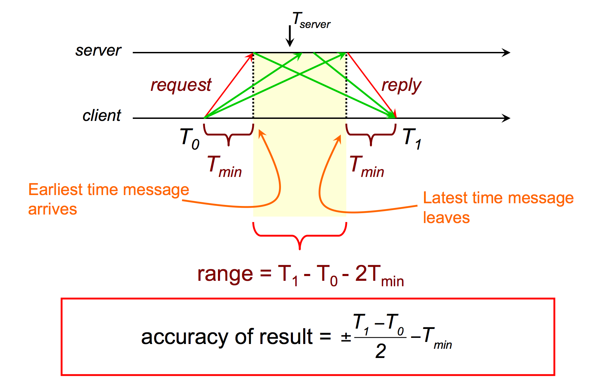
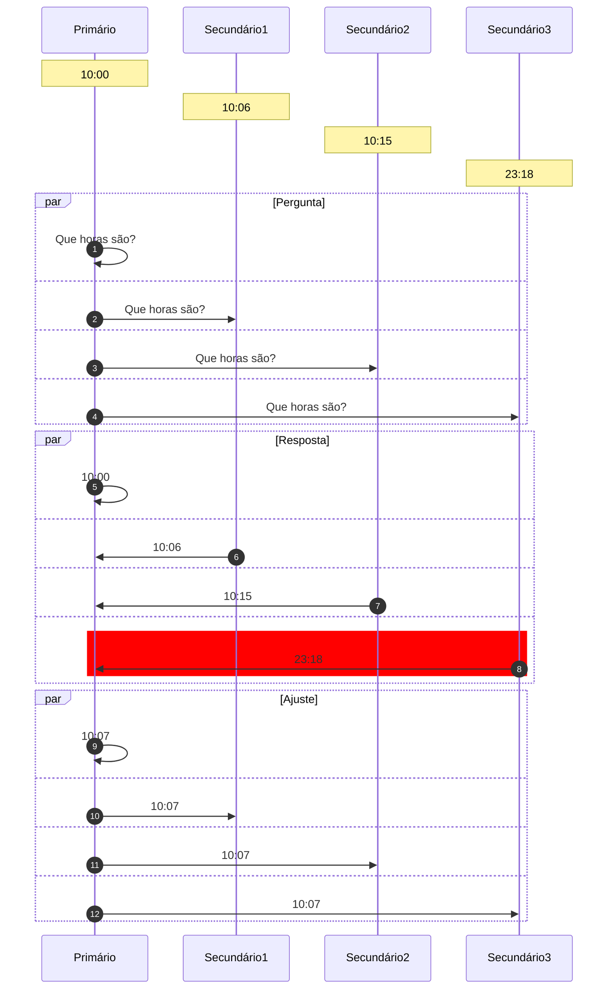

# Tempo

Neste capítulo discutiremos como o **tempo** é importante no desenvolvimento de sistemas distribuídos.
Comecemos por analisar o funcionamento de uma aplicação distribuída muito comum, o armazenamento de arquivos na nuvem, sincronizado com o sistema de arquivos local. 
Alguns exemplos do munto real são DropBox, Box, Google Drive and OneDrive; chamemos este serviço genericamente de **cloud-drive**.

Se um mesmo arquivo no cloud-drive é modificado em duas máquinas diferentes, enquanto as mesmas estão desconectadas, o quê acontece quando elas se reconectam à Internet?
Mais especificamente, quando as duas máquins se conectam e enviam suas versões do arquivo modificado para o servidor, sendo que ambas foram geradas a partir de um ancestral comum, qual versão deve ser armazenada e qual deve ser descartada?

Uma possibilidade simples é sempre aceitar o cada nova versão como uma modificação do arquivo.
Assim, efetivamente, quando a primeira versão for entregue, será aceita e viverá momentaneamente até que a outra versão seja recebida e a sobrescreva. 
Mas imagine que esteja usando o cloud-drive para registrar a anterioridade de ideias (quem pensou nisso primeiro?), registrando-as em arquivos salvos no cloud-drive. 
Neste caso, o sistema poderia dar anterioridade à entrada errada, que chegou por último.
Se invertermos a abordagem, o cloud-drive poderia manter versões antigas de um documento em detrimento de versões mais atualizadas, o que obviamente seria um problema para outros usos.

Mas mesmo que manter a versão mais recente ou mais antiga fosse adequada, o problema é mais fundamental que isso. Afinal, a ordem de chegada dos arquivos ao servidor não reflete necessariamente a ordem em que os arquivos foram criados.
Assim, podemos pensar em outras alternativas de aproveitamento e descarte de arquivos baseadas na **criação** do arquivo, e não em sua recepção. Contudo, o horário de criação de um arquivo é relativo a onde foi criado e não ao grupo de processos que compõe o sistema, o que pode levar uma modificação que tenha acontecido mais tarde, do ponto de vista de um observador externo, a ter um horário de criação oficial anterior.

Uma terceira abordagem é gerar uma terceira versão, com a "soma" das duas conflitantes. Para gerar esta terceira versão, faz mais sentido quebrar os arquivos em *operações de modificação*, e executar as operações de forma a chegar ao resultado final. O problema permanece, pois as operações agora devem ser ordenadas.

Em qualquer destas linhas de atuação, você tem em mãos um conflito para resolver, e automatizar a resolução do mesmo é muito complicado. É por isso que o Dropbox, por exemplo, deixa os dois arquivos para que o usuário analize e decida o que fazer, que servidores git permitem a submissão de apenas um conjunto de operações por vez para um mesmo repositório/branch, e o Perforce trabalha com *locks*  de arquivos.

Dada esta problemática, podemos simplificar a questão em nossas mãos.

!!!question "Pergunta"
     Se duas operações originadas em clientes são enviadas ao servidor, qual deve ser executada primeiro?

Alguns sistemas tentam resolver automaticamente os conflitos; o CassandraDB, por exemplo, usa **last write wins** ou **latest version wins**, onde *last* é definido em termos do relógio do cliente. 
Acontece que a maior parte dos nossos sistemas não dá garantias de tempo na entrega de mensagens ou processamento de instruções. Assim, temos novo problema:

!!!question "Pergunta"
      Como determinar qual foi enviada primeiro, em um sistema assíncrono?

Assim, precisamos encontrar uma **fonte de tempo confiável e distribuída**, e o desafio começa com o entendimento de relógios físicos.

## Relógios Físicos

Quando falamos em relógios, provavelmente falamos sobre relógios a base de quartzo.
Para uma introdução rápida, assista o seguinte vídeo.

<iframe width="560" height="315" src="https://www.youtube.com/embed/3jfgQF3jX7A" frameborder="0" allow="accelerometer; autoplay; encrypted-media; gyroscope; picture-in-picture" allowfullscreen></iframe>

Em suma, um relógio de quartzo consiste em um **diapazão de quartzo** cortado a laser que, devido ao **efeito Piezoelétrico**[^piezo] e sua forma particular, vibra a $32768 = 2^{15}$Hz[^freq], e em um contador que conta cada vibração, medindo a passagem do tempo.
Estes relógios erram na medição do tempo em no máximo **1/2s por dia**, desde que operem dentro da faixa de 5 a 35C, mas isso também muda com a idade do cristal, a corrente elétrica passando por ele e também devido a imperfeições no cristal[^quartz].

[^quartz]: [Explain that stuff.](https://www.explainthatstuff.com/quartzclockwatch.html)

[^piezo]: Distorção mecânica gera corrente elétrica e submissão a uma corrente elétrica gera uma distorção mecânica.
[^freq]: 32768 é a primeira potência de 2 maior que 20000, a maior frequência sonora audível aos seres humanos.

Computadores em geral usam relógios de quartzo, por serem baratos, como base de um relógio mantido em software.
Isto é, do ponto de vista de um computador comum, o tempo é medido com base em um relógio quartzo, cujos incrementos são capturados em um contador;
o contador gera **interrupções em intervalos programados** (e.g., Linux >2.6 usa 250Hz por padrão; máximo 1000Hz) e as interrupções causam ajustes em um **relógio em software**, um contador indireto $C$.

!!!question "Precisão"
     Dado a frequência padrão de 250Hz, medições de tempo menores que 4ms são altamente imprecisas.
     Como medir o tempo gasto em uma função do seu código?

Este relógio em software, $C$, que usa um relógio de quartzo, impreciso, pode marcar a passagem do tempo com erro para mais ou para menos. Embora o erro exato do relógio seja desconhecido, o mesmo é limitado probabilisticamente. 
A taxa de erro é denominada *drift*, é representada por $\rho$.

Assumindo um relógio perfeito, $t$, temos que $1 - \rho \leq \frac{dC}{dt} \leq 1 + \rho$.
Assim, um $\rho$ de 0.1 implica em um erro de mais ou menos 10%; a figura a seguir mostra a faixa em que $C$ pode operar e que o erro em relação a $t$ vai aumentando com a passagem do tempo.

Embora adequado para humanos, o erro dos relógios de quartzo é inaceitável em algumas operações computacionais. 
Felizmente, os erros do destes relógios podem ser minimizados ao ponto de termos um erros menores que 1s em milhões de anos, nos dispositivos conhecidos como **relógios atômicos**.

<iframe width="560" height="315" src="https://www.youtube.com/embed/p2BxAu6WZI8" frameborder="0" allow="accelerometer; autoplay; encrypted-media; gyroscope; picture-in-picture" allowfullscreen></iframe>

Embora muito bom, o relógio atômico também não é perfeito e, devido a várias razões, pode levar também a erros.
Mas o quê mais se pode fazer no sentido de melhorar a precisão dos relógios? A resposta está no UTC.

### Tempo Universal Coordenado 
O UTC, de uma mistura dos nomes em Inglês e Francês do Tempo Universal Coordenado, um padrão global para coordenação da medição da passagem do tempo.
Segundo o UTC, o sol está a pino às 12:00 na latitude 0, ou a no máximo 1s deste instante; ao redor da latitude 0 grau estabelece-se uma faixa em que todos os pontos tem o mesmo horário, e outras 23 faixas como esta com deslocamentos consecutivos de +-1 hora.
Estas faixas, conhecidas coloquialmente como fusos, sofrem ajustes por fatores políticos; a China, por exemplo, apesar de seu tamanho, está toda dentro de um mesmo horário, "correto" para Beijing.

](images/TimeZones.png)

Mas como o UTC é definido? Com base no TAI, Tempo Atômico Internacional, calculado como a média dos valores de relógios atômicos espalhados pelo globo. O TAI mede perfeitamente a passagem do tempo, mas como a rotação da terra é irregular, medir perfeitamente não é o adequado. Assim, o UTC leva em consideração o fato do dia não ter exatamente 24 horas e, de fato, não ter duração constante. Por exemplo, após um grande terremoto o centro de massa da terra pode ser alterado e a rotação ter sua velocidade aumentada ou diminuída.

!!!quote "UTC"
     Nearly all UTC days contain exactly 86,400 SI seconds with exactly 60 seconds in each minute. However, because the mean solar day is slightly longer than 86,400 SI seconds, occasionally the last minute of a UTC day is adjusted to have 61 seconds. The extra second is called a leap second. It accounts for the grand total of the extra length (about 2 milliseconds each) of all the mean solar days since the previous leap second. The last minute of a UTC day is permitted to contain 59 seconds to cover the remote possibility of the Earth rotating faster, but that has not yet been necessary.

### Sincronização de Relógios
Dado o UTC, temos então uma referência de tempo adequada para uso em sistemas computacionais, colocamos nova pergunta:

* Se o relógio se distância da medida correta da passagem do tempo, é possível corrigir este distanciamento, sincronizando-o com uma fonte correta, da qual UTC é nossa melhor aproximação, para que todos percebam a mesma passagem do tempo?

Embora a resposta seja negativa, no sentido de que não é possível alcançar sincronização perfeita, nada nos impede de fazer um melhor esforço e, neste sentido, também temos que nos perguntar qual a frequência de sincronização?

!!!question "Frequência de Sincronização"
      Como garantir que dois relógios com erro máximo igual a $\rho$ não diferirão em mais que $\delta$ unidades de tempo?

???answer "Resposta"
      Sincronize pelo menos a cada $\frac{\delta}{2\rho}$ segundos.

E se tivermos muitos relógios a serem sincronizados, o problema é mais difícil?

!!!question "Frequência de Sincronização"
      Como garantir que dois relógios quaisquer, em um sistema com $n$ relógios, todos com erro máximo igual a $\rho$, não diferirão em mais que $\delta$ unidades de tempo?

???answer "Resposta"
      Se todos sincronizarem com a mesma fonte, a cada $\frac{\delta}{2\rho}$ segundos, seja o nó n1 aquele com maior erro em relação à fonte e n2 aquele com maior erro em relação a n1. Como ambos tem um erro máximo de $\delta$ em relação à fonte, o erro máximo entre os dois nós é $2\delta$. Como este erro é o dobro do desejado, basta dobrar a frequência de sincronização para cortar o erro pela metade.

Vejamos um exemplo:

* $\rho = 0,1$
* $\delta$ = 1s
* Após 10s, um nó com estas características se dessincronizaria em, no máximo, 1s em relação ao UTC. 
* Como cada nó poderia estar errando em "direções"  diferentes, após 5s, um nó poderia se adiantar em 0,5s enquanto o outro se atrasa pela mesma quantidade de tempo, somando 1s de diferença. Logo, eles tem que se sincronizar a cada 5s, i.e, $\frac{\delta}{2\rho} = \frac{1s}{2 \times 0,1} = \frac{1s}{0,2} = 5s$

Como última parada antes de começarmos a falar sobre a sincronização em si, devemos estabelecer alguns cuidados a serem tomados no processo.

* Nunca voltar no tempo - isso poderia levar a um dado ter data de edição anterior a data de criação.
* Ajustes graduais -  acelere ou desacelere o relógio (em software)
    * Diminua/Aumente frequência de interrupção para atrasar/adiantar relógio
    * Diminua/Aumente incremento com cada interrupção
* Ajustes periódicos para fazer curvas convergirem.
* Correção após dormir será mais drástica

Agora que você já tem uma fonte confiável de tempo, o UTC, e sabe com que frequência sincronizar os relógios, só nos falta fazer a sincronização. 
Contudo, falta ainda definir o protocolo pelo qual a sincronização é feita e exatamente com quem, uma vez que simpleste UTC é muito genérico. 
Comecemos com vetor "próximo" do UTC, os relógios atômicos em satélites GPS.

#### Global Positioning System
Receptores GPS, com seus relógios sincronizados com os dos satélites, que difundem regularmente sua posição e o instante em que a difusão é feita, determinam sua posição relativa aos satélites, em uma técnica conhecida como trilateração, que consiste em determinar a distância do receptor em termos dos eixos $x$, $y$ e $z$ em relação a cada um dos satélites. 

Em outras palavras, baseado na informação de um satélite, o receptor determina sua distância ao mesmo e, portanto, determina que está em uma esfera no entorno do satélite.
Combinando a informação de 2 satélites, a posição do receptor é limitada a uma circunferência, isto é, a interseção de duas esferas. 
Com um terceiro satélite, a posição é reduzida a dois pontos, a interseção de uma esfera e uma circunferência, sendo um no espaço e que pode ser facilmente descartado. 

Contudo, para que funcione, relógios dos satélites e receptores precisam estar sincronizados para que o cálculo da distância possa ser feito, mas sincronizar os relógios é exatamente o problema que estamos tentando resolver. Para contornar esta restrição, usa-se um quarto satélite, para determinar a distância no "eixo temporal".

Assim, temos uma receita simples para sincronização de relógios com UTC:

* Coloque um receptor GPS em cada nó do seu sistema
* Tenha erro de 0,1ns a 1ms do UTC

Apesar da queda dos preços dos receptores, colocar um GPS em cada dispositivo pode ser custoso demais. 
Em vez disso, podemos usar um recurso amplamente disponível, redes de computadores, e sincronizar com outra máquina, que fez o investimento necessário para manter o erro baixo.
Para estes computadores "de segundo escalão", a receita então é:

* Pergunte que horas são.
* Use a resposta para ajustar o relógio local.
* Considere o erro introduzido pela latência variável da rede.

Esta receita básica pode ser ajustada de diversas formas.

#### Algoritmo de Cristian

Assumindo que o relógio da máquina se sincronizando, $M_1$, é bom o suficiente para medir a passagem de tempo em períodos curtos, mesmo que tenha uma *drift* rate considerável em períodos mais longos, execute o seguinte protocolo para se sincronizar com $M_2$.

* $M_1$ pergunta "que horas são?" - $t_0$
* $M_2$ recebe pergunta - $t_1$
* $M_2$ anota o valor do relógio - $t_s$
* $M_2$ envia resposta - $t_2$
* $M_1$ recebe resposta - $t_3$

* Assuma $t_1 = t_s = t_2$

* Assuma $\frac{t_3-t_0}{2}$ como o tempo de transmissão da resposta (média da ida e da volta)
* $M_1$ ajusta relógio para $t_c = t_s + \frac{t_3-t_0}{2}$

Mas e a aproximação $\frac{t_3-t_0}{2}$, é boa?
Podemos estimar o erro que ela introduz na sincronização, caso as mensagens tenham tempos de ida e volta assimétricos. Apesar das diferenças no tempo de ida e volta, existe um **tempo mínimo** para o tráfego em cada um dos sentidos, $T_{min}$.
A figura a seguir demonstra o erro desta técnica

[Fonte](https://www.cs.rutgers.edu/~pxk/417/notes/content/05-clock-synchronization-slides.pdf)

Observe que há dois casos extremos de erro na estimativa.
No primeiro caso, dado um tempo de ida + volta igual a $T_1 - T_0$, na figura, a mensagem de ida trafega no tempo mínimo e a volta lentamente. Neste caso, a estimativa $\frac{t_3-t_0}{2}$ é menor que o tempo de volta real.
No segundo caso, a mensagem de ida trafega lentamente e a de volta no tempo mínimo, levando $\frac{t_3-t_0}{2}$ a ser maior que tempo de transmissão real da mensagem.
O erro, contudo, está limitado à faixa amarela no desenho, que tem duração $T_1 - T_0 - 2T_{min} $. 
O erro então varia de mais ou menos metade deste valor. 

#### Algoritmo de Berkeley

Enquanto o algoritmo de Cristian permite sincronizar um nó com uma fonte, outro algoritmo, de Berkeley, permite sincronizar múltiplos nós uns com os outros. Este algoritmo assume o que não há uma "fonte da verdade" do tempo, mas sim a necessidade de que todos os processos converjam para um mesmo valor do relógio. É como nos filmes de espião em que os relógios são sincronizados; pouco importa se a bomba explodirá 10:57 ou 10:59, desde que todos concordem quando isso vai acontecer. Isso é o que chamamos de **sincronização interna** em vez de externa, como provido pelo algoritmo de Cristian.

O algoritmo de Berkeley requer que todo nó execute um processo de sincronização, um "daemon", e separa seus papéis em dois tipos, **primário** e **secundário**.
O papel do primário pode ser rotacionado entre os vários processos, sem perdas para sua execução. O algoritmo então é executacomo se segue:

* Primário pergunta "que horas são" para cada secundário (mensages 1,2,3 e 4)
* Secundário responde com valor atual do relógio (mensagens 5,6,7 e 8)
* Primário ajusta as respostas de acordo com o algoritmo de Cristian, para minimizar erros.
* Primário computa média dos valores recebidos, ignorando *outliers* (como o da mensagem 8).
* Primário envia **ajustes** para secundários (mensagens 8,9,10 e 11)
* Secundário executa ajuste sugerido pelo primário.

    
Embora interessantes, estes algoritmos não são normalmente usados, pelo menos não em sua forma "pura", em sistemas computacionais. Em vez deles, usamos o Network Time Protocol (NTP).

#### Network Time Protocol

* 1991/1992: RFC 1305
* 2010: RFC 5905-5908 -- IPv6, 10s ms de acurácia
* Uso na Internet
* Sincronização com UTC
* Estatística permite minimizar erros
* Tolerante a falhas: caminhos redundantes; servidores redundantes
* Escalável: modelo hierárquico
* Seguro: usa autenticação

---

Os diversos componentes do NTP são organizados em camadas, ou estrata, de forma que a informação do tempo flui da camada 0 (stratum 0) até a camada 15 (stratum 15).
Os componentes não estão presos a camadas, que podem ser alteradas a medida que falhas acontecem e são dedicadas, e novos caminhos são encontrados usando-se um algoritmo de árvore geradora mínima.

---
##### Network Time Protocol

[Fonte: Benjamin D. Esham, (bdesham) - Based upon Ntp.png by Kim Meyrick](https://commons.wikimedia.org/w/index.php?curid=2815097)

* Stratum 0: relógios atômicos/receptores GPS
* Stratum 1: ms to stratum 0
* Stratum 2: contata múltiplos stratum 1 e pares
* Strata 3...15
* Stratum 16: dessincronizado
* Bellman-Ford: árvore geradora mínima para stratum 1

---

O sítio do Comitê Gestor da Internet, CGI, tem uma entrada muito boa sobre o NTP, [NTP.br](https://ntp.br/ntp.php).
De forma resumida, o NTP trabalha em diferentes modos, que permitem aos nós receberem informações de fontes de tempo das camadas superiores ou de pares, filtrar estas informações para escolher as mais confiáveis, e ajustar o relógio local de acordo com a filtragem.

---
##### Modos de trabalho do NTP

* Modo multicast: propaga tempo em rede local
* RPC: algoritmo de Cristian
* Simétrico: parecido com Berkeley

---

Na prática, boa parte dos dispositivos usa uma versão simplificada do NTP, adequada aos nós nas folhas da hierarquia. O SNTP é essencialmente o algoritmo de Cristian.

---
##### Simple NTP

* Versão simplificada do NTP
* Recomendado para folhas da árvore
* $\delta = (t_4-t_1)-(t_2-t_3)$
* $t = \frac{(t_2-t_1)+(t3-t_4)}{2}$
* $t_c = t_4+t$

---

Veja um exemplo do ajuste de um relógio usando SNTP.

---
##### Exemplo do SNTP

* $t_1 = 1100, t_2 = 800, t_3=850, t_4=1200$
* $t = ((800-1100)+(850-1200))/2 = (-300 -350)/ = -325$
* $t_c = 1200-325 = 875$

---

Mais recentemente foi proposta um novo protocolo de sincronização de relógios com melhor qualidade de servço,  Precision Time Protocol, PTP.

---
##### PTP - Precision Time Protocol

* IEEE 1588
* LAN
* sub $\mu s$ (versus ordem de $ms$ no NTP)

* Escolha mestre
	* Administrador
	* Classe do relógio
	* Acurácia do relógio
	* Variância do relógio
	* Identificador
* Como algoritmo de Cristian, mas quem ajusta não é quem inicia.

---

Assumindo que tenhamos sincronizado os relógios de um sistema computacional, o que podemos fazer agora? Há uma série de problemas interessantes que podem ser resolvidos.

### Usos de relógios sincronizados

* autenticação
* terminação de transações 
* alocação de ``leases''.
* outros exemplos, [Liskov, B. Distrib Comput (1993) 6: 211. doi:10.1007/BF02242709](http://rdcu.be/s4iy)

Um exemplo interessante é a ordenação de eventos em um banco de dados.
Para entender este problema, considere o seguinte cenário com um Sistema Bancário

Se os comandos chegam primeiro para a replica mais próxima e são executados na ordem em que chegam, temos inconsistências entre as réplicas (p.e., assuma que update 1 é "atualize para 10" e 2 é "atualize para 20")

Assim, precisamos ordenar os comandos!
Nos foquemos em apenas uma réplica.
Assuma que relógios estão **perfeitamente** sincronizados, que o tempo de propagação máximo de uma mensagem é $\tau$, e que toda mensagem/update carrega o *timestamp* de quando foi enviada consigo.
Considere o seguinte proposta:
Réplicas processam mensagens na ordem que foram enviadas, o que pode ser identificado pelos seus timestamps.
Em outras palavras, ao receber uma mensagem com timestamp $t$, uma réplica espera até ter certeza de que 

---
##### Ordenação de Requisições

* Relógios **perfeitamente** sincronizados
* $\tau$.
* Cliente 1 envia mensagem Update1 no instante $t$.
* Ao receber Update1 com timestamp $t$, a réplica deve esperar para executar o update?

    

    O último instante em que qualquer mensagem com timestamp $t' < t$ pode ser recebido pela réplica é $t+\tau$, pois qualquer mensagem recebida em $t''> t+\tau'$, precisa ter sido enviada após $t$, e portanto terá timestamp $> t$. 

---

Implementar este protocolo é muito simples:

  * Toda mensagem recebida é colocada em uma fila ordenada por *timestamp*.
  * Quando o relógio marcar um tempo maior que $t + \tau$, onde $t$ é o timestamp da mensagem na cabeça da fila, execute tal mensagem e a retire da fila.

Entretanto, este protocolo não leva em consideração a dessincronização inerente dos relógios em um sistema distribuído. Como fazê-lo, supondo uma divergência máxima de $\Delta$ entre quaisquer dois relógios, algo que pode ser arranjado, como visto antes, sincronizando-se os relógios a cada $\frac{\Delta}{2*\rho}$.

Se $\Delta$ é a diferença máxima entre relógios, então após o uma mensagem ser enviada com timestamp $t$, até $\Delta$ depois, outro processo, atrasado em relação ao primeiro, poderá enviar uma mensagem com timestamp $t' < t$. Tal mensagem pode demorar até $\tau$ para ser entregue à réplica, ou seja, no instante $t + \tau + \Delta$, do ponto de vista do primeiro cliente.

Se a réplica estiver sincronizada com cliente, então se esperar até $t + \tau + \Delta$ para executar o comando, o fará de forma segura. Se estiver atrasada em relação ao primeiro cliente, então acabará por esperar além do necessário, mas sem violar a corretude do sistema.

Finalmente, se a réplica estiver adiantada em relação ao primeiro cliente, então seu relógio alcançará $t + \tau + \Delta$ antes do relógio do primeiro cliente, mas isso não é um problema. Isto porquê, o último instante em que o cliente 2 poderá enviar uma mensagem com timestamp $t' < t$ é o instante em que o relógio da réplica marcar $t + \Delta$, e portanto deverá também ser recebido até que o mesmo relógio marque $t + \tau + \Delta$. 

---
##### Ordenação de Requisições

* Relógios **dessincronizados**
* $\tau$.
* $\Delta$

O último instante em que qualquer mensagem com timestamp $t' < t$ pode ser recebido pela réplica é $t+\tau + \Delta$, pois qualquer mensagem recebida em $t''> t+\tau + \Delta'$, precisa ter sido enviada após $t+\Delta$, e portanto terá timestamp $> t$. 

---

O mesmo raciocínio pode ser usado para definir um protocolo de acesso recursos para os quais *leases* são distribuídos, onde um *lease*  é uma permissão de acesso durante uma janela de tempo, emitida por um coordenador (possivelmente eleito usando os algoritmos vistos anteriormente), e $\Delta$ é o máximo de dessincronismo entre os relógios. 
O seguinte protocolo resolve este problema:

---
##### Lease

* $\Delta$ - dessincronização máxima.
* Ao receber um *lease* para a janela de tempo $t_1$ a $t_2$
    * espera até $t_1 + \Delta$
    * usa o recurso até $t_2$.

* Se relógio estiver adiantado em relação ao cliente anterior, vai achar que é $t_1+\Delta$ enquanto o anterior acha que é $t_1$; exclusão mútua garantida.
* Se relógio estiver atrasado em relação ao cliente anterior, vai achar que é $t_1 - \Delta$, e continua esperando, enquanto ele acha que já é $t_1$ e para de usar; exclusão mútua garantida.
* Recurso fica ocioso por $\Delta$, em média, a cada lease. 

---

Devido ao alto custo de se manter o recurso não utilizado, $\Delta$ deve ser feito tão pequeno quanto possível. Leia [Google True Time e Spanner](https://cloud.google.com/spanner/docs/true-time-external-consistency) para como o Google consegue manter a diferença em sub milisegundos, usando relógios atômicos dentro de seus datacenters e um API para geração de timestamps.

## Tempo Lógico

### Relógios lógicos
Nas soluções anteriores, um nó precisa esperar por muito tempo antes de usar um recurso. 
E se ele aprendesse antes que os outros nós não farão requisições? 
Que não haverão sobreposições de requisições? 
E se houvesse um relógio que avançasse não com o tempo, mas com eventos interessantes do sistema?
Esta é a ideia dos **relógios lógicos**.

---
###### Relógios Lógicos
* Envio e recepção (e possivelmente outros eventos) fazem o relógio ``ticar''.
* Processos podem usar este relógio para concordar na **ordem** dos eventos, mesmo que não no **instante** do evento.
* Não há **fonte da verdade** em termos de tempo.
* Cada processo mantém seu próprio relógio que pode ser relacionado com relógios de outros processos.

Para chegarmos aos relógios lógicos, precisamos primeiro entender a relação *Happened-Before*, proposta por Leslie Lamport em [Time, Clocks and the Ordering of Events in a Distributed System. July 5, 1978](http://amturing.acm.org/p558-lamport.pdf), que lhe rendeu um [Prêmio Turing em 2014](https://www.microsoft.com/en-us/research/blog/leslie-lamport-receives-turing-award/).
Neste artigo, se estabelece o vocabulário para falar sobre ordem de eventos em um sistema computacional, em especial um distribuído.

---
##### Happened-Before
* $a \rightarrow b$: evento $a$ aconteceu antes do evento $b$
* Considerando um único processo (thread):
  * Se $a$ foi executado antes de $b$ no processo, então $a \rightarrow b$.
* Considerando dois processos:
  * Se $a$ é o envio de uma mensagem e $b$ sua recepção, então $a \rightarrow b$.
* Transitividade faz sentido:
  * Se $a \rightarrow b$ e $b \rightarrow c$, então $a \rightarrow c$

---

Esta relação captura a **causalidade** entre eventos. Isto é, se $a \rightarrow b$ então $a$ potencialmente causou $b$ ($a$ precede $b$ em uma ordem causal).
Note que se $a \rightarrow b$ é falso e $b \rightarrow a$ é falso, então $a$ e $b$ são **concorrentes**.

Se capturarmos a causalidade de eventos, podemos usar esta informação para ordenar o se processamento, de forma a fazer sentido.
Considere o seguinte exemplo:

TODO: Exemplo e emails com pergunta e respostas.

Para que computadores possam usar a causalidade, precisamos capturar a relação de acontecer antes em um sistema.
Lamport propôs uma tal forma, que denominou relógio lógico, mas que hoje é conhecido universalmente como Relógios de Lamport.
Estes relógios permitem associar um *timestamp* a eventos de forma a se garantir a seguinte propriedade:
* seja $e$ um evento
* seja $C(e)$ o valor do relógio lógico quando associado a $e$
* se $a \rightarrow b$ então $C(a) < C(b)$

Mas como definir a função $C$?
Experimentemos a seguinte definição:
* Seja $c_p$ um contador em $p$ com valor inicialmente igual a 0.
* $C(e) = c++$ no momento em que $e$ ocorreu.
* Usamos como $ < $ a relação normal de inteiros.
Assim, cada processo conta os eventos executados localmente.
Veja um exemplo desta definição em ação.

!(LC - Primeira tentativa)(imagess/lc_cont.png)

É verdade neste cenário que se $a \rightarrow b$ então $C(a) < C(b)$?  
Observe com atenção os eventos $f$ e $k$. Para estes, a regra não é respeitada.
Para que seja, precisamos garantir que, na recepção de uma mensagem, os contadores sejam atualizados para que sejam maiores tanto que os relógios dos eventos locais quanto dos eventos que antecederam o envio da mensagem sendo recebida.
Com este ajuste, temos os Relógios de Lamport.

## Lamport Clock

* Seja $c_p$ um contador em $p$ com valor inicialmente igual a 0.
* Se o evento $e$ é uma operação local, $C(e) = ++c$ no momento em que $e$ ocorreu.
* Se o evento $e$ é o envio de uma mensagem, então $C(e)$ é enviado com a mensagem como seu timestamp.
* Se o evento $e$ é a recepção de uma mensagem com timestamp $ts$, então $C(e) = max(c,ts)+1$.

!(LC - Primeira tentativa)(imagess/lc_lamport.png)

Neste caso, temos que para quaisquer eventos $a,b$,  se $a \rightarrow b$ então $C(a) < C(b)$.

TODO: Exemplo em que não é bom o suficiente.

Se $a \rightarrow b$ então $C(a) < C(b)$. Contudo, a volta não é verdade, isto é, se $C(a) < C(b)$ então $a \rightarrow b$.
Esta propriedade é interessante na ordenação de eventos, pois evita que eventos concorrentes sejam ordenados.
Entram os relógios vetoriais.

## Relógio vetorial
Sejam $n$ processos. No processo $p$
* Seja $c_p[i], 1 \leq i \leq n$ um contador, inicialmente igual a 0.
* Se o evento $e$ é uma operação local, $c_p[p]++$ e $C(e) = c_p$ no momento em que $e$ ocorreu.
* Se o evento $e$ é o envio de uma mensagem, então $C(e)$ é enviado com a mensagem como seu timestamp.
* Se o evento $e$ é a recepção de uma mensagem com timestamp $ts$ de $q$, então
  * $c_p[i] = max(c_p[i], ts[i]), i \neq p$
  * $c_p[p]++$
  * $C(e) = c_p$

!(Relógio Vetorial)[images/lc_vc.png]

Como dito, este relógio lógico tem a seguinte propriedade: se $a \rightarrow b \RightLeftArrow C(a) < C(b)$.
Mas como é defido $ < $ para vetores?
* $V = V' \iff V[i] = V'[i], 1 \leq i \leq n$
* $V \leq V' \iff V[i] \leq V'[i], 1 \leq i \leq n$

Sejam dois eventos $e$ e $e'$
* Se $e \rightarrow e' \iff V(e) < V(e')$
* Se $V(e) \not\leq V(e')$ e $V(e') \not\leq V(e)$, são concorrentes.

Mas o que quer dizer $c_p[q] = k$?
Quer dizer que $p$ sabe que $q$ enviou $k$ mensagens.
E daí? O que pode ser feito com isso?  
Com estes mecanismos é possível implementar
* Multicast Totalmente Ordenado:
  * Multicast: mensagens são enviadas de 1 para n (comunicação em grupo)
  * Totalmente Ordenado: todos os processos entregam as mensagens na mesma ordem
* Multicast Causalmente Ordenado:
  * Causalmente Ordenado: uma mensagem só é entregue se todas as que causalmente a precedem já foram entregues.

Novamente você pergunta, e daí? Bem, com estas abstrações, podemos resolver problemas interessantes como o seguinte.
Considere um programa qualquer, que se comporte de forma determinística (isto é, dada uma mesma entrada, gera sempre uma mesma saída). Como todo programa, este é uma máquina de estados, com a peculiaridade de ser determinística.
Logo, se tivermos várias cópias deste programa, executando em locais distintos, mas garantirmos que cada cópia verá exatamente a mesma entrada de dados, então garantiremos que todas as cópias transitarão pelos mesmos estados e chegarão ao mesmo estado final.
Acontece que multicast totalmente ordenado pode garantir exatamente isso, que todas as cópias receberão a mesma entrada.

!(State Machine Replication)[images/06-11.png]

Esta técnica é conhecida como Replicação de Maáquinas de Estados (em inglês, (*State Machine Replication*)[https://en.wikipedia.org/wiki/State_machine_replication]), ou pelo menos o seu princípio.

Mas como podemos implementar estas primitivas de multicast usando relógios lógicos?
Considere o seguinte algoritmo.

---
###### Multicast totalmente ordenado
* Fila com prioridade em cada processo.
* Mensagens são enviadas a todos os processos e colocadas em uma fila local.
* Mensagens recebidas são colocadas na fila local e ack é enviado de volta.
* $p$ só entrega uma mensagem $m$ recebida de $q$, com timestamp $ts$ quando
  * $m$ está na cabeça da fila de $p$
  * Para cada processo $q$, há uma mensagem $m'$ de $q$, $ts'$, na fila de $p$ tal $ts < ts'$
* Canais confiáveis e FIFO.

---

---
###### Multicast causalmente ordenado

* Mensagens são enviadas a todos os processos.
* $p$ incrementa $c_p[p]$ somente no envio de mensagens.
* $p$ só entrega uma mensagem recebida de $q$, com timestamp $ts$ quando
  * $ts[q] = c_p[q]+1$
  * $ts[k] \leq c_p[k], k \neq q$

\includegraphics[width=.5\textwidth]{images/06-13}

Considere $c_{P_2}[0,2,2]$ e $ts=[1,3,0]$, de $P_0$. O que $P_2$ está esperando? Como age ao receber mensagem com $ts$?

---

## Exclusao Mútua Revisitada

Retorno à exclusão mútua

TODO: (Algoritmos de Excluão mútua baeados em LC)[http://www.cs.cmu.edu/~dga/15-440/F10/lectures/Distributed-Mutual-Exclusion-slides.pdf]

TODO: Algoritmo de Lamport, Ricart e agrawalla

TODO: Algoritmo de (Maekawa)[https://www.coursera.org/learn/cloud-computing-2/lecture/GMHYN/2-4-maekawas-algorithm-and-wrap-up]

## Relógios Híbridos

TODO: (Google TrueTime)[https://cloud.google.com/spanner/docs/true-time-external-consistency)

## Hibrid Logical Clocks

!(Hibrid Logical Clock)[images/lc_hybrid]

Onde se lê 3,13, leia-se 3,10,3.

(Fonte)(http://muratbuffalo.blogspot.com.br/2014/07/hybrid-logical-clocks.html)

## Interceptadores
!(Transparente para a aplicação)[images/06-10]
