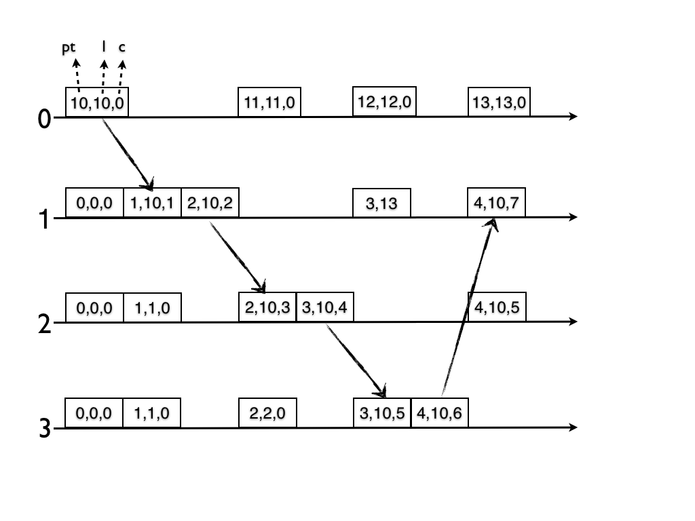

# Tempo Lógico

A ideia por trás do "tempo lógico" é de o que importa são eventos e não a passagem do tempo, uma vez que tempo é relativo aos processos [^tempologico].
Assim, surgem os relógios lógicos, que ``ticam'' quando um evento importante acontece.

[^tempologico]: Reza a lenda que Leslie Lamport desenvolveu o conceito de relógios lógicos pensando na teoria da relatividade geral.

Para chegarmos aos relógios lógicos, precisamos primeiro entender a relação ***Happened-Before***, proposta por Leslie Lamport[^tcoeds] e que lhe rendeu um [Prêmio Turing](https://amturing.acm.org/) em [2014](https://www.microsoft.com/en-us/research/blog/leslie-lamport-receives-turing-award/).
Hoje é comum usar a relação *happened-before* e o vocabulário associado para falar sobre ordem de eventos em um sistema computacional, em especial um distribuído.

[^tcoeds]: [Time, Clocks and the Ordering of Events in a Distributed System. July 5, 1978](http://amturing.acm.org/p558-lamport.pdf).

### Happened-Before

A relação *happened-before* captura a **causalidade** entre eventos.
Isto é, se um evento $e$ **aconteceu-antes** de um evento $e'$, então $e$ potencialmente causou $e'$.
Também podemos dizer que $e$ precede $e'$ em uma ordem causal.

O evento $a$ aconteceu-antes $b$, notado como $a \rightarrow b$, se uma das três condições seguintes é válida:

!!!note "Happened-Before"
    * Se $e$ e $e'$ são eventos em um mesmo processo (ou *thread*) e $e$ foi executado antes de $e'$.
    * Se $e$ e $e'$ são eventos de processos distintos e $e$ é o envio de uma mensagem e $e'$ a sua recepção.
    * Se há transitividade, isto é, se existe um evento $e''$ tal que $e \rightarrow e''$ e $e'' \rightarrow e'$.

Na figura abaixo, as três regras são exemplificadas pelos eventos de cor vermelha, amarela e verde, respectivamente.

Note que se $e \rightarrow e'$ é falso e $e' \rightarrow e$ é falso, então $e$ e $e'$ são **concorrentes**, e que ser concorrente não quer dizer que aconteceram exatamente no mesmo instante, do ponto de vista de um observador externo, como exemplificado na figura anterior pelos eventos de cor roxa.
Ser concorrente quer dizer que um evento $e$ não pode ter influenciado o evento $e'$, dado que os efeitos de $e$ não poderiam ser conhecidos pelo processo onde $e'$ ocorreu, quando $e'$ ocorreu.
O cone de luz na figura seguinte mostra esta relação entre eventos. Somente os efeitos dos eventos uma distância no espaço/tempo menor ou igual às dos pontos mais distantes ao evento em questão, podem ter influenciado tal evento. No caso dos eventos $o$ e $v$ na figura, os mesmos não figuram no mesmo cone de luz.

Mas para que nos serve capturar a causalidade entre os eventos? Bem, se capturarmos a causalidade, podemos usar esta informação para ordenar os seu processamento, de forma a fazer sentido.
Por exemplo, considere um sistema em que o primeiro usuário de um serviço de emails recebe primeiro a resposta da mensagem A, R:A, para somente depois receber A.
Para que a troca de mensagens faça sentido, o usuário posterga a leitura de R:A até depois de ter lido A.

Observe que em nenhum momento a informação sobre **quando** as mensagens foram enviadas foi necessária, apenas a **ordem** das mesmas.
Relógios lógicos permitem que sistemas capturem a relação de causalidade entre eventos e implementem esquemas como o apenas descrito, para coordenar as ações dos processos em sistemas distribuídos.

### Relógios lógicos
Para que computadores possam usar a causalidade, precisamos capturar a relação de acontecer antes em um sistema.
Lamport propôs uma tal forma, que denominou **relógio lógico**, mas que hoje é conhecido universalmente como **relógio de Lamport**.
Estes relógios permitem associar um *timestamp* a eventos de forma a se garantir a seguinte propriedade:

* seja $e$ um evento
* seja $C(e)$ o valor do relógio lógico quando associado a $e$
* se $e \rightarrow e'$ então $C(e) < C(e')$

Mas como definir a função $C$?
Experimentemos a seguinte definição:

!!!example "Quase Relógio de Lamport"
     * Seja $c_p$ um contador em $p$ com valor inicialmente igual a 0.
     * $C(e) = ++c_p$ no momento em que $e$ ocorreu.
     * Usamos como $<$ a relação normal de inteiros.

Observe que não há **fonte da verdade** em termos de tempo lógico, já que **cada processo mantém seu próprio relógio** que pode ser relacionado com relógios de outros processos.
Veja um exemplo desta definição em ação.

É verdade neste cenário que se $a \rightarrow b$ então $C(a) < C(b)$?  
Observe com atenção os eventos $j$ e $q$, pois para estes, a regra não é respeitada.

#### Relógio de Lamport
Para que a regra $e \rightarrow e'$ então $C(e) < C(e')$ seja válida, precisamos modificar a tentativa anterior para que, na recepção de uma mensagem, os contadores sejam atualizados para que sejam maiores tanto que os relógios dos eventos locais quanto dos eventos que antecederam o envio da mensagem sendo recebida.

!!!example "Relógio de Lamport"
    * Seja $c_p$ um contador em $p$ com valor inicialmente igual a 0.
    * Se o evento $e$ é uma operação local
        * $c_p \gets c_p + 1$
        * $C(e) \gets c_p$
    * Se o evento $e$ é o envio de uma mensagem
        * $c_p \gets c_p + 1$
        * $C(e) \gets c_p$
        * $C(e)$ é enviado com a mensagem como seu *timestamp*.
    * Se o evento $e$ é a recepção de uma mensagem com *timestamp* $ts$
        * $c_p \gets max(c_p,ts)+1$.
        * $C(e) \gets c_p$

Com este ajuste, temos os **Relógios de Lamport**.

Neste caso, temos que para quaisquer eventos $e,e'$,  se $e \rightarrow e'$ então $C(e) < C(e')$.

???todo
    Exemplo em que não é bom o suficiente.

Se $e \rightarrow e'$ então $C(e) < C(e')$. Contudo, a volta não é verdade, isto é, se $C(e) < C(e')$ então $e \rightarrow e'$.
Esta propriedade é interessante na ordenação de eventos, pois evita que eventos concorrentes sejam ordenados.
Entram os relógios vetoriais.

#### Relógio Vetorial
**Relógios vetoriais** são relógios lógicos em que cada processo mantém não apenas um contador dos seus eventos locais, mas também sua visão dos contadores dos outros processos.
Estas visões são atualizadas a cada recepção de mensagem, de acordo com a seguinte especificação, onde assume-se que $n$ processos fazem parte do sistema.

!!!example "Relógio Vetorial"
    Considerando o ponto de vista do processo $p$

    * Seja $c_p[i], 1 \leq i \leq n$ inicialmente igual a 0
    * Seja um evento $e$
        * Se $e$ é uma operação local
            * $c_p[p] \gets c_p[p] + 1$
            * $V(e) \gets c_p$
        * Se $e$ é o envio de uma mensagem
            * $c_p[p] \gets c_p[p] + 1$
            * $V(e) \gets c_p$
            * $V(e)$ é enviado com a mensagem como seu timestamp.
        * Se $e$ é a recepção de uma mensagem com timestamp $ts$ de $q$, então
            * $c_p[p] \gets c_p[p] + 1$
            * $c_p[i] \gets max(c_p[i], ts[i]), \forall i \neq p$
            * $V(e) \gets c_p$

Uma observação interessante a ser feita aqui é que embora o algoritmo pareça indicar que cada processo precisa saber quantos mais processos existem no sistema, isto não é verdade, pois pode-se assumir que para todo processo desconhecido $q$, $c_p[q] = 0$.

Como dito, este relógio lógico tem a propriedade $e \rightarrow e' \iff V(e) < V(e')$, considerando-se a seguinte definição de $<$ para vetores:

!!!note "Comparação entre vetores"
     * $v = v' \iff v[i] = v'[i], 1 \leq i \leq n$
     * $v \leq v' \iff v[i] \leq v'[i], 1 \leq i \leq n$
     * $v < v' \iff v \leq v' \land v \neq v'$

Assim, sejam dois eventos $e \neq e'$:

* $e \rightarrow e' \iff V(e) < V(e')$
* Se $V(e) \not < V(e')$ e $V(e') \not < V(e)$, então $e$ e $e'$ são concorrentes.

Para entender melhor como esta definição funciona, considere a seguinte execução.
O que quer dizer $c_p[q] = k$, ou tomando o evento $d$ como exemplo, o que quer dizer $V(d) = (4,1,0)$?

Quer dizer que $p1$ está ciente de 1 eventos locais a $p2$, assim com está ciente de 0 eventos em $p3$ e de que $d$ é o quarto evento em $p1$.
Agora compare os eventos $o$ e $v$.
$o$ e $v$ são concorrentes pois embora as posições 1 e 2 de $V(o)$ sejam maiores que em $V(v)$, a posição 3 é menor.
Isso quer dizer que o nem $o$ está ciente do evento $v$ e nem $v$ está ciente do evento $o$, ou melhor, que um não pode ter causado o outro.

Esta abstração simples já é muito poderosa e, embora possa ser melhorada,[^matrix_clock] já é suficiente para se implementar outras abstrações interessantes, como será visto adiante.
Antes, é necessário mencionar mais um tipo de relógio lógico, os híbridos.

[^matrix_clock]: [Matrix Clock](https://en.wikipedia.org/wiki/Matrix_clock)

#### Relógios Híbridos

A grande vantagem dos relógios lógicos sobre os físicos é de ignorar a passagem do tempo, só se importanto com a ordem de eventos.
Esta vantagem também é uma desvantagem quando eventos precisam ser associados a eventos externos ao sistema, por exemplo, durante uma sessão de depuração.
Suponha que após uma atualização de um sistema, você note um problema nos dados e, em depurando o problema, identifique o evento problemático nos *logs* do sistema, associado ao seu relógio lógico.
Como identificar se este evento problemático aconteceu antes ou depois da atualização?
[Relógios híbridos](http://muratbuffalo.blogspot.com.br/2014/07/hybrid-logical-clocks.html) tentam resolver este problema combinando relógios físicos e lógicos em um.

No seguinte algoritmo, cada processo mantem um relógio físico e um lógico e sempre que um evento acontece, usa como novo valor do relógio lógico o máximo entre o valor anterior + 1, o valor do *timestamp* na mensagem sendo recebida + 1, se for o recebimento de uma mensagem, e o valor do relógio físico.
Isto é, se poucos eventos acontecerem, o valor do relógio lógico acompanhará o valor do físico.

!!!example "Relógio Híbrido Simples"
    Considerando o ponto de vista do processo $p$

    * $c_p.f$ é o relógio físico de $p$, incrementado automaticamente
    * $c_p.l$ é o relógio lógico de $p$, inicialmente 0
    * Seja um evento $e$
        * Se $e$ é uma operação local
             * $c_p.l \gets max(c_p.l + 1, c_p.f)$
             * $H(e) \gets c_p.l$
        * Se $e$ é o envio de uma mensagem
             * $c_p.l \gets max(c_p.l + 1, c_p.f)$
             * $H(e) \gets c_p.l$
             * $H(e)$ é enviado com a mensagem como seu timestamp.
        * Se $e$ é a recepção de uma mensagem com timestamp $ts$ de $q$, então
            * $c_p.l \gets max(c_p.l + 1, ts + 1, c_p.f)$
            * $V(e) = c_p.l$

Nesta versão do algoritmo, contudo, se muitos eventos acontecerem, o valor do relógio lógico pode ser incrementadado muito rapidamente, perdendo a relação com o relógio físico.
Em uma versão melhorada do algoritmo,[^hlc] a distância entre os dois relógios é limitada, mantendo a propriedade que faz o relógios híbridos interessantes.[^hlcerror]

[^hlc]: O [blog](http://muratbuffalo.blogspot.com/2014/07/hybrid-logical-clocks.html) de um dos autores descreve ambas as versões de forma resumida. Para a versão completa dos algoritmos, consulte o [artigo](http://www.cse.buffalo.edu/tech-reports/2014-04.pdf).

[^hlcerror]: Tanto no artigo quanto no blog, a imagem que descreve um exemplo do HLC parece ter um erro e onde se lê (3,13) deve-se ler (3,10,3).

<!-- - Onde se lê 3,13, leia-se 3,10,3.-->

### Comunicação em Grupo

Relógios lógicos podem e são usados diretamente em sistemas, por exemplo, para controlar versões no sistema de identidade da Microsoft, [Active Directory](https://cdn.ttgtmedia.com/searchwin2000/downloads/pdfs/ImplementingtheAD202014.pdf).
Outra forma de uso é como bloco de construção de outras abstrações, por exemplo, primitivas de comunicação em grupo, pelas quais um processo envia mensagens para um conjunto de processos.

* Difusão Totalmente Ordenada (*Total Order Multicast*):
    * Difusão: mensagens são enviadas de 1 para n (comunicação em grupo)
    * Totalmente Ordenada: todos os processos entregam as mensagens na mesma ordem
* Difusão Causalmente Ordenada:
    * Causalmente Ordenada: uma mensagem só é entregue se todas as que causalmente a precedem já foram entregues.

Com estas abstrações, podemos resolver o problema apresentado no início deste capítulo, relembrando, *cloud-drive*, da seguinte forma.
Considere um programa qualquer, que se comporte de forma determinística (isto é, dada uma mesma entrada, gera sempre uma mesma saída). 
Como todo programa, este é uma máquina de estados, com a peculiaridade de ser determinística.
Logo, se tivermos **várias cópias** deste programa, executando em locais distintos, mas garantirmos que cada cópia veja exatamente a **mesma entrada de dados**, então garantiremos que todas as cópias **transitarão pelos mesmos estados** e chegarão ao mesmo estado final.
Como difusão totalmente ordenada pode ser usado para garantir que todas as cópias receberão a mesma entrada, pode ser usado para implementar esta técnica, conhecida como Replicação de Máquinas de Estados (em inglês, [*State Machine Replication*](https://en.wikipedia.org/wiki/State_machine_replication), ou pelo menos o seu princípio.

Mas como podemos implementar estas primitivas de difusão usando relógios lógicos? 
Vejamos um algoritmo, onde consideramos que todas as mensagens são enviadas a todos os processos, inclusive o próprio remetente.

!!!example "Difusão Totalmente Ordenado"
    * Considerando o ponto de vista do processo $p$

    * $f_p$ é uma fila de mensagens ordenadas pelo seus *timestamps*, mantida em $p$
    * Para difundir uma mensagem $m$
        * colocar $m$ na fila
        * enviar $m$ para todos os demais processos
    * Quando uma mensagem $m$ é recebida
        * colocar $m$ na fila
        * se $m$ não é um ack
            * enviar $m ack$ de volta ao remetente de $m$ (com *timestamp* maior que de $m$)
    * Seja $m$ a mensagem com *timestamp* ts na cabeça da fila
        * Se para cada processo $q$, há uma mensagem $m'$ de $q$ com *timestamp* ts' na fila de $p$ tal que $ts < ts'$
            * entregar $m$ para a aplicação

O objetivo deste algoritmo é de entregar mensagens na ordem de seus *timestamps*. Para isso, antes de entregar a mensagem $m$ de menor *tmestamp* ts conhecido atualmente por $p$, $p$ espera por mensagens com $timestamps$ maiores que ts de todos os processos. Uma vez que isso aconteça, $p$ sabe que nenhuma outra mensagem que chegue depois poderia ter $timestamp$ menor que ts.
Para que isto funcione, é necessário que os canais de comunicação usados sejam confiáveis (todas as mensagens enviadas são entregues) e FIFO (a primeira a ser enviada é primeira a ser recebida).

!!!exercise "Exercício - FIFO e Confiáveis"
    É necessário que canais de comunicação sejam FIFO e confiáveis para que mensagens com *timestamp* maiores não sejam perdidas e para que mensagens com *timestamps* maiores não sejam reordenadas e entregues primeiro. 
    
    Explique porquê isto seria um problema; descreva execuções problemáticas.

Vejamos um outro algoritmo, de difusão **causalmente** ordenada.

!!!example "Difusão Causalmente Ordenada"
    * Considerando o ponto de vista do processo $p$

    * $p$ incrementa $c_p[p]$ somente no envio de mensagens.
    * $p$ só entrega uma mensagem recebida de $q$, com timestamp $ts$ quando
        * $ts[q] = c_p[q]+1$
        * $ts[k] \leq c_p[k], k \neq q$

!!!exercise "Difusão Causalmente Ordenada"
     Considere $c_{p3}[0,2,2]$ e $ts=[1,3,0]$, de $p1$. O que $p3$ está esperando? Como age ao receber mensagem com $ts$?

###### Interceptadores
Um aspecto interessante da implementação de primitivas de comunicação em grupo que usa relógios para ordenação de mensagens é que elas podem ser feitas de forma transparente para a aplicação que as usa. 
Isto é, no exemplo descrito anteriormente em que processos mandam mensagens para réplicas usando difusão totalmente ordenada, os clientes não precisam estar cientes disto, e podem simplesmente mandar suas requisições como faziam antes do serviço ser replicado. Mas como então as mensagens tem seus relógios lógicos atualizados e usados para a geração de *timestamps*?
Isto pode ser feito por meio de **interceptadores** em uma camada de ***middleware***.

Quando a aplicação envia uma mensagem, o relógio lógico mantido no *middleware* é atualizado e seu valor usado como *timestamp* em uma versão estendida da mensagem, efetivamente enviada na rede.
Quando a mensagem estendida é entregue ao destinatário, a mensagem é passada para o interceptador que extrai o *timestamp* e atualiza seu relógio. A mensagem sem o *timestamp* é entregue para a aplicação quando apropriado, e aplicação não percebe a manipulação.

### Exclusão Mútua Revisitada

???todo 
    * [Algoritmos de Excluão mútua baeados em LC](http://www.cs.cmu.edu/~dga/15-440/F10/lectures/Distributed-Mutual-Exclusion-slides.pdf)
    * Algoritmo de Lamport, Ricart e agrawalla
    * [Algoritmo de Maekawa](https://www.coursera.org/learn/cloud-computing-2/lecture/GMHYN/2-4-maekawas-algorithm-and-wrap-up)

