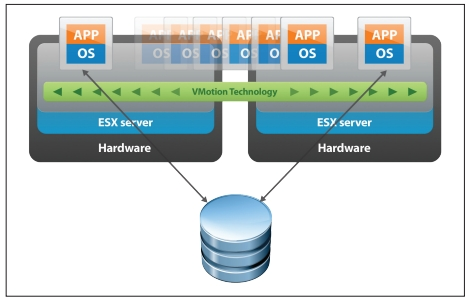

------
layout: default
title: Como?
parent: Introdução
nav_order: 3
---

## Como distribuir?

Apenas para reforçar, então, distribuir é
* dividir a computação/armazenamento em diversos componentes
* possivelmente geograficamente distribuídos
* coordenar suas ações para que resolvam a tarefa em questão de forma correta.

Com a distribuição objetiva-se
* usar recursos disponíveis nos hosts onde os componentes são executados
* e usar de redundância para garantir que o serviço sofra degradação graciosa em caso de falhas.

Para colaborar, as as diversas partes do sistema distribuído devem se comunicar.
Isto pode ser feito de diversas formas e em diversos níveis de abstração. Por exemplo:
* troca de mensagens,
* streams de dados,
* invocação remota de procedimentos
* ...

Implementar estas abstrações, para então desenvolver os sistemas distribuídos é complicado por quê os sistemas precisam ser coordenados em mínimos detalhes, a despeito das seguintes características:
* Falhas independentes
* Relógios dessincronizados
* Linguagens de desenvolvimento diferentes
* Sistemas operacionais diferentes
* Arquiteturas diferentes
* Desenvolvedores diferentes

Quero dizer, a complexidade de se implementar estas abstrações já é grande por si só. Se formos reinventar a roda a cada novo sistema, não faremos muitos avanços.
Mas, como vocês sabem, sistemas computacionais são como ogros (muito feios, às vezes), que por sua vez, são como cebolas (cheias de camadas), que nos fazem chorar quando precisamos descascá-las.

Felizmente, para cada problema que tenha que resolver, há uma boa probabilidade de que alguém já tenha atacado o problema e disponibilizado uma solução, de forma comercial ou não.
Com sistemas distribuídos, não é diferente, e no caso da comunicação entre componentes distribuídos, a solução normalmente é usar um *middleware*.

---
##### Middleware

O *middleware*  é a camada *ware* que fica no *middle*, entre, o *software* e o *hardware*. 
Software, no caso, é a aplicação distribuída, e hardware é a **abstração** do *host*  em que executam os componentes, provida pelo sistema operacional.
Uso aqui o termo **abstração** porquê o sistema operacional pode encapsular o hardware, mas também pode encapsular outra abstração hardware, por exemplo, um máquina virtual.

---
##### Middleware

> The software layer that lies between the operating system and applications on each side of a distributed computing system in a network.

---

Segundo, [Sacha Krakowiak](https://web.archive.org/web/20050507151935/http://middleware.objectweb.org/), as principais funções do middleware são:
* esconder a distribuição e o fato de que um aplicação é geralmente composta por múltiplas partes, executando em localizações geograficamente distintas,
* esconder a heterogeneidade dos vários componentes de hardware, sistemas operacionais e protocolos de comunicação
* prover interfaces uniformes, de alto nível e padronizadas para os desenvolvedores de aplicação e integradores, de forma que aplicações possam ser facilmente compostas, reusadas, portadas e feitas interoperáveis.

Assim, os middleware facilitam a conexão entre nós e permitem o uso de protocolos mais abstratos que "mandar um monte de bytes" para lá e para cá, escondendo a complexidade da coordenação de sistemas independentes.
Desenvolver sistemas distribuídos sem usar um middleware é como desenvolver um aplicativo qualquer, sem usar bibliotecas: possível, mas complicado, e estará certamente reinventando a roda. Isto é, você praticamente tem que refazer o middleware antes de desenvolver o sistema em si.

Idealmente, com o middleware se obteria transparência total do fato da aplicação estar distribuída, levando o sistema, uma coleção de sistemas computacionais (software ou hardware) independentes, a se apresentar para o usuário como **um sistema único**. 
Pense no browser e na WWW: quanto você sabe sobre as páginas estarem particionadas em milhões de servidores?

Podemos quebrar esta "transparência total" em várias transparências mais simples.
Vejamos cada uma destas separadamente.

---
##### Transparências

* Acesso
* Localização
* Relocação
* Migração
* Replicação
* Falha

---

### Transparência de Acesso

A transparência de acesso diz respeito à representação de dados e mecanismos de invocação (arquitetura, formatos, linguagens...).
Cada computador tem um arquitetura e uma forma de representar, por exemplo, números, e se dois componentes de um SD executam em máquinas com arquiteturas diferentes, como trocam números em ponto flutuante?

---
##### IEEE FP

* Half Precision (16 bit): 1 sign bit, 5 bit exponent, and 10 bit mantissa
* Single Precision (32 bit): 1 sign bit, 8 bit exponent, and 23 bit mantissa
* Double Precision (64 bit): 1 sign bit, 11 bit exponent, and 52 bit mantissa
* Quadruple Precision (128 bit): 1 sign bit, 15 bit exponent, and 112 bit mantissa

[Fonte](https://www.tutorialspoint.com/fixed-point-and-floating-point-number-representations)

---

A mesma questão é válida para representações de strings e classes, e diferenças de sistemas operacionais e linguagens.
Assim, para se tentar obter transaparência de acesso, é importante que se use padrões implementados em múltiplas arquiteturas.

---
##### Transparência de acesso

Usar padrões abertos e interfaces bem definidas.
* Sistemas bem comportados e previsíveis (RPC/ASN.1)
* Que interajam bem com outros via interfaces bem definidas (REST)
* Suportem aplicações diferentes do mesmo jeito (API)

---

### Transparência de Localização

A transparência de localização diz respeito a onde está o objeto: pouco importa ao usuário, se o serviço está dentro da mesma máquina em que acessa o serviço, se na sala do lado, ou na nuvem, do outro lado do globo, desde que o serviço seja provido de forma rápida e confiável.
A esta transparência é essencial uma boa distribuição do serviço, sobre uma rede com baixa latência, ou o uso de técnicas que permitam esconder a latência.

---
##### Escondendo a Latência

* *Caching* de dados  
  Em vez de sempre buscar os dados no servidor, mantenha cópias locais dos dados que mudam menos (e.g., o CSS do stackoverflow).
* Use de comunicação assíncrona e paralelismo
  * Em vez de validar formulário após preenchimento de cada campo, valide em paralelo enquanto usuário preenche o campo seguinte.
  * Use um callbacks para indicar campos com problemas a serem corrigidos.
* Nem todo problema é paralelizável, por exemplo, autenticação

---

Outra forma de diminuir latência é trazer para próximo do usuário parte da computação.
Isto é comumente feito com a interface com usuário,  mas pode ser usado também para outras partes do sistema. 
Como exemplo do primeiro, pense em consoles de video-game que fazem o processamento gráfico pesado na casa do usuário, de jogos online.
Como exemplo do segundo, pense em aplicativos que mantém os dados em celulares até que uma boa conexão, por exemplo WiFi, esteja disponível para sincronizar com o servidor.

---
##### Escondendo a latência

* Distribua tarefas
  * Delegue computação aos clientes 
    E.g., JavaScript e Applets Java.
  * Particione dados entre servidores 
    E.g., Domain Name Service e World Wide Web.
* Aproxime dados dos clientes
  * Mantenha cópias de dados em múltiplos lugares.
  * Atualize dados de acordo com necessidade. 
	E.g., cache do navegador.

### Transparência de Relocação

As vezes os objetos precisam ser movimentados de uma localização à outra.
Se implementadas corretamente, as técnicas que entregam transparência de localização não deixam que o cliente perceba a movimentação, no que chamamos transparência de Relocação.

---
##### Transparência Localização e Relocação

* Rede de baixa latência
* Distribuição inteligente
  * E.g: Serviços de nome
* Múltiplas cópias
  * Cópias temporárias

---

### Transparência de Migração

Do ponto de vista do próprio serviço, não perceber que se está sendo movimentado é chamado transparência de Migração.
Um serviço com esta propriedade, não precisa ser parado e reconfigurado quando a mudança acontece.
Uma das formas de se implementar esta propriedade é através da migração provida por máquinas virtuais, usado, por exemplo, para consolidar o uso de servidores em nuvens computacionais.

---
##### Transparência de Migração

---

Na verdade, a movimentação neste cenário, é uma cópia da máquina virtual. Uma vez que a cópia esteja próxima do fim, a imagem original é congelada, a cópia concluída, e há um chaveamento na rede para se direcionar toda comunicação para nova cópia. O máquina original é então descartada.

### Transparência de Replicação

A capacidade de ter cópias de um serviço e de direcionar trabalho de uma para outra é também útil para se obter transparência no caso de falhas.
Isto porquê para se manter um serviço funcional a despeito de falhas, é preciso ter múltiplas cópias, prontas para funcionar a qualquer momento.

Dependendo das garantias desejadas na manutenção da **consistência** entre as cópias, o custo pode varia muito, de forma que para se ter um custo menor, tem-se garantias mais fracas, por exemplo, que as réplicas tem um **atroso** entre elas de $X$ minutos. Este é um dilema parecido com o TCP x UDP, em que mais garantias implicam em maior custo de comunicação.

Algumas aplicações toleram inconsistências e podem viver com menores custos. Um exemplo famoso é o dos "carrinhos de compra" da [Amazon.com](https://www.allthingsdistributed.com/2008/12/eventually_consistent.html), que podem fechar pedidos com conteúdo diferente do desejado pelo cliente.

Outras aplicações são normalmente construídas com requisitos de consistência forte entre as réplicas, como sistemas financeiros.
Para estas aplicações, uma técnica importante para se conseguir replicação é o uso de frameworks de comunicação em grupo, que entregam para múltiplas instâncias de um mesmo serviço, as mesmas mensagens, permitindo que elas se mantenham como cópias.
Esta técnica funciona se os serviços forem máquinas de estado determinísticas, que consideram como eventos as mensagens entregues pelo protocolo de comunicação em grupo.

---
##### Máquina de Estados

* Comunicação em grupo
* 
* Máquina de Estados Replicada

---

---
##### Replicação x Inconsistências

* Múltiplas cópias  em sincronização  custos
* Dado precisa ser consistente entre réplicas (mesmo valor em todo lugar) 
* Protocolos de invalidação de cache.
* Muita largura de banda.
* Baixa latência.

---

### Transparência de Concorrência

Outra transparência almejável é de concorrência. 
Isto é, quem acessa um serviço deveria ser indiferente ao fato de que o mesmo pode estar sendo acessado por outros.
Isto é importante tanto em termos de segurança, no sentido de que um cliente não deveria acessar os dados do outro, caso isso seja um requisito do sistema, quanto tem termos de desempenho.
Novamente, nuvens computacionais são um exemplo de onde este tipo de transparência é essencial.

Considere um serviço de banco de dados em uma nuvem qualquer. Para prover a mesma interface com a qual usuários estão acostumados a anos, é possível que este serviço seja simplesmente um *wrapper* ao redor do SGBD que se comprava e instalava *in-house* anteriormente.
Para se tornar viável, contudo, uma mesma instância deve servir múltiplos clientes, os *tenants*, sem que a carga de trabalho introduzida por um, interfira no desempenho do outro. No meio, chamamos esta propriedade de *multi-tenancy*, mas é apenas um exemplo de transparência de concorrência.

---
##### Multi-tenancy

* 

---

Esta propriedade está fundamentalmente ligada à escalabilidade, isto é, à adequação dos pool de recursos às demandas dos clientes: se mais clientes estão presentes, então aumente a quantidade de servidores e separe as cargas; se menos clientes estão presentes, então desligue algumas máquinas e economize recursos.

---
##### Transparência Concorrência

* controle de concorrência adequado.
* mecanismos para alcançar *escalabilidade* (particionamento/*sharding*)

---

### Desafios para se obter transparência

Apesar de desejáveis, as transparência discutidas são difíceis de se conseguir, principalmente se em conjunto.
Isto porquê, do **ponto de vista de usuários** espalhados pelo globo, atrás de redes heterogêneas e com possibilidade de erros, acontecerão atrasos e perdas na comunicação, denunciando a distribuição.

Do **ponto de vista do desenvolvedor**, é preciso tomar decisões baseado em premissas ligadas à realidade da rede. Por exemplo, se uma requisição não foi respondida, quanto tempo um cliente deve esperar antes de reenviá-la, possivelmente para outro servidor, sem incorrer em risco significativo da requisição ser processada duas vezes? A resposta para esta pergunta é muito mais complicada do que pode parecer.

**De forma geral**, qualquer aumento de transparência tem um custo, seja em termos monetários (e.g., contratação de link dedicado ou de host em outra posição geográfica), ou em termos de desempenho (e.g., coordenar a entrega de mensagens em sistemas de comunicação em grupo).

Provavelmente os maiores obstáculos para se alcançar os diversos tipos de  transparência são impostos pela parte da infraestrutura que torna o sistema distribuído possível, a rede.
Para entender o porquê, vejamos algumas premissas normalmente assumidas sobre a rede que não são, definitivamente, verdade.

---
##### Armadilhas da rede

* A latência é zero.
* A largura de banda é infinita.
* A rede é confiável.
* A rede é segura.
* A rede é homogênea.
* A rede é estática.
* A rede tem acesso grátis.
* A rede é administrada por você ou alguém acessível.

---

Para terminar, deixem-me apenas retomar um termo usado acima, **escalabilidade**.
O termo está muito em voga e é usado, normalmente, para descrever a capacidade de um sistema de se adequar a variações de carga de trabalho.
Embora seja um uso válido, há outros tipos de escalabilidade.

---
##### Escalabilidade

* Escalabilidade
  * Tamanho: Número de usuários que suporta.
  * Geográfica: Região que cobre.
  * Administrativa: Número de domínios administrativos.
* Há várias possibilidades: seja específico e exija especificidade.

