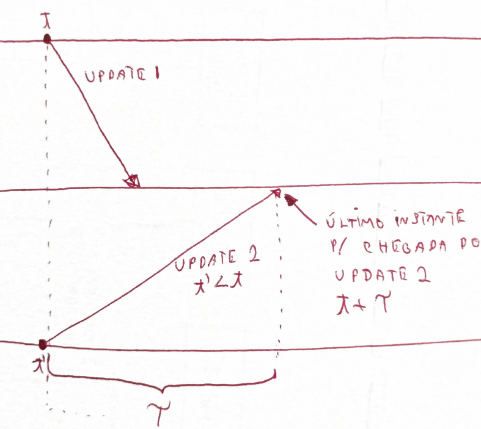
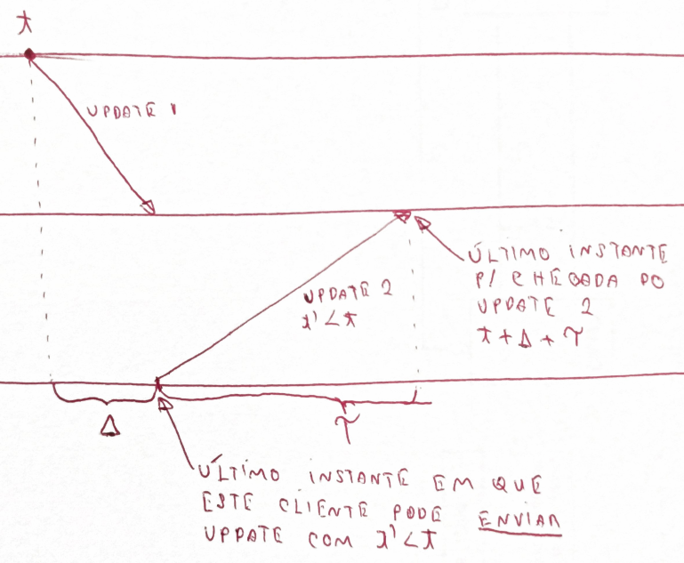

# Tempo

Se um mesmo arquivo no Dropbox é modificado em duas máquinas diferentes, enquanto as mesmas estão desconectadas, o quê acontece quando elas se reconectam?

---
##### Problema

Se dois arquivos com o mesmo nome são enviadas ao servidor, qual deve ser mantido?

---

Uma possibilidade é aceitar o arquivo que chega primeiro e rejeitar o que chega depois. Mas imagine que seu serviço esteja interessado em registrar a anterioridade de ideias anotadas nos arquivos.  Neste caso, o sistema poderia dar anterioridade ao arquivo errado, isto é, o mais recentemente criado. 

Outra abordagem, é manter janelas de aceite de arquivos, e dentro destas janelas, manter os arquivos com horário de **criação** menor. Neste caso, um trapaceiro poderia modificar seu relógico para fazer seu arquivo passar na frente.

Uma terceira abordagem é gerar uma terceira versão, com a "soma" das duas conflitantes. Para gerar esta terceira versão, faz mais sentido quebrar os arquivos em *operações de modificação*, e executar as operações de forma a chegar ao resultado final. O problema permanece, pois as operações agora devem ser ordenadas.

Em qualquer destas linhas de atuação, você tem em mãos um conflito para resolver, e autmatizar a resolução do mesmo é muito complicado. É por isso que o Dropbox deixa os dois arquivos para que o usuário analize e decida o que fazer, que servidores git permitem a submissão de apenas um conjunto de operações por vez para um mesmo repositório, e o Perforce trabalhe com *locks*  de arquivos.

De forma mais genérica, 

---
##### Problema

Se duas operações originadas em clientes são enviadas ao servidor, qual deve ser executada primeiro?

---

Alguns sistemas, contudo, tentam resolver automaticamente os conflitos. No caso do CassandraDB, usa-se

---
##### CassandraDB

*"last write wins"* ou "latest version wins"

---

Onde *last* é definido pelo relógio do cliente. Acontece que a maior parte dos nossos sistemas não dá garantias de tempo na entrega de mensagens ou processamento de instruções. Assim, temos novo problema:

---
##### Problema 

Como determinar qual foi enviada primeiro, em um sistema assíncrono?

---

Assim, precisamos encontrar uma **fonte de tempo confiável e distribuída**.
O desafio começa com o entendimento de relógios físicos.

## Relógios Físicos

---
##### Relógio de Quartzo

* Diapazão de cristal cortado a laser.
* Efeito Piezoelétrico invertido: corrente elétrica gera oscilção
* Efeito Piezoelétrico: oscilação gera impulsos
* Oscila a $32768 = 2^{15}$Hz 
* Contador conta 1 segundo por *overflow*
* Trabalha de 5 a 35 Celcius
* Tem erro de 1/2 segundo/dia
  * Frequência muda com idade
  * temperatura
  * corrente elétrica
  * imperfeições

[Fonte](https://www.explainthatstuff.com/quartzclockwatch.html)

---

Embora adequado para humanos, o erro dos relógios de quartzo é inaceitável em algumas operações computacionais. Felizmente, estes relógios podem ser corrigidos usando outras constantes físicas. 

---
##### Relógio Atômico

* relógio de quartzo gera 9.192.631.770 impulsos por segundo
* impulsos mantem cesium-133 excitado
* se número de átomos excitados cai, relógio é corrigido.
* *drift* de 1 segundo em 6.000.000 anos.

---

Uma vez que agora temos um relógio com altíssima precisão, como podemos espalhar esta informação para nossos computadores pessoais? A resposta está no UTC, Tempo Universal Coordenado (da sigla em Francês).

---
##### Tempo Coordenado Universal -- UTC (do nome em Francês)

> Nearly all UTC days contain exactly 86,400 SI seconds with exactly 60 seconds in each minute. However, because the mean solar day is slightly longer than 86,400 SI seconds, occasionally the last minute of a UTC day is adjusted to have 61 seconds. The extra second is called a leap second. It accounts for the grand total of the extra length (about 2 milliseconds each) of all the mean solar days since the previous leap second. The last minute of a UTC day is permitted to contain 59 seconds to cover the remote possibility of the Earth rotating faster, but that has not yet been necessary.

---

Abrindo um parêntese, o UTC é usado como **base** para os relógios locais, mas fatores políticos também são importantes.

---
##### Fuso-horários

[Fonte](https://commons.wikimedia.org/w/index.php?curid=42165217)

---

Mas como o UTC é definido? Com base no TAI, Tempo Atômico Internacional, calculado como a média dos valores de relógios atômicos espalhados pelo globo. O TAI mede perfeitamente a passagem do tempo, mas como a rotação da terra é irregular, medir perfeitamente não é o adequado. Assim, o UTC leva em consideração o fato do dia não ter exatamente 24 horas e, de fato, não ter duração constante. Por exemplo, após um grande terremoto o centro de massa da terra pode ser alterado e a rotação ter sua velocidade aumentada ou diminuída.

---
##### UTC
* TAI - Tempo Atômico Internacional -- média de +- 200 relógios atômicos.
* UT0 - Tempo solar, em Greenwich; observações astronômicas
* UT1 - UT0 + correções por movimento polar (terra se inclinou?)
* UT2 - UT1 + variações sazonais na rotação (placas tectônicas se movimentaram)
* UTC - Medido como TAI mas aproximado para UT0 para dar percepção de que "meio dia é meio dia"

---

Dado o UTC, temos então uma referência de tempo adequada para uso em sistemas computacionais. Nos resta ainda, propagar a referência do UTC para os sistemas. Vejamos como o tempo é mantido em um computador.

---
##### Relógios nos Computadores

* Cada computador mantém uma visão local do tempo.
* Relógio de quartzo mede a passagem de tempo.
* Bateria usada para períodos de desconexão.
* Interrupções programadas: Linux >2.6 usa 250Hz por padrão; máximo 1000Hz.
* Interrupções incrementam contador:
  * 1000Hz, 1 interrupção a cada 1ms
  * 500Hz, 1 interrupção a cada 2ms
* Contador usado como base para relógio em software $C$.

---

Este relógio em software, $C$, que usa um relógio de quartzo, impreciso, pode marcar a passagem do tempo com erro para mais ou para menos.
Embora o erro exato do relógio seja desconhecido, o mesmo pode ser limitado.

---
##### Sincronização
* C - clock
* t - tempo, ou melhor aproximação, UTC 
* $\rho$ - Clock-drift/Drift rate

$1 - \rho \leq \frac{dC}{dt} \leq 1 + \rho$.

---

Logo, dado um mecanismo de sincronização com UTC ou outra fonte confiável, podemos limitar a dessincronização com UTC.

---
##### Frequencia de Sincronização

Como garantir que dois relógios do sistema não diferirão em mais que $\delta$ unidades de tempo?

Sincronize pelo menos a cada $\frac{\delta}{2\rho}$ segundos.

---

Vejamos um exemplo:

* $\rho = 0,1$
* $\delta$ = 1s
* Após 10s, um nó com estas características se dessincronizaria em, no máximo, 1s em relação ao UTC. 
* Como cada nó poderia estar errando em "direções"  diferentes, após 5s, um nó poderia se adiantar em 0,5s enquanto o outro se atrasa pela mesma quantidade de tempo, somando 1s de diferença. Logo, eles tem que se sincronizar a cada 5s, i.e, $\frac{\delta}{2\rho} = \frac{1s}{2 \times 0,1} = \frac{1s}{0,2} = 5s$

Mas não se pode apenas ajustar o relógio para corrigir atrasos e adiantamentos. É preciso tomar certos cuidados para se garantir o funcionamento correto do sistema.

---
##### Cuidados

* Nunca voltar no tempo
* Correção gradual: acelere ou desacelere o relógio (em software)
    * Diminua/Aumente frequência de interrupção para atrasar/adiantar relógio
    * Diminua/Aumente incremento com cada interrupção
* Ajustes periódicos para fazer curvas convergirem.
* Correção após dormir será mais drástica

---

Até agora definimos que relógios podem ser sincronizados com UTC, pois é uma boa aproximação do tempo percebido por nossos sentidos, e a frequência com que a sincronização deve acontecer. Contudo, falta ainda definir o protocolo pelo qual a sincronização é feita e exatamente com quem, uma vez que simpleste UTC é muito genérico. Comecemos com "quem". Em um extremo, sincronize com relógios atômicos em satélites GPS

---
##### Sincronizar com quem? GPS

  * Coloque um receptor GPS em cada nó.
  * Tenha erro de 0,1ns a 1ms do UTC.

---

Receptores GPS, com seus relógios sincronizados com os dos satélites, que difundem regularmente sua posição e o instante em que a difusão é feita, determinam sua posição relativa aos satélites, em uma técnica conhecida como trilateração.

Baseado na informação de um satélite, o receptor determina sua distância ao mesmo e, portanto, determina que está em uma esfera no entorno do satélite.
Combinando a informação de 2 satélites, a posição do receptor é limitada a uma circunferência, isto é, a interseção de duas esferas. 
Com um terceiro satélite, a posição é reduzida a dois pontos, a interseção de uma esfera e uma circunferência, sendo um no espaço e que pode ser facilmente descartado. 

---
##### Trilateração

---

Como dito, a trilateração consiste em determinar a distância do receptor em termos dos eixos $x$, $y$ e $z$ em relação a cada um dos satélites. Contudo, para que funcione, relógios precisam estar sincronizados, o que é exatamente o problema que estamos tentando resolver. 
Para contornar esta restrição, usa-se um quarto satélite, para determinar a distância no "eixo temporal".

Apesar da queda dos preços dos receptores, colocar um GPS em cada dispositivo pode ser custoso demais. Em vez disso, podemos usar um recurso amplamente disponível, redes de computadores, e sincronizar com outra máquina, que fez o investimento necessário para manter o erro baixo.

---
##### Sincronizar com quem? Outra máquina

* Pergunte que horas são.
* Use a resposta para ajudar o relógio local.
* Considere o erro introduzido pela latência variável da rede.

---

#### Algoritmo de Cristian

Assumindo que o relógio da máquina se sincronizando, $M_1$, é bom o suficiente para medir a passagem de tempo em períodos curtos, mesmo que tenha uma *drift* rate considerávem em períodos mais longos, execute o seguinte protocolo para se sincronizar com $M_2$.

---
##### Algoritmo de Cristian

* $M_1$ rergunta "que horas são?" - $t_0$
* $M_2$ recebe pergunta - $t_1$
* $M_2$ anota o valor do relógio - $t_s$
* $M_2$ envia resposta - $t_2$
* $M_1$ recebe resposta - $t_3$

* Assuma $t_1 = t_s = t_2$

* Assuma $\frac{t_3-t_0}{2}$ como o tempo de transmissão da resposta (média da ida e da volta)
* $M_1$ ajusta relógio para $t_c = t_s + \frac{t_3-t_0}{2}$

---

Mas e a aproximação $\frac{t_3-t_0}{2}$, é boa?
Podemos estimar o erro que ela introduz na sincronização, caso as mensagens tenham tempos de ida e volta assimétricos. Apesar das diferenças no tempo de ida e volta, existe um tempo mínimo para o tráfego em cada um dos sentidos, $T_{min}$.

 

---
##### Erro máximo?

Tempo mínimo de transmissão: $T_{min}$

[Fonte](https://www.cs.rutgers.edu/~pxk/417/notes/content/05-clock-synchronization-slides.pdf)

---

Há dois casos extremos de erro na estimativa.
No primeiro caso, dado um tempo de ida + volta igual a $T_1 - T_0$, na figura, a mensagem de ida trafega no tempo mínimo e a volta lentamente. Neste caso, a estimativa $\frac{t_3-t_0}{2}$ é menor que o tempo de volta real.
No segundo caso, a mensagem de ida trafega lentamente e a de volta no tempo mínimo, levando $\frac{t_3-t_0}{2}$ a ser maior que tempo de transmissão real da mensagem.
O erro, contudo, está limitado à faixa amarela no desenho, que tem duração $T_1 - T_0 - 2T_{min}$. O erro então varia de mais ou menos metade deste valor. 

#### Algoritmo de Berkeley

Enquanto o algoritmo de Cristian permite sincronizar um nó com uma fonte, outro algoritmo, de Berkeley, permite sincronizar múltiplos nós uns com os outros. Este algoritmo funciona assim:

---
##### Algoritmo de Berkeley

* Premissas
    * Não há fonte da verdade
    * Sintonização em vez de sincronização (sincronização interna x externa)
    * Todos convergem para média
    * Todos executam ``time d\ae mon''
    * Mestre e escravos

* Algoritmo
    * Mestre requisita relógio de cada escravo
    * Relógios ajustados com algoritmo de Cristian
    * Computa média
    * Envia ajuste para cada escravo
    
    

* Importante
    * Ignora \emph{outliers}
    * Mestre pode ser substituído facilmente

---

Embora interessantes, estes algoritmos não são normalmente usados, pelo menos não em sua forma "pura", em sistemas computacionais. Em vez deles, usamos o Network Time Protocol (NTP).

---
##### Network Time Protocol

* 1991/1992: RFC 1305
* 2010: RFC 5905-5908 -- IPv6, 10s ms de acurácia
* Uso na Internet
* Sincronização com UTC
* Estatística permite minimizar erros
* Tolerante a falhas: caminhos redundantes; servidores redundantes
* Escalável: modelo hierárquico
* Seguro: usa autenticação

---

Os diversos componentes do NTP são organizados em camadas, ou estrata, de forma que a informação do tempo flui da camada 0 (stratum 0) até a camada 15 (stratum 15).
Os componentes não estão presos a camadas, que podem ser alteradas a medida que falhas acontecem e são dedicadas, e novos caminhos são encontrados usando-se um algoritmo de árvore geradora mínima.

---
##### Network Time Protocol

[Fonte: Benjamin D. Esham, (bdesham) - Based upon Ntp.png by Kim Meyrick](https://commons.wikimedia.org/w/index.php?curid=2815097)

* Stratum 0: relógios atômicos/receptores GPS
* Stratum 1: ms to stratum 0
* Stratum 2: contata múltiplos stratum 1 e pares
* Strata 3...15
* Stratum 16: dessincronizado
* Bellman-Ford: árvore geradora mínima para stratum 1

---

O sítio do Comitê Gestor da Internet, CGI, tem uma entrada muito boa sobre o NTP, [NTP.br](https://ntp.br/ntp.php).
De forma resumida, o NTP trabalha em diferentes modos, que permitem aos nós receberem informações de fontes de tempo das camadas superiores ou de pares, filtrar estas informações para escolher as mais confiáveis, e ajustar o relógio local de acordo com a filtragem.

---
##### Modos de trabalho do NTP

* Modo multicast: propaga tempo em rede local
* RPC: algoritmo de Cristian
* Simétrico: parecido com Berkeley

---

Na prática, boa parte dos dispositivos usa uma versão simplificada do NTP, adequada aos nós nas folhas da hierarquia. O SNTP é essencialmente o algoritmo de Cristian.

---
##### Simple NTP

* Versão simplificada do NTP
* Recomendado para folhas da árvore
* $\delta = (t_4-t_1)-(t_2-t_3)$
* $t = \frac{(t_2-t_1)+(t3-t_4)}{2}$
* $t_c = t_4+t$

---

Veja um exemplo do ajuste de um relógio usando SNTP.

---
##### Exemplo do SNTP

* $t_1 = 1100, t_2 = 800, t_3=850, t_4=1200$
* $t = ((800-1100)+(850-1200))/2 = (-300 -350)/ = -325$
* $t_c = 1200-325 = 875$

---

Mais recentemente foi proposta um novo protocolo de sincronização de relógios com melhor qualidade de servço,  Precision Time Protocol, PTP.

---
##### PTP - Precision Time Protocol

* IEEE 1588
* LAN
* sub $\mu s$ (versus ordem de $ms$ no NTP)

* Escolha mestre
	* Administrador
	* Classe do relógio
	* Acurácia do relógio
	* Variância do relógio
	* Identificador
* Como algoritmo de Cristian, mas quem ajusta não é quem inicia.

---

Assumindo que tenhamos sincronizado os relógios de um sistema computacional, o que podemos fazer agora? Há uma série de problemas interessantes que podem ser resolvidos.

---
##### Usos de relógios sincronizados

* autenticação
* terminação de transações 
* alocação de ``leases''.
* outros exemplos, [Liskov, B. Distrib Comput (1993) 6: 211. doi:10.1007/BF02242709](http://rdcu.be/s4iy)

---

Um exemplo interessante é a ordenação de eventos em um banco de dados.
Para entender este problema, considere o seguinte cenário.

---
##### Sistema Bancário

Se os comandos chegam primeiro para a replica mais próxima e são executados na ordem em que chegam, temos inconsistências entre as réplicas (p.e., assuma que update 1 é "atualize para 10" e 2 é "atualize para 20")

---

Assim, precisamos ordenar os comandos!
Nos foquemos em apenas uma réplica.
Assuma que relógios estão **perfeitamente** sincronizados, que o tempo de propagação máximo de uma mensagem é $\tau$, e que toda mensagem/update carrega o *timestamp* de quando foi enviada consigo.
Considere o seguinte proposta:
Réplicas processam mensagens na ordem que foram enviadas, o que pode ser identificado pelos seus timestamps.
Em outras palavras, ao receber uma mensagem com timestamp $t$, uma réplica espera até ter certeza de que 

---
##### Ordenação de Requisições

* Relógios **perfeitamente** sincronizados
* $\tau$.
* Cliente 1 envia mensagem Update1 no instante $t$.
* Ao receber Update1 com timestamp $t$, a réplica deve esperar para executar o update?

    

    O último instante em que qualquer mensagem com timestamp $t' < t$ pode ser recebido pela réplica é $t+\tau$, pois qualquer mensagem recebida em $t''> t+\tau'$, precisa ter sido enviada após $t$, e portanto terá timestamp $> t$. 

---

Implementar este protocolo é muito simples:

  * Toda mensagem recebida é colocada em uma fila ordenada por *timestamp*.
  * Quando o relógio marcar um tempo maior que $t + \tau$, onde $t$ é o timestamp da mensagem na cabeça da fila, execute tal mensagem e a retire da fila.

Entretanto, este protocolo não leva em consideração a dessincronização inerente dos relógios em um sistema distribuído. Como fazê-lo, supondo uma divergência máxima de $\Delta$ entre quaisquer dois relógios, algo que pode ser arranjado, como visto antes, sincronizando-se os relógios a cada $\frac{\Delta}{2*\rho}$.

Se $\Delta$ é a diferença máxima entre relógios, então após o uma mensagem ser enviada com timestamp $t$, até $\Delta$ depois, outro processo, atrasado em relação ao primeiro, poderá enviar uma mensagem com timestamp $t' < t$. Tal mensagem pode demorar até $\tau$ para ser entregue à réplica, ou seja, no instante $t + \tau + \Delta$, do ponto de vista do primeiro cliente.

Se a réplica estiver sincronizada com cliente, então se esperar até $t + \tau + \Delta$ para executar o comando, o fará de forma segura. Se estiver atrasada em relação ao primeiro cliente, então acabará por esperar além do necessário, mas sem violar a corretude do sistema.

Finalmente, se a réplica estiver adiantada em relação ao primeiro cliente, então seu relógio alcançará $t + \tau + \Delta$ antes do relógio do primeiro cliente, mas isso não é um problema. Isto porquê, o último instante em que o cliente 2 poderá enviar uma mensagem com timestamp $t' < t$ é o instante em que o relógio da réplica marcar $t + \Delta$, e portanto deverá também ser recebido até que o mesmo relógio marque $t + \tau + \Delta$. 

---
##### Ordenação de Requisições

* Relógios **dessincronizados**
* $\tau$.
* $\Delta$

O último instante em que qualquer mensagem com timestamp $t' < t$ pode ser recebido pela réplica é $t+\tau + \Delta$, pois qualquer mensagem recebida em $t''> t+\tau + \Delta'$, precisa ter sido enviada após $t+\Delta$, e portanto terá timestamp $> t$. 

---

O mesmo raciocínio pode ser usado para definir um protocolo de acesso recursos para os quais *leases* são distribuídos, onde um *lease*  é uma permissão de acesso durante uma janela de tempo, emitida por um coordenador (possivelmente eleito usando os algoritmos vistos anteriormente), e $\Delta$ é o máximo de dessincronismo entre os relógios. 
O seguinte protocolo resolve este problema:

---
##### Lease

* $$\Delta$$ - dessincronização máxima.
* Ao receber um *lease* para a janela de tempo $t_1$ a $t_2$
    * espera até $t_1 + \Delta$
    * usa o recurso até $t_2$.

* Se relógio estiver adiantado em relação ao cliente anterior, vai achar que é $t_1+\Delta$ enquanto o anterior acha que é $t_1$; exclusão mútua garantida.
* Se relógio estiver atrasado em relação ao cliente anterior, vai achar que é $t_1 - \Delta$, e continua esperando, enquanto ele acha que já é $t_1$ e para de usar; exclusão mútua garantida.
* Recurso fica ocioso por $\Delta$, em média, a cada lease. 

---

Devido ao alto custo de se manter o recurso não utilizado, $\Delta$ deve ser feito tão pequeno quanto possível. Leia [Google True Time e Spanner](https://cloud.google.com/spanner/docs/true-time-external-consistency) para como o Google consegue manter a diferença em sub milisegundos, usando relógios atômicos dentro de seus datacenters e um API para geração de timestamps.
